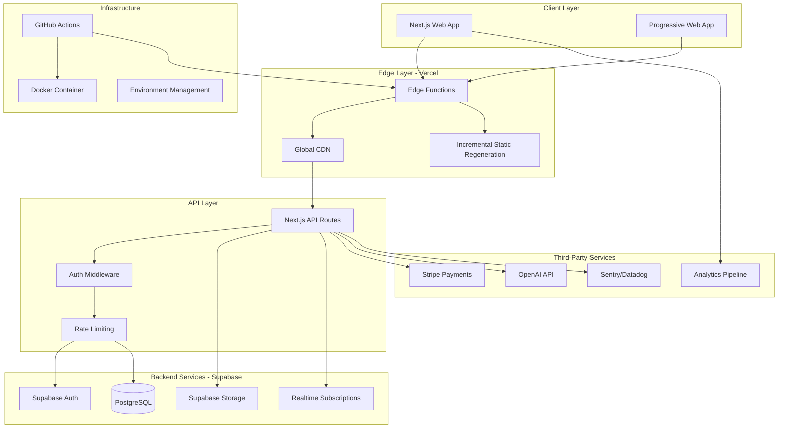
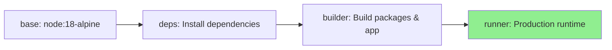
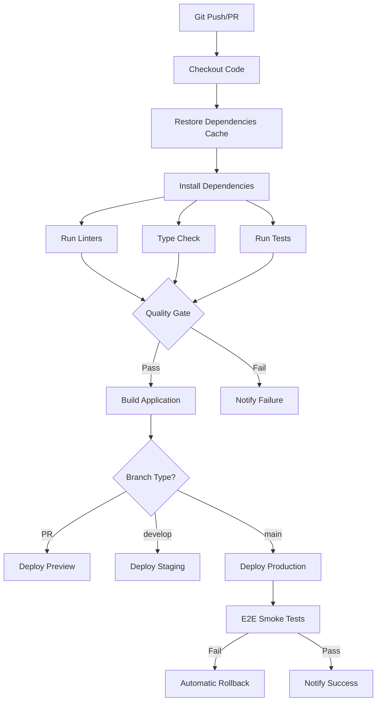
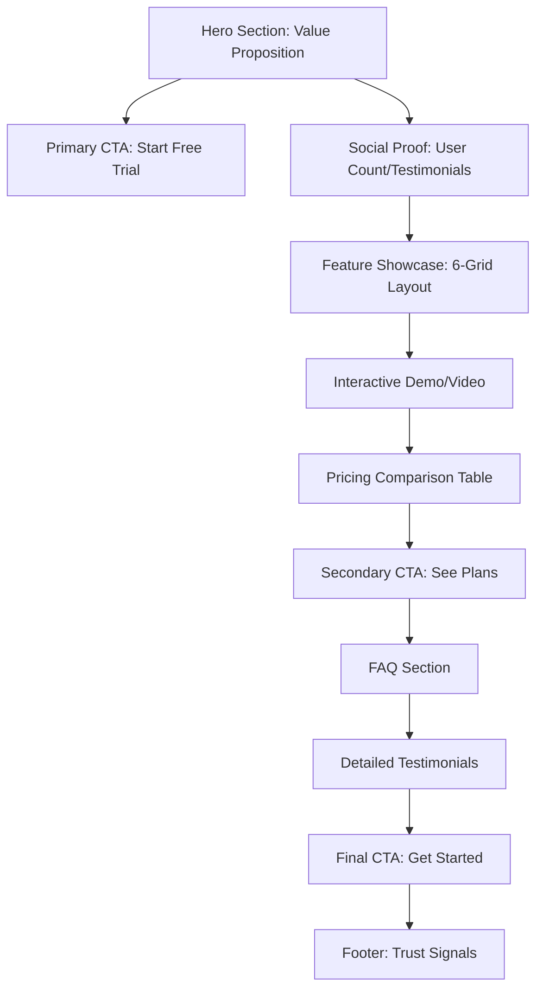
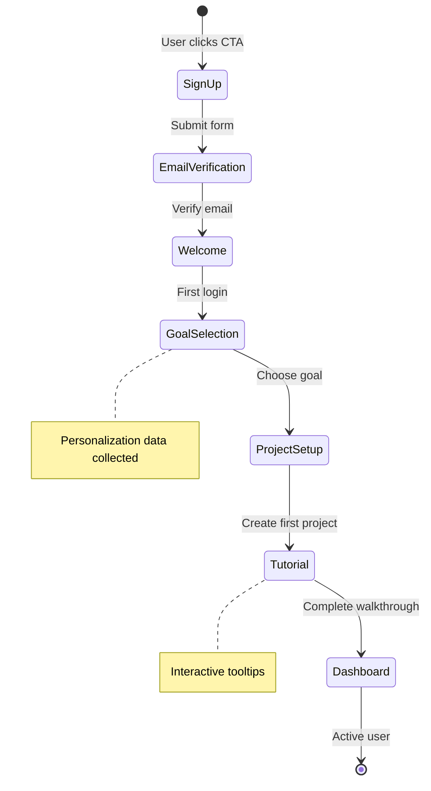
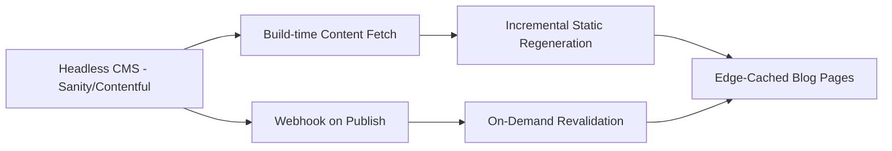
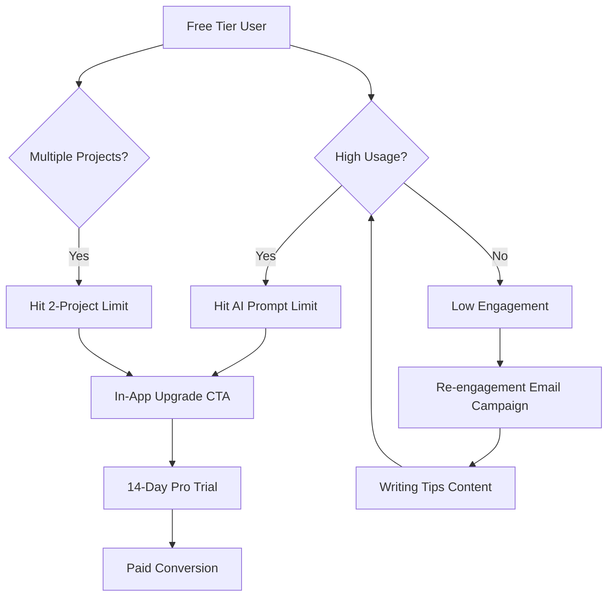
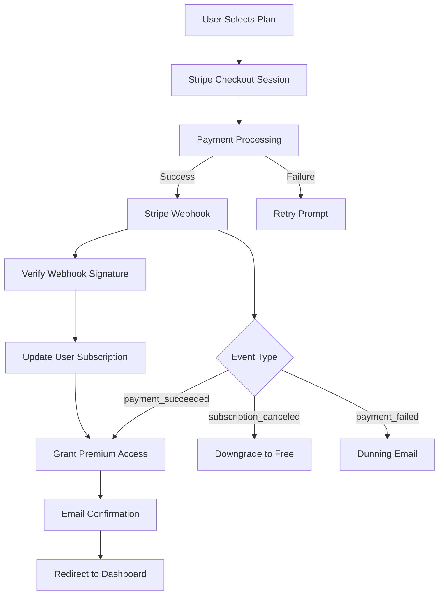
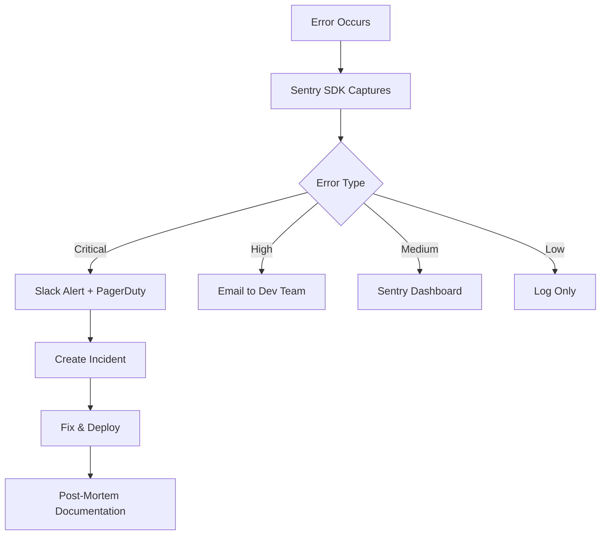
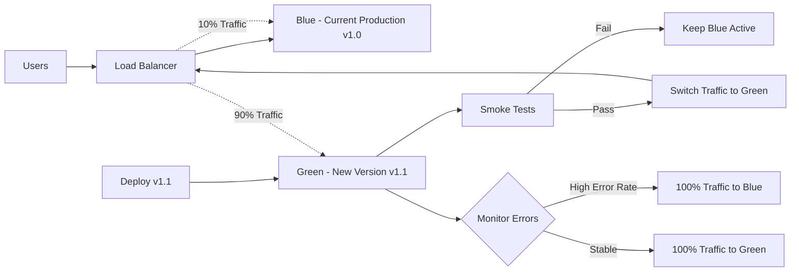

# WorldBest Platform: Enterprise Deployment & Business Optimization Design

## 1. Overview

### 1.1 Purpose
This design document addresses critical deployment failures and establishes a strategic roadmap to transform WorldBest from a development-stage application into a production-grade, conversion-optimized SaaS platform capable of driving organic traffic and sustainable revenue growth.

### 1.2 Business Context
WorldBest is positioned as an AI-powered writing platform targeting professional authors, content creators, and storytelling enthusiasts. The current deployment exhibits fundamental infrastructure gaps, UX deficiencies, and missing business-critical features that prevent market competitiveness and user acquisition.

### 1.3 Core Problems Identified

| Problem Category | Current State | Business Impact | Priority |
|-----------------|---------------|-----------------|----------|
| **Deployment Infrastructure** | Incomplete Docker/Vercel configuration, monorepo path misalignment | Application fails to build/run in production | Critical |
| **User Experience** | Basic landing page, no onboarding flow, minimal conversion optimization | High bounce rate, low signup conversion | Critical |
| **Technical Architecture** | Inconsistent state management, fragile WebSocket auth, duplicate API clients | Poor performance, frequent errors, developer inefficiency | High |
| **SEO & Marketing** | No meta tags, sitemap, analytics, or content strategy | Zero organic discovery, no growth metrics | High |
| **Business Model** | Pricing strategy defined but not integrated, no payment flow | No revenue generation capability | Critical |
| **Scalability** | No caching, CDN, or performance optimization | Cannot handle traffic growth | High |

### 1.4 Success Criteria

**Technical Excellence (10/10 Standards)**
- Zero-downtime deployment pipeline with automated rollback
- 99.9% uptime SLA with comprehensive monitoring
- Lighthouse Performance Score ≥95 across all pages
- Sub-2-second page load times globally
- Full test coverage (≥85%) with automated quality gates

**Business Performance**
- Landing page conversion rate ≥5% (industry standard: 2-5%)
- Organic traffic growth infrastructure (SEO, content marketing)
- Payment integration with subscription management
- User onboarding completion rate ≥60%
- Customer acquisition cost tracking and optimization

---

## 2. Architecture

### 2.1 System Architecture Overview



### 2.2 Deployment Architecture Strategy

**Multi-Environment Strategy**

| Environment | Purpose | Infrastructure | Deployment Trigger |
|-------------|---------|----------------|-------------------|
| **Development** | Local development, rapid iteration | Local Node.js + Supabase local | Manual (`pnpm dev`) |
| **Preview** | PR testing, stakeholder review | Vercel Preview Deployments | Automatic on PR creation |
| **Staging** | Pre-production validation, QA testing | Vercel Production (separate project) | Merge to `develop` branch |
| **Production** | Live customer-facing application | Vercel Production + CDN | Merge to `main` branch |

**Infrastructure Decision Matrix**

| Component | Technology Choice | Rationale |
|-----------|------------------|-----------|
| **Hosting** | Vercel | Native Next.js optimization, global edge network, zero-config deployments |
| **Database** | Supabase PostgreSQL | Managed service, built-in auth, real-time capabilities, connection pooling |
| **CDN** | Vercel Edge Network | Automatic, 70+ global locations, instant cache purging |
| **Container Registry** | GitHub Container Registry | CI/CD integration, private registry, free for private repos |
| **Secrets Management** | Vercel Environment Variables + GitHub Secrets | Encrypted at rest, environment-specific isolation |
| **Monitoring** | Vercel Analytics + Sentry | Performance monitoring + error tracking |

### 2.3 Monorepo Structure Resolution

**Current Issue**: Docker and build processes reference incorrect paths (`apps/web/` vs root structure)

**Corrected Structure**

```
worldbest-deploy/
├── src/                          # Application source (correct)
├── packages/                     # Shared packages (correct)
│   ├── shared-types/
│   └── ui-components/
├── .next/                        # Build output (generated)
├── public/                       # Static assets
├── Dockerfile                    # Updated with correct paths
└── vercel.json                   # Enhanced configuration
```

**Build Path Mapping**

| Build Stage | Source Path | Destination Path |
|-------------|-------------|------------------|
| Dependencies | `./package.json`, `./packages/*/package.json` | `/app/node_modules` |
| Build | `./src/`, `./packages/` | `/.next/` |
| Production | `/.next/standalone`, `/.next/static`, `/public` | Runtime directory |

---

## 3. Deployment Infrastructure Design

### 3.1 Docker Configuration Enhancement

**Multi-Stage Build Strategy**



**Stage Definitions**

| Stage | Purpose | Optimization | Output Size |
|-------|---------|--------------|-------------|
| **base** | Common Alpine + pnpm setup | Single layer for all stages | ~150MB |
| **deps** | Dependency installation with lock file | Cached unless dependencies change | ~400MB |
| **builder** | TypeScript compilation, Next.js build | Parallel package builds | ~800MB |
| **runner** | Minimal production image | Only production dependencies + standalone output | ~200MB |

**Critical Fixes Required**

1. **Path Correction**: Remove all references to `apps/web/` and use correct root-level structure
2. **Standalone Output**: Enable Next.js standalone mode in `next.config.js`
3. **Package Build Order**: Ensure shared packages build before main application
4. **Health Checks**: Add Docker HEALTHCHECK for container orchestration

### 3.2 Vercel Configuration Enhancement

**Enhanced `vercel.json` Specification**

| Configuration | Purpose | Value |
|--------------|---------|-------|
| **framework** | Framework detection | `"nextjs"` |
| **buildCommand** | Custom build with package compilation | `"pnpm install && pnpm build"` |
| **installCommand** | pnpm-specific installation | `"pnpm install --frozen-lockfile"` |
| **headers** | Security headers (CSP, HSTS, etc.) | Defined per route |
| **redirects** | SEO-friendly URL management | Root to dashboard (authenticated) |
| **rewrites** | API proxy configuration | External backend endpoints |
| **regions** | Geographic deployment | `["iad1", "sfo1"]` (US East/West) |
| **crons** | Scheduled functions | Analytics aggregation, cleanup tasks |

**Environment Variable Strategy**

| Category | Variables | Scope | Security |
|----------|-----------|-------|----------|
| **Database** | `POSTGRES_URL`, `POSTGRES_PRISMA_URL` | All environments | Encrypted |
| **Auth** | `SUPABASE_JWT_SECRET`, `SUPABASE_SERVICE_ROLE_KEY` | Server-side only | Restricted access |
| **Public** | `NEXT_PUBLIC_SUPABASE_URL`, `NEXT_PUBLIC_API_URL` | Client + Server | Public (non-sensitive) |
| **Payments** | `STRIPE_SECRET_KEY`, `STRIPE_WEBHOOK_SECRET` | Server-side only | Encrypted |
| **AI Services** | `OPENAI_API_KEY` | Server-side only | Encrypted |

### 3.3 CI/CD Pipeline Design

**GitHub Actions Workflow**



**Deployment Quality Gates**

| Gate | Check | Failure Action |
|------|-------|----------------|
| **Linting** | ESLint with Next.js config | Block deployment |
| **Type Safety** | TypeScript compilation | Block deployment |
| **Unit Tests** | ≥85% coverage | Block deployment |
| **Build Verification** | Successful Next.js build | Block deployment |
| **Bundle Size** | <350KB gzipped | Warning (block if >500KB) |
| **Lighthouse CI** | Performance ≥90 | Warning (block if <70) |

---

## 4. User Experience & Conversion Optimization

### 4.1 Landing Page Enhancement Strategy

**Conversion-Optimized Landing Page Architecture**



**Section-by-Section Optimization**

| Section | Current State | Enhanced Design | Expected Impact |
|---------|---------------|-----------------|-----------------|
| **Hero** | Generic headline, single CTA | Benefit-driven headline with subheadline, dual CTA (Start Free / Watch Demo), animated hero image | +30% engagement |
| **Social Proof** | Static testimonials | Dynamic user count, rotating testimonials, brand logos (if B2B), trust badges | +15% credibility |
| **Features** | Text-only grid | Icon + GIF demonstrations, benefit-focused copy, "Learn More" expandable | +25% comprehension |
| **Demo** | Missing | Embedded 60-second product tour video or interactive walkthrough | +40% conversion intent |
| **Pricing** | Static cards | Comparison table, annual discount highlight, "Most Popular" badge, feature tooltips | +20% plan selection |
| **FAQ** | Missing | 8-10 common objections addressed, expandable accordion | -15% support burden |
| **Final CTA** | Repetitive "Get Started" | Urgency-driven ("Join 10,000+ writers") with limited-time offer | +10% conversions |

**Copy Optimization Principles**

- **Value-First**: Lead with outcomes ("Finish your novel 3x faster") not features ("AI-powered editor")
- **Clarity**: 8th-grade reading level, active voice, scannable bullet points
- **Urgency**: Limited-time free trial, countdown timers for promotions
- **Trust**: Security badges, GDPR compliance, testimonials with real photos

### 4.2 Onboarding Flow Design

**Multi-Step Onboarding Journey**



**Onboarding Step Specification**

| Step | Purpose | Data Collected | Completion Criteria | Drop-off Prevention |
|------|---------|----------------|---------------------|---------------------|
| **1. Sign Up** | Account creation | Email, password, name | Form submission | Social login options (Google, GitHub) |
| **2. Email Verification** | Prevent spam, ensure reachability | None | Click verification link | Auto-resend after 60s, alternative phone verification |
| **3. Welcome Screen** | Set expectations, reduce anxiety | None | Click "Get Started" | Skip option visible |
| **4. Goal Selection** | Personalize experience | Writing goal (novel, screenplay, blog) | Select one option | "Not sure yet" option |
| **5. First Project** | Create tangible progress | Project name, genre | Create project | Pre-filled templates based on goal |
| **6. Interactive Tutorial** | Teach core features | None | Complete 3 tasks | Progress bar, ability to skip/revisit |
| **7. Dashboard Arrival** | Celebrate success | None | View dashboard | Confetti animation, achievement badge |

**Onboarding Metrics**

| Metric | Target | Measurement Method |
|--------|--------|-------------------|
| **Completion Rate** | ≥60% | Users reaching step 7 / Users starting step 1 |
| **Time to Value** | <5 minutes | Median time to create first project |
| **Drop-off Points** | <15% per step | Funnel analysis in analytics |

### 4.3 Performance Optimization

**Performance Budget**

| Metric | Budget | Current (Estimated) | Strategy |
|--------|--------|---------------------|----------|
| **First Contentful Paint (FCP)** | <1.2s | ~2.5s | Image optimization, font preloading, critical CSS |
| **Largest Contentful Paint (LCP)** | <2.0s | ~3.5s | Hero image lazy loading, CDN, code splitting |
| **Time to Interactive (TTI)** | <3.0s | ~5.0s | Remove unused JavaScript, defer non-critical scripts |
| **Cumulative Layout Shift (CLS)** | <0.1 | ~0.2 | Reserve space for images, avoid dynamic content insertion |
| **Total Blocking Time (TBT)** | <200ms | ~400ms | Code splitting, Web Workers for heavy computation |
| **Total Bundle Size** | <300KB | ~450KB | Tree shaking, dynamic imports, remove duplicate dependencies |

**Optimization Techniques**

1. **Image Optimization**
   - Next.js `<Image>` component with automatic WebP conversion
   - Responsive images with `srcset` for different screen sizes
   - Lazy loading for below-fold images
   - Cloudinary/Imgix integration for dynamic resizing

2. **Code Splitting Strategy**
   - Route-based splitting (automatic with Next.js App Router)
   - Component-level splitting for heavy components (editor, charts)
   - Dynamic imports for modals, tooltips, and non-critical UI

3. **Caching Strategy**
   - Static assets: 1-year cache with immutable hashing
   - API responses: SWR (stale-while-revalidate) with 60s TTL
   - Database queries: React Query with 5-minute cache
   - ISR for landing page: Regenerate every 1 hour

4. **Font Loading**
   - System fonts as fallback
   - Preload critical fonts with `font-display: swap`
   - Subset fonts to include only used characters

---

## 5. SEO & Organic Growth Strategy

### 5.1 Technical SEO Implementation

**Meta Tag Architecture**

| Page Type | Title Template | Description Length | OG Image |
|-----------|----------------|-------------------|----------|
| **Landing** | "WorldBest - AI Writing Platform for Authors" | 150-160 chars | Branded hero image (1200x630) |
| **Features** | "[Feature] - WorldBest" | 140-155 chars | Feature-specific visual |
| **Pricing** | "Pricing Plans - WorldBest" | 145-160 chars | Pricing comparison graphic |
| **Blog** | "[Post Title] - WorldBest Blog" | 150-160 chars | Post featured image |

**Structured Data (JSON-LD)**

| Schema Type | Application | Purpose |
|-------------|-------------|---------|
| **Organization** | All pages | Brand identity, logo, social profiles |
| **WebApplication** | Landing page | Software app metadata, ratings, pricing |
| **Product** | Pricing page | Subscription plans, offers, reviews |
| **Article** | Blog posts | SEO-enhanced content, author, publish date |
| **FAQPage** | FAQ section | Rich snippets in search results |

**Sitemap Strategy**

- **Dynamic XML Sitemap**: Auto-generated from route structure
- **Priority Weighting**: Landing (1.0), Features (0.8), Blog (0.7), Other (0.5)
- **Change Frequency**: Landing (daily), Features (weekly), Blog (daily), Other (monthly)
- **Image Sitemap**: Separate sitemap for all optimized images
- **Submission**: Auto-submit to Google/Bing on deployment via API

### 5.2 Content Marketing Infrastructure

**Blog System Architecture**



**Content Pillar Strategy**

| Content Pillar | Target Keywords | Monthly Posts | Traffic Goal (6 months) |
|----------------|-----------------|---------------|-------------------------|
| **Writing Tips** | "how to write", "writing techniques" | 4 posts | 5,000 organic visits/month |
| **AI Writing** | "AI writing tools", "AI for authors" | 3 posts | 3,000 organic visits/month |
| **Publishing** | "self-publishing guide", "book marketing" | 2 posts | 2,000 organic visits/month |
| **Worldbuilding** | "worldbuilding tips", "character development" | 3 posts | 4,000 organic visits/month |

**SEO Content Requirements**

- **Word Count**: 1,500-2,500 words (long-form)
- **Keyword Density**: 1-2% for primary keyword
- **Internal Links**: 3-5 to product pages/features
- **External Links**: 2-3 to authoritative sources
- **Media**: 1 hero image + 2-3 supporting images/diagrams
- **Reading Level**: Flesch reading ease score >60

### 5.3 Analytics & Tracking Implementation

**Analytics Stack**

| Tool | Purpose | Key Metrics |
|------|---------|-------------|
| **Vercel Analytics** | Core web vitals, page performance | LCP, FID, CLS, page load time |
| **Google Analytics 4** | User behavior, traffic sources | Sessions, bounce rate, conversion rate |
| **Hotjar/Microsoft Clarity** | User session recordings, heatmaps | Click patterns, scroll depth |
| **Mixpanel/Amplitude** | Product analytics, funnel tracking | Feature adoption, retention cohorts |
| **Stripe Analytics** | Revenue metrics, churn analysis | MRR, LTV, churn rate |

**Conversion Tracking Events**

| Event | Trigger | Purpose |
|-------|---------|---------|
| `page_view` | Every page load | Traffic analysis |
| `cta_click` | CTA button click | Conversion intent |
| `signup_start` | Sign-up form view | Top-of-funnel |
| `signup_complete` | Account creation | Conversion |
| `email_verified` | Email verification | Activation |
| `onboarding_step` | Each onboarding step | Funnel optimization |
| `first_project_created` | Project creation | Time-to-value |
| `subscription_started` | Payment completed | Revenue |
| `feature_used` | Feature interaction | Product adoption |

---

## 6. Business Model Integration

### 6.1 Subscription Tier Architecture

**Pricing Model**

| Tier | Price | Target Segment | Key Differentiators | Expected Conversion |
|------|-------|----------------|---------------------|---------------------|
| **Story Starter** | $0/month | Curious writers, students | 2 projects, 10 AI prompts/day, community support | 100% (signup) |
| **Solo Author** | $15/month | Hobbyist writers, indie authors | 10 projects, unlimited AI, export features | 5-8% from free |
| **Pro Creator** | $35/month | Professional writers, agencies | Unlimited projects, custom AI, API access, priority support | 1-2% from free, 15-20% from Solo |
| **Enterprise** | Custom | Publishing houses, writing platforms | Custom integrations, SLA, dedicated support | Outbound sales |

**Freemium Conversion Strategy**



**Upgrade Trigger Points**

| Trigger | Message | Upgrade Incentive | Timing |
|---------|---------|-------------------|--------|
| **AI Prompt Limit** | "You've used 10/10 AI prompts today" | "Upgrade for unlimited prompts + 14-day trial" | After 10th prompt |
| **Project Limit** | "Create unlimited projects with Solo Author" | "First month 50% off" | When creating 3rd project |
| **Export Attempt** | "Export to ePub/PDF available on Solo Author" | "Try free for 14 days" | Click export button |
| **Day 7 Email** | "Get the most out of WorldBest" | "Unlock premium features" | 7 days after signup |

### 6.2 Payment Integration Design

**Stripe Integration Architecture**



**Subscription Management Features**

| Feature | User Action | Backend Process | Email Trigger |
|---------|-------------|-----------------|---------------|
| **Upgrade** | Select higher tier | Prorate current period, immediate upgrade | "Welcome to [Plan]" |
| **Downgrade** | Select lower tier | Schedule downgrade at period end | "Your plan will change on [date]" |
| **Cancel** | Cancel subscription | Access until period end, then downgrade | "Your subscription will end on [date]" |
| **Reactivate** | Resume subscription | Immediate access, charge immediately | "Welcome back" |
| **Update Payment** | Change card | Update Stripe customer | "Payment method updated" |
| **Pause** | Temporarily pause | Pause billing for 1-3 months | "Subscription paused" |

**Billing Error Handling**

| Error Type | User Experience | Retry Logic | Resolution Path |
|------------|-----------------|-------------|-----------------|
| **Card Declined** | In-app banner + email | 3 retries over 7 days | Update payment method |
| **Insufficient Funds** | Friendly error message | 2 retries over 5 days | Email reminder |
| **Expired Card** | Proactive email 7 days before expiry | None | Update card |
| **Fraud Detection** | Payment blocked, manual review | None | Contact support |

### 6.3 Revenue Optimization Strategies

**Annual Plan Incentive**

- **Discount**: 20% off (equivalent to 2 months free)
- **Positioning**: "Save $36/year" vs. "20% off"
- **CTA**: "Switch to Annual" in billing settings
- **Expected Impact**: 30-40% of paid users opt for annual

**Add-On Revenue Streams**

| Add-On | Price | Target User | Revenue Potential |
|--------|-------|-------------|-------------------|
| **Extra AI Tokens** | $10/month for +10,000 tokens | Power users hitting limits | +15% ARPU |
| **Priority Support** | $25/month | Professional users | +8% ARPU |
| **Custom AI Model Training** | $100 one-time | Advanced users | +5% ARPU |
| **White-Label Export** | $50/month | Publishing professionals | +3% ARPU |

**Churn Reduction Tactics**

| Tactic | Trigger | Message | Expected Result |
|--------|---------|---------|-----------------|
| **Win-Back Discount** | Cancellation initiated | "Stay for 30% off next 3 months" | -25% churn |
| **Feature Highlight** | Low usage detected | "Did you know you can [feature]?" | -15% passive churn |
| **Exit Survey** | Cancellation completed | "Help us improve" + discount code | 10% reactivation within 3 months |
| **Pause Option** | Cancellation flow | "Pause for 1-3 months instead" | -20% churn |

---

## 7. Security & Compliance

### 7.1 Security Hardening

**Authentication Security**

| Measure | Implementation | Purpose |
|---------|----------------|---------|
| **JWT Token Rotation** | 15-minute access tokens, 7-day refresh tokens | Minimize exposure window |
| **HTTPOnly Cookies** | Store tokens in secure, HTTPOnly cookies | Prevent XSS attacks |
| **CSRF Protection** | Double-submit cookie pattern | Prevent CSRF attacks |
| **Rate Limiting** | 5 login attempts per 15 minutes | Prevent brute force |
| **Password Requirements** | Min 12 chars, 1 uppercase, 1 number, 1 symbol | Enforce strong passwords |
| **2FA (Optional)** | TOTP-based (Google Authenticator) | Enhanced account security |

**API Security**

| Layer | Protection Mechanism | Configuration |
|-------|---------------------|---------------|
| **Input Validation** | Zod schema validation on all endpoints | Reject malformed requests |
| **Output Sanitization** | DOMPurify for user-generated content | Prevent XSS in rich text |
| **Rate Limiting** | Upstash Redis-based rate limiting | 100 req/min per IP, 500 req/min per user |
| **CORS** | Whitelist allowed origins | Only production domains |
| **SQL Injection Prevention** | Prisma ORM with parameterized queries | No raw SQL |

**Infrastructure Security**

| Component | Security Measure | Compliance |
|-----------|-----------------|------------|
| **HTTPS** | TLS 1.3, automatic cert renewal | Required for production |
| **CSP Headers** | Restrict script sources | Prevent XSS |
| **HSTS** | Force HTTPS, 1-year max-age | Browser enforcement |
| **Subresource Integrity** | Hash verification for CDN scripts | Prevent supply chain attacks |
| **Environment Variables** | Encrypted at rest in Vercel/GitHub | SOC 2 compliant |

### 7.2 Data Privacy & Compliance

**GDPR Compliance Requirements**

| Requirement | Implementation | User Control |
|-------------|----------------|--------------|
| **Data Minimization** | Collect only essential data (email, name, usage) | Clear privacy policy |
| **Right to Access** | "Download My Data" feature | One-click JSON export |
| **Right to Erasure** | "Delete My Account" with 30-day grace period | Account settings |
| **Right to Portability** | Export all projects, characters, data | JSON format |
| **Consent Management** | Cookie banner with granular controls | Analytics opt-out |
| **Data Retention** | Auto-delete inactive accounts after 3 years | Email notification before deletion |
| **Breach Notification** | 72-hour notification protocol | Email + in-app alert |

**Terms of Service & Privacy Policy**

- **Last Updated Date**: Display prominently
- **Plain Language**: Avoid legal jargon, use bullet points
- **Key Sections**: Data collection, usage, sharing, retention, user rights
- **Acceptance**: Required checkbox on signup
- **Updates**: Email notification 30 days before changes take effect

---

## 8. Monitoring & Observability

### 8.1 Application Monitoring

**Metrics Dashboard**

| Category | Metrics | Tool | Alert Threshold |
|----------|---------|------|-----------------|
| **Performance** | Response time, throughput, error rate | Vercel Analytics | >500ms p95, >2% error rate |
| **Availability** | Uptime, health check status | UptimeRobot | <99.9% uptime |
| **Business** | Signups, conversions, MRR | Mixpanel | <10 signups/day |
| **Errors** | Exception rate, stack traces | Sentry | >10 errors/hour |
| **Infrastructure** | CPU, memory, database connections | Vercel Metrics | >80% utilization |

**Error Tracking Strategy**



### 8.2 Business Intelligence

**Key Performance Indicators (KPIs)**

| Metric | Formula | Target | Review Frequency |
|--------|---------|--------|------------------|
| **Monthly Recurring Revenue (MRR)** | Sum of active subscriptions | Growth >10% MoM | Weekly |
| **Customer Acquisition Cost (CAC)** | Marketing spend / New customers | <$50 | Monthly |
| **Lifetime Value (LTV)** | ARPU × Average customer lifespan | >$200 | Monthly |
| **LTV:CAC Ratio** | LTV / CAC | >3:1 | Monthly |
| **Churn Rate** | Canceled subscriptions / Total subscriptions | <5% monthly | Weekly |
| **Net Promoter Score (NPS)** | % Promoters - % Detractors | >40 | Quarterly |
| **Activation Rate** | Users completing onboarding / Signups | >60% | Weekly |
| **Conversion Rate** | Paid users / Total signups | >5% | Weekly |

**A/B Testing Framework**

| Test Area | Hypothesis | Success Metric | Tools |
|-----------|------------|----------------|-------|
| **Landing Page CTA** | Different CTA copy affects click-through | +10% CTA clicks | Vercel Edge Config + Analytics |
| **Pricing Page Layout** | Table vs. card layout affects plan selection | +5% paid conversions | Google Optimize |
| **Onboarding Steps** | Fewer steps increase completion | +15% completion rate | Mixpanel Experiments |
| **Email Subject Lines** | Personalized subjects increase open rate | +20% open rate | SendGrid A/B Testing |

---

## 9. Testing Strategy

### 9.1 Test Coverage Requirements

**Testing Pyramid**

| Test Type | Coverage Target | Tools | Execution |
|-----------|----------------|-------|-----------|
| **Unit Tests** | ≥80% | Vitest + React Testing Library | Pre-commit hook |
| **Integration Tests** | ≥70% | Vitest + MSW (API mocking) | Pre-push hook |
| **E2E Tests** | Critical paths only | Playwright | CI/CD pipeline |
| **Visual Regression** | All pages | Percy/Chromatic | PR builds |
| **Performance Tests** | Lighthouse CI | Lighthouse + WebPageTest | Staging deployments |

**Critical Path E2E Tests**

| User Journey | Test Steps | Success Criteria |
|--------------|-----------|------------------|
| **Sign Up & Onboarding** | Register → Verify email → Complete onboarding | User reaches dashboard |
| **Create & Edit Project** | Login → New project → Edit content → Save | Project persists |
| **Upgrade to Paid** | Login → Select plan → Payment → Confirmation | Subscription active in database |
| **AI Generation** | Login → Project → AI prompt → Generate | Content inserted in editor |

### 9.2 Quality Assurance Process

**Pre-Deployment Checklist**

- [ ] All tests passing (unit, integration, E2E)
- [ ] No TypeScript errors
- [ ] Lighthouse score ≥90 (Performance, Accessibility, Best Practices, SEO)
- [ ] No console errors/warnings in production build
- [ ] Bundle size within budget (<350KB)
- [ ] Security headers configured
- [ ] Environment variables validated
- [ ] Database migrations executed successfully
- [ ] Smoke tests passed in staging

**Post-Deployment Validation**

- [ ] Health check endpoint returning 200
- [ ] Critical user flows working (signup, login, create project)
- [ ] Analytics tracking events firing correctly
- [ ] Payment flow functional (test mode)
- [ ] No error spikes in Sentry
- [ ] Performance metrics within target ranges

---

## 10. Migration & Rollout Plan

### 10.1 Deployment Risk Mitigation

**Blue-Green Deployment Strategy**



**Rollback Triggers**

| Metric | Threshold | Action | Recovery Time |
|--------|-----------|--------|---------------|
| **Error Rate** | >5% increase | Automatic rollback | <2 minutes |
| **Response Time** | >2x baseline | Manual review → Rollback | <5 minutes |
| **Crash Rate** | >1% of users | Automatic rollback | <2 minutes |
| **Payment Failures** | >10% increase | Immediate rollback | <1 minute |

### 10.2 Feature Flag Strategy

**Gradual Feature Rollout**

| Feature | Rollout Strategy | Target Audience | Duration |
|---------|------------------|-----------------|----------|
| **New AI Persona** | 10% → 50% → 100% | Power users first | 2 weeks |
| **Redesigned Editor** | Beta opt-in → 100% | Volunteers → All | 4 weeks |
| **Annual Billing** | Internal → 10% → 100% | Team → Sample → All | 1 week |
| **Mobile App** | Closed beta → Public beta → Launch | Testers → All | 8 weeks |

**Feature Flag Implementation (LaunchDarkly/Unleash)**

| Flag Name | Type | Targeting Rule | Default State |
|-----------|------|----------------|---------------|
| `new_editor_enabled` | Boolean | User segment: beta_testers | `false` |
| `ai_persona_muse_v2` | Boolean | % rollout | `false` |
| `annual_billing_visible` | Boolean | All users | `true` |
| `payment_provider` | String | Geography-based | `stripe` |
