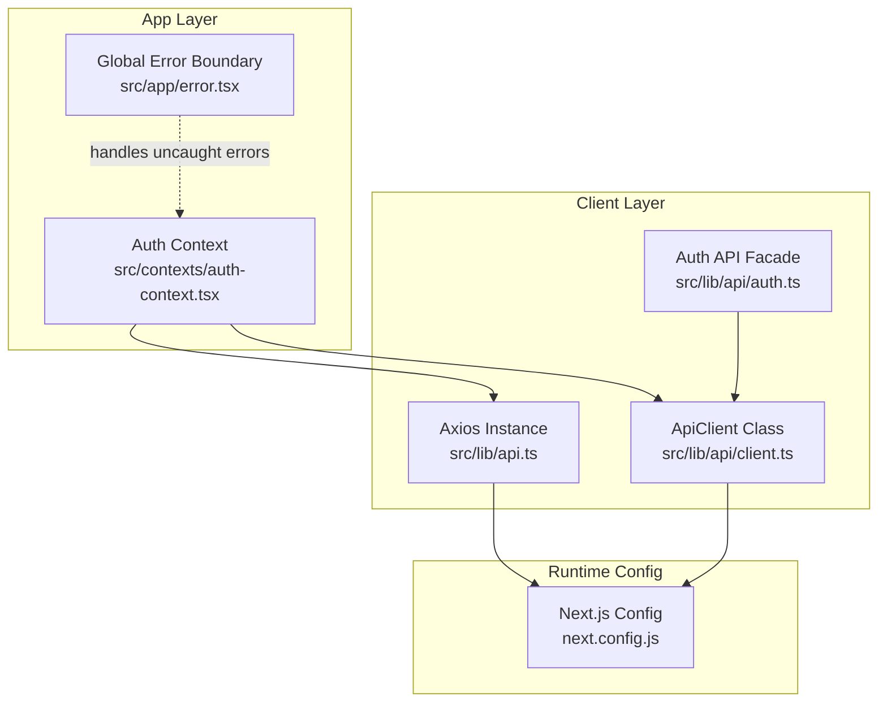
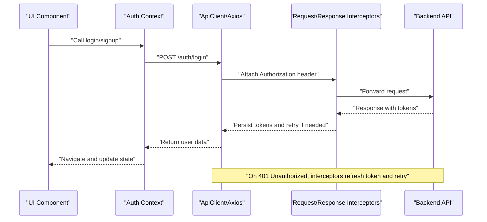
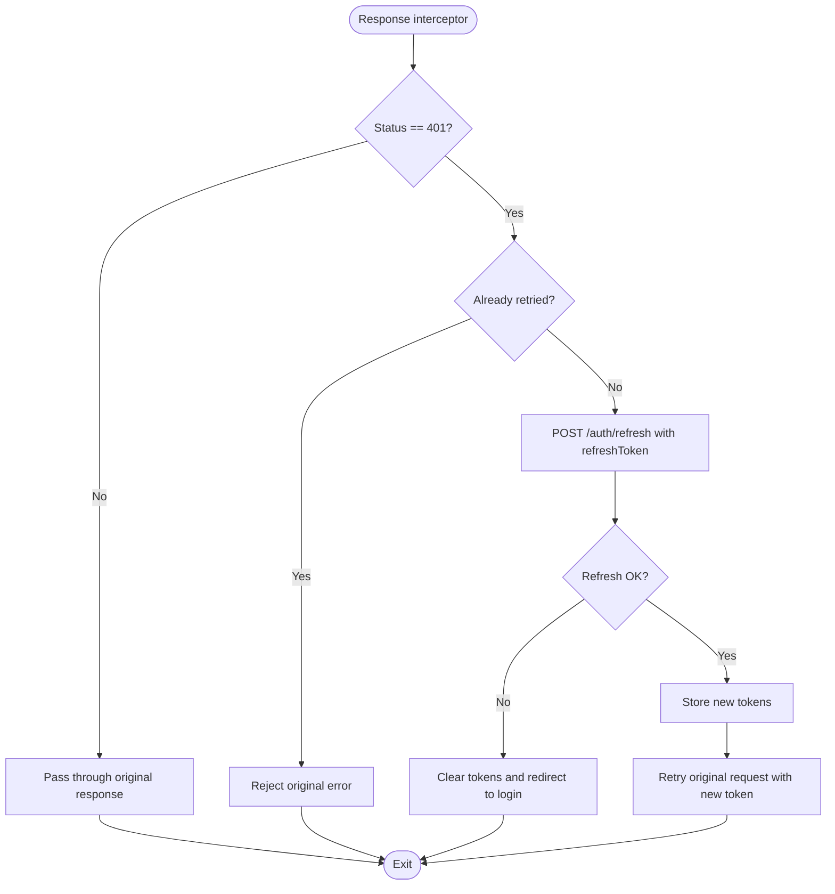
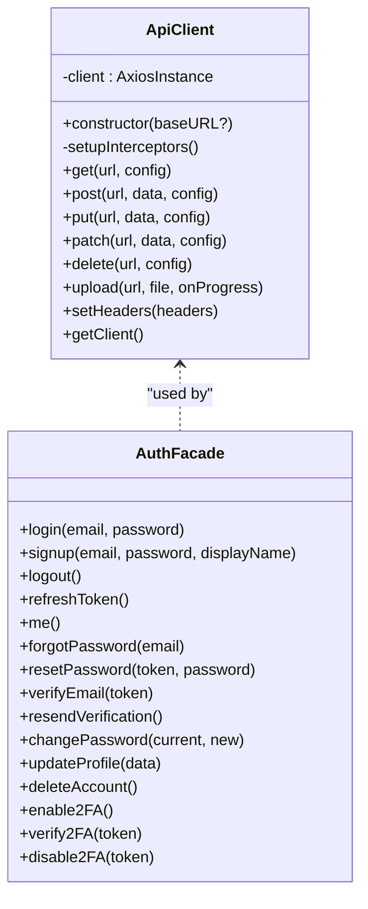
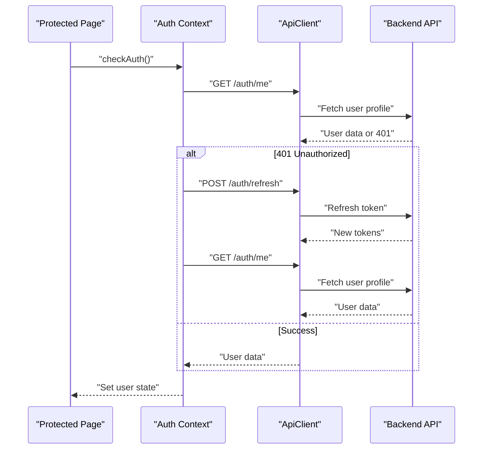
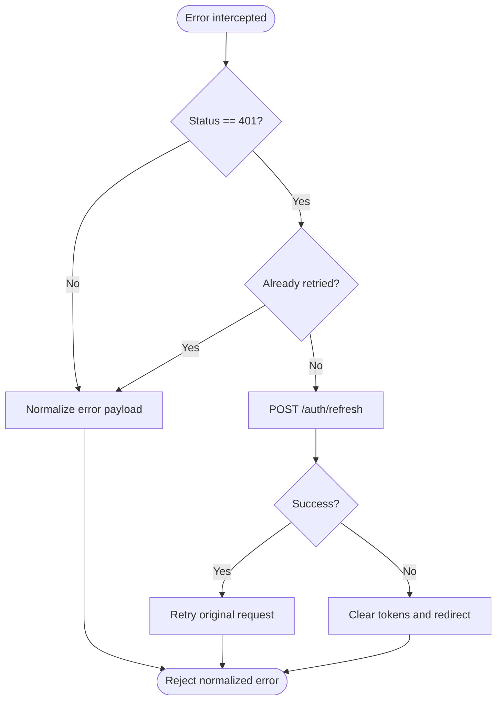
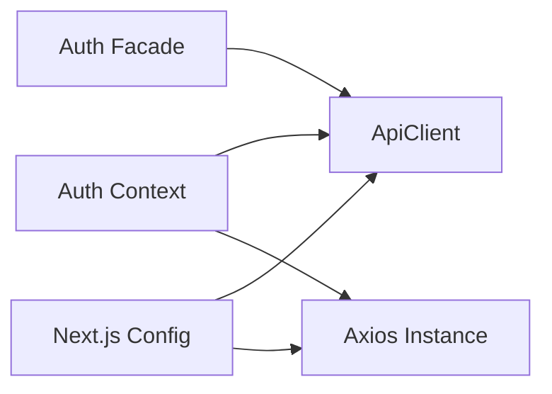

# API Client Architecture

<cite>
**Referenced Files in This Document**
- [api.ts](file://src/lib/api.ts)
- [client.ts](file://src/lib/api/client.ts)
- [auth.ts](file://src/lib/api/auth.ts)
- [auth-context.tsx](file://src/contexts/auth-context.tsx)
- [next.config.js](file://next.config.js)
- [error.tsx](file://src/app/error.tsx)
</cite>

## Table of Contents
1. [Introduction](#introduction)
2. [Project Structure](#project-structure)
3. [Core Components](#core-components)
4. [Architecture Overview](#architecture-overview)
5. [Detailed Component Analysis](#detailed-component-analysis)
6. [Dependency Analysis](#dependency-analysis)
7. [Performance Considerations](#performance-considerations)
8. [Troubleshooting Guide](#troubleshooting-guide)
9. [Conclusion](#conclusion)
10. [Appendices](#appendices)

## Introduction
This document describes the Axios-based API client architecture used in the project. It focuses on:
- Base API configuration and environment variable usage
- Authentication request/response interceptors for token injection and automatic refresh
- Error handling strategies and retry logic
- Offline handling and caching mechanisms
- Extending the client for new endpoints and custom interceptors
- Best practices and debugging techniques

## Project Structure
The API client is implemented in two forms:
- A lightweight Axios instance with interceptors for authentication and token refresh
- A robust class-based ApiClient wrapper offering typed HTTP methods, upload helpers, and centralized error handling

Key locations:
- Lightweight client: [api.ts](file://src/lib/api.ts)
- Class-based client: [client.ts](file://src/lib/api/client.ts)
- Typed auth endpoints: [auth.ts](file://src/lib/api/auth.ts)
- Authentication context integrating the client: [auth-context.tsx](file://src/contexts/auth-context.tsx)
- Environment configuration and API URL rewriting: [next.config.js](file://next.config.js)
- Global error boundary: [error.tsx](file://src/app/error.tsx)

**Diagram sources**
- [api.ts](file://src/lib/api.ts#L1-L67)
- [client.ts](file://src/lib/api/client.ts#L1-L138)
- [auth.ts](file://src/lib/api/auth.ts#L1-L101)
- [auth-context.tsx](file://src/contexts/auth-context.tsx#L1-L154)
- [next.config.js](file://next.config.js#L24-L51)
- [error.tsx](file://src/app/error.tsx#L34-L65)

**Section sources**
- [api.ts](file://src/lib/api.ts#L1-L67)
- [client.ts](file://src/lib/api/client.ts#L1-L138)
- [auth.ts](file://src/lib/api/auth.ts#L1-L101)
- [auth-context.tsx](file://src/contexts/auth-context.tsx#L1-L154)
- [next.config.js](file://next.config.js#L24-L51)
- [error.tsx](file://src/app/error.tsx#L34-L65)

## Core Components
- Lightweight Axios instance with interceptors for Authorization header injection and automatic 401 refresh flow
- Class-based ApiClient with:
  - Centralized request/response interceptors
  - Typed HTTP methods (GET, POST, PUT, PATCH, DELETE)
  - File upload with progress tracking
  - Cookie-based auth token management
  - Consistent error transformation
- Auth facade module exposing typed authentication endpoints backed by ApiClient
- Auth context coordinating login, logout, refresh, and protected route access
- Next.js configuration managing API URL and request rewriting

**Section sources**
- [api.ts](file://src/lib/api.ts#L1-L67)
- [client.ts](file://src/lib/api/client.ts#L1-L138)
- [auth.ts](file://src/lib/api/auth.ts#L1-L101)
- [auth-context.tsx](file://src/contexts/auth-context.tsx#L1-L154)
- [next.config.js](file://next.config.js#L24-L51)

## Architecture Overview
The system integrates a browser-side Axios client with Next.js runtime configuration to centralize API access and authentication.

**Diagram sources**
- [auth-context.tsx](file://src/contexts/auth-context.tsx#L57-L91)
- [client.ts](file://src/lib/api/client.ts#L18-L81)
- [auth.ts](file://src/lib/api/auth.ts#L25-L50)

## Detailed Component Analysis

### Lightweight Axios Instance
- Creates an Axios instance with a base URL derived from environment variables and JSON headers
- Adds an Authorization header using a local access token for every request
- Implements a response interceptor that:
  - Detects 401 Unauthorized
  - Prevents infinite retry loops using a retry flag
  - Attempts to refresh the access token using a stored refresh token
  - Persists refreshed tokens and retries the original request
  - Redirects to login on refresh failure

**Diagram sources**
- [api.ts](file://src/lib/api.ts#L24-L65)

**Section sources**
- [api.ts](file://src/lib/api.ts#L1-L67)

### Class-Based ApiClient
- Provides a typed, extensible client with:
  - Cookie-based Authorization header injection
  - Centralized 401 refresh flow
  - Consistent error transformation with message, status, code, and details
  - HTTP methods: GET, POST, PUT, PATCH, DELETE
  - File upload with progress tracking
  - Utility to set custom headers and expose the underlying Axios instance

**Diagram sources**
- [client.ts](file://src/lib/api/client.ts#L3-L134)
- [auth.ts](file://src/lib/api/auth.ts#L25-L101)

**Section sources**
- [client.ts](file://src/lib/api/client.ts#L1-L138)
- [auth.ts](file://src/lib/api/auth.ts#L1-L101)

### Authentication Context Integration
- Initializes and validates user session using the API client
- Handles login, signup, logout, and refresh flows
- Persists tokens and sets Authorization headers globally
- Coordinates navigation and user state updates

**Diagram sources**
- [auth-context.tsx](file://src/contexts/auth-context.tsx#L39-L55)
- [auth-context.tsx](file://src/contexts/auth-context.tsx#L108-L125)
- [client.ts](file://src/lib/api/client.ts#L44-L68)

**Section sources**
- [auth-context.tsx](file://src/contexts/auth-context.tsx#L1-L154)

### Environment Variables and Base URL
- The base API URL is resolved from the Next public environment variable and defaults to a local development endpoint
- Next.js rewrites incoming requests to the configured API URL for seamless SSR and client-side routing
- WebSocket URL is also configurable via environment variables

**Section sources**
- [api.ts](file://src/lib/api.ts#L3-L8)
- [client.ts](file://src/lib/api/client.ts#L6-L13)
- [next.config.js](file://next.config.js#L24-L51)

### Error Handling Strategies
- Response interceptor transforms Axios errors into a normalized shape with message, status, code, and details
- On 401 Unauthorized, the client attempts token refresh and retries the original request
- On refresh failure, tokens are cleared and the user is redirected to the login route
- The global error boundary displays user-friendly messages and recovery actions

**Diagram sources**
- [client.ts](file://src/lib/api/client.ts#L37-L81)
- [error.tsx](file://src/app/error.tsx#L34-L65)

**Section sources**
- [client.ts](file://src/lib/api/client.ts#L37-L81)
- [error.tsx](file://src/app/error.tsx#L34-L65)

### Retry Logic and Offline Handling
- Automatic retry on 401 Unauthorized with a single retry guard to prevent loops
- No built-in network retry for transient failures; consider adding exponential backoff and jitter for production-grade resilience
- Offline handling is not implemented; consider integrating a service worker or cache-first strategy with manual fallbacks

**Section sources**
- [api.ts](file://src/lib/api.ts#L28-L61)
- [client.ts](file://src/lib/api/client.ts#L44-L68)

### Caching Mechanisms
- No explicit caching is implemented in the client
- Suggestion: Add in-memory caching for read-heavy endpoints and invalidate on write operations

**Section sources**
- [client.ts](file://src/lib/api/client.ts#L1-L138)

### Extending the Client for New Endpoints
- Add new endpoints to the typed auth facade or create a dedicated API module following the same pattern
- Use ApiClient methods (GET, POST, PUT, PATCH, DELETE) for CRUD operations
- For uploads, use the provided upload method with progress callbacks

Example extension points:
- Define new facade methods mirroring backend routes
- Leverage ApiClient’s typed methods and upload helper
- Keep error handling consistent with the existing interceptor

**Section sources**
- [auth.ts](file://src/lib/api/auth.ts#L25-L101)
- [client.ts](file://src/lib/api/client.ts#L83-L123)

### Custom Interceptors
- To add request/response hooks, extend the interceptor setup in the ApiClient constructor
- For cross-cutting concerns (metrics, tracing, logging), insert middleware before or after the existing interceptors

**Section sources**
- [client.ts](file://src/lib/api/client.ts#L18-L81)

### Best Practices for API Client Usage
- Prefer the class-based ApiClient for new features to benefit from typed methods and centralized error handling
- Use the auth facade for authentication operations to maintain consistency
- Store tokens securely and avoid sensitive data in logs
- Keep Authorization headers synchronized across requests
- Centralize error handling and surface actionable messages to users

**Section sources**
- [auth.ts](file://src/lib/api/auth.ts#L1-L101)
- [client.ts](file://src/lib/api/client.ts#L1-L138)

### Debugging Techniques
- Inspect the underlying Axios instance to review request/response details
- Temporarily log interceptor flows and error transformations
- Use the global error boundary to capture and report unexpected errors
- Verify environment variables and API URL rewriting in Next.js configuration

**Section sources**
- [client.ts](file://src/lib/api/client.ts#L130-L133)
- [error.tsx](file://src/app/error.tsx#L34-L65)
- [next.config.js](file://next.config.js#L24-L51)

## Dependency Analysis
The client stack exhibits clear separation of concerns:
- ApiClient encapsulates HTTP transport and interceptors
- Auth facade provides typed authentication operations
- Auth context orchestrates session lifecycle and integrates with UI
- Next.js configuration manages environment and routing

**Diagram sources**
- [auth-context.tsx](file://src/contexts/auth-context.tsx#L1-L154)
- [client.ts](file://src/lib/api/client.ts#L1-L138)
- [api.ts](file://src/lib/api.ts#L1-L67)
- [next.config.js](file://next.config.js#L24-L51)

**Section sources**
- [auth-context.tsx](file://src/contexts/auth-context.tsx#L1-L154)
- [client.ts](file://src/lib/api/client.ts#L1-L138)
- [api.ts](file://src/lib/api.ts#L1-L67)
- [next.config.js](file://next.config.js#L24-L51)

## Performance Considerations
- Timeout is configured in the class-based client; tune based on backend SLAs
- Consider request deduplication for identical GET requests
- Batch frequent small requests to reduce overhead
- Monitor network conditions and adjust retry/backoff policies accordingly

[No sources needed since this section provides general guidance]

## Troubleshooting Guide
Common issues and resolutions:
- 401 Unauthorized loops: Ensure the retry guard prevents infinite loops and tokens are refreshed successfully
- Missing Authorization header: Verify token storage and interceptor logic
- API URL mismatches: Confirm environment variables and Next.js rewrites
- Global errors: Use the error boundary to present recovery actions and collect diagnostics

**Section sources**
- [client.ts](file://src/lib/api/client.ts#L44-L68)
- [api.ts](file://src/lib/api.ts#L28-L61)
- [next.config.js](file://next.config.js#L24-L51)
- [error.tsx](file://src/app/error.tsx#L34-L65)

## Conclusion
The project employs a dual-client strategy: a lightweight Axios instance for simple flows and a robust ApiClient class for typed, resilient operations. Interceptors handle authentication and error normalization, while Next.js configuration ensures consistent routing and environment-driven base URLs. Extensibility is straightforward via the auth facade and ApiClient methods, with room to enhance retry logic, offline handling, and caching for production readiness.

[No sources needed since this section summarizes without analyzing specific files]

## Appendices
- Example usage patterns:
  - Authentication: Use the auth facade methods for login, signup, refresh, and profile updates
  - CRUD operations: Utilize ApiClient’s typed methods for resource endpoints
  - Uploads: Use the upload helper with progress callbacks for file operations

**Section sources**
- [auth.ts](file://src/lib/api/auth.ts#L25-L101)
- [client.ts](file://src/lib/api/client.ts#L83-L123)