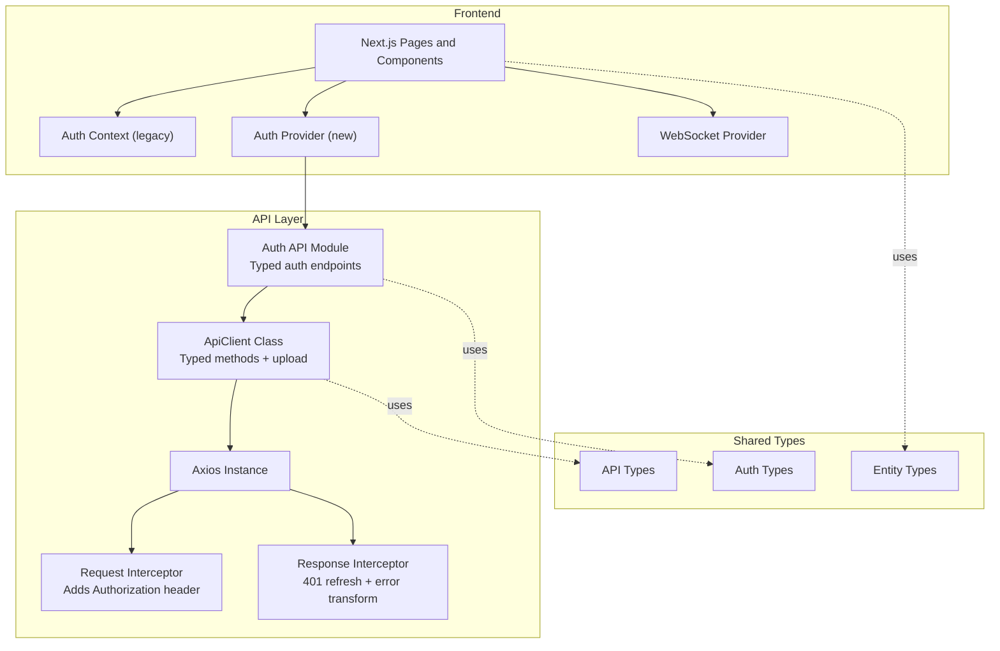
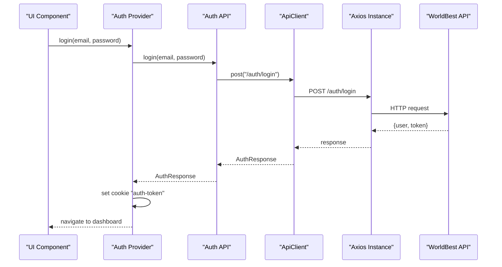
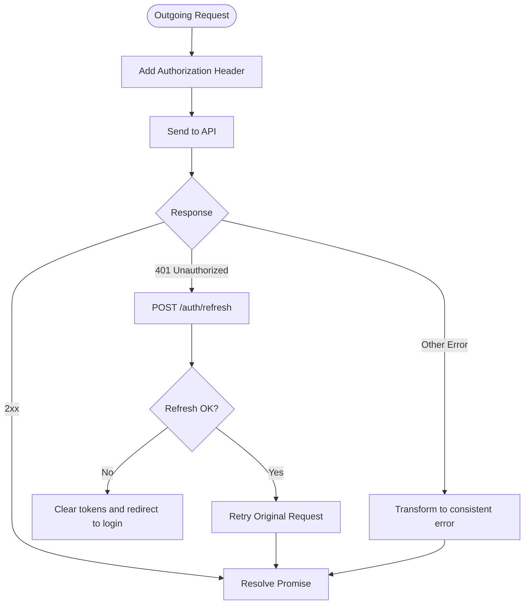
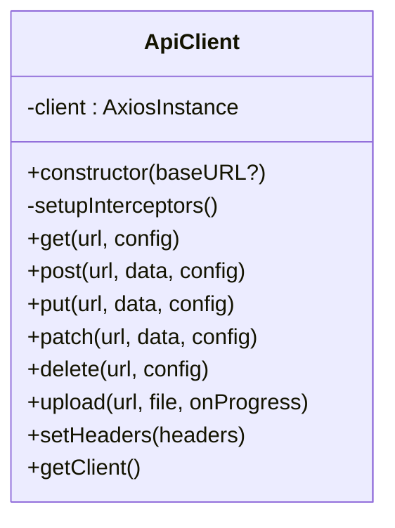
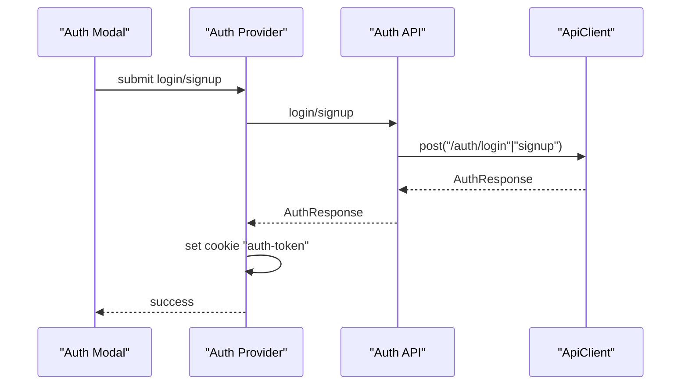
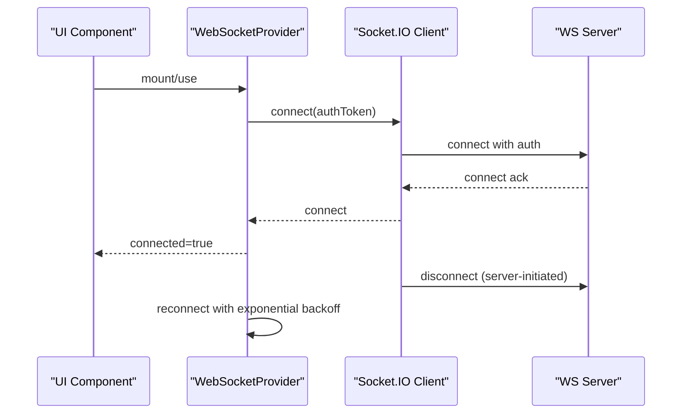
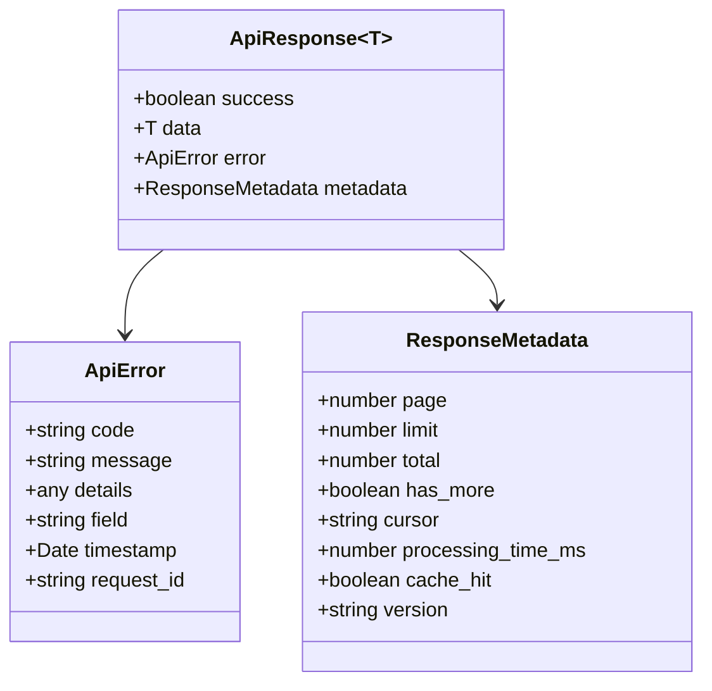
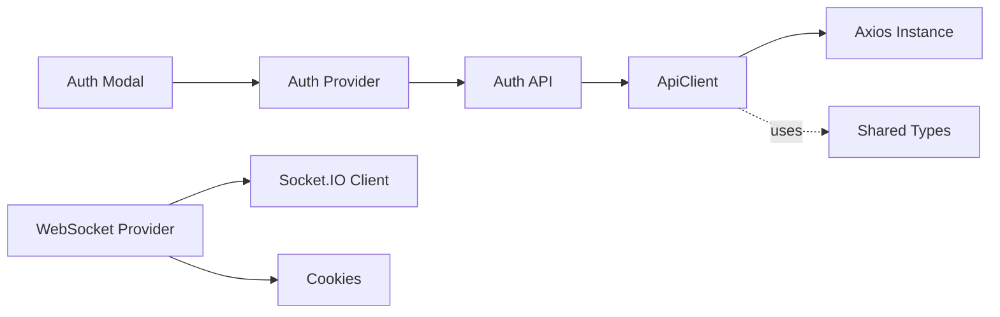

# API Integration

<cite>
**Referenced Files in This Document**
- [api.ts](file://src/lib/api.ts)
- [client.ts](file://src/lib/api/client.ts)
- [auth.ts](file://src/lib/api/auth.ts)
- [auth-context.tsx](file://src/contexts/auth-context.tsx)
- [auth-provider.tsx](file://src/components/auth/auth-provider.tsx)
- [auth-modal.tsx](file://src/components/auth/auth-modal.tsx)
- [websocket-provider.tsx](file://src/components/websocket/websocket-provider.tsx)
- [api.ts (shared-types)](file://packages/shared-types/src/api.ts)
- [auth.ts (shared-types)](file://packages/shared-types/src/auth.ts)
- [entities.ts](file://packages/shared-types/src/entities.ts)
- [layout.tsx](file://src/app/layout.tsx)
</cite>

## Table of Contents
1. [Introduction](#introduction)
2. [Project Structure](#project-structure)
3. [Core Components](#core-components)
4. [Architecture Overview](#architecture-overview)
5. [Detailed Component Analysis](#detailed-component-analysis)
6. [Dependency Analysis](#dependency-analysis)
7. [Performance Considerations](#performance-considerations)
8. [Troubleshooting Guide](#troubleshooting-guide)
9. [Conclusion](#conclusion)
10. [Appendices](#appendices)

## Introduction
This document describes the WorldBest REST API integration for the Next.js application. It covers HTTP endpoints, request/response schemas, authentication, client architecture with interceptors, error handling, and practical integration examples for frontend components. It also outlines rate limiting, retry logic, offline handling, API versioning, backward compatibility, and deprecation policies.

## Project Structure
The API integration centers around a typed Axios-based client, a dedicated authentication module, and React context providers. Shared TypeScript types define API contracts and entities.

**Diagram sources**
- [api.ts](file://src/lib/api.ts#L1-L67)
- [client.ts](file://src/lib/api/client.ts#L1-L138)
- [auth.ts](file://src/lib/api/auth.ts#L1-L101)
- [auth-context.tsx](file://src/contexts/auth-context.tsx#L1-L154)
- [auth-provider.tsx](file://src/components/auth/auth-provider.tsx#L1-L165)
- [websocket-provider.tsx](file://src/components/websocket/websocket-provider.tsx#L1-L138)
- [api.ts (shared-types)](file://packages/shared-types/src/api.ts#L1-L409)
- [auth.ts (shared-types)](file://packages/shared-types/src/auth.ts#L1-L293)
- [entities.ts](file://packages/shared-types/src/entities.ts#L1-L458)

**Section sources**
- [api.ts](file://src/lib/api.ts#L1-L67)
- [client.ts](file://src/lib/api/client.ts#L1-L138)
- [auth.ts](file://src/lib/api/auth.ts#L1-L101)
- [auth-context.tsx](file://src/contexts/auth-context.tsx#L1-L154)
- [auth-provider.tsx](file://src/components/auth/auth-provider.tsx#L1-L165)
- [websocket-provider.tsx](file://src/components/websocket/websocket-provider.tsx#L1-L138)
- [api.ts (shared-types)](file://packages/shared-types/src/api.ts#L1-L409)
- [auth.ts (shared-types)](file://packages/shared-types/src/auth.ts#L1-L293)
- [entities.ts](file://packages/shared-types/src/entities.ts#L1-L458)

## Core Components
- Axios-based client with base URL and JSON headers.
- Request interceptor adds Authorization: Bearer tokens from storage.
- Response interceptor handles 401 Unauthorized by refreshing tokens via a dedicated endpoint and retrying the original request.
- Typed ApiClient wrapper with convenience methods (GET/POST/PUT/PATCH/DELETE), upload with progress, and cookie-based auth for the new provider.
- Auth API module exposing typed endpoints for login, signup, logout, refresh, profile updates, and 2FA.
- Shared types for API responses, errors, pagination, and core entities.

**Section sources**
- [api.ts](file://src/lib/api.ts#L1-L67)
- [client.ts](file://src/lib/api/client.ts#L1-L138)
- [auth.ts](file://src/lib/api/auth.ts#L1-L101)
- [api.ts (shared-types)](file://packages/shared-types/src/api.ts#L1-L409)
- [auth.ts (shared-types)](file://packages/shared-types/src/auth.ts#L1-L293)
- [entities.ts](file://packages/shared-types/src/entities.ts#L1-L458)

## Architecture Overview
The application integrates two complementary authentication flows:
- Legacy flow using localStorage tokens and a global Axios instance.
- Modern flow using cookies and a typed ApiClient with a dedicated Auth API module.

**Diagram sources**
- [auth-provider.tsx](file://src/components/auth/auth-provider.tsx#L67-L89)
- [auth.ts](file://src/lib/api/auth.ts#L25-L32)
- [client.ts](file://src/lib/api/client.ts#L83-L89)
- [api.ts](file://src/lib/api.ts#L10-L22)

## Detailed Component Analysis

### Axios Client and Interceptors
- Base URL is configured from environment variables with a default fallback.
- Request interceptor reads tokens from storage and attaches Authorization headers.
- Response interceptor:
  - Detects 401 Unauthorized and attempts token refresh.
  - Retries the original request with refreshed credentials.
  - Transforms errors into a consistent shape for downstream handling.

**Diagram sources**
- [api.ts](file://src/lib/api.ts#L10-L65)

**Section sources**
- [api.ts](file://src/lib/api.ts#L1-L67)

### Typed ApiClient and Upload Support
- Provides typed HTTP methods and an upload method with progress tracking.
- Manages cookie-based auth for the modern provider.
- Exposes helpers to set custom headers and access the underlying Axios instance.

**Diagram sources**
- [client.ts](file://src/lib/api/client.ts#L3-L134)

**Section sources**
- [client.ts](file://src/lib/api/client.ts#L1-L138)

### Auth API Module
- Encapsulates typed endpoints for authentication operations.
- Returns strongly-typed responses aligned with shared types.

Endpoints (HTTP method → URL pattern):
- POST /auth/login
- POST /auth/signup
- POST /auth/logout
- POST /auth/refresh
- GET /auth/me
- POST /auth/forgot-password
- POST /auth/reset-password
- POST /auth/verify-email
- POST /auth/resend-verification
- POST /auth/change-password
- PATCH /auth/profile
- DELETE /auth/account
- POST /auth/2fa/enable
- POST /auth/2fa/verify
- POST /auth/2fa/disable

Request/response schemas:
- LoginRequest: email, password
- SignupRequest: email, password, displayName
- AuthResponse: user, token, refreshToken
- RefreshTokenResponse: token
- User: structured according to shared types

**Section sources**
- [auth.ts](file://src/lib/api/auth.ts#L1-L101)
- [auth.ts (shared-types)](file://packages/shared-types/src/auth.ts#L218-L241)

### Authentication Contexts and Modal
- Legacy Auth Context (localStorage):
  - Reads tokens from localStorage.
  - Uses a global Axios instance for auth endpoints.
  - Provides login, signup, logout, refresh, and user update functions.
- Modern Auth Provider (cookies):
  - Reads token from cookie and sets cookie on success.
  - Automatically refreshes token periodically.
  - Integrates with the typed ApiClient and Auth API module.
- Auth Modal:
  - Form validation and submission to the Auth Provider.

**Diagram sources**
- [auth-modal.tsx](file://src/components/auth/auth-modal.tsx#L54-L72)
- [auth-provider.tsx](file://src/components/auth/auth-provider.tsx#L67-L89)
- [auth.ts](file://src/lib/api/auth.ts#L25-L41)
- [client.ts](file://src/lib/api/client.ts#L83-L89)

**Section sources**
- [auth-context.tsx](file://src/contexts/auth-context.tsx#L1-L154)
- [auth-provider.tsx](file://src/components/auth/auth-provider.tsx#L1-L165)
- [auth-modal.tsx](file://src/components/auth/auth-modal.tsx#L1-L212)
- [auth.ts](file://src/lib/api/auth.ts#L1-L101)

### WebSocket Integration
- Connects to a WebSocket server using the current auth token from cookies.
- Implements exponential backoff reconnection with a cap.
- Emits and listens to events when authenticated.

**Diagram sources**
- [websocket-provider.tsx](file://src/components/websocket/websocket-provider.tsx#L17-L93)

**Section sources**
- [websocket-provider.tsx](file://src/components/websocket/websocket-provider.tsx#L1-L138)

### API Response and Error Model
- Standardized response envelope with success flag, data, error, and metadata.
- Error model includes code, message, details, field, timestamp, and optional request ID.
- Metadata supports pagination and performance/caching hints.

**Diagram sources**
- [api.ts (shared-types)](file://packages/shared-types/src/api.ts#L3-L28)

**Section sources**
- [api.ts (shared-types)](file://packages/shared-types/src/api.ts#L1-L409)

## Dependency Analysis
- The legacy flow depends on a global Axios instance and localStorage.
- The modern flow depends on ApiClient, Auth API module, and cookies.
- Shared types are consumed by UI components and API modules to maintain type safety.

**Diagram sources**
- [auth-modal.tsx](file://src/components/auth/auth-modal.tsx#L1-L212)
- [auth-provider.tsx](file://src/components/auth/auth-provider.tsx#L1-L165)
- [auth.ts](file://src/lib/api/auth.ts#L1-L101)
- [client.ts](file://src/lib/api/client.ts#L1-L138)
- [api.ts (shared-types)](file://packages/shared-types/src/api.ts#L1-L409)

**Section sources**
- [auth-modal.tsx](file://src/components/auth/auth-modal.tsx#L1-L212)
- [auth-provider.tsx](file://src/components/auth/auth-provider.tsx#L1-L165)
- [auth.ts](file://src/lib/api/auth.ts#L1-L101)
- [client.ts](file://src/lib/api/client.ts#L1-L138)
- [api.ts (shared-types)](file://packages/shared-types/src/api.ts#L1-L409)

## Performance Considerations
- Timeout: The typed client sets a 30-second timeout for requests.
- Stale-time and caching: Global query client defaults include a 1-minute stale time and disables refetch on window focus.
- Upload progress: Dedicated upload method reports progress via onUploadProgress.
- WebSocket transport: Prefers WebSocket with polling fallback and a 20-second connection timeout.

Recommendations:
- Tune staleTime and cache behavior per route/page.
- Consider request deduplication for concurrent identical requests.
- Monitor processing_time_ms in response metadata for latency insights.

**Section sources**
- [client.ts](file://src/lib/api/client.ts#L6-L16)
- [providers.tsx](file://src/app/providers.tsx#L10-L19)
- [client.ts](file://src/lib/api/client.ts#L104-L123)
- [websocket-provider.tsx](file://src/components/websocket/websocket-provider.tsx#L36-L47)

## Troubleshooting Guide
Common issues and resolutions:
- 401 Unauthorized:
  - Legacy client automatically refreshes tokens and retries; otherwise redirects to login.
  - Modern client refreshes via cookie and retries the original request.
- Token refresh failures:
  - Clears stored tokens and redirects to login.
- Consistent error handling:
  - Response interceptor transforms errors into a standardized shape with message, status, code, and details.
- Network errors:
  - Axios timeout and Socket.IO exponential backoff improve resilience.

Operational tips:
- Inspect response metadata for processing_time_ms and cache_hit.
- Verify environment variables for API and WebSocket URLs.
- Confirm cookie domain/path alignment for auth-token.

**Section sources**
- [api.ts](file://src/lib/api.ts#L24-L65)
- [client.ts](file://src/lib/api/client.ts#L37-L81)
- [auth-provider.tsx](file://src/components/auth/auth-provider.tsx#L133-L141)
- [websocket-provider.tsx](file://src/components/websocket/websocket-provider.tsx#L60-L75)

## Conclusion
The integration provides a robust, typed, and resilient API layer with strong authentication flows, consistent error handling, and scalable client architecture. Shared types ensure contract adherence across the frontend, while interceptors and providers manage auth and connectivity seamlessly.

## Appendices

### API Endpoints Reference
- Authentication
  - POST /auth/login
  - POST /auth/signup
  - POST /auth/logout
  - POST /auth/refresh
  - GET /auth/me
  - POST /auth/forgot-password
  - POST /auth/reset-password
  - POST /auth/verify-email
  - POST /auth/resend-verification
  - POST /auth/change-password
  - PATCH /auth/profile
  - DELETE /auth/account
  - POST /auth/2fa/enable
  - POST /auth/2fa/verify
  - POST /auth/2fa/disable

- Project Management (conceptual)
  - GET /projects
  - GET /projects/{id}
  - POST /projects
  - PUT /projects/{id}
  - DELETE /projects/{id}
  - POST /projects/{id}/export
  - POST /projects/{id}/import

- User Operations (conceptual)
  - GET /users/me
  - PATCH /users/me
  - GET /users/{id}
  - POST /users/{id}/avatar

Notes:
- Replace {id} with actual identifiers.
- Use Authorization: Bearer for protected routes.
- Respect pagination and metadata fields in responses.

### Request/Response Schemas
- Auth
  - LoginRequest: email, password
  - SignupRequest: email, password, displayName
  - AuthResponse: user, token, refreshToken
  - RefreshTokenResponse: token
  - User: structured per shared types

- API Envelope
  - ApiResponse<T>: success, data, error, metadata
  - ApiError: code, message, details, field, timestamp, request_id
  - ResponseMetadata: pagination and performance hints

**Section sources**
- [auth.ts](file://src/lib/api/auth.ts#L4-L19)
- [api.ts (shared-types)](file://packages/shared-types/src/api.ts#L3-L28)
- [auth.ts (shared-types)](file://packages/shared-types/src/auth.ts#L218-L241)

### Practical Integration Examples
- Frontend component integration
  - Use the typed Auth API module to call endpoints and receive strongly-typed results.
  - For uploads, use the upload method on ApiClient to track progress.
  - For WebSocket collaboration, use the WebSocket provider to emit and listen to events.

- Example flows
  - Login: Call authApi.login, store cookie, navigate to dashboard.
  - Upload: Call apiClient.upload with a File and onProgress handler.
  - WebSocket: Use useWebSocket to subscribe to collaboration events.

**Section sources**
- [auth-provider.tsx](file://src/components/auth/auth-provider.tsx#L67-L89)
- [client.ts](file://src/lib/api/client.ts#L104-L123)
- [websocket-provider.tsx](file://src/components/websocket/websocket-provider.tsx#L95-L115)

### Rate Limiting, Retry Logic, Offline Handling
- Rate limiting: Not explicitly implemented in the client; surface this via response metadata and adjust client-side retry/backoff accordingly.
- Retry logic: Automatic retry after token refresh on 401; Socket.IO uses exponential backoff with capped delay.
- Offline handling: Use network status checks and local persistence; leverage React Query’s cache behavior for degraded UX.

**Section sources**
- [api.ts](file://src/lib/api.ts#L30-L61)
- [client.ts](file://src/lib/api/client.ts#L47-L67)
- [websocket-provider.tsx](file://src/components/websocket/websocket-provider.tsx#L66-L75)

### API Versioning, Backward Compatibility, Deprecation
- Versioning: Response metadata includes a version field; use it to detect API version mismatches.
- Backward compatibility: Prefer additive changes; keep existing fields and avoid breaking changes to core endpoints.
- Deprecation: Expect deprecation notices in response metadata or headers; migrate to replacement endpoints promptly.

**Section sources**
- [api.ts (shared-types)](file://packages/shared-types/src/api.ts#L27-L27)