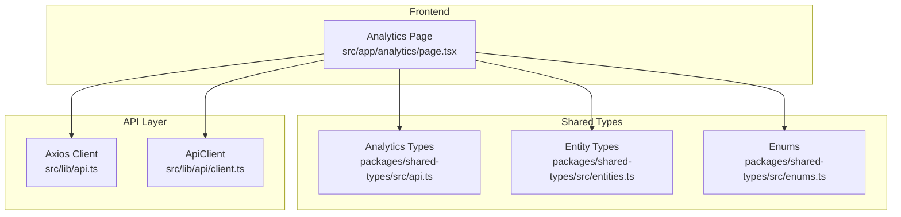
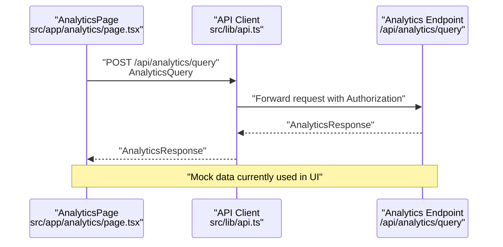
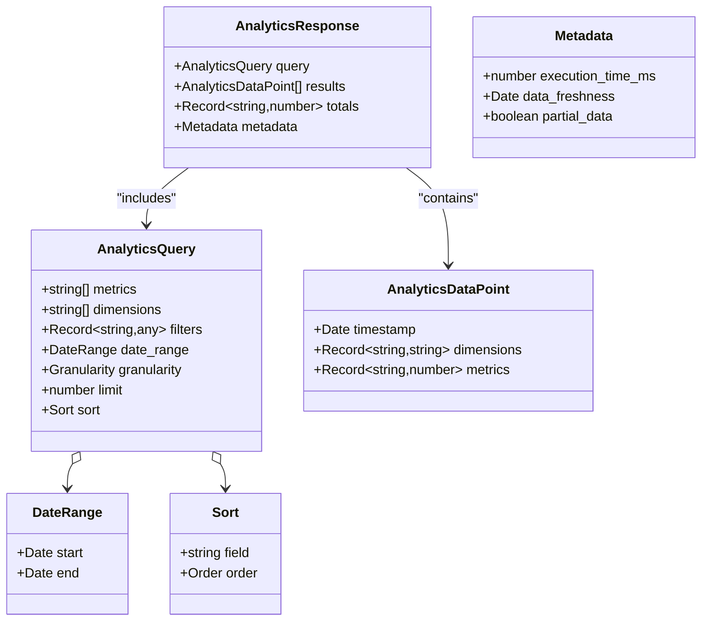
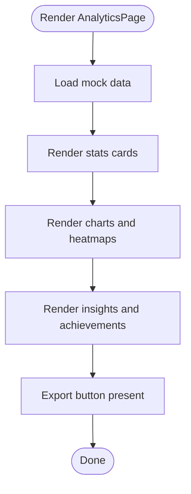
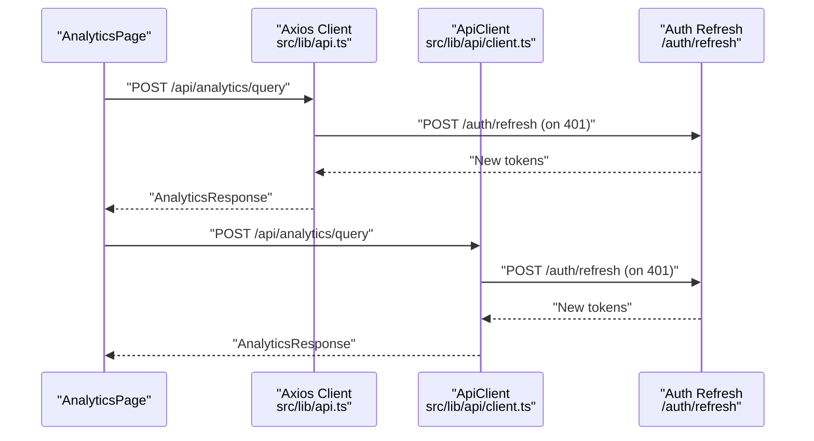
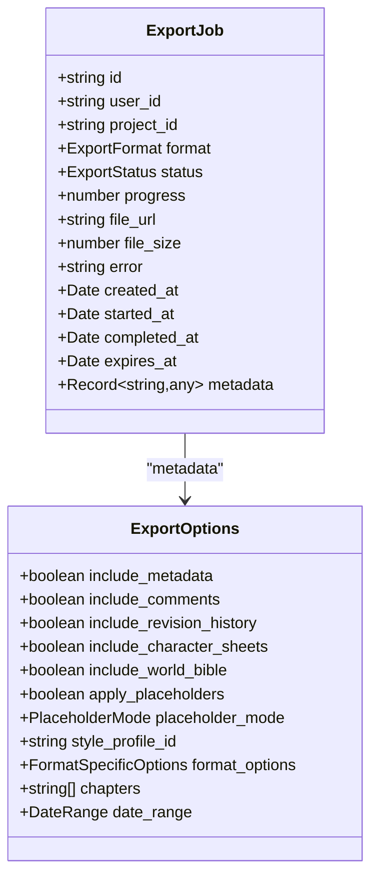
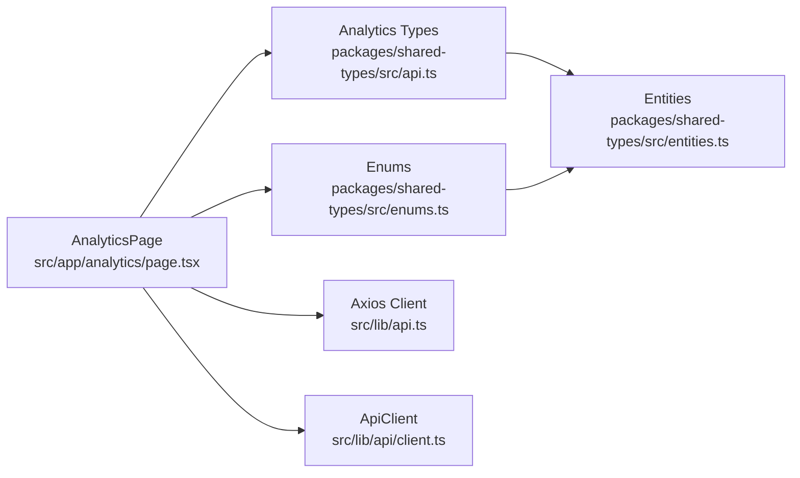

# Analytics API

<cite>
**Referenced Files in This Document**
- [README.md](file://README.md)
- [IMPLEMENTATION_PLAN.md](file://IMPLEMENTATION_PLAN.md)
- [src/app/analytics/page.tsx](file://src/app/analytics/page.tsx)
- [src/lib/api.ts](file://src/lib/api.ts)
- [src/lib/api/client.ts](file://src/lib/api/client.ts)
- [packages/shared-types/src/api.ts](file://packages/shared-types/src/api.ts)
- [packages/shared-types/src/entities.ts](file://packages/shared-types/src/entities.ts)
- [packages/shared-types/src/enums.ts](file://packages/shared-types/src/enums.ts)
</cite>

## Table of Contents
1. [Introduction](#introduction)
2. [Project Structure](#project-structure)
3. [Core Components](#core-components)
4. [Architecture Overview](#architecture-overview)
5. [Detailed Component Analysis](#detailed-component-analysis)
6. [Dependency Analysis](#dependency-analysis)
7. [Performance Considerations](#performance-considerations)
8. [Troubleshooting Guide](#troubleshooting-guide)
9. [Conclusion](#conclusion)
10. [Appendices](#appendices)

## Introduction
This document provides API documentation for analytics and reporting endpoints in the platform. It covers writing statistics, productivity metrics, AI usage analytics, and export functionality. It defines request/response schemas for data retrieval, filtering by date ranges, and aggregation queries. It also documents analytics data models, reporting formats, and outlines rate limiting and data retention policies as planned.

The analytics dashboard currently exists as a frontend UI with mock data. The analytics API module and backend endpoints are planned for implementation.

**Section sources**
- [README.md](file://README.md#L319-L342)
- [IMPLEMENTATION_PLAN.md](file://IMPLEMENTATION_PLAN.md#L139-L143)

## Project Structure
The analytics feature spans the frontend UI and shared types. The frontend dashboard is implemented as a Next.js page component, while analytics-related types and schemas are defined in shared types.

**Diagram sources**
- [src/app/analytics/page.tsx](file://src/app/analytics/page.tsx#L1-L470)
- [packages/shared-types/src/api.ts](file://packages/shared-types/src/api.ts#L304-L335)
- [packages/shared-types/src/entities.ts](file://packages/shared-types/src/entities.ts#L1-L458)
- [packages/shared-types/src/enums.ts](file://packages/shared-types/src/enums.ts#L187-L241)
- [src/lib/api.ts](file://src/lib/api.ts#L1-L67)
- [src/lib/api/client.ts](file://src/lib/api/client.ts#L1-L138)

**Section sources**
- [src/app/analytics/page.tsx](file://src/app/analytics/page.tsx#L1-L470)
- [packages/shared-types/src/api.ts](file://packages/shared-types/src/api.ts#L304-L335)
- [packages/shared-types/src/entities.ts](file://packages/shared-types/src/entities.ts#L1-L458)
- [packages/shared-types/src/enums.ts](file://packages/shared-types/src/enums.ts#L187-L241)
- [src/lib/api.ts](file://src/lib/api.ts#L1-L67)
- [src/lib/api/client.ts](file://src/lib/api/client.ts#L1-L138)

## Core Components
- Analytics data models: AnalyticsQuery, AnalyticsResponse, AnalyticsDataPoint
- Frontend dashboard: AnalyticsPage renders charts and summaries using mock data
- API clients: Axios-based client and ApiClient with interceptors for auth and token refresh
- Shared enums: AI persona types and error codes

Key analytics data models:
- AnalyticsQuery: Defines metrics, dimensions, filters, date range, granularity, limit, and sort
- AnalyticsResponse: Wraps query, results, totals, and metadata (execution time, freshness, partial data)
- AnalyticsDataPoint: Represents a single data point with optional timestamp, dimensions, and metrics

**Section sources**
- [packages/shared-types/src/api.ts](file://packages/shared-types/src/api.ts#L304-L335)
- [src/app/analytics/page.tsx](file://src/app/analytics/page.tsx#L53-L91)
- [src/lib/api.ts](file://src/lib/api.ts#L1-L67)
- [src/lib/api/client.ts](file://src/lib/api/client.ts#L1-L138)

## Architecture Overview
The analytics API follows a request/response pattern with typed schemas. The frontend sends an AnalyticsQuery to the backend and receives an AnalyticsResponse. The API client handles authentication and error responses consistently.

**Diagram sources**
- [src/app/analytics/page.tsx](file://src/app/analytics/page.tsx#L93-L160)
- [src/lib/api.ts](file://src/lib/api.ts#L1-L67)
- [packages/shared-types/src/api.ts](file://packages/shared-types/src/api.ts#L304-L335)

## Detailed Component Analysis

### Analytics Data Models
AnalyticsQuery and AnalyticsResponse define the contract for analytics requests and responses.

**Diagram sources**
- [packages/shared-types/src/api.ts](file://packages/shared-types/src/api.ts#L304-L335)

**Section sources**
- [packages/shared-types/src/api.ts](file://packages/shared-types/src/api.ts#L304-L335)

### Frontend Analytics Dashboard
The AnalyticsPage component renders:
- Writing stats cards
- Daily progress chart (area/line)
- Project progress bars
- Genre distribution pie chart
- AI assistant usage radar chart
- Writing patterns heatmap
- Insights and achievements

The component currently uses mock data and includes an export button.

**Diagram sources**
- [src/app/analytics/page.tsx](file://src/app/analytics/page.tsx#L93-L470)

**Section sources**
- [src/app/analytics/page.tsx](file://src/app/analytics/page.tsx#L53-L91)
- [src/app/analytics/page.tsx](file://src/app/analytics/page.tsx#L93-L470)

### API Clients and Interceptors
Two API clients are available:
- Axios-based client: Adds Authorization header and handles token refresh via auth/refresh
- ApiClient: Provides a typed wrapper with interceptors for auth and error handling

Both clients support GET, POST, PUT, PATCH, DELETE, and file upload with progress tracking.

**Diagram sources**
- [src/lib/api.ts](file://src/lib/api.ts#L1-L67)
- [src/lib/api/client.ts](file://src/lib/api/client.ts#L18-L81)

**Section sources**
- [src/lib/api.ts](file://src/lib/api.ts#L1-L67)
- [src/lib/api/client.ts](file://src/lib/api/client.ts#L1-L138)

### Export Functionality
Export options and job model are defined in shared types. Export supports various formats and options, including date ranges and metadata inclusion.

**Diagram sources**
- [packages/shared-types/src/api.ts](file://packages/shared-types/src/api.ts#L175-L233)

**Section sources**
- [packages/shared-types/src/api.ts](file://packages/shared-types/src/api.ts#L175-L233)

## Dependency Analysis
- AnalyticsPage depends on shared analytics types and enums
- API clients depend on environment variables for base URLs
- Entities and enums support analytics use cases (e.g., AIPersona)

**Diagram sources**
- [src/app/analytics/page.tsx](file://src/app/analytics/page.tsx#L1-L470)
- [packages/shared-types/src/api.ts](file://packages/shared-types/src/api.ts#L304-L335)
- [packages/shared-types/src/enums.ts](file://packages/shared-types/src/enums.ts#L187-L241)
- [packages/shared-types/src/entities.ts](file://packages/shared-types/src/entities.ts#L1-L458)
- [src/lib/api.ts](file://src/lib/api.ts#L1-L67)
- [src/lib/api/client.ts](file://src/lib/api/client.ts#L1-L138)

**Section sources**
- [src/app/analytics/page.tsx](file://src/app/analytics/page.tsx#L1-L470)
- [packages/shared-types/src/api.ts](file://packages/shared-types/src/api.ts#L304-L335)
- [packages/shared-types/src/enums.ts](file://packages/shared-types/src/enums.ts#L187-L241)
- [packages/shared-types/src/entities.ts](file://packages/shared-types/src/entities.ts#L1-L458)
- [src/lib/api.ts](file://src/lib/api.ts#L1-L67)
- [src/lib/api/client.ts](file://src/lib/api/client.ts#L1-L138)

## Performance Considerations
- Use appropriate granularity (hour/day/week/month) to balance detail and performance
- Apply date ranges and limits to reduce payload sizes
- Leverage server-side sorting and filtering to minimize client-side processing
- Cache frequently accessed datasets when feasible

[No sources needed since this section provides general guidance]

## Troubleshooting Guide
Common issues and resolutions:
- Unauthorized responses: Ensure Authorization header is present; the API clients automatically handle token refresh on 401
- Network timeouts: Increase timeout or reduce query scope (granularity, date range, limit)
- Type mismatches: Verify AnalyticsQuery fields match backend expectations

**Section sources**
- [src/lib/api.ts](file://src/lib/api.ts#L1-L67)
- [src/lib/api/client.ts](file://src/lib/api/client.ts#L18-L81)

## Conclusion
The analytics API is designed around typed schemas for robust data exchange. The frontend dashboard demonstrates how analytics data will be visualized, while the API clients provide consistent authentication and error handling. Implementation of the backend analytics endpoints and export functionality is planned and will integrate with the existing API infrastructure.

[No sources needed since this section summarizes without analyzing specific files]

## Appendices

### API Endpoints (Planned)
- POST /api/analytics/query
  - Request: AnalyticsQuery
  - Response: AnalyticsResponse
- POST /api/analytics/export
  - Request: ExportOptions
  - Response: ExportJob

**Section sources**
- [README.md](file://README.md#L338-L338)
- [packages/shared-types/src/api.ts](file://packages/shared-types/src/api.ts#L304-L335)
- [packages/shared-types/src/api.ts](file://packages/shared-types/src/api.ts#L175-L233)

### Rate Limiting and Data Retention (Planned)
- Rate limiting: To be implemented to protect backend services and ensure fair usage
- Data retention: To be implemented to manage historical analytics data lifecycle

**Section sources**
- [README.md](file://README.md#L249-L257)
- [IMPLEMENTATION_PLAN.md](file://IMPLEMENTATION_PLAN.md#L798-L838)