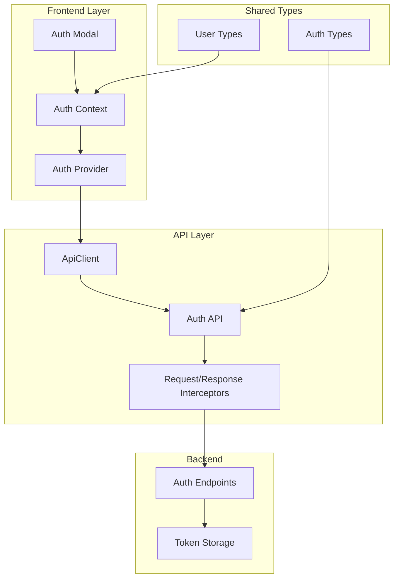
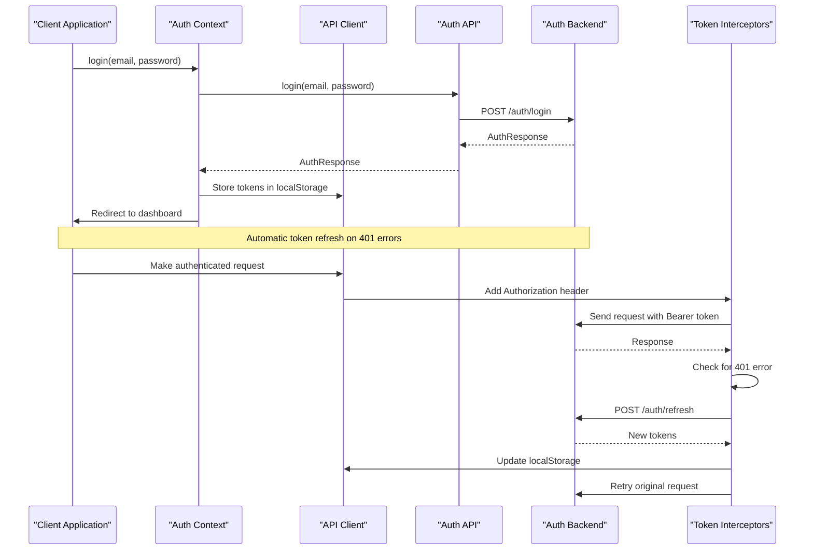
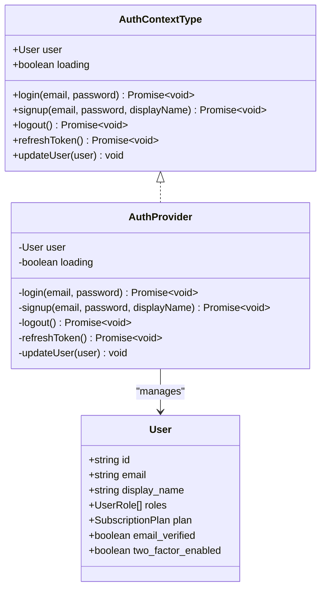
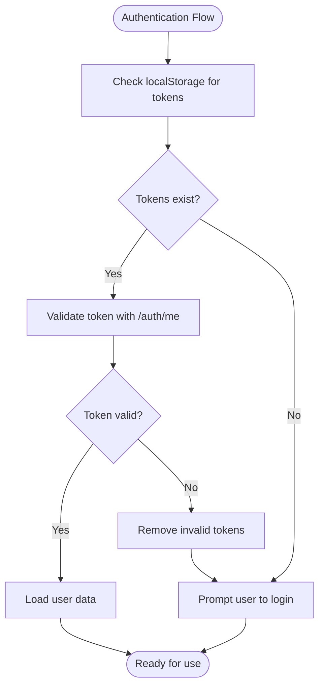
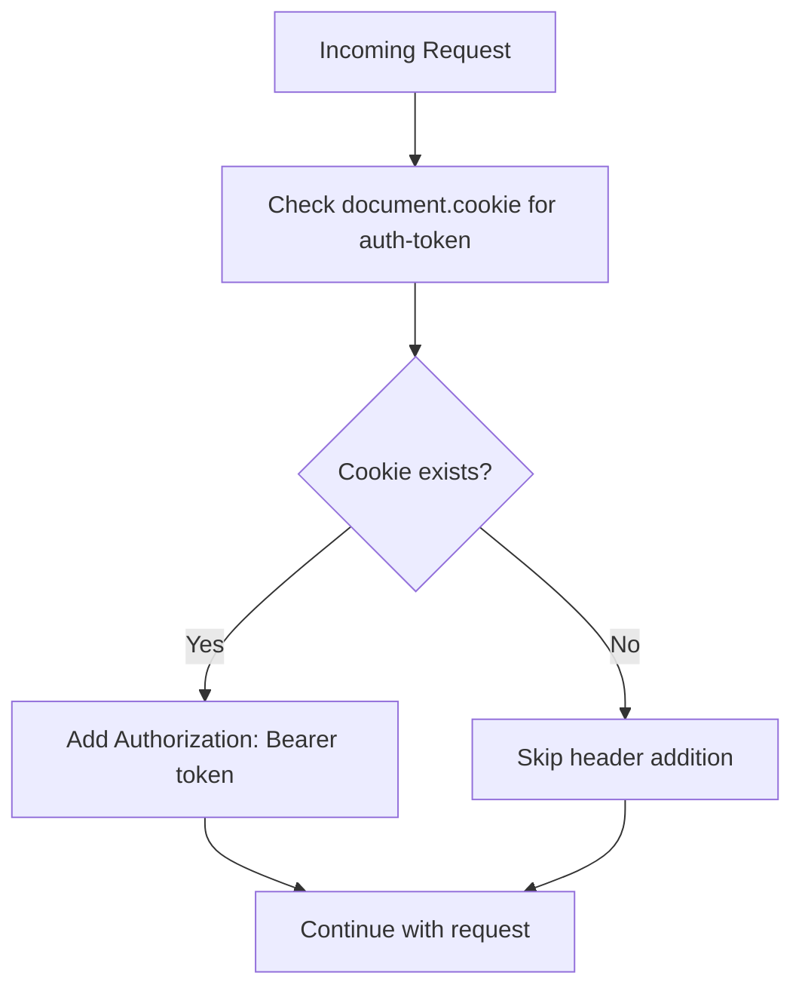
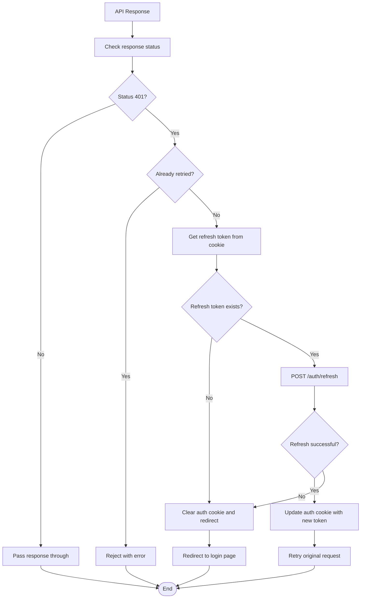
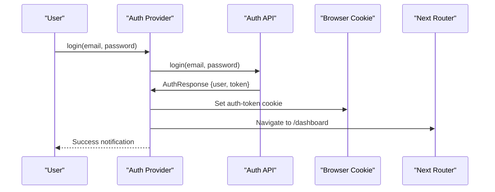
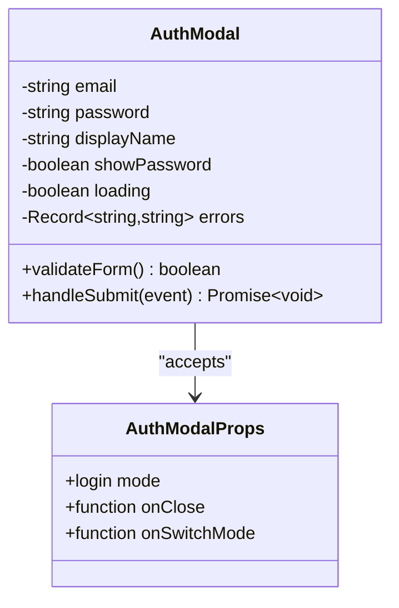
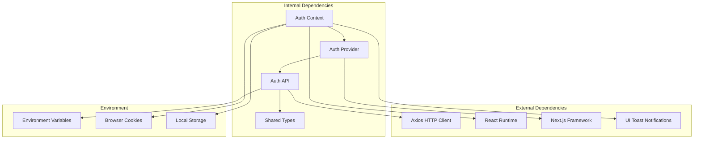
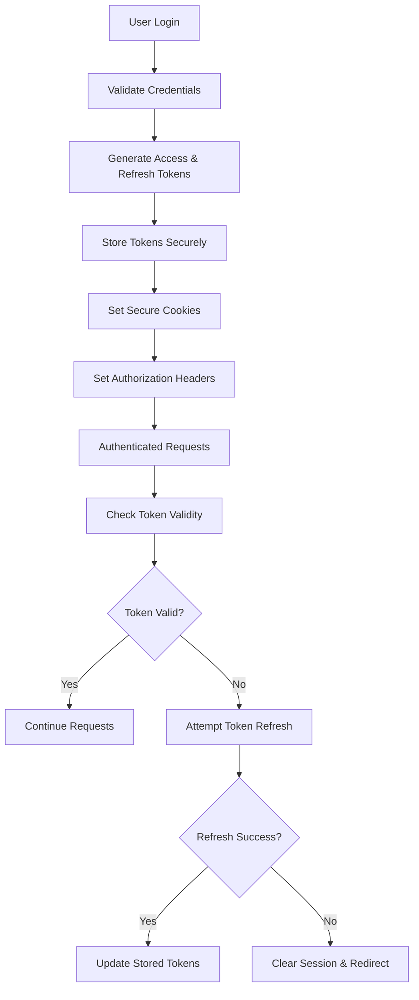

# Authentication API

<cite>
**Referenced Files in This Document**
- [api.ts](file://src/lib/api.ts)
- [auth-context.tsx](file://src/contexts/auth-context.tsx)
- [auth-provider.tsx](file://src/components/auth/auth-provider.tsx)
- [auth.ts](file://src/lib/api/auth.ts)
- [client.ts](file://src/lib/api/client.ts)
- [auth.ts](file://packages/shared-types/src/auth.ts)
- [providers.tsx](file://src/app/providers.tsx)
- [auth-modal.tsx](file://src/components/auth/auth-modal.tsx)
- [next.config.js](file://next.config.js)
</cite>

## Table of Contents
1. [Introduction](#introduction)
2. [Project Structure](#project-structure)
3. [Core Components](#core-components)
4. [Architecture Overview](#architecture-overview)
5. [Detailed Component Analysis](#detailed-component-analysis)
6. [Dependency Analysis](#dependency-analysis)
7. [Performance Considerations](#performance-considerations)
8. [Troubleshooting Guide](#troubleshooting-guide)
9. [Security Considerations](#security-considerations)
10. [Conclusion](#conclusion)

## Introduction
This document provides comprehensive API documentation for the authentication system, covering login, logout, registration, password reset, and token refresh endpoints. It details JWT token handling, session management, authentication interceptors, and secure storage mechanisms. The documentation includes request/response schemas, successful authentication flows, error handling scenarios, and security best practices.

## Project Structure
The authentication system spans multiple layers:
- API client layer with interceptors for token management
- Authentication context for React state management
- Shared types for consistent data structures
- Next.js configuration for environment variables and routing



**Diagram sources**
- [auth-context.tsx](file://src/contexts/auth-context.tsx#L1-L154)
- [auth-provider.tsx](file://src/components/auth/auth-provider.tsx#L1-L165)
- [client.ts](file://src/lib/api/client.ts#L1-L138)
- [auth.ts](file://src/lib/api/auth.ts#L1-L101)

**Section sources**
- [auth-context.tsx](file://src/contexts/auth-context.tsx#L1-L154)
- [auth-provider.tsx](file://src/components/auth/auth-provider.tsx#L1-L165)
- [client.ts](file://src/lib/api/client.ts#L1-L138)
- [auth.ts](file://src/lib/api/auth.ts#L1-L101)

## Core Components

### Authentication Endpoints
The authentication system exposes the following endpoints:

#### Login Endpoint
- **Method**: POST
- **Path**: `/auth/login`
- **Purpose**: Authenticate users and return session tokens

#### Registration Endpoint  
- **Method**: POST
- **Path**: `/auth/signup`
- **Purpose**: Create new user accounts

#### Logout Endpoint
- **Method**: POST
- **Path**: `/auth/logout`
- **Purpose**: Invalidate current session

#### Token Refresh Endpoint
- **Method**: POST
- **Path**: `/auth/refresh`
- **Purpose**: Obtain new access token using refresh token

#### Additional Endpoints
- **Forgot Password**: `/auth/forgot-password`
- **Reset Password**: `/auth/reset-password`
- **Verify Email**: `/auth/verify-email`
- **Change Password**: `/auth/change-password`
- **Profile Management**: `/auth/profile`
- **Account Management**: `/auth/account`

**Section sources**
- [auth.ts](file://src/lib/api/auth.ts#L25-L101)

### Request/Response Schemas

#### Login Request
```typescript
interface LoginRequest {
  email: string;
  password: string;
  two_factor_code?: string;
  remember_me?: boolean;
}
```

#### Registration Request
```typescript
interface SignupRequest {
  email: string;
  password: string;
  username?: string;
  display_name: string;
  referral_code?: string;
  accept_terms: boolean;
  marketing_consent?: boolean;
}
```

#### Authentication Response
```typescript
interface AuthResponse {
  user: User;
  session: Session;
  access_token: string;
  refresh_token: string;
  expires_in: number;
}
```

#### Token Refresh Response
```typescript
interface RefreshTokenResponse {
  token: string;
}
```

**Section sources**
- [auth.ts](file://packages/shared-types/src/auth.ts#L218-L241)
- [auth.ts](file://src/lib/api/auth.ts#L4-L23)

## Architecture Overview

The authentication system implements a multi-layered approach with automatic token management and session persistence:



**Diagram sources**
- [auth-context.tsx](file://src/contexts/auth-context.tsx#L57-L125)
- [client.ts](file://src/lib/api/client.ts#L18-L81)
- [auth.ts](file://src/lib/api/auth.ts#L25-L50)

## Detailed Component Analysis

### Authentication Context Implementation

The authentication context manages user state and provides authentication methods:



**Diagram sources**
- [auth-context.tsx](file://src/contexts/auth-context.tsx#L8-L26)
- [auth-context.tsx](file://src/contexts/auth-context.tsx#L30-L146)

#### Token Storage Mechanisms
The system uses localStorage for token persistence:



**Diagram sources**
- [auth-context.tsx](file://src/contexts/auth-context.tsx#L39-L55)

**Section sources**
- [auth-context.tsx](file://src/contexts/auth-context.tsx#L1-L154)

### API Client Interceptor Implementation

The API client implements sophisticated token management:

#### Request Interceptor
Automatically adds Authorization headers to all requests:



**Diagram sources**
- [client.ts](file://src/lib/api/client.ts#L19-L35)

#### Response Interceptor
Handles automatic token refresh on 401 errors:



**Diagram sources**
- [client.ts](file://src/lib/api/client.ts#L37-L81)

**Section sources**
- [client.ts](file://src/lib/api/client.ts#L1-L138)

### Authentication Provider Implementation

The authentication provider handles user interactions and state management:

#### Login Flow


**Diagram sources**
- [auth-provider.tsx](file://src/components/auth/auth-provider.tsx#L67-L89)

**Section sources**
- [auth-provider.tsx](file://src/components/auth/auth-provider.tsx#L1-L165)

### Auth Modal Component

The authentication modal provides user interface for login/signup:



**Diagram sources**
- [auth-modal.tsx](file://src/components/auth/auth-modal.tsx#L11-L25)

**Section sources**
- [auth-modal.tsx](file://src/components/auth/auth-modal.tsx#L1-L212)

## Dependency Analysis

The authentication system has the following key dependencies:



**Diagram sources**
- [auth-context.tsx](file://src/contexts/auth-context.tsx#L1-L154)
- [auth-provider.tsx](file://src/components/auth/auth-provider.tsx#L1-L165)
- [auth.ts](file://src/lib/api/auth.ts#L1-L101)

**Section sources**
- [auth-context.tsx](file://src/contexts/auth-context.tsx#L1-L154)
- [auth-provider.tsx](file://src/components/auth/auth-provider.tsx#L1-L165)
- [auth.ts](file://src/lib/api/auth.ts#L1-L101)

## Performance Considerations

### Token Refresh Strategy
The system implements intelligent token refresh to minimize latency:

- **Automatic Detection**: 401 errors trigger immediate refresh attempts
- **Retry Prevention**: Prevents infinite retry loops with `_retry` flag
- **Background Refresh**: Periodic refresh every 15 minutes to maintain session
- **Graceful Degradation**: Falls back to login when refresh fails

### Caching and State Management
- **User Data Caching**: Minimal caching to prevent stale user data
- **Error State Management**: Proper error boundaries and user feedback
- **Loading States**: Comprehensive loading indicators for better UX

## Troubleshooting Guide

### Common Authentication Issues

#### Invalid Credentials
**Symptoms**: Login fails with credential errors
**Causes**: Incorrect email/password combination
**Resolution**: 
- Verify user credentials
- Check account verification status
- Review password requirements (minimum 8 characters)

#### Expired Tokens
**Symptoms**: 401 Unauthorized errors on authenticated requests
**Causes**: Access token expiration or refresh token issues
**Resolution**:
- Automatic token refresh should handle this
- Manual refresh using `refreshToken()` method
- Clear browser cookies and re-authenticate if automatic refresh fails

#### Network Failures
**Symptoms**: Request timeouts or connection errors
**Causes**: Network connectivity issues or backend unavailability
**Resolution**:
- Implement retry logic with exponential backoff
- Check API endpoint availability
- Verify CORS configuration

#### Session Management Issues
**Symptoms**: Users appear logged out unexpectedly
**Causes**: Browser cookie restrictions or incognito mode
**Resolution**:
- Check browser privacy settings
- Verify SameSite cookie configuration
- Implement session persistence strategies

**Section sources**
- [auth-context.tsx](file://src/contexts/auth-context.tsx#L49-L55)
- [client.ts](file://src/lib/api/client.ts#L44-L68)

## Security Considerations

### Token Security Implementation

#### Secure Storage Practices
- **Access Tokens**: Stored in localStorage for persistent sessions
- **Refresh Tokens**: Stored in localStorage with automatic rotation
- **Cookie Management**: Secure, HttpOnly, SameSite=Strict cookies for session persistence
- **Token Expiration**: Automatic detection and handling of expired tokens

#### Authentication Flow Security


**Diagram sources**
- [auth-context.tsx](file://src/contexts/auth-context.tsx#L57-L125)
- [auth-provider.tsx](file://src/components/auth/auth-provider.tsx#L67-L141)

#### Security Best Practices Implemented
- **HTTPS-Only**: Secure cookies with HTTPS enforcement
- **SameSite Protection**: Prevents CSRF attacks
- **Token Rotation**: Automatic refresh token updates
- **Error Handling**: Graceful degradation without exposing sensitive information
- **Input Validation**: Frontend validation for form submissions

### Environment Configuration
The system uses environment variables for secure configuration:

- **NEXT_PUBLIC_API_URL**: Configurable API base URL
- **Secure Defaults**: Production-ready security configurations
- **Development Flexibility**: Local development overrides

**Section sources**
- [next.config.js](file://next.config.js#L24-L27)
- [auth-context.tsx](file://src/contexts/auth-context.tsx#L57-L64)

## Conclusion

The authentication system provides a robust, secure, and user-friendly authentication solution with comprehensive token management, automatic refresh capabilities, and multiple authentication flows. The implementation balances security considerations with user experience through intelligent token handling, graceful error recovery, and consistent state management across the application.

Key strengths include:
- Multi-layered authentication with automatic token refresh
- Secure token storage and transmission
- Comprehensive error handling and user feedback
- Flexible configuration for different deployment environments
- Type-safe interfaces using shared TypeScript definitions

The system is designed for scalability and maintainability while providing a seamless authentication experience for users.