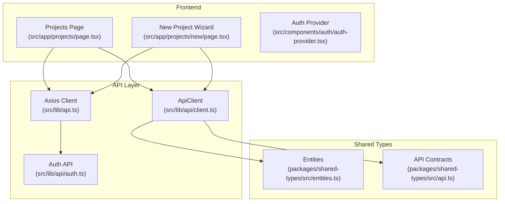
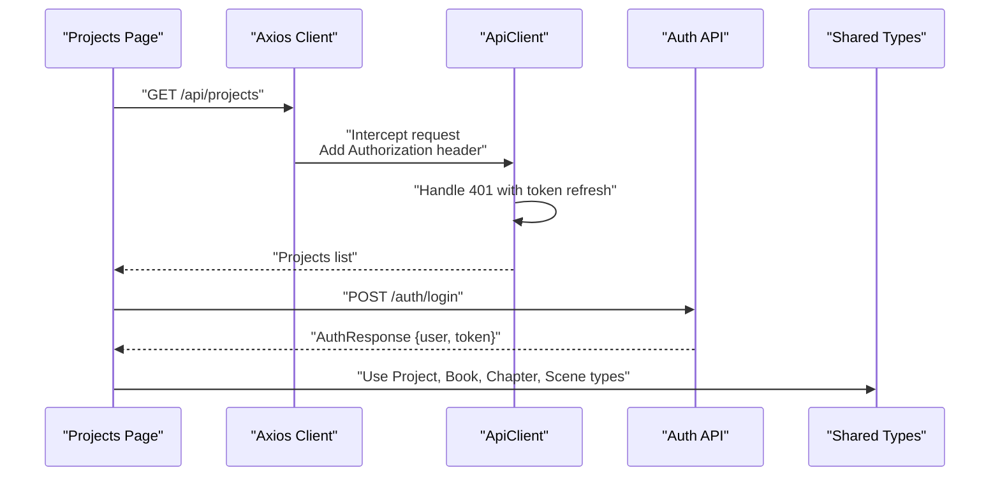
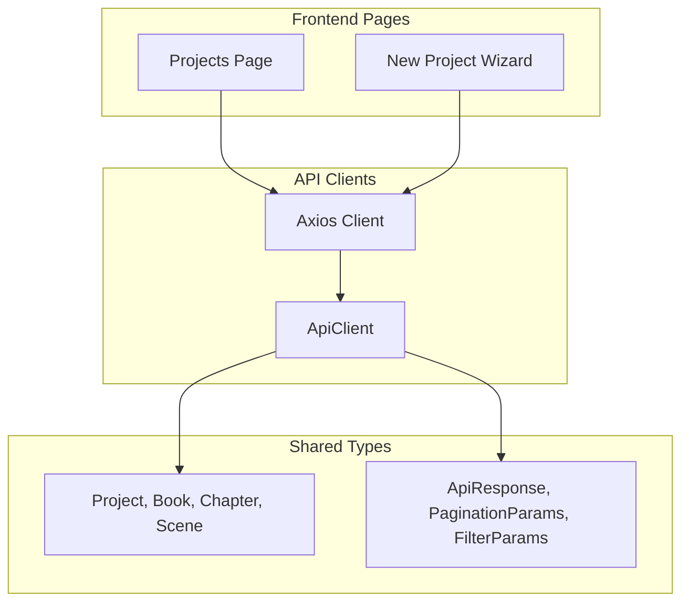
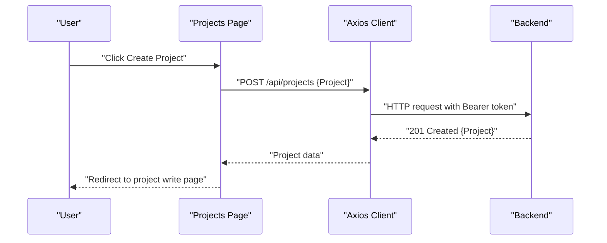
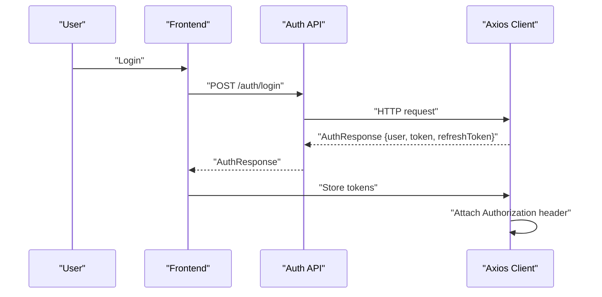
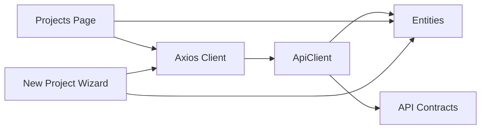

# Projects API

<cite>
**Referenced Files in This Document**
- [README.md](file://README.md)
- [IMPLEMENTATION_PLAN.md](file://IMPLEMENTATION_PLAN.md)
- [api.ts](file://src/lib/api.ts)
- [client.ts](file://src/lib/api/client.ts)
- [auth.ts](file://src/lib/api/auth.ts)
- [entities.ts](file://packages/shared-types/src/entities.ts)
- [api.ts](file://packages/shared-types/src/api.ts)
- [page.tsx](file://src/app/projects/page.tsx)
- [page.tsx](file://src/app/projects/new/page.tsx)
</cite>

## Table of Contents
1. [Introduction](#introduction)
2. [Project Structure](#project-structure)
3. [Core Components](#core-components)
4. [Architecture Overview](#architecture-overview)
5. [Detailed Component Analysis](#detailed-component-analysis)
6. [Dependency Analysis](#dependency-analysis)
7. [Performance Considerations](#performance-considerations)
8. [Troubleshooting Guide](#troubleshooting-guide)
9. [Conclusion](#conclusion)

## Introduction
This document provides comprehensive API documentation for project management endpoints in the WorldBest platform. It covers CRUD operations for projects, books, chapters, and scenes, along with request/response schemas, filtering, sorting, pagination, and version control for content. It also outlines the project structure API, nested resource relationships, and bulk operations. Examples demonstrate creating new projects, organizing content hierarchies, and managing project permissions.

## Project Structure
The project management feature is implemented as part of the Next.js App Router under the `/projects` route. The frontend pages include:
- Project listing and filtering
- Project creation wizard
- Project write/edit page (placeholder)

The API client infrastructure supports authentication, request/response interceptors, and centralized error handling. Shared TypeScript types define the domain entities and API response contracts.

**Diagram sources**
- [page.tsx](file://src/app/projects/page.tsx#L1-L394)
- [page.tsx](file://src/app/projects/new/page.tsx#L1-L555)
- [api.ts](file://src/lib/api.ts#L1-L67)
- [client.ts](file://src/lib/api/client.ts#L1-L138)
- [auth.ts](file://src/lib/api/auth.ts#L1-L101)
- [entities.ts](file://packages/shared-types/src/entities.ts#L1-L458)
- [api.ts](file://packages/shared-types/src/api.ts#L1-L409)

**Section sources**
- [README.md](file://README.md#L319-L341)
- [IMPLEMENTATION_PLAN.md](file://IMPLEMENTATION_PLAN.md#L114-L154)
- [page.tsx](file://src/app/projects/page.tsx#L1-L394)
- [page.tsx](file://src/app/projects/new/page.tsx#L1-L555)
- [api.ts](file://src/lib/api.ts#L1-L67)
- [client.ts](file://src/lib/api/client.ts#L1-L138)
- [auth.ts](file://src/lib/api/auth.ts#L1-L101)
- [entities.ts](file://packages/shared-types/src/entities.ts#L1-L458)
- [api.ts](file://packages/shared-types/src/api.ts#L1-L409)

## Core Components
- API Clients
  - Axios-based client with automatic token injection and refresh logic
  - Centralized error handling and response transformation
- Authentication API
  - Login, signup, logout, refresh, profile management
- Shared Types
  - Domain entities: Project, Book, Chapter, Scene, TextVersion, Placeholder
  - API contracts: ApiResponse, ApiError, ResponseMetadata, PaginationParams, FilterParams
- Frontend Pages
  - Project listing with search, filter, sort, and view modes
  - New project wizard with multi-step configuration

**Section sources**
- [api.ts](file://src/lib/api.ts#L1-L67)
- [client.ts](file://src/lib/api/client.ts#L1-L138)
- [auth.ts](file://src/lib/api/auth.ts#L1-L101)
- [entities.ts](file://packages/shared-types/src/entities.ts#L1-L458)
- [api.ts](file://packages/shared-types/src/api.ts#L1-L409)
- [page.tsx](file://src/app/projects/page.tsx#L1-L394)
- [page.tsx](file://src/app/projects/new/page.tsx#L1-L555)

## Architecture Overview
The API architecture follows a layered design:
- Frontend pages trigger actions via API clients
- API clients encapsulate HTTP requests, authentication, and error handling
- Shared types define contracts for requests, responses, and domain entities
- The backend (not shown here) implements the REST endpoints

**Diagram sources**
- [api.ts](file://src/lib/api.ts#L1-L67)
- [client.ts](file://src/lib/api/client.ts#L1-L138)
- [auth.ts](file://src/lib/api/auth.ts#L1-L101)
- [entities.ts](file://packages/shared-types/src/entities.ts#L1-L458)
- [api.ts](file://packages/shared-types/src/api.ts#L1-L409)

## Detailed Component Analysis

### Project CRUD Endpoints
- Base URL: `/api/projects`
- Supported Methods: GET, POST, GET (single), PUT (update), DELETE
- Authentication: Required (Bearer token)
- Filtering, Sorting, Pagination: Supported via query parameters

Request/Response Schemas
- Request: Project (fields include owner_id, title, synopsis, genre, settings, collaborators, metadata)
- Response: Project with BaseEntity fields (id, created_at, updated_at)

Pagination and Filtering
- PaginationParams: page, limit, cursor, sort_by, sort_order
- FilterParams: search, status, created_after, created_before, updated_after, updated_before, tags, metadata

Permissions
- ProjectCollaborator includes role and permissions array
- ProjectRole enum defines OWNER, EDITOR, REVIEWER, READER

Bulk Operations
- BulkOperationRequest supports create, update, delete operations with atomic and continue_on_error options

Examples
- Create a new project: POST /api/projects with Project payload
- List projects with filters: GET /api/projects?page=1&limit=20&sort_by=title&sort_order=asc
- Update project: PUT /api/projects/{id} with partial Project fields
- Delete project: DELETE /api/projects/{id}

**Section sources**
- [README.md](file://README.md#L329-L335)
- [IMPLEMENTATION_PLAN.md](file://IMPLEMENTATION_PLAN.md#L114-L154)
- [entities.ts](file://packages/shared-types/src/entities.ts#L9-L18)
- [api.ts](file://packages/shared-types/src/api.ts#L30-L47)
- [api.ts](file://packages/shared-types/src/api.ts#L49-L75)

### Project Structure API (Books, Chapters, Scenes)
Nested Resource Relationships
- Project → Books (order, blurb, target_word_count, status)
- Book → Chapters (number, title, summary, target_word_count, status)
- Chapter → Scenes (title, location_id, time, character_ids, placeholders, text_versions, current_version_id, pov_character_id, mood, conflict, resolution)

Text Version Control
- TextVersion tracks content, summary, parent_id, semantic_hash, word_count, AI generation flags, AI model and params, revision notes, quality score
- Scene.current_version_id references the active TextVersion

Placeholder System
- Placeholder defines type, intensity, consent requirements, purpose, rendering mode, mapped bible refs, fallback text, tags

Example Hierarchies
- Create a Book under a Project
- Create a Chapter under a Book
- Create a Scene under a Chapter
- Create TextVersion entries for a Scene to manage revisions

**Section sources**
- [entities.ts](file://packages/shared-types/src/entities.ts#L43-L76)
- [entities.ts](file://packages/shared-types/src/entities.ts#L322-L335)
- [entities.ts](file://packages/shared-types/src/entities.ts#L304-L321)

### Frontend Integration Examples
- Project Listing
  - UI supports search, genre/status filters, sorting by updated/created/title/progress, and grid/list view modes
  - Mock data demonstrates expected fields and progress calculation

- New Project Wizard
  - Multi-step form collecting basic info, genre/subgenres, project settings (target word count, audience, rating, visibility), and AI preferences
  - Presets and validation ensure sensible defaults

**Section sources**
- [page.tsx](file://src/app/projects/page.tsx#L1-L394)
- [page.tsx](file://src/app/projects/new/page.tsx#L1-L555)

### API Client and Interceptors
- Axios client configured with base URL and JSON headers
- Request interceptor adds Authorization: Bearer token from localStorage
- Response interceptor handles 401 by refreshing token and retrying request
- Alternative ApiClient uses cookie-based auth and centralized error transformation

**Section sources**
- [api.ts](file://src/lib/api.ts#L1-L67)
- [client.ts](file://src/lib/api/client.ts#L1-L138)

### Authentication Endpoints
- POST /auth/login, POST /auth/signup, POST /auth/logout, POST /auth/refresh
- Additional endpoints: forgot password, reset password, verify email, resend verification, change password, update profile, delete account, 2FA enable/verify/disable

**Section sources**
- [README.md](file://README.md#L323-L328)
- [auth.ts](file://src/lib/api/auth.ts#L1-L101)

## Architecture Overview
The API architecture integrates frontend pages, API clients, and shared types to deliver a cohesive project management experience.

**Diagram sources**
- [page.tsx](file://src/app/projects/page.tsx#L1-L394)
- [page.tsx](file://src/app/projects/new/page.tsx#L1-L555)
- [api.ts](file://src/lib/api.ts#L1-L67)
- [client.ts](file://src/lib/api/client.ts#L1-L138)
- [entities.ts](file://packages/shared-types/src/entities.ts#L1-L458)
- [api.ts](file://packages/shared-types/src/api.ts#L1-L409)

## Detailed Component Analysis

### Project CRUD Flow

**Diagram sources**
- [README.md](file://README.md#L329-L335)
- [api.ts](file://src/lib/api.ts#L1-L67)
- [page.tsx](file://src/app/projects/new/page.tsx#L108-L114)

### Authentication Flow

**Diagram sources**
- [auth.ts](file://src/lib/api/auth.ts#L25-L50)
- [api.ts](file://src/lib/api.ts#L1-L67)

### Filtering, Sorting, and Pagination
- PaginationParams: page, limit, cursor, sort_by, sort_order
- FilterParams: search, status, created_after, created_before, updated_after, updated_before, tags, metadata
- ResponseMetadata: page, limit, total, has_more, cursor, processing_time_ms, cache_hit, version

Usage Example
- GET /api/projects?page=1&limit=20&sort_by=updated_at&sort_order=desc&search=fantasy

**Section sources**
- [api.ts](file://packages/shared-types/src/api.ts#L30-L47)
- [api.ts](file://packages/shared-types/src/api.ts#L19-L28)
- [page.tsx](file://src/app/projects/page.tsx#L131-L153)

### Bulk Operations
- BulkOperationRequest: operations[], atomic?, continue_on_error?
- BulkOperation: operation (create|update|delete), data, id?
- BulkOperationResponse: success, results[], total_operations, successful_operations, failed_operations

Use Cases
- Batch create multiple Scenes under a Chapter
- Batch update Book statuses
- Batch delete Chapters

**Section sources**
- [api.ts](file://packages/shared-types/src/api.ts#L49-L75)

### Version Control for Scenes
- Scene.text_versions stores multiple TextVersion entries
- Scene.current_version_id points to the active version
- TextVersion includes semantic_hash, word_count, AI generation metadata, revision notes, quality score

Workflow
- Create initial TextVersion when Scene is created
- On edits, create new TextVersion with parent_id referencing previous version
- Update Scene.current_version_id to the latest version

**Section sources**
- [entities.ts](file://packages/shared-types/src/entities.ts#L63-L76)
- [entities.ts](file://packages/shared-types/src/entities.ts#L322-L335)

## Dependency Analysis
The project management feature depends on:
- API client infrastructure for HTTP requests and authentication
- Shared types for strong typing across frontend and backend
- Frontend pages for user interactions and data presentation

**Diagram sources**
- [page.tsx](file://src/app/projects/page.tsx#L1-L394)
- [page.tsx](file://src/app/projects/new/page.tsx#L1-L555)
- [api.ts](file://src/lib/api.ts#L1-L67)
- [client.ts](file://src/lib/api/client.ts#L1-L138)
- [entities.ts](file://packages/shared-types/src/entities.ts#L1-L458)
- [api.ts](file://packages/shared-types/src/api.ts#L1-L409)

**Section sources**
- [api.ts](file://src/lib/api.ts#L1-L67)
- [client.ts](file://src/lib/api/client.ts#L1-L138)
- [entities.ts](file://packages/shared-types/src/entities.ts#L1-L458)
- [api.ts](file://packages/shared-types/src/api.ts#L1-L409)
- [page.tsx](file://src/app/projects/page.tsx#L1-L394)
- [page.tsx](file://src/app/projects/new/page.tsx#L1-L555)

## Performance Considerations
- Use pagination and cursor-based pagination for large collections
- Apply filters early to reduce payload sizes
- Leverage sort_by and sort_order to optimize client-side rendering
- Minimize re-renders by using stable keys and memoization in lists
- Consider caching strategies for frequently accessed project metadata

## Troubleshooting Guide
Common Issues and Resolutions
- Unauthorized Access (401)
  - Ensure Authorization header is present
  - Implement token refresh logic and retry mechanism
- Request/Response Interceptor Errors
  - Inspect transformed error object for message, status, code, details
  - Verify cookie or localStorage token storage depending on client used
- Frontend Mock Data
  - Replace mock data with actual API calls in production
  - Validate that filters, sorts, and pagination align with backend behavior

**Section sources**
- [client.ts](file://src/lib/api/client.ts#L37-L80)
- [api.ts](file://src/lib/api.ts#L24-L65)
- [page.tsx](file://src/app/projects/page.tsx#L59-L126)

## Conclusion
The Projects API provides a robust foundation for managing writing projects with hierarchical content structures, version control, and flexible filtering. By leveraging the shared types, API clients, and frontend pages outlined in this document, teams can implement scalable project management features with strong typing, consistent error handling, and extensible bulk operations.