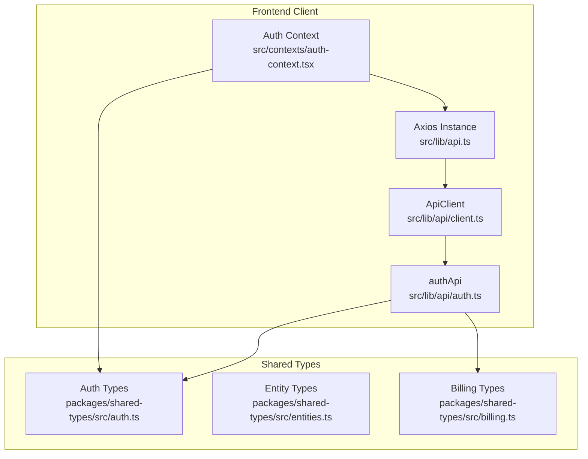
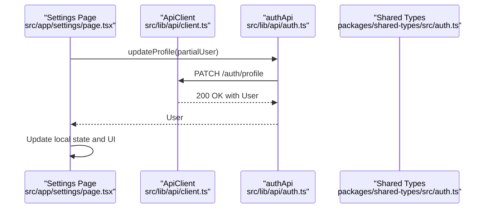
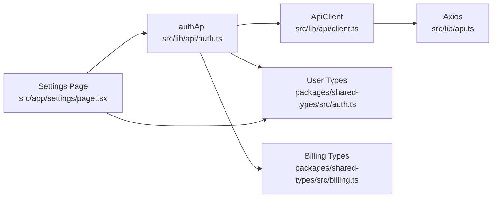

# Users API

<cite>
**Referenced Files in This Document**
- [README.md](file://README.md)
- [src/app/settings/page.tsx](file://src/app/settings/page.tsx)
- [src/lib/api.ts](file://src/lib/api.ts)
- [src/lib/api/client.ts](file://src/lib/api/client.ts)
- [src/lib/api/auth.ts](file://src/lib/api/auth.ts)
- [src/contexts/auth-context.tsx](file://src/contexts/auth-context.tsx)
- [packages/shared-types/src/auth.ts](file://packages/shared-types/src/auth.ts)
- [packages/shared-types/src/entities.ts](file://packages/shared-types/src/entities.ts)
- [packages/shared-types/src/billing.ts](file://packages/shared-types/src/billing.ts)
</cite>

## Table of Contents
1. [Introduction](#introduction)
2. [Project Structure](#project-structure)
3. [Core Components](#core-components)
4. [Architecture Overview](#architecture-overview)
5. [Detailed Component Analysis](#detailed-component-analysis)
6. [Dependency Analysis](#dependency-analysis)
7. [Performance Considerations](#performance-considerations)
8. [Troubleshooting Guide](#troubleshooting-guide)
9. [Conclusion](#conclusion)

## Introduction
This document provides API documentation for user management endpoints in the platform. It covers user profile operations, account settings, subscription management, and billing operations. It also documents request/response schemas for user data updates, preferences management, and account security settings, including avatar upload functionality, email notification preferences, and subscription plan changes. Examples demonstrate how to update user profiles, manage account security, and handle subscription workflows.

## Project Structure
The user management APIs are implemented in the frontend client layer and backed by shared type definitions. The primary client-side API client is built on top of Axios and exposes typed methods for authentication and user operations. Shared types define the shape of user data, preferences, and billing entities.

**Diagram sources**
- [src/lib/api.ts](file://src/lib/api.ts#L1-L67)
- [src/lib/api/client.ts](file://src/lib/api/client.ts#L1-L138)
- [src/lib/api/auth.ts](file://src/lib/api/auth.ts#L1-L101)
- [src/contexts/auth-context.tsx](file://src/contexts/auth-context.tsx#L1-L154)
- [packages/shared-types/src/auth.ts](file://packages/shared-types/src/auth.ts#L1-L293)
- [packages/shared-types/src/entities.ts](file://packages/shared-types/src/entities.ts#L1-L458)
- [packages/shared-types/src/billing.ts](file://packages/shared-types/src/billing.ts#L1-L339)

**Section sources**
- [README.md](file://README.md#L319-L341)
- [src/lib/api.ts](file://src/lib/api.ts#L1-L67)
- [src/lib/api/client.ts](file://src/lib/api/client.ts#L1-L138)
- [src/lib/api/auth.ts](file://src/lib/api/auth.ts#L1-L101)
- [src/contexts/auth-context.tsx](file://src/contexts/auth-context.tsx#L1-L154)
- [packages/shared-types/src/auth.ts](file://packages/shared-types/src/auth.ts#L1-L293)
- [packages/shared-types/src/entities.ts](file://packages/shared-types/src/entities.ts#L1-L458)
- [packages/shared-types/src/billing.ts](file://packages/shared-types/src/billing.ts#L1-L339)

## Core Components
- Axios-based API client with automatic token injection and retry logic for authentication refresh.
- Typed API module for authentication and user operations.
- Shared TypeScript types for user, preferences, and billing domains.
- Settings page UI demonstrating profile, notifications, preferences, and billing tabs.

Key capabilities:
- Authentication endpoints: login, signup, logout, refresh, forgot password, reset password, verify email, resend verification.
- User profile management: update profile, change password, delete account.
- Security endpoints: enable 2FA, verify 2FA, disable 2FA.
- Subscription and billing: plan information, invoices, usage, coupons, and events.

**Section sources**
- [src/lib/api.ts](file://src/lib/api.ts#L1-L67)
- [src/lib/api/client.ts](file://src/lib/api/client.ts#L1-L138)
- [src/lib/api/auth.ts](file://src/lib/api/auth.ts#L1-L101)
- [src/app/settings/page.tsx](file://src/app/settings/page.tsx#L106-L538)
- [packages/shared-types/src/auth.ts](file://packages/shared-types/src/auth.ts#L1-L293)
- [packages/shared-types/src/billing.ts](file://packages/shared-types/src/billing.ts#L1-L339)

## Architecture Overview
The client-side API architecture integrates with shared types to ensure consistent request/response shapes. Authentication flows use bearer tokens, with automatic refresh handling. The settings page orchestrates user-facing operations across profile, notifications, preferences, and billing.

**Diagram sources**
- [src/app/settings/page.tsx](file://src/app/settings/page.tsx#L141-L148)
- [src/lib/api/auth.ts](file://src/lib/api/auth.ts#L80-L83)
- [src/lib/api/client.ts](file://src/lib/api/client.ts#L95-L97)
- [packages/shared-types/src/auth.ts](file://packages/shared-types/src/auth.ts#L3-L19)

**Section sources**
- [src/app/settings/page.tsx](file://src/app/settings/page.tsx#L141-L148)
- [src/lib/api/auth.ts](file://src/lib/api/auth.ts#L80-L83)
- [src/lib/api/client.ts](file://src/lib/api/client.ts#L95-L97)
- [packages/shared-types/src/auth.ts](file://packages/shared-types/src/auth.ts#L3-L19)

## Detailed Component Analysis

### Authentication Endpoints
- POST /auth/login
  - Purpose: Authenticate user and receive tokens.
  - Request body: email, password.
  - Response: user, access token, refresh token.
  - Example usage: [src/contexts/auth-context.tsx](file://src/contexts/auth-context.tsx#L57-L73)

- POST /auth/signup
  - Purpose: Register a new user.
  - Request body: email, password, display name.
  - Response: user, access token, refresh token.
  - Example usage: [src/contexts/auth-context.tsx](file://src/contexts/auth-context.tsx#L75-L91)

- POST /auth/logout
  - Purpose: Invalidate current session.
  - Example usage: [src/contexts/auth-context.tsx](file://src/contexts/auth-context.tsx#L93-L105)

- POST /auth/refresh
  - Purpose: Refresh access token using refresh token.
  - Example usage: [src/contexts/auth-context.tsx](file://src/contexts/auth-context.tsx#L108-L125)

- POST /auth/forgot-password
  - Purpose: Initiate password reset.
  - Example usage: [src/lib/api/auth.ts](file://src/lib/api/auth.ts#L57-L59)

- POST /auth/reset-password
  - Purpose: Reset password using token.
  - Example usage: [src/lib/api/auth.ts](file://src/lib/api/auth.ts#L61-L63)

- POST /auth/verify-email
  - Purpose: Verify user email via token.
  - Example usage: [src/lib/api/auth.ts](file://src/lib/api/auth.ts#L65-L67)

- POST /auth/resend-verification
  - Purpose: Resend email verification.
  - Example usage: [src/lib/api/auth.ts](file://src/lib/api/auth.ts#L69-L71)

**Section sources**
- [src/contexts/auth-context.tsx](file://src/contexts/auth-context.tsx#L57-L125)
- [src/lib/api/auth.ts](file://src/lib/api/auth.ts#L25-L71)

### User Profile Operations
- GET /auth/me
  - Purpose: Retrieve current user profile.
  - Example usage: [src/contexts/auth-context.tsx](file://src/contexts/auth-context.tsx#L39-L55)

- PATCH /auth/profile
  - Purpose: Update user profile fields.
  - Request body: Partial user object (e.g., display_name, bio, website, username).
  - Response: Updated user.
  - Example usage: [src/lib/api/auth.ts](file://src/lib/api/auth.ts#L80-L83)
  - UI example: [src/app/settings/page.tsx](file://src/app/settings/page.tsx#L141-L148)

- POST /auth/change-password
  - Purpose: Change current password.
  - Example usage: [src/lib/api/auth.ts](file://src/lib/api/auth.ts#L73-L78)

- DELETE /auth/account
  - Purpose: Delete user account.
  - Example usage: [src/lib/api/auth.ts](file://src/lib/api/auth.ts#L85-L87)

- PUT /auth/avatar (conceptual)
  - Purpose: Upload avatar image.
  - Request: multipart/form-data with file field.
  - Response: Updated user with avatar_url.
  - Implementation pattern: [src/lib/api/client.ts](file://src/lib/api/client.ts#L103-L123)
  - UI example: [src/app/settings/page.tsx](file://src/app/settings/page.tsx#L150-L161)

**Section sources**
- [src/contexts/auth-context.tsx](file://src/contexts/auth-context.tsx#L39-L55)
- [src/lib/api/auth.ts](file://src/lib/api/auth.ts#L52-L87)
- [src/lib/api/client.ts](file://src/lib/api/client.ts#L103-L123)
- [src/app/settings/page.tsx](file://src/app/settings/page.tsx#L150-L161)

### Account Security Endpoints
- POST /auth/2fa/enable
  - Purpose: Enable two-factor authentication.
  - Response: { qrCode, secret }.
  - Example usage: [src/lib/api/auth.ts](file://src/lib/api/auth.ts#L89-L92)

- POST /auth/2fa/verify
  - Purpose: Verify 2FA using token.
  - Example usage: [src/lib/api/auth.ts](file://src/lib/api/auth.ts#L94-L96)

- POST /auth/2fa/disable
  - Purpose: Disable two-factor authentication.
  - Example usage: [src/lib/api/auth.ts](file://src/lib/api/auth.ts#L98-L100)

**Section sources**
- [src/lib/api/auth.ts](file://src/lib/api/auth.ts#L89-L100)

### Subscription and Billing Endpoints
- Subscription retrieval and management
  - GET /auth/me returns user with plan and billing_customer_id.
  - Billing types include Subscription, Invoice, PaymentMethod, Usage, Coupon, Referral, and BillingEvent.

- Billing UI highlights
  - Current plan display and upgrade/downgrade actions.
  - Payment method management.
  - Billing history and events.

References:
- [src/contexts/auth-context.tsx](file://src/contexts/auth-context.tsx#L39-L55)
- [src/app/settings/page.tsx](file://src/app/settings/page.tsx#L442-L538)
- [packages/shared-types/src/billing.ts](file://packages/shared-types/src/billing.ts#L1-L339)

**Section sources**
- [src/contexts/auth-context.tsx](file://src/contexts/auth-context.tsx#L39-L55)
- [src/app/settings/page.tsx](file://src/app/settings/page.tsx#L442-L538)
- [packages/shared-types/src/billing.ts](file://packages/shared-types/src/billing.ts#L1-L339)

### Notification Preferences Schema
- EmailNotificationSettings
  - Fields: project_updates, collaboration_invites, billing_alerts, feature_announcements, writing_reminders, achievement_notifications.
- EditorSettings
  - Fields: font_family, font_size, line_height, auto_save, auto_save_interval, spell_check, grammar_check, show_word_count, show_reading_time, typewriter_mode, focus_mode, dark_mode_editor.
- UserAISettings
  - Fields: default_persona, auto_suggest, suggestion_frequency, content_filters, preferred_models (draft, polish).

These preferences are part of User.preferences and can be updated via profile PATCH.

**Section sources**
- [packages/shared-types/src/auth.ts](file://packages/shared-types/src/auth.ts#L21-L63)

### Request/Response Schemas

#### User Profile Update (PATCH /auth/profile)
- Request body (partial user):
  - display_name: string
  - username: string
  - bio: string
  - website: string
  - avatar_url: string
  - preferences: object (subset of UserPreferences)
- Response body:
  - User object with updated fields

**Section sources**
- [src/lib/api/auth.ts](file://src/lib/api/auth.ts#L80-L83)
- [packages/shared-types/src/auth.ts](file://packages/shared-types/src/auth.ts#L3-L19)

#### Avatar Upload (POST /auth/avatar)
- Request body:
  - multipart/form-data with file field
- Response body:
  - User with updated avatar_url

Implementation pattern:
- [src/lib/api/client.ts](file://src/lib/api/client.ts#L103-L123)

**Section sources**
- [src/lib/api/client.ts](file://src/lib/api/client.ts#L103-L123)

#### Notification Preferences Update (PATCH /auth/profile)
- Request body (partial user.preferences.email_notifications):
  - project_updates: boolean
  - collaboration_invites: boolean
  - billing_alerts: boolean
  - feature_announcements: boolean
  - writing_reminders: boolean
  - achievement_notifications: boolean
- Response body:
  - Updated User

**Section sources**
- [src/lib/api/auth.ts](file://src/lib/api/auth.ts#L80-L83)
- [packages/shared-types/src/auth.ts](file://packages/shared-types/src/auth.ts#L30-L37)

#### Subscription Plan Change (UI-driven)
- UI actions:
  - Select plan from available options
  - Upgrade/Downgrade button per plan
- Backend behavior:
  - Managed server-side; UI triggers Stripe checkout or plan update flow

References:
- [src/app/settings/page.tsx](file://src/app/settings/page.tsx#L71-L104)
- [src/app/settings/page.tsx](file://src/app/settings/page.tsx#L506-L508)

**Section sources**
- [src/app/settings/page.tsx](file://src/app/settings/page.tsx#L71-L104)
- [src/app/settings/page.tsx](file://src/app/settings/page.tsx#L506-L508)

### Examples

#### Updating User Profile
- Steps:
  - Prepare partial user object with desired changes.
  - Call PATCH /auth/profile.
  - Update UI state with returned user.
- References:
  - [src/lib/api/auth.ts](file://src/lib/api/auth.ts#L80-L83)
  - [src/app/settings/page.tsx](file://src/app/settings/page.tsx#L141-L148)

**Section sources**
- [src/lib/api/auth.ts](file://src/lib/api/auth.ts#L80-L83)
- [src/app/settings/page.tsx](file://src/app/settings/page.tsx#L141-L148)

#### Managing Account Security (2FA)
- Enable 2FA:
  - Call POST /auth/2fa/enable.
  - Store secret and QR code.
- Verify 2FA:
  - Call POST /auth/2fa/verify with token.
- Disable 2FA:
  - Call POST /auth/2fa/disable with token.
- References:
  - [src/lib/api/auth.ts](file://src/lib/api/auth.ts#L89-L100)

**Section sources**
- [src/lib/api/auth.ts](file://src/lib/api/auth.ts#L89-L100)

#### Handling Subscription Workflows
- View current plan and billing details:
  - Use GET /auth/me to retrieve plan and billing info.
- Change plan:
  - Use UI to select plan and trigger upgrade/downgrade.
- References:
  - [src/contexts/auth-context.tsx](file://src/contexts/auth-context.tsx#L39-L55)
  - [src/app/settings/page.tsx](file://src/app/settings/page.tsx#L442-L538)
  - [packages/shared-types/src/billing.ts](file://packages/shared-types/src/billing.ts#L1-L339)

**Section sources**
- [src/contexts/auth-context.tsx](file://src/contexts/auth-context.tsx#L39-L55)
- [src/app/settings/page.tsx](file://src/app/settings/page.tsx#L442-L538)
- [packages/shared-types/src/billing.ts](file://packages/shared-types/src/billing.ts#L1-L339)

## Dependency Analysis
The client-side API depends on shared types for strong typing. The settings page consumes both the API client and shared types to render forms and manage state.

**Diagram sources**
- [src/lib/api/auth.ts](file://src/lib/api/auth.ts#L1-L101)
- [src/lib/api/client.ts](file://src/lib/api/client.ts#L1-L138)
- [src/lib/api.ts](file://src/lib/api.ts#L1-L67)
- [packages/shared-types/src/auth.ts](file://packages/shared-types/src/auth.ts#L1-L293)
- [packages/shared-types/src/billing.ts](file://packages/shared-types/src/billing.ts#L1-L339)
- [src/app/settings/page.tsx](file://src/app/settings/page.tsx#L1-L829)

**Section sources**
- [src/lib/api/auth.ts](file://src/lib/api/auth.ts#L1-L101)
- [src/lib/api/client.ts](file://src/lib/api/client.ts#L1-L138)
- [src/lib/api.ts](file://src/lib/api.ts#L1-L67)
- [packages/shared-types/src/auth.ts](file://packages/shared-types/src/auth.ts#L1-L293)
- [packages/shared-types/src/billing.ts](file://packages/shared-types/src/billing.ts#L1-L339)
- [src/app/settings/page.tsx](file://src/app/settings/page.tsx#L1-L829)

## Performance Considerations
- Token refresh is handled automatically on 401 responses to minimize user interruption.
- File uploads use progress callbacks for responsive feedback during avatar uploads.
- Prefer partial updates (PATCH) to reduce payload sizes when modifying user preferences or profile details.

[No sources needed since this section provides general guidance]

## Troubleshooting Guide
Common issues and resolutions:
- Unauthorized Access (401)
  - Trigger token refresh automatically; if refresh fails, redirect to login.
  - References: [src/lib/api.ts](file://src/lib/api.ts#L24-L65), [src/contexts/auth-context.tsx](file://src/contexts/auth-context.tsx#L108-L125)

- Upload Progress
  - Use upload method with onProgress callback for avatar uploads.
  - Reference: [src/lib/api/client.ts](file://src/lib/api/client.ts#L103-L123)

- Form Validation
  - Ensure request bodies match shared type definitions to avoid server-side validation errors.
  - References: [packages/shared-types/src/auth.ts](file://packages/shared-types/src/auth.ts#L3-L19), [packages/shared-types/src/billing.ts](file://packages/shared-types/src/billing.ts#L1-L339)

**Section sources**
- [src/lib/api.ts](file://src/lib/api.ts#L24-L65)
- [src/contexts/auth-context.tsx](file://src/contexts/auth-context.tsx#L108-L125)
- [src/lib/api/client.ts](file://src/lib/api/client.ts#L103-L123)
- [packages/shared-types/src/auth.ts](file://packages/shared-types/src/auth.ts#L3-L19)
- [packages/shared-types/src/billing.ts](file://packages/shared-types/src/billing.ts#L1-L339)

## Conclusion
The Users API provides a comprehensive set of endpoints for authentication, profile management, security, and billing. The client implementation leverages shared types to maintain consistency and reliability. The settings page demonstrates practical usage of these endpoints for updating profiles, managing preferences, enabling security features, and handling subscription workflows.