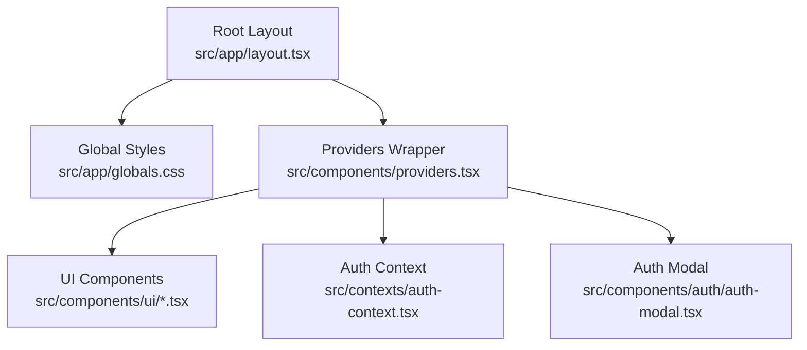
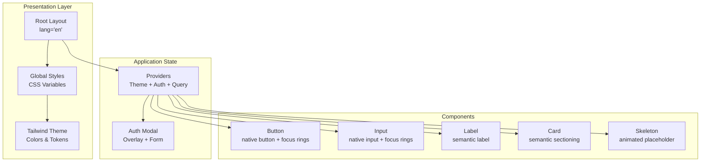
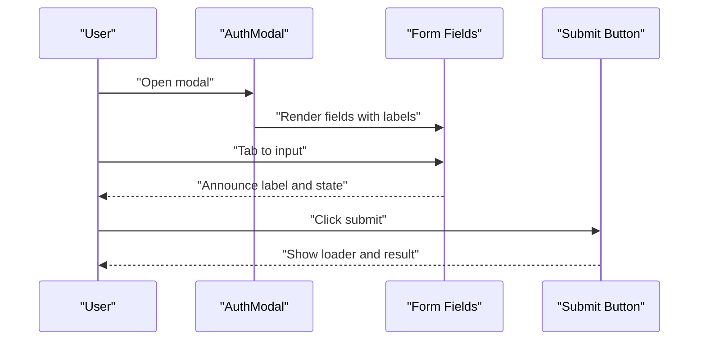
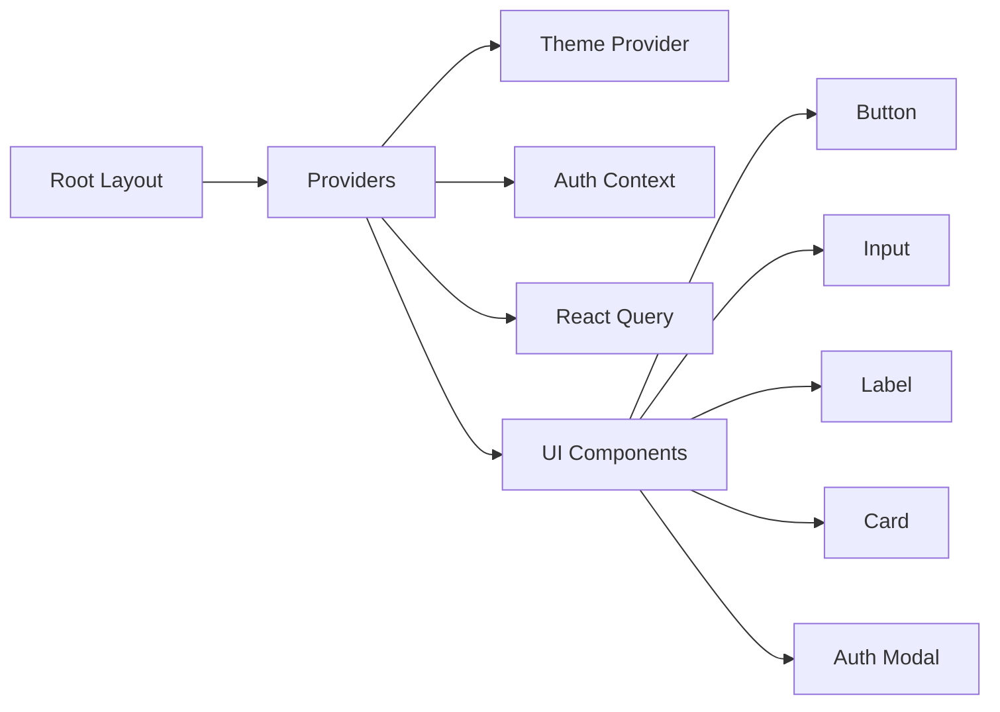

# Accessibility & Compliance

<cite>
**Referenced Files in This Document**
- [README.md](file://README.md)
- [src/app/layout.tsx](file://src/app/layout.tsx)
- [src/app/globals.css](file://src/app/globals.css)
- [tailwind.config.js](file://tailwind.config.js)
- [src/components/providers.tsx](file://src/components/providers.tsx)
- [src/components/ui/button.tsx](file://src/components/ui/button.tsx)
- [src/components/ui/input.tsx](file://src/components/ui/input.tsx)
- [src/components/ui/label.tsx](file://src/components/ui/label.tsx)
- [src/components/ui/card.tsx](file://src/components/ui/card.tsx)
- [src/components/ui/skeleton.tsx](file://src/components/ui/skeleton.tsx)
- [src/components/ui/toaster.tsx](file://src/components/ui/toaster.tsx)
- [src/components/auth/auth-modal.tsx](file://src/components/auth/auth-modal.tsx)
- [src/contexts/auth-context.tsx](file://src/contexts/auth-context.tsx)
</cite>

## Table of Contents
1. [Introduction](#introduction)
2. [Project Structure](#project-structure)
3. [Core Components](#core-components)
4. [Architecture Overview](#architecture-overview)
5. [Detailed Component Analysis](#detailed-component-analysis)
6. [Dependency Analysis](#dependency-analysis)
7. [Performance Considerations](#performance-considerations)
8. [Troubleshooting Guide](#troubleshooting-guide)
9. [Conclusion](#conclusion)
10. [Appendices](#appendices)

## Introduction
This document defines the accessibility implementation and compliance strategy for the WorldBest application. It aligns the existing codebase with WCAG 2.1 guidelines, covering ARIA attributes, semantic HTML, keyboard navigation, screen reader compatibility, focus management, interactive labeling, color contrast, text alternatives, multimedia accessibility, inclusive design patterns, cognitive accessibility, and assistive technology support. It also provides practical examples for accessible forms, modal dialogs, and navigation systems, along with automated and manual testing approaches, legal compliance expectations, and maintenance guidelines.

## Project Structure
The application follows a Next.js App Router structure with a global layout, providers for state and theming, and a UI component library built on Radix UI and Tailwind CSS. The global stylesheet defines theme tokens and component utilities. Providers wrap the app with theme switching, authentication, and server-state management.

**Diagram sources**
- [src/app/layout.tsx](file://src/app/layout.tsx#L83-L102)
- [src/app/globals.css](file://src/app/globals.css#L1-L141)
- [src/components/providers.tsx](file://src/components/providers.tsx#L10-L55)
- [src/components/ui/button.tsx](file://src/components/ui/button.tsx#L1-L55)
- [src/components/ui/input.tsx](file://src/components/ui/input.tsx#L1-L24)
- [src/components/ui/label.tsx](file://src/components/ui/label.tsx#L1-L23)
- [src/components/auth/auth-modal.tsx](file://src/components/auth/auth-modal.tsx#L1-L212)
- [src/contexts/auth-context.tsx](file://src/contexts/auth-context.tsx#L1-L154)

**Section sources**
- [src/app/layout.tsx](file://src/app/layout.tsx#L1-L102)
- [src/app/globals.css](file://src/app/globals.css#L1-L141)
- [tailwind.config.js](file://tailwind.config.js#L1-L108)
- [src/components/providers.tsx](file://src/components/providers.tsx#L1-L55)

## Core Components
- Semantic HTML and metadata: The root layout sets the document language and SEO metadata, ensuring screen readers and crawlers receive proper context.
- Theming and color tokens: Tailwind theme maps CSS variables to HSL values, enabling consistent light/dark modes and predictable contrast ratios.
- Focus and keyboard interaction: UI primitives expose native button semantics and focus-visible rings via Tailwind utilities.
- Form controls: Inputs and labels are paired semantically to support keyboard navigation and assistive technologies.
- Modal dialog: The auth modal is structured with a header, content, and close affordance, suitable for accessible overlay patterns.

Practical implications:
- Use native elements (button, input, label) to inherit accessible roles and behaviors.
- Maintain focus order and trap focus inside modals when appropriate.
- Provide visible focus indicators and ensure sufficient contrast against backgrounds.

**Section sources**
- [src/app/layout.tsx](file://src/app/layout.tsx#L14-L81)
- [tailwind.config.js](file://tailwind.config.js#L18-L58)
- [src/components/ui/button.tsx](file://src/components/ui/button.tsx#L6-L33)
- [src/components/ui/input.tsx](file://src/components/ui/input.tsx#L7-L21)
- [src/components/ui/label.tsx](file://src/components/ui/label.tsx#L10-L20)
- [src/components/auth/auth-modal.tsx](file://src/components/auth/auth-modal.tsx#L74-L212)

## Architecture Overview
The accessibility architecture centers on:
- Semantic markup and metadata at the root level.
- Theme-aware color tokens for consistent contrast.
- UI primitives that preserve native semantics and focus behavior.
- Provider stack that enables global state and theme switching without breaking accessibility.

**Diagram sources**
- [src/app/layout.tsx](file://src/app/layout.tsx#L83-L102)
- [src/app/globals.css](file://src/app/globals.css#L5-L66)
- [tailwind.config.js](file://tailwind.config.js#L18-L58)
- [src/components/ui/button.tsx](file://src/components/ui/button.tsx#L6-L33)
- [src/components/ui/input.tsx](file://src/components/ui/input.tsx#L7-L21)
- [src/components/ui/label.tsx](file://src/components/ui/label.tsx#L10-L20)
- [src/components/ui/card.tsx](file://src/components/ui/card.tsx#L4-L78)
- [src/components/ui/skeleton.tsx](file://src/components/ui/skeleton.tsx#L3-L15)
- [src/components/providers.tsx](file://src/components/providers.tsx#L10-L55)
- [src/components/auth/auth-modal.tsx](file://src/components/auth/auth-modal.tsx#L74-L212)

## Detailed Component Analysis

### Semantic HTML and Metadata
- The root layout sets the document language and rich metadata for SEO and accessibility crawlers.
- Fonts are configured with CSS variables for consistent scaling and readability.
- Open Graph and Twitter metadata provide meaningful context for shared links.

Recommendations:
- Ensure all pages declare a unique and descriptive title.
- Provide concise meta descriptions and alt text for images.
- Use structured data where appropriate for content discovery.

**Section sources**
- [src/app/layout.tsx](file://src/app/layout.tsx#L14-L81)

### Theming, Color Tokens, and Contrast
- Tailwind theme maps CSS variables to HSL values for background, foreground, borders, and semantic roles.
- Dark mode class toggles provide a consistent color scheme across themes.
- Utilities define focus-visible rings and hover states that remain visible under keyboard navigation.

Recommendations:
- Verify WCAG contrast ratios (minimum 4.5:1 for normal text, 3:1 for large text) across both light and dark themes.
- Avoid using color alone to convey meaning; pair icons, labels, and text.
- Test dynamic color changes (e.g., hover/focus) with reduced motion preferences.

**Section sources**
- [src/app/globals.css](file://src/app/globals.css#L5-L66)
- [tailwind.config.js](file://tailwind.config.js#L18-L58)
- [src/components/ui/button.tsx](file://src/components/ui/button.tsx#L6-L33)

### Keyboard Navigation and Focus Management
- Buttons include focus-visible rings and maintain keyboard operability.
- Inputs support focus management and visible focus indicators.
- Cards provide semantic grouping for screen reader navigation.

Recommendations:
- Ensure all interactive elements are reachable via Tab and Shift+Tab.
- Manage focus after dynamic updates (e.g., opening modals).
- Provide skip links for complex layouts.

**Section sources**
- [src/components/ui/button.tsx](file://src/components/ui/button.tsx#L6-L33)
- [src/components/ui/input.tsx](file://src/components/ui/input.tsx#L7-L21)
- [src/components/ui/card.tsx](file://src/components/ui/card.tsx#L4-L78)

### Screen Reader Compatibility and ARIA
- Native HTML elements (button, input, label) provide implicit ARIA roles and names.
- The auth modal uses a heading hierarchy and descriptive labels to aid screen reader users.
- Toast notifications integrate with a notification system; ensure announcements are clear and dismissible.

Recommendations:
- Use aria-describedby for complex controls and error messaging.
- Provide aria-live regions for dynamic content updates.
- Avoid overriding native semantics with generic divs and spans.

**Section sources**
- [src/components/ui/label.tsx](file://src/components/ui/label.tsx#L10-L20)
- [src/components/auth/auth-modal.tsx](file://src/components/auth/auth-modal.tsx#L74-L212)
- [src/components/ui/toaster.tsx](file://src/components/ui/toaster.tsx#L1-L1)

### Accessible Forms
- Pair labels with inputs using htmlFor/id to ensure screen readers announce context.
- Provide inline error messages with accessible names and roles.
- Respect disabled states and ensure focus does not land on disabled elements.

Example patterns:
- Use the label component with an input id to associate them.
- Display validation messages near the field with appropriate text contrast.
- Announce form submission outcomes via toast notifications.

**Section sources**
- [src/components/ui/label.tsx](file://src/components/ui/label.tsx#L10-L20)
- [src/components/ui/input.tsx](file://src/components/ui/input.tsx#L7-L21)
- [src/components/auth/auth-modal.tsx](file://src/components/auth/auth-modal.tsx#L97-L165)

### Modal Dialogs
- The auth modal is structured with a header, content area, and close action.
- Overlay backdrop and z-index create a distinct modal context.
- Focus trapping and escape behavior should be implemented to meet WCAG requirements.

Recommendations:
- Set aria-modal and aria-labelledby/aria-describedby on the modal container.
- Trap focus within the modal until dismissed.
- Provide an easy way to close via Escape key and clicking outside the modal area.

**Diagram sources**
- [src/components/auth/auth-modal.tsx](file://src/components/auth/auth-modal.tsx#L74-L212)
- [src/components/ui/button.tsx](file://src/components/ui/button.tsx#L6-L33)
- [src/components/ui/input.tsx](file://src/components/ui/input.tsx#L7-L21)
- [src/components/ui/label.tsx](file://src/components/ui/label.tsx#L10-L20)

**Section sources**
- [src/components/auth/auth-modal.tsx](file://src/components/auth/auth-modal.tsx#L74-L212)

### Navigation Systems
- The global layout establishes the document context; ensure navigation landmarks are present.
- Use semantic headings to structure content and improve screen reader navigation.
- Provide visible focus indicators and keyboard shortcuts where appropriate.

Recommendations:
- Group related navigation items under landmark regions (e.g., navigation, main).
- Use skip links to bypass repeated navigation blocks.
- Ensure keyboard-only navigation supports arrow keys for menus and tabs.

**Section sources**
- [src/app/layout.tsx](file://src/app/layout.tsx#L83-L102)

### Multimedia Accessibility
- Images should include descriptive alt text in metadata and content areas.
- Videos/audio should include captions/subtitles and transcripts when applicable.
- Controls should be operable via keyboard and screen readers.

Recommendations:
- Use short alt text for decorative images and descriptive alt text for meaningful ones.
- Provide transcripts and captions for audio/video content.
- Offer controls for play/pause, volume, and speed.

[No sources needed since this section provides general guidance]

### Cognitive Accessibility
- Keep language simple and predictable.
- Provide clear feedback and error messages.
- Allow users to control timing, motion, and transitions.

Recommendations:
- Use consistent navigation and terminology.
- Offer options to reduce motion and simplify layouts.
- Provide help text and tooltips sparingly and ensure they are dismissible.

[No sources needed since this section provides general guidance]

## Dependency Analysis
The accessibility posture depends on the interplay between the layout, providers, and UI components. Providers manage theme and authentication, while UI components encapsulate accessible primitives.

**Diagram sources**
- [src/app/layout.tsx](file://src/app/layout.tsx#L83-L102)
- [src/components/providers.tsx](file://src/components/providers.tsx#L10-L55)
- [src/components/ui/button.tsx](file://src/components/ui/button.tsx#L1-L55)
- [src/components/ui/input.tsx](file://src/components/ui/input.tsx#L1-L24)
- [src/components/ui/label.tsx](file://src/components/ui/label.tsx#L1-L23)
- [src/components/ui/card.tsx](file://src/components/ui/card.tsx#L1-L78)
- [src/components/auth/auth-modal.tsx](file://src/components/auth/auth-modal.tsx#L1-L212)
- [src/contexts/auth-context.tsx](file://src/contexts/auth-context.tsx#L1-L154)

**Section sources**
- [src/components/providers.tsx](file://src/components/providers.tsx#L10-L55)
- [src/contexts/auth-context.tsx](file://src/contexts/auth-context.tsx#L1-L154)

## Performance Considerations
- Prefer lightweight animations and avoid excessive motion to accommodate vestibular disabilities.
- Ensure focus indicators remain visible even when animations are disabled.
- Optimize image loading and lazy-load non-critical assets to improve perceived performance.

[No sources needed since this section provides general guidance]

## Troubleshooting Guide
Common accessibility issues and resolutions:
- Missing labels for inputs: Pair labels with inputs using htmlFor/id and ensure visible association.
- Poor focus management: Add focus-visible rings and ensure focus moves predictably through the page.
- Insufficient contrast: Adjust color tokens or fallbacks to meet WCAG thresholds across themes.
- Modal focus traps: Implement focus trapping and Escape key handling in overlays.
- Dynamic content updates: Announce changes via aria-live regions or notifications.

Testing checklist:
- Keyboard-only navigation across all interactive elements.
- Screen reader testing with NVDA/JAWS/VoiceOver.
- Automated scanning with axe-core/Lighthouse.
- Manual verification of focus order and ARIA attributes.

**Section sources**
- [src/components/ui/label.tsx](file://src/components/ui/label.tsx#L10-L20)
- [src/components/ui/input.tsx](file://src/components/ui/input.tsx#L7-L21)
- [src/components/ui/button.tsx](file://src/components/ui/button.tsx#L6-L33)
- [src/components/auth/auth-modal.tsx](file://src/components/auth/auth-modal.tsx#L74-L212)

## Conclusion
The WorldBest application establishes a solid foundation for accessibility through semantic HTML, a robust theming system, and accessible UI primitives. By adhering to WCAG 2.1 guidelines—particularly in focus management, labeling, contrast, and modal behavior—the platform can deliver an inclusive experience. Continued attention to automated and manual testing, combined with user feedback, will ensure ongoing compliance and usability.

[No sources needed since this section summarizes without analyzing specific files]

## Appendices

### WCAG 2.1 Guideline Alignment
- Perceivable: Provide text alternatives, sufficient contrast, and alternative ways to access content.
- Operable: Ensure keyboard accessibility, enough time to read and use content, and avoid content that causes seizures.
- Understandable: Make content readable and predictable; ensure forms communicate errors clearly.
- Robust: Maximize compatibility with assistive technologies.

[No sources needed since this section provides general guidance]

### Automated Accessibility Testing Tools
- axe-core (browser extension and CI integrations)
- Lighthouse (built into Chrome DevTools)
- Pa11y or Deque’s axe Browser Plugin
- Storybook addons for accessibility (when implemented)

[No sources needed since this section provides general guidance]

### Manual Testing Procedures
- Navigate the entire application using only the keyboard.
- Verify screen reader announcements for all interactive elements and page sections.
- Check focus indicators and focus order across pages and modals.
- Validate color contrast across light and dark themes.
- Test dynamic updates and notifications for screen reader compatibility.

[No sources needed since this section provides general guidance]

### Legal Compliance and Statements
- WCAG 2.1 AA conformance is recommended for public-facing applications.
- Include an accessibility statement on the website detailing commitments, coverage, and contact information.
- Provide a way for users to report accessibility issues and request accommodations.

[No sources needed since this section provides general guidance]

### Maintenance Guidelines
- Integrate accessibility checks into CI pipelines.
- Conduct regular audits during feature development and design iterations.
- Establish accessibility acceptance criteria alongside functional requirements.
- Train contributors on accessible component creation and testing.

[No sources needed since this section provides general guidance]