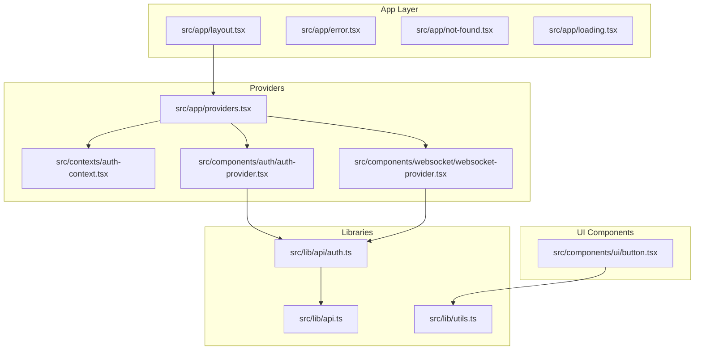
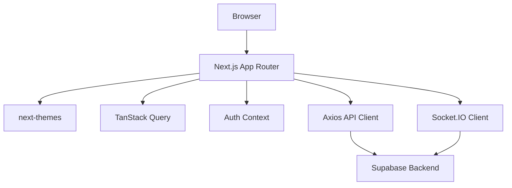
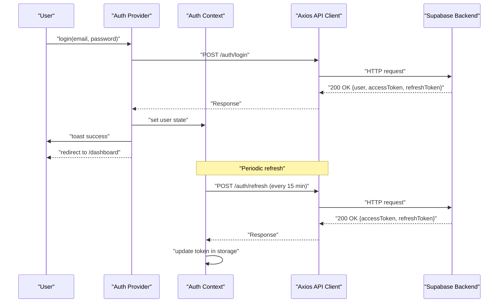
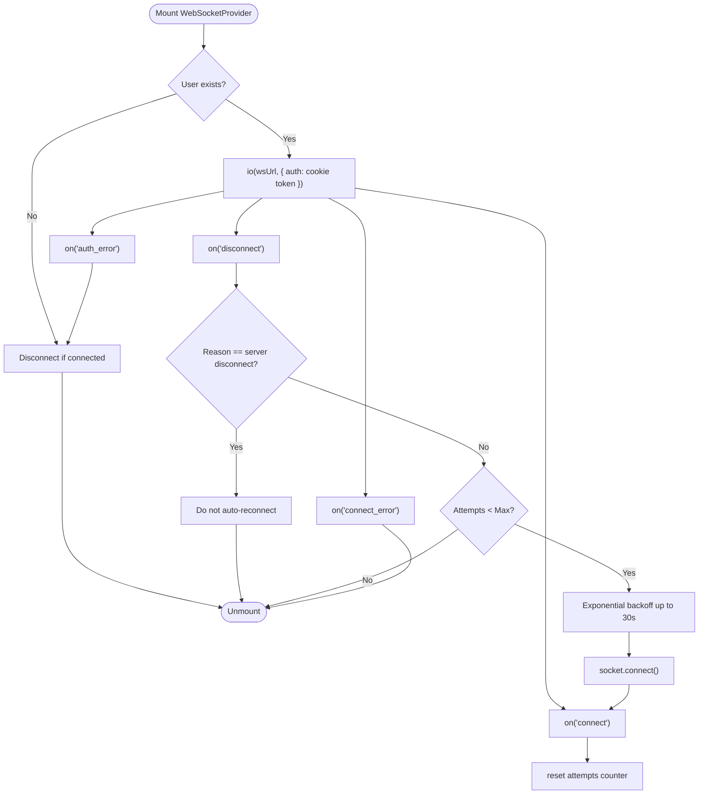
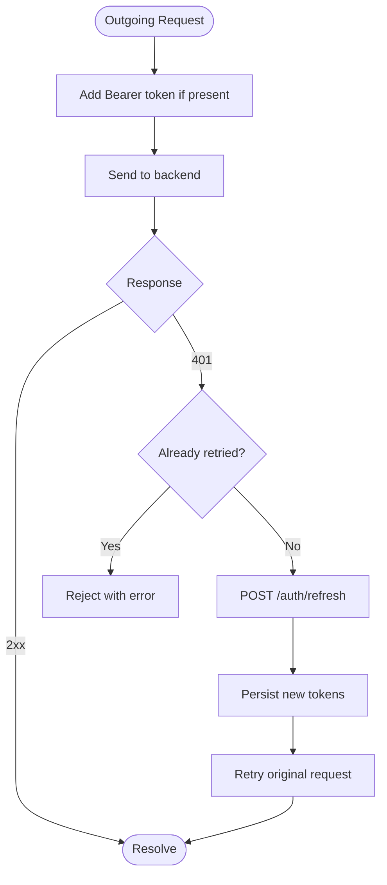
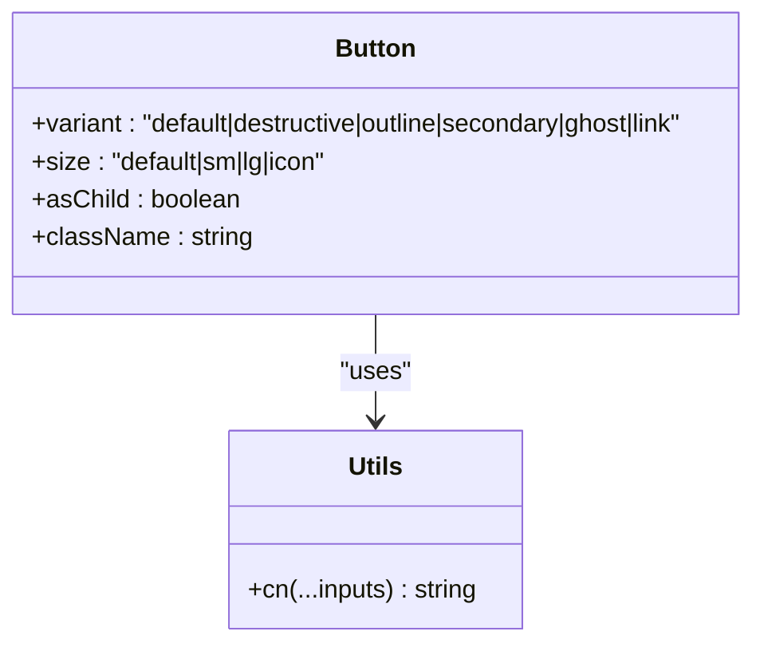
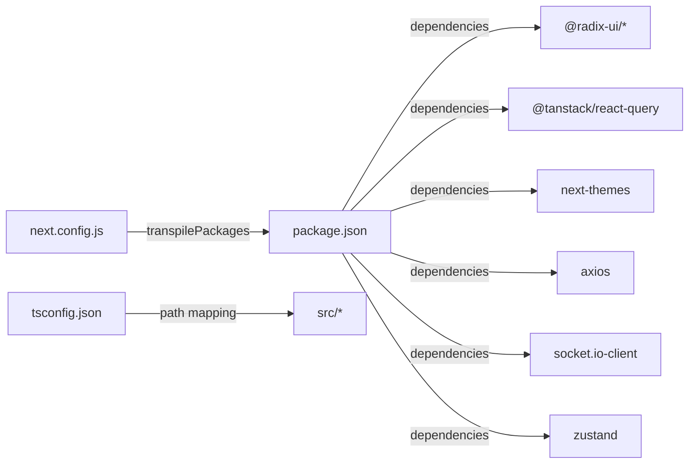

# Advanced Topics

<cite>
**Referenced Files in This Document**
- [README.md](file://README.md)
- [package.json](file://package.json)
- [next.config.js](file://next.config.js)
- [tsconfig.json](file://tsconfig.json)
- [src/app/layout.tsx](file://src/app/layout.tsx)
- [src/app/providers.tsx](file://src/app/providers.tsx)
- [src/app/error.tsx](file://src/app/error.tsx)
- [src/app/not-found.tsx](file://src/app/not-found.tsx)
- [src/app/loading.tsx](file://src/app/loading.tsx)
- [src/lib/api.ts](file://src/lib/api.ts)
- [src/lib/api/auth.ts](file://src/lib/api/auth.ts)
- [src/lib/utils.ts](file://src/lib/utils.ts)
- [src/contexts/auth-context.tsx](file://src/contexts/auth-context.tsx)
- [src/components/auth/auth-provider.tsx](file://src/components/auth/auth-provider.tsx)
- [src/components/websocket/websocket-provider.tsx](file://src/components/websocket/websocket-provider.tsx)
- [src/components/ui/button.tsx](file://src/components/ui/button.tsx)
</cite>

## Table of Contents
1. [Introduction](#introduction)
2. [Project Structure](#project-structure)
3. [Core Components](#core-components)
4. [Architecture Overview](#architecture-overview)
5. [Detailed Component Analysis](#detailed-component-analysis)
6. [Dependency Analysis](#dependency-analysis)
7. [Performance Considerations](#performance-considerations)
8. [Security Best Practices](#security-best-practices)
9. [Accessibility Implementation](#accessibility-implementation)
10. [Internationalization Support](#internationalization-support)
11. [Scalability Strategies](#scalability-strategies)
12. [Monitoring and Observability](#monitoring-and-observability)
13. [Troubleshooting Guide](#troubleshooting-guide)
14. [Conclusion](#conclusion)
15. [Appendices](#appendices)

## Introduction
This document consolidates advanced topics for performance optimization, security hardening, accessibility, and scalability. It explains advanced React patterns, TypeScript optimization, and performance monitoring. It also documents security measures, accessibility compliance, internationalization support, scalability strategies, database optimization, caching mechanisms, and practical examples for profiling, auditing, and testing. The content is designed to be accessible to beginners while providing sufficient technical depth for experienced developers.

## Project Structure
The application follows a Next.js App Router structure with a clear separation of concerns:
- Application pages under src/app
- Shared UI components under src/components/ui
- Feature-specific components under src/components
- Providers and contexts under src/app and src/components
- Utilities and API clients under src/lib
- Global styles and theme providers under src/styles and src/app/providers.tsx

**Diagram sources**
- [src/app/layout.tsx](file://src/app/layout.tsx#L1-L102)
- [src/app/providers.tsx](file://src/app/providers.tsx#L1-L37)
- [src/contexts/auth-context.tsx](file://src/contexts/auth-context.tsx#L1-L154)
- [src/components/auth/auth-provider.tsx](file://src/components/auth/auth-provider.tsx#L1-L165)
- [src/components/websocket/websocket-provider.tsx](file://src/components/websocket/websocket-provider.tsx#L1-L138)
- [src/lib/api.ts](file://src/lib/api.ts#L1-L67)
- [src/lib/api/auth.ts](file://src/lib/api/auth.ts#L1-L101)
- [src/lib/utils.ts](file://src/lib/utils.ts#L1-L6)
- [src/components/ui/button.tsx](file://src/components/ui/button.tsx#L1-L55)

**Section sources**
- [README.md](file://README.md#L73-L104)
- [src/app/layout.tsx](file://src/app/layout.tsx#L1-L102)
- [src/app/providers.tsx](file://src/app/providers.tsx#L1-L37)

## Core Components
- Providers encapsulate TanStack Query, theme switching, and authentication context.
- Authentication providers manage user state, token lifecycle, and session persistence.
- WebSocket provider manages real-time connections with exponential backoff and auth propagation.
- API client centralizes HTTP requests, interceptors for auth and refresh, and centralized error handling.
- UI utilities provide composable, theme-aware components and class merging helpers.

Key implementation patterns:
- Context-based state management with controlled updates and safe consumption via hooks.
- Provider composition to ensure correct initialization order and global availability.
- Centralized API client with interceptors for robust auth and refresh flows.
- UI primitives with variant and size variants for consistent styling.

**Section sources**
- [src/app/providers.tsx](file://src/app/providers.tsx#L1-L37)
- [src/contexts/auth-context.tsx](file://src/contexts/auth-context.tsx#L1-L154)
- [src/components/auth/auth-provider.tsx](file://src/components/auth/auth-provider.tsx#L1-L165)
- [src/components/websocket/websocket-provider.tsx](file://src/components/websocket/websocket-provider.tsx#L1-L138)
- [src/lib/api.ts](file://src/lib/api.ts#L1-L67)
- [src/lib/api/auth.ts](file://src/lib/api/auth.ts#L1-L101)
- [src/lib/utils.ts](file://src/lib/utils.ts#L1-L6)
- [src/components/ui/button.tsx](file://src/components/ui/button.tsx#L1-L55)

## Architecture Overview
The runtime architecture integrates:
- Frontend: Next.js App Router, React 18, TypeScript strict mode, Tailwind CSS, Radix UI.
- State: TanStack Query for server-state caching and synchronization; Zustand planned.
- Authentication: JWT tokens with refresh cycles; cookie-based session on the frontend; Supabase RLS planned.
- Real-time: Socket.IO with automatic reconnection and auth propagation.
- Infrastructure: Vercel hosting, Docker containerization, GitHub Actions CI/CD, Sentry error tracking.

**Diagram sources**
- [src/app/layout.tsx](file://src/app/layout.tsx#L1-L102)
- [src/app/providers.tsx](file://src/app/providers.tsx#L1-L37)
- [src/lib/api.ts](file://src/lib/api.ts#L1-L67)
- [src/components/websocket/websocket-provider.tsx](file://src/components/websocket/websocket-provider.tsx#L1-L138)
- [src/contexts/auth-context.tsx](file://src/contexts/auth-context.tsx#L1-L154)

## Detailed Component Analysis

### Authentication Flow and Token Management
The authentication system combines cookie-based sessions on the client with JWT refresh cycles and centralized toast notifications.

**Diagram sources**
- [src/components/auth/auth-provider.tsx](file://src/components/auth/auth-provider.tsx#L67-L141)
- [src/contexts/auth-context.tsx](file://src/contexts/auth-context.tsx#L57-L125)
- [src/lib/api.ts](file://src/lib/api.ts#L39-L65)
- [src/lib/api/auth.ts](file://src/lib/api/auth.ts#L25-L50)

**Section sources**
- [src/components/auth/auth-provider.tsx](file://src/components/auth/auth-provider.tsx#L1-L165)
- [src/contexts/auth-context.tsx](file://src/contexts/auth-context.tsx#L1-L154)
- [src/lib/api.ts](file://src/lib/api.ts#L1-L67)
- [src/lib/api/auth.ts](file://src/lib/api/auth.ts#L1-L101)

### WebSocket Provider and Reconnection Logic
The WebSocket provider connects when a user exists, passes auth tokens, and implements exponential backoff with capped delays.

**Diagram sources**
- [src/components/websocket/websocket-provider.tsx](file://src/components/websocket/websocket-provider.tsx#L24-L93)

**Section sources**
- [src/components/websocket/websocket-provider.tsx](file://src/components/websocket/websocket-provider.tsx#L1-L138)

### API Client Interceptors and Token Refresh
The Axios client adds Authorization headers and handles 401 responses by refreshing tokens and retrying the original request.

**Diagram sources**
- [src/lib/api.ts](file://src/lib/api.ts#L10-L65)

**Section sources**
- [src/lib/api.ts](file://src/lib/api.ts#L1-L67)

### UI Utilities and Component Variants
The button component demonstrates variant and size composition using class variance authority and Tailwind merging utilities.

**Diagram sources**
- [src/components/ui/button.tsx](file://src/components/ui/button.tsx#L1-L55)
- [src/lib/utils.ts](file://src/lib/utils.ts#L1-L6)

**Section sources**
- [src/components/ui/button.tsx](file://src/components/ui/button.tsx#L1-L55)
- [src/lib/utils.ts](file://src/lib/utils.ts#L1-L6)

## Dependency Analysis
- Next.js configuration enables transpilation for monorepo packages and externalizes server-side packages, supporting modular architecture.
- TypeScript path mapping simplifies imports across shared packages and local modules.
- Runtime dependencies include UI primitives, state management, theming, networking, and real-time communication.

**Diagram sources**
- [package.json](file://package.json#L1-L80)
- [tsconfig.json](file://tsconfig.json#L1-L38)
- [next.config.js](file://next.config.js#L1-L56)

**Section sources**
- [package.json](file://package.json#L1-L80)
- [tsconfig.json](file://tsconfig.json#L1-L38)
- [next.config.js](file://next.config.js#L1-L56)

## Performance Considerations
- Bundle size and build optimization: Enable Next.js static optimization and code splitting; consider dynamic imports for heavy features.
- Caching strategies:
  - Client-side: TanStack Query cache with appropriate staleTime and refetch policies.
  - Network: Axios caching layer for idempotent GET requests (optional).
  - CDN: Leverage Vercel’s edge network for assets and middleware.
- Rendering performance:
  - Use React.memo and shallow comparisons for frequently re-rendered props.
  - Virtualize long lists with windowing libraries.
  - Defer non-critical resources with lazy loading.
- Monitoring:
  - Use Next.js profiler and React DevTools Profiler.
  - Instrument API latency and error rates.
  - Track Largest Contentful Paint (LCP), First Input Delay (FID), and Cumulative Layout Shift (CLS).

Practical examples:
- Profile a page render: Use React DevTools Profiler to identify expensive components.
- Measure API latency: Wrap fetch calls with performance marks and measure durations.
- Optimize hydration: Use skeleton loaders and progressive enhancement.

[No sources needed since this section provides general guidance]

## Security Best Practices
- Authentication:
  - Prefer HttpOnly cookies for tokens when backend supports it; otherwise, enforce SameSite, Secure flags and restrict domains.
  - Implement periodic token refresh and logout cleanup.
- Input validation:
  - Use Zod for request validation and sanitization.
- Transport security:
  - Enforce HTTPS in production and configure HSTS.
  - Add Content Security Policy (CSP) headers.
- Access control:
  - Implement RBAC and resource-level permissions.
  - Enforce server-side authorization and Supabase RLS policies.
- Auditing:
  - Log sensitive actions and monitor anomalies.
  - Integrate with a SIEM or log aggregation platform.

Practical examples:
- Audit token storage: Replace localStorage with cookies for tokens and validate SameSite/Secure attributes.
- Validate forms: Add Zod resolvers to all forms and sanitize inputs.
- Security headers: Add CSP, X-Frame-Options, X-Content-Type-Options via Next.js headers.

[No sources needed since this section provides general guidance]

## Accessibility Implementation
- Semantic markup: Use native elements and ARIA roles appropriately.
- Keyboard navigation: Ensure full keyboard operability for modals, menus, and dialogs.
- Screen reader support: Provide labels, live regions, and skip links.
- Color contrast: Maintain WCAG AA contrast ratios; support reduced motion preferences.
- Forms: Associate labels with inputs, provide error messages, and success announcements.

Practical examples:
- Test with screen readers: Use NVDA/JAWS or VoiceOver to navigate key flows.
- Keyboard testing: Verify tab order and focus traps in dialogs.
- Contrast checks: Use axe or Lighthouse to audit color contrast.

[No sources needed since this section provides general guidance]

## Internationalization Support
- Dynamic locales: Use Next.js dynamic routes and locale-aware routing.
- Pluralization and formatting: Use libraries like react-intl or formatjs.
- Right-to-left (RTL) layouts: Conditionally apply RTL styles and adjust component alignment.
- Date/time and number formatting: Localize based on user preferences.

[No sources needed since this section provides general guidance]

## Scalability Strategies
- Horizontal scaling: Stateless frontend; scale independently behind a CDN and load balancer.
- Database optimization:
  - Normalize relational schemas; add indexes on hot keys.
  - Use read replicas and connection pooling.
  - Implement soft deletes and archival strategies.
- Caching:
  - Edge caching with Vercel’s CDN.
  - Application-level caching with Redis/Memcached for computed data.
  - CDN caching for static assets and immutable resources.
- Asynchronous processing:
  - Offload heavy tasks to background jobs (queues).
- Observability:
  - Structured logs and metrics.
  - Distributed tracing for request flows.

[No sources needed since this section provides general guidance]

## Monitoring and Observability
- Error tracking: Integrate Sentry for client and server-side error capture.
- Metrics: Track key performance indicators (KPIs) and health signals.
- Logging: Standardize log formats and retention policies.
- Alerting: Configure alerts for latency spikes, error rates, and capacity thresholds.

[No sources needed since this section provides general guidance]

## Troubleshooting Guide
Common issues and resolutions:
- Inconsistent token storage: Align token persistence across auth flows and clear stale tokens on errors.
- Duplicate API client instances: Ensure a single Axios instance is exported and reused.
- WebSocket authentication: Propagate cookies correctly and handle auth_error events.

Practical examples:
- Token lifecycle debugging: Inspect localStorage/cookies and network tabs for auth requests.
- WebSocket diagnostics: Monitor connect/connect_error/disconnect events and reconnection attempts.
- Error boundaries: Use Next.js error handling pages to gracefully display errors and provide recovery actions.

**Section sources**
- [src/app/error.tsx](file://src/app/error.tsx#L1-L65)
- [src/app/not-found.tsx](file://src/app/not-found.tsx#L1-L45)
- [src/components/websocket/websocket-provider.tsx](file://src/components/websocket/websocket-provider.tsx#L77-L86)
- [src/lib/api.ts](file://src/lib/api.ts#L39-L65)

## Conclusion
This guide outlined advanced patterns and practices for performance, security, accessibility, and scalability. By leveraging the existing providers, API client, and UI utilities, teams can implement robust solutions while maintaining a clean, maintainable architecture. Adopt the recommended practices and continuously iterate on monitoring, testing, and optimization.

[No sources needed since this section summarizes without analyzing specific files]

## Appendices

### Advanced Configuration Options
- Next.js:
  - Environment variables exposure and redirects/rewrites.
  - Image optimization with remote patterns.
- TypeScript:
  - Path aliases and strict compiler options.
- Package management:
  - Engine constraints and script commands.

**Section sources**
- [next.config.js](file://next.config.js#L1-L56)
- [tsconfig.json](file://tsconfig.json#L1-L38)
- [package.json](file://package.json#L1-L80)

### Custom Hooks and Utility Functions
- cn: Compose Tailwind classes safely.
- Button variants: Consistent UI primitives with composability.

**Section sources**
- [src/lib/utils.ts](file://src/lib/utils.ts#L1-L6)
- [src/components/ui/button.tsx](file://src/components/ui/button.tsx#L1-L55)