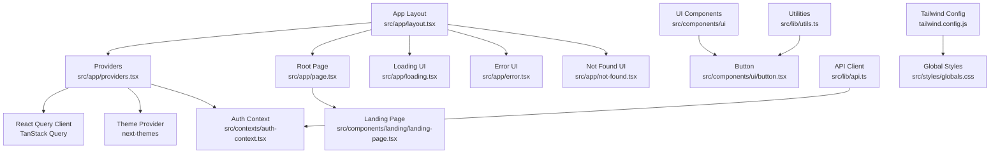
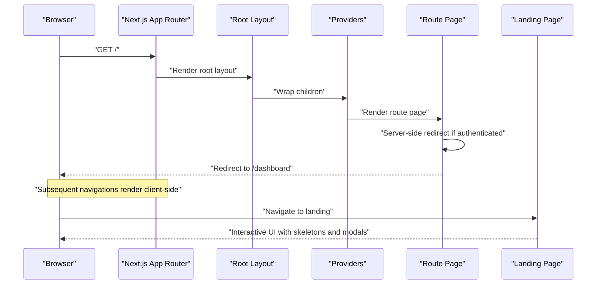
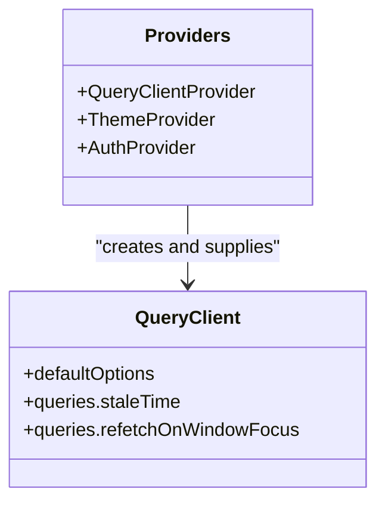
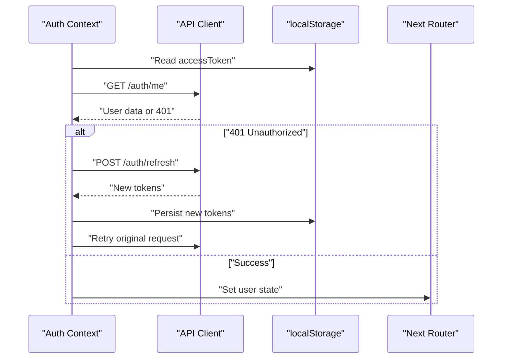
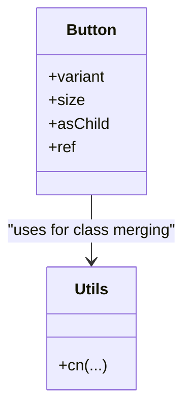
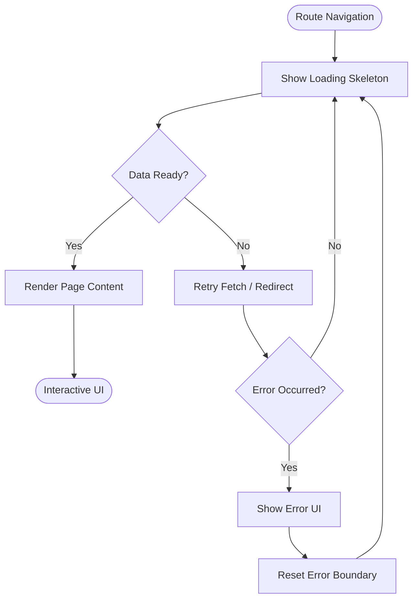
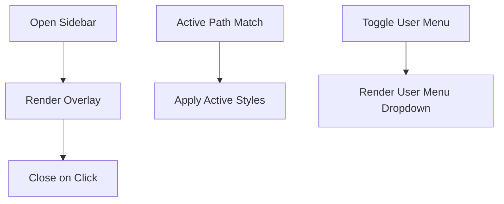
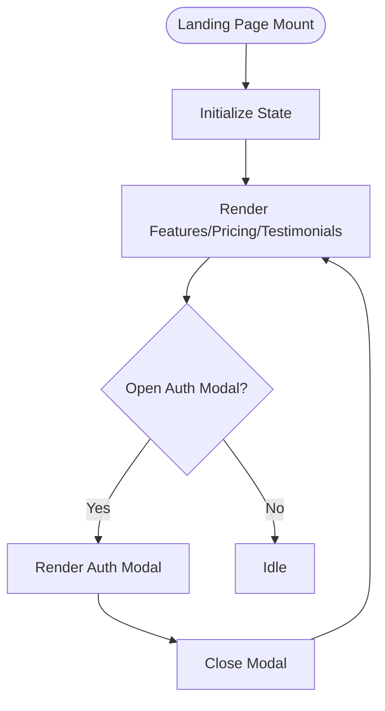
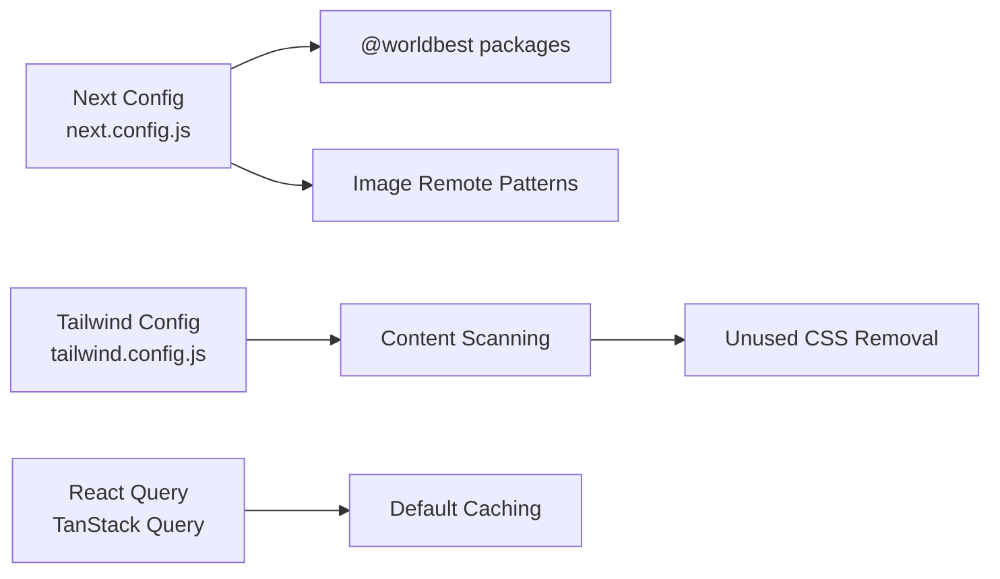

# Performance Optimization

<cite>
**Referenced Files in This Document**
- [next.config.js](file://next.config.js)
- [tsconfig.json](file://tsconfig.json)
- [tailwind.config.js](file://tailwind.config.js)
- [package.json](file://package.json)
- [src/app/layout.tsx](file://src/app/layout.tsx)
- [src/app/providers.tsx](file://src/app/providers.tsx)
- [src/app/page.tsx](file://src/app/page.tsx)
- [src/app/loading.tsx](file://src/app/loading.tsx)
- [src/app/error.tsx](file://src/app/error.tsx)
- [src/app/not-found.tsx](file://src/app/not-found.tsx)
- [src/components/dashboard/dashboard-shell.tsx](file://src/components/dashboard/dashboard-shell.tsx)
- [src/components/landing/landing-page.tsx](file://src/components/landing/landing-page.tsx)
- [src/components/ui/button.tsx](file://src/components/ui/button.tsx)
- [src/components/ui/skeleton.tsx](file://src/components/ui/skeleton.tsx)
- [src/lib/utils.ts](file://src/lib/utils.ts)
- [src/lib/api.ts](file://src/lib/api.ts)
- [src/contexts/auth-context.tsx](file://src/contexts/auth-context.tsx)
- [src/styles/globals.css](file://src/styles/globals.css)
</cite>

## Table of Contents
1. [Introduction](#introduction)
2. [Project Structure](#project-structure)
3. [Core Components](#core-components)
4. [Architecture Overview](#architecture-overview)
5. [Detailed Component Analysis](#detailed-component-analysis)
6. [Dependency Analysis](#dependency-analysis)
7. [Performance Considerations](#performance-considerations)
8. [Troubleshooting Guide](#troubleshooting-guide)
9. [Conclusion](#conclusion)
10. [Appendices](#appendices)

## Introduction
This document consolidates performance optimization techniques implemented in the WorldBest application. It focuses on React performance patterns (memoization, lazy loading, code splitting), Next.js App Router optimization (SSR, ISR, client/server boundaries), TypeScript compile-time optimizations, CSS performance via Tailwind, and practical profiling and monitoring approaches. It also covers caching strategies, data fetching optimization, image optimization, and browser performance best practices.

## Project Structure
The application follows Next.js App Router conventions with a strict separation of client/server boundaries, centralized providers, and a modular UI component library. Key performance-relevant areas include:
- App shell and providers for caching and theming
- Route-level loading and error UIs
- Shared UI primitives and utilities
- Tailwind configuration and global CSS
- API client with interceptors for auth and token refresh

**Diagram sources**
- [src/app/layout.tsx](file://src/app/layout.tsx#L1-L102)
- [src/app/providers.tsx](file://src/app/providers.tsx#L1-L37)
- [src/app/page.tsx](file://src/app/page.tsx#L1-L17)
- [src/components/landing/landing-page.tsx](file://src/components/landing/landing-page.tsx#L1-L434)
- [src/app/loading.tsx](file://src/app/loading.tsx#L1-L39)
- [src/app/error.tsx](file://src/app/error.tsx#L1-L65)
- [src/app/not-found.tsx](file://src/app/not-found.tsx#L1-L45)
- [src/components/ui/button.tsx](file://src/components/ui/button.tsx#L1-L55)
- [src/lib/utils.ts](file://src/lib/utils.ts#L1-L6)
- [src/lib/api.ts](file://src/lib/api.ts#L1-L67)
- [src/contexts/auth-context.tsx](file://src/contexts/auth-context.tsx#L1-L154)
- [tailwind.config.js](file://tailwind.config.js#L1-L108)
- [src/styles/globals.css](file://src/styles/globals.css#L1-L288)

**Section sources**
- [src/app/layout.tsx](file://src/app/layout.tsx#L1-L102)
- [src/app/providers.tsx](file://src/app/providers.tsx#L1-L37)
- [src/app/page.tsx](file://src/app/page.tsx#L1-L17)
- [src/components/landing/landing-page.tsx](file://src/components/landing/landing-page.tsx#L1-L434)
- [src/app/loading.tsx](file://src/app/loading.tsx#L1-L39)
- [src/app/error.tsx](file://src/app/error.tsx#L1-L65)
- [src/app/not-found.tsx](file://src/app/not-found.tsx#L1-L45)
- [src/components/ui/button.tsx](file://src/components/ui/button.tsx#L1-L55)
- [src/lib/utils.ts](file://src/lib/utils.ts#L1-L6)
- [src/lib/api.ts](file://src/lib/api.ts#L1-L67)
- [src/contexts/auth-context.tsx](file://src/contexts/auth-context.tsx#L1-L154)
- [tailwind.config.js](file://tailwind.config.js#L1-L108)
- [src/styles/globals.css](file://src/styles/globals.css#L1-L288)

## Core Components
- Providers encapsulate caching, theming, and auth state for the entire app.
- UI primitives like Button leverage composition and variants to minimize re-renders.
- Utilities consolidate class merging to reduce runtime overhead.
- API client centralizes auth token injection and refresh logic.
- Route-level loading and error UIs improve perceived performance and resilience.

Key performance anchors:
- React Query default caching and staleTime configuration
- Theme switching without transition animations
- Auth checks and redirects on the server/client boundary
- Skeleton-based loading patterns

**Section sources**
- [src/app/providers.tsx](file://src/app/providers.tsx#L1-L37)
- [src/components/ui/button.tsx](file://src/components/ui/button.tsx#L1-L55)
- [src/lib/utils.ts](file://src/lib/utils.ts#L1-L6)
- [src/lib/api.ts](file://src/lib/api.ts#L1-L67)
- [src/app/loading.tsx](file://src/app/loading.tsx#L1-L39)
- [src/app/error.tsx](file://src/app/error.tsx#L1-L65)

## Architecture Overview
The app leverages Next.js App Router with a clear client/server boundary. Providers wrap the app to supply caching, theming, and auth. Route handlers perform server-side checks (redirects, SSR) while client components manage interactive UI and state.

**Diagram sources**
- [src/app/layout.tsx](file://src/app/layout.tsx#L1-L102)
- [src/app/providers.tsx](file://src/app/providers.tsx#L1-L37)
- [src/app/page.tsx](file://src/app/page.tsx#L1-L17)
- [src/components/landing/landing-page.tsx](file://src/components/landing/landing-page.tsx#L1-L434)

## Detailed Component Analysis

### Providers and Caching (React Query)
- Centralizes TanStack Query client with default caching and refetch policies.
- Reduces network thrash by setting a short staleTime and disabling window-focus refetch by default.
- Enables devtools visibility for debugging cache behavior.

**Diagram sources**
- [src/app/providers.tsx](file://src/app/providers.tsx#L1-L37)

**Section sources**
- [src/app/providers.tsx](file://src/app/providers.tsx#L1-L37)

### Authentication and Token Management
- Checks local storage for tokens and fetches user info on mount.
- Injects Authorization header automatically for all requests.
- Implements automatic token refresh on 401 responses with retry logic.
- Clears credentials and redirects to login on refresh failure.

**Diagram sources**
- [src/contexts/auth-context.tsx](file://src/contexts/auth-context.tsx#L1-L154)
- [src/lib/api.ts](file://src/lib/api.ts#L1-L67)

**Section sources**
- [src/contexts/auth-context.tsx](file://src/contexts/auth-context.tsx#L1-L154)
- [src/lib/api.ts](file://src/lib/api.ts#L1-L67)

### UI Primitives and Utilities
- Button uses forwardRef and variant props to avoid unnecessary re-renders.
- Utility function merges Tailwind classes efficiently to prevent redundant DOM updates.

**Diagram sources**
- [src/components/ui/button.tsx](file://src/components/ui/button.tsx#L1-L55)
- [src/lib/utils.ts](file://src/lib/utils.ts#L1-L6)

**Section sources**
- [src/components/ui/button.tsx](file://src/components/ui/button.tsx#L1-L55)
- [src/lib/utils.ts](file://src/lib/utils.ts#L1-L6)

### Route-Level Loading and Error Boundaries
- Loading UI provides skeleton placeholders during navigation.
- Error page displays actionable buttons and logs errors for diagnostics.
- Not-found page offers quick navigation back to known routes.

**Diagram sources**
- [src/app/loading.tsx](file://src/app/loading.tsx#L1-L39)
- [src/app/error.tsx](file://src/app/error.tsx#L1-L65)
- [src/app/not-found.tsx](file://src/app/not-found.tsx#L1-L45)

**Section sources**
- [src/app/loading.tsx](file://src/app/loading.tsx#L1-L39)
- [src/app/error.tsx](file://src/app/error.tsx#L1-L65)
- [src/app/not-found.tsx](file://src/app/not-found.tsx#L1-L45)

### Dashboard Shell and Navigation
- Uses client-side state for mobile sidebar and user menu toggles.
- Applies active state based on pathname to minimize re-renders.
- Integrates icons and responsive layout for smooth UX.

**Diagram sources**
- [src/components/dashboard/dashboard-shell.tsx](file://src/components/dashboard/dashboard-shell.tsx#L1-L224)

**Section sources**
- [src/components/dashboard/dashboard-shell.tsx](file://src/components/dashboard/dashboard-shell.tsx#L1-L224)

### Landing Page and Interactive Elements
- Modular sections with reusable cards and buttons.
- Mobile-first navigation with controlled state.
- Conditional modals and interactive CTAs.

**Diagram sources**
- [src/components/landing/landing-page.tsx](file://src/components/landing/landing-page.tsx#L1-L434)

**Section sources**
- [src/components/landing/landing-page.tsx](file://src/components/landing/landing-page.tsx#L1-L434)

## Dependency Analysis
- Next.js configuration enables server components external packages and transpiles shared packages for faster builds.
- Image optimization allows trusted remote hosts and local MinIO proxy.
- Tailwind scans app and shared UI components to purge unused CSS.
- React Query and related libraries are integrated for efficient caching and data synchronization.

**Diagram sources**
- [next.config.js](file://next.config.js#L1-L56)
- [tailwind.config.js](file://tailwind.config.js#L1-L108)
- [src/app/providers.tsx](file://src/app/providers.tsx#L1-L37)

**Section sources**
- [next.config.js](file://next.config.js#L1-L56)
- [tailwind.config.js](file://tailwind.config.js#L1-L108)
- [package.json](file://package.json#L1-L80)

## Performance Considerations
- React patterns
  - Prefer variant-based UI components to avoid prop churn.
  - Keep state scoped to minimal components; avoid lifting unnecessarily.
  - Use forwardRef and memo-like patterns for primitive components.
- Next.js App Router
  - Use server actions and server components where appropriate for SSR benefits.
  - Implement route-level loading states and error boundaries for resilient UX.
  - Leverage redirects and rewrites to optimize routing and backend integration.
- TypeScript
  - Enable strict mode and incremental builds for faster development feedback.
  - Use utility types and mapped types to reduce runtime checks.
- CSS and Tailwind
  - Keep content globs precise to maximize purging.
  - Use utility classes consistently to avoid custom CSS bloat.
  - Avoid excessive animations for users with motion sensitivity.
- Data fetching
  - Configure React Query staleTime and refetch policies to balance freshness and performance.
  - Implement robust token refresh and retry logic to minimize failed requests.
- Images
  - Use configured remote patterns and consider Next/image for optimized delivery.
  - Serve fallbacks for missing images to prevent layout shifts.
- Profiling and monitoring
  - Use React DevTools Profiler to identify expensive renders.
  - Monitor Web Vitals (LCP, FID, CLS) in production and set up alerts.
- Memory and GC
  - Avoid retaining references to large arrays or nodes after unmount.
  - Debounce or throttle frequent event handlers.
  - Clean up subscriptions and timers in useEffect cleanup.

[No sources needed since this section provides general guidance]

## Troubleshooting Guide
- Authentication failures
  - Verify token presence in localStorage and Authorization header propagation.
  - Confirm refresh endpoint availability and retry logic.
- Network errors
  - Inspect React Query cache state and staleTime behavior.
  - Check interceptors for proper error handling and retry.
- UI regressions
  - Validate Tailwind content globs and purged styles.
  - Review loading and error pages for consistent UX.

**Section sources**
- [src/lib/api.ts](file://src/lib/api.ts#L1-L67)
- [src/contexts/auth-context.tsx](file://src/contexts/auth-context.tsx#L1-L154)
- [src/app/loading.tsx](file://src/app/loading.tsx#L1-L39)
- [src/app/error.tsx](file://src/app/error.tsx#L1-L65)
- [tailwind.config.js](file://tailwind.config.js#L1-L108)

## Conclusion
The WorldBest application integrates several performance-conscious patterns: centralized caching via React Query, efficient UI primitives, robust auth token management, and structured route-level loading/error handling. By refining build configuration, leveraging Next.js SSR/ISR capabilities, optimizing CSS with Tailwind, and adopting rigorous profiling and monitoring practices, further improvements can be achieved.

[No sources needed since this section summarizes without analyzing specific files]

## Appendices
- Practical profiling steps
  - Use React DevTools Profiler to record interactions and inspect component lifecycles.
  - Measure Web Vitals in real browsers and CI environments.
  - Track bundle size and asset budgets with Next.js telemetry or webpack-bundle-analyzer.
- Monitoring checklist
  - LCP, FID, CLS thresholds per category (landing vs. dashboard).
  - Error rate and user-facing error surfaces.
  - Cache hit rates for API endpoints.

[No sources needed since this section provides general guidance]