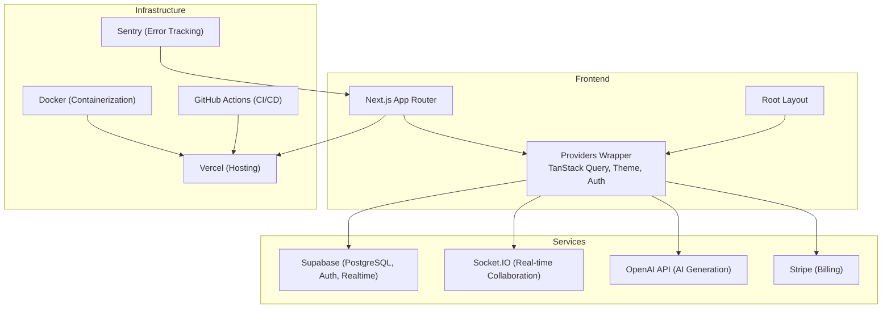
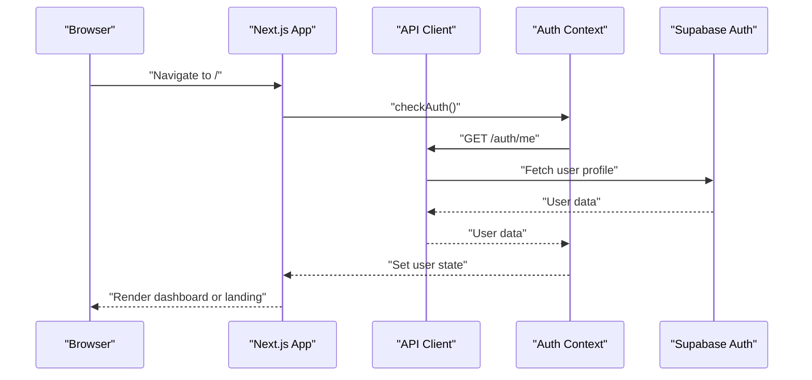
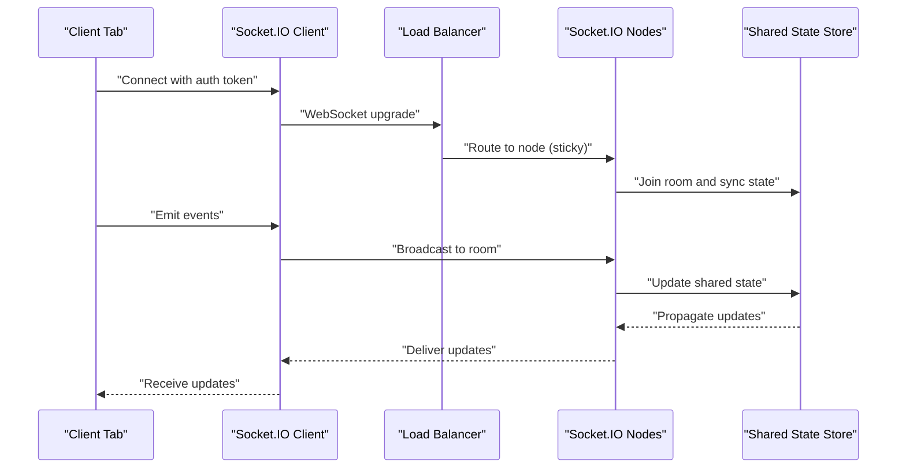
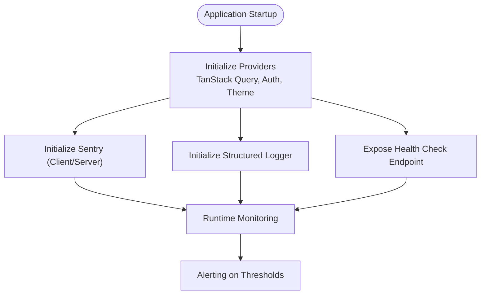
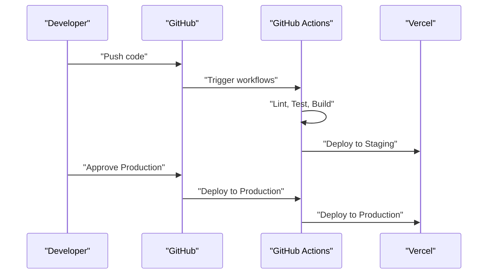
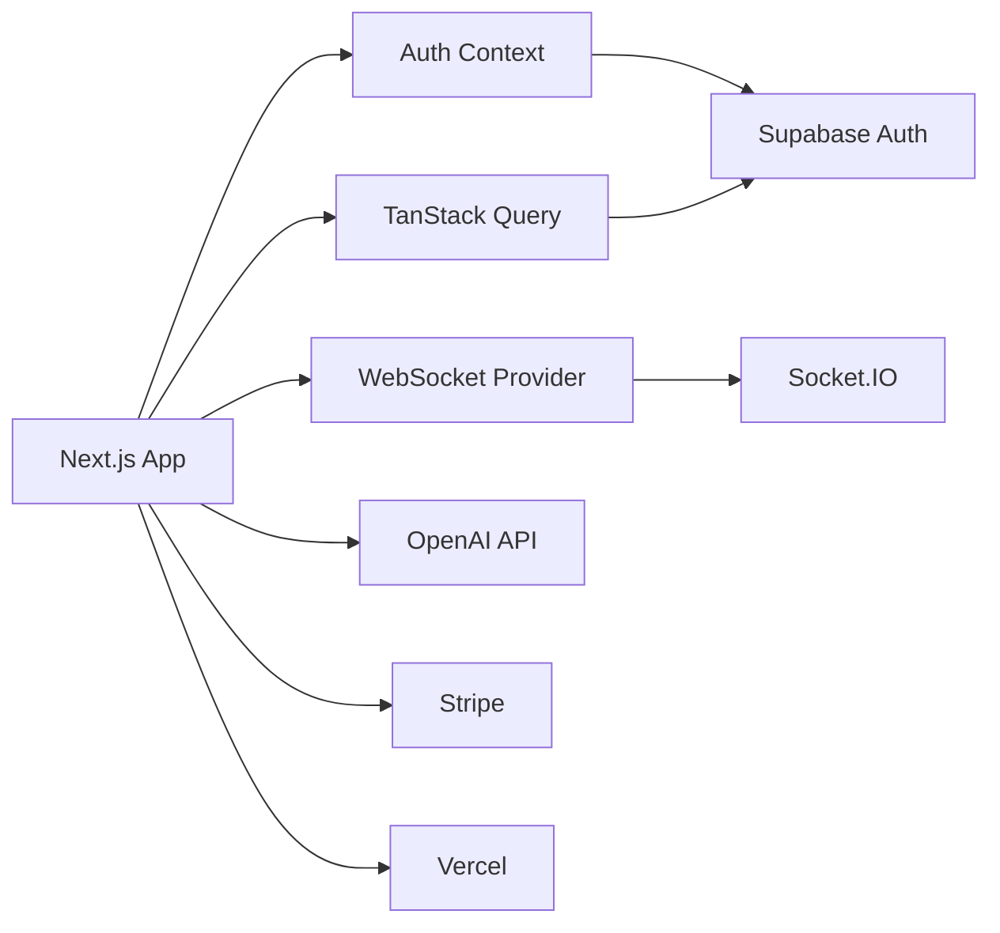

# Scalability & Growth Strategies

<cite>
**Referenced Files in This Document**
- [README.md](file://README.md)
- [DEPLOYMENT.md](file://DEPLOYMENT.md)
- [IMPLEMENTATION_PLAN.md](file://IMPLEMENTATION_PLAN.md)
- [package.json](file://package.json)
- [next.config.js](file://next.config.js)
- [vercel.json](file://vercel.json)
- [src/app/layout.tsx](file://src/app/layout.tsx)
- [src/app/page.tsx](file://src/app/page.tsx)
- [src/app/providers.tsx](file://src/app/providers.tsx)
- [src/contexts/auth-context.tsx](file://src/contexts/auth-context.tsx)
- [src/lib/api.ts](file://src/lib/api.ts)
- [src/lib/api/client.ts](file://src/lib/api/client.ts)
- [src/components/websocket/websocket-provider.tsx](file://src/components/websocket/websocket-provider.tsx)
</cite>

## Table of Contents
1. [Introduction](#introduction)
2. [Project Structure](#project-structure)
3. [Core Components](#core-components)
4. [Architecture Overview](#architecture-overview)
5. [Detailed Component Analysis](#detailed-component-analysis)
6. [Dependency Analysis](#dependency-analysis)
7. [Performance Considerations](#performance-considerations)
8. [Troubleshooting Guide](#troubleshooting-guide)
9. [Conclusion](#conclusion)
10. [Appendices](#appendices)

## Introduction
This document provides a comprehensive scalability and growth strategy for the WorldBest application. It focuses on horizontal scaling, load balancing, microservices architecture considerations, database optimization, caching layers, WebSocket scaling, monitoring and observability, capacity planning, performance benchmarking, infrastructure automation, CI/CD optimization, and practical auto-scaling configurations. The guidance is grounded in the current architecture and implementation details found in the repository.

## Project Structure
WorldBest is a Next.js 14 application using the App Router, TypeScript, and a modern frontend stack. The current runtime architecture integrates:
- Frontend: Next.js App Router, React 18, TanStack Query for server state, Zustand for client state, and Radix UI for components.
- Backend and services: Supabase (PostgreSQL, Auth, Realtime), Socket.IO for real-time collaboration, OpenAI API for AI generation, Stripe for billing, and Vercel for hosting.
- Infrastructure: Docker for containerization, GitHub Actions for CI/CD, and Sentry for error tracking.

**Diagram sources**
- [README.md](file://README.md#L49-L72)
- [src/app/layout.tsx](file://src/app/layout.tsx#L83-L101)
- [src/app/providers.tsx](file://src/app/providers.tsx#L9-L36)
- [vercel.json](file://vercel.json#L1-L4)

**Section sources**
- [README.md](file://README.md#L49-L72)
- [src/app/layout.tsx](file://src/app/layout.tsx#L83-L101)
- [src/app/providers.tsx](file://src/app/providers.tsx#L9-L36)
- [vercel.json](file://vercel.json#L1-L4)

## Core Components
- Authentication and state management: JWT-based authentication with context-based state, token refresh logic, and localStorage persistence. TanStack Query manages server state with controlled stale times.
- Real-time collaboration: WebSocket provider using Socket.IO with exponential backoff, authentication handshake, and event-driven communication.
- API client: Axios-based client with request/response interceptors for token injection and automatic refresh.
- Routing and environment: Next.js rewrites and redirects to proxy API traffic to a backend service, with environment variables for URLs.

Key implementation references:
- Authentication and token refresh: [src/contexts/auth-context.tsx](file://src/contexts/auth-context.tsx#L39-L125)
- API client with interceptors: [src/lib/api.ts](file://src/lib/api.ts#L1-L67)
- WebSocket provider: [src/components/websocket/websocket-provider.tsx](file://src/components/websocket/websocket-provider.tsx#L17-L130)
- Providers and TanStack Query defaults: [src/app/providers.tsx](file://src/app/providers.tsx#L9-L20)
- Next.js rewrites and redirects: [next.config.js](file://next.config.js#L28-L51)

**Section sources**
- [src/contexts/auth-context.tsx](file://src/contexts/auth-context.tsx#L39-L125)
- [src/lib/api.ts](file://src/lib/api.ts#L1-L67)
- [src/components/websocket/websocket-provider.tsx](file://src/components/websocket/websocket-provider.tsx#L17-L130)
- [src/app/providers.tsx](file://src/app/providers.tsx#L9-L20)
- [next.config.js](file://next.config.js#L28-L51)

## Architecture Overview
The current architecture is a frontend-heavy monolith with externalized services:
- Supabase handles database, authentication, and optional realtime channels.
- Socket.IO powers real-time collaboration.
- OpenAI API supports AI-assisted content generation.
- Stripe integrates billing and subscriptions.
- Vercel hosts the Next.js application with environment-driven configuration.

**Diagram sources**
- [src/app/page.tsx](file://src/app/page.tsx#L5-L16)
- [src/contexts/auth-context.tsx](file://src/contexts/auth-context.tsx#L39-L55)
- [src/lib/api.ts](file://src/lib/api.ts#L1-L67)

**Section sources**
- [README.md](file://README.md#L49-L72)
- [src/app/page.tsx](file://src/app/page.tsx#L5-L16)
- [src/contexts/auth-context.tsx](file://src/contexts/auth-context.tsx#L39-L55)
- [src/lib/api.ts](file://src/lib/api.ts#L1-L67)

## Detailed Component Analysis

### Horizontal Scaling Approaches
- Stateful components: The WebSocket provider maintains a single Socket.IO connection per tab and reconnects with exponential backoff. For horizontal scaling, ensure sticky sessions or centralized state for rooms and presence.
- API client: The Axios client injects Authorization headers and retries on 401. Scale backend horizontally behind a load balancer with consistent session affinity for real-time features.
- Frontend: Next.js ISR/SSR can be scaled across multiple instances behind a CDN and load balancer.

Practical steps:
- Use a reverse proxy/load balancer to distribute traffic across Next.js instances.
- For Socket.IO, deploy multiple nodes behind a load balancer with sticky sessions or a shared state store for rooms.
- Implement circuit breakers and bulkheads for API calls to prevent cascading failures.

**Section sources**
- [src/components/websocket/websocket-provider.tsx](file://src/components/websocket/websocket-provider.tsx#L17-L130)
- [src/lib/api.ts](file://src/lib/api.ts#L1-L67)
- [next.config.js](file://next.config.js#L28-L51)

### Load Balancing Strategies
- Next.js rewrites and redirects: The configuration proxies API traffic to a backend service URL, enabling separation of concerns and easier load balancing.
- Environment-driven URLs: NEXT_PUBLIC_API_URL and NEXT_PUBLIC_WS_URL allow swapping endpoints for staging/prod environments.

Recommendations:
- Place a CDN (e.g., Vercel Edge Network) in front of Next.js for static and dynamic content.
- Use a managed load balancer (e.g., AWS ALB/NLB, GCP Cloud Load Balancing) for distributing traffic across Next.js instances.
- For WebSocket scaling, ensure sticky sessions or a shared state mechanism for rooms.

**Section sources**
- [next.config.js](file://next.config.js#L24-L51)
- [src/app/providers.tsx](file://src/app/providers.tsx#L9-L20)

### Microservices Architecture Considerations
- Current monolithic frontend with external services (Supabase, Socket.IO, OpenAI, Stripe).
- Future direction: Extract API endpoints into dedicated microservices behind a gateway, with separate databases per bounded context.

Considerations:
- API gateway for routing, rate limiting, and authentication.
- Event-driven architecture using Supabase Realtime or a message broker for cross-service communication.
- Database per service with eventual consistency and CQRS where appropriate.

**Section sources**
- [README.md](file://README.md#L49-L72)
- [IMPLEMENTATION_PLAN.md](file://IMPLEMENTATION_PLAN.md#L25-L66)

### Database Optimization Techniques
- Supabase PostgreSQL with connection pooling is configured. Ensure:
  - Proper indexing on frequently queried columns (foreign keys, timestamps, user IDs).
  - Query normalization and parameterized queries to avoid N+1 problems.
  - Use of LIMIT/OFFSET or keyset pagination for large datasets.
  - Materialized views or scheduled aggregations for analytics.

- Connection pooling:
  - Use pooled connections (Supabase pooler) and monitor slow queries.
  - Batch writes and reads to reduce round trips.

- Suppression of N+1:
  - Use joins and preloading strategies in API handlers.
  - Implement server-side caching for read-heavy endpoints.

**Section sources**
- [DEPLOYMENT.md](file://DEPLOYMENT.md#L16-L34)
- [IMPLEMENTATION_PLAN.md](file://IMPLEMENTATION_PLAN.md#L522-L527)

### Caching Layers
- Client-side caching:
  - TanStack Query with controlled stale times reduces redundant network calls.
  - Persist critical slices in Zustand for offline resilience.

- CDN and edge computing:
  - Next.js Image Optimization and remote patterns are configured for images.
  - Use Vercel Edge Functions for lightweight compute at the edge.

- Redis (planned):
  - Use Redis for session storage, rate limiting, and pub/sub for real-time events.
  - Implement cache-aside pattern for API responses.

**Section sources**
- [src/app/providers.tsx](file://src/app/providers.tsx#L9-L20)
- [next.config.js](file://next.config.js#L7-L23)
- [IMPLEMENTATION_PLAN.md](file://IMPLEMENTATION_PLAN.md#L510-L521)

### WebSocket Scaling for Real-Time Collaboration
- Current implementation:
  - Socket.IO client with authentication via cookies and exponential backoff.
  - Room-based collaboration requires sticky sessions or centralized state.

- Scaling strategies:
  - Horizontal scaling: Use multiple Socket.IO nodes behind a load balancer with sticky sessions.
  - Centralized state: Store room state in Redis or a database to avoid state divergence.
  - Heartbeats and graceful disconnection handling to minimize ghost connections.

**Diagram sources**
- [src/components/websocket/websocket-provider.tsx](file://src/components/websocket/websocket-provider.tsx#L17-L130)

**Section sources**
- [src/components/websocket/websocket-provider.tsx](file://src/components/websocket/websocket-provider.tsx#L17-L130)
- [IMPLEMENTATION_PLAN.md](file://IMPLEMENTATION_PLAN.md#L275-L314)

### Connection Pooling Strategies
- Supabase connection pooling is configured. Ensure:
  - Separate pooled and non-pooled connections for long-running operations.
  - Monitor pool utilization and adjust pool sizes based on traffic patterns.

- Frontend:
  - Reuse Axios instances and avoid creating multiple clients.
  - Implement retry/backoff for transient failures.

**Section sources**
- [DEPLOYMENT.md](file://DEPLOYMENT.md#L16-L34)
- [src/lib/api.ts](file://src/lib/api.ts#L1-L67)

### Monitoring and Observability
- Error tracking: Sentry is planned for client and server-side error tracking.
- Logging: Structured logging and log aggregation for debugging and forensics.
- Analytics: User behavior tracking and feature usage analytics.
- Health checks: Dedicated endpoints to verify database connectivity and service dependencies.
- Metrics: Web Vitals and custom performance metrics.

**Diagram sources**
- [src/app/providers.tsx](file://src/app/providers.tsx#L9-L20)
- [IMPLEMENTATION_PLAN.md](file://IMPLEMENTATION_PLAN.md#L581-L612)

**Section sources**
- [IMPLEMENTATION_PLAN.md](file://IMPLEMENTATION_PLAN.md#L581-L612)

### Capacity Planning, Benchmarking, and Growth Forecasting
- Benchmarks:
  - Lighthouse scores, Time to Interactive, First Contentful Paint, and bundle size targets are defined.
  - Establish baseline metrics on staging and track improvements.

- Capacity planning:
  - Use historical usage patterns to forecast growth.
  - Model database queries per second, WebSocket connections, and API throughput.
  - Plan for peak hours and seasonal spikes.

- Growth forecasting:
  - Project user acquisition, retention, and feature adoption.
  - Factor in AI generation usage, export volumes, and collaboration concurrency.

**Section sources**
- [README.md](file://README.md#L261-L274)
- [IMPLEMENTATION_PLAN.md](file://IMPLEMENTATION_PLAN.md#L497-L533)

### Infrastructure Automation, CI/CD, and Deployment
- CI/CD:
  - GitHub Actions workflows for linting, testing, and deployments.
  - Preview deployments for pull requests.
  - Automated dependency updates and security scanning.

- Deployment:
  - Vercel-managed deployment with environment variables.
  - Dockerfile for containerized builds.
  - Zero-downtime deployments and rollback strategies.

**Diagram sources**
- [IMPLEMENTATION_PLAN.md](file://IMPLEMENTATION_PLAN.md#L668-L704)
- [DEPLOYMENT.md](file://DEPLOYMENT.md#L3-L56)

**Section sources**
- [IMPLEMENTATION_PLAN.md](file://IMPLEMENTATION_PLAN.md#L668-L704)
- [DEPLOYMENT.md](file://DEPLOYMENT.md#L3-L56)
- [vercel.json](file://vercel.json#L1-L4)

### Practical Examples
- Auto-scaling configurations:
  - Horizontal Pod Autoscaler (HPA) targeting CPU/memory or custom metrics for backend services.
  - Sticky sessions for Socket.IO nodes or centralized state for rooms.

- Database sharding:
  - Shard by user ID or tenant ID; use read replicas for analytics.
  - Implement database migrations and schema versioning.

- Content delivery optimization:
  - Use Next.js Image Optimization and CDN edge caching.
  - Implement HTTP caching headers and cache invalidation strategies.

**Section sources**
- [IMPLEMENTATION_PLAN.md](file://IMPLEMENTATION_PLAN.md#L710-L742)
- [next.config.js](file://next.config.js#L7-L23)

## Dependency Analysis
The frontend depends on external services and infrastructure components. The primary dependencies are:
- Supabase for database, auth, and optional realtime.
- Socket.IO for real-time collaboration.
- OpenAI API for AI generation.
- Stripe for billing.
- Vercel for hosting and environment management.

**Diagram sources**
- [src/app/providers.tsx](file://src/app/providers.tsx#L9-L20)
- [src/contexts/auth-context.tsx](file://src/contexts/auth-context.tsx#L39-L125)
- [src/components/websocket/websocket-provider.tsx](file://src/components/websocket/websocket-provider.tsx#L17-L130)
- [README.md](file://README.md#L49-L72)

**Section sources**
- [src/app/providers.tsx](file://src/app/providers.tsx#L9-L20)
- [src/contexts/auth-context.tsx](file://src/contexts/auth-context.tsx#L39-L125)
- [src/components/websocket/websocket-provider.tsx](file://src/components/websocket/websocket-provider.tsx#L17-L130)
- [README.md](file://README.md#L49-L72)

## Performance Considerations
- Bundle size and runtime performance targets are defined. Optimize:
  - Code splitting and dynamic imports.
  - Image optimization and responsive images.
  - Minimize unnecessary re-renders with memoization and efficient state updates.
  - Use TanStack Query effectively to avoid redundant requests.

- Database performance:
  - Indexes, query optimization, and caching strategies.
  - Connection pooling and batching.

- Real-time performance:
  - Reduce event payload sizes and throttle frequent updates.
  - Use operational transformation or CRDT for conflict-free collaboration.

**Section sources**
- [README.md](file://README.md#L261-L274)
- [IMPLEMENTATION_PLAN.md](file://IMPLEMENTATION_PLAN.md#L497-L533)
- [src/app/providers.tsx](file://src/app/providers.tsx#L9-L20)

## Troubleshooting Guide
Common issues and resolutions:
- WebSocket authentication failures: Ensure auth token is present in cookies and server validates it.
- API 401 errors: Implement token refresh logic and handle retry with updated tokens.
- Database connectivity: Verify environment variables and SSL settings.
- Build failures: Check Vercel logs, dependencies, and TypeScript errors.

**Section sources**
- [src/components/websocket/websocket-provider.tsx](file://src/components/websocket/websocket-provider.tsx#L82-L87)
- [src/lib/api.ts](file://src/lib/api.ts#L24-L65)
- [DEPLOYMENT.md](file://DEPLOYMENT.md#L116-L133)

## Conclusion
WorldBest’s current architecture provides a solid foundation for scalability. By implementing horizontal scaling strategies, optimizing database and caching layers, enhancing monitoring and observability, and automating CI/CD, the platform can grow to serve higher traffic while maintaining performance and reliability. The phased implementation plan offers clear milestones for achieving production readiness and advanced feature development.

## Appendices
- Additional resources and links for deployment and documentation are available in the repository’s documentation files.