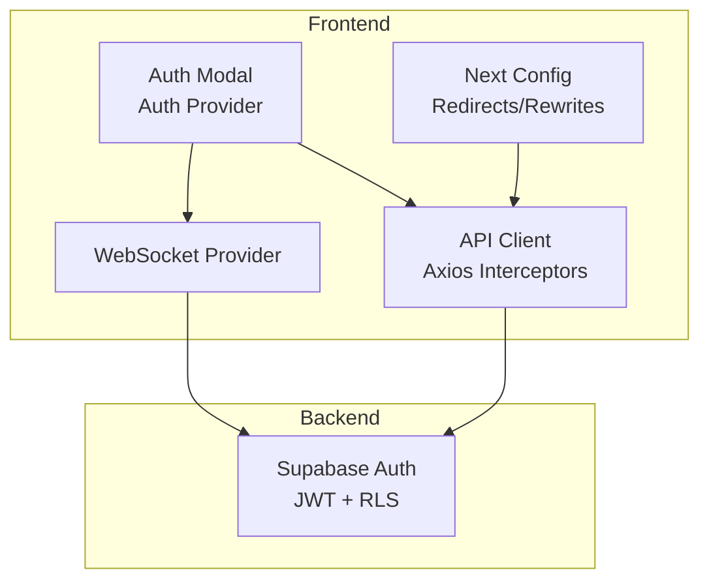
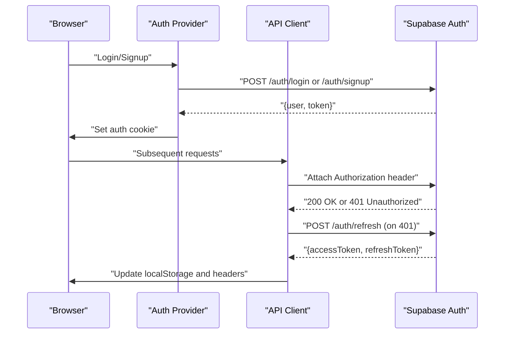
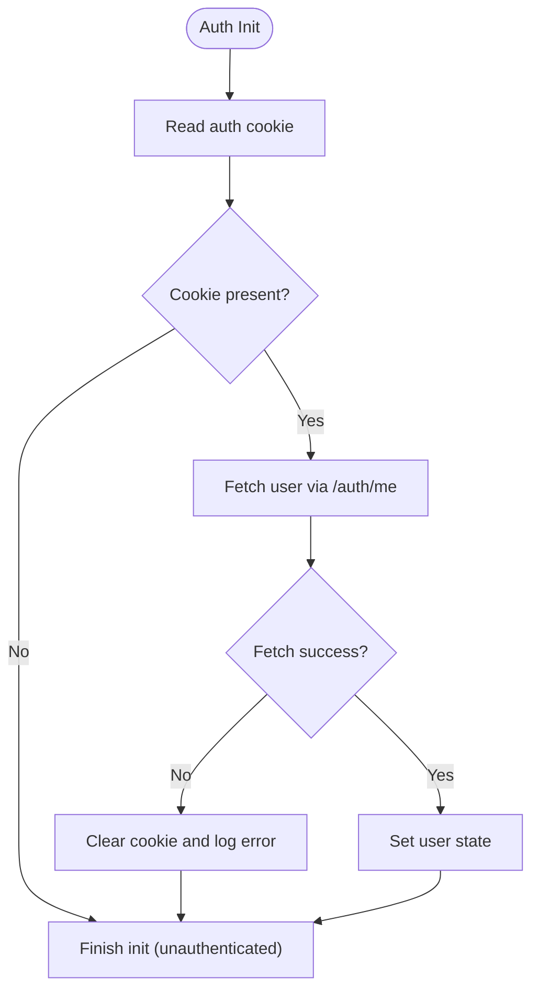
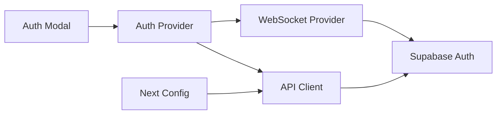

# Security Best Practices

<cite>
**Referenced Files in This Document**
- [README.md](file://README.md)
- [IMPLEMENTATION_PLAN.md](file://IMPLEMENTATION_PLAN.md)
- [EXECUTIVE_SUMMARY.md](file://EXECUTIVE_SUMMARY.md)
- [DEPLOYMENT.md](file://DEPLOYMENT.md)
- [next.config.js](file://next.config.js)
- [package.json](file://package.json)
- [src/app/providers.tsx](file://src/app/providers.tsx)
- [src/app/layout.tsx](file://src/app/layout.tsx)
- [src/app/globals.css](file://src/app/globals.css)
- [src/components/auth/auth-provider.tsx](file://src/components/auth/auth-provider.tsx)
- [src/components/auth/auth-modal.tsx](file://src/components/auth/auth-modal.tsx)
- [src/components/websocket/websocket-provider.tsx](file://src/components/websocket/websocket-provider.tsx)
- [src/contexts/auth-context.tsx](file://src/contexts/auth-context.tsx)
- [src/lib/api.ts](file://src/lib/api.ts)
- [src/lib/utils.ts](file://src/lib/utils.ts)
- [vercel.json](file://vercel.json)
</cite>

## Table of Contents
1. [Introduction](#introduction)
2. [Project Structure](#project-structure)
3. [Core Components](#core-components)
4. [Architecture Overview](#architecture-overview)
5. [Detailed Component Analysis](#detailed-component-analysis)
6. [Dependency Analysis](#dependency-analysis)
7. [Performance Considerations](#performance-considerations)
8. [Troubleshooting Guide](#troubleshooting-guide)
9. [Conclusion](#conclusion)
10. [Appendices](#appendices)

## Introduction
This document consolidates security implementation and best practices for the WorldBest application. It focuses on authentication and session security, authorization patterns, input validation and XSS prevention, CSRF protection, secure headers and HTTPS enforcement, secure API design, rate limiting, DDoS mitigation, audit procedures, vulnerability assessment, penetration testing, data encryption, secure file uploads, and sensitive data handling. It also provides practical examples of security middleware, authentication guards, and secure state management aligned with the current codebase and planned enhancements.

## Project Structure
The frontend is a Next.js 14 application using TypeScript, with authentication implemented via two distinct approaches in parallel:
- Cookie-based JWT flow with automatic refresh and redirect on 401
- LocalStorage-based bearer token flow with Axios interceptors for token refresh

Key security touchpoints:
- Authentication providers and modal
- WebSocket provider with cookie-based auth
- API client with request/response interceptors
- Next.js configuration for redirects, rewrites, and image security
- Environment variable protection and deployment notes

**Diagram sources**
- [src/components/auth/auth-modal.tsx](file://src/components/auth/auth-modal.tsx#L1-L212)
- [src/components/auth/auth-provider.tsx](file://src/components/auth/auth-provider.tsx#L1-L165)
- [src/components/websocket/websocket-provider.tsx](file://src/components/websocket/websocket-provider.tsx#L1-L84)
- [src/lib/api.ts](file://src/lib/api.ts#L1-L67)
- [next.config.js](file://next.config.js#L28-L51)

**Section sources**
- [README.md](file://README.md#L241-L257)
- [next.config.js](file://next.config.js#L1-L56)
- [src/app/providers.tsx](file://src/app/providers.tsx#L1-L37)
- [src/app/layout.tsx](file://src/app/layout.tsx#L1-L102)

## Core Components
- Authentication providers:
  - Cookie-based provider sets and refreshes an auth cookie and auto-redirects on 401
  - LocalStorage provider manages bearer tokens and updates Axios defaults
- WebSocket provider authenticates via cookie and handles reconnection
- API client centralizes token refresh and error handling
- Next.js configuration enforces redirects and rewrites for API traffic

Security implications:
- Mixed token storage (cookies vs localStorage) increases attack surface
- Axios interceptors handle token refresh automatically but require robust error handling
- Redirects leverage cookies for seamless authenticated routing

**Section sources**
- [src/components/auth/auth-provider.tsx](file://src/components/auth/auth-provider.tsx#L1-L165)
- [src/contexts/auth-context.tsx](file://src/contexts/auth-context.tsx#L1-L154)
- [src/lib/api.ts](file://src/lib/api.ts#L1-L67)
- [src/components/websocket/websocket-provider.tsx](file://src/components/websocket/websocket-provider.tsx#L1-L84)
- [next.config.js](file://next.config.js#L28-L51)

## Architecture Overview
The authentication architecture combines client-side state management, API interception, and backend JWT verification. The system currently supports:
- Cookie-based JWT for browser sessions
- LocalStorage bearer tokens for programmatic requests
- Automatic token refresh on 401 responses
- Redirects to authenticated dashboard based on cookie presence

**Diagram sources**
- [src/components/auth/auth-provider.tsx](file://src/components/auth/auth-provider.tsx#L67-L141)
- [src/lib/api.ts](file://src/lib/api.ts#L24-L65)

**Section sources**
- [README.md](file://README.md#L241-L257)
- [src/lib/api.ts](file://src/lib/api.ts#L1-L67)

## Detailed Component Analysis

### Authentication Security: JWT Token Management
- Cookie-based flow:
  - Sets an auth cookie with secure attributes and SameSite strict
  - Initializes user state by fetching profile using the cookie
  - Automatically refreshes token on intervals and clears cookie on errors
- LocalStorage flow:
  - Stores access and refresh tokens
  - Updates Axios Authorization header globally
  - Refreshes tokens on 401 and redirects to login on failure

Security considerations:
- Mixed token storage increases risk; standardize on httpOnly cookies for session tokens
- Ensure HTTPS enforcement in production
- Implement short-lived access tokens with robust refresh token rotation

**Diagram sources**
- [src/components/auth/auth-provider.tsx](file://src/components/auth/auth-provider.tsx#L26-L49)

**Section sources**
- [src/components/auth/auth-provider.tsx](file://src/components/auth/auth-provider.tsx#L26-L141)
- [src/contexts/auth-context.tsx](file://src/contexts/auth-context.tsx#L35-L125)

### Secure Cookie Handling and Session Protection
- Cookie attributes:
  - Path set to root
  - Max-Age configured for 7 days
  - Secure flag recommended for HTTPS environments
  - SameSite set to strict
- Cookie parsing in WebSocket provider uses substring matching; consider a robust parser

Recommendations:
- Use httpOnly cookies for session tokens to mitigate XSS
- Enforce SameSite strict and Secure flags
- Implement CSRF protection alongside cookie-based auth

**Section sources**
- [src/components/auth/auth-provider.tsx](file://src/components/auth/auth-provider.tsx#L72-L72)
- [src/components/websocket/websocket-provider.tsx](file://src/components/websocket/websocket-provider.tsx#L39-L43)

### Authorization Patterns and Role-Based Access Control
- User model includes role and plan fields
- Authorization guard pattern can be implemented using route-level middleware or context checks
- Supabase Row Level Security (RLS) is noted as a current measure

Recommendations:
- Define RBAC policies in Supabase (tables, views, RLS policies)
- Implement route guards and component-level checks
- Centralize permissions in auth context and enforce at API boundaries

**Section sources**
- [src/contexts/auth-context.tsx](file://src/contexts/auth-context.tsx#L8-L26)
- [README.md](file://README.md#L244-L246)

### Input Validation, Sanitization, and XSS Prevention
- Form validation exists in the auth modal (basic email/password/display name checks)
- Planned Zod schemas for comprehensive input validation

Recommendations:
- Adopt Zod schemas for all inputs
- Sanitize HTML outputs and escape user-generated content
- Enforce Content Security Policy (CSP) headers

**Section sources**
- [src/components/auth/auth-modal.tsx](file://src/components/auth/auth-modal.tsx#L27-L52)
- [IMPLEMENTATION_PLAN.md](file://IMPLEMENTATION_PLAN.md#L552-L557)

### CSRF Protection
- Planned CSRF protection module and double-submit cookie pattern
- Current cookie-based auth requires CSRF tokens for state-changing requests

Recommendations:
- Generate CSRF tokens per session
- Validate tokens on backend for mutations
- Implement double-submit cookies

**Section sources**
- [IMPLEMENTATION_PLAN.md](file://IMPLEMENTATION_PLAN.md#L558-L563)

### Secure Headers Configuration and HTTPS Enforcement
- Next.js configuration supports redirects and rewrites
- HTTPS enforced in production via hosting provider

Recommendations:
- Add CSP, HSTS, X-Frame-Options, X-Content-Type-Options headers
- Enforce HTTPS redirects at the edge and application level
- Configure frame-ancestors and script-src directives

**Section sources**
- [next.config.js](file://next.config.js#L28-L51)
- [README.md](file://README.md#L246-L246)

### Secure API Design Principles
- Axios interceptors centralize token refresh and error handling
- API client sets Authorization header automatically
- Redirects rewrite API traffic to backend

Recommendations:
- Use short-lived access tokens with refresh rotation
- Implement endpoint-specific rate limits
- Add request signing or HMAC for sensitive endpoints

**Section sources**
- [src/lib/api.ts](file://src/lib/api.ts#L1-L67)
- [next.config.js](file://next.config.js#L43-L51)

### Rate Limiting Implementation and DDoS Mitigation
- Planned middleware-based rate limiting
- Separate limits for login attempts and general API usage

Recommendations:
- Implement sliding window or token bucket algorithms
- Use Redis-backed counters for distributed rate limiting
- Integrate with CDN/DDoS protection (Cloudflare/WAF)

**Section sources**
- [IMPLEMENTATION_PLAN.md](file://IMPLEMENTATION_PLAN.md#L546-L550)

### Security Audit Procedures, Vulnerability Assessment, and Penetration Testing
- Planned audit logging for sensitive actions
- OWASP Top 10 compliance targets

Recommendations:
- Conduct quarterly vulnerability assessments
- Perform annual penetration testing
- Maintain audit logs for compliance

**Section sources**
- [IMPLEMENTATION_PLAN.md](file://IMPLEMENTATION_PLAN.md#L564-L568)

### Data Encryption, Secure File Uploads, and Sensitive Data Handling
- Environment variables protected via .gitignore and Vercel environment variables
- Sensitive keys restricted to backend/service roles

Recommendations:
- Encrypt at-rest data in Supabase
- Validate and sanitize uploaded files
- Use signed URLs for temporary access

**Section sources**
- [DEPLOYMENT.md](file://DEPLOYMENT.md#L59-L67)

### Practical Examples: Security Middleware, Guards, and Secure State Management
- Authentication guards:
  - Route-level redirect based on cookie presence
  - Context-based guards for protected routes
- Security middleware:
  - Planned middleware for rate limiting and CSRF
- Secure state management:
  - Consolidate token storage (prefer httpOnly cookies)
  - Centralize auth state in a single provider

**Section sources**
- [next.config.js](file://next.config.js#L28-L42)
- [src/app/providers.tsx](file://src/app/providers.tsx#L9-L37)
- [src/components/auth/auth-provider.tsx](file://src/components/auth/auth-provider.tsx#L20-L157)

## Dependency Analysis
The frontend depends on Next.js, Axios, and Supabase. Security depends on:
- Correct cookie handling across components
- Consistent token refresh logic
- Proper environment variable management

**Diagram sources**
- [src/components/auth/auth-modal.tsx](file://src/components/auth/auth-modal.tsx#L17-L72)
- [src/components/auth/auth-provider.tsx](file://src/components/auth/auth-provider.tsx#L20-L157)
- [src/lib/api.ts](file://src/lib/api.ts#L1-L67)
- [src/components/websocket/websocket-provider.tsx](file://src/components/websocket/websocket-provider.tsx#L17-L84)
- [next.config.js](file://next.config.js#L28-L51)

**Section sources**
- [package.json](file://package.json#L13-L80)
- [src/lib/api.ts](file://src/lib/api.ts#L1-L67)

## Performance Considerations
- Token refresh intervals should balance user experience and server load
- WebSocket reconnection backoff prevents resource exhaustion
- Image security configuration restricts remote origins

[No sources needed since this section provides general guidance]

## Troubleshooting Guide
Common issues and resolutions:
- Inconsistent token storage:
  - Standardize on httpOnly cookies for session tokens
  - Remove localStorage token persistence
- Duplicate API clients:
  - Consolidate to a single Axios instance
- Fragile WebSocket auth:
  - Replace substring parsing with a robust cookie parser
- Missing error handling:
  - Centralize error toast and logging
- Missing CSRF protection:
  - Implement CSRF tokens and validation

**Section sources**
- [EXECUTIVE_SUMMARY.md](file://EXECUTIVE_SUMMARY.md#L38-L44)
- [IMPLEMENTATION_PLAN.md](file://IMPLEMENTATION_PLAN.md#L884-L919)

## Conclusion
The WorldBest application currently implements cookie-based JWT authentication and localStorage bearer tokens with automatic refresh on 401. Security hardening is planned across CSP headers, rate limiting, CSRF protection, input validation, audit logging, and monitoring. The recommended path is to standardize token storage to httpOnly cookies, adopt Zod schemas, implement CSRF protection, configure secure headers, and establish robust audit and monitoring practices.

[No sources needed since this section summarizes without analyzing specific files]

## Appendices

### Appendix A: Security Hardening Roadmap
- Implement CSP headers and security headers
- Add rate limiting and DDoS protection
- Introduce Zod schemas for input validation
- Implement CSRF protection
- Establish audit logging and monitoring

**Section sources**
- [IMPLEMENTATION_PLAN.md](file://IMPLEMENTATION_PLAN.md#L540-L568)

### Appendix B: Environment Variables and Secrets Management
- Protect sensitive keys using Vercel environment variables
- Restrict frontend exposure to NEXT_PUBLIC variables only
- Never commit .env files to version control

**Section sources**
- [DEPLOYMENT.md](file://DEPLOYMENT.md#L59-L67)