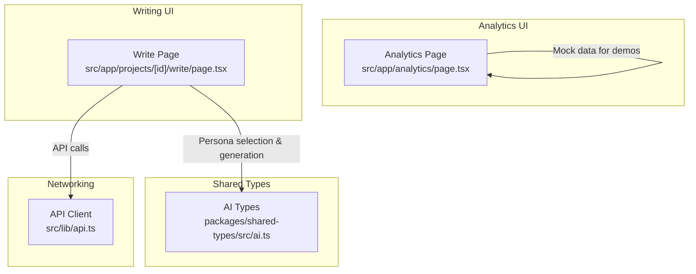
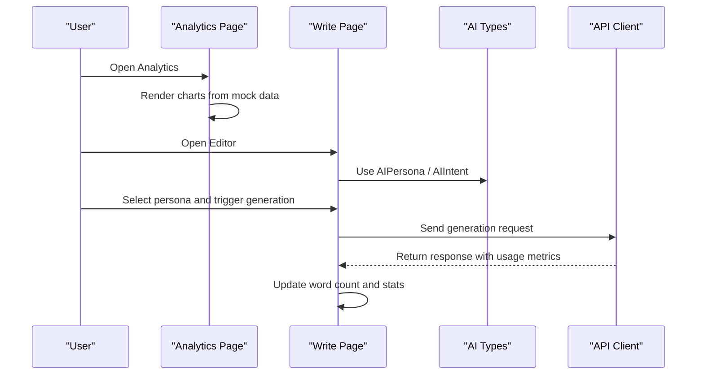
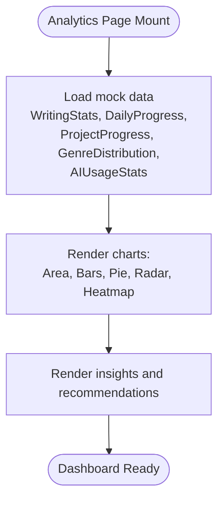
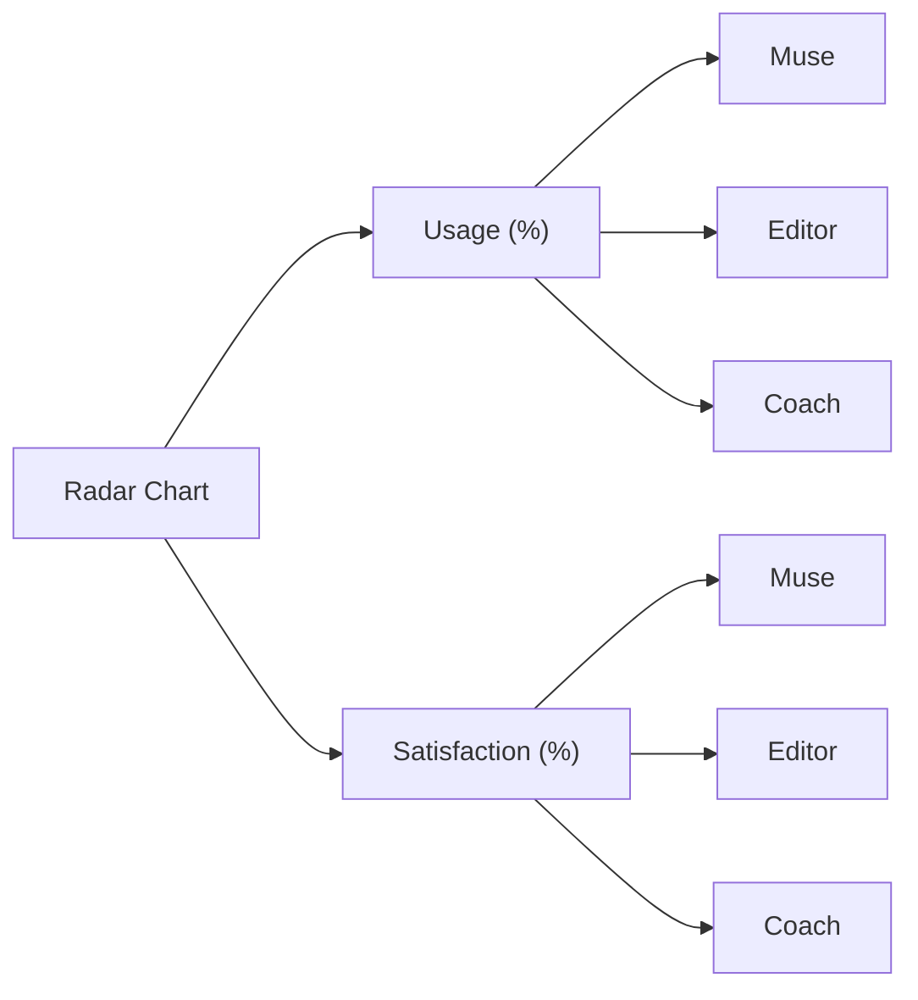
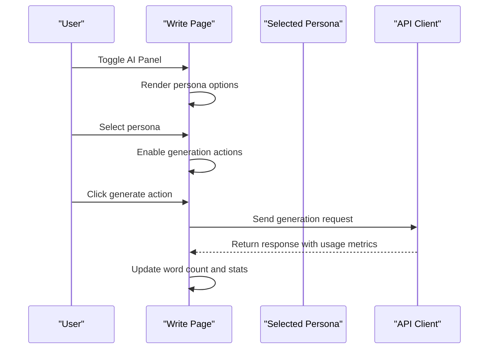
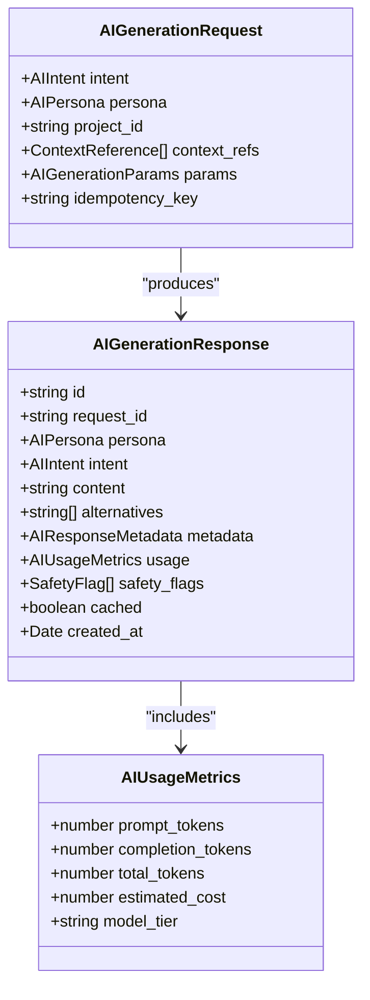
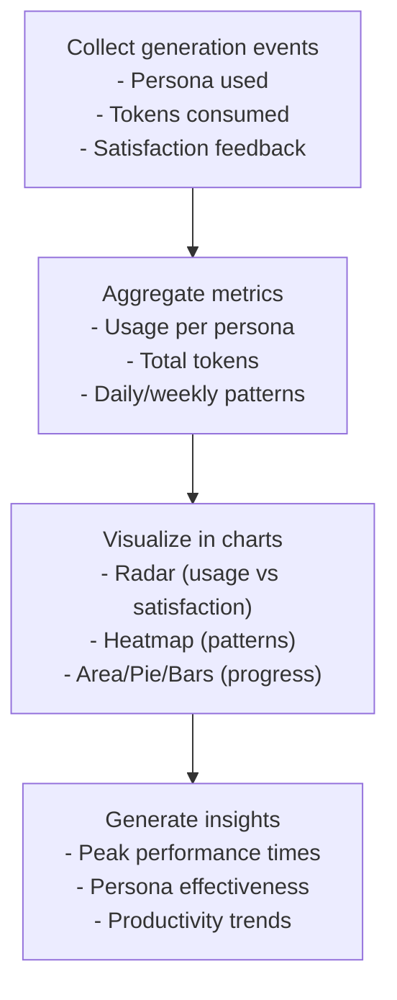
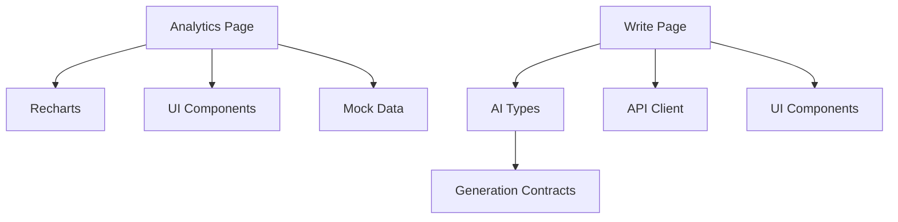

# AI Assistant Analytics

<cite>
**Referenced Files in This Document**
- [analytics/page.tsx](file://src/app/analytics/page.tsx)
- [write/page.tsx](file://src/app/projects/[id]/write/page.tsx)
- [ai.ts](file://packages/shared-types/src/ai.ts)
- [api.ts](file://src/lib/api.ts)
- [IMPLEMENTATION_PLAN.md](file://IMPLEMENTATION_PLAN.md)
</cite>

## Table of Contents
1. [Introduction](#introduction)
2. [Project Structure](#project-structure)
3. [Core Components](#core-components)
4. [Architecture Overview](#architecture-overview)
5. [Detailed Component Analysis](#detailed-component-analysis)
6. [Dependency Analysis](#dependency-analysis)
7. [Performance Considerations](#performance-considerations)
8. [Troubleshooting Guide](#troubleshooting-guide)
9. [Conclusion](#conclusion)
10. [Appendices](#appendices)

## Introduction
This document explains the AI assistant analytics system with a focus on persona usage tracking, satisfaction metrics, and AI-generated content analysis. It documents how Muse, Editor, and Coach persona usage patterns and satisfaction scores are visualized using a radar chart, and how data structures support tracking AI generations and token usage. It also provides practical examples of how AI usage data is collected and analyzed, details the integration with the AI assistant system, and offers guidance on optimizing AI assistant usage based on analytics insights.

## Project Structure
The analytics system is primarily implemented as a client-side Next.js page that renders charts and insights. The AI assistant is integrated into the writing experience via a dedicated write page that exposes persona selection and generation actions. Shared AI types define the structure for generations, usage metrics, and persona/intent taxonomy.

**Diagram sources**
- [analytics/page.tsx](file://src/app/analytics/page.tsx#L93-L470)
- [write/page.tsx](file://src/app/projects/[id]/write/page.tsx#L100-L626)
- [ai.ts](file://packages/shared-types/src/ai.ts#L1-L383)
- [api.ts](file://src/lib/api.ts#L1-L67)

**Section sources**
- [analytics/page.tsx](file://src/app/analytics/page.tsx#L93-L470)
- [write/page.tsx](file://src/app/projects/[id]/write/page.tsx#L100-L626)
- [ai.ts](file://packages/shared-types/src/ai.ts#L1-L383)
- [api.ts](file://src/lib/api.ts#L1-L67)

## Core Components
- Analytics dashboard page with:
  - Writing stats cards
  - Area chart for daily progress
  - Project progress bars
  - Genre distribution pie chart
  - AI usage radar chart (usage vs satisfaction)
  - Writing patterns heatmap
  - Insights and recommendations
- AI assistant integration:
  - Persona selection (Muse, Editor, Coach)
  - Generation actions and quick suggestions
  - Word count and writing stats in the editor
- Shared AI types:
  - AIGenerationRequest/AIGenerationResponse
  - AIUsageMetrics (prompt/completion/total tokens)
  - AIPersona and AIIntent enums

**Section sources**
- [analytics/page.tsx](file://src/app/analytics/page.tsx#L53-L91)
- [analytics/page.tsx](file://src/app/analytics/page.tsx#L151-L155)
- [write/page.tsx](file://src/app/projects/[id]/write/page.tsx#L68-L98)
- [ai.ts](file://packages/shared-types/src/ai.ts#L101-L139)

## Architecture Overview
The analytics page consumes mock data to render charts and insights. The write page integrates the AI assistant with persona selection and generation actions. Shared AI types define the contract for generation requests/responses and usage metrics. Networking is handled by a centralized API client with token injection and refresh logic.

**Diagram sources**
- [analytics/page.tsx](file://src/app/analytics/page.tsx#L93-L470)
- [write/page.tsx](file://src/app/projects/[id]/write/page.tsx#L100-L626)
- [ai.ts](file://packages/shared-types/src/ai.ts#L3-L113)
- [api.ts](file://src/lib/api.ts#L1-L67)

## Detailed Component Analysis

### Analytics Dashboard
The analytics page defines data structures for writing statistics, daily progress, project progress, genre distribution, and AI usage stats. It renders:
- Key metrics cards (words, streak, AI generations, productivity score)
- Area chart for daily writing progress
- Project progress bars
- Genre distribution pie chart
- AI usage radar chart (usage % and satisfaction % by persona)
- Writing patterns heatmap
- Insights and recommendations

**Diagram sources**
- [analytics/page.tsx](file://src/app/analytics/page.tsx#L99-L155)
- [analytics/page.tsx](file://src/app/analytics/page.tsx#L249-L387)
- [analytics/page.tsx](file://src/app/analytics/page.tsx#L430-L467)

**Section sources**
- [analytics/page.tsx](file://src/app/analytics/page.tsx#L53-L91)
- [analytics/page.tsx](file://src/app/analytics/page.tsx#L117-L155)
- [analytics/page.tsx](file://src/app/analytics/page.tsx#L249-L387)
- [analytics/page.tsx](file://src/app/analytics/page.tsx#L430-L467)

### AI Usage Radar Chart
The radar chart compares persona usage and satisfaction scores. The dataset includes:
- Muse: usage 45%, satisfaction 85%
- Editor: usage 35%, satisfaction 92%
- Coach: usage 20%, satisfaction 78%

**Diagram sources**
- [analytics/page.tsx](file://src/app/analytics/page.tsx#L151-L155)
- [analytics/page.tsx](file://src/app/analytics/page.tsx#L343-L361)

**Section sources**
- [analytics/page.tsx](file://src/app/analytics/page.tsx#L151-L155)
- [analytics/page.tsx](file://src/app/analytics/page.tsx#L343-L361)

### AI Assistant Integration in Writing
The write page integrates the AI assistant with:
- Persona selection (Muse, Editor, Coach)
- Generation actions (improve selection, continue writing, dialogue, describe scene, character voice check)
- Quick suggestions and recent suggestions
- Word count and writing stats

**Diagram sources**
- [write/page.tsx](file://src/app/projects/[id]/write/page.tsx#L518-L622)
- [write/page.tsx](file://src/app/projects/[id]/write/page.tsx#L182-L185)
- [api.ts](file://src/lib/api.ts#L1-L67)

**Section sources**
- [write/page.tsx](file://src/app/projects/[id]/write/page.tsx#L68-L98)
- [write/page.tsx](file://src/app/projects/[id]/write/page.tsx#L518-L622)
- [write/page.tsx](file://src/app/projects/[id]/write/page.tsx#L182-L185)

### Data Structures for Tracking AI Generations and Token Usage
The shared AI types define:
- AIGenerationRequest: intent, persona, project_id, context_refs, params
- AIGenerationResponse: id, request_id, persona, intent, content, alternatives, metadata, usage, safety_flags, cached, created_at
- AIUsageMetrics: prompt_tokens, completion_tokens, total_tokens, estimated_cost, model_tier
- AIPersona and AIIntent enums

**Diagram sources**
- [ai.ts](file://packages/shared-types/src/ai.ts#L3-L113)
- [ai.ts](file://packages/shared-types/src/ai.ts#L133-L139)

**Section sources**
- [ai.ts](file://packages/shared-types/src/ai.ts#L3-L113)
- [ai.ts](file://packages/shared-types/src/ai.ts#L133-L139)

### Practical Examples: How AI Usage Data Is Collected and Analyzed
- Persona usage and satisfaction:
  - The analytics page displays usage (%) and satisfaction (%) per persona in a radar chart.
  - These values can be derived from generation logs that track persona selection and user feedback.
- Token usage:
  - The analytics page shows total tokens used in a stat card.
  - The shared AI types include AIUsageMetrics with prompt_tokens, completion_tokens, total_tokens, and estimated_cost.
- Writing patterns:
  - The writing patterns heatmap shows productivity across hours and days, enabling insights into peak performance times.
- Integration with the AI assistant:
  - The write page triggers generation actions and updates word counts and stats, feeding into analytics.

**Diagram sources**
- [analytics/page.tsx](file://src/app/analytics/page.tsx#L233-L239)
- [analytics/page.tsx](file://src/app/analytics/page.tsx#L343-L361)
- [analytics/page.tsx](file://src/app/analytics/page.tsx#L363-L387)
- [ai.ts](file://packages/shared-types/src/ai.ts#L133-L139)

**Section sources**
- [analytics/page.tsx](file://src/app/analytics/page.tsx#L233-L239)
- [analytics/page.tsx](file://src/app/analytics/page.tsx#L343-L361)
- [analytics/page.tsx](file://src/app/analytics/page.tsx#L363-L387)
- [ai.ts](file://packages/shared-types/src/ai.ts#L133-L139)

### Correlation Between AI Usage and Writing Quality Improvements
- The analytics page surfaces an insight indicating the Editor persona has been most effective for the writer’s style and improved content quality by a measurable amount.
- This demonstrates a positive correlation between persona choice and quality outcomes, supporting data-driven optimization.

**Section sources**
- [analytics/page.tsx](file://src/app/analytics/page.tsx#L457-L465)

### Guidance on Optimizing AI Assistant Usage Based on Analytics Insights
- Focus on peak performance times: Schedule writing sessions during the identified high-productivity windows.
- Leverage the most effective persona: Use the Editor persona more frequently for style and grammar improvements.
- Monitor token usage: Keep an eye on total tokens and cost estimates to manage usage efficiently.
- Track progress: Use daily progress and project progress visuals to maintain momentum and meet goals.

**Section sources**
- [analytics/page.tsx](file://src/app/analytics/page.tsx#L440-L443)
- [analytics/page.tsx](file://src/app/analytics/page.tsx#L457-L465)
- [analytics/page.tsx](file://src/app/analytics/page.tsx#L233-L239)

## Dependency Analysis
- Analytics page depends on:
  - Recharts for rendering charts
  - UI components for cards and layout
  - Mock data for demonstration
- Write page depends on:
  - Shared AI types for persona and intent
  - API client for generation requests
  - UI components for editor and AI panel
- Shared AI types define the contract for generation and usage metrics.

**Diagram sources**
- [analytics/page.tsx](file://src/app/analytics/page.tsx#L30-L51)
- [write/page.tsx](file://src/app/projects/[id]/write/page.tsx#L47-L47)
- [ai.ts](file://packages/shared-types/src/ai.ts#L1-L383)
- [api.ts](file://src/lib/api.ts#L1-L67)

**Section sources**
- [analytics/page.tsx](file://src/app/analytics/page.tsx#L30-L51)
- [write/page.tsx](file://src/app/projects/[id]/write/page.tsx#L47-L47)
- [ai.ts](file://packages/shared-types/src/ai.ts#L1-L383)
- [api.ts](file://src/lib/api.ts#L1-L67)

## Performance Considerations
- Use responsive chart containers to ensure optimal rendering across devices.
- Minimize re-renders by memoizing datasets and computed values.
- Prefer streaming responses for generation to improve perceived performance.
- Cache frequent queries and reduce network round trips.

## Troubleshooting Guide
- Authentication failures:
  - The API client handles token refresh automatically. If requests fail with 401, the interceptor attempts to refresh tokens and retries the request.
- Missing or stale analytics data:
  - The analytics page currently uses mock data. Replace mock datasets with real API-backed data to reflect live usage.
- Persona actions not triggering:
  - Ensure persona selection is persisted and generation actions are wired to send requests with proper context and parameters.

**Section sources**
- [api.ts](file://src/lib/api.ts#L24-L65)
- [analytics/page.tsx](file://src/app/analytics/page.tsx#L99-L155)
- [write/page.tsx](file://src/app/projects/[id]/write/page.tsx#L182-L185)

## Conclusion
The AI assistant analytics system combines persona usage tracking, satisfaction metrics, and token usage into actionable insights. The radar chart highlights usage and satisfaction differences across Muse, Editor, and Coach, while the write page integrates persona-driven generation and updates key metrics. By leveraging these analytics, writers can optimize their AI-assisted writing workflows for both productivity and quality.

## Appendices
- Implementation roadmap for analytics and AI features is documented in the project plan, including writing analytics, AI usage analytics, visualization components, goal tracking, and report exports.

**Section sources**
- [IMPLEMENTATION_PLAN.md](file://IMPLEMENTATION_PLAN.md#L798-L834)