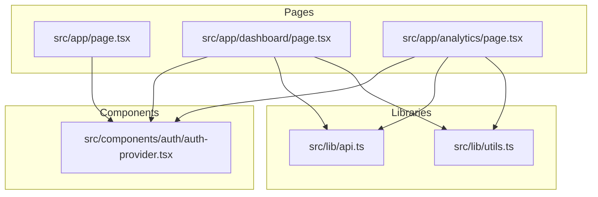
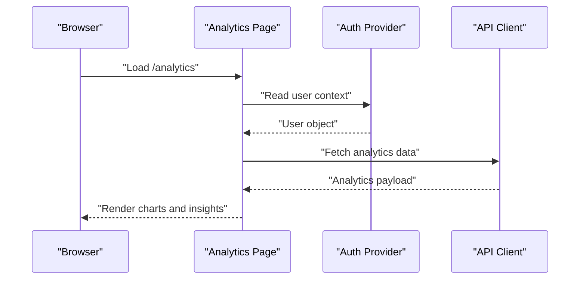
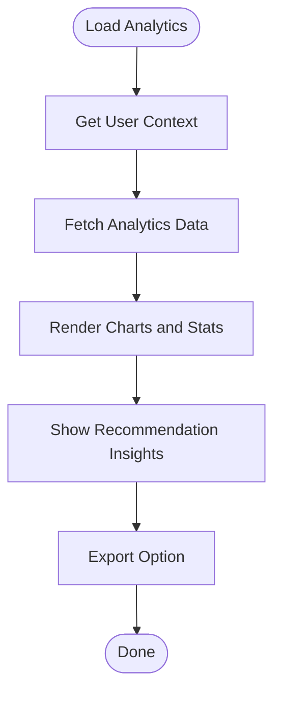
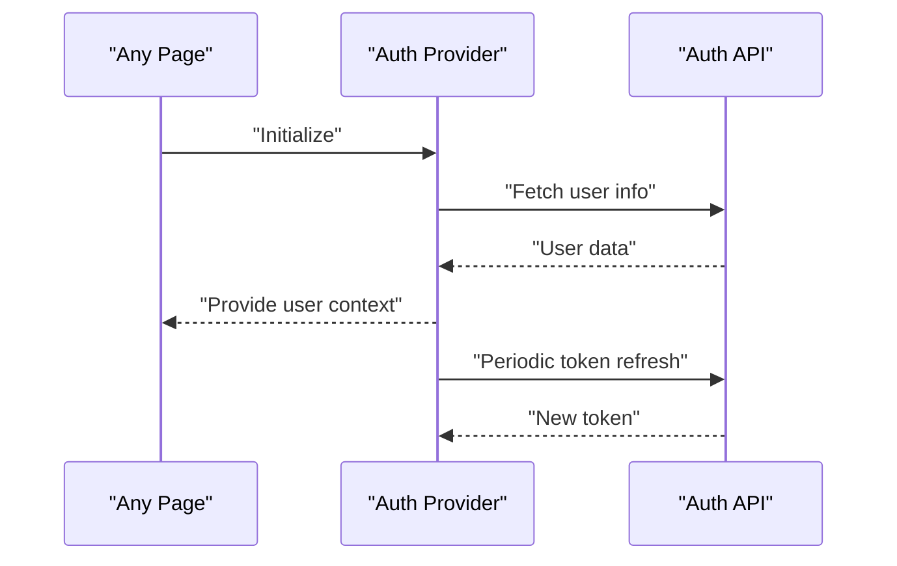
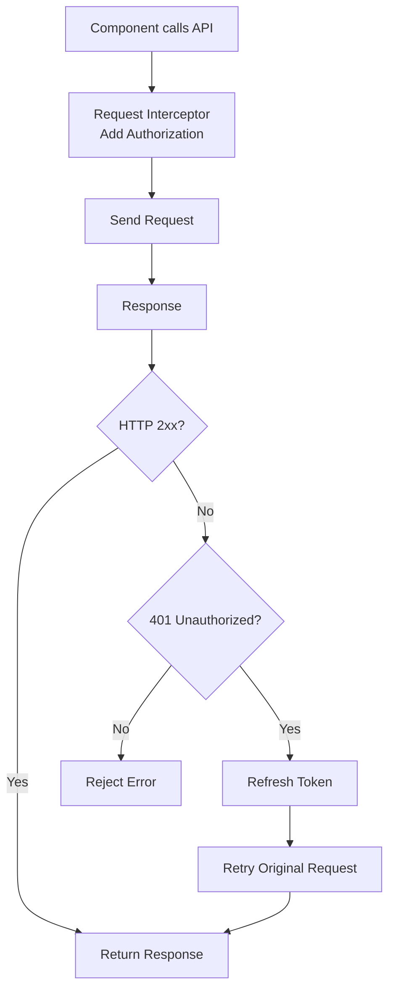
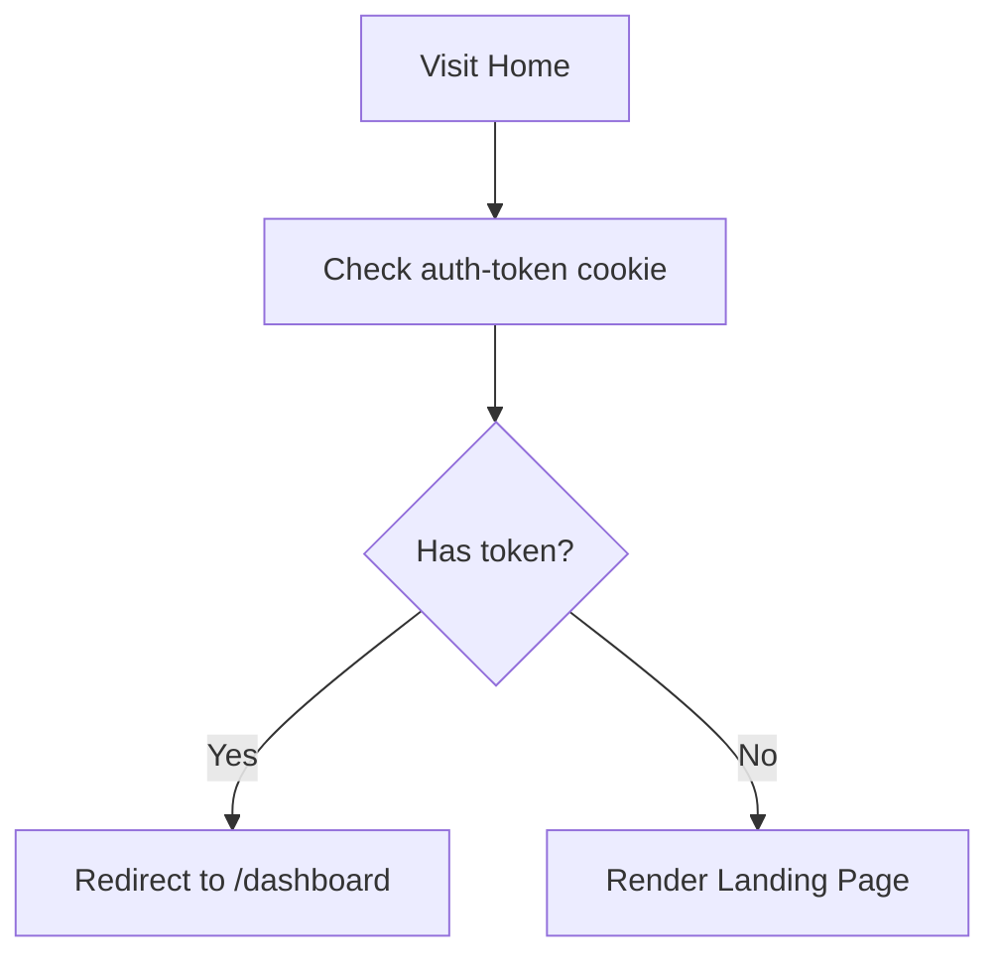
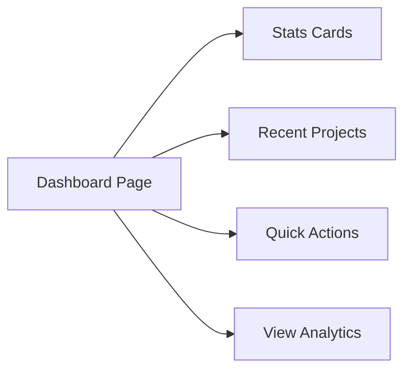
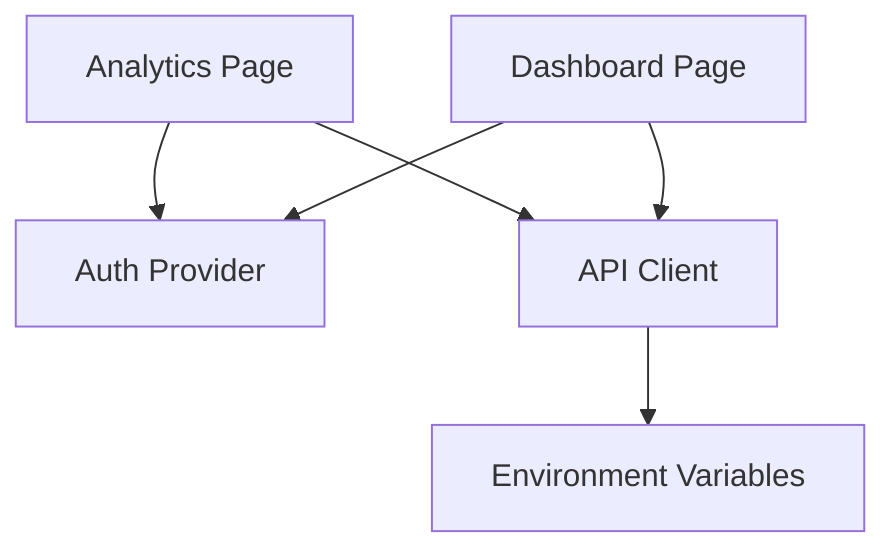

# AI Insights & Recommendations

<cite>
**Referenced Files in This Document**
- [README.md](file://README.md)
- [EXECUTIVE_SUMMARY.md](file://EXECUTIVE_SUMMARY.md)
- [IMPLEMENTATION_PLAN.md](file://IMPLEMENTATION_PLAN.md)
- [src/app/page.tsx](file://src/app/page.tsx)
- [src/app/dashboard/page.tsx](file://src/app/dashboard/page.tsx)
- [src/app/analytics/page.tsx](file://src/app/analytics/page.tsx)
- [src/components/auth/auth-provider.tsx](file://src/components/auth/auth-provider.tsx)
- [src/lib/api.ts](file://src/lib/api.ts)
- [src/lib/utils.ts](file://src/lib/utils.ts)
</cite>

## Table of Contents
1. [Introduction](#introduction)
2. [Project Structure](#project-structure)
3. [Core Components](#core-components)
4. [Architecture Overview](#architecture-overview)
5. [Detailed Component Analysis](#detailed-component-analysis)
6. [Dependency Analysis](#dependency-analysis)
7. [Performance Considerations](#performance-considerations)
8. [Troubleshooting Guide](#troubleshooting-guide)
9. [Conclusion](#conclusion)
10. [Appendices](#appendices)

## Introduction
This document describes the AI-powered insights and recommendations system for the WorldBest AI-Powered Writing Platform. It explains how the system analyzes writing patterns, productivity trends, and AI usage to generate personalized recommendations. It also documents the recommendation categories (peak performance time suggestions, momentum building strategies, and AI optimization tips), how insights are presented to users, and how the analytics dashboard integrates with writing analytics. Finally, it provides guidance for implementing similar AI-powered insights systems and optimizing recommendation algorithms.

## Project Structure
The repository follows a Next.js App Router structure with a focus on frontend components, UI primitives, and foundational libraries. The analytics dashboard and landing/home page are implemented, while the analytics and AI orchestration modules are planned for future phases.

**Diagram sources**
- [src/app/page.tsx](file://src/app/page.tsx#L1-L17)
- [src/app/dashboard/page.tsx](file://src/app/dashboard/page.tsx#L1-L260)
- [src/app/analytics/page.tsx](file://src/app/analytics/page.tsx#L1-L470)
- [src/components/auth/auth-provider.tsx](file://src/components/auth/auth-provider.tsx#L1-L165)
- [src/lib/api.ts](file://src/lib/api.ts#L1-L67)
- [src/lib/utils.ts](file://src/lib/utils.ts#L1-L6)

**Section sources**
- [README.md](file://README.md#L73-L104)
- [src/app/page.tsx](file://src/app/page.tsx#L1-L17)
- [src/app/dashboard/page.tsx](file://src/app/dashboard/page.tsx#L1-L260)
- [src/app/analytics/page.tsx](file://src/app/analytics/page.tsx#L1-L470)
- [src/components/auth/auth-provider.tsx](file://src/components/auth/auth-provider.tsx#L1-L165)
- [src/lib/api.ts](file://src/lib/api.ts#L1-L67)
- [src/lib/utils.ts](file://src/lib/utils.ts#L1-L6)

## Core Components
- Analytics Dashboard: Presents writing statistics, charts, achievements, and AI insights. It currently uses mock data and will be wired to real analytics APIs in later phases.
- Authentication Provider: Manages user session state and integrates with the backend for user info and token refresh.
- API Client: Centralized Axios client with request/response interceptors for authentication and token refresh.
- Utilities: Shared utility functions (e.g., Tailwind merging) used across components.

Recommendation categories visible in the dashboard:
- Peak Performance Time: Suggests optimal hours based on observed productivity.
- Momentum Building: Highlights streaks and improvements to encourage continued progress.
- AI Optimization: Recommends personas and usage patterns aligned with user preferences and outcomes.

**Section sources**
- [src/app/analytics/page.tsx](file://src/app/analytics/page.tsx#L430-L467)
- [src/app/analytics/page.tsx](file://src/app/analytics/page.tsx#L100-L155)
- [src/components/auth/auth-provider.tsx](file://src/components/auth/auth-provider.tsx#L1-L165)
- [src/lib/api.ts](file://src/lib/api.ts#L1-L67)
- [src/lib/utils.ts](file://src/lib/utils.ts#L1-L6)

## Architecture Overview
The analytics dashboard is a client-side Next.js page that renders charts and insights. It relies on the authentication provider for user context and the API client for backend integration. The implementation plan indicates that analytics and AI orchestration modules are planned for future phases.

**Diagram sources**
- [src/app/analytics/page.tsx](file://src/app/analytics/page.tsx#L1-L470)
- [src/components/auth/auth-provider.tsx](file://src/components/auth/auth-provider.tsx#L1-L165)
- [src/lib/api.ts](file://src/lib/api.ts#L1-L67)

**Section sources**
- [src/app/analytics/page.tsx](file://src/app/analytics/page.tsx#L1-L470)
- [src/components/auth/auth-provider.tsx](file://src/components/auth/auth-provider.tsx#L1-L165)
- [src/lib/api.ts](file://src/lib/api.ts#L1-L67)

## Detailed Component Analysis

### Analytics Dashboard
The analytics page aggregates writing statistics, daily progress, project progress, genre distribution, AI usage, and writing patterns. It surfaces three recommendation categories as insights cards.

Key behaviors:
- Uses Recharts for rendering area, bar, pie, and radar charts.
- Displays achievement badges for milestones.
- Renders three insights cards: peak performance time, momentum building, and AI optimization.
- Includes time range filters and export functionality.

**Diagram sources**
- [src/app/analytics/page.tsx](file://src/app/analytics/page.tsx#L93-L470)

**Section sources**
- [src/app/analytics/page.tsx](file://src/app/analytics/page.tsx#L93-L470)

### Authentication Provider
The authentication provider initializes user state from cookies, handles login/signup/logout, and refreshes tokens periodically. It exposes a context for downstream components.

**Diagram sources**
- [src/components/auth/auth-provider.tsx](file://src/components/auth/auth-provider.tsx#L20-L165)

**Section sources**
- [src/components/auth/auth-provider.tsx](file://src/components/auth/auth-provider.tsx#L1-L165)

### API Client
The centralized API client adds Authorization headers and handles token refresh on 401 responses. It centralizes request/response logic and simplifies endpoint consumption.

**Diagram sources**
- [src/lib/api.ts](file://src/lib/api.ts#L1-L67)

**Section sources**
- [src/lib/api.ts](file://src/lib/api.ts#L1-L67)

### Landing/Home Page
The home page redirects authenticated users to the dashboard and shows the landing page otherwise. It reads a cookie for authentication state.

**Diagram sources**
- [src/app/page.tsx](file://src/app/page.tsx#L1-L17)

**Section sources**
- [src/app/page.tsx](file://src/app/page.tsx#L1-L17)

### Dashboard Page
The dashboard displays summary stats, recent projects, quick actions, and links to analytics. It uses mock data and will be connected to real endpoints in later phases.

**Diagram sources**
- [src/app/dashboard/page.tsx](file://src/app/dashboard/page.tsx#L53-L260)

**Section sources**
- [src/app/dashboard/page.tsx](file://src/app/dashboard/page.tsx#L1-L260)

## Dependency Analysis
- The analytics page depends on the authentication provider for user context and the API client for data fetching.
- The dashboard page depends on the authentication provider and the API client for project and stats data.
- The API client depends on environment variables for base URL and uses localStorage for token persistence.

**Diagram sources**
- [src/app/analytics/page.tsx](file://src/app/analytics/page.tsx#L1-L470)
- [src/app/dashboard/page.tsx](file://src/app/dashboard/page.tsx#L1-L260)
- [src/components/auth/auth-provider.tsx](file://src/components/auth/auth-provider.tsx#L1-L165)
- [src/lib/api.ts](file://src/lib/api.ts#L1-L67)

**Section sources**
- [src/app/analytics/page.tsx](file://src/app/analytics/page.tsx#L1-L470)
- [src/app/dashboard/page.tsx](file://src/app/dashboard/page.tsx#L1-L260)
- [src/components/auth/auth-provider.tsx](file://src/components/auth/auth-provider.tsx#L1-L165)
- [src/lib/api.ts](file://src/lib/api.ts#L1-L67)

## Performance Considerations
- The implementation plan includes performance optimization tasks such as code splitting, bundle size reduction, image optimization, and performance monitoring. These will improve load times and interactivity for the analytics dashboard and insights rendering.
- Recommendations:
  - Lazy-load heavy chart libraries and dashboard sections.
  - Use responsive chart containers and limit data granularity for mobile.
  - Implement caching for analytics endpoints and debounced chart updates.
  - Monitor Web Vitals and set budgets for Largest Contentful Paint and Total Blocking Time.

[No sources needed since this section provides general guidance]

## Troubleshooting Guide
Common issues and mitigations:
- Authentication state inconsistencies: The implementation plan highlights inconsistent token storage and fragile WebSocket auth. Ensure a single source of truth for tokens and robust error handling for refresh failures.
- Missing analytics data: The analytics page currently uses mock data. Implement analytics API modules and connect them to the dashboard and insights components.
- API client duplication: The implementation plan identifies duplicate API clients. Consolidate into a single, well-typed client with shared interceptors.
- Error boundaries and logging: The implementation plan outlines enhancements for global error boundaries and error logging services. Implement these to prevent white screens and capture runtime errors.

**Section sources**
- [EXECUTIVE_SUMMARY.md](file://EXECUTIVE_SUMMARY.md#L38-L44)
- [IMPLEMENTATION_PLAN.md](file://IMPLEMENTATION_PLAN.md#L111-L150)
- [src/app/analytics/page.tsx](file://src/app/analytics/page.tsx#L1-L470)
- [src/lib/api.ts](file://src/lib/api.ts#L1-L67)

## Conclusion
The WorldBest platform’s analytics dashboard demonstrates a clear path toward delivering AI-powered insights and recommendations. The current implementation showcases recommendation categories and mock data, while the implementation plan outlines the steps to integrate real analytics, AI orchestration, and robust infrastructure. By following the outlined phases—foundation, core features, testing, production optimization, and advanced features—the platform can evolve into a data-driven writing companion that adapts to individual habits and progress.

[No sources needed since this section summarizes without analyzing specific files]

## Appendices

### Insight Categories and Presentation
- Peak Performance Time: Suggests optimal hours based on observed productivity.
- Momentum Building: Highlights streaks and improvements to encourage continued progress.
- AI Optimization: Recommends personas and usage patterns aligned with user preferences and outcomes.

These are surfaced as insights cards in the analytics dashboard.

**Section sources**
- [src/app/analytics/page.tsx](file://src/app/analytics/page.tsx#L430-L467)

### Implementation Roadmap References
- Analytics API modules and writing stats are planned for later phases.
- AI orchestration and persona management are part of the AI content generation system.

**Section sources**
- [IMPLEMENTATION_PLAN.md](file://IMPLEMENTATION_PLAN.md#L139-L144)
- [IMPLEMENTATION_PLAN.md](file://IMPLEMENTATION_PLAN.md#L233-L272)