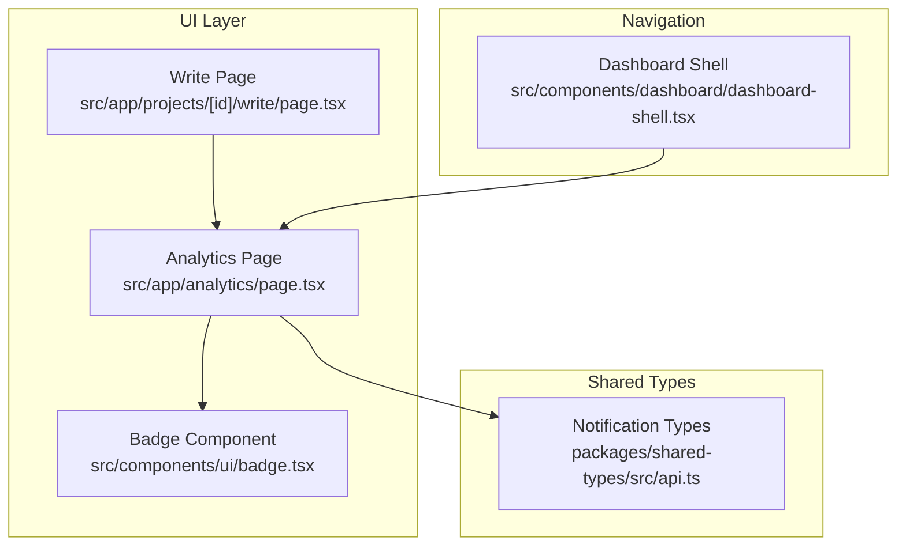
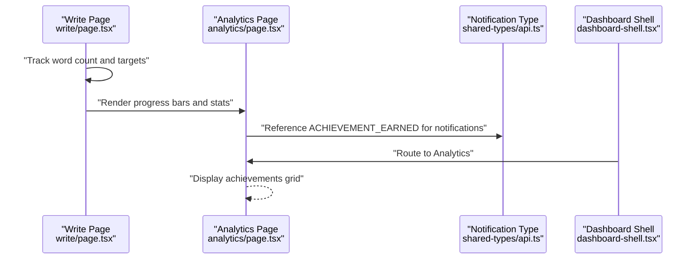
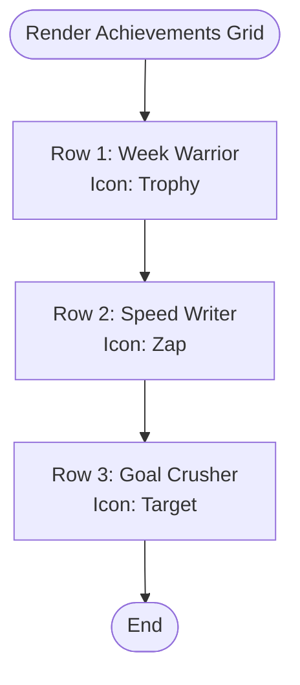
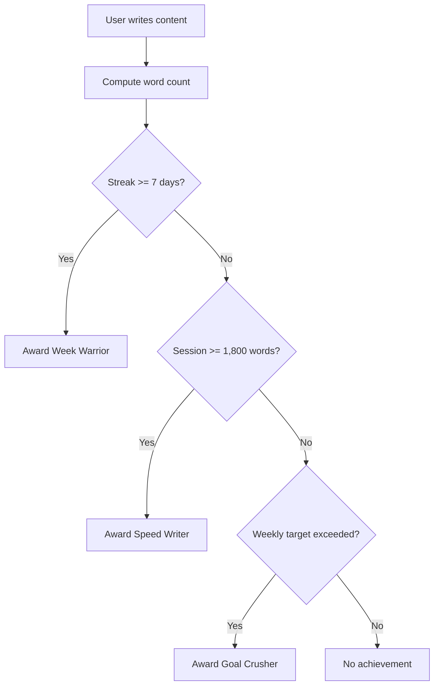
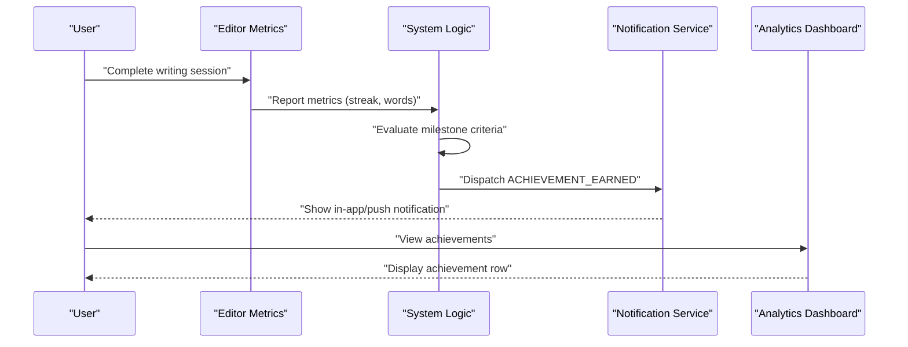
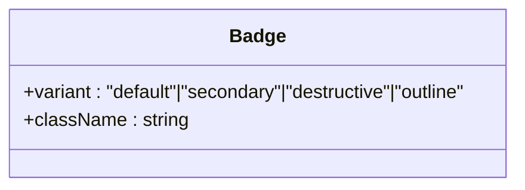
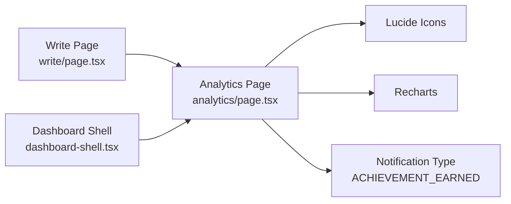

# Achievement System

<cite>
**Referenced Files in This Document**
- [README.md](file://README.md)
- [analytics/page.tsx](file://src/app/analytics/page.tsx)
- [write/page.tsx](file://src/app/projects/[id]/write/page.tsx)
- [shared-types/api.ts](file://packages/shared-types/src/api.ts)
- [ui-components/badge.tsx](file://src/components/ui/badge.tsx)
- [dashboard-shell.tsx](file://src/components/dashboard/dashboards-shell.tsx)
</cite>

## Table of Contents
1. [Introduction](#introduction)
2. [Project Structure](#project-structure)
3. [Core Components](#core-components)
4. [Architecture Overview](#architecture-overview)
5. [Detailed Component Analysis](#detailed-component-analysis)
6. [Dependency Analysis](#dependency-analysis)
7. [Performance Considerations](#performance-considerations)
8. [Troubleshooting Guide](#troubleshooting-guide)
9. [Conclusion](#conclusion)
10. [Appendices](#appendices)

## Introduction
This document describes the achievement and milestone system for the writing platform, focusing on how accomplishments are recognized, displayed, and integrated with writing milestones. It explains the visual presentation of achievements (trophy icons, milestone notifications, and progress celebrations), documents achievement types such as “Week Warrior,” “Speed Writer,” and “Goal Crusher,” and outlines how achievements motivate continued productivity. It also provides practical examples of how achievements appear in the analytics dashboard and guidance for setting personal milestones and celebrating accomplishments.

## Project Structure
The achievement system is primarily implemented in the analytics dashboard page and leverages shared notification types. The writing editor tracks word counts and targets, which feed into milestone triggers. The UI badge component provides a reusable pattern for displaying lightweight labels.

**Diagram sources**
- [analytics/page.tsx](file://src/app/analytics/page.tsx#L389-L428)
- [write/page.tsx](file://src/app/projects/[id]/write/page.tsx#L370-L381)
- [shared-types/api.ts](file://packages/shared-types/src/api.ts#L397-L409)
- [ui-components/badge.tsx](file://src/components/ui/badge.tsx#L1-L35)
- [dashboard-shell.tsx](file://src/components/dashboard/dashboard-shell.tsx#L32-L47)

**Section sources**
- [README.md](file://README.md#L28-L46)
- [analytics/page.tsx](file://src/app/analytics/page.tsx#L389-L428)
- [write/page.tsx](file://src/app/projects/[id]/write/page.tsx#L370-L381)
- [shared-types/api.ts](file://packages/shared-types/src/api.ts#L397-L409)
- [ui-components/badge.tsx](file://src/components/ui/badge.tsx#L1-L35)
- [dashboard-shell.tsx](file://src/components/dashboard/dashboard-shell.tsx#L32-L47)

## Core Components
- Analytics dashboard achievements section: Displays recent achievements with trophy icons and short descriptions.
- Achievement types: “Week Warrior” (streak milestone), “Speed Writer” (session speed milestone), “Goal Crusher” (weekly target exceeded).
- Writing editor progress: Tracks word count and daily targets to inform milestone triggers.
- Notification type: ACHIEVEMENT_EARNED supports in-app and push notifications when achievements unlock.
- Badge component: Provides a consistent, themeable label style for lightweight displays.

**Section sources**
- [analytics/page.tsx](file://src/app/analytics/page.tsx#L396-L426)
- [shared-types/api.ts](file://packages/shared-types/src/api.ts#L397-L409)
- [write/page.tsx](file://src/app/projects/[id]/write/page.tsx#L370-L381)
- [ui-components/badge.tsx](file://src/components/ui/badge.tsx#L1-L35)

## Architecture Overview
The achievement system is composed of:
- Data sources: Writing editor metrics (word count, streaks, targets) and analytics computations.
- Presentation: Analytics dashboard cards and achievement rows.
- Notifications: Notification type ACHIEVEMENT_EARNED to surface unlocks via in-app and push channels.
- Navigation: Dashboard shell routes users to the analytics page where achievements are showcased.

**Diagram sources**
- [write/page.tsx](file://src/app/projects/[id]/write/page.tsx#L370-L381)
- [analytics/page.tsx](file://src/app/analytics/page.tsx#L389-L428)
- [shared-types/api.ts](file://packages/shared-types/src/api.ts#L397-L409)
- [dashboard-shell.tsx](file://src/components/dashboard/dashboard-shell.tsx#L32-L47)

## Detailed Component Analysis

### Achievement Display in Analytics Dashboard
The analytics page includes a dedicated section for recent achievements. Each achievement is presented as a row with:
- A circular icon area (trophy, zap, target) representing the achievement category.
- A compact title and brief description indicating the milestone achieved.
- A grid layout supporting three achievements per row.

**Diagram sources**
- [analytics/page.tsx](file://src/app/analytics/page.tsx#L396-L426)

**Section sources**
- [analytics/page.tsx](file://src/app/analytics/page.tsx#L389-L428)

### Achievement Types and Criteria
The system defines three achievement types with associated criteria and visual cues:

- Week Warrior
  - Criteria: Achieve a 7-day writing streak.
  - Visual: Trophy icon with yellow background.
  - Example description: “7-day streak achieved.”

- Speed Writer
  - Criteria: Write 1,800 words in a single session.
  - Visual: Lightning bolt (zap) icon with purple background.
  - Example description: “1,800 words in one session.”

- Goal Crusher
  - Criteria: Exceed the weekly word count target.
  - Visual: Target icon with green background.
  - Example description: “Exceeded weekly target.”

These achievements are displayed in the analytics dashboard’s achievements section and can be surfaced via notifications when unlocked.

**Section sources**
- [analytics/page.tsx](file://src/app/analytics/page.tsx#L396-L426)
- [shared-types/api.ts](file://packages/shared-types/src/api.ts#L397-L409)

### Integration with Writing Milestones
Writing milestones are tracked in the editor:
- Word count and daily targets are displayed prominently in the editor header.
- Progress bars reflect completion toward daily and chapter targets.
- These metrics feed into milestone triggers that unlock achievements.

**Diagram sources**
- [write/page.tsx](file://src/app/projects/[id]/write/page.tsx#L370-L381)
- [analytics/page.tsx](file://src/app/analytics/page.tsx#L396-L426)

**Section sources**
- [write/page.tsx](file://src/app/projects/[id]/write/page.tsx#L370-L381)

### Notification Integration for Achievement Unlocks
The shared notification types include ACHIEVEMENT_EARNED, enabling:
- In-app notifications to celebrate unlocks.
- Optional push notifications to reinforce progress outside the app.
- Consistent categorization for filtering and delivery preferences.

**Diagram sources**
- [shared-types/api.ts](file://packages/shared-types/src/api.ts#L397-L409)
- [analytics/page.tsx](file://src/app/analytics/page.tsx#L389-L428)

**Section sources**
- [shared-types/api.ts](file://packages/shared-types/src/api.ts#L397-L409)

### UI Patterns for Lightweight Labels
The badge component offers a consistent, themeable label style suitable for:
- Minor progress indicators.
- Lightweight tags alongside achievements.
- Status badges in dashboards and lists.

**Diagram sources**
- [ui-components/badge.tsx](file://src/components/ui/badge.tsx#L1-L35)

**Section sources**
- [ui-components/badge.tsx](file://src/components/ui/badge.tsx#L1-L35)

## Dependency Analysis
Achievement-related dependencies and relationships:
- Analytics page depends on Lucide icons and Recharts for rendering.
- Achievement visuals rely on inline styling for icon backgrounds.
- Notification type ACHIEVEMENT_EARNED is defined in shared types and consumed by the notification system.
- Navigation routes users to the analytics page where achievements are showcased.

**Diagram sources**
- [analytics/page.tsx](file://src/app/analytics/page.tsx#L1-L51)
- [shared-types/api.ts](file://packages/shared-types/src/api.ts#L397-L409)
- [dashboard-shell.tsx](file://src/components/dashboard/dashboard-shell.tsx#L32-L47)

**Section sources**
- [analytics/page.tsx](file://src/app/analytics/page.tsx#L1-L51)
- [shared-types/api.ts](file://packages/shared-types/src/api.ts#L397-L409)
- [dashboard-shell.tsx](file://src/components/dashboard/dashboard-shell.tsx#L32-L47)

## Performance Considerations
- Achievement rendering is lightweight and relies on static UI components; performance impact is minimal.
- For future scalability, consider:
  - Lazy-loading achievement images/icons.
  - Virtualizing long achievement histories.
  - Debouncing frequent updates to progress metrics.

## Troubleshooting Guide
Common issues and resolutions:
- Achievements not appearing
  - Verify the analytics page renders the achievements section.
  - Confirm milestone criteria are met in the editor (streaks, session word counts, weekly targets).
- Notification not received
  - Ensure ACHIEVEMENT_EARNED is enabled in notification preferences.
  - Check in-app and push notification settings.

**Section sources**
- [analytics/page.tsx](file://src/app/analytics/page.tsx#L389-L428)
- [shared-types/api.ts](file://packages/shared-types/src/api.ts#L397-L409)

## Conclusion
The achievement and milestone system provides immediate, positive reinforcement for sustained writing productivity. By combining editor metrics with a celebratory display in the analytics dashboard and optional notifications, users receive timely recognition that encourages continued progress. The defined achievement types (“Week Warrior,” “Speed Writer,” “Goal Crusher”) offer clear goals and visual rewards aligned with common writing milestones.

## Appendices

### Practical Examples: Triggering and Displaying Achievements
- Week Warrior
  - Trigger: 7 consecutive days of writing.
  - Display: Trophy icon with “7-day streak achieved.”
- Speed Writer
  - Trigger: 1,800 words in a single session.
  - Display: Lightning bolt icon with “1,800 words in one session.”
- Goal Crusher
  - Trigger: Weekly word count exceeds target.
  - Display: Target icon with “Exceeded weekly target.”

**Section sources**
- [analytics/page.tsx](file://src/app/analytics/page.tsx#L396-L426)

### Gamification Guidance
- Set personal milestones aligned with achievement types (e.g., daily targets, weekly goals).
- Celebrate small wins to maintain momentum.
- Use the analytics dashboard to track progress and acknowledge milestones visually.

**Section sources**
- [analytics/page.tsx](file://src/app/analytics/page.tsx#L389-L428)