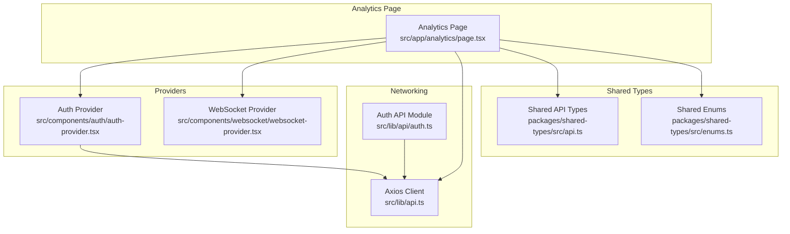
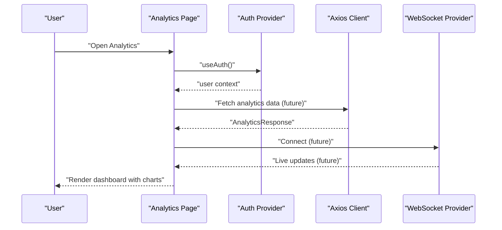
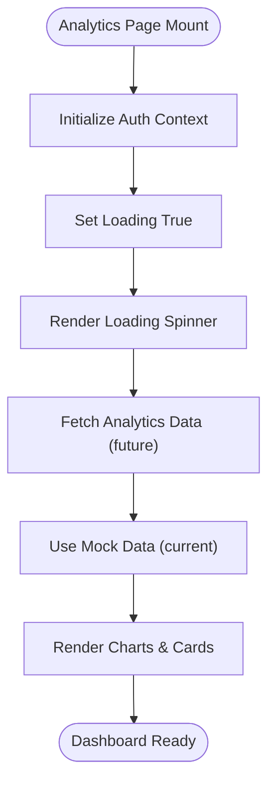
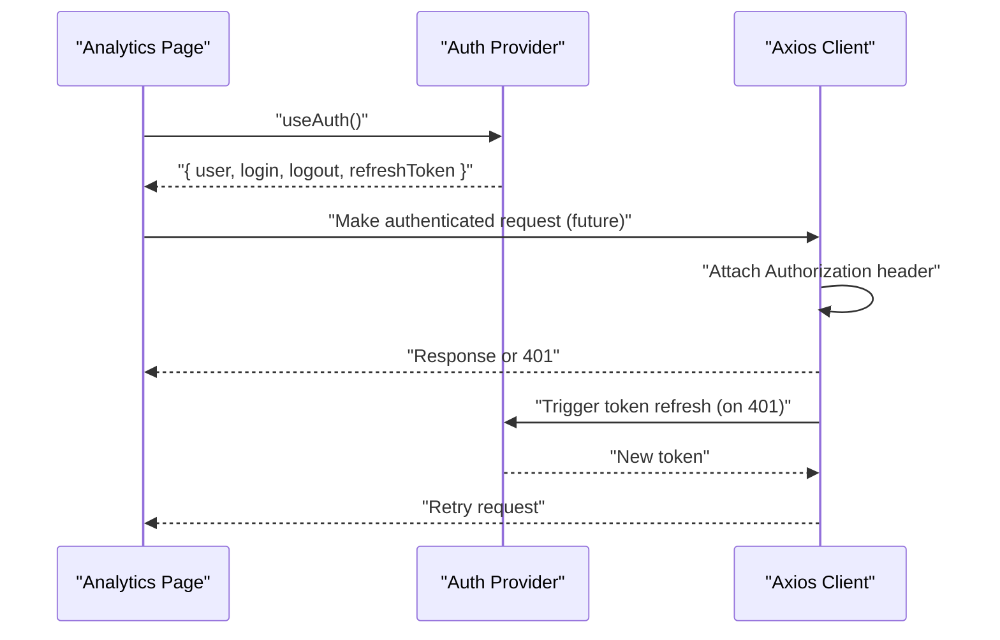
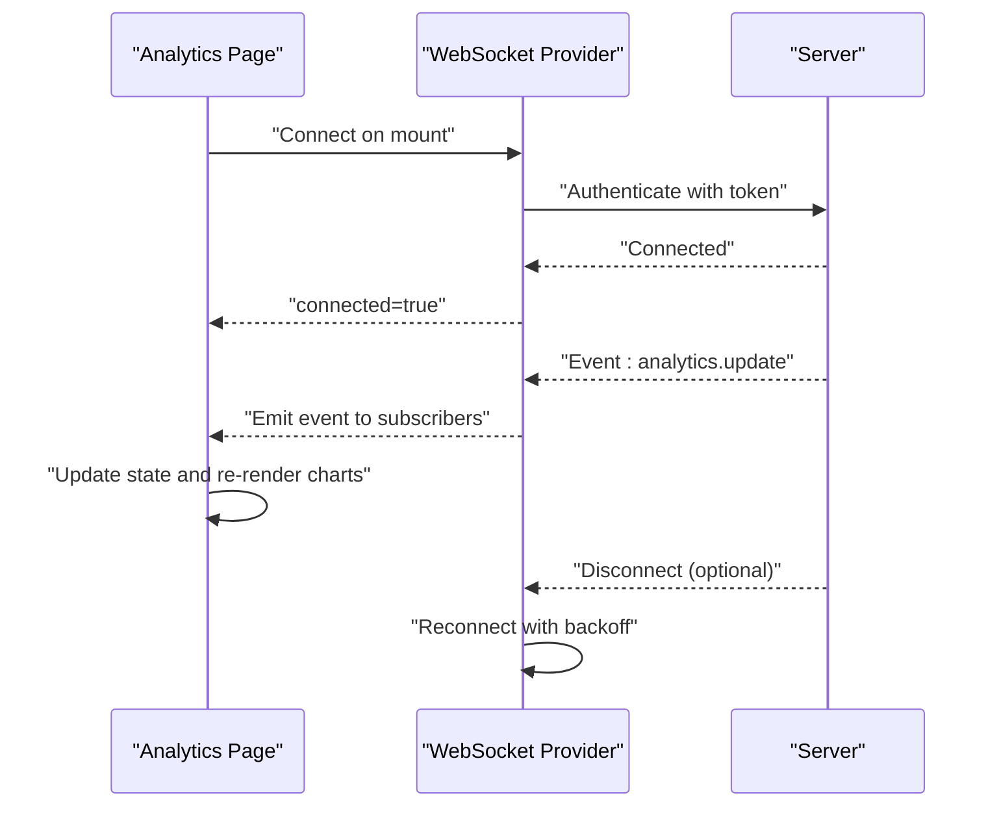
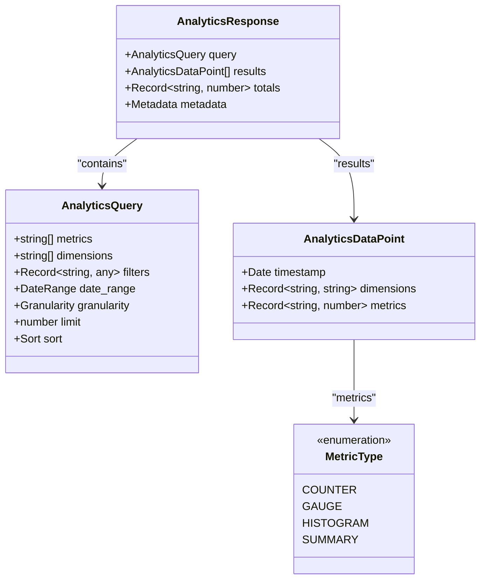
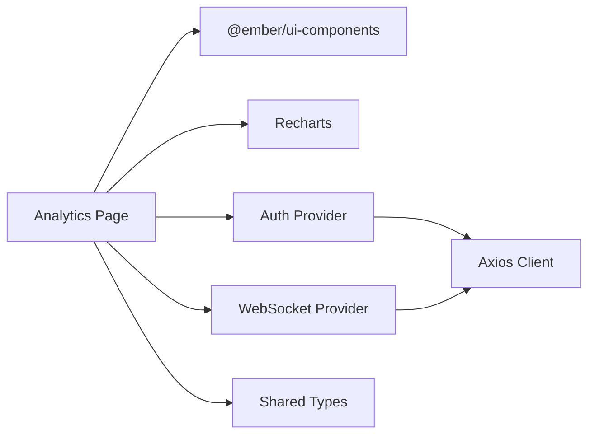

# Analytics & Insights

<cite>
**Referenced Files in This Document**
- [analytics/page.tsx](file://src/app/analytics/page.tsx)
- [auth-provider.tsx](file://src/components/auth/auth-provider.tsx)
- [websocket-provider.tsx](file://src/components/websocket/websocket-provider.tsx)
- [api.ts](file://src/lib/api.ts)
- [auth.ts](file://src/lib/api/auth.ts)
- [README.md](file://README.md)
- [IMPLEMENTATION_PLAN.md](file://IMPLEMENTATION_PLAN.md)
- [shared-types/api.ts](file://packages/shared-types/src/api.ts)
- [shared-types/enums.ts](file://packages/shared-types/src/enums.ts)
</cite>

## Table of Contents
1. [Introduction](#introduction)
2. [Project Structure](#project-structure)
3. [Core Components](#core-components)
4. [Architecture Overview](#architecture-overview)
5. [Detailed Component Analysis](#detailed-component-analysis)
6. [Dependency Analysis](#dependency-analysis)
7. [Performance Considerations](#performance-considerations)
8. [Troubleshooting Guide](#troubleshooting-guide)
9. [Conclusion](#conclusion)
10. [Appendices](#appendices)

## Introduction
This document explains the analytics and insights system for tracking writing statistics, progress, and productivity metrics. It covers the current analytics dashboard implementation, data collection mechanisms, and visualization features. It also outlines how to integrate with writing workspace data, achieve real-time analytics updates, and implement privacy and performance best practices for large datasets.

The analytics dashboard currently renders mock data and showcases:
- Writing statistics cards (words written, streaks, AI generations, productivity score)
- Writing progress area chart
- Project progress bars
- Genre distribution pie chart
- AI assistant usage radar chart
- Writing patterns heatmap
- Achievements and insights recommendations

Future tasks include connecting to backend APIs, implementing real-time updates via WebSockets, and adding export/reporting capabilities.

**Section sources**
- [analytics/page.tsx](file://src/app/analytics/page.tsx#L93-L181)
- [README.md](file://README.md#L39-L39)

## Project Structure
The analytics system is organized around a dedicated page component that composes reusable UI cards and chart components. Authentication and WebSocket providers supply user context and real-time connectivity.

**Diagram sources**
- [analytics/page.tsx](file://src/app/analytics/page.tsx#L1-L51)
- [auth-provider.tsx](file://src/components/auth/auth-provider.tsx#L1-L165)
- [websocket-provider.tsx](file://src/components/websocket/websocket-provider.tsx#L1-L138)
- [api.ts](file://src/lib/api.ts#L1-L67)
- [auth.ts](file://src/lib/api/auth.ts#L1-L101)
- [shared-types/api.ts](file://packages/shared-types/src/api.ts#L304-L335)
- [shared-types/enums.ts](file://packages/shared-types/src/enums.ts#L229-L241)

**Section sources**
- [analytics/page.tsx](file://src/app/analytics/page.tsx#L1-L51)
- [auth-provider.tsx](file://src/components/auth/auth-provider.tsx#L1-L165)
- [websocket-provider.tsx](file://src/components/websocket/websocket-provider.tsx#L1-L138)
- [api.ts](file://src/lib/api.ts#L1-L67)
- [auth.ts](file://src/lib/api/auth.ts#L1-L101)
- [shared-types/api.ts](file://packages/shared-types/src/api.ts#L304-L335)
- [shared-types/enums.ts](file://packages/shared-types/src/enums.ts#L229-L241)

## Core Components
- Analytics Page: Renders the dashboard UI, mock data, and charts.
- Auth Provider: Manages user session and JWT lifecycle.
- WebSocket Provider: Handles real-time connections and reconnection logic.
- Axios Client: Centralized HTTP client with request/response interceptors and token refresh.
- Shared Types: Defines analytics query/response contracts and metric types.

Key responsibilities:
- Analytics Page: Compose metrics, render charts, and present insights.
- Auth Provider: Provide user context and manage token refresh.
- WebSocket Provider: Connect/disconnect based on auth state and handle reconnection.
- Axios Client: Inject Authorization headers and refresh tokens on 401 responses.
- Shared Types: Standardize analytics data contracts.

**Section sources**
- [analytics/page.tsx](file://src/app/analytics/page.tsx#L93-L181)
- [auth-provider.tsx](file://src/components/auth/auth-provider.tsx#L20-L157)
- [websocket-provider.tsx](file://src/components/websocket/websocket-provider.tsx#L17-L130)
- [api.ts](file://src/lib/api.ts#L3-L67)
- [shared-types/api.ts](file://packages/shared-types/src/api.ts#L304-L335)

## Architecture Overview
The analytics dashboard integrates with authentication and real-time services to deliver a cohesive experience. The current implementation uses mock data; future integration will fetch from backend endpoints and subscribe to live events.

**Diagram sources**
- [analytics/page.tsx](file://src/app/analytics/page.tsx#L93-L181)
- [auth-provider.tsx](file://src/components/auth/auth-provider.tsx#L159-L165)
- [api.ts](file://src/lib/api.ts#L11-L65)
- [websocket-provider.tsx](file://src/components/websocket/websocket-provider.tsx#L24-L93)

## Detailed Component Analysis

### Analytics Dashboard Page
The analytics page defines typed interfaces for statistics, daily progress, project progress, and genre distribution. It renders:
- Key metrics cards with icons and trends
- Area chart for daily writing progress
- Project progress bars
- Pie chart for genre distribution
- Radar chart for AI persona usage
- Bar chart for writing patterns (heatmap-style)
- Achievements and insights panels

Mock data is initialized via React state hooks. The page supports time range selection and export actions.

**Diagram sources**
- [analytics/page.tsx](file://src/app/analytics/page.tsx#L93-L181)

**Section sources**
- [analytics/page.tsx](file://src/app/analytics/page.tsx#L53-L91)
- [analytics/page.tsx](file://src/app/analytics/page.tsx#L93-L181)
- [analytics/page.tsx](file://src/app/analytics/page.tsx#L191-L470)

### Authentication Integration
The analytics page consumes the Auth Provider to access the current user. The Auth Provider manages JWT lifecycle, including automatic token refresh and logout handling.

**Diagram sources**
- [analytics/page.tsx](file://src/app/analytics/page.tsx#L29-L29)
- [auth-provider.tsx](file://src/components/auth/auth-provider.tsx#L159-L165)
- [api.ts](file://src/lib/api.ts#L11-L65)

**Section sources**
- [auth-provider.tsx](file://src/components/auth/auth-provider.tsx#L20-L157)
- [api.ts](file://src/lib/api.ts#L11-L65)

### Real-time Analytics Updates
The WebSocket Provider establishes a persistent connection when a user is authenticated and handles reconnection with exponential backoff. The analytics page can leverage this to receive live updates for metrics and progress.

**Diagram sources**
- [websocket-provider.tsx](file://src/components/websocket/websocket-provider.tsx#L24-L93)
- [analytics/page.tsx](file://src/app/analytics/page.tsx#L93-L98)

**Section sources**
- [websocket-provider.tsx](file://src/components/websocket/websocket-provider.tsx#L17-L130)

### Data Contracts and Analytics Types
Shared types define standardized analytics query and response structures, enabling consistent backend integration and frontend consumption.

**Diagram sources**
- [shared-types/api.ts](file://packages/shared-types/src/api.ts#L304-L335)
- [shared-types/enums.ts](file://packages/shared-types/src/enums.ts#L229-L241)

**Section sources**
- [shared-types/api.ts](file://packages/shared-types/src/api.ts#L304-L335)
- [shared-types/enums.ts](file://packages/shared-types/src/enums.ts#L229-L241)

### Practical Examples

- Tracking writing progress
  - Use the daily progress area chart to visualize words written versus daily targets over a time range.
  - Aggregate per-day metrics and render them in a responsive area chart.

- Analyzing AI usage patterns
  - Use the radar chart to compare persona usage percentages and satisfaction scores.
  - Track token usage and generation counts to correlate with productivity improvements.

- Generating productivity reports
  - Export current views or generate PDF/email reports using the export action in the dashboard header.
  - Future implementation will support custom date ranges and downloadable analytics summaries.

**Section sources**
- [analytics/page.tsx](file://src/app/analytics/page.tsx#L218-L247)
- [analytics/page.tsx](file://src/app/analytics/page.tsx#L249-L281)
- [analytics/page.tsx](file://src/app/analytics/page.tsx#L343-L361)
- [analytics/page.tsx](file://src/app/analytics/page.tsx#L363-L387)
- [analytics/page.tsx](file://src/app/analytics/page.tsx#L211-L215)

## Dependency Analysis
The analytics page depends on:
- UI components and icons from the shared UI library
- Charting library (Recharts) for visualizations
- Auth and WebSocket providers for user context and real-time updates
- Shared types for analytics contracts

**Diagram sources**
- [analytics/page.tsx](file://src/app/analytics/page.tsx#L1-L51)
- [auth-provider.tsx](file://src/components/auth/auth-provider.tsx#L1-L165)
- [websocket-provider.tsx](file://src/components/websocket/websocket-provider.tsx#L1-L138)
- [api.ts](file://src/lib/api.ts#L1-L67)
- [shared-types/api.ts](file://packages/shared-types/src/api.ts#L304-L335)

**Section sources**
- [analytics/page.tsx](file://src/app/analytics/page.tsx#L1-L51)
- [auth-provider.tsx](file://src/components/auth/auth-provider.tsx#L1-L165)
- [websocket-provider.tsx](file://src/components/websocket/websocket-provider.tsx#L1-L138)
- [api.ts](file://src/lib/api.ts#L1-L67)
- [shared-types/api.ts](file://packages/shared-types/src/api.ts#L304-L335)

## Performance Considerations
- Prefer lightweight chart libraries and lazy-load heavy components when rendering large datasets.
- Use virtualization for long lists (project progress, achievements).
- Debounce or throttle chart interactions (zoom, tooltips) to avoid excessive re-renders.
- Cache frequently accessed analytics data and invalidate on user-driven time-range changes.
- For real-time updates, batch updates and avoid unnecessary re-computation.

[No sources needed since this section provides general guidance]

## Troubleshooting Guide
Common issues and resolutions:
- Authentication failures leading to empty analytics
  - Ensure the Auth Provider is mounted and the Axios client attaches Authorization headers.
  - Verify token refresh logic and network connectivity.

- WebSocket disconnections
  - Confirm the WebSocket Provider connects after user authentication and applies exponential backoff.
  - Check server-side authentication and error events.

- Missing or stale data
  - Implement loading states and skeleton placeholders while fetching data.
  - Add retry logic and user-triggered refresh actions.

**Section sources**
- [auth-provider.tsx](file://src/components/auth/auth-provider.tsx#L51-L65)
- [api.ts](file://src/lib/api.ts#L24-L65)
- [websocket-provider.tsx](file://src/components/websocket/websocket-provider.tsx#L56-L80)

## Conclusion
The analytics and insights system currently provides a robust UI foundation for writing statistics, progress tracking, and productivity metrics. By integrating backend APIs, leveraging real-time updates, and standardizing data contracts, the system can evolve into a comprehensive analytics platform. Future enhancements include goal tracking, export/reporting, and advanced visualizations tailored to writer workflows.

[No sources needed since this section summarizes without analyzing specific files]

## Appendices

### Implementation Roadmap Alignment
- Analytics Dashboard Tasks
  - Writing analytics, AI usage analytics, visualization components, goal tracking, and export reports are planned for implementation.
  - Acceptance criteria emphasize real-time updates, historical visualization, goals, and export functionality.

**Section sources**
- [IMPLEMENTATION_PLAN.md](file://IMPLEMENTATION_PLAN.md#L795-L834)

### Data Privacy and Retention
- Data minimization: Collect only necessary metrics (word counts, session durations, persona usage).
- User consent: Provide opt-in/opt-out toggles for analytics tracking in settings.
- Retention policies: Define automatic deletion schedules for temporary metrics and logs.
- Compliance: Align with data protection regulations; provide data portability and erasure upon request.

[No sources needed since this section provides general guidance]