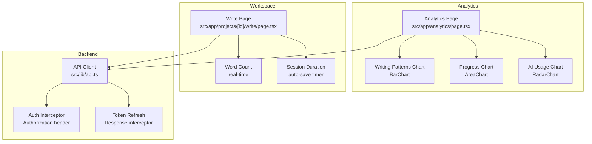
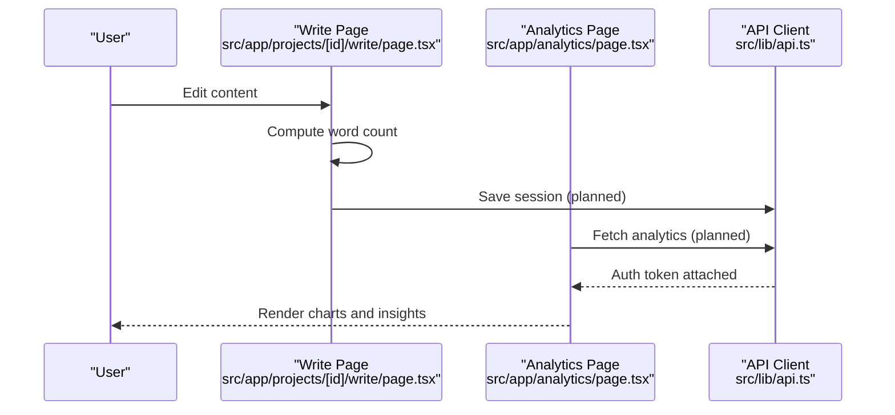
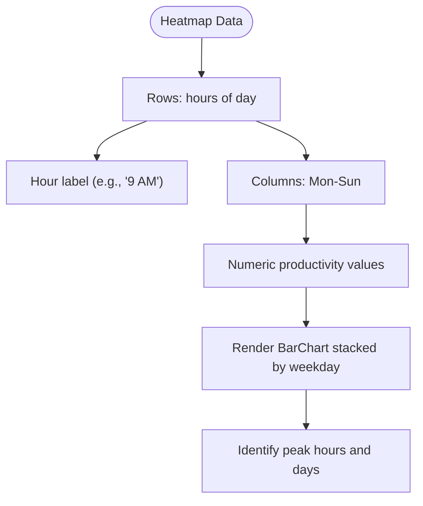
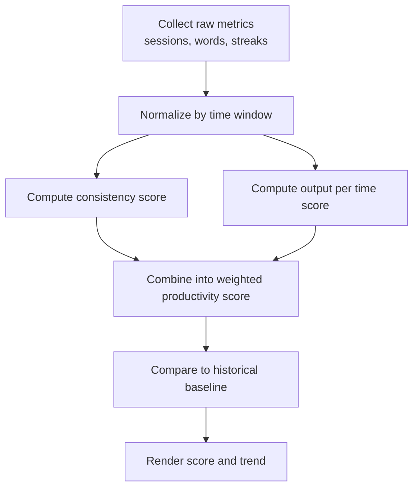
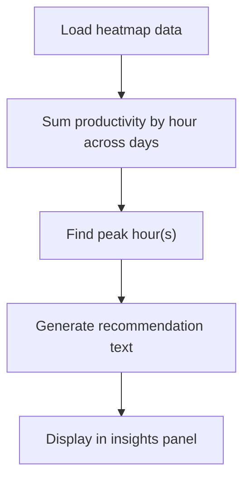
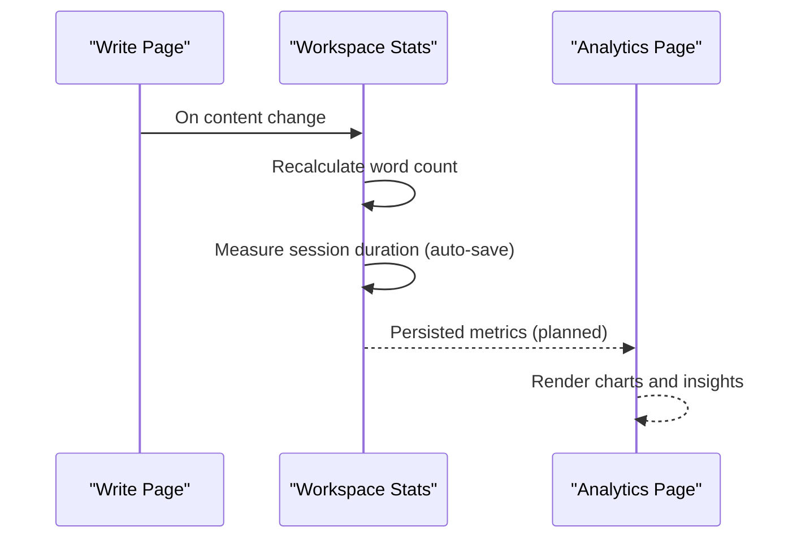
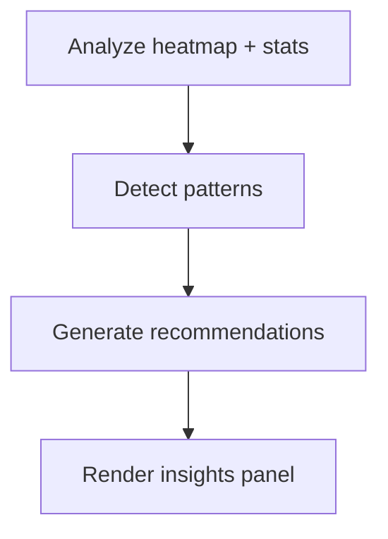
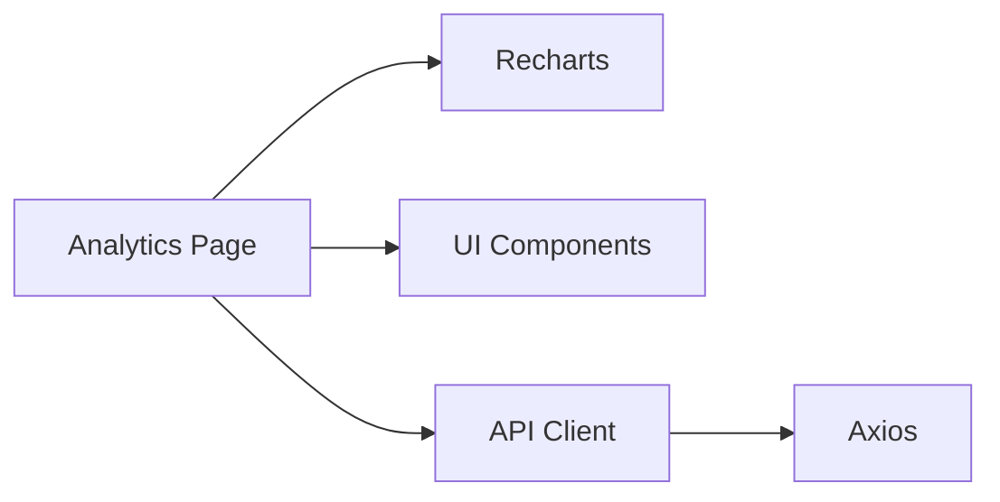

# Productivity Metrics

<cite>
**Referenced Files in This Document**
- [README.md](file://README.md)
- [IMPLEMENTATION_PLAN.md](file://IMPLEMENTATION_PLAN.md)
- [analytics/page.tsx](file://src/app/analytics/page.tsx)
- [write/page.tsx](file://src/app/projects/[id]/write/page.tsx)
- [api.ts](file://src/lib/api.ts)
</cite>

## Table of Contents
1. [Introduction](#introduction)
2. [Project Structure](#project-structure)
3. [Core Components](#core-components)
4. [Architecture Overview](#architecture-overview)
5. [Detailed Component Analysis](#detailed-component-analysis)
6. [Dependency Analysis](#dependency-analysis)
7. [Performance Considerations](#performance-considerations)
8. [Troubleshooting Guide](#troubleshooting-guide)
9. [Conclusion](#conclusion)

## Introduction
This document explains the productivity metrics system for the writing platform, focusing on writing patterns, time analysis, and performance scoring. It covers:
- The writing heatmap that visualizes productivity across hours and days of the week
- The data structure used for hourly analysis across weekdays
- The productivity score calculation methodology and how it integrates with other metrics
- Practical examples of time-based productivity analysis and pattern recognition
- Algorithms for detecting the most productive time windows and how they inform personalized recommendations
- Integration with writing workspace data, including session duration and word counts
- Guidance for interpreting productivity patterns and optimizing writing schedules

Note: The analytics dashboard currently displays mock data and placeholder UI. The implementation plan outlines the planned backend and visualization components.

## Project Structure
The analytics dashboard is implemented as a client-side Next.js page that renders charts and insights. The writing workspace page captures word counts and session durations. The API client handles authentication and token refresh.

**Diagram sources**
- [analytics/page.tsx](file://src/app/analytics/page.tsx#L93-L470)
- [write/page.tsx](file://src/app/projects/[id]/write/page.tsx#L100-L626)
- [api.ts](file://src/lib/api.ts#L1-L67)

**Section sources**
- [README.md](file://README.md#L73-L104)
- [IMPLEMENTATION_PLAN.md](file://IMPLEMENTATION_PLAN.md#L795-L838)

## Core Components
- Analytics Page: Renders key metrics, daily progress, genre distribution, AI usage, and writing patterns (heatmap).
- Writing Patterns (Heatmap): Displays productivity by hour-of-day across days of the week.
- Workspace Write Page: Tracks word count and session duration; supports auto-save and quick stats.
- API Client: Centralized HTTP client with auth and token refresh logic.

Key data structures used in the analytics page:
- WritingStats: Aggregated metrics including total words, daily averages, streaks, sessions, and most productive time.
- DailyProgress: Per-day word count, targets, sessions, and AI usage.
- ProjectProgress: Per-project word count, targets, and completion percentage.
- GenreDistribution: Words and percentages per genre.
- writingHeatmap: Hourly productivity stacked by weekday.

Mock data is currently embedded in the analytics page; the implementation plan describes replacing it with live data from backend endpoints.

**Section sources**
- [analytics/page.tsx](file://src/app/analytics/page.tsx#L53-L91)
- [analytics/page.tsx](file://src/app/analytics/page.tsx#L99-L155)
- [IMPLEMENTATION_PLAN.md](file://IMPLEMENTATION_PLAN.md#L798-L838)

## Architecture Overview
The productivity metrics system is structured around:
- Data capture in the writing workspace (word count, session duration)
- Data aggregation and analytics computation (backend planned)
- Visualization in the analytics dashboard (frontend)

**Diagram sources**
- [write/page.tsx](file://src/app/projects/[id]/write/page.tsx#L140-L166)
- [analytics/page.tsx](file://src/app/analytics/page.tsx#L93-L115)
- [api.ts](file://src/lib/api.ts#L10-L22)

## Detailed Component Analysis

### Writing Patterns Heatmap
The heatmap visualizes productivity across hours of the day and days of the week. The data structure for the heatmap is a list of hourly rows, each containing a time label and values per day.

**Diagram sources**
- [analytics/page.tsx](file://src/app/analytics/page.tsx#L141-L149)

How to interpret:
- Higher bars indicate higher productivity during that hour/day combination.
- Compare across weekdays to spot recurring patterns.
- Use the “most productive time” insight to schedule focused writing sessions.

Practical example:
- If the peak is 9 AM–11 AM on weekdays, plan uninterrupted writing blocks during that window.

**Section sources**
- [analytics/page.tsx](file://src/app/analytics/page.tsx#L363-L387)
- [analytics/page.tsx](file://src/app/analytics/page.tsx#L440-L443)

### Productivity Score Calculation
The analytics page includes a “Productivity Score” metric. While the current implementation uses mock data, the score can be computed from:
- Session frequency and duration
- Word count per session and per unit time
- Consistency (streaks, daily targets met)
- Efficiency (words per minute or words per session)

Integration with other metrics:
- Combine WritingStats (sessions, streaks, averages) with time-based patterns from the heatmap.
- Normalize scores against weekly or monthly baselines.
- Weight recent sessions more heavily for responsiveness.

Example workflow:

[No sources needed since this diagram shows conceptual workflow, not actual code structure]

### Most Productive Time Detection Algorithms
Detection approach:
- Aggregate hourly totals across weekdays.
- Identify the hour with the highest average productivity.
- Optionally detect recurring peaks across multiple weeks.

Recommendations:
- If a single hour dominates, suggest scheduling primary writing during that hour.
- If productivity is spread across multiple hours, recommend segmented writing sessions.

[No sources needed since this diagram shows conceptual workflow, not actual code structure]

### Integration with Writing Workspace Data
The write page tracks:
- Word count in real time
- Session duration via auto-save timing
- Quick stats (words, characters, paragraphs, reading time)

**Diagram sources**
- [write/page.tsx](file://src/app/projects/[id]/write/page.tsx#L140-L166)
- [write/page.tsx](file://src/app/projects/[id]/write/page.tsx#L370-L381)

How session duration correlates with productivity:
- Longer sessions often yield higher word counts but may reduce focus.
- Shorter, frequent sessions can improve consistency and reduce fatigue.
- Use the “average session length” metric to balance these factors.

**Section sources**
- [write/page.tsx](file://src/app/projects/[id]/write/page.tsx#L109-L113)
- [write/page.tsx](file://src/app/projects/[id]/write/page.tsx#L140-L166)
- [write/page.tsx](file://src/app/projects/[id]/write/page.tsx#L370-L381)

### Personalized Recommendations
The insights panel surfaces AI-powered recommendations based on detected patterns:
- Peak Performance Time: Highlights optimal hours/days.
- Momentum Building: Encourages continued progress.
- AI Optimization: Suggests which persona aligns with your writing style.

**Diagram sources**
- [analytics/page.tsx](file://src/app/analytics/page.tsx#L430-L467)

**Section sources**
- [analytics/page.tsx](file://src/app/analytics/page.tsx#L436-L467)

## Dependency Analysis
The analytics page depends on:
- Recharts for visualization
- UI components for cards and layout
- API client for authenticated requests

**Diagram sources**
- [analytics/page.tsx](file://src/app/analytics/page.tsx#L1-L51)
- [api.ts](file://src/lib/api.ts#L1-L67)

**Section sources**
- [analytics/page.tsx](file://src/app/analytics/page.tsx#L1-L51)
- [api.ts](file://src/lib/api.ts#L1-L67)

## Performance Considerations
- Defer heavy computations until data is available; avoid recalculating charts on every keystroke.
- Use responsive containers to prevent layout thrashing.
- Cache normalized metrics to reduce repeated calculations.
- Monitor bundle size and lazy-load chart libraries if needed.

[No sources needed since this section provides general guidance]

## Troubleshooting Guide
Common issues and remedies:
- Missing or stale auth token: The API client refreshes tokens on 401 responses. Ensure refresh endpoints are configured and accessible.
- Empty or placeholder charts: Replace mock data with live analytics endpoints as implemented.
- Inconsistent time zones: Ensure timestamps are normalized to UTC or user’s local timezone consistently across the backend and frontend.

**Section sources**
- [api.ts](file://src/lib/api.ts#L24-L65)

## Conclusion
The productivity metrics system combines time-based patterns, session analytics, and AI-driven insights to help writers optimize their schedules. The current analytics page showcases the intended UI and data structures; future implementation will connect to backend analytics APIs and replace mock data with real-time metrics. By leveraging the heatmap, productivity score, and personalized recommendations, users can develop consistent, high-impact writing routines.