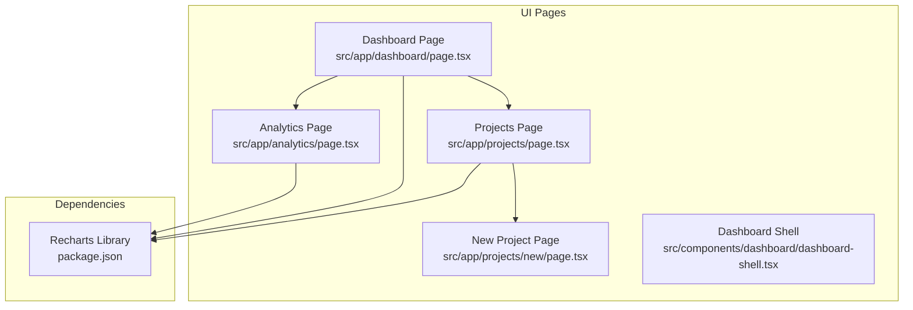
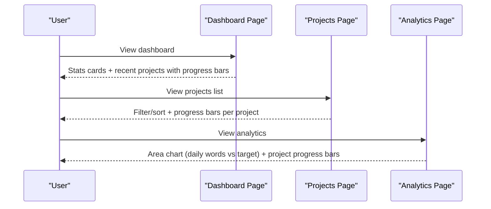
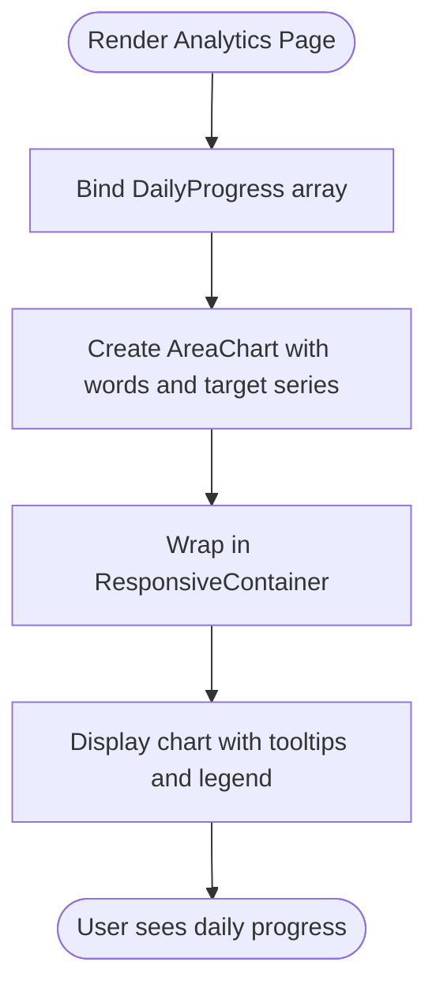
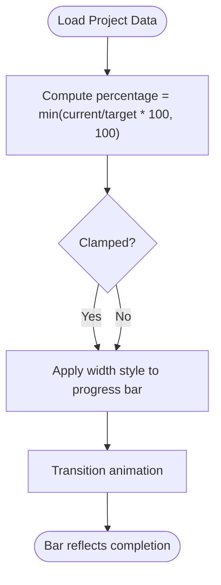
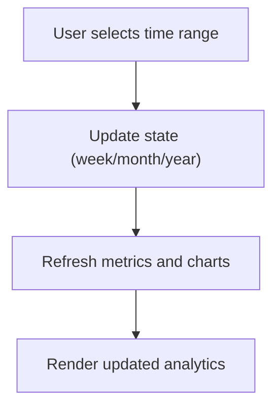
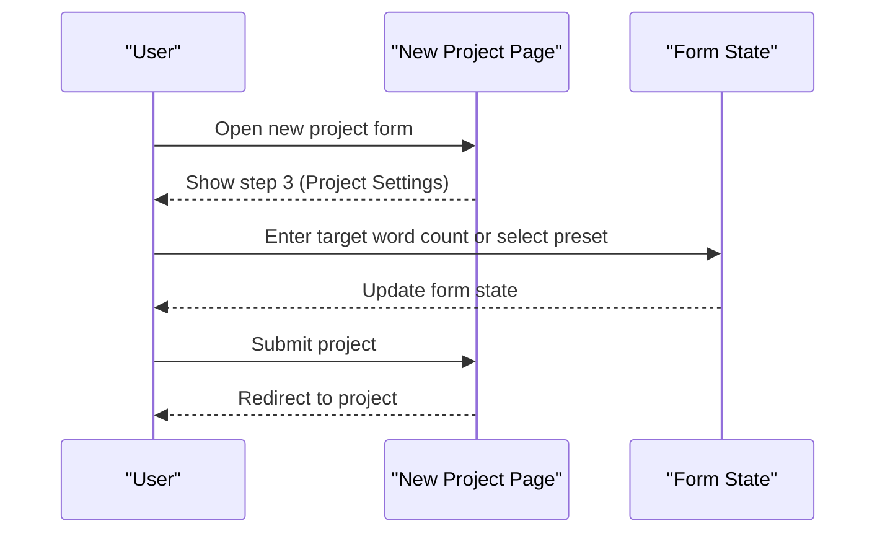
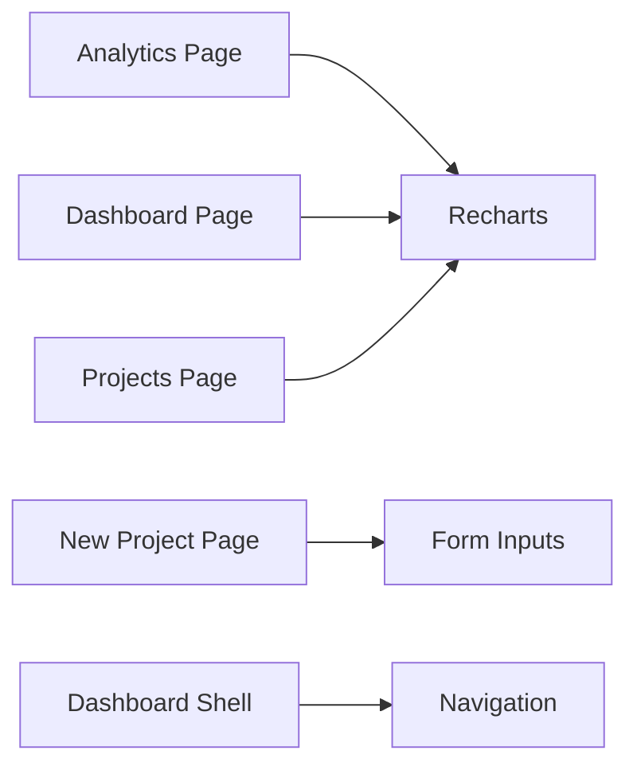

# Progress Tracking

<cite>
**Referenced Files in This Document**
- [src/app/dashboard/page.tsx](file://src/app/dashboard/page.tsx)
- [src/app/projects/page.tsx](file://src/app/projects/page.tsx)
- [src/app/projects/new/page.tsx](file://src/app/projects/new/page.tsx)
- [src/app/analytics/page.tsx](file://src/app/analytics/page.tsx)
- [src/components/dashboard/dashboard-shell.tsx](file://src/components/dashboard/dashboard-shell.tsx)
- [package.json](file://package.json)
</cite>

## Table of Contents
1. [Introduction](#introduction)
2. [Project Structure](#project-structure)
3. [Core Components](#core-components)
4. [Architecture Overview](#architecture-overview)
5. [Detailed Component Analysis](#detailed-component-analysis)
6. [Dependency Analysis](#dependency-analysis)
7. [Performance Considerations](#performance-considerations)
8. [Troubleshooting Guide](#troubleshooting-guide)
9. [Conclusion](#conclusion)

## Introduction
This document explains the progress tracking system for daily progress visualization, project milestones, and goal achievement metrics. It covers the data structures used for progress reporting, the area chart implementation for daily trends, and progress bars for project tracking. It also documents the time range filtering system, how progress trends are calculated, and how writing targets are established and monitored. Practical examples show how progress data is structured and rendered in the dashboard and analytics views. Guidance is included for setting realistic goals and interpreting progress indicators.

## Project Structure
The progress tracking system spans several pages and components:
- Dashboard: High-level stats and recent projects with progress bars
- Projects: Full project list with sorting, filtering, and progress bars
- Analytics: Daily progress area chart, project progress bars, and additional insights
- Project creation: Target word count selection and presets
- Shared shell: Navigation and layout for the dashboard

**Diagram sources**
- [src/app/dashboard/page.tsx](file://src/app/dashboard/page.tsx#L1-L260)
- [src/app/projects/page.tsx](file://src/app/projects/page.tsx#L1-L394)
- [src/app/projects/new/page.tsx](file://src/app/projects/new/page.tsx#L1-L555)
- [src/app/analytics/page.tsx](file://src/app/analytics/page.tsx#L1-L470)
- [src/components/dashboard/dashboard-shell.tsx](file://src/components/dashboard/dashboard-shell.tsx#L1-L224)
- [package.json](file://package.json#L55-L55)

**Section sources**
- [src/app/dashboard/page.tsx](file://src/app/dashboard/page.tsx#L1-L260)
- [src/app/projects/page.tsx](file://src/app/projects/page.tsx#L1-L394)
- [src/app/projects/new/page.tsx](file://src/app/projects/new/page.tsx#L1-L555)
- [src/app/analytics/page.tsx](file://src/app/analytics/page.tsx#L1-L470)
- [src/components/dashboard/dashboard-shell.tsx](file://src/components/dashboard/dashboard-shell.tsx#L1-L224)
- [package.json](file://package.json#L55-L55)

## Core Components
This section defines the core data structures and rendering patterns used for progress tracking.

- DailyProgress interface
  - Purpose: Represents daily word count and target for visualization
  - Fields:
    - date: string (e.g., day of week)
    - words: number (actual words written)
    - target: number (daily writing target)
    - sessions: number (optional metric)
    - aiUsage: number (optional metric)
  - Example usage: Daily area chart data binding

- ProjectProgress interface
  - Purpose: Represents per-project word count, target, and completion percentage
  - Fields:
    - name: string
    - words: number (current word count)
    - target: number (goal)
    - percentage: number (computed completion)
    - lastUpdated: string (human-readable timestamp)
  - Example usage: Project progress bars in analytics and dashboard

- Progress calculation helpers
  - Percentage computation: clamp current/target ratio to 100%
  - Relative time formatting: human-friendly timestamps

- Rendering patterns
  - Area chart: words vs target over time
  - Progress bars: width based on percentage with smooth transitions
  - Stat cards: summary metrics with trend indicators

**Section sources**
- [src/app/analytics/page.tsx](file://src/app/analytics/page.tsx#L70-L84)
- [src/app/analytics/page.tsx](file://src/app/analytics/page.tsx#L117-L125)
- [src/app/analytics/page.tsx](file://src/app/analytics/page.tsx#L127-L132)
- [src/app/dashboard/page.tsx](file://src/app/dashboard/page.tsx#L58-L67)
- [src/app/projects/page.tsx](file://src/app/projects/page.tsx#L222-L232)

## Architecture Overview
The progress tracking system integrates multiple pages and libraries:
- Data sources: Mock data in pages for demonstration
- Visualization: Recharts for area charts and pie/radar charts
- UI components: Tailwind-based progress bars and cards
- Navigation: Dashboard shell routes to analytics and projects

**Diagram sources**
- [src/app/dashboard/page.tsx](file://src/app/dashboard/page.tsx#L90-L223)
- [src/app/projects/page.tsx](file://src/app/projects/page.tsx#L266-L393)
- [src/app/analytics/page.tsx](file://src/app/analytics/page.tsx#L191-L469)

## Detailed Component Analysis

### Daily Progress Visualization (Area Chart)
The analytics page renders a responsive area chart showing daily word count versus daily target. The chart uses Recharts with:
- Area series for words written
- Line series for daily target
- Responsive container sizing
- Tooltips and legends for interactivity

**Diagram sources**
- [src/app/analytics/page.tsx](file://src/app/analytics/page.tsx#L256-L279)

**Section sources**
- [src/app/analytics/page.tsx](file://src/app/analytics/page.tsx#L250-L281)

### Project Progress Bars (Milestones and Goals)
Two locations render progress bars for individual projects:
- Dashboard: Recent projects grid with progress bars
- Projects: Full list with sortable progress column
- Analytics: Project progress section with bars and last-updated info

Rendering pattern:
- Compute percentage from current/target
- Clamp to 100%
- Apply width via inline style on a horizontal bar
- Animate width transitions

**Diagram sources**
- [src/app/dashboard/page.tsx](file://src/app/dashboard/page.tsx#L166-L177)
- [src/app/projects/page.tsx](file://src/app/projects/page.tsx#L222-L232)
- [src/app/analytics/page.tsx](file://src/app/analytics/page.tsx#L283-L311)

**Section sources**
- [src/app/dashboard/page.tsx](file://src/app/dashboard/page.tsx#L166-L177)
- [src/app/projects/page.tsx](file://src/app/projects/page.tsx#L222-L232)
- [src/app/analytics/page.tsx](file://src/app/analytics/page.tsx#L283-L311)

### Time Range Filtering System
The analytics page includes a time range selector allowing users to switch between “This Week,” “This Month,” and “This Year.” The selected range influences the displayed metrics and charts.

**Diagram sources**
- [src/app/analytics/page.tsx](file://src/app/analytics/page.tsx#L201-L216)

**Section sources**
- [src/app/analytics/page.tsx](file://src/app/analytics/page.tsx#L95-L96)
- [src/app/analytics/page.tsx](file://src/app/analytics/page.tsx#L201-L216)

### Writing Targets and Goal Setting
Writing targets are established during project creation:
- Target word count input with presets for short story, novella, novel, and epic
- Preset buttons quickly set realistic targets
- Additional settings include audience, rating, and visibility

**Diagram sources**
- [src/app/projects/new/page.tsx](file://src/app/projects/new/page.tsx#L267-L308)

**Section sources**
- [src/app/projects/new/page.tsx](file://src/app/projects/new/page.tsx#L270-L308)

### Practical Examples: Data Structures and Rendering
- DailyProgress example structure
  - Keys: date, words, target, sessions, aiUsage
  - Used in area chart data binding
- ProjectProgress example structure
  - Keys: name, words, target, percentage, lastUpdated
  - Used in project progress bars
- Dashboard rendering
  - Stats cards for totals and weekly words
  - Progress bars for recent projects
- Projects page rendering
  - Progress bars with sorting by progress
  - Status badges and star toggling

**Section sources**
- [src/app/analytics/page.tsx](file://src/app/analytics/page.tsx#L117-L132)
- [src/app/dashboard/page.tsx](file://src/app/dashboard/page.tsx#L90-L223)
- [src/app/projects/page.tsx](file://src/app/projects/page.tsx#L222-L238)

## Dependency Analysis
The progress tracking components rely on:
- Recharts for visualization
- Tailwind CSS for styling and responsive containers
- React state for interactivity (time range, form inputs)
- Navigation shell for routing

**Diagram sources**
- [src/app/analytics/page.tsx](file://src/app/analytics/page.tsx#L30-L51)
- [src/app/dashboard/page.tsx](file://src/app/dashboard/page.tsx#L1-L18)
- [src/app/projects/page.tsx](file://src/app/projects/page.tsx#L1-L27)
- [src/app/projects/new/page.tsx](file://src/app/projects/new/page.tsx#L1-L21)
- [src/components/dashboard/dashboard-shell.tsx](file://src/components/dashboard/dashboard-shell.tsx#L32-L47)
- [package.json](file://package.json#L55-L55)

**Section sources**
- [package.json](file://package.json#L55-L55)
- [src/app/analytics/page.tsx](file://src/app/analytics/page.tsx#L30-L51)
- [src/app/dashboard/page.tsx](file://src/app/dashboard/page.tsx#L1-L18)
- [src/app/projects/page.tsx](file://src/app/projects/page.tsx#L1-L27)
- [src/app/projects/new/page.tsx](file://src/app/projects/new/page.tsx#L1-L21)
- [src/components/dashboard/dashboard-shell.tsx](file://src/components/dashboard/dashboard-shell.tsx#L32-L47)

## Performance Considerations
- Prefer lightweight chart libraries for frequent updates
- Use responsive containers to avoid layout thrashing
- Clamp progress percentages to prevent overflow bars
- Defer heavy computations until data is ready (loading states)
- Use CSS transitions for smooth progress bar animations

## Troubleshooting Guide
Common issues and resolutions:
- Progress bar not updating
  - Verify percentage calculation clamps to 100
  - Confirm inline style width is applied
- Chart not visible
  - Ensure responsive container has explicit height
  - Check that data arrays are populated before rendering
- Sorting by progress incorrect
  - Confirm sort comparator uses wordCount/targetWordCount ratios
- Time range filter not changing metrics
  - Ensure state update triggers re-render
  - Validate metric calculations depend on selected range

**Section sources**
- [src/app/dashboard/page.tsx](file://src/app/dashboard/page.tsx#L58-L67)
- [src/app/projects/page.tsx](file://src/app/projects/page.tsx#L138-L153)
- [src/app/analytics/page.tsx](file://src/app/analytics/page.tsx#L201-L216)

## Conclusion
The progress tracking system combines daily area charts, project progress bars, and time-range filtering to provide a comprehensive view of writing productivity and goal achievement. By structuring progress data consistently and leveraging Recharts for visualization, the system offers actionable insights and encourages sustained writing momentum. Realistic goal setting during project creation ensures meaningful progress metrics and achievable targets.