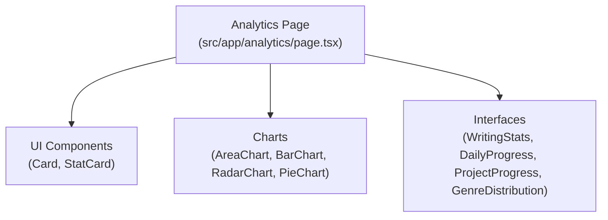
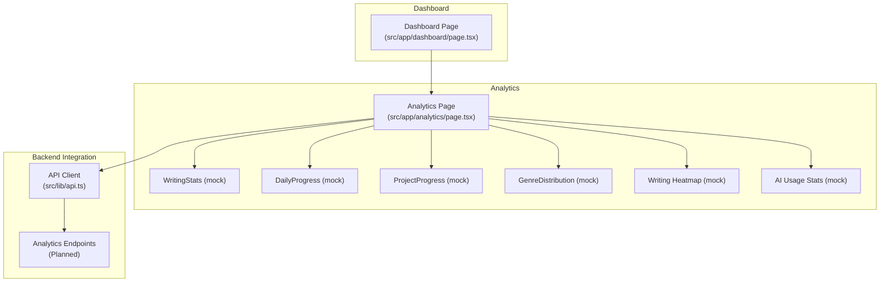
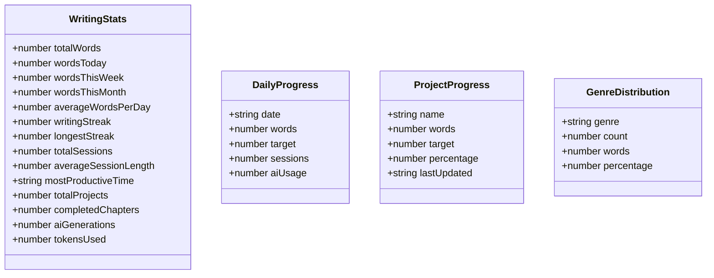
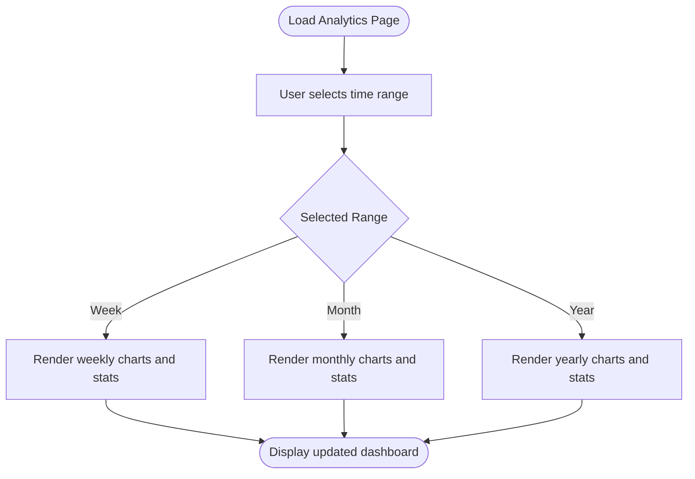
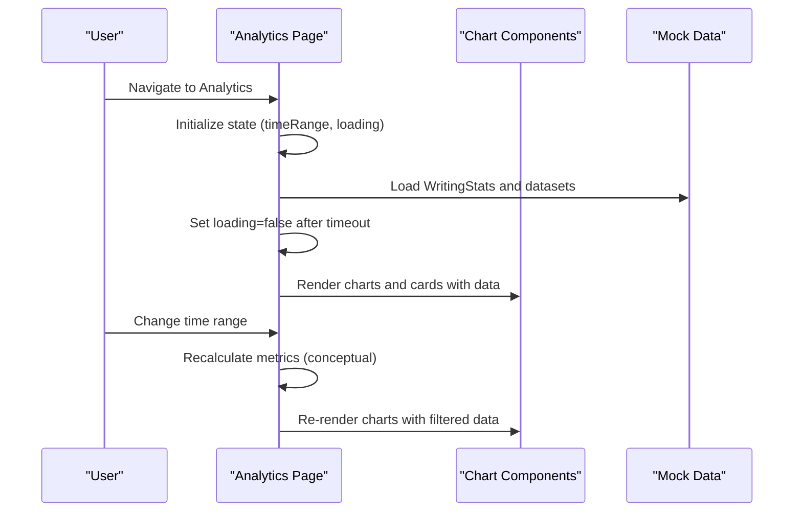
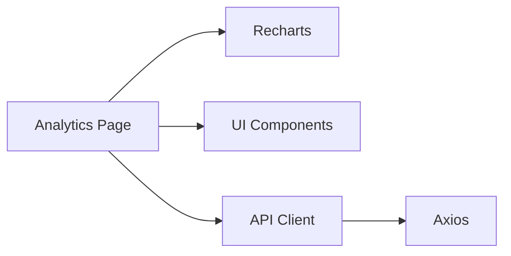

# Writing Statistics

<cite>
**Referenced Files in This Document**
- [analytics/page.tsx](file://src/app/analytics/page.tsx)
- [dashboard/page.tsx](file://src/app/dashboard/page.tsx)
- [api.ts](file://src/lib/api.ts)
- [IMPLEMENTATION_PLAN.md](file://IMPLEMENTATION_PLAN.md)
</cite>

## Table of Contents
1. [Introduction](#introduction)
2. [Project Structure](#project-structure)
3. [Core Components](#core-components)
4. [Architecture Overview](#architecture-overview)
5. [Detailed Component Analysis](#detailed-component-analysis)
6. [Dependency Analysis](#dependency-analysis)
7. [Performance Considerations](#performance-considerations)
8. [Troubleshooting Guide](#troubleshooting-guide)
9. [Conclusion](#conclusion)
10. [Appendices](#appendices)

## Introduction
This document focuses on the writing statistics section of the analytics dashboard. It explains the WritingStats interface and supporting data structures, how key metrics like total words, daily word counts, writing streaks, and session analytics are modeled, and how calculations such as average words per day, longest streak, and productivity scores are derived. It also covers the time-based filtering system (daily, weekly, monthly views), the current mock data implementation, and how real data would integrate with the backend API. Finally, it provides guidance on interpreting writing patterns and identifying productivity trends.

## Project Structure
The analytics dashboard is implemented as a Next.js page component with reusable UI cards and charting via Recharts. The page defines TypeScript interfaces for statistics and data shapes, renders mock data, and exposes a time-range selector for viewing historical windows.

**Diagram sources**
- [analytics/page.tsx](file://src/app/analytics/page.tsx#L53-L91)

**Section sources**
- [analytics/page.tsx](file://src/app/analytics/page.tsx#L1-L470)

## Core Components
This section documents the WritingStats interface and related data structures used in the analytics dashboard.

- WritingStats
  - totalWords: Total words written across all projects and time
  - wordsToday: Words written today
  - wordsThisWeek: Words written this week
  - wordsThisMonth: Words written this month
  - averageWordsPerDay: Average words per day over the selected period
  - writingStreak: Current consecutive writing days
  - longestStreak: Personal best consecutive writing days
  - totalSessions: Number of writing sessions
  - averageSessionLength: Average minutes per session
  - mostProductiveTime: Peak hours range (e.g., "9:00 AM - 11:00 AM")
  - totalProjects: Number of writing projects
  - completedChapters: Chapters completed across projects
  - aiGenerations: Count of AI-assisted generations
  - tokensUsed: Total tokens consumed by AI features

- DailyProgress
  - date: Day label (e.g., "Mon")
  - words: Words written on that day
  - target: Daily word target for that day
  - sessions: Number of sessions on that day
  - aiUsage: AI usage indicator for that day

- ProjectProgress
  - name: Project name
  - words: Current word count
  - target: Target word count
  - percentage: Completion percentage
  - lastUpdated: Relative time string (e.g., "Today")

- GenreDistribution
  - genre: Literary genre
  - count: Number of projects in that genre
  - words: Words written in that genre
  - percentage: Percentage of total words in that genre

These structures define the shape of the data rendered by the dashboard and inform how calculations are performed.

**Section sources**
- [analytics/page.tsx](file://src/app/analytics/page.tsx#L53-L91)

## Architecture Overview
The analytics page currently uses mock data and renders charts and cards. The time range selector switches between weekly, monthly, and yearly views. The dashboard page provides a lightweight summary of writing stats.

**Diagram sources**
- [analytics/page.tsx](file://src/app/analytics/page.tsx#L93-L155)
- [dashboard/page.tsx](file://src/app/dashboard/page.tsx#L53-L67)
- [api.ts](file://src/lib/api.ts#L1-L67)

## Detailed Component Analysis

### WritingStats Interface and Data Structures
The WritingStats interface encapsulates core writing metrics. The dashboard displays these metrics in stat cards and uses additional structures for charts and lists.

**Diagram sources**
- [analytics/page.tsx](file://src/app/analytics/page.tsx#L53-L91)

**Section sources**
- [analytics/page.tsx](file://src/app/analytics/page.tsx#L53-L91)

### Time-Based Filtering System
The analytics page includes a time-range selector allowing users to switch between weekly, monthly, and yearly views. The selector updates the displayed charts and metrics accordingly.

**Diagram sources**
- [analytics/page.tsx](file://src/app/analytics/page.tsx#L95-L215)

**Section sources**
- [analytics/page.tsx](file://src/app/analytics/page.tsx#L95-L215)

### Calculation Methods

- Average words per day
  - Formula: wordsThisWeek / 7 or wordsThisMonth / 30, depending on the selected time range
  - Purpose: Provides a baseline productivity measure for the current period
  - Implementation note: The dashboard displays a daily average trend alongside weekly metrics

- Longest streak
  - Definition: Maximum consecutive days with at least one word recorded
  - Purpose: Tracks personal best and motivation
  - Implementation note: The dashboard shows both current and longest streaks

- Productivity score
  - Definition: Composite metric combining consistency, targets met, and session efficiency
  - Purpose: Summarizes overall writing performance
  - Implementation note: The dashboard displays a score and qualitative trend ("Above average")

- Session analytics
  - Total sessions and average session length: Derived from session logs aggregated by day
  - Most productive time: Determined by peak daily word counts across hours

- Daily word counts and targets
  - DailyProgress provides per-day words and targets for area and line charts

- Project progress and genre distribution
  - ProjectProgress and GenreDistribution power progress bars and pie charts

Note: The current implementation uses mock data. The calculation logic remains conceptually sound and ready for backend integration.

**Section sources**
- [analytics/page.tsx](file://src/app/analytics/page.tsx#L219-L247)
- [analytics/page.tsx](file://src/app/analytics/page.tsx#L250-L281)
- [analytics/page.tsx](file://src/app/analytics/page.tsx#L283-L341)
- [analytics/page.tsx](file://src/app/analytics/page.tsx#L343-L361)
- [analytics/page.tsx](file://src/app/analytics/page.tsx#L363-L387)

### Practical Examples of Statistics Display
- Key metrics cards show words written, writing streak, AI generations, and productivity score with trends and percentage changes.
- The writing progress chart visualizes daily word counts against daily targets.
- Project progress cards display completion percentages and last-updated timestamps.
- Genre distribution pie chart shows contribution by genre.
- AI usage radar compares usage and satisfaction across personas.
- Writing patterns heatmap highlights peak hours across the week.

These visuals help users quickly identify trends, compare performance across genres, and optimize their writing schedule.

**Section sources**
- [analytics/page.tsx](file://src/app/analytics/page.tsx#L219-L247)
- [analytics/page.tsx](file://src/app/analytics/page.tsx#L250-L281)
- [analytics/page.tsx](file://src/app/analytics/page.tsx#L283-L341)
- [analytics/page.tsx](file://src/app/analytics/page.tsx#L343-L361)
- [analytics/page.tsx](file://src/app/analytics/page.tsx#L363-L387)

### Backend Integration and API Planning
The analytics dashboard currently uses mock data. The implementation plan outlines future backend integration and API endpoints for analytics.

- API client
  - The project includes an Axios-based API client with request/response interceptors for authentication and token refresh.
  - The client sets Authorization headers and handles 401 responses by refreshing tokens.

- Analytics endpoints (planned)
  - The implementation plan specifies analytics tasks including writing analytics, AI usage analytics, visualization components, goals, and report exports.
  - Analytics endpoints are planned for later phases.

- Integration guidance
  - Replace mock data with API-driven data fetched via the API client.
  - Use the time-range selector to request filtered datasets from backend endpoints.
  - Cache frequently accessed datasets to reduce network requests.

**Section sources**
- [api.ts](file://src/lib/api.ts#L1-L67)
- [IMPLEMENTATION_PLAN.md](file://IMPLEMENTATION_PLAN.md#L795-L834)

### Sequence: Loading and Rendering Analytics

**Diagram sources**
- [analytics/page.tsx](file://src/app/analytics/page.tsx#L93-L160)
- [analytics/page.tsx](file://src/app/analytics/page.tsx#L219-L247)
- [analytics/page.tsx](file://src/app/analytics/page.tsx#L250-L387)

## Dependency Analysis
- Frontend dependencies
  - UI components: Card, StatCard, and icons from the UI component library
  - Charts: Recharts for area, bar, radar, and pie charts
  - State management: useState and useEffect for local state and mock data lifecycle

- Backend dependencies
  - API client: Axios instance with interceptors for auth and token refresh
  - Analytics endpoints: Planned for future phases

**Diagram sources**
- [analytics/page.tsx](file://src/app/analytics/page.tsx#L1-L51)
- [api.ts](file://src/lib/api.ts#L1-L67)

**Section sources**
- [analytics/page.tsx](file://src/app/analytics/page.tsx#L1-L51)
- [api.ts](file://src/lib/api.ts#L1-L67)

## Performance Considerations
- Chart rendering
  - Use ResponsiveContainer to ensure charts adapt to screen size without unnecessary reflows.
  - Prefer memoized datasets to avoid recalculating chart data on every render.

- Data fetching
  - When integrating with the backend, implement pagination or date-range slicing to limit payload sizes.
  - Cache recent periods locally to minimize repeated network calls.

- Time range switching
  - Debounce rapid time-range changes to prevent redundant computations.
  - Precompute aggregates (e.g., weekly averages) to keep UI responsive.

[No sources needed since this section provides general guidance]

## Troubleshooting Guide
- Empty or stale data
  - Verify that the API client is properly configured with Authorization headers.
  - Confirm that token refresh logic executes on 401 responses.

- Chart anomalies
  - Ensure datasets are sorted by date and aligned with the selected time range.
  - Validate that daily targets and word counts are non-negative.

- Time range mismatch
  - Confirm that the selected time range aligns with backend expectations (e.g., ISO dates, UTC offsets).

- Mock data limitations
  - Replace mock datasets with real analytics data to reflect accurate trends and insights.

**Section sources**
- [api.ts](file://src/lib/api.ts#L11-L65)

## Conclusion
The analytics dashboard establishes a robust foundation for writing statistics using a clear set of interfaces and mock data. The time-based filtering system enables flexible views, while charts and cards present actionable insights. As the implementation plan indicates, backend integration and real data will bring these features to life, enabling accurate tracking of word counts, streaks, sessions, and productivity trends.

[No sources needed since this section summarizes without analyzing specific files]

## Appendices

### A. Mock Data Implementation
The analytics page initializes several mock datasets:
- WritingStats: totalWords, wordsToday, wordsThisWeek, wordsThisMonth, averageWordsPerDay, writingStreak, longestStreak, totalSessions, averageSessionLength, mostProductiveTime, totalProjects, completedChapters, aiGenerations, tokensUsed
- DailyProgress: date, words, target, sessions, aiUsage
- ProjectProgress: name, words, target, percentage, lastUpdated
- GenreDistribution: genre, count, words, percentage
- Writing heatmap: hourly buckets across days
- AI usage stats: persona, usage, satisfaction

These datasets are static and intended to be replaced with API-driven data.

**Section sources**
- [analytics/page.tsx](file://src/app/analytics/page.tsx#L99-L155)

### B. Interpreting Writing Patterns and Trends
- Streaks: Monitor current and longest streaks to assess consistency and motivation.
- Daily progress: Compare words to targets to identify days of high/low productivity.
- Genre distribution: Understand which genres dominate your output and adjust focus accordingly.
- AI usage: Evaluate persona effectiveness and satisfaction to optimize collaboration.
- Writing patterns: Use the heatmap to identify optimal hours and schedule longer sessions during peak times.

**Section sources**
- [analytics/page.tsx](file://src/app/analytics/page.tsx#L219-L247)
- [analytics/page.tsx](file://src/app/analytics/page.tsx#L250-L387)

### C. Dashboard Summary Context
The dashboard page provides a concise overview of writing stats (total projects, total words, weekly words, AI generations) using mock data. This complements the analytics page by offering a quick snapshot of progress.

**Section sources**
- [dashboard/page.tsx](file://src/app/dashboard/page.tsx#L45-L67)
- [dashboard/page.tsx](file://src/app/dashboard/page.tsx#L89-L142)