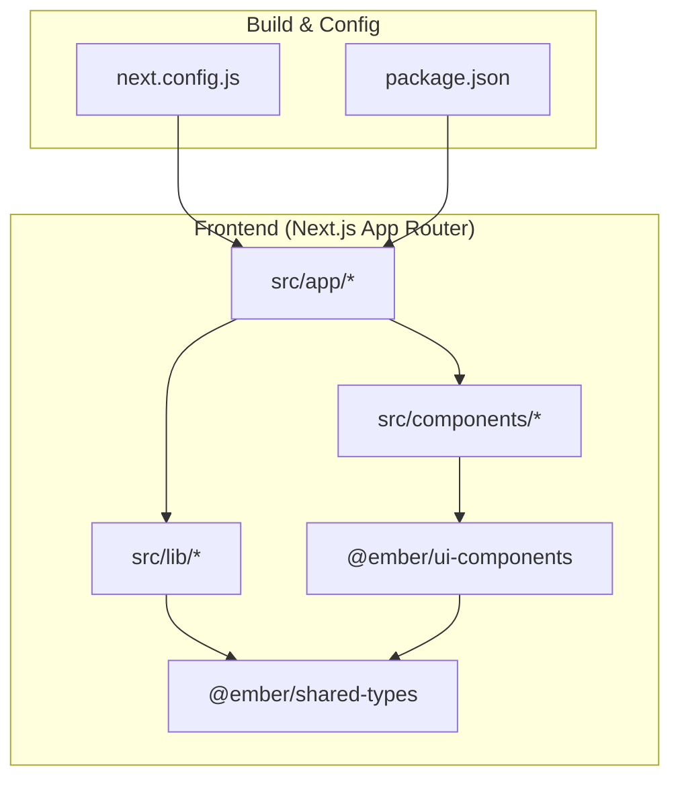
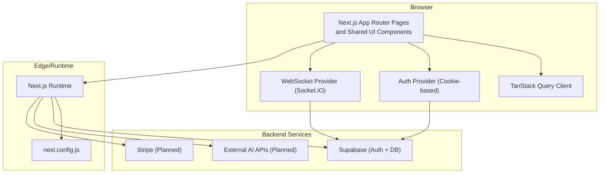
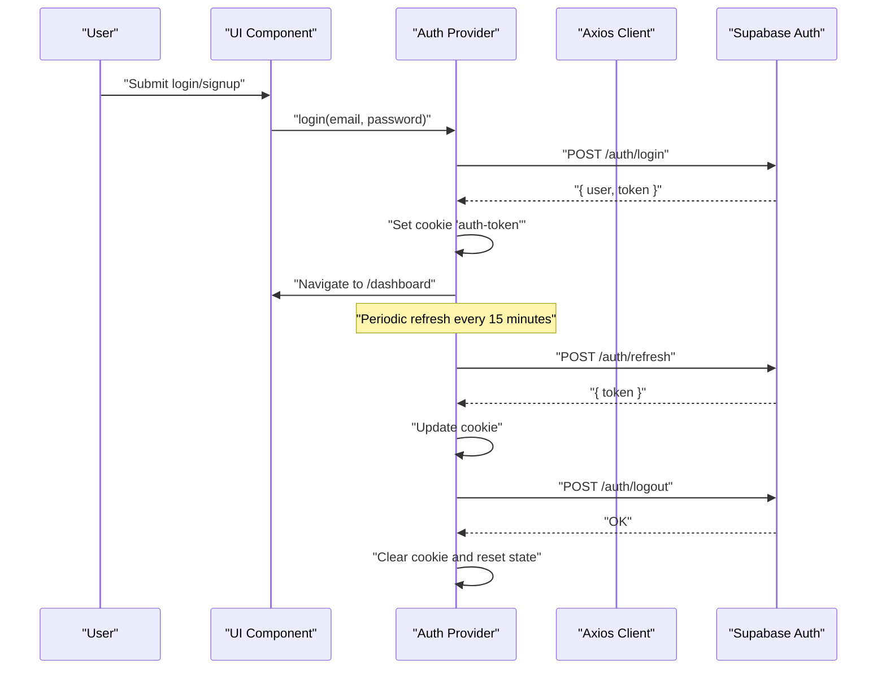
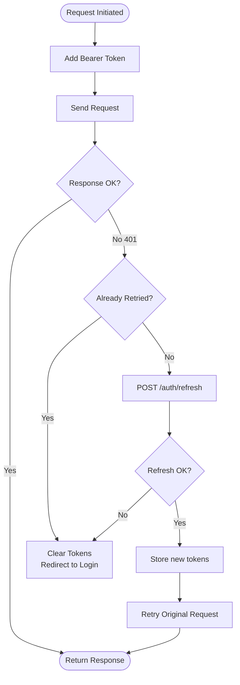
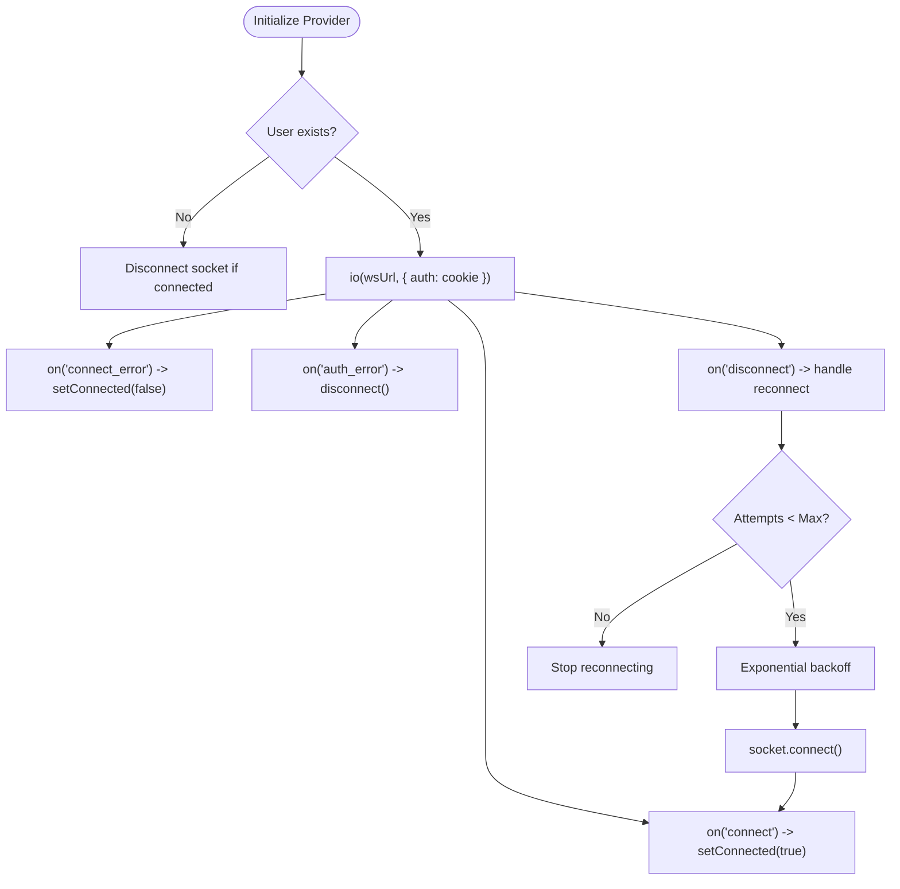
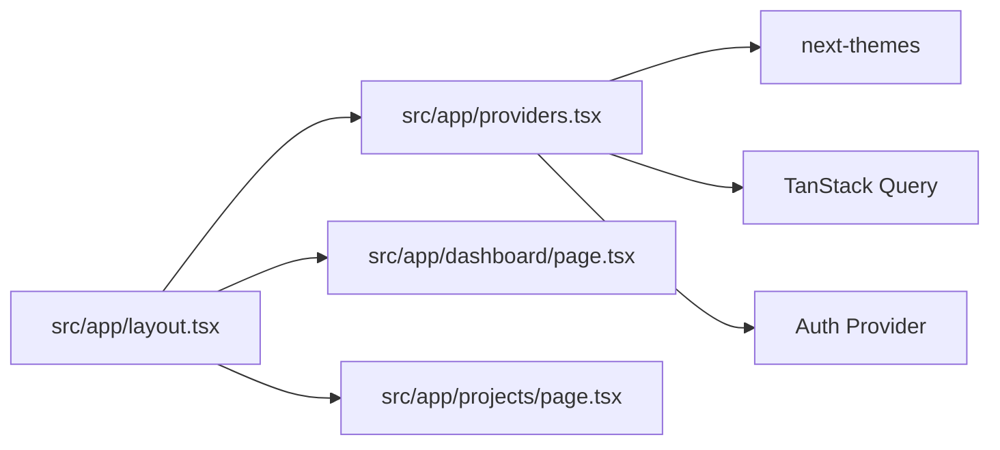
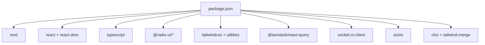
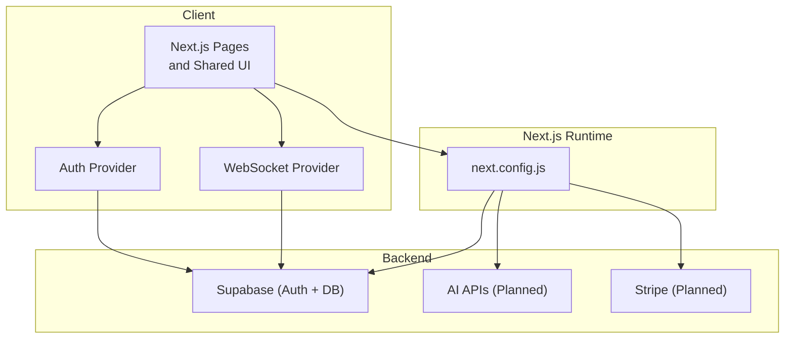

# Architecture Overview

<cite>
**Referenced Files in This Document**
- [README.md](file://README.md)
- [package.json](file://package.json)
- [next.config.js](file://next.config.js)
- [src/app/layout.tsx](file://src/app/layout.tsx)
- [src/app/providers.tsx](file://src/app/providers.tsx)
- [src/components/providers.tsx](file://src/components/providers.tsx)
- [src/contexts/auth-context.tsx](file://src/contexts/auth-context.tsx)
- [src/components/auth/auth-provider.tsx](file://src/components/auth/auth-provider.tsx)
- [src/lib/api.ts](file://src/lib/api.ts)
- [src/components/websocket/websocket-provider.tsx](file://src/components/websocket/websocket-provider.tsx)
- [src/app/dashboard/page.tsx](file://src/app/dashboard/page.tsx)
- [src/app/projects/page.tsx](file://src/app/projects/page.tsx)
- [packages/shared-types/package.json](file://packages/shared-types/package.json)
- [packages/ui-components/package.json](file://packages/ui-components/package.json)
- [src/components/ui/button.tsx](file://src/components/ui/button.tsx)
- [src/components/ui/card.tsx](file://src/components/ui/card.tsx)
- [src/lib/utils.ts](file://src/lib/utils.ts)
</cite>

## Table of Contents
1. [Introduction](#introduction)
2. [Project Structure](#project-structure)
3. [Core Components](#core-components)
4. [Architecture Overview](#architecture-overview)
5. [Detailed Component Analysis](#detailed-component-analysis)
6. [Dependency Analysis](#dependency-analysis)
7. [Performance Considerations](#performance-considerations)
8. [Troubleshooting Guide](#troubleshooting-guide)
9. [Conclusion](#conclusion)
10. [Appendices](#appendices)

## Introduction
This document describes the WorldBest system architecture built with Next.js 14 App Router, React 18, and TypeScript. It explains how the frontend composes UI components, manages state, authenticates users, communicates with backend services, and integrates real-time features. The system leverages Zustand for state management, TanStack Query for server state caching and synchronization, and Supabase for database and authentication. Infrastructure-wise, the platform targets Vercel hosting with containerization and CI/CD support.

## Project Structure
The repository follows a modular structure:
- Frontend: Next.js 14 App Router under src/app, with shared UI components and typed models under packages.
- Components: Reusable UI components and providers under src/components.
- Libraries: API client and utilities under src/lib.
- Packages: Shared types and UI components published as internal packages.

**Diagram sources**
- [next.config.js](file://next.config.js#L1-L56)
- [package.json](file://package.json#L1-L80)
- [src/app/layout.tsx](file://src/app/layout.tsx#L1-L102)
- [src/components/ui/button.tsx](file://src/components/ui/button.tsx#L1-L55)
- [src/components/ui/card.tsx](file://src/components/ui/card.tsx#L1-L78)
- [packages/shared-types/package.json](file://packages/shared-types/package.json#L1-L17)
- [packages/ui-components/package.json](file://packages/ui-components/package.json#L1-L54)

**Section sources**
- [README.md](file://README.md#L73-L104)
- [next.config.js](file://next.config.js#L1-L56)
- [package.json](file://package.json#L1-L80)

## Core Components
- Providers: Central provider stack that wires TanStack Query, theme switching, authentication, and WebSocket connectivity.
- Authentication: Cookie-based auth with auto-refresh and session persistence.
- API Client: Axios-based client with interceptors for token injection and automatic refresh.
- WebSocket Provider: Socket.IO client with authentication via cookies and exponential backoff.
- UI Components: Shared Radix-based components with Tailwind styling and variant systems.
- Shared Types: Internal package for type-safe contracts across the monorepo-like packages.

Key implementation references:
- Providers composition and defaults: [src/app/providers.tsx](file://src/app/providers.tsx#L9-L37), [src/components/providers.tsx](file://src/components/providers.tsx#L10-L55)
- Auth provider and cookie handling: [src/components/auth/auth-provider.tsx](file://src/components/auth/auth-provider.tsx#L20-L165)
- API client with interceptors: [src/lib/api.ts](file://src/lib/api.ts#L1-L67)
- WebSocket provider and reconnect logic: [src/components/websocket/websocket-provider.tsx](file://src/components/websocket/websocket-provider.tsx#L17-L138)
- Shared UI components: [src/components/ui/button.tsx](file://src/components/ui/button.tsx#L1-L55), [src/components/ui/card.tsx](file://src/components/ui/card.tsx#L1-L78)
- Shared types package: [packages/shared-types/package.json](file://packages/shared-types/package.json#L1-L17)
- UI components package: [packages/ui-components/package.json](file://packages/ui-components/package.json#L1-L54)

**Section sources**
- [src/app/providers.tsx](file://src/app/providers.tsx#L9-L37)
- [src/components/providers.tsx](file://src/components/providers.tsx#L10-L55)
- [src/components/auth/auth-provider.tsx](file://src/components/auth/auth-provider.tsx#L20-L165)
- [src/lib/api.ts](file://src/lib/api.ts#L1-L67)
- [src/components/websocket/websocket-provider.tsx](file://src/components/websocket/websocket-provider.tsx#L17-L138)
- [src/components/ui/button.tsx](file://src/components/ui/button.tsx#L1-L55)
- [src/components/ui/card.tsx](file://src/components/ui/card.tsx#L1-L78)
- [packages/shared-types/package.json](file://packages/shared-types/package.json#L1-L17)
- [packages/ui-components/package.json](file://packages/ui-components/package.json#L1-L54)

## Architecture Overview
High-level system architecture:
- UI Layer: Next.js App Router pages and components using shared UI packages.
- State & Caching: TanStack Query manages server state caching and refetch policies.
- Authentication: Cookie-based session with auto-refresh and logout cleanup.
- Real-time: Socket.IO client connects with auth token and reconnects on failures.
- Backend Services: Supabase for database and auth; external APIs for AI and billing as planned.

**Diagram sources**
- [src/app/layout.tsx](file://src/app/layout.tsx#L1-L102)
- [src/app/providers.tsx](file://src/app/providers.tsx#L9-L37)
- [src/components/providers.tsx](file://src/components/providers.tsx#L10-L55)
- [src/components/auth/auth-provider.tsx](file://src/components/auth/auth-provider.tsx#L20-L165)
- [src/components/websocket/websocket-provider.tsx](file://src/components/websocket/websocket-provider.tsx#L17-L138)
- [next.config.js](file://next.config.js#L1-L56)
- [README.md](file://README.md#L49-L72)

## Detailed Component Analysis

### Authentication Flow
The authentication system uses a cookie-based session with auto-refresh and logout cleanup. On successful login/signup, a server-set cookie is stored and used for subsequent requests. The auth provider periodically refreshes the token and handles errors by logging out the user.

**Diagram sources**
- [src/components/auth/auth-provider.tsx](file://src/components/auth/auth-provider.tsx#L67-L141)
- [src/lib/api.ts](file://src/lib/api.ts#L39-L64)

**Section sources**
- [src/components/auth/auth-provider.tsx](file://src/components/auth/auth-provider.tsx#L20-L165)
- [src/lib/api.ts](file://src/lib/api.ts#L1-L67)

### API Client and Token Refresh
The Axios client injects Authorization headers and intercepts 401 responses to trigger a token refresh using a stored refresh token. On success, it retries the original request; otherwise, it clears tokens and redirects to login.

**Diagram sources**
- [src/lib/api.ts](file://src/lib/api.ts#L10-L64)

**Section sources**
- [src/lib/api.ts](file://src/lib/api.ts#L1-L67)

### WebSocket Provider and Real-time Events
The WebSocket provider connects to a WebSocket endpoint using the auth cookie. It tracks connection state, emits and listens to events, and implements exponential backoff with a maximum number of attempts. Authentication errors trigger disconnection.

**Diagram sources**
- [src/components/websocket/websocket-provider.tsx](file://src/components/websocket/websocket-provider.tsx#L24-L93)

**Section sources**
- [src/components/websocket/websocket-provider.tsx](file://src/components/websocket/websocket-provider.tsx#L17-L138)

### UI Composition and Routing
The root layout composes Providers to enable theme switching, TanStack Query, authentication, and optional WebSocket. Pages under src/app demonstrate route-based rendering and navigation.

**Diagram sources**
- [src/app/layout.tsx](file://src/app/layout.tsx#L83-L102)
- [src/app/providers.tsx](file://src/app/providers.tsx#L9-L37)
- [src/app/dashboard/page.tsx](file://src/app/dashboard/page.tsx#L53-L260)
- [src/app/projects/page.tsx](file://src/app/projects/page.tsx#L48-L394)

**Section sources**
- [src/app/layout.tsx](file://src/app/layout.tsx#L1-L102)
- [src/app/providers.tsx](file://src/app/providers.tsx#L9-L37)
- [src/app/dashboard/page.tsx](file://src/app/dashboard/page.tsx#L53-L260)
- [src/app/projects/page.tsx](file://src/app/projects/page.tsx#L48-L394)

## Dependency Analysis
The frontend depends on Next.js, React 18, TypeScript, Radix UI, Tailwind CSS, TanStack Query, and Socket.IO. Shared packages encapsulate types and UI components for reuse across the application.

**Diagram sources**
- [package.json](file://package.json#L13-L62)

**Section sources**
- [package.json](file://package.json#L1-L80)

## Performance Considerations
- Server-side rendering and static generation are enabled by Next.js App Router; leverage route segments and caching strategies.
- TanStack Query default staleTime reduces unnecessary refetches; tune per-query options for optimal UX.
- Image optimization via next.config.js remotePatterns supports CDN-hosted assets.
- Bundle size and Lighthouse targets are defined in the project documentation; consider code splitting and lazy loading for large pages.
- Real-time connections should be scoped to authenticated users to minimize overhead.

[No sources needed since this section provides general guidance]

## Troubleshooting Guide
Common issues and resolutions:
- Inconsistent token storage: Prefer cookie-based sessions for WebSocket and API auth to avoid mismatches.
- Duplicate API client instances: Ensure a single Axios instance is exported and reused across modules.
- WebSocket authentication: Verify cookie presence and correct SameSite/Secure attributes; confirm server accepts cookie-based auth.
- Missing error boundaries: Wrap critical routes with error boundaries to improve resilience.
- Form validation: Integrate Zod-based validation to reduce runtime errors.

**Section sources**
- [README.md](file://README.md#L344-L357)
- [src/lib/api.ts](file://src/lib/api.ts#L1-L67)
- [src/components/websocket/websocket-provider.tsx](file://src/components/websocket/websocket-provider.tsx#L36-L47)

## Conclusion
WorldBest adopts a modern, scalable frontend architecture centered on Next.js 14 App Router, React 18, and TypeScript. The design leverages TanStack Query for robust server state management, a cookie-based authentication system for seamless UX, and Socket.IO for real-time collaboration. Shared packages promote type safety and UI consistency. With clear integration points to Supabase and planned external services, the platform is positioned for iterative feature delivery while maintaining performance and reliability targets.

[No sources needed since this section summarizes without analyzing specific files]

## Appendices

### System Context Diagram
This diagram shows the relationship between UI components, API layers, and external services.

**Diagram sources**
- [src/app/layout.tsx](file://src/app/layout.tsx#L1-L102)
- [src/components/auth/auth-provider.tsx](file://src/components/auth/auth-provider.tsx#L20-L165)
- [src/components/websocket/websocket-provider.tsx](file://src/components/websocket/websocket-provider.tsx#L17-L138)
- [next.config.js](file://next.config.js#L1-L56)
- [README.md](file://README.md#L49-L72)

### Cross-Cutting Concerns
- Authentication: Cookie-based sessions with periodic refresh and logout cleanup.
- Real-time Communication: Socket.IO with cookie auth and exponential backoff.
- Performance Optimization: TanStack Query caching, image optimization, and bundle targeting.
- Scalability: Next.js Edge/Runtime, Vercel hosting, and modular package structure.

**Section sources**
- [src/components/auth/auth-provider.tsx](file://src/components/auth/auth-provider.tsx#L20-L165)
- [src/components/websocket/websocket-provider.tsx](file://src/components/websocket/websocket-provider.tsx#L17-L138)
- [next.config.js](file://next.config.js#L1-L56)
- [README.md](file://README.md#L261-L274)