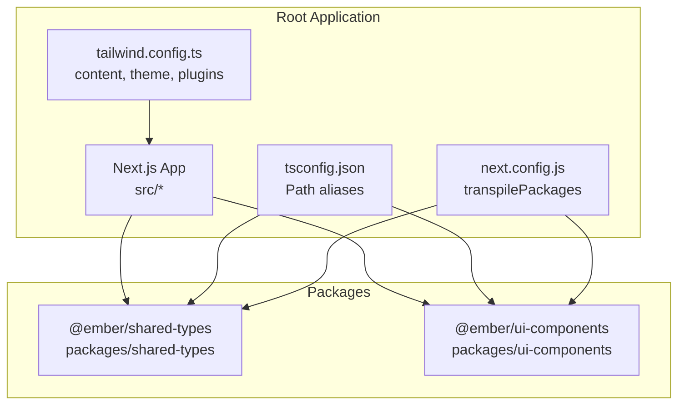
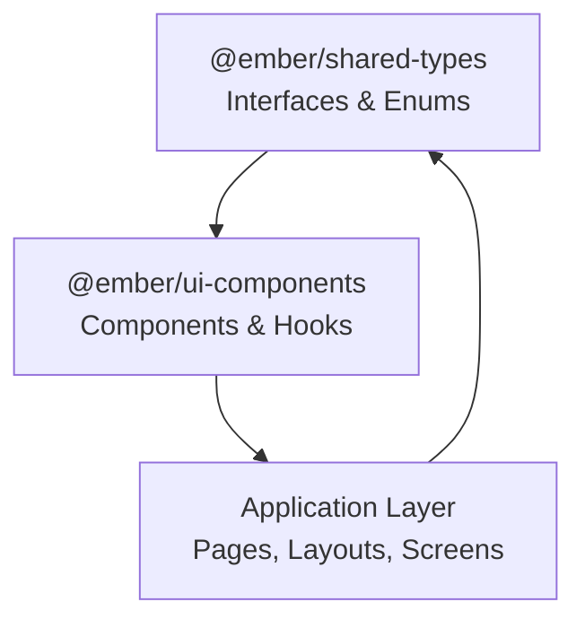
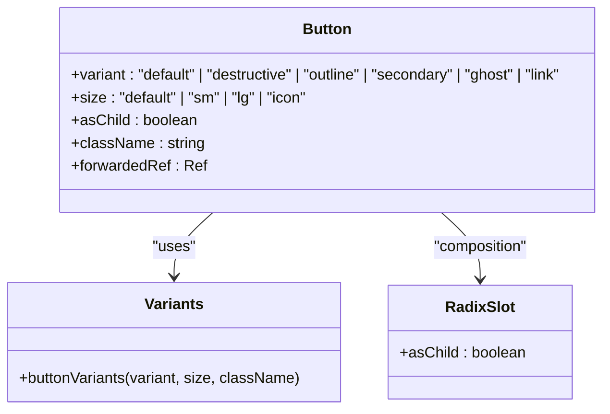
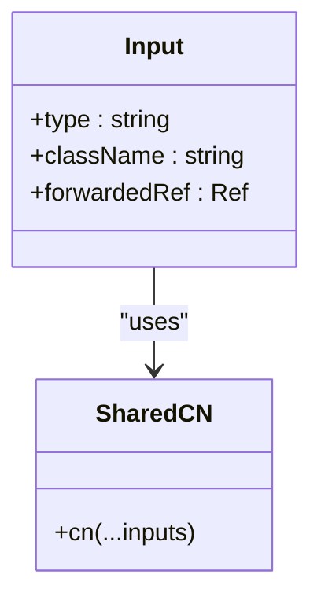
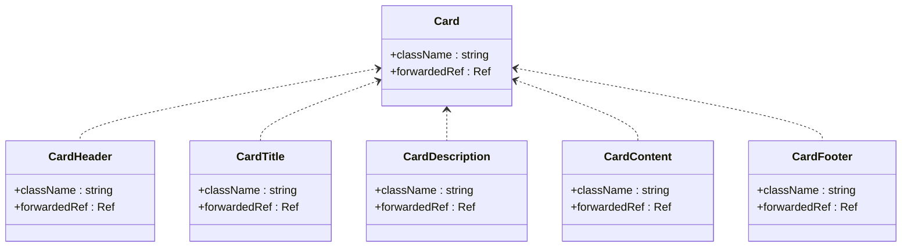
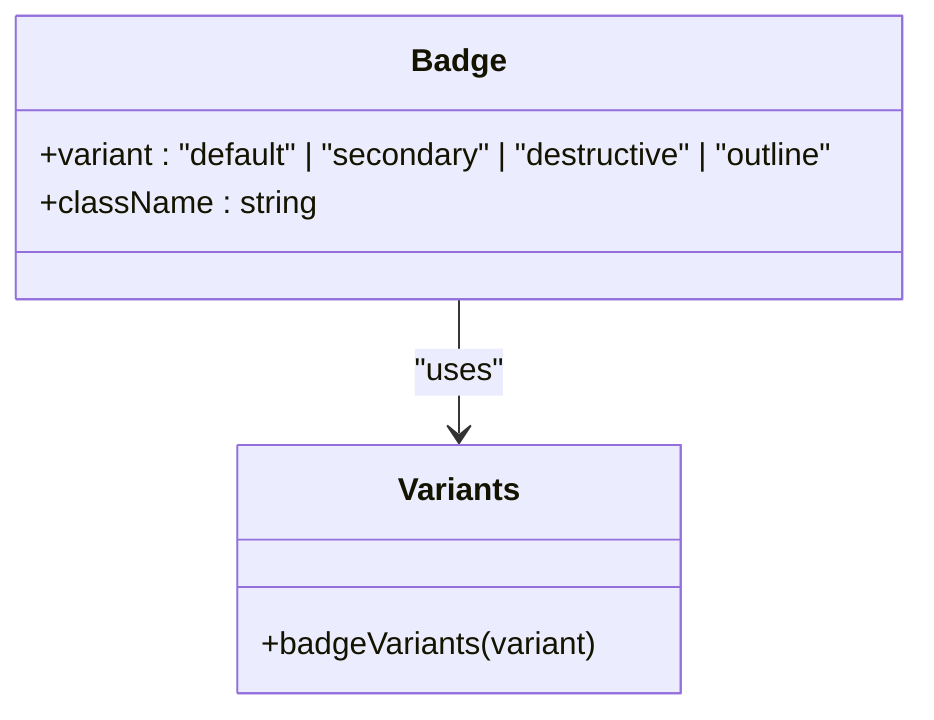
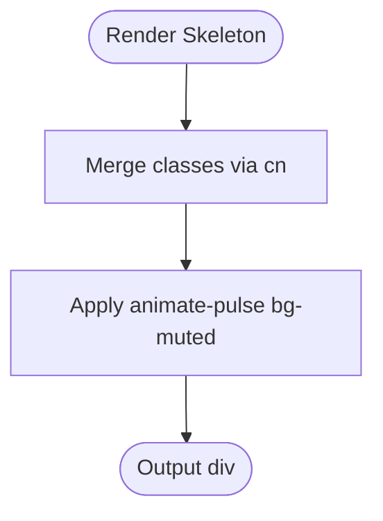
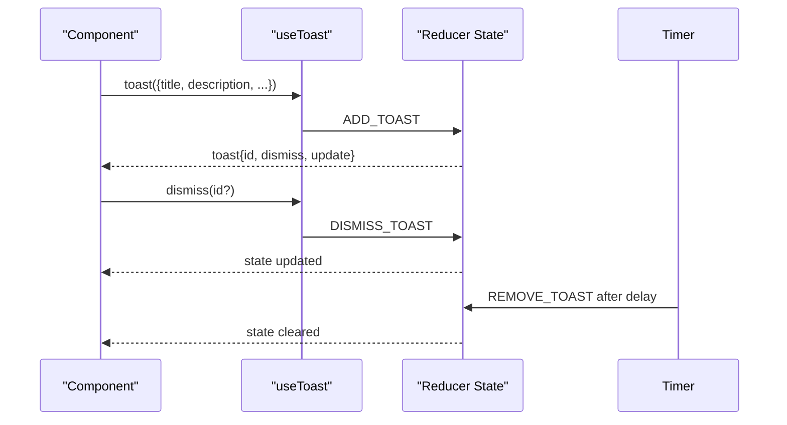
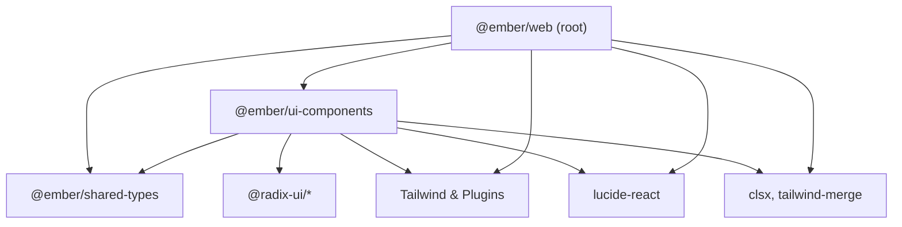

# Component System Architecture

<cite>
**Referenced Files in This Document**
- [package.json](file://package.json)
- [packages/ui-components/package.json](file://packages/ui-components/package.json)
- [packages/shared-types/package.json](file://packages/shared-types/package.json)
- [tsconfig.json](file://tsconfig.json)
- [next.config.js](file://next.config.js)
- [tailwind.config.ts](file://tailwind.config.ts)
- [packages/ui-components/src/index.ts](file://packages/ui-components/src/index.ts)
- [packages/ui-components/src/lib/utils.ts](file://packages/ui-components/src/lib/utils.ts)
- [packages/ui-components/src/hooks/use-toast.ts](file://packages/ui-components/src/hooks/use-toast.ts)
- [packages/shared-types/src/index.ts](file://packages/shared-types/src/index.ts)
- [packages/shared-types/src/entities.ts](file://packages/shared-types/src/entities.ts)
- [packages/shared-types/src/enums.ts](file://packages/shared-types/src/enums.ts)
- [src/lib/utils.ts](file://src/lib/utils.ts)
- [src/components/ui/button.tsx](file://src/components/ui/button.tsx)
- [src/components/ui/input.tsx](file://src/components/ui/input.tsx)
- [src/components/ui/card.tsx](file://src/components/ui/card.tsx)
- [src/components/ui/badge.tsx](file://src/components/ui/badge.tsx)
- [src/components/ui/skeleton.tsx](file://src/components/ui/skeleton.tsx)
</cite>

## Table of Contents
1. [Introduction](#introduction)
2. [Project Structure](#project-structure)
3. [Core Components](#core-components)
4. [Architecture Overview](#architecture-overview)
5. [Detailed Component Analysis](#detailed-component-analysis)
6. [Dependency Analysis](#dependency-analysis)
7. [Performance Considerations](#performance-considerations)
8. [Troubleshooting Guide](#troubleshooting-guide)
9. [Conclusion](#conclusion)
10. [Appendices](#appendices)

## Introduction
This document describes the component system architecture of the Ember platform, focusing on the monorepo structure with two primary packages:
- @ember/shared-types: Provides shared TypeScript interfaces and enums used across the platform.
- @ember/ui-components: Exposes a library of styled, accessible React components built with Radix UI primitives and Tailwind CSS.

It explains the design system principles, component composition patterns, and reusable component architecture. It also documents the relationship between shared-types and ui-components, component props interface design, styling conventions, accessibility compliance, examples of component inheritance and composition, prop forwarding, build system integration, package publishing strategy, and version management across the monorepo.

## Project Structure
The repository follows a monorepo layout with:
- Root Next.js application under src/ and top-level configuration files.
- Two packages under packages/:
  - packages/shared-types: TypeScript-only package exporting core domain interfaces and enums.
  - packages/ui-components: React component library exporting UI primitives and hooks.

Key integration points:
- Path aliases in tsconfig.json resolve @ember/shared-types and @ember/ui-components to their respective src directories.
- Next.js transpiles these packages via transpilePackages to support development and SSR.
- Tailwind CSS scans the app, components, and pages directories for class usage.

**Diagram sources**
- [tsconfig.json](file://tsconfig.json#L24-L34)
- [next.config.js](file://next.config.js#L6-L6)
- [tailwind.config.ts](file://tailwind.config.ts#L5-L9)
- [packages/shared-types/package.json](file://packages/shared-types/package.json#L1-L17)
- [packages/ui-components/package.json](file://packages/ui-components/package.json#L1-L54)

**Section sources**
- [package.json](file://package.json#L1-L80)
- [packages/shared-types/package.json](file://packages/shared-types/package.json#L1-L17)
- [packages/ui-components/package.json](file://packages/ui-components/package.json#L1-L54)
- [tsconfig.json](file://tsconfig.json#L24-L34)
- [next.config.js](file://next.config.js#L6-L6)
- [tailwind.config.ts](file://tailwind.config.ts#L5-L9)

## Core Components
This section outlines the reusable component architecture and design system principles.

- Design system principles
  - Consistency: Shared tokens for colors, typography, spacing, and radii are defined in Tailwind’s theme and consumed by components.
  - Accessibility: Components leverage Radix UI primitives to ensure keyboard navigation, ARIA attributes, and screen reader compatibility.
  - Composition: Components expose variant props and accept className for augmentation, enabling flexible styling while preserving defaults.
  - Prop forwarding: Components forward unknown props to underlying DOM nodes or Radix UI components to maintain flexibility.

- Component composition patterns
  - Variant-based styling: Variants and sizes are defined centrally using class-variance-authority (cva) to produce consistent class sets.
  - Slot pattern: Components like Button support asChild to render alternate host elements (e.g., Link) via Radix UI Slot, enabling semantic composition.
  - Utility-first styling: A shared cn function merges and deduplicates Tailwind classes, ensuring predictable overrides.

- Reusable component architecture
  - Centralized exports: packages/ui-components/src/index.ts re-exports components, hooks, and utilities for easy consumption.
  - Shared utilities: packages/ui-components/src/lib/utils.ts provides a cn helper; the app-level src/lib/utils.ts mirrors it for local components.

Examples of component patterns are covered in the Detailed Component Analysis section.

**Section sources**
- [packages/ui-components/src/index.ts](file://packages/ui-components/src/index.ts#L1-L12)
- [packages/ui-components/src/lib/utils.ts](file://packages/ui-components/src/lib/utils.ts#L1-L6)
- [src/lib/utils.ts](file://src/lib/utils.ts#L1-L6)
- [src/components/ui/button.tsx](file://src/components/ui/button.tsx#L6-L33)
- [src/components/ui/button.tsx](file://src/components/ui/button.tsx#L35-L39)
- [src/components/ui/button.tsx](file://src/components/ui/button.tsx#L41-L52)

## Architecture Overview
The component system integrates three layers:
- Shared types: Defines domain models and enums used by both the UI library and the application.
- UI components: Provides styled, accessible primitives and composite components.
- Application: Consumes shared types and UI components, applying layout and business logic.

**Diagram sources**
- [packages/shared-types/src/index.ts](file://packages/shared-types/src/index.ts#L1-L7)
- [packages/shared-types/src/entities.ts](file://packages/shared-types/src/entities.ts#L1-L458)
- [packages/shared-types/src/enums.ts](file://packages/shared-types/src/enums.ts#L1-L241)
- [packages/ui-components/src/index.ts](file://packages/ui-components/src/index.ts#L1-L12)

## Detailed Component Analysis

### Button Component
The Button component demonstrates variant-based styling, prop forwarding, and composition via asChild.

**Diagram sources**
- [src/components/ui/button.tsx](file://src/components/ui/button.tsx#L6-L33)
- [src/components/ui/button.tsx](file://src/components/ui/button.tsx#L35-L39)
- [src/components/ui/button.tsx](file://src/components/ui/button.tsx#L41-L52)

Key design decisions:
- Props interface extends native button attributes and variant props to ensure type-safe composition.
- asChild enables rendering a different host element (e.g., anchor) while preserving styling and behavior.
- Variant classes are generated via cva and merged with className using cn.

**Section sources**
- [src/components/ui/button.tsx](file://src/components/ui/button.tsx#L6-L33)
- [src/components/ui/button.tsx](file://src/components/ui/button.tsx#L35-L39)
- [src/components/ui/button.tsx](file://src/components/ui/button.tsx#L41-L52)

### Input Component
The Input component illustrates prop forwarding and consistent styling using the shared cn utility.

**Diagram sources**
- [src/components/ui/input.tsx](file://src/components/ui/input.tsx#L4-L5)
- [src/components/ui/input.tsx](file://src/components/ui/input.tsx#L7-L21)
- [src/lib/utils.ts](file://src/lib/utils.ts#L4-L6)

**Section sources**
- [src/components/ui/input.tsx](file://src/components/ui/input.tsx#L4-L5)
- [src/components/ui/input.tsx](file://src/components/ui/input.tsx#L7-L21)
- [src/lib/utils.ts](file://src/lib/utils.ts#L4-L6)

### Card Composite Component
The Card component family demonstrates composition through related parts: Card, CardHeader, CardTitle, CardDescription, CardContent, and CardFooter.

**Diagram sources**
- [src/components/ui/card.tsx](file://src/components/ui/card.tsx#L4-L17)
- [src/components/ui/card.tsx](file://src/components/ui/card.tsx#L19-L29)
- [src/components/ui/card.tsx](file://src/components/ui/card.tsx#L31-L44)
- [src/components/ui/card.tsx](file://src/components/ui/card.tsx#L46-L56)
- [src/components/ui/card.tsx](file://src/components/ui/card.tsx#L58-L65)
- [src/components/ui/card.tsx](file://src/components/ui/card.tsx#L66-L76)

**Section sources**
- [src/components/ui/card.tsx](file://src/components/ui/card.tsx#L4-L17)
- [src/components/ui/card.tsx](file://src/components/ui/card.tsx#L19-L29)
- [src/components/ui/card.tsx](file://src/components/ui/card.tsx#L31-L44)
- [src/components/ui/card.tsx](file://src/components/ui/card.tsx#L46-L56)
- [src/components/ui/card.tsx](file://src/components/ui/card.tsx#L58-L65)
- [src/components/ui/card.tsx](file://src/components/ui/card.tsx#L66-L76)

### Badge Component
The Badge component showcases variant-based styling and consistent class merging.

**Diagram sources**
- [src/components/ui/badge.tsx](file://src/components/ui/badge.tsx#L5-L23)
- [src/components/ui/badge.tsx](file://src/components/ui/badge.tsx#L25-L27)
- [src/components/ui/badge.tsx](file://src/components/ui/badge.tsx#L29-L33)

**Section sources**
- [src/components/ui/badge.tsx](file://src/components/ui/badge.tsx#L5-L23)
- [src/components/ui/badge.tsx](file://src/components/ui/badge.tsx#L25-L27)
- [src/components/ui/badge.tsx](file://src/components/ui/badge.tsx#L29-L33)

### Skeleton Component
Skeleton provides a lightweight, animated placeholder with shared cn utility.

**Diagram sources**
- [src/components/ui/skeleton.tsx](file://src/components/ui/skeleton.tsx#L3-L13)
- [src/lib/utils.ts](file://src/lib/utils.ts#L4-L6)

**Section sources**
- [src/components/ui/skeleton.tsx](file://src/components/ui/skeleton.tsx#L3-L13)
- [src/lib/utils.ts](file://src/lib/utils.ts#L4-L6)

### Toast System (Hook)
The use-toast hook manages a toast queue with actions to add, update, dismiss, and remove notifications.

**Diagram sources**
- [packages/ui-components/src/hooks/use-toast.ts](file://packages/ui-components/src/hooks/use-toast.ts#L142-L169)
- [packages/ui-components/src/hooks/use-toast.ts](file://packages/ui-components/src/hooks/use-toast.ts#L171-L189)

**Section sources**
- [packages/ui-components/src/hooks/use-toast.ts](file://packages/ui-components/src/hooks/use-toast.ts#L142-L169)
- [packages/ui-components/src/hooks/use-toast.ts](file://packages/ui-components/src/hooks/use-toast.ts#L171-L189)

## Dependency Analysis
This section maps the relationships between packages and external libraries.

**Diagram sources**
- [package.json](file://package.json#L34-L35)
- [packages/ui-components/package.json](file://packages/ui-components/package.json#L14-L40)
- [tailwind.config.ts](file://tailwind.config.ts#L130-L130)

Key observations:
- Root depends on both packages via file: protocol.
- ui-components depends on Radix UI primitives, Tailwind utilities, and Lucide icons.
- Both packages share clsx and tailwind-merge for class merging.

**Section sources**
- [package.json](file://package.json#L34-L35)
- [packages/ui-components/package.json](file://packages/ui-components/package.json#L14-L40)
- [tailwind.config.ts](file://tailwind.config.ts#L130-L130)

## Performance Considerations
- Transpilation: Next.js transpiles @ember/shared-types and @ember/ui-components to enable server components and SSR in the monorepo.
- Tailwind scanning: Tailwind content globs scan app, components, and pages directories to purge unused styles.
- Class merging: Using clsx and tailwind-merge minimizes redundant classes and improves runtime performance.
- Variant generation: cva generates deterministic class sets, reducing runtime branching.

Recommendations:
- Keep variant sets minimal to reduce bundle size.
- Prefer className overrides over deeply nested wrappers to avoid extra DOM nodes.
- Use Skeleton sparingly during heavy computations to improve perceived performance.

**Section sources**
- [next.config.js](file://next.config.js#L6-L6)
- [tailwind.config.ts](file://tailwind.config.ts#L5-L9)
- [packages/ui-components/src/lib/utils.ts](file://packages/ui-components/src/lib/utils.ts#L4-L6)
- [src/lib/utils.ts](file://src/lib/utils.ts#L4-L6)

## Troubleshooting Guide
Common issues and resolutions:
- Build failures in ui-components
  - Ensure TypeScript emits are configured and dependencies are installed.
  - Verify main/types entries in package.json point to src/index.ts.
- Runtime class conflicts
  - Confirm cn is used consistently across components to merge classes safely.
- Missing Tailwind utilities
  - Add the component directory to Tailwind’s content array.
- Prop forwarding not working
  - Ensure unknown props are forwarded to the correct DOM or Radix component.
- Toast not dismissing
  - Check that dismiss updates the state and that timers are cleared properly.

**Section sources**
- [packages/ui-components/package.json](file://packages/ui-components/package.json#L6-L12)
- [tailwind.config.ts](file://tailwind.config.ts#L5-L9)
- [packages/ui-components/src/hooks/use-toast.ts](file://packages/ui-components/src/hooks/use-toast.ts#L58-L72)

## Conclusion
The component system architecture leverages a monorepo with a dedicated shared-types package and a ui-components package to enforce consistency, accessibility, and composability. By centralizing design tokens in Tailwind, variant styling with cva, and utility-first class merging, the system supports rapid iteration while maintaining a coherent design language. Integration with Next.js and Radix UI ensures robust SSR and accessibility. Versioning is managed per package with private versions; publishing can be introduced later with CI/CD automation.

## Appendices

### Component Props Interface Design
- Native attribute extension: Components extend native HTML attributes to preserve semantic markup and accessibility.
- Variant props: Variants and sizes are strongly typed to prevent invalid combinations.
- asChild pattern: Enables composition with semantic elements (e.g., anchors) without sacrificing styling.

**Section sources**
- [src/components/ui/button.tsx](file://src/components/ui/button.tsx#L35-L39)
- [src/components/ui/input.tsx](file://src/components/ui/input.tsx#L4-L5)
- [src/components/ui/badge.tsx](file://src/components/ui/badge.tsx#L25-L27)

### Styling Conventions Using Tailwind CSS
- Tokens: Colors, borders, shadows, and radii are defined in Tailwind theme and consumed via semantic color names.
- Utilities: Use utility classes for layout and typography; avoid ad-hoc CSS.
- Merging: Always merge classes with cn to avoid specificity conflicts.

**Section sources**
- [tailwind.config.ts](file://tailwind.config.ts#L18-L129)
- [src/lib/utils.ts](file://src/lib/utils.ts#L4-L6)
- [packages/ui-components/src/lib/utils.ts](file://packages/ui-components/src/lib/utils.ts#L4-L6)

### Accessibility Compliance
- Radix UI primitives: Provide keyboard navigation, focus management, and ARIA semantics out of the box.
- Forward refs and attributes: Components forward refs and unknown props to ensure correct focus and event handling.
- Semantic composition: asChild allows rendering semantic anchors and buttons.

**Section sources**
- [src/components/ui/button.tsx](file://src/components/ui/button.tsx#L41-L52)
- [src/components/ui/input.tsx](file://src/components/ui/input.tsx#L7-L21)

### Examples of Component Inheritance and Composition
- Composition via slots: Button uses asChild with Radix Slot to render alternative hosts.
- Composite patterns: Card composes multiple parts (header, title, content) into a cohesive unit.
- Variant-driven styling: Button and Badge define variant sets to encapsulate style rules.

**Section sources**
- [src/components/ui/button.tsx](file://src/components/ui/button.tsx#L41-L52)
- [src/components/ui/card.tsx](file://src/components/ui/card.tsx#L4-L17)
- [src/components/ui/badge.tsx](file://src/components/ui/badge.tsx#L5-L23)

### Prop Forwarding
- Unknown props are forwarded to the underlying DOM element or Radix component to preserve behavior and accessibility.
- Example: Input forwards all HTML input attributes to the native input element.

**Section sources**
- [src/components/ui/input.tsx](file://src/components/ui/input.tsx#L7-L21)
- [src/components/ui/button.tsx](file://src/components/ui/button.tsx#L41-L52)

### Build System Integration
- Root scripts: Dev, build, and lint scripts orchestrate Next.js workflows.
- Package scripts: TypeScript compilation and linting for ui-components and shared-types.
- Path aliases: tsconfig.json resolves internal packages for type checking and bundling.
- Transpilation: next.config.js transpiles ui-components and shared-types for SSR.

**Section sources**
- [package.json](file://package.json#L6-L11)
- [packages/ui-components/package.json](file://packages/ui-components/package.json#L8-L12)
- [packages/shared-types/package.json](file://packages/shared-types/package.json#L7-L11)
- [tsconfig.json](file://tsconfig.json#L24-L34)
- [next.config.js](file://next.config.js#L6-L6)

### Package Publishing Strategy and Version Management
- Current state: Both shared-types and ui-components are marked private with local file: dependencies in the root package.
- Versioning: Each package maintains its own version; align versions across packages when releasing.
- Publishing: Introduce automated publishing via CI/CD to npm with semantic versioning and changelogs.
- Backward compatibility: Maintain stable APIs and deprecate features before removal.

**Section sources**
- [packages/shared-types/package.json](file://packages/shared-types/package.json#L1-L17)
- [packages/ui-components/package.json](file://packages/ui-components/package.json#L1-L54)
- [package.json](file://package.json#L34-L35)