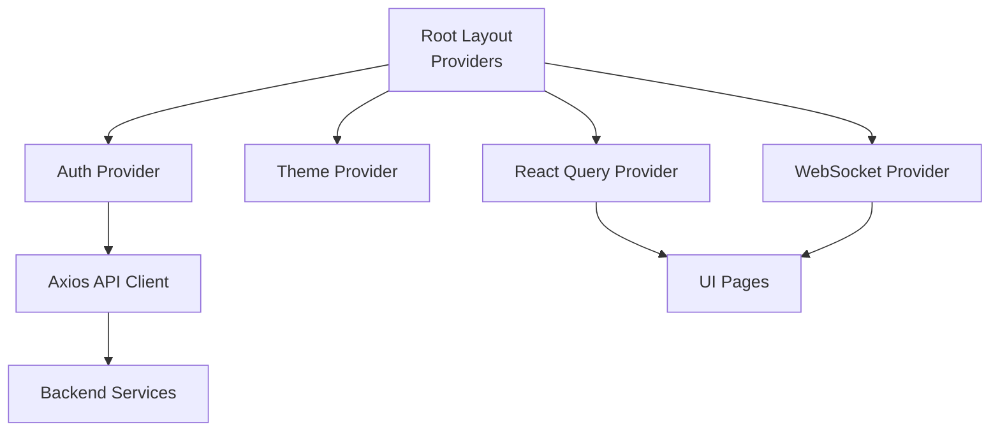
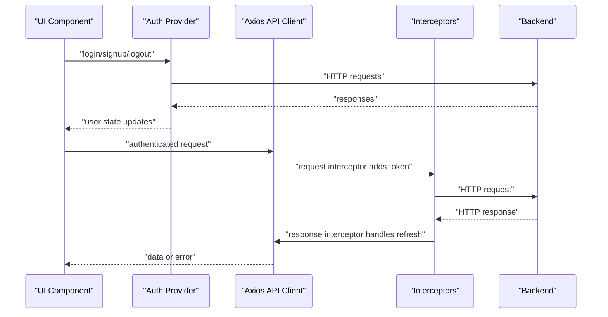
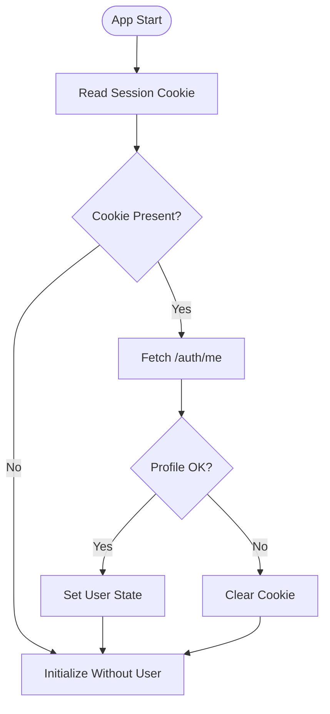
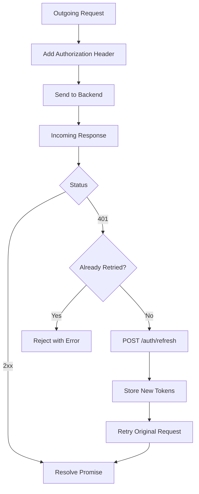
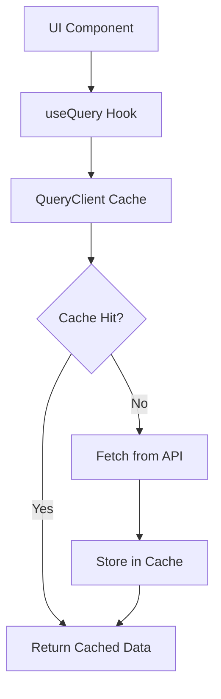
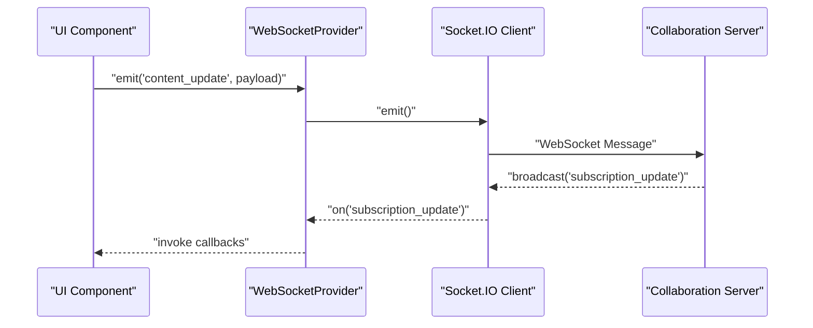
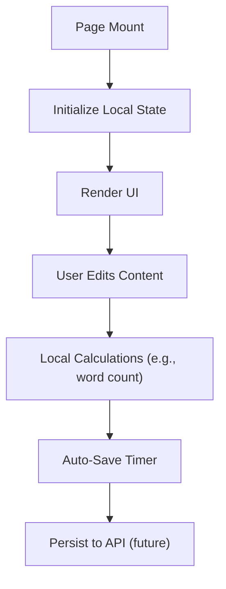
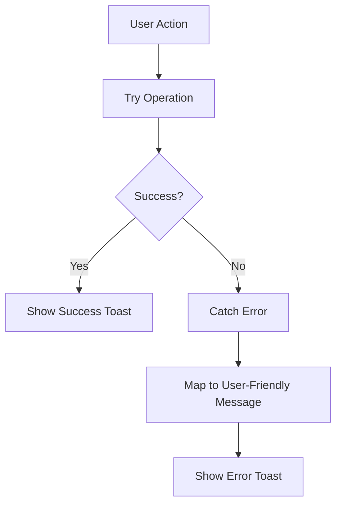
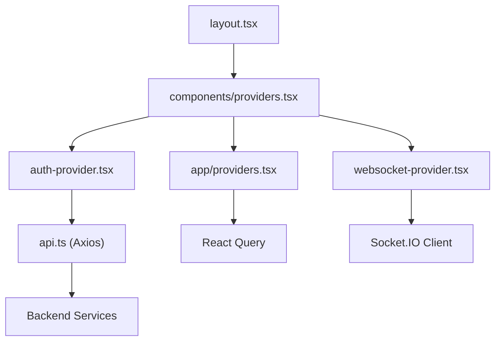

# Data Flow Patterns

<cite>
**Referenced Files in This Document**
- [api.ts](file://src/lib/api.ts)
- [providers.tsx](file://src/app/providers.tsx)
- [providers.tsx](file://src/components/providers.tsx)
- [websocket-provider.tsx](file://src/components/websocket/websocket-provider.tsx)
- [auth-provider.tsx](file://src/components/auth/auth-provider.tsx)
- [auth-context.tsx](file://src/contexts/auth-context.tsx)
- [layout.tsx](file://src/app/layout.tsx)
- [dashboard/page.tsx](file://src/app/dashboard/page.tsx)
- [projects/[id]/write/page.tsx](file://src/app/projects/[id]/write/page.tsx)
- [api.ts](file://packages/shared-types/src/api.ts)
- [use-toast.ts](file://packages/ui-components/src/hooks/use-toast.ts)
</cite>

## Table of Contents
1. [Introduction](#introduction)
2. [Project Structure](#project-structure)
3. [Core Components](#core-components)
4. [Architecture Overview](#architecture-overview)
5. [Detailed Component Analysis](#detailed-component-analysis)
6. [Dependency Analysis](#dependency-analysis)
7. [Performance Considerations](#performance-considerations)
8. [Troubleshooting Guide](#troubleshooting-guide)
9. [Conclusion](#conclusion)

## Introduction
This document explains the data flow patterns across the WorldBest application. It covers:
- The request-response lifecycle from UI components through API clients to backend services, including authentication interceptors and error handling.
- Real-time data via WebSocket connections for collaborative editing, including event-driven updates and presence indicators.
- Caching and synchronization using React Query, including cache invalidation, background updates, and optimistic UI patterns.
- Practical examples of data fetching, mutation handling, and synchronization between local state and remote data.
- Performance considerations such as debouncing, throttling, and efficient re-rendering strategies.

## Project Structure
The application initializes providers at the root level to wire up global state, caching, theming, authentication, and WebSocket connectivity. UI pages consume these providers to fetch and mutate data, render collaborative features, and manage real-time updates.

**Diagram sources**
- [layout.tsx](file://src/app/layout.tsx#L83-L101)
- [providers.tsx](file://src/components/providers.tsx#L10-L54)
- [providers.tsx](file://src/app/providers.tsx#L9-L36)

**Section sources**
- [layout.tsx](file://src/app/layout.tsx#L83-L101)
- [providers.tsx](file://src/components/providers.tsx#L10-L54)
- [providers.tsx](file://src/app/providers.tsx#L9-L36)

## Core Components
- Axios API client with request/response interceptors for authentication and token refresh.
- React Query provider with default caching and retry policies.
- Authentication providers managing session state, cookies/tokens, and periodic refresh.
- WebSocket provider for real-time collaboration and presence updates.
- Shared types for API responses and WebSocket messages.

**Section sources**
- [api.ts](file://src/lib/api.ts#L1-L67)
- [providers.tsx](file://src/components/providers.tsx#L10-L54)
- [providers.tsx](file://src/app/providers.tsx#L9-L36)
- [auth-provider.tsx](file://src/components/auth/auth-provider.tsx#L20-L165)
- [auth-context.tsx](file://src/contexts/auth-context.tsx#L30-L154)
- [websocket-provider.tsx](file://src/components/websocket/websocket-provider.tsx#L17-L138)
- [api.ts](file://packages/shared-types/src/api.ts#L77-L121)

## Architecture Overview
The request-response cycle integrates authentication, caching, and error handling. Real-time collaboration leverages WebSocket events for live updates and presence.

**Diagram sources**
- [auth-provider.tsx](file://src/components/auth/auth-provider.tsx#L67-L141)
- [api.ts](file://src/lib/api.ts#L10-L65)

## Detailed Component Analysis

### Authentication and Token Management
- Cookie-based authentication is initialized on app load by reading a session cookie and validating it against a profile endpoint.
- Periodic token refresh keeps sessions alive without prompting the user.
- Logout clears the session cookie and navigates to the home page.
- Axios interceptors attach Authorization headers and automatically refresh tokens on 401 responses.

**Diagram sources**
- [auth-provider.tsx](file://src/components/auth/auth-provider.tsx#L27-L49)

**Section sources**
- [auth-provider.tsx](file://src/components/auth/auth-provider.tsx#L20-L165)
- [auth-context.tsx](file://src/contexts/auth-context.tsx#L30-L154)
- [api.ts](file://src/lib/api.ts#L10-L65)

### API Client and Interceptors
- Base URL and JSON headers are configured globally.
- Request interceptor attaches Bearer tokens from storage.
- Response interceptor handles 401 Unauthorized by refreshing tokens via a dedicated endpoint and retrying the original request.
- On refresh failure, tokens are removed and the user is redirected to login.

**Diagram sources**
- [api.ts](file://src/lib/api.ts#L10-L65)

**Section sources**
- [api.ts](file://src/lib/api.ts#L1-L67)

### React Query Caching and Mutations
- Global QueryClient configured with default staleTime and retry policies.
- Queries avoid refetching on window focus; mutations retry based on HTTP status.
- Devtools are included for debugging cache behavior.

**Diagram sources**
- [providers.tsx](file://src/components/providers.tsx#L10-L36)
- [providers.tsx](file://src/app/providers.tsx#L9-L36)

**Section sources**
- [providers.tsx](file://src/components/providers.tsx#L10-L54)
- [providers.tsx](file://src/app/providers.tsx#L9-L36)

### WebSocket Real-Time Collaboration
- WebSocketProvider connects when a user exists, authenticating via a cookie token.
- Auto-reconnect with exponential backoff; disconnect reasons are handled gracefully.
- Emits and listens for typed events; exposes emit/on/off helpers.
- Shared WebSocket message types define collaboration, presence, notifications, and AI-related events.

**Diagram sources**
- [websocket-provider.tsx](file://src/components/websocket/websocket-provider.tsx#L17-L138)
- [api.ts](file://packages/shared-types/src/api.ts#L77-L121)

**Section sources**
- [websocket-provider.tsx](file://src/components/websocket/websocket-provider.tsx#L17-L138)
- [api.ts](file://packages/shared-types/src/api.ts#L77-L121)

### UI Data Fetching and Local State
- Dashboard page composes stats and project cards using local state and links to project pages.
- Write page demonstrates local editor state, auto-save timers, word counting, toolbar commands, and AI panel toggles.
- These patterns illustrate separation of concerns: UI state for ephemeral UX, and remote data for persisted content.

**Diagram sources**
- [dashboard/page.tsx](file://src/app/dashboard/page.tsx#L53-L260)
- [projects/[id]/write/page.tsx](file://src/app/projects/[id]/write/page.tsx#L100-L166)

**Section sources**
- [dashboard/page.tsx](file://src/app/dashboard/page.tsx#L53-L260)
- [projects/[id]/write/page.tsx](file://src/app/projects/[id]/write/page.tsx#L100-L166)

### Error Handling and User Feedback
- Toast hooks centralize notification delivery with limits and timeouts.
- Auth actions surface user-friendly messages for login/signup/logout failures.
- API errors propagate through interceptors and are surfaced to UI components.

**Diagram sources**
- [use-toast.ts](file://packages/ui-components/src/hooks/use-toast.ts#L142-L191)
- [auth-provider.tsx](file://src/components/auth/auth-provider.tsx#L67-L113)

**Section sources**
- [use-toast.ts](file://packages/ui-components/src/hooks/use-toast.ts#L1-L191)
- [auth-provider.tsx](file://src/components/auth/auth-provider.tsx#L67-L113)

## Dependency Analysis
The following diagram shows how providers and components depend on each other and external libraries.

**Diagram sources**
- [layout.tsx](file://src/app/layout.tsx#L83-L101)
- [providers.tsx](file://src/components/providers.tsx#L10-L54)
- [providers.tsx](file://src/app/providers.tsx#L9-L36)
- [auth-provider.tsx](file://src/components/auth/auth-provider.tsx#L20-L165)
- [websocket-provider.tsx](file://src/components/websocket/websocket-provider.tsx#L17-L138)
- [api.ts](file://src/lib/api.ts#L1-L67)

**Section sources**
- [layout.tsx](file://src/app/layout.tsx#L83-L101)
- [providers.tsx](file://src/components/providers.tsx#L10-L54)
- [providers.tsx](file://src/app/providers.tsx#L9-L36)
- [auth-provider.tsx](file://src/components/auth/auth-provider.tsx#L20-L165)
- [websocket-provider.tsx](file://src/components/websocket/websocket-provider.tsx#L17-L138)
- [api.ts](file://src/lib/api.ts#L1-L67)

## Performance Considerations
- Debounce and throttle user input:
  - Auto-save triggers after a short idle period to reduce network calls.
  - Word count recalculations occur after input changes; consider debouncing heavy computations.
- Efficient re-rendering:
  - Keep UI state local (e.g., sidebar visibility, AI panel toggle) to minimize unnecessary re-renders.
  - Use stable references for callbacks and memoized values when integrating with APIs.
- Caching:
  - Configure staleTime appropriately to balance freshness and performance.
  - Invalidate caches on mutations and subscribe to real-time updates to keep data consistent.
- Network reliability:
  - Retry policies avoid retrying on client errors; adjust based on service SLAs.
  - WebSocket auto-reconnect prevents single-point failures in collaborative editing.

[No sources needed since this section provides general guidance]

## Troubleshooting Guide
- Authentication issues:
  - If a 401 occurs, the interceptor attempts a token refresh. If refresh fails, the app clears tokens and redirects to login.
  - Verify cookie presence and expiration; ensure the backend refresh endpoint returns valid tokens.
- WebSocket connectivity:
  - Check that the user is authenticated before connecting; the provider disconnects otherwise.
  - Inspect connection logs and auto-reconnect delays; confirm server-side auth_error handling.
- UI feedback:
  - Use toast notifications to surface actionable messages for users.
  - Validate that toasts are dismissed after their timeout or when closed.

**Section sources**
- [api.ts](file://src/lib/api.ts#L24-L65)
- [websocket-provider.tsx](file://src/components/websocket/websocket-provider.tsx#L24-L93)
- [use-toast.ts](file://packages/ui-components/src/hooks/use-toast.ts#L56-L127)

## Conclusion
WorldBest’s data flow combines robust authentication with resilient caching and real-time collaboration. The Axios interceptors, React Query defaults, and WebSocket provider collectively ensure reliable, responsive experiences. By applying debouncing, thoughtful caching, and optimistic updates, the system balances performance and correctness while enabling collaborative writing workflows.

[No sources needed since this section summarizes without analyzing specific files]