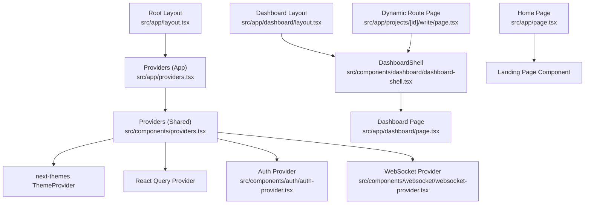
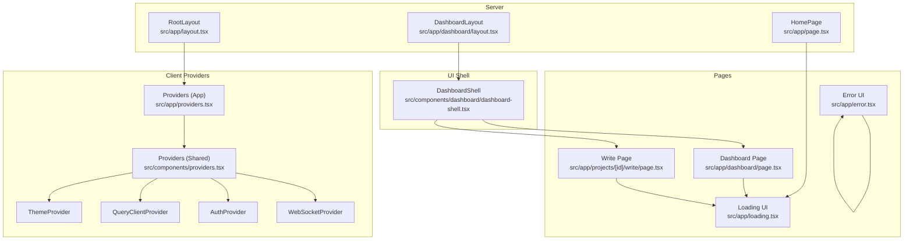
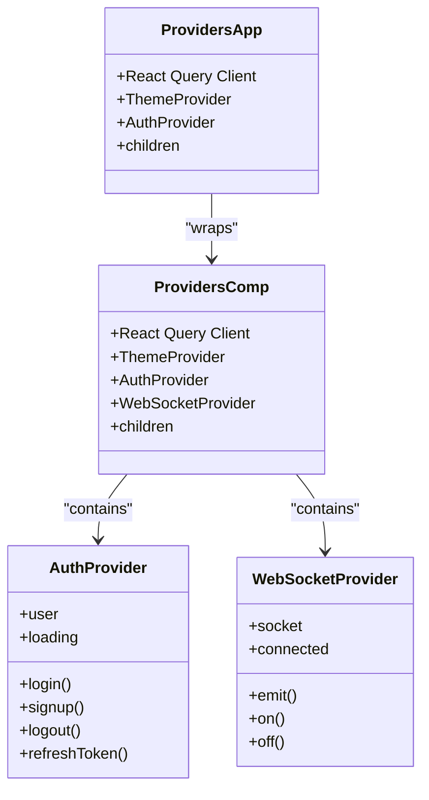
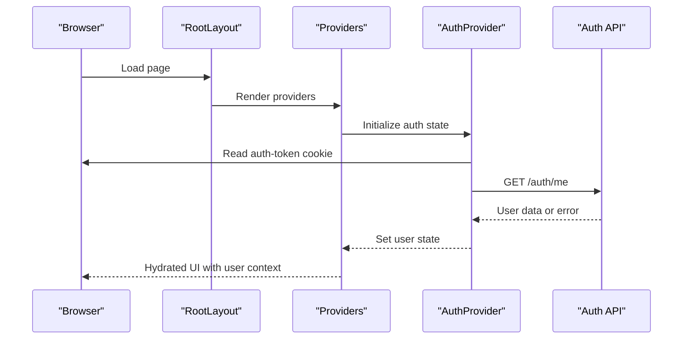
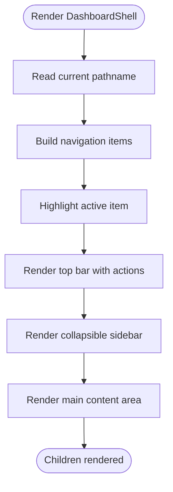
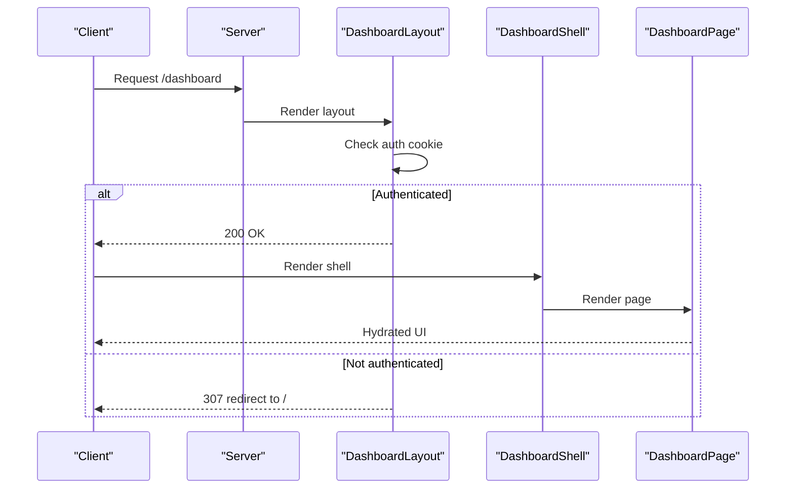
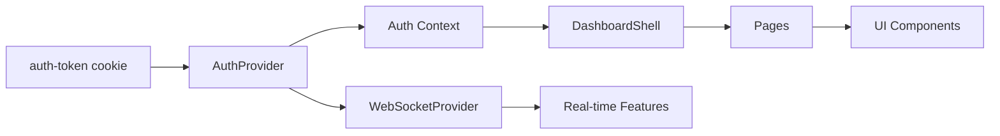
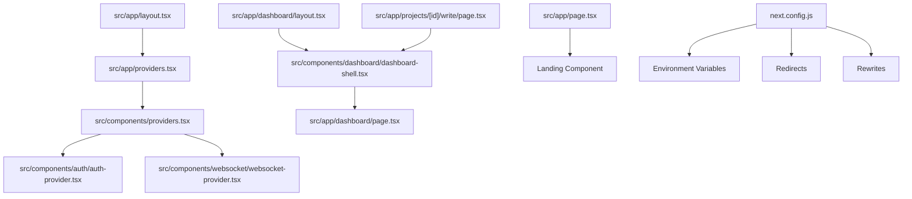

# Frontend Architecture

<cite>
**Referenced Files in This Document**
- [src/app/layout.tsx](file://src/app/layout.tsx)
- [src/app/providers.tsx](file://src/app/providers.tsx)
- [src/components/providers.tsx](file://src/components/providers.tsx)
- [src/components/dashboard/dashboard-shell.tsx](file://src/components/dashboard/dashboard-shell.tsx)
- [src/components/auth/auth-provider.tsx](file://src/components/auth/auth-provider.tsx)
- [src/contexts/auth-context.tsx](file://src/contexts/auth-context.tsx)
- [src/components/websocket/websocket-provider.tsx](file://src/components/websocket/websocket-provider.tsx)
- [src/app/dashboard/layout.tsx](file://src/app/dashboard/layout.tsx)
- [src/app/page.tsx](file://src/app/page.tsx)
- [src/app/loading.tsx](file://src/app/loading.tsx)
- [src/app/error.tsx](file://src/app/error.tsx)
- [src/app/dashboard/page.tsx](file://src/app/dashboard/page.tsx)
- [src/app/projects/[id]/write/page.tsx](file://src/app/projects/[id]/write/page.tsx)
- [src/lib/api/auth.ts](file://src/lib/api/auth.ts)
- [next.config.js](file://next.config.js)
</cite>

## Table of Contents
1. [Introduction](#introduction)
2. [Project Structure](#project-structure)
3. [Core Components](#core-components)
4. [Architecture Overview](#architecture-overview)
5. [Detailed Component Analysis](#detailed-component-analysis)
6. [Dependency Analysis](#dependency-analysis)
7. [Performance Considerations](#performance-considerations)
8. [Troubleshooting Guide](#troubleshooting-guide)
9. [Conclusion](#conclusion)

## Introduction
This document explains the frontend architecture of a Next.js 14 App Router application. It focuses on the component hierarchy starting from the root layout, the Providers wrapper, and the DashboardShell component. It documents React 18 concurrent features, hydration strategy, and client-side rendering patterns. It also details the provider pattern for authentication, state management, theming, and websockets, along with practical examples of component composition, avoiding prop drilling, and performance optimization. Finally, it covers the SSR/CSR hybrid approach, static generation, dynamic routes, and how data flows through the component tree.

## Project Structure
The application follows the Next.js App Router convention with route segments mapped to pages and layouts. Key areas:
- Root layout and global providers at the top level
- Feature-specific layouts and pages under src/app
- Shared UI components and providers under src/components
- Authentication and websocket providers encapsulated in dedicated modules
- Utility APIs for authentication flows

**Diagram sources**
- [src/app/layout.tsx](file://src/app/layout.tsx#L1-L102)
- [src/app/providers.tsx](file://src/app/providers.tsx#L1-L37)
- [src/components/providers.tsx](file://src/components/providers.tsx#L1-L55)
- [src/components/dashboard/dashboard-shell.tsx](file://src/components/dashboard/dashboard-shell.tsx#L1-L224)
- [src/components/auth/auth-provider.tsx](file://src/components/auth/auth-provider.tsx#L1-L165)
- [src/components/websocket/websocket-provider.tsx](file://src/components/websocket/websocket-provider.tsx#L1-L138)
- [src/app/dashboard/layout.tsx](file://src/app/dashboard/layout.tsx#L1-L23)
- [src/app/dashboard/page.tsx](file://src/app/dashboard/page.tsx#L1-L260)
- [src/app/page.tsx](file://src/app/page.tsx#L1-L17)
- [src/app/projects/[id]/write/page.tsx](file://src/app/projects/[id]/write/page.tsx#L1-L626)

**Section sources**
- [src/app/layout.tsx](file://src/app/layout.tsx#L1-L102)
- [src/app/providers.tsx](file://src/app/providers.tsx#L1-L37)
- [src/components/providers.tsx](file://src/components/providers.tsx#L1-L55)

## Core Components
- RootLayout: Wraps the entire app with Providers and global styles. It sets up fonts, metadata, and suppresses hydration warnings where appropriate.
- Providers (App): Initializes React Query, theme provider, and composes nested providers for authentication and websockets.
- Providers (Shared): Alternative providers module with similar composition but includes WebSocketProvider.
- DashboardShell: A shell component that renders the main dashboard UI, navigation, and user menu, consuming auth state.
- AuthProvider: Manages user session, tokens, and authentication actions with cookie-based persistence and token refresh.
- WebSocketProvider: Provides a WebSocket connection scoped to the authenticated user with reconnection logic.
- DashboardLayout: Server-side guard for authenticated users using cookies and redirect behavior.
- HomePage: Redirects authenticated users to the dashboard; otherwise renders the landing page.
- DashboardPage: Client component showcasing stats and project cards, using auth context.
- Dynamic Write Page: Rich client-side editor with toolbar, AI panel, autosave, and version history.
- Global loading and error boundaries: Skeleton loading and error UI for concurrent rendering and error handling.

**Section sources**
- [src/app/layout.tsx](file://src/app/layout.tsx#L83-L102)
- [src/app/providers.tsx](file://src/app/providers.tsx#L9-L37)
- [src/components/providers.tsx](file://src/components/providers.tsx#L10-L55)
- [src/components/dashboard/dashboard-shell.tsx](file://src/components/dashboard/dashboard-shell.tsx#L49-L224)
- [src/components/auth/auth-provider.tsx](file://src/components/auth/auth-provider.tsx#L20-L165)
- [src/components/websocket/websocket-provider.tsx](file://src/components/websocket/websocket-provider.tsx#L17-L138)
- [src/app/dashboard/layout.tsx](file://src/app/dashboard/layout.tsx#L5-L23)
- [src/app/page.tsx](file://src/app/page.tsx#L5-L17)
- [src/app/dashboard/page.tsx](file://src/app/dashboard/page.tsx#L53-L260)
- [src/app/projects/[id]/write/page.tsx](file://src/app/projects/[id]/write/page.tsx#L100-L626)
- [src/app/loading.tsx](file://src/app/loading.tsx#L3-L39)
- [src/app/error.tsx](file://src/app/error.tsx#L13-L65)

## Architecture Overview
The architecture centers around a single root layout that injects a layered provider stack. The Providers component configures React Query caching, theme switching, and composes AuthProvider and WebSocketProvider. DashboardLayout enforces authentication via server-side checks, while DashboardShell provides the UI shell and navigation. Pages consume context and render UI, with dynamic routes enabling per-project editing experiences.

**Diagram sources**
- [src/app/layout.tsx](file://src/app/layout.tsx#L83-L102)
- [src/app/providers.tsx](file://src/app/providers.tsx#L9-L37)
- [src/components/providers.tsx](file://src/components/providers.tsx#L10-L55)
- [src/components/dashboard/dashboard-shell.tsx](file://src/components/dashboard/dashboard-shell.tsx#L49-L224)
- [src/app/dashboard/layout.tsx](file://src/app/dashboard/layout.tsx#L5-L23)
- [src/app/dashboard/page.tsx](file://src/app/dashboard/page.tsx#L53-L260)
- [src/app/projects/[id]/write/page.tsx](file://src/app/projects/[id]/write/page.tsx#L100-L626)
- [src/app/loading.tsx](file://src/app/loading.tsx#L3-L39)
- [src/app/error.tsx](file://src/app/error.tsx#L13-L65)

## Detailed Component Analysis

### Provider Pattern and Composition
The provider stack is composed in two layers:
- App-level Providers initializes React Query with cache policies and devtools, sets up theme provider, and wraps children.
- Shared Providers composes AuthProvider and WebSocketProvider inside ThemeProvider and QueryClientProvider.

Key behaviors:
- React Query defaults include a stale time and retry policies tailored to 4xx semantics.
- ThemeProvider switches themes by class and disables transition on change for smoothness.
- AuthProvider manages cookies, token refresh intervals, and exposes login/signup/logout/refresh actions.
- WebSocketProvider connects/disconnects based on auth state, with exponential backoff and auth error handling.

**Diagram sources**
- [src/app/providers.tsx](file://src/app/providers.tsx#L9-L37)
- [src/components/providers.tsx](file://src/components/providers.tsx#L10-L55)
- [src/components/auth/auth-provider.tsx](file://src/components/auth/auth-provider.tsx#L20-L165)
- [src/components/websocket/websocket-provider.tsx](file://src/components/websocket/websocket-provider.tsx#L17-L138)

**Section sources**
- [src/app/providers.tsx](file://src/app/providers.tsx#L9-L37)
- [src/components/providers.tsx](file://src/components/providers.tsx#L10-L55)
- [src/components/auth/auth-provider.tsx](file://src/components/auth/auth-provider.tsx#L20-L165)
- [src/components/websocket/websocket-provider.tsx](file://src/components/websocket/websocket-provider.tsx#L17-L138)

### Authentication Flow and Hydration Strategy
Authentication relies on cookies stored on the server and consumed client-side. The AuthProvider hydrates on mount by reading the cookie and calling a backend endpoint to validate and fetch user data. It sets a periodic refresh interval and handles logout by clearing cookies and routing.

**Diagram sources**
- [src/app/layout.tsx](file://src/app/layout.tsx#L83-L102)
- [src/app/providers.tsx](file://src/app/providers.tsx#L9-L37)
- [src/components/auth/auth-provider.tsx](file://src/components/auth/auth-provider.tsx#L20-L165)
- [src/lib/api/auth.ts](file://src/lib/api/auth.ts#L52-L55)

**Section sources**
- [src/components/auth/auth-provider.tsx](file://src/components/auth/auth-provider.tsx#L20-L165)
- [src/lib/api/auth.ts](file://src/lib/api/auth.ts#L25-L55)

### DashboardShell and Navigation
DashboardShell centralizes navigation, responsive sidebar behavior, user menu, and top bar actions. It reads the current pathname to highlight active links and consumes auth context for user display and logout.

**Diagram sources**
- [src/components/dashboard/dashboard-shell.tsx](file://src/components/dashboard/dashboard-shell.tsx#L49-L224)

**Section sources**
- [src/components/dashboard/dashboard-shell.tsx](file://src/components/dashboard/dashboard-shell.tsx#L49-L224)

### SSR/CSR Hybrid, Static Generation, and Dynamic Routes
- Server-rendered guards: DashboardLayout and HomePage check cookies server-side and redirect accordingly.
- Client-rendered pages: Dashboard page and write page are marked client components and render UI with context.
- Dynamic routes: The projects write route uses [id] to derive project context and supports per-chapter editing.
- Loading UI: A global loading skeleton improves perceived performance during navigation.
- Error boundary: A client error page provides recovery controls and development diagnostics.

**Diagram sources**
- [src/app/dashboard/layout.tsx](file://src/app/dashboard/layout.tsx#L5-L23)
- [src/app/dashboard/page.tsx](file://src/app/dashboard/page.tsx#L53-L260)
- [src/components/dashboard/dashboard-shell.tsx](file://src/components/dashboard/dashboard-shell.tsx#L49-L224)

**Section sources**
- [src/app/dashboard/layout.tsx](file://src/app/dashboard/layout.tsx#L5-L23)
- [src/app/page.tsx](file://src/app/page.tsx#L5-L17)
- [src/app/loading.tsx](file://src/app/loading.tsx#L3-L39)
- [src/app/error.tsx](file://src/app/error.tsx#L13-L65)

### Data Flow Through the Component Tree
- Authentication data flows from cookies to AuthProvider to downstream components via context.
- UI shell receives navigation and user state from DashboardShell and passes children for page rendering.
- Pages consume context and local state to render content; dynamic pages derive parameters from route segments.
- WebSocketProvider supplies socket connectivity to authenticated users, enabling real-time features.

**Diagram sources**
- [src/components/auth/auth-provider.tsx](file://src/components/auth/auth-provider.tsx#L20-L165)
- [src/components/dashboard/dashboard-shell.tsx](file://src/components/dashboard/dashboard-shell.tsx#L49-L224)
- [src/components/websocket/websocket-provider.tsx](file://src/components/websocket/websocket-provider.tsx#L17-L138)

**Section sources**
- [src/components/auth/auth-provider.tsx](file://src/components/auth/auth-provider.tsx#L20-L165)
- [src/components/dashboard/dashboard-shell.tsx](file://src/components/dashboard/dashboard-shell.tsx#L49-L224)
- [src/components/websocket/websocket-provider.tsx](file://src/components/websocket/websocket-provider.tsx#L17-L138)

## Dependency Analysis
- Root layout depends on Providers and global styles.
- Providers depend on external libraries (React Query, next-themes) and internal providers (Auth, WebSocket).
- DashboardShell depends on UI components and auth context.
- Pages depend on context and route parameters.
- Next.js configuration defines environment variables, redirects, rewrites, and image optimization.

**Diagram sources**
- [src/app/layout.tsx](file://src/app/layout.tsx#L1-L102)
- [src/app/providers.tsx](file://src/app/providers.tsx#L1-L37)
- [src/components/providers.tsx](file://src/components/providers.tsx#L1-L55)
- [src/components/auth/auth-provider.tsx](file://src/components/auth/auth-provider.tsx#L1-L165)
- [src/components/websocket/websocket-provider.tsx](file://src/components/websocket/websocket-provider.tsx#L1-L138)
- [src/app/dashboard/layout.tsx](file://src/app/dashboard/layout.tsx#L1-L23)
- [src/app/dashboard/page.tsx](file://src/app/dashboard/page.tsx#L1-L260)
- [src/app/page.tsx](file://src/app/page.tsx#L1-L17)
- [src/app/projects/[id]/write/page.tsx](file://src/app/projects/[id]/write/page.tsx#L1-L626)
- [next.config.js](file://next.config.js#L1-L56)

**Section sources**
- [next.config.js](file://next.config.js#L24-L51)

## Performance Considerations
- Concurrent features: Use of Suspense boundaries and streaming SSR is supported by the App Router. Prefer skeleton loaders and progressive enhancement.
- Hydration: Suppress hydration warnings only where necessary; ensure server and client markup match.
- Caching: React Query default staleTime reduces redundant requests; tune per-query options for sensitive data.
- Rendering: Keep heavy computations client-side; memoize derived values; avoid unnecessary re-renders.
- Images: Configure remote patterns to leverage optimized image serving.
- Routing: Use dynamic routes for per-project contexts; keep route groups minimal to reduce bundle size.
- Devtools: React Query devtools are conditionally enabled to aid debugging without impacting production.

[No sources needed since this section provides general guidance]

## Troubleshooting Guide
- Authentication errors: Verify cookie presence and validity; check token refresh intervals and error logs.
- WebSocket disconnections: Inspect connection events and reconnection attempts; ensure auth errors are handled.
- Error boundaries: Use the error page to capture and log errors; provide reset and navigation controls.
- Redirect loops: Confirm cookie presence and redirects configuration; ensure server-side guards behave as expected.

**Section sources**
- [src/components/auth/auth-provider.tsx](file://src/components/auth/auth-provider.tsx#L115-L141)
- [src/components/websocket/websocket-provider.tsx](file://src/components/websocket/websocket-provider.tsx#L50-L93)
- [src/app/error.tsx](file://src/app/error.tsx#L13-L65)
- [next.config.js](file://next.config.js#L28-L42)

## Conclusion
The frontend architecture leverages Next.js 14’s App Router to deliver a structured, provider-driven UI with strong SSR/CSR integration. The RootLayout and Providers stack establish a robust foundation for theme, state, and auth. DashboardShell encapsulates navigation and shell UI, while pages consume context and route parameters to render dynamic content. The provider pattern avoids prop drilling, and the combination of React Query, theme switching, and WebSocket connections delivers a responsive, real-time experience.