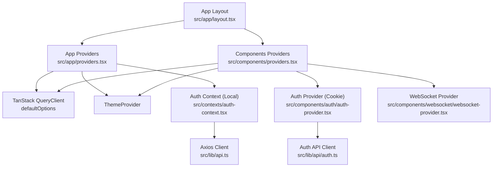
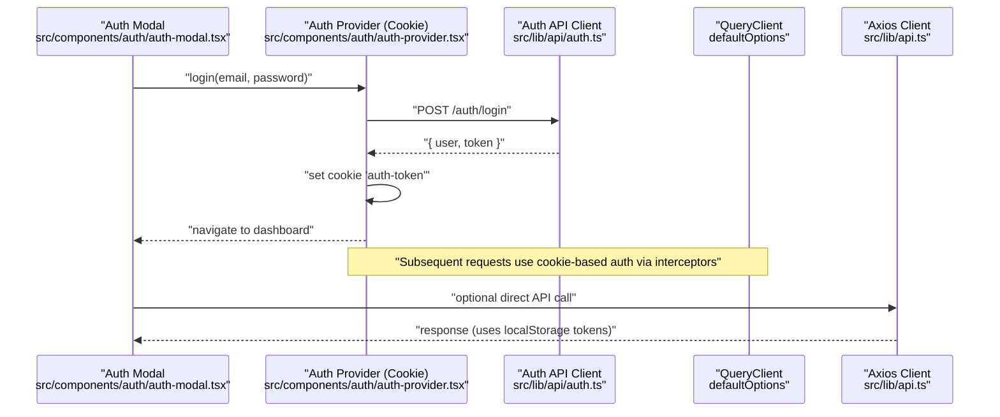
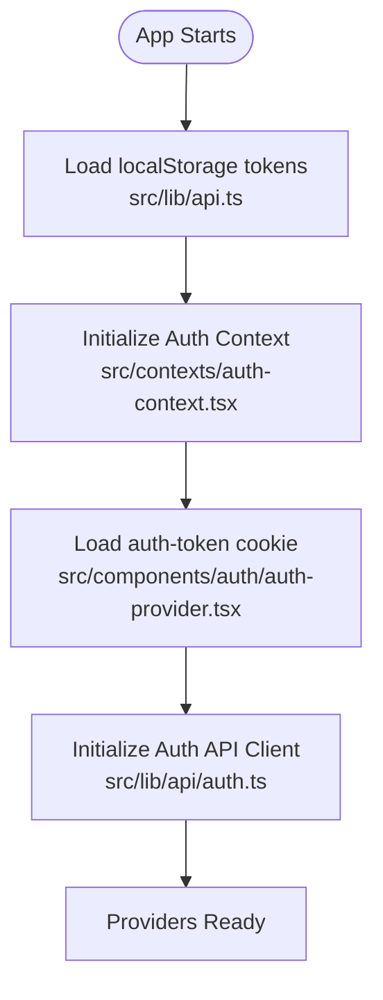
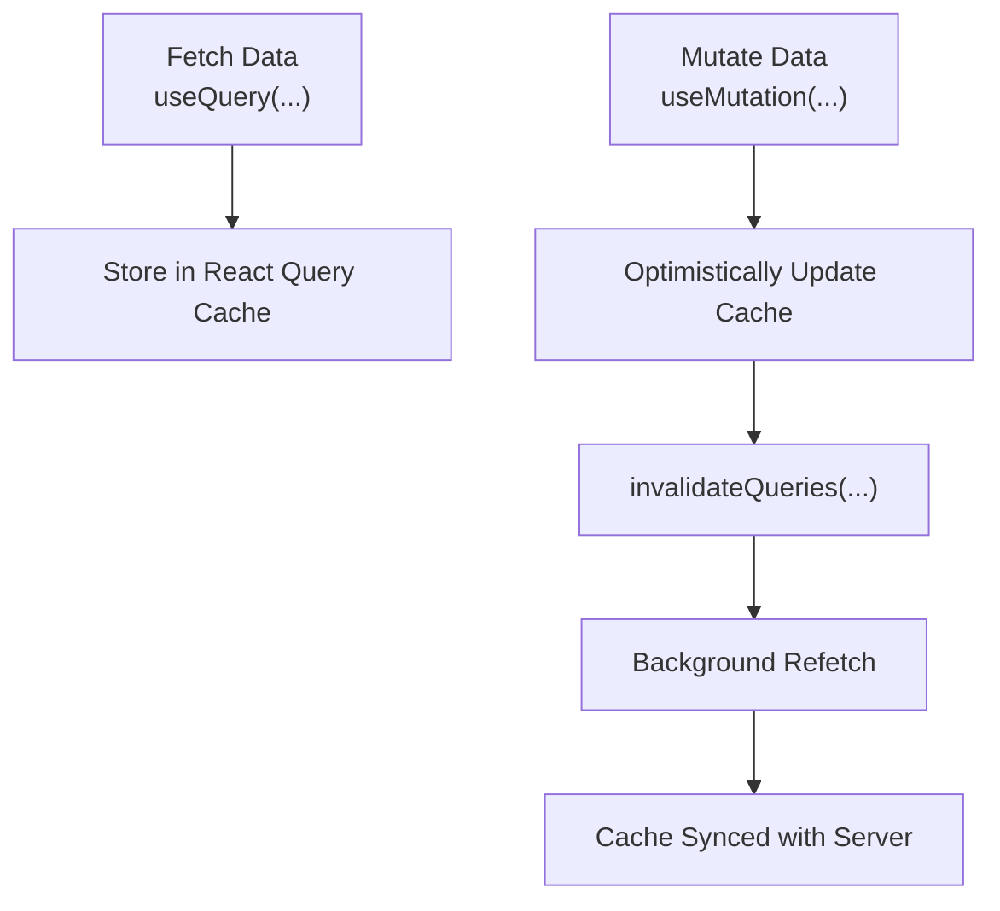
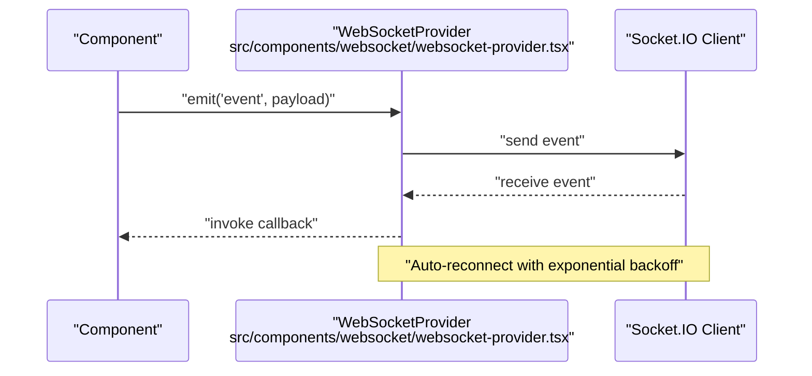
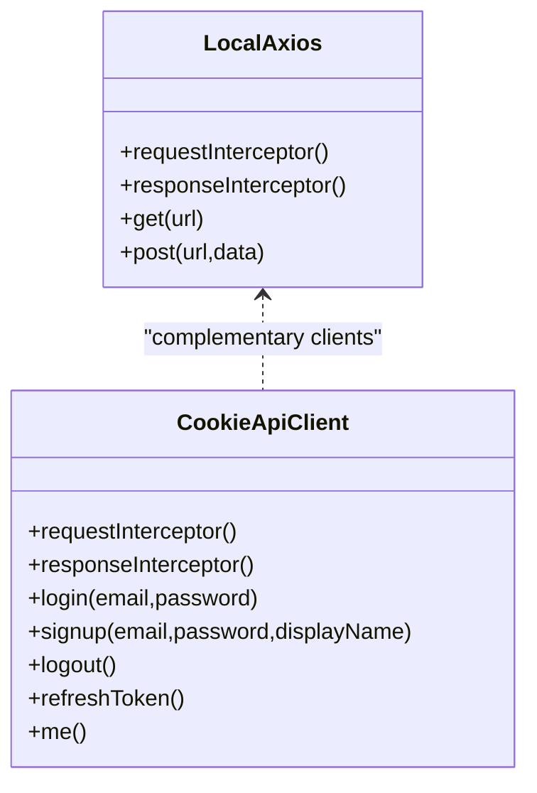
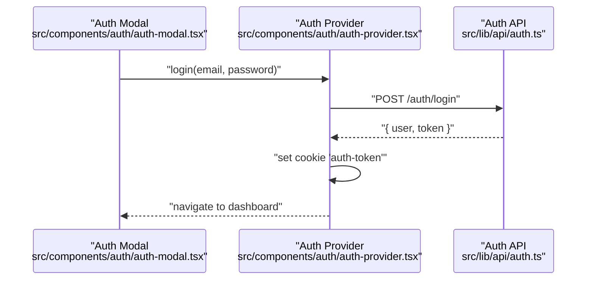
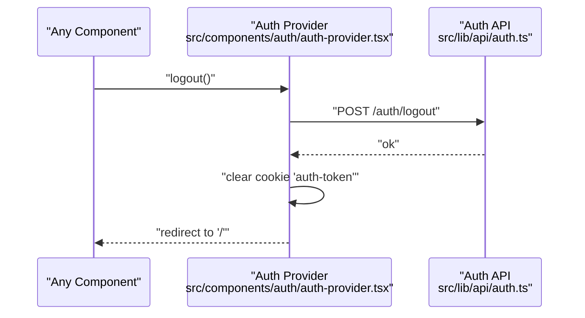
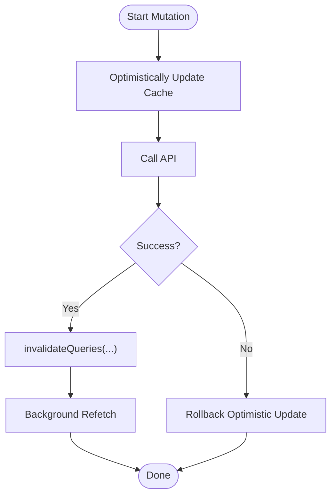
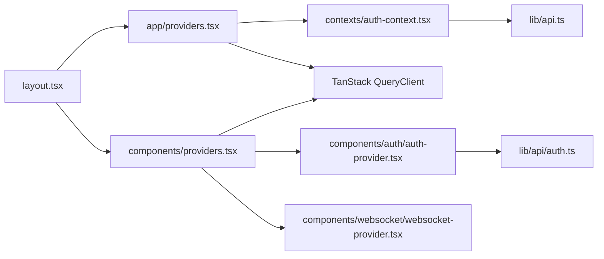

# State Management Architecture

<cite>
**Referenced Files in This Document**
- [src/app/layout.tsx](file://src/app/layout.tsx)
- [src/app/providers.tsx](file://src/app/providers.tsx)
- [src/components/providers.tsx](file://src/components/providers.tsx)
- [src/contexts/auth-context.tsx](file://src/contexts/auth-context.tsx)
- [src/components/auth/auth-provider.tsx](file://src/components/auth/auth-provider.tsx)
- [src/lib/api.ts](file://src/lib/api.ts)
- [src/lib/api/auth.ts](file://src/lib/api/auth.ts)
- [src/lib/api/client.ts](file://src/lib/api/client.ts)
- [src/components/websocket/websocket-provider.tsx](file://src/components/websocket/websocket-provider.tsx)
- [src/components/auth/auth-modal.tsx](file://src/components/auth/auth-modal.tsx)
</cite>

## Table of Contents
1. [Introduction](#introduction)
2. [Project Structure](#project-structure)
3. [Core Components](#core-components)
4. [Architecture Overview](#architecture-overview)
5. [Detailed Component Analysis](#detailed-component-analysis)
6. [Dependency Analysis](#dependency-analysis)
7. [Performance Considerations](#performance-considerations)
8. [Troubleshooting Guide](#troubleshooting-guide)
9. [Conclusion](#conclusion)

## Introduction
This document explains the state management architecture of the application, focusing on a dual-layer approach that combines React Context for local UI/application state and TanStack Query for server state caching. It also documents how authentication state flows from the Auth Context to global providers, and how local component state is managed separately. Integration with TanStack Query is covered, including query invalidation, background refetching, and optimistic updates. The document details data synchronization patterns among local state, React Query cache, and API responses, and provides concrete examples of state updates, error handling, and performance optimization strategies. Finally, it addresses the separation of concerns between UI state, application state, and server state management.

## Project Structure
The state management stack is organized around a layered provider hierarchy:
- Application shell wraps the UI with providers that supply global state and infrastructure.
- Authentication state is provided via two distinct Contexts, each suited to different parts of the app.
- TanStack Query provides server state caching and synchronization.
- Optional WebSocket provider extends real-time capabilities.

**Diagram sources**
- [src/app/layout.tsx](file://src/app/layout.tsx#L1-L102)
- [src/app/providers.tsx](file://src/app/providers.tsx#L1-L37)
- [src/components/providers.tsx](file://src/components/providers.tsx#L1-L55)
- [src/contexts/auth-context.tsx](file://src/contexts/auth-context.tsx#L1-L154)
- [src/components/auth/auth-provider.tsx](file://src/components/auth/auth-provider.tsx#L1-L165)
- [src/lib/api.ts](file://src/lib/api.ts#L1-L67)
- [src/lib/api/auth.ts](file://src/lib/api/auth.ts#L1-L101)
- [src/components/websocket/websocket-provider.tsx](file://src/components/websocket/websocket-provider.tsx#L1-L138)

**Section sources**
- [src/app/layout.tsx](file://src/app/layout.tsx#L1-L102)
- [src/app/providers.tsx](file://src/app/providers.tsx#L1-L37)
- [src/components/providers.tsx](file://src/components/providers.tsx#L1-L55)

## Core Components
- Auth Context (local): Manages user session using localStorage and an Axios interceptor for token refresh. Provides login, signup, logout, refresh, and user update actions.
- Auth Provider (cookie-based): Manages user session using cookies and a dedicated API client with interceptors for token refresh and error handling.
- TanStack Query: Centralized server state caching with configurable stale times, retry policies, and devtools.
- WebSocket Provider: Real-time connectivity with automatic reconnection and authentication handshake.
- API Clients: Two complementary clients—one for general Axios usage with localStorage tokens, another for typed API calls with cookie-based auth.

Key responsibilities:
- UI state: Component-local state (e.g., form inputs, visibility toggles) remains separate from application state.
- Application state: Authentication state and UI flags are kept in Contexts/providers.
- Server state: TanStack Query manages remote data, caching, and synchronization.

**Section sources**
- [src/contexts/auth-context.tsx](file://src/contexts/auth-context.tsx#L1-L154)
- [src/components/auth/auth-provider.tsx](file://src/components/auth/auth-provider.tsx#L1-L165)
- [src/lib/api.ts](file://src/lib/api.ts#L1-L67)
- [src/lib/api/auth.ts](file://src/lib/api/auth.ts#L1-L101)
- [src/components/websocket/websocket-provider.tsx](file://src/components/websocket/websocket-provider.tsx#L1-L138)
- [src/app/providers.tsx](file://src/app/providers.tsx#L1-L37)
- [src/components/providers.tsx](file://src/components/providers.tsx#L1-L55)

## Architecture Overview
The dual-layer state architecture separates concerns:
- React Context layer: Handles local UI/application state and authentication lifecycle.
- TanStack Query layer: Handles server state caching, invalidation, and refetching.

**Diagram sources**
- [src/components/auth/auth-modal.tsx](file://src/components/auth/auth-modal.tsx#L1-L212)
- [src/components/auth/auth-provider.tsx](file://src/components/auth/auth-provider.tsx#L1-L165)
- [src/lib/api/auth.ts](file://src/lib/api/auth.ts#L1-L101)
- [src/lib/api.ts](file://src/lib/api.ts#L1-L67)
- [src/app/providers.tsx](file://src/app/providers.tsx#L1-L37)

## Detailed Component Analysis

### Authentication State Flow: From Context to Global Providers
- Local Context (localStorage):
  - Initializes from localStorage, sets Authorization header automatically, and refreshes tokens via interceptors.
  - Provides login/signup/logout and refresh mechanisms.
- Cookie-based Context (Auth Provider):
  - Initializes from a cookie, sets and refreshes cookie tokens, and handles logout by clearing the cookie.
  - Integrates with a typed API client for auth operations.

**Diagram sources**
- [src/lib/api.ts](file://src/lib/api.ts#L1-L67)
- [src/contexts/auth-context.tsx](file://src/contexts/auth-context.tsx#L1-L154)
- [src/components/auth/auth-provider.tsx](file://src/components/auth/auth-provider.tsx#L1-L165)
- [src/lib/api/auth.ts](file://src/lib/api/auth.ts#L1-L101)

**Section sources**
- [src/contexts/auth-context.tsx](file://src/contexts/auth-context.tsx#L1-L154)
- [src/components/auth/auth-provider.tsx](file://src/components/auth/auth-provider.tsx#L1-L165)
- [src/lib/api.ts](file://src/lib/api.ts#L1-L67)
- [src/lib/api/auth.ts](file://src/lib/api/auth.ts#L1-L101)

### TanStack Query Integration: Caching, Invalidation, and Refetching
- QueryClient defaults:
  - Queries: short stale time and controlled refetch behavior.
  - Mutations: tailored retry policies to avoid retrying on client errors.
- Typical usage pattern:
  - Use queries to fetch server data.
  - Invalidate queries after mutations to trigger background refetch.
  - Rely on background refetch to keep cache fresh without blocking UI.

**Diagram sources**
- [src/app/providers.tsx](file://src/app/providers.tsx#L10-L20)
- [src/components/providers.tsx](file://src/components/providers.tsx#L11-L36)

**Section sources**
- [src/app/providers.tsx](file://src/app/providers.tsx#L1-L37)
- [src/components/providers.tsx](file://src/components/providers.tsx#L1-L55)

### WebSocket Provider: Real-Time Synchronization
- Establishes a WebSocket connection using the current auth token.
- Implements exponential backoff reconnection with a cap.
- Emits and listens to events while respecting connection state.

**Diagram sources**
- [src/components/websocket/websocket-provider.tsx](file://src/components/websocket/websocket-provider.tsx#L1-L138)

**Section sources**
- [src/components/websocket/websocket-provider.tsx](file://src/components/websocket/websocket-provider.tsx#L1-L138)

### API Clients: Local vs Cookie-Based Auth
- Axios client (localStorage tokens):
  - Adds Authorization header from localStorage.
  - Handles 401 refresh via interceptors and redirects on failure.
- Typed API client (cookie tokens):
  - Adds Authorization header from cookie.
  - Provides a clean surface for auth operations with typed responses.
  - Handles 401 refresh and transforms errors consistently.

**Diagram sources**
- [src/lib/api.ts](file://src/lib/api.ts#L1-L67)
- [src/lib/api/auth.ts](file://src/lib/api/auth.ts#L1-L101)
- [src/lib/api/client.ts](file://src/lib/api/client.ts#L1-L138)

**Section sources**
- [src/lib/api.ts](file://src/lib/api.ts#L1-L67)
- [src/lib/api/auth.ts](file://src/lib/api/auth.ts#L1-L101)
- [src/lib/api/client.ts](file://src/lib/api/client.ts#L1-L138)

### Example Workflows

#### Login Flow (Cookie-based Auth)
- Component triggers login with email and password.
- Auth provider calls the typed API client to authenticate.
- On success, sets the auth cookie and navigates to the dashboard.
- Subsequent requests automatically include the Authorization header via interceptors.

**Diagram sources**
- [src/components/auth/auth-modal.tsx](file://src/components/auth/auth-modal.tsx#L1-L212)
- [src/components/auth/auth-provider.tsx](file://src/components/auth/auth-provider.tsx#L1-L165)
- [src/lib/api/auth.ts](file://src/lib/api/auth.ts#L1-L101)

#### Logout Flow (Cookie-based Auth)
- Calls the typed API client to log out on the server.
- Clears the auth cookie and resets local state.
- Redirects to the home route.

**Diagram sources**
- [src/components/auth/auth-provider.tsx](file://src/components/auth/auth-provider.tsx#L1-L165)
- [src/lib/api/auth.ts](file://src/lib/api/auth.ts#L1-L101)

#### Optimistic Update Pattern with Query Invalidation
- Perform mutation with useMutation.
- Optimistically update the cache.
- Invalidate related queries to trigger background refetch.
- Handle errors by rolling back the optimistic update.

**Diagram sources**
- [src/app/providers.tsx](file://src/app/providers.tsx#L10-L20)
- [src/components/providers.tsx](file://src/components/providers.tsx#L11-L36)

## Dependency Analysis
- Provider hierarchy:
  - App-level providers wrap the entire app and include theme and query providers.
  - Component-level providers offer a richer stack including WebSocket support.
- Authentication:
  - Cookie-based provider depends on the typed auth API client.
  - Local provider depends on the Axios client with interceptors.
- TanStack Query:
  - Both provider stacks configure default query and mutation options.

**Diagram sources**
- [src/app/layout.tsx](file://src/app/layout.tsx#L1-L102)
- [src/app/providers.tsx](file://src/app/providers.tsx#L1-L37)
- [src/components/providers.tsx](file://src/components/providers.tsx#L1-L55)
- [src/contexts/auth-context.tsx](file://src/contexts/auth-context.tsx#L1-L154)
- [src/components/auth/auth-provider.tsx](file://src/components/auth/auth-provider.tsx#L1-L165)
- [src/lib/api.ts](file://src/lib/api.ts#L1-L67)
- [src/lib/api/auth.ts](file://src/lib/api/auth.ts#L1-L101)
- [src/components/websocket/websocket-provider.tsx](file://src/components/websocket/websocket-provider.tsx#L1-L138)

**Section sources**
- [src/app/layout.tsx](file://src/app/layout.tsx#L1-L102)
- [src/app/providers.tsx](file://src/app/providers.tsx#L1-L37)
- [src/components/providers.tsx](file://src/components/providers.tsx#L1-L55)

## Performance Considerations
- Query caching:
  - Short stale time reduces perceived latency for frequently accessed data.
  - Controlled refetch behavior prevents unnecessary network churn.
- Retry policies:
  - Avoid retries on client errors (4xx) to prevent wasted attempts.
  - Limit retries for server errors to reduce load and improve UX.
- Token refresh:
  - Centralized interceptors handle transparent refresh, minimizing component-level complexity.
- WebSocket reconnection:
  - Exponential backoff with a cap prevents resource exhaustion and improves resilience.

[No sources needed since this section provides general guidance]

## Troubleshooting Guide
- Authentication issues:
  - If login appears successful but subsequent requests fail, verify that the correct token storage mechanism is used (localStorage vs cookie) and that interceptors are configured.
- Token refresh failures:
  - Inspect interceptors for proper handling of 401 responses and redirection logic.
- WebSocket disconnections:
  - Check reconnection attempts and ensure the auth token is present in the cookie for the handshake.
- Query invalidation:
  - Confirm that invalidation targets the correct query keys and that background refetch is triggered.

**Section sources**
- [src/lib/api.ts](file://src/lib/api.ts#L1-L67)
- [src/components/websocket/websocket-provider.tsx](file://src/components/websocket/websocket-provider.tsx#L1-L138)
- [src/app/providers.tsx](file://src/app/providers.tsx#L1-L37)
- [src/components/providers.tsx](file://src/components/providers.tsx#L1-L55)

## Conclusion
The state management architecture cleanly separates UI state, application state, and server state:
- React Contexts manage local and application-level state with distinct token strategies.
- TanStack Query centralizes server state caching, invalidation, and refetching.
- API clients encapsulate authentication and error handling for both token strategies.
- Optional WebSocket integration enables real-time synchronization with robust reconnection logic.

This separation ensures maintainability, predictable data flow, and scalable performance across the application.