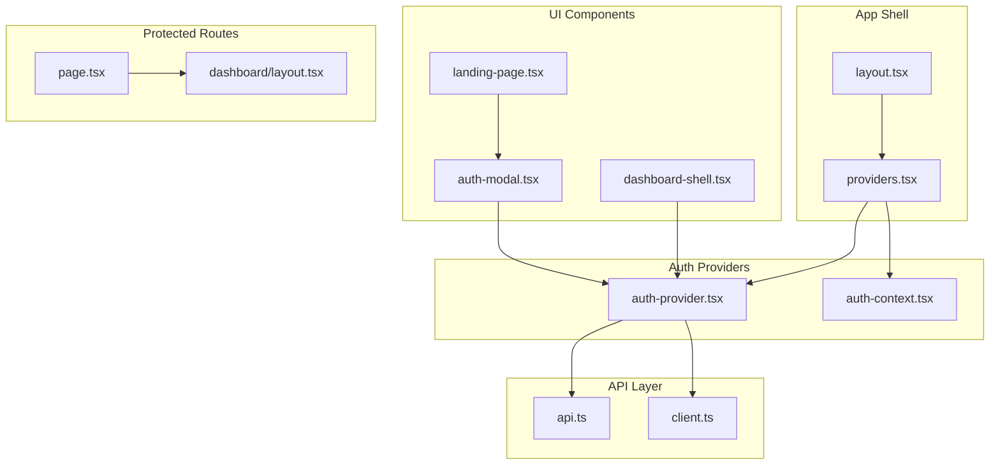
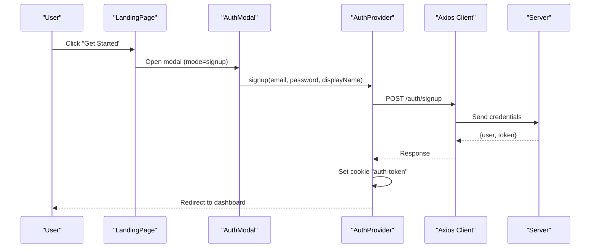
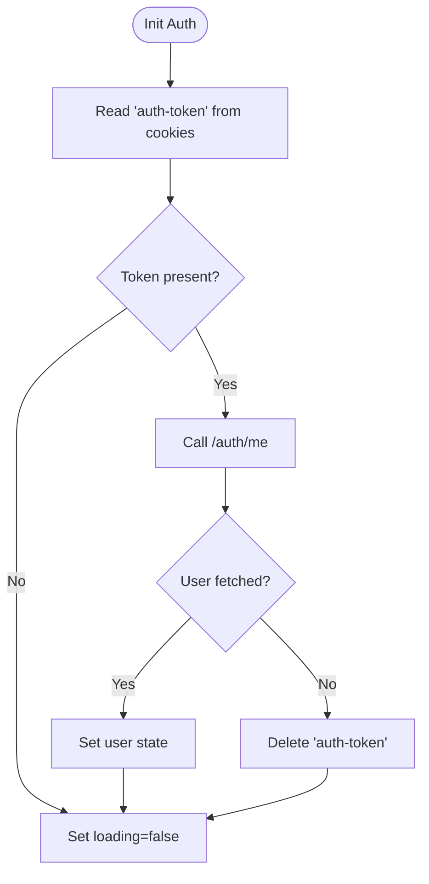
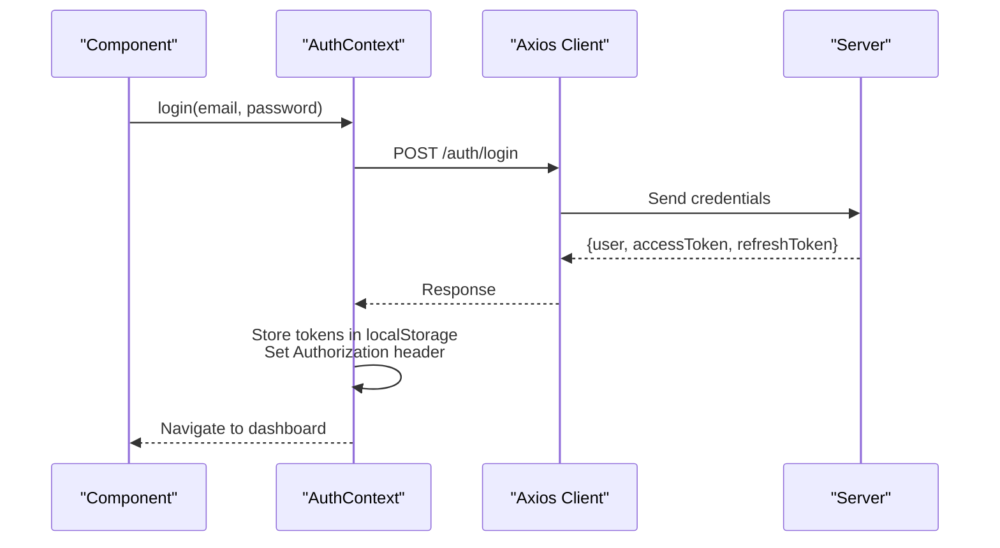
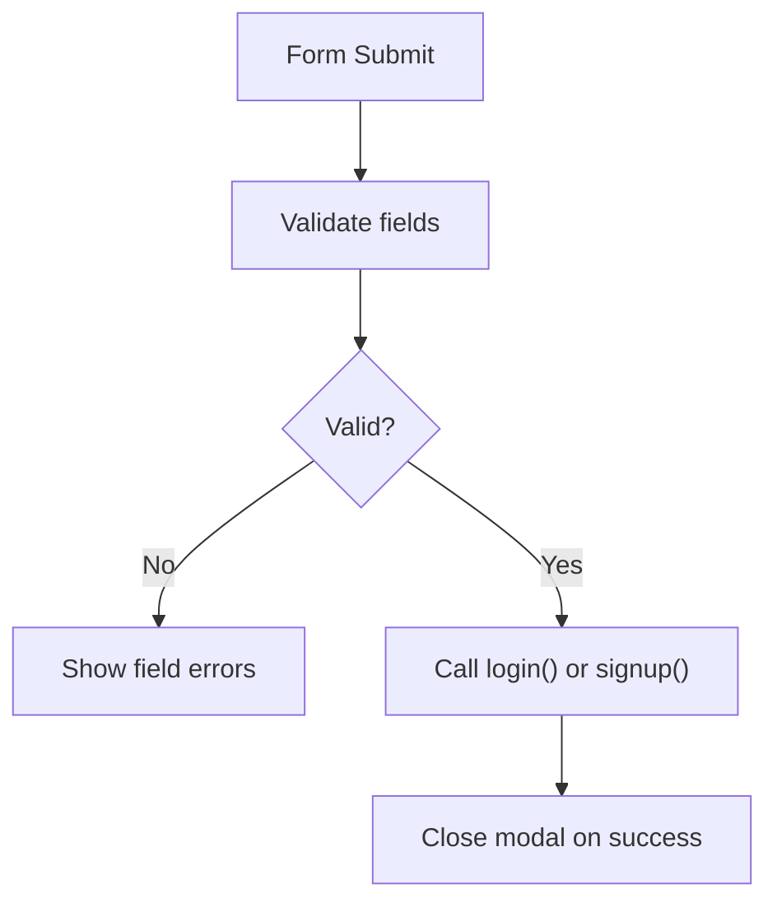
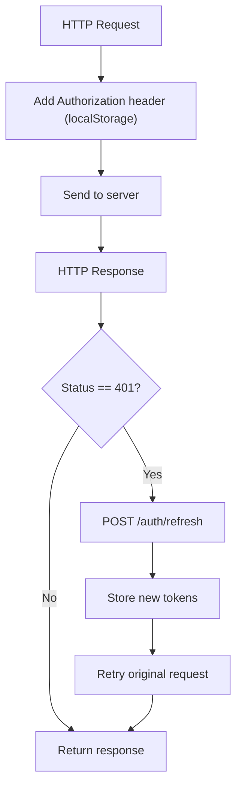
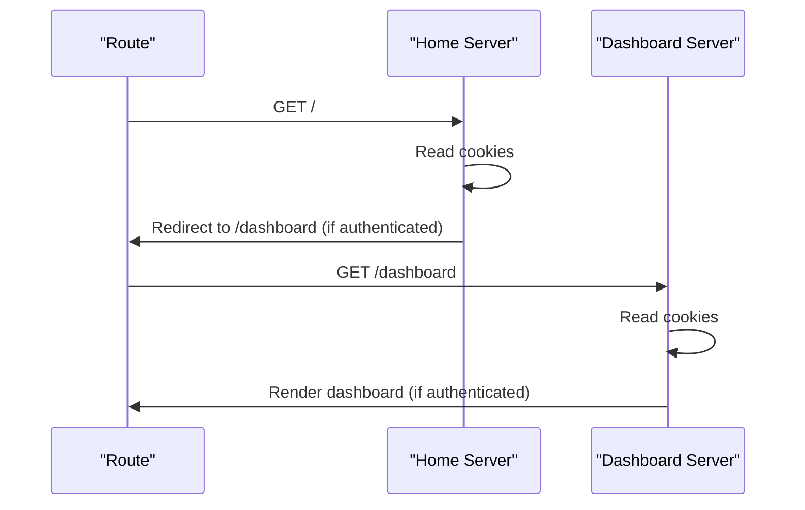
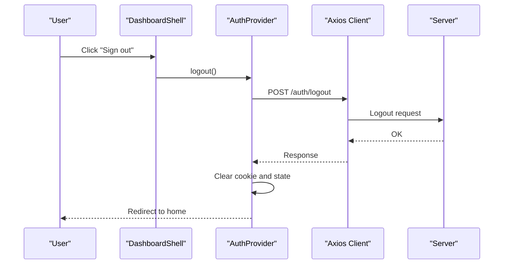
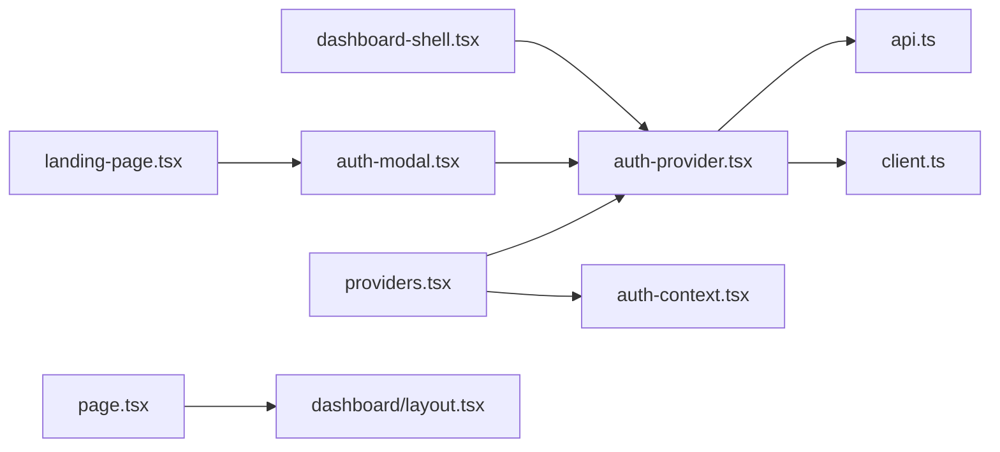

# Authentication & User Management

<cite>
**Referenced Files in This Document**
- [auth-context.tsx](file://src/contexts/auth-context.tsx)
- [auth-provider.tsx](file://src/components/auth/auth-provider.tsx)
- [auth-modal.tsx](file://src/components/auth/auth-modal.tsx)
- [api.ts](file://src/lib/api.ts)
- [client.ts](file://src/lib/api/client.ts)
- [providers.tsx](file://src/app/providers.tsx)
- [layout.tsx](file://src/app/layout.tsx)
- [dashboard/layout.tsx](file://src/app/dashboard/layout.tsx)
- [page.tsx](file://src/app/page.tsx)
- [landing-page.tsx](file://src/components/landing/landing-page.tsx)
- [dashboard-shell.tsx](file://src/components/dashboard/dashboard-shell.tsx)
</cite>

## Table of Contents
1. [Introduction](#introduction)
2. [Project Structure](#project-structure)
3. [Core Components](#core-components)
4. [Architecture Overview](#architecture-overview)
5. [Detailed Component Analysis](#detailed-component-analysis)
6. [Dependency Analysis](#dependency-analysis)
7. [Performance Considerations](#performance-considerations)
8. [Security Considerations](#security-considerations)
9. [Troubleshooting Guide](#troubleshooting-guide)
10. [Conclusion](#conclusion)

## Introduction
This document explains the authentication and user management system for the Next.js application. It covers user registration, login, session management, and protected routes. It also documents the React Context pattern used for centralized state management, the authentication provider architecture, modal components, and token handling strategies. Practical examples illustrate login/signup flows, token refresh mechanisms, and logout procedures. Security considerations such as token storage, CSRF protection, and session validation are addressed, along with common issues and solutions.

## Project Structure
The authentication system spans several layers:
- Application shell and providers orchestrate global state and UI wrappers.
- Authentication providers encapsulate login, signup, logout, and token refresh logic.
- API clients manage HTTP requests, interceptors, and automatic token refresh.
- UI components render modals and integrate with the auth provider.
- Protected routes enforce authentication at the server-side.

**Diagram sources**
- [layout.tsx](file://src/app/layout.tsx#L1-L102)
- [providers.tsx](file://src/app/providers.tsx#L1-L37)
- [auth-provider.tsx](file://src/components/auth/auth-provider.tsx#L1-L165)
- [auth-context.tsx](file://src/contexts/auth-context.tsx#L1-L154)
- [auth-modal.tsx](file://src/components/auth/auth-modal.tsx#L1-L212)
- [landing-page.tsx](file://src/components/landing/landing-page.tsx#L1-L434)
- [dashboard-shell.tsx](file://src/components/dashboard/dashboard-shell.tsx#L1-L224)
- [api.ts](file://src/lib/api.ts#L1-L67)
- [client.ts](file://src/lib/api/client.ts#L1-L138)
- [page.tsx](file://src/app/page.tsx#L1-L17)
- [dashboard/layout.tsx](file://src/app/dashboard/layout.tsx#L1-L23)

**Section sources**
- [layout.tsx](file://src/app/layout.tsx#L1-L102)
- [providers.tsx](file://src/app/providers.tsx#L1-L37)

## Core Components
- Auth Provider (cookie-based): Manages user state, login/signup/logout, and periodic token refresh via cookies.
- Auth Context (localStorage-based): Provides similar capabilities using localStorage and Axios interceptors for token refresh.
- Auth Modal: A reusable form component supporting login and signup modes with validation and submission.
- API Clients: Axios-based clients with request/response interceptors for automatic token refresh and error handling.
- Protected Routes: Server-side checks using cookies to redirect unauthenticated users.

Key responsibilities:
- Centralized authentication state via React Context.
- Seamless token refresh on 401 responses.
- Persistent session via cookies or local storage depending on provider.
- UI-driven authentication via modal.

**Section sources**
- [auth-provider.tsx](file://src/components/auth/auth-provider.tsx#L1-L165)
- [auth-context.tsx](file://src/contexts/auth-context.tsx#L1-L154)
- [auth-modal.tsx](file://src/components/auth/auth-modal.tsx#L1-L212)
- [api.ts](file://src/lib/api.ts#L1-L67)
- [client.ts](file://src/lib/api/client.ts#L1-L138)
- [dashboard/layout.tsx](file://src/app/dashboard/layout.tsx#L1-L23)
- [page.tsx](file://src/app/page.tsx#L1-L17)

## Architecture Overview
The system uses two complementary authentication approaches:
- Cookie-based provider for server-rendered pages and SSR-friendly flows.
- LocalStorage-based provider for client-side SPA-like behavior with Axios interceptors.

**Diagram sources**
- [landing-page.tsx](file://src/components/landing/landing-page.tsx#L127-L434)
- [auth-modal.tsx](file://src/components/auth/auth-modal.tsx#L17-L72)
- [auth-provider.tsx](file://src/components/auth/auth-provider.tsx#L91-L113)
- [api.ts](file://src/lib/api.ts#L1-L67)

## Detailed Component Analysis

### Auth Provider (Cookie-Based)
Implements:
- Initialization by reading a cookie and fetching user info.
- Login/signup that sets a secure cookie and redirects to dashboard.
- Logout that clears the cookie and navigates home.
- Periodic token refresh via a background interval.

**Diagram sources**
- [auth-provider.tsx](file://src/components/auth/auth-provider.tsx#L26-L49)

**Section sources**
- [auth-provider.tsx](file://src/components/auth/auth-provider.tsx#L1-L165)

### Auth Context (LocalStorage-Based)
Implements:
- Initialization by reading localStorage tokens and validating via /auth/me.
- Login/signup storing access and refresh tokens in localStorage and setting Authorization header.
- Logout clearing tokens and removing Authorization header.
- Automatic token refresh via Axios interceptors on 401 responses.

**Diagram sources**
- [auth-context.tsx](file://src/contexts/auth-context.tsx#L57-L91)
- [api.ts](file://src/lib/api.ts#L39-L53)

**Section sources**
- [auth-context.tsx](file://src/contexts/auth-context.tsx#L1-L154)
- [api.ts](file://src/lib/api.ts#L1-L67)

### Auth Modal
Implements:
- Dual-mode form (login/signup) with client-side validation.
- Submission delegates to AuthProvider/AuthContext methods.
- Loading states and error messaging.

**Diagram sources**
- [auth-modal.tsx](file://src/components/auth/auth-modal.tsx#L27-L72)

**Section sources**
- [auth-modal.tsx](file://src/components/auth/auth-modal.tsx#L1-L212)

### API Clients and Interceptors
- Axios client with request interceptor attaching Authorization header from localStorage.
- Response interceptor handles 401 by refreshing the token and retrying the original request.
- Alternative ApiClient class demonstrates a cookie-based interceptor and centralized error handling.

**Diagram sources**
- [api.ts](file://src/lib/api.ts#L10-L65)
- [client.ts](file://src/lib/api/client.ts#L18-L81)

**Section sources**
- [api.ts](file://src/lib/api.ts#L1-L67)
- [client.ts](file://src/lib/api/client.ts#L1-L138)

### Protected Routes
- Home page checks for presence of auth cookie and redirects authenticated users to dashboard.
- Dashboard layout enforces authentication by checking the cookie and redirecting unauthenticated users.

**Diagram sources**
- [page.tsx](file://src/app/page.tsx#L5-L16)
- [dashboard/layout.tsx](file://src/app/dashboard/layout.tsx#L10-L16)

**Section sources**
- [page.tsx](file://src/app/page.tsx#L1-L17)
- [dashboard/layout.tsx](file://src/app/dashboard/layout.tsx#L1-L23)

### Logout Flow
- Cookie-based provider removes the auth cookie and navigates to home.
- LocalStorage-based provider calls backend logout endpoint, clears tokens, and removes Authorization header.

**Diagram sources**
- [dashboard-shell.tsx](file://src/components/dashboard/dashboard-shell.tsx#L53-L61)
- [auth-provider.tsx](file://src/components/auth/auth-provider.tsx#L115-L131)

**Section sources**
- [dashboard-shell.tsx](file://src/components/dashboard/dashboard-shell.tsx#L1-L224)
- [auth-provider.tsx](file://src/components/auth/auth-provider.tsx#L115-L131)
- [auth-context.tsx](file://src/contexts/auth-context.tsx#L93-L106)

## Dependency Analysis
- Providers wrap the app and inject both QueryClient and AuthProvider/AuthContext.
- Auth components depend on the chosen provider (AuthProvider or AuthContext).
- API clients depend on environment variables for base URLs and interceptors.
- Protected routes depend on cookies for authentication checks.

**Diagram sources**
- [providers.tsx](file://src/app/providers.tsx#L9-L31)
- [auth-provider.tsx](file://src/components/auth/auth-provider.tsx#L1-L165)
- [auth-context.tsx](file://src/contexts/auth-context.tsx#L1-L154)
- [auth-modal.tsx](file://src/components/auth/auth-modal.tsx#L1-L212)
- [landing-page.tsx](file://src/components/landing/landing-page.tsx#L1-L434)
- [dashboard-shell.tsx](file://src/components/dashboard/dashboard-shell.tsx#L1-L224)
- [api.ts](file://src/lib/api.ts#L1-L67)
- [client.ts](file://src/lib/api/client.ts#L1-L138)
- [page.tsx](file://src/app/page.tsx#L1-L17)
- [dashboard/layout.tsx](file://src/app/dashboard/layout.tsx#L1-L23)

**Section sources**
- [providers.tsx](file://src/app/providers.tsx#L1-L37)
- [auth-provider.tsx](file://src/components/auth/auth-provider.tsx#L1-L165)
- [auth-context.tsx](file://src/contexts/auth-context.tsx#L1-L154)
- [api.ts](file://src/lib/api.ts#L1-L67)
- [client.ts](file://src/lib/api/client.ts#L1-L138)

## Performance Considerations
- Token auto-refresh intervals: The cookie-based provider refreshes tokens periodically. Adjust the interval to balance freshness and network usage.
- Axios interceptors: Centralized token refresh reduces duplication but can add overhead on frequent requests. Consider batching or debouncing.
- Hydration warnings: Ensure cookie-based initialization avoids mismatches between server and client rendering.
- Toast notifications: Keep messages concise to avoid UI thrashing during rapid failures.

[No sources needed since this section provides general guidance]

## Security Considerations
- Token storage:
  - Cookie-based provider stores tokens in cookies with secure flags and SameSite policies. This mitigates XSS risks compared to localStorage.
  - LocalStorage-based provider stores tokens locally; ensure CSP and XSS protections are in place.
- CSRF protection:
  - Cookies are marked with SameSite strict. Combine with CSRF tokens on forms if applicable.
  - Avoid sending sensitive data via GET parameters; use POST for mutations.
- Session validation:
  - Server-side protected routes check for the presence of the auth cookie and redirect unauthenticated users.
  - Axios interceptors automatically refresh tokens on 401 responses, maintaining session continuity.
- Token refresh:
  - Both providers implement refresh logic. Ensure refresh endpoints rotate tokens and invalidate stale ones.
- Environment variables:
  - API base URLs should be configured via environment variables to prevent exposure in client bundles.

**Section sources**
- [auth-provider.tsx](file://src/components/auth/auth-provider.tsx#L72-L72)
- [auth-provider.tsx](file://src/components/auth/auth-provider.tsx#L136-L136)
- [api.ts](file://src/lib/api.ts#L39-L42)
- [page.tsx](file://src/app/page.tsx#L11-L11)
- [dashboard/layout.tsx](file://src/app/dashboard/layout.tsx#L14-L16)

## Troubleshooting Guide
Common issues and resolutions:
- Login fails with generic error:
  - Verify API base URL environment variable is set.
  - Check that the backend responds with structured error messages.
- 401 Unauthorized after token expiration:
  - Confirm interceptors are attached and refresh endpoint is reachable.
  - Ensure refresh tokens are present in storage and not expired.
- Stuck on loading spinner during auth:
  - Inspect console for initialization errors and cookie parsing logic.
  - Validate that the user fetch endpoint returns expected data.
- Logout does not redirect:
  - Ensure the logout action clears cookies/localStorage and resets Authorization headers.
  - Confirm navigation occurs after cleanup completes.
- Protected route not redirecting:
  - Verify cookie presence and server-side checks.
  - Check for mixed content or incorrect cookie domain/path.

**Section sources**
- [api.ts](file://src/lib/api.ts#L24-L65)
- [auth-context.tsx](file://src/contexts/auth-context.tsx#L39-L55)
- [auth-provider.tsx](file://src/components/auth/auth-provider.tsx#L115-L131)
- [page.tsx](file://src/app/page.tsx#L11-L11)
- [dashboard/layout.tsx](file://src/app/dashboard/layout.tsx#L14-L16)

## Conclusion
The authentication system combines a cookie-based provider for SSR-friendly flows and a localStorage-based provider for SPA-like experiences. React Context centralizes state, while Axios interceptors automate token refresh on 401 responses. Protected routes enforce authentication server-side. The Auth Modal provides a consistent UI for login/signup. Security is strengthened by cookie-based token storage with secure attributes and server-side route guards. Following the troubleshooting steps and best practices ensures reliable, secure, and maintainable authentication.