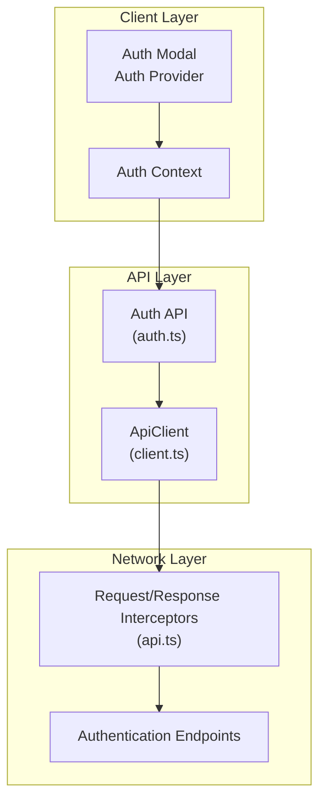
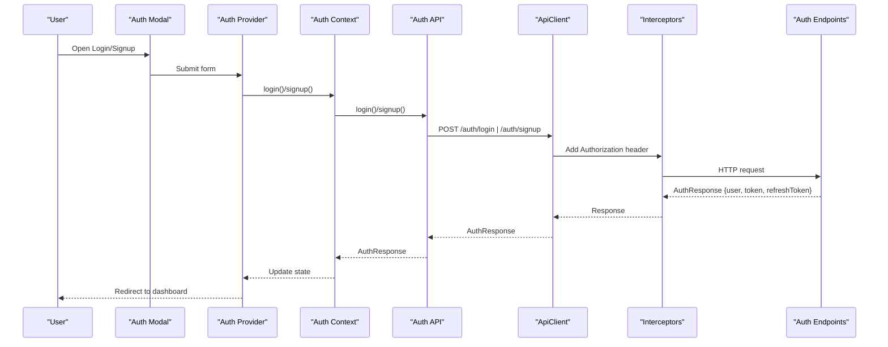
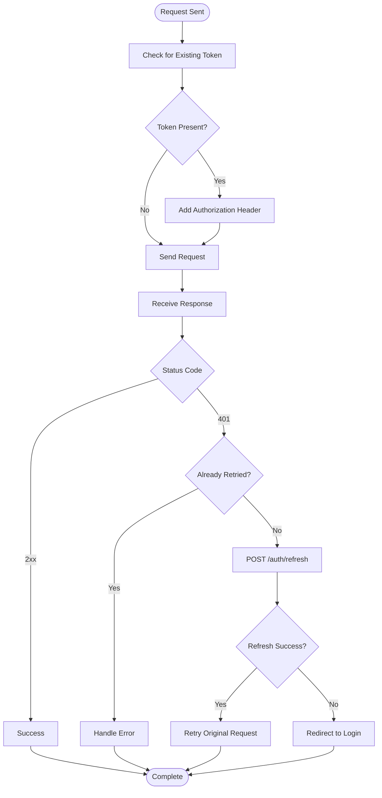
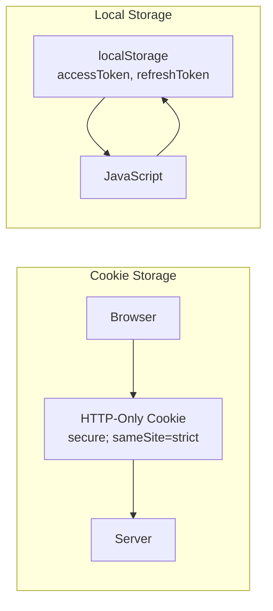
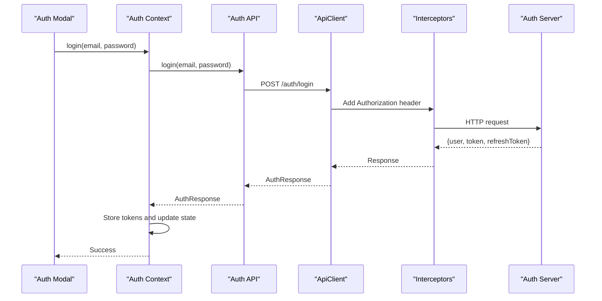
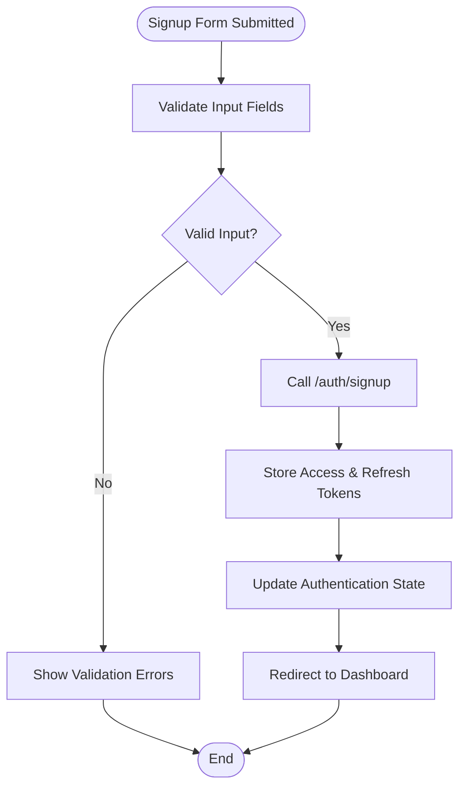
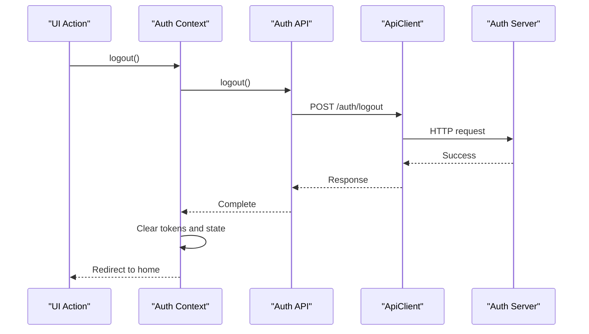
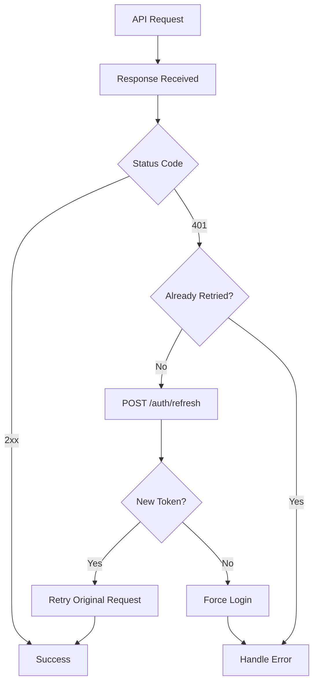
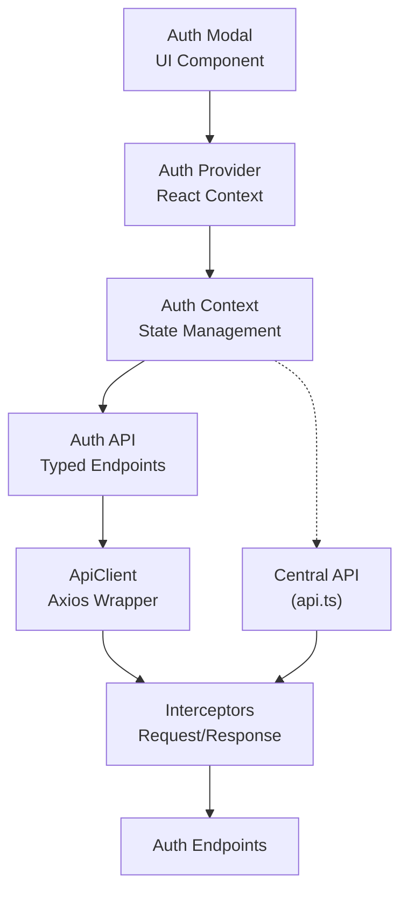

# Authentication API Client

<cite>
**Referenced Files in This Document**
- [api.ts](file://src/lib/api.ts)
- [auth-context.tsx](file://src/contexts/auth-context.tsx)
- [auth-provider.tsx](file://src/components/auth/auth-provider.tsx)
- [auth-modal.tsx](file://src/components/auth/auth-modal.tsx)
- [auth.ts](file://src/lib/api/auth.ts)
- [client.ts](file://src/lib/api/client.ts)
</cite>

## Table of Contents
1. [Introduction](#introduction)
2. [Project Structure](#project-structure)
3. [Core Components](#core-components)
4. [Architecture Overview](#architecture-overview)
5. [Detailed Component Analysis](#detailed-component-analysis)
6. [Dependency Analysis](#dependency-analysis)
7. [Performance Considerations](#performance-considerations)
8. [Troubleshooting Guide](#troubleshooting-guide)
9. [Conclusion](#conclusion)

## Introduction
This document provides comprehensive API documentation for the authentication client focused on user registration, login, and session management. It covers HTTP methods, URL patterns, request/response schemas, authentication headers, and error handling strategies. It also documents authentication interceptors, token storage mechanisms, and security considerations such as HTTPS enforcement, CSRF protection, and token validation. Practical examples of API calls and client implementation guidelines are included for integration.

## Project Structure
The authentication client is implemented across several modules:
- Centralized API client with interceptors for token injection and automatic refresh
- React context providing login, signup, logout, and refresh capabilities
- Dedicated auth API module exposing typed endpoints for authentication operations
- UI components for authentication modal and form validation

**Diagram sources**
- [auth-modal.tsx](file://src/components/auth/auth-modal.tsx#L1-L212)
- [auth-provider.tsx](file://src/components/auth/auth-provider.tsx#L1-L165)
- [auth-context.tsx](file://src/contexts/auth-context.tsx#L1-L154)
- [auth.ts](file://src/lib/api/auth.ts#L1-L101)
- [client.ts](file://src/lib/api/client.ts#L1-L138)
- [api.ts](file://src/lib/api.ts#L1-L67)

**Section sources**
- [api.ts](file://src/lib/api.ts#L1-L67)
- [auth-context.tsx](file://src/contexts/auth-context.tsx#L1-L154)
- [auth-provider.tsx](file://src/components/auth/auth-provider.tsx#L1-L165)
- [auth-modal.tsx](file://src/components/auth/auth-modal.tsx#L1-L212)
- [auth.ts](file://src/lib/api/auth.ts#L1-L101)
- [client.ts](file://src/lib/api/client.ts#L1-L138)

## Core Components
- Central API client with request/response interceptors for token management and automatic refresh
- Auth API module with typed endpoints for login, signup, logout, refresh, and profile operations
- React context providing authentication state and actions
- UI modal component for login/signup forms with validation

Key responsibilities:
- Token storage and retrieval via cookies or local storage depending on the implementation
- Automatic token refresh on 401 responses
- Consistent error handling with structured error objects
- Form validation and user feedback

**Section sources**
- [api.ts](file://src/lib/api.ts#L1-L67)
- [auth.ts](file://src/lib/api/auth.ts#L1-L101)
- [auth-context.tsx](file://src/contexts/auth-context.tsx#L1-L154)
- [auth-provider.tsx](file://src/components/auth/auth-provider.tsx#L1-L165)
- [auth-modal.tsx](file://src/components/auth/auth-modal.tsx#L1-L212)

## Architecture Overview
The authentication flow integrates UI components, context management, and API clients with interceptors for seamless token handling.

**Diagram sources**
- [auth-modal.tsx](file://src/components/auth/auth-modal.tsx#L54-L72)
- [auth-provider.tsx](file://src/components/auth/auth-provider.tsx#L67-L89)
- [auth-context.tsx](file://src/contexts/auth-context.tsx#L57-L91)
- [auth.ts](file://src/lib/api/auth.ts#L25-L55)
- [client.ts](file://src/lib/api/client.ts#L18-L81)

## Detailed Component Analysis

### Authentication Endpoints
The authentication client exposes the following endpoints with their HTTP methods and URL patterns:

- POST /auth/login
  - Purpose: Authenticate user with email and password
  - Request body: { email, password }
  - Response: { user, token, refreshToken }
  - Headers: Content-Type: application/json
  - Security: Requires HTTPS; tokens stored in cookie with secure and sameSite attributes

- POST /auth/signup
  - Purpose: Register a new user
  - Request body: { email, password, displayName }
  - Response: { user, token, refreshToken }
  - Headers: Content-Type: application/json
  - Security: Requires HTTPS; tokens stored in cookie with secure and sameSite attributes

- POST /auth/logout
  - Purpose: Terminate current session
  - Request body: none
  - Response: none
  - Headers: Authorization: Bearer {token}
  - Security: Clears cookie on server and client

- POST /auth/refresh
  - Purpose: Renew access token using refresh token
  - Request body: { refreshToken }
  - Response: { token }
  - Headers: Content-Type: application/json
  - Security: Requires HTTPS; refresh token validated server-side

- GET /auth/me
  - Purpose: Fetch current user profile
  - Request body: none
  - Response: { user }
  - Headers: Authorization: Bearer {token}
  - Security: Protected by bearer token

Example request/response schemas:
- Login/Signup request: { email: string, password: string, displayName?: string }
- Login/Signup response: { user: User, token: string, refreshToken: string }
- Refresh response: { token: string }
- Profile response: { user: User }

Authentication headers:
- Authorization: Bearer {token} (added automatically by interceptors)
- Content-Type: application/json (explicitly set)

Error response codes:
- 400 Bad Request: Validation errors, invalid input
- 401 Unauthorized: Invalid or expired token, missing authorization
- 403 Forbidden: Insufficient permissions
- 404 Not Found: Resource does not exist
- 429 Too Many Requests: Rate limiting
- 500 Internal Server Error: Server-side failures

**Section sources**
- [auth.ts](file://src/lib/api/auth.ts#L25-L55)
- [auth-context.tsx](file://src/contexts/auth-context.tsx#L57-L125)
- [auth-provider.tsx](file://src/components/auth/auth-provider.tsx#L67-L141)

### Authentication Interceptors
The API client implements two interceptors for robust token management:

Request interceptor:
- Extracts token from cookie (auth-client implementation) or local storage (central API implementation)
- Adds Authorization header with Bearer token to outgoing requests
- Handles browser vs server-side environments appropriately

Response interceptor:
- Catches 401 Unauthorized responses
- Attempts automatic token refresh using /auth/refresh
- Retries original request with new token
- Redirects to login on refresh failure
- Normalizes error responses into structured objects

**Diagram sources**
- [client.ts](file://src/lib/api/client.ts#L18-L81)
- [api.ts](file://src/lib/api.ts#L24-L65)

**Section sources**
- [client.ts](file://src/lib/api/client.ts#L18-L81)
- [api.ts](file://src/lib/api.ts#L10-L65)

### Token Storage Mechanisms
Two distinct token storage approaches are implemented:

Cookie-based storage (auth-client):
- Stores token in HTTP-only cookie with secure flag and sameSite=strict
- Automatically included with requests via cookie mechanism
- Provides CSRF protection and XSS mitigation
- Expires after 7 days

Local storage (central API):
- Stores access and refresh tokens in localStorage
- Used by the centralized API client for broader application needs
- Requires manual Authorization header injection
- No automatic CSRF protection

**Diagram sources**
- [auth-provider.tsx](file://src/components/auth/auth-provider.tsx#L72-L72)
- [auth-context.tsx](file://src/contexts/auth-context.tsx#L62-L63)

**Section sources**
- [auth-provider.tsx](file://src/components/auth/auth-provider.tsx#L30-L45)
- [auth-context.tsx](file://src/contexts/auth-context.tsx#L40-L54)

### Login Endpoint Implementation
The login flow handles email/password authentication with comprehensive error handling:

**Diagram sources**
- [auth-context.tsx](file://src/contexts/auth-context.tsx#L57-L73)
- [auth.ts](file://src/lib/api/auth.ts#L26-L32)
- [client.ts](file://src/lib/api/client.ts#L37-L81)

**Section sources**
- [auth-context.tsx](file://src/contexts/auth-context.tsx#L57-L73)
- [auth-modal.tsx](file://src/components/auth/auth-modal.tsx#L54-L72)

### Signup Endpoint Implementation
The signup flow manages user registration with validation and verification prompts:

**Diagram sources**
- [auth-modal.tsx](file://src/components/auth/auth-modal.tsx#L27-L52)
- [auth-context.tsx](file://src/contexts/auth-context.tsx#L75-L91)
- [auth.ts](file://src/lib/api/auth.ts#L34-L41)

**Section sources**
- [auth-context.tsx](file://src/contexts/auth-context.tsx#L75-L91)
- [auth-modal.tsx](file://src/components/auth/auth-modal.tsx#L27-L52)

### Logout Endpoint Implementation
The logout process terminates sessions on both client and server:

**Diagram sources**
- [auth-context.tsx](file://src/contexts/auth-context.tsx#L93-L106)
- [auth.ts](file://src/lib/api/auth.ts#L43-L45)

**Section sources**
- [auth-context.tsx](file://src/contexts/auth-context.tsx#L93-L106)
- [auth-provider.tsx](file://src/components/auth/auth-provider.tsx#L115-L131)

### Token Refresh Endpoint Implementation
Automatic token refresh prevents session expiration:

**Diagram sources**
- [client.ts](file://src/lib/api/client.ts#L44-L68)
- [api.ts](file://src/lib/api.ts#L30-L61)

**Section sources**
- [client.ts](file://src/lib/api/client.ts#L44-L68)
- [api.ts](file://src/lib/api.ts#L30-L61)

### Security Considerations
- HTTPS enforcement: All endpoints require HTTPS; base URLs should use https://
- CSRF protection: Cookies use SameSite=strict and Secure flags
- Token validation: Server validates refresh tokens and issues new tokens
- XSS mitigation: Cookie-based storage reduces XSS risks compared to localStorage
- Session termination: Logout clears tokens on both client and server
- Input validation: Frontend validation prevents malformed requests

**Section sources**
- [auth-provider.tsx](file://src/components/auth/auth-provider.tsx#L72-L72)
- [client.ts](file://src/lib/api/client.ts#L54-L54)
- [api.ts](file://src/lib/api.ts#L46-L47)

## Dependency Analysis
The authentication client follows a layered architecture with clear separation of concerns:

**Diagram sources**
- [auth-modal.tsx](file://src/components/auth/auth-modal.tsx#L1-L212)
- [auth-provider.tsx](file://src/components/auth/auth-provider.tsx#L1-L165)
- [auth-context.tsx](file://src/contexts/auth-context.tsx#L1-L154)
- [auth.ts](file://src/lib/api/auth.ts#L1-L101)
- [client.ts](file://src/lib/api/client.ts#L1-L138)
- [api.ts](file://src/lib/api.ts#L1-L67)

**Section sources**
- [auth-modal.tsx](file://src/components/auth/auth-modal.tsx#L1-L212)
- [auth-provider.tsx](file://src/components/auth/auth-provider.tsx#L1-L165)
- [auth-context.tsx](file://src/contexts/auth-context.tsx#L1-L154)
- [auth.ts](file://src/lib/api/auth.ts#L1-L101)
- [client.ts](file://src/lib/api/client.ts#L1-L138)
- [api.ts](file://src/lib/api.ts#L1-L67)

## Performance Considerations
- Timeout configuration: 30-second timeout for all requests
- Automatic retry: Single retry on 401 with token refresh
- Efficient token storage: Minimal DOM operations for cookie updates
- Lazy initialization: Auth state checks only on mount
- Background refresh: Periodic token refresh to prevent expiration

## Troubleshooting Guide
Common issues and resolutions:

Authentication failures:
- Verify HTTPS deployment for all endpoints
- Check browser console for CORS errors
- Ensure cookies are not blocked by privacy settings

Token-related issues:
- Confirm token storage method matches backend expectations
- Verify refresh token availability for automatic refresh
- Check token expiration and server clock synchronization

Network errors:
- Monitor request timeouts and retry logic
- Validate API base URL configuration
- Check rate limiting and quota limits

UI integration issues:
- Ensure proper context provider wrapping
- Verify form validation rules match backend requirements
- Check toast notifications for error messages

**Section sources**
- [client.ts](file://src/lib/api/client.ts#L40-L79)
- [auth-context.tsx](file://src/contexts/auth-context.tsx#L49-L51)
- [auth-provider.tsx](file://src/components/auth/auth-provider.tsx#L39-L45)

## Conclusion
The authentication client provides a robust, secure, and user-friendly authentication system with comprehensive error handling and automatic token management. The layered architecture ensures maintainability while the dual token storage mechanisms offer flexibility for different deployment scenarios. The implementation follows security best practices including HTTPS enforcement, CSRF protection, and proper token lifecycle management.