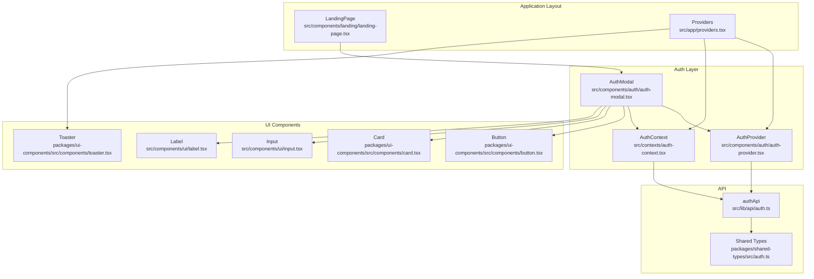
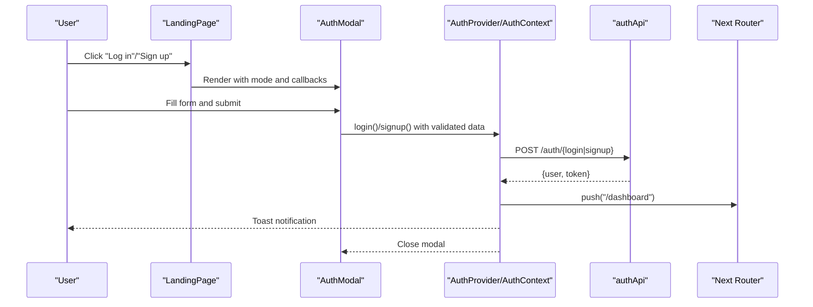
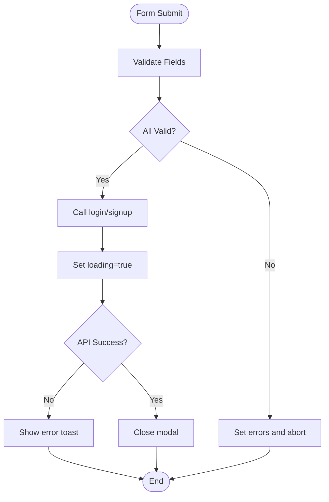
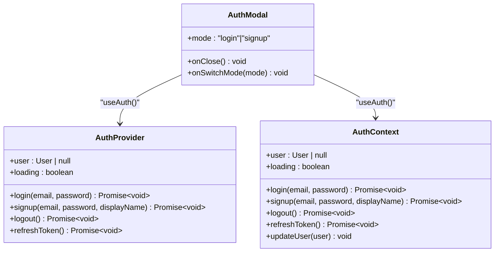
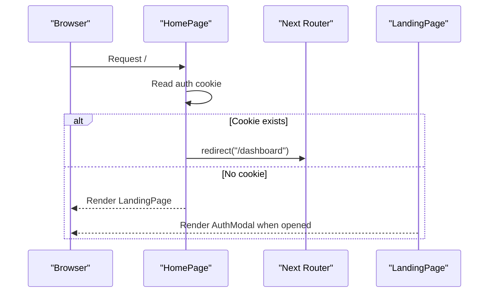
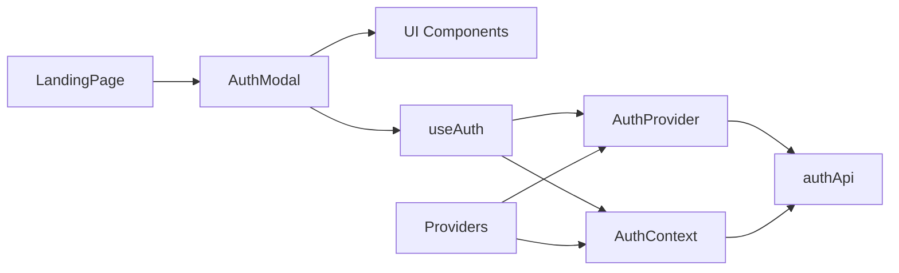

# Authentication Modal Component

<cite>
**Referenced Files in This Document**
- [auth-modal.tsx](file://src/components/auth/auth-modal.tsx)
- [auth-provider.tsx](file://src/components/auth/auth-provider.tsx)
- [auth-context.tsx](file://src/contexts/auth-context.tsx)
- [providers.tsx](file://src/app/providers.tsx)
- [landing-page.tsx](file://src/components/landing/landing-page.tsx)
- [page.tsx](file://src/app/page.tsx)
- [button.tsx](file://packages/ui-components/src/components/button.tsx)
- [card.tsx](file://packages/ui-components/src/components/card.tsx)
- [input.tsx](file://src/components/ui/input.tsx)
- [label.tsx](file://src/components/ui/label.tsx)
- [toaster.tsx](file://packages/ui-components/src/components/toaster.tsx)
- [auth.ts](file://src/lib/api/auth.ts)
- [auth.ts](file://packages/shared-types/src/auth.ts)
</cite>

## Table of Contents
1. [Introduction](#introduction)
2. [Project Structure](#project-structure)
3. [Core Components](#core-components)
4. [Architecture Overview](#architecture-overview)
5. [Detailed Component Analysis](#detailed-component-analysis)
6. [Dependency Analysis](#dependency-analysis)
7. [Performance Considerations](#performance-considerations)
8. [Troubleshooting Guide](#troubleshooting-guide)
9. [Conclusion](#conclusion)
10. [Appendices](#appendices)

## Introduction
This document describes the authentication modal component that provides a user-facing interface for login and signup. It covers visual appearance, form validation, user interaction patterns, props and state management, integration with the authentication provider, responsive design, accessibility features, keyboard navigation, error handling, and customization options. The modal is used within the main application layout and integrates with protected route handling.

## Project Structure
The authentication modal is part of the components layer and integrates with the application’s providers and UI components library. The modal is rendered conditionally in the landing page and controlled via state hooks.

**Diagram sources**
- [landing-page.tsx](file://src/components/landing/landing-page.tsx#L127-L434)
- [providers.tsx](file://src/app/providers.tsx#L9-L37)
- [auth-modal.tsx](file://src/components/auth/auth-modal.tsx#L17-L212)
- [auth-provider.tsx](file://src/components/auth/auth-provider.tsx#L20-L165)
- [auth-context.tsx](file://src/contexts/auth-context.tsx#L30-L154)
- [button.tsx](file://packages/ui-components/src/components/button.tsx#L41-L55)
- [card.tsx](file://packages/ui-components/src/components/card.tsx#L4-L78)
- [input.tsx](file://src/components/ui/input.tsx)
- [label.tsx](file://src/components/ui/label.tsx)
- [toaster.tsx](file://packages/ui-components/src/components/toaster.tsx)
- [auth.ts](file://src/lib/api/auth.ts#L25-L55)
- [auth.ts](file://packages/shared-types/src/auth.ts#L3-L19)

**Section sources**
- [landing-page.tsx](file://src/components/landing/landing-page.tsx#L127-L434)
- [providers.tsx](file://src/app/providers.tsx#L9-L37)

## Core Components
- AuthModal: Renders the modal dialog with login/signup forms, validation, and submission handling.
- AuthProvider: Manages authentication state, tokens, and redirects after successful actions.
- AuthContext: Alternative provider with local storage-based token management and toast notifications.
- UI Components: Reusable components for buttons, cards, inputs, and labels used within the modal.
- API Layer: Typed API client for authentication endpoints and shared user types.

**Section sources**
- [auth-modal.tsx](file://src/components/auth/auth-modal.tsx#L17-L212)
- [auth-provider.tsx](file://src/components/auth/auth-provider.tsx#L20-L165)
- [auth-context.tsx](file://src/contexts/auth-context.tsx#L30-L154)
- [button.tsx](file://packages/ui-components/src/components/button.tsx#L41-L55)
- [card.tsx](file://packages/ui-components/src/components/card.tsx#L4-L78)
- [input.tsx](file://src/components/ui/input.tsx)
- [label.tsx](file://src/components/ui/label.tsx)
- [auth.ts](file://src/lib/api/auth.ts#L25-L55)
- [auth.ts](file://packages/shared-types/src/auth.ts#L3-L19)

## Architecture Overview
The modal is rendered by the landing page and controlled via state. It delegates authentication actions to the selected provider (AuthProvider or AuthContext). On success, the provider handles routing and notifications. The modal uses Tailwind classes for responsive design and integrates with the global theme provider.

**Diagram sources**
- [landing-page.tsx](file://src/components/landing/landing-page.tsx#L127-L434)
- [auth-modal.tsx](file://src/components/auth/auth-modal.tsx#L54-L72)
- [auth-provider.tsx](file://src/components/auth/auth-provider.tsx#L67-L113)
- [auth-context.tsx](file://src/contexts/auth-context.tsx#L57-L91)
- [auth.ts](file://src/lib/api/auth.ts#L25-L41)

## Detailed Component Analysis

### AuthModal Component
- Purpose: Presents a centered modal for login and signup with form validation and submission handling.
- Props:
  - mode: 'login' | 'signup'
  - onClose: () => void
  - onSwitchMode: (mode: 'login' | 'signup') => void
- State:
  - email, password, displayName, showPassword, loading, errors
- Validation Rules:
  - Email presence and format
  - Password presence and minimum length
  - DisplayName presence and minimum length (signup)
- Interaction Patterns:
  - Toggle password visibility
  - Switch between login and signup modes
  - Submit form with loading state and error display
- Visual Appearance:
  - Centered card with header, form fields, and footer links
  - Responsive padding and max-width constraints
  - Conditional terms and privacy links for signup
- Accessibility and Keyboard Navigation:
  - Uses semantic labels and inputs
  - Focusable elements for buttons and inputs
  - Disabled states during loading
- Integration:
  - Uses UI components for Button, Card, Input, Label
  - Consumes useAuth from the active provider
  - Displays toasts via the provider

**Diagram sources**
- [auth-modal.tsx](file://src/components/auth/auth-modal.tsx#L27-L72)
- [auth-provider.tsx](file://src/components/auth/auth-provider.tsx#L67-L113)
- [auth-context.tsx](file://src/contexts/auth-context.tsx#L57-L91)

**Section sources**
- [auth-modal.tsx](file://src/components/auth/auth-modal.tsx#L17-L212)
- [button.tsx](file://packages/ui-components/src/components/button.tsx#L41-L55)
- [card.tsx](file://packages/ui-components/src/components/card.tsx#L4-L78)
- [input.tsx](file://src/components/ui/input.tsx)
- [label.tsx](file://src/components/ui/label.tsx)

### Auth Provider Integration
- AuthProvider:
  - Initializes from cookie token, auto-refreshes, and manages user state
  - Provides login/signup functions that set cookies, update user state, and navigate
  - Emits toasts for success and failure
- AuthContext:
  - Alternative provider using localStorage and Authorization headers
  - Similar lifecycle and error handling with toast notifications
- Both providers expose the same public interface for useAuth

**Diagram sources**
- [auth-provider.tsx](file://src/components/auth/auth-provider.tsx#L9-L16)
- [auth-context.tsx](file://src/contexts/auth-context.tsx#L18-L26)
- [auth-modal.tsx](file://src/components/auth/auth-modal.tsx#L25-L25)

**Section sources**
- [auth-provider.tsx](file://src/components/auth/auth-provider.tsx#L20-L165)
- [auth-context.tsx](file://src/contexts/auth-context.tsx#L30-L154)

### Protected Routes and Layout Integration
- Landing page checks for authentication and redirects to dashboard if present
- Providers wrap the application with theme, query client, and auth providers
- Auth modal is conditionally rendered in the landing page and controlled via state

**Diagram sources**
- [page.tsx](file://src/app/page.tsx#L5-L17)
- [landing-page.tsx](file://src/components/landing/landing-page.tsx#L127-L434)
- [providers.tsx](file://src/app/providers.tsx#L9-L37)

**Section sources**
- [page.tsx](file://src/app/page.tsx#L5-L17)
- [landing-page.tsx](file://src/components/landing/landing-page.tsx#L127-L434)
- [providers.tsx](file://src/app/providers.tsx#L9-L37)

## Dependency Analysis
- AuthModal depends on:
  - UI components (Button, Card, Input, Label)
  - useAuth hook from the active provider
  - Shared types for User interface
- Providers depend on:
  - authApi for network requests
  - Router for navigation
  - Toast system for user feedback
- The landing page orchestrates modal visibility and passes callbacks to AuthModal

**Diagram sources**
- [auth-modal.tsx](file://src/components/auth/auth-modal.tsx#L3-L9)
- [auth-provider.tsx](file://src/components/auth/auth-provider.tsx#L6-L7)
- [auth-context.tsx](file://src/contexts/auth-context.tsx#L6)
- [landing-page.tsx](file://src/components/landing/landing-page.tsx#L23)
- [providers.tsx](file://src/app/providers.tsx#L7)

**Section sources**
- [auth-modal.tsx](file://src/components/auth/auth-modal.tsx#L3-L9)
- [auth-provider.tsx](file://src/components/auth/auth-provider.tsx#L6-L7)
- [auth-context.tsx](file://src/contexts/auth-context.tsx#L6)
- [landing-page.tsx](file://src/components/landing/landing-page.tsx#L23)
- [providers.tsx](file://src/app/providers.tsx#L7)

## Performance Considerations
- Minimize re-renders by keeping validation logic efficient and avoiding unnecessary state updates.
- Debounce or throttle form submissions to prevent rapid repeated calls.
- Use disabled states during loading to prevent duplicate submissions.
- Lazy-load heavy assets if needed, though the modal is lightweight.
- Leverage the existing query client configuration for caching and stale times.

## Troubleshooting Guide
- Validation Failures:
  - Ensure email format and minimum length requirements are met.
  - Verify password length and display name requirements for signup.
- Authentication Errors:
  - Check network connectivity and endpoint availability.
  - Confirm cookie/localStorage handling and Authorization headers.
- Navigation Issues:
  - Verify router usage and route protection logic.
- Toast Notifications:
  - Ensure the Toaster component is rendered in the application layout.

**Section sources**
- [auth-modal.tsx](file://src/components/auth/auth-modal.tsx#L27-L52)
- [auth-provider.tsx](file://src/components/auth/auth-provider.tsx#L67-L113)
- [auth-context.tsx](file://src/contexts/auth-context.tsx#L57-L91)
- [toaster.tsx](file://packages/ui-components/src/components/toaster.tsx)

## Conclusion
The authentication modal provides a clean, accessible, and responsive user interface for login and signup. It integrates seamlessly with the application’s providers, offers robust validation, and delivers clear feedback through toasts and navigation. Its modular design allows for easy customization and theming alignment with the broader UI system.

## Appendices

### Props Reference
- AuthModal
  - mode: 'login' | 'signup'
  - onClose: () => void
  - onSwitchMode: (mode: 'login' | 'signup') => void

**Section sources**
- [auth-modal.tsx](file://src/components/auth/auth-modal.tsx#L11-L15)

### Validation Rules
- Email: Required and valid format
- Password: Required and minimum length
- Display Name: Required and minimum length (signup only)

**Section sources**
- [auth-modal.tsx](file://src/components/auth/auth-modal.tsx#L27-L52)

### Usage Examples
- Login Form:
  - Triggered by clicking "Log in" in the landing page navigation.
  - Opens the modal with mode set to 'login'.
  - Submits credentials and navigates on success.
- Signup Form:
  - Triggered by clicking "Sign up" in the landing page navigation.
  - Opens the modal with mode set to 'signup'.
  - Submits credentials and display name, then navigates on success.

**Section sources**
- [landing-page.tsx](file://src/components/landing/landing-page.tsx#L159-L168)
- [landing-page.tsx](file://src/components/landing/landing-page.tsx#L425-L431)
- [auth-modal.tsx](file://src/components/auth/auth-modal.tsx#L54-L72)

### Accessibility and Keyboard Navigation
- Semantic labels and inputs for screen readers.
- Focusable buttons and inputs with visible focus states.
- Disabled states during loading to prevent accidental double-submissions.

**Section sources**
- [label.tsx](file://src/components/ui/label.tsx)
- [input.tsx](file://src/components/ui/input.tsx)
- [button.tsx](file://packages/ui-components/src/components/button.tsx#L41-L55)

### Theming and Customization
- Tailwind classes define visual styles; customize via Tailwind configuration.
- UI components support variant and size props for consistent integration.
- Toast styling and positioning are managed by the Toaster component.

**Section sources**
- [card.tsx](file://packages/ui-components/src/components/card.tsx#L4-L78)
- [button.tsx](file://packages/ui-components/src/components/button.tsx#L6-L33)
- [toaster.tsx](file://packages/ui-components/src/components/toaster.tsx)