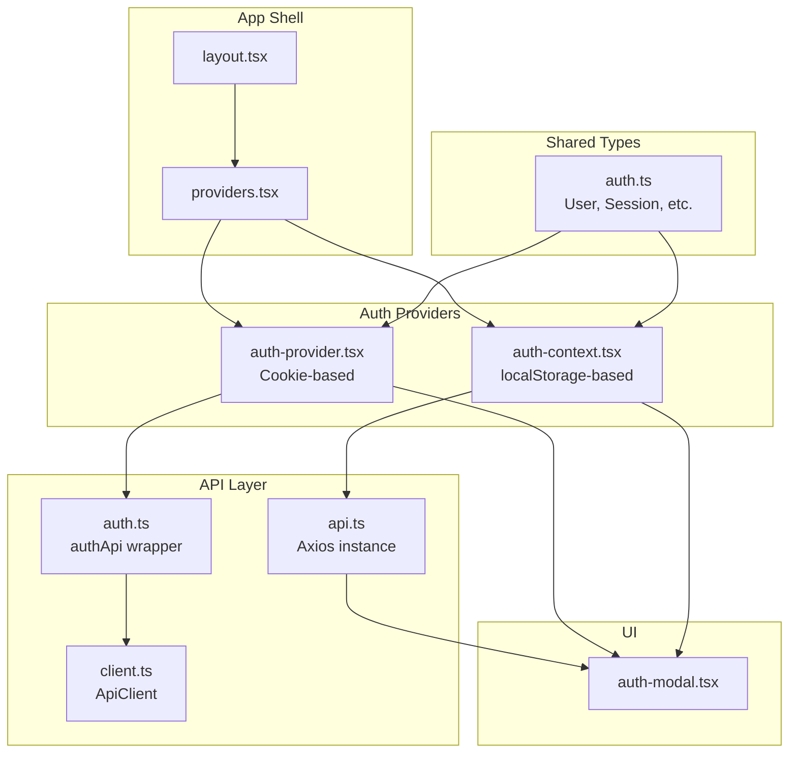
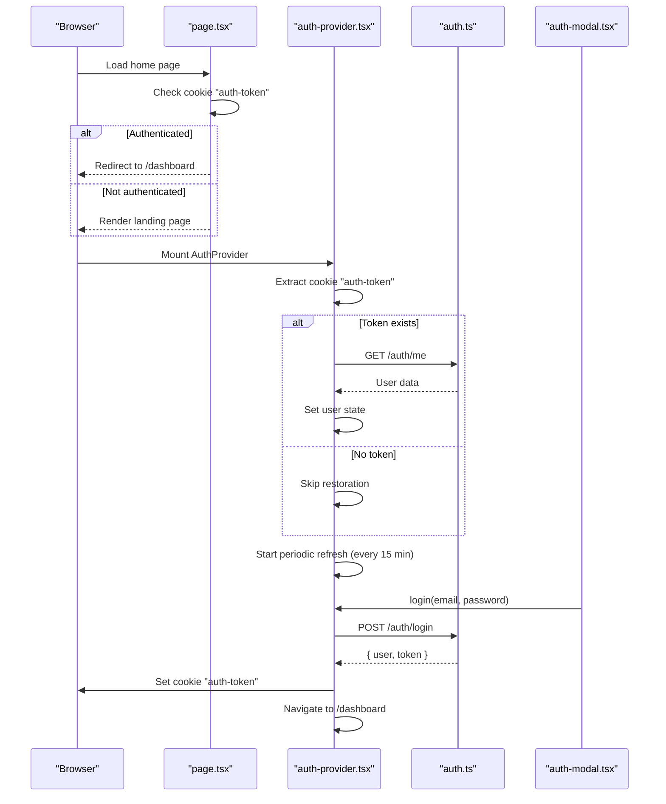
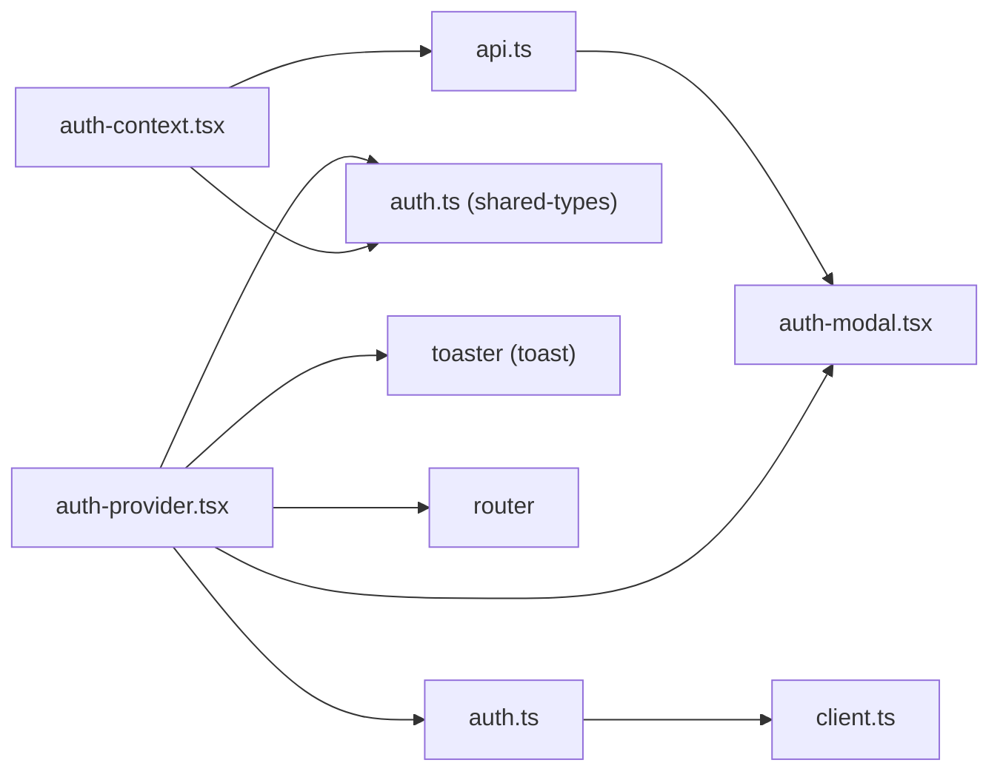

# Authentication Provider

<cite>
**Referenced Files in This Document**
- [auth-provider.tsx](file://src/components/auth/auth-provider.tsx)
- [auth-context.tsx](file://src/contexts/auth-context.tsx)
- [auth.ts](file://src/lib/api/auth.ts)
- [client.ts](file://src/lib/api/client.ts)
- [api.ts](file://src/lib/api.ts)
- [auth-modal.tsx](file://src/components/auth/auth-modal.tsx)
- [providers.tsx](file://src/app/providers.tsx)
- [layout.tsx](file://src/app/layout.tsx)
- [page.tsx](file://src/app/page.tsx)
- [auth.ts](file://packages/shared-types/src/auth.ts)
</cite>

## Table of Contents
1. [Introduction](#introduction)
2. [Project Structure](#project-structure)
3. [Core Components](#core-components)
4. [Architecture Overview](#architecture-overview)
5. [Detailed Component Analysis](#detailed-component-analysis)
6. [Dependency Analysis](#dependency-analysis)
7. [Performance Considerations](#performance-considerations)
8. [Troubleshooting Guide](#troubleshooting-guide)
9. [Conclusion](#conclusion)

## Introduction
This document explains the authentication provider component that centralizes authentication state management in the application. It covers the React Context implementation, initialization and session restoration, authentication lifecycle (login, signup, logout, token refresh), error handling, and practical usage patterns. It also documents the differences between two authentication implementations present in the codebase and provides troubleshooting guidance.

## Project Structure
The authentication system is composed of:
- A modern cookie-based provider that reads tokens from cookies and persists sessions via cookies
- An alternative localStorage-based provider that manages tokens in localStorage and uses Axios interceptors for token refresh
- Shared types for the User model and related authentication entities
- UI components that consume the provider and trigger authentication actions

**Diagram sources**
- [layout.tsx](file://src/app/layout.tsx#L83-L99)
- [providers.tsx](file://src/app/providers.tsx#L9-L36)
- [auth-provider.tsx](file://src/components/auth/auth-provider.tsx#L20-L157)
- [auth-context.tsx](file://src/contexts/auth-context.tsx#L30-L146)
- [auth.ts](file://src/lib/api/auth.ts#L25-L55)
- [client.ts](file://src/lib/api/client.ts#L3-L81)
- [api.ts](file://src/lib/api.ts#L1-L67)
- [auth-modal.tsx](file://src/components/auth/auth-modal.tsx#L17-L72)
- [auth.ts](file://packages/shared-types/src/auth.ts#L3-L19)

**Section sources**
- [layout.tsx](file://src/app/layout.tsx#L83-L99)
- [providers.tsx](file://src/app/providers.tsx#L9-L36)

## Core Components
- Cookie-based Auth Provider: Manages user state, loading state, and authentication actions using cookies for persistence. It initializes by extracting a token from cookies and calling a backend endpoint to restore the session. It periodically refreshes the token and handles logout by clearing the cookie.
- localStorage-based Auth Provider: Manages user state and authentication actions using localStorage for tokens. It sets Authorization headers globally via Axios interceptors and automatically refreshes tokens on 401 responses.
- Auth API Wrapper: Provides typed methods for login, signup, logout, refresh, and profile operations.
- Shared User Types: Defines the User interface and related authentication entities used across the app.

Key responsibilities:
- Centralized authentication state via React Context
- Automatic session restoration on app load
- Token refresh strategies (periodic and on-demand)
- Cross-request token injection and refresh
- User-facing actions (login, signup, logout)

**Section sources**
- [auth-provider.tsx](file://src/components/auth/auth-provider.tsx#L9-L165)
- [auth-context.tsx](file://src/contexts/auth-context.tsx#L18-L146)
- [auth.ts](file://src/lib/api/auth.ts#L25-L55)
- [auth.ts](file://packages/shared-types/src/auth.ts#L3-L19)

## Architecture Overview
The authentication architecture combines two complementary approaches:
- Cookie-based provider for server-rendered pages and SSR-friendly token handling
- localStorage-based provider for client-side token management and automatic token refresh via interceptors

**Diagram sources**
- [page.tsx](file://src/app/page.tsx#L5-L16)
- [auth-provider.tsx](file://src/components/auth/auth-provider.tsx#L26-L49)
- [auth.ts](file://src/lib/api/auth.ts#L25-L32)
- [auth-modal.tsx](file://src/components/auth/auth-modal.tsx#L54-L72)

## Detailed Component Analysis

### Cookie-Based Auth Provider
Implements React Context to manage:
- user: Current authenticated user or null
- loading: Initialization/loading state
- login(email, password): Authenticates and stores token in cookie
- signup(email, password, displayName): Registers and stores token in cookie
- logout(): Calls backend logout and clears cookie
- refreshToken(): Refreshes token and updates cookie

Initialization and session restoration:
- On mount, extracts "auth-token" from cookies
- If present, calls /auth/me to restore session
- On invalid token, clears the cookie and logs the error

Periodic token refresh:
- Starts a timer to call refreshToken every 15 minutes
- On failure, triggers logout and logs the error

Token persistence:
- Uses document.cookie to persist tokens across browser sessions
- Sets secure, sameSite=strict cookies with 7-day max age

Usage pattern:
- Consumers call useAuth() to access login, signup, logout, refreshToken, and user state
- UI components like AuthModal delegate form submission to provider actions

Error handling:
- Toast notifications for login/signup failures
- Console logging for initialization and refresh errors
- Graceful fallback to anonymous state on invalid tokens

**Section sources**
- [auth-provider.tsx](file://src/components/auth/auth-provider.tsx#L20-L157)
- [auth-modal.tsx](file://src/components/auth/auth-modal.tsx#L25-L72)

### localStorage-Based Auth Provider
Implements React Context to manage:
- user: Current authenticated user or null
- loading: Initialization/loading state
- login(email, password): Authenticates and stores tokens in localStorage
- signup(email, password, displayName): Registers and stores tokens in localStorage
- logout(): Calls backend logout and clears tokens from localStorage
- refreshToken(): Refreshes tokens and updates localStorage and Authorization header

Initialization and session restoration:
- On mount, checks for accessToken in localStorage
- If present, calls /auth/me to restore session
- On failure, removes both tokens from storage

Automatic token refresh:
- Axios interceptors detect 401 responses and attempt token refresh
- On success, retries the original request with new tokens
- On failure, clears tokens and redirects to login

Global Authorization:
- Sets Authorization header for all requests via Axios defaults
- Updates header after successful login/signup and refresh

**Section sources**
- [auth-context.tsx](file://src/contexts/auth-context.tsx#L30-L146)
- [api.ts](file://src/lib/api.ts#L11-L65)

### Auth API Wrapper
Provides typed methods for authentication operations:
- login(email, password): Returns { user, token, refreshToken }
- signup(email, password, displayName): Returns { user, token, refreshToken }
- logout(): No return value
- refreshToken(): Returns { token }
- me(): Returns User
- Additional operations: forgotPassword, resetPassword, verifyEmail, resendVerification, changePassword, updateProfile, deleteAccount, enable2FA, verify2FA, disable2FA

These methods wrap around either the ApiClient or the Axios instance depending on the provider.

**Section sources**
- [auth.ts](file://src/lib/api/auth.ts#L25-L101)
- [client.ts](file://src/lib/api/client.ts#L83-L101)

### Shared User Types
Defines the User interface and related authentication entities:
- User: id, email, display_name, roles, plan, email_verified, preferences, metadata, and timestamps
- Session: id, user_id, token, refresh_token, expires_at, created_at, and device info
- Roles and subscription plans enums
- Additional entities for permissions, teams, audit logs, and OAuth2 providers

These types are used by both providers and UI components.

**Section sources**
- [auth.ts](file://packages/shared-types/src/auth.ts#L3-L19)
- [auth.ts](file://packages/shared-types/src/auth.ts#L110-L120)
- [auth.ts](file://packages/shared-types/src/auth.ts#L94-L108)

### UI Integration and Usage Patterns
- AuthModal consumes useAuth() to perform login/signup actions
- Providers wraps the app with both cookie-based and localStorage-based providers
- Layout checks for auth-token cookie and redirects authenticated users to /dashboard

Practical examples:
- Consuming context in components: use useAuth() to access user, loading, and actions
- Triggering authentication: call login or signup from forms and handle errors via toasts
- Programmatic navigation: useAuth().logout() to sign out and navigate to home

**Section sources**
- [auth-modal.tsx](file://src/components/auth/auth-modal.tsx#L17-L72)
- [providers.tsx](file://src/app/providers.tsx#L9-L36)
- [layout.tsx](file://src/app/layout.tsx#L83-L99)
- [page.tsx](file://src/app/page.tsx#L5-L16)

## Dependency Analysis
The providers depend on:
- Auth API wrapper for network operations
- Shared types for User and related entities
- UI toast components for user feedback
- Router for programmatic navigation

**Diagram sources**
- [auth-provider.tsx](file://src/components/auth/auth-provider.tsx#L3-L7)
- [auth-context.tsx](file://src/contexts/auth-context.tsx#L3-L6)
- [auth.ts](file://src/lib/api/auth.ts#L1-L2)
- [client.ts](file://src/lib/api/client.ts#L1-L1)
- [api.ts](file://src/lib/api.ts#L1-L1)
- [auth-modal.tsx](file://src/components/auth/auth-modal.tsx#L3-L8)

**Section sources**
- [auth-provider.tsx](file://src/components/auth/auth-provider.tsx#L3-L7)
- [auth-context.tsx](file://src/contexts/auth-context.tsx#L3-L6)
- [auth.ts](file://src/lib/api/auth.ts#L1-L2)
- [client.ts](file://src/lib/api/client.ts#L1-L1)
- [api.ts](file://src/lib/api.ts#L1-L1)

## Performance Considerations
- Token refresh cadence: The cookie-based provider refreshes every 15 minutes. Adjust the interval based on security and latency requirements.
- Request retry: The localStorage-based provider retries failed requests after refreshing tokens. Ensure the retry logic avoids infinite loops by tracking retry attempts.
- Storage choice: Cookies are suitable for SSR and cross-tab synchronization. localStorage is simpler for client-only apps but requires careful interceptor setup.
- Toast usage: Limit toast frequency to avoid overwhelming users during repeated failures.

## Troubleshooting Guide
Common issues and resolutions:
- Invalid or expired token on initialization:
  - Symptom: Session not restored, user remains null
  - Resolution: The provider clears the cookie and continues. Verify backend token validity and network connectivity.
  - Section sources
    - [auth-provider.tsx](file://src/components/auth/auth-provider.tsx#L39-L45)

- Login/signup failures:
  - Symptom: Error toast appears, action throws
  - Resolution: Inspect the error message from the API and surface it to the user. Ensure credentials meet validation requirements.
  - Section sources
    - [auth-provider.tsx](file://src/components/auth/auth-provider.tsx#L81-L88)
    - [auth-context.tsx](file://src/contexts/auth-context.tsx#L69-L72)

- Token refresh failures:
  - Symptom: Periodic refresh fails, leading to logout
  - Resolution: Confirm refresh endpoint availability and that the refresh token is still valid. The provider triggers logout on failure.
  - Section sources
    - [auth-provider.tsx](file://src/components/auth/auth-provider.tsx#L58-L61)

- 401 Unauthorized responses:
  - Symptom: Requests fail with 401
  - Resolution: The localStorage-based provider attempts to refresh tokens automatically. If refresh fails, tokens are cleared and the user is redirected to login.
  - Section sources
    - [api.ts](file://src/lib/api.ts#L30-L61)

- Missing AuthProvider:
  - Symptom: Error indicates useAuth must be used within AuthProvider
  - Resolution: Ensure the component consuming useAuth is wrapped in the appropriate provider.
  - Section sources
    - [auth-provider.tsx](file://src/components/auth/auth-provider.tsx#L159-L165)
    - [auth-context.tsx](file://src/contexts/auth-context.tsx#L148-L154)

- Persistent session across browser sessions:
  - Symptom: User remains logged in after closing the browser
  - Resolution: Cookies are persisted with a 7-day max age. Ensure SameSite and Secure flags are configured appropriately for your deployment.
  - Section sources
    - [auth-provider.tsx](file://src/components/auth/auth-provider.tsx#L72-L72)
    - [auth-provider.tsx](file://src/components/auth/auth-provider.tsx#L136-L136)

## Conclusion
The authentication provider offers two complementary strategies for managing authentication state:
- Cookie-based provider for SSR-friendly session restoration and persistent cookies
- localStorage-based provider for client-side token management with automatic token refresh via interceptors

Together, they provide robust authentication lifecycle management, error handling, and seamless user experiences across the application.