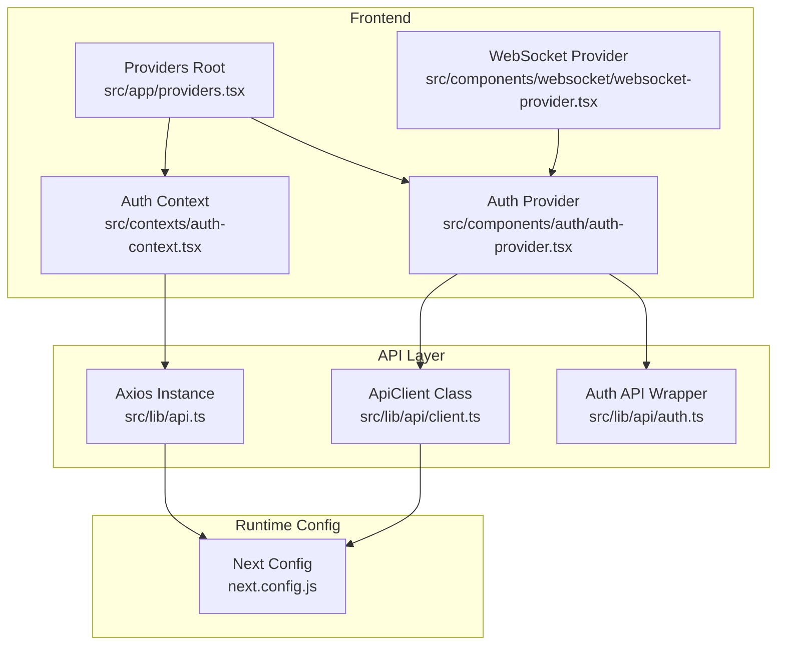
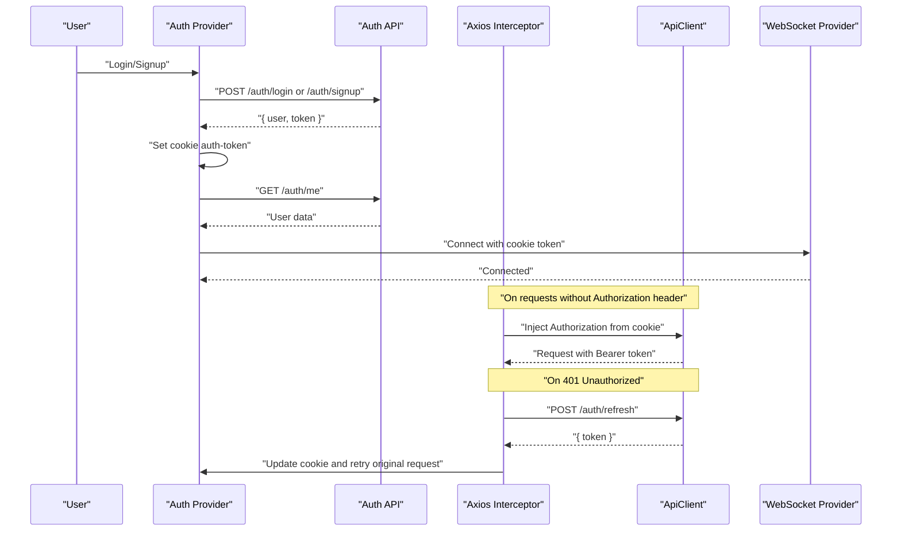
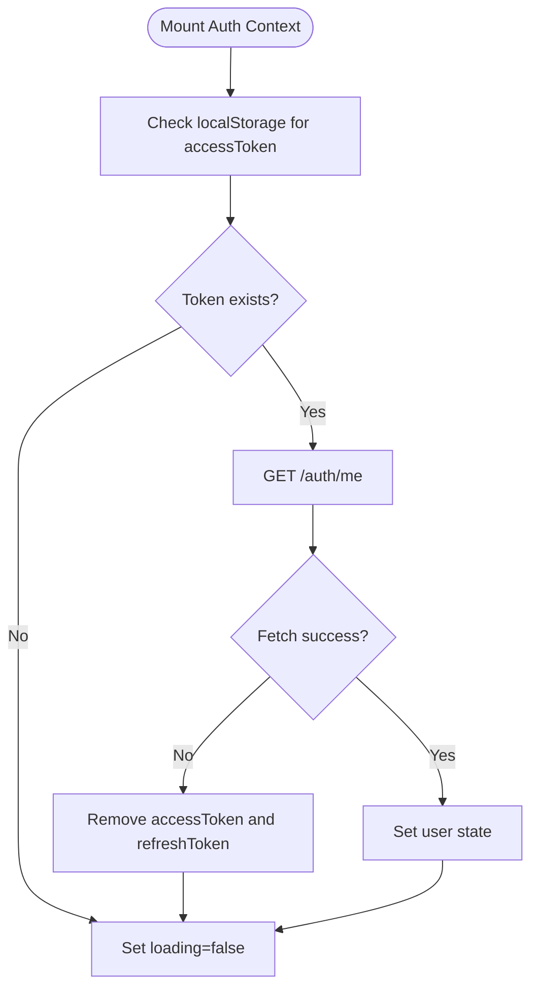
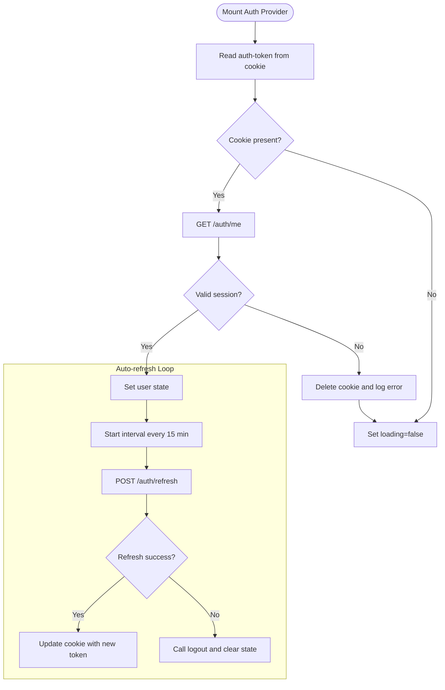
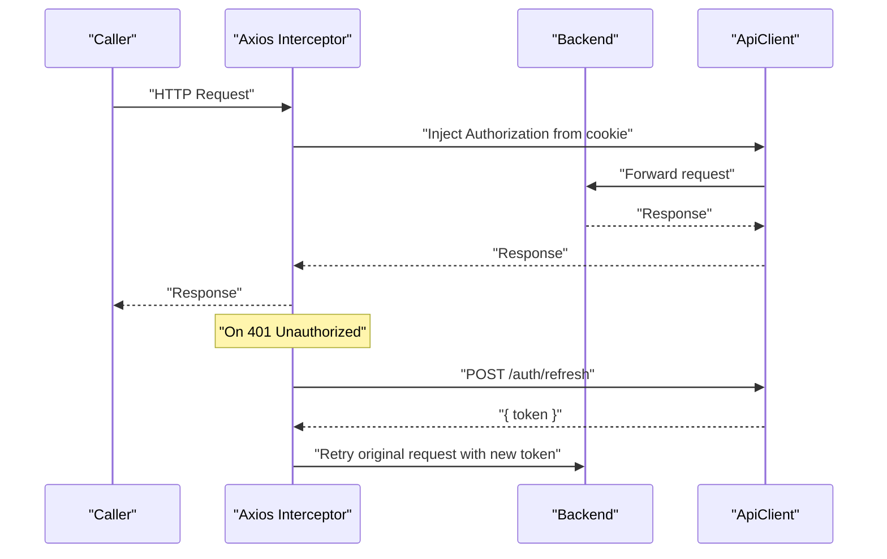
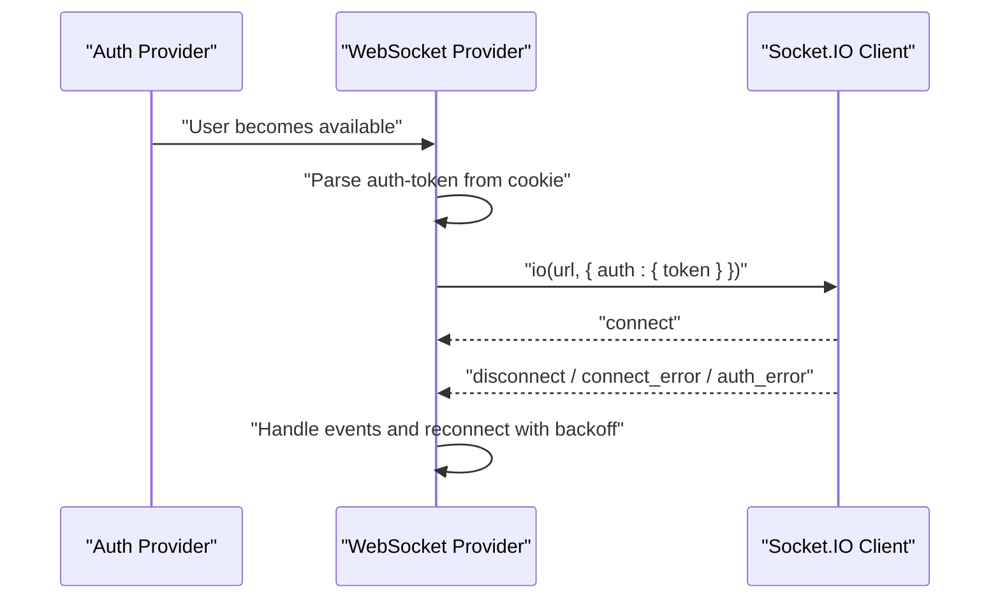
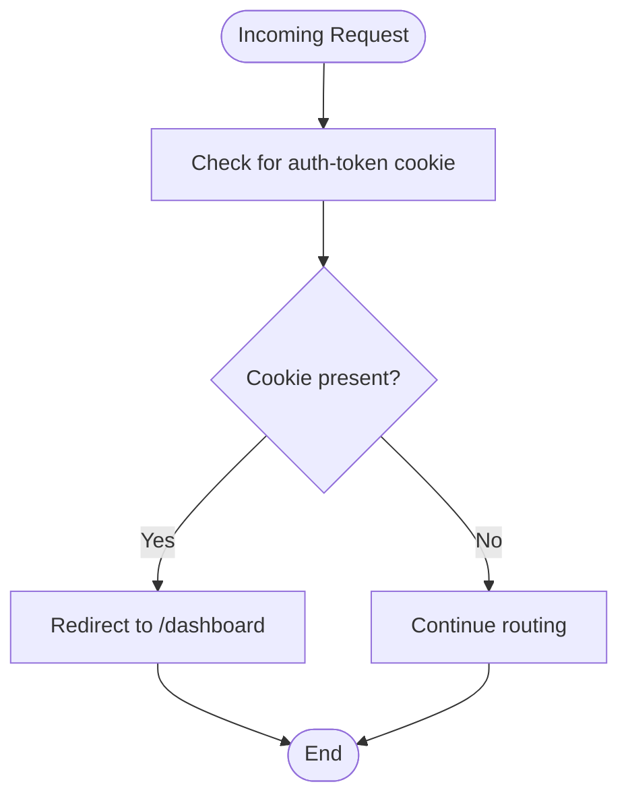
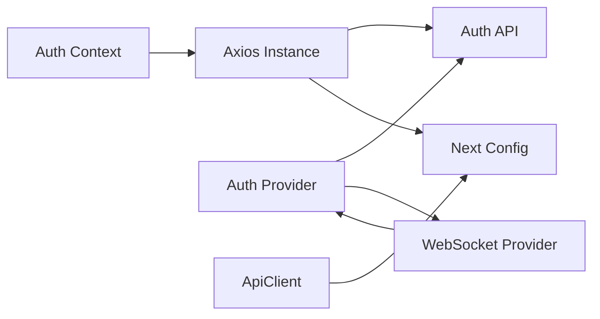

# Session Management & Security

<cite>
**Referenced Files in This Document**
- [auth-context.tsx](file://src/contexts/auth-context.tsx)
- [auth-provider.tsx](file://src/components/auth/auth-provider.tsx)
- [api.ts](file://src/lib/api.ts)
- [client.ts](file://src/lib/api/client.ts)
- [auth.ts](file://src/lib/api/auth.ts)
- [providers.tsx](file://src/app/providers.tsx)
- [websocket-provider.tsx](file://src/components/websocket/websocket-provider.tsx)
- [next.config.js](file://next.config.js)
- [package.json](file://package.json)
- [IMPLEMENTATION_PLAN.md](file://IMPLEMENTATION_PLAN.md)
- [EXECUTIVE_SUMMARY.md](file://EXECUTIVE_SUMMARY.md)
</cite>

## Table of Contents
1. [Introduction](#introduction)
2. [Project Structure](#project-structure)
3. [Core Components](#core-components)
4. [Architecture Overview](#architecture-overview)
5. [Detailed Component Analysis](#detailed-component-analysis)
6. [Dependency Analysis](#dependency-analysis)
7. [Performance Considerations](#performance-considerations)
8. [Security Best Practices](#security-best-practices)
9. [Troubleshooting Guide](#troubleshooting-guide)
10. [Conclusion](#conclusion)

## Introduction
This document provides a comprehensive guide to session management and security mechanisms in the application, focusing on JWT token handling, session persistence, and robust security practices. It explains how tokens are stored in HTTP-only cookies, how automatic token refresh works, and how session validation is performed. It also documents security measures such as SameSite cookies, Secure flag, CSRF protection, and token expiration handling. Practical examples cover secure token handling, session timeout management, and logout procedures. Finally, it addresses security considerations including XSS prevention, CSRF protection, and secure communication protocols, along with troubleshooting guidance for common session-related issues.

## Project Structure
The authentication and session management system spans several key areas:
- Frontend authentication state management via React Context
- API client with interceptors for token injection and refresh
- Cookie-based session handling with automatic refresh
- WebSocket provider that authenticates via cookies
- Next.js configuration supporting cookie-based redirects and rewrites

**Diagram sources**
- [auth-context.tsx](file://src/contexts/auth-context.tsx#L30-L146)
- [auth-provider.tsx](file://src/components/auth/auth-provider.tsx#L20-L156)
- [providers.tsx](file://src/app/providers.tsx#L9-L36)
- [api.ts](file://src/lib/api.ts#L3-L67)
- [client.ts](file://src/lib/api/client.ts#L1-L77)
- [auth.ts](file://src/lib/api/auth.ts#L25-L55)
- [websocket-provider.tsx](file://src/components/websocket/websocket-provider.tsx#L17-L129)
- [next.config.js](file://next.config.js#L28-L51)

**Section sources**
- [auth-context.tsx](file://src/contexts/auth-context.tsx#L1-L154)
- [auth-provider.tsx](file://src/components/auth/auth-provider.tsx#L1-L165)
- [api.ts](file://src/lib/api.ts#L1-L67)
- [client.ts](file://src/lib/api/client.ts#L1-L77)
- [auth.ts](file://src/lib/api/auth.ts#L1-L101)
- [providers.tsx](file://src/app/providers.tsx#L1-L37)
- [websocket-provider.tsx](file://src/components/websocket/websocket-provider.tsx#L1-L138)
- [next.config.js](file://next.config.js#L1-L56)

## Core Components
- Auth Context: Manages user state, login/signup, logout, and token refresh using localStorage for tokens.
- Auth Provider: Manages cookie-based authentication, auto-refreshes tokens, and handles logout.
- API Client: Centralized Axios instance with request/response interceptors for token injection and automatic refresh.
- Auth API Wrapper: Typed API methods for authentication operations.
- WebSocket Provider: Establishes authenticated WebSocket connections using cookies.
- Next.js Configuration: Redirects authenticated users and rewrites API traffic.

Key responsibilities:
- Token storage: localStorage in Auth Context; cookies in Auth Provider.
- Automatic refresh: Auth Provider sets periodic refresh; API interceptors handle fallback refresh.
- Session validation: On startup, Auth Provider validates cookie-based session; API interceptors handle 401 responses.

**Section sources**
- [auth-context.tsx](file://src/contexts/auth-context.tsx#L30-L146)
- [auth-provider.tsx](file://src/components/auth/auth-provider.tsx#L20-L156)
- [api.ts](file://src/lib/api.ts#L10-L65)
- [client.ts](file://src/lib/api/client.ts#L18-L77)
- [auth.ts](file://src/lib/api/auth.ts#L25-L55)
- [websocket-provider.tsx](file://src/components/websocket/websocket-provider.tsx#L17-L129)
- [next.config.js](file://next.config.js#L28-L51)

## Architecture Overview
The system integrates React Context for state, Axios interceptors for seamless token handling, and cookie-based sessions for persistence. Next.js routes and rewrites support transparent API access and authenticated redirects.

**Diagram sources**
- [auth-provider.tsx](file://src/components/auth/auth-provider.tsx#L67-L141)
- [auth.ts](file://src/lib/api/auth.ts#L25-L55)
- [api.ts](file://src/lib/api.ts#L24-L65)
- [client.ts](file://src/lib/api/client.ts#L18-L77)
- [websocket-provider.tsx](file://src/components/websocket/websocket-provider.tsx#L35-L87)

## Detailed Component Analysis

### Auth Context (localStorage-based)
- Purpose: Manage user state and authentication lifecycle using localStorage for tokens.
- Token storage: Stores access and refresh tokens in localStorage.
- Session validation: On mount, fetches user profile using Authorization header with stored token.
- Logout: Clears tokens and Authorization header.

**Diagram sources**
- [auth-context.tsx](file://src/contexts/auth-context.tsx#L35-L55)

**Section sources**
- [auth-context.tsx](file://src/contexts/auth-context.tsx#L30-L146)

### Auth Provider (cookie-based)
- Purpose: Manage cookie-based authentication with automatic refresh and logout.
- Token storage: Uses HTTP-only cookies for auth-token.
- Initialization: Reads cookie on mount and validates via /auth/me.
- Auto-refresh: Periodic refresh every 15 minutes; on failure, logs out.
- Logout: Calls backend logout and clears cookie.

**Diagram sources**
- [auth-provider.tsx](file://src/components/auth/auth-provider.tsx#L26-L65)
- [auth.ts](file://src/lib/api/auth.ts#L47-L49)

**Section sources**
- [auth-provider.tsx](file://src/components/auth/auth-provider.tsx#L20-L156)
- [auth.ts](file://src/lib/api/auth.ts#L25-L55)

### API Client and Interceptors
- Purpose: Centralized HTTP client with request/response interceptors.
- Request interceptor: Injects Authorization header using cookie token.
- Response interceptor: Handles 401 Unauthorized by refreshing token and retrying.
- Error normalization: Transforms error responses consistently.

**Diagram sources**
- [api.ts](file://src/lib/api.ts#L10-L65)
- [client.ts](file://src/lib/api/client.ts#L18-L77)

**Section sources**
- [api.ts](file://src/lib/api.ts#L1-L67)
- [client.ts](file://src/lib/api/client.ts#L1-L77)

### WebSocket Provider
- Purpose: Establish authenticated WebSocket connections using cookie token.
- Behavior: Reads auth-token from cookie and passes it to Socket.IO auth.
- Reconnection: Implements exponential backoff with max attempts.

**Diagram sources**
- [websocket-provider.tsx](file://src/components/websocket/websocket-provider.tsx#L17-L93)

**Section sources**
- [websocket-provider.tsx](file://src/components/websocket/websocket-provider.tsx#L1-L138)

### Next.js Configuration
- Purpose: Configure redirects for authenticated users and rewrite API traffic.
- Redirect: Redirects to dashboard when auth-token cookie is present.
- Rewrite: Proxies /api/* to backend API URL.

**Diagram sources**
- [next.config.js](file://next.config.js#L28-L42)

**Section sources**
- [next.config.js](file://next.config.js#L1-L56)

## Dependency Analysis
- Auth Context depends on Axios instance for API calls and localStorage for token persistence.
- Auth Provider depends on Auth API wrapper and Next.js toast for notifications.
- API interceptors depend on Auth API wrapper for refresh endpoint.
- WebSocket Provider depends on Auth Provider for user state and cookie parsing.
- Next.js configuration affects routing and API access patterns.

**Diagram sources**
- [auth-context.tsx](file://src/contexts/auth-context.tsx#L30-L146)
- [auth-provider.tsx](file://src/components/auth/auth-provider.tsx#L20-L156)
- [api.ts](file://src/lib/api.ts#L3-L67)
- [client.ts](file://src/lib/api/client.ts#L1-L77)
- [auth.ts](file://src/lib/api/auth.ts#L25-L55)
- [websocket-provider.tsx](file://src/components/websocket/websocket-provider.tsx#L17-L129)
- [next.config.js](file://next.config.js#L28-L51)

**Section sources**
- [auth-context.tsx](file://src/contexts/auth-context.tsx#L1-L154)
- [auth-provider.tsx](file://src/components/auth/auth-provider.tsx#L1-L165)
- [api.ts](file://src/lib/api.ts#L1-L67)
- [client.ts](file://src/lib/api/client.ts#L1-L77)
- [auth.ts](file://src/lib/api/auth.ts#L1-L101)
- [websocket-provider.tsx](file://src/components/websocket/websocket-provider.tsx#L1-L138)
- [next.config.js](file://next.config.js#L1-L56)

## Performance Considerations
- Token refresh cadence: Auth Provider refreshes every 15 minutes; consider adjusting based on token TTL and usage patterns.
- Interceptor retries: Axios interceptors automatically retry failed requests after refresh; avoid excessive concurrent refresh attempts.
- WebSocket reconnection: Exponential backoff prevents thundering herd on server; tune max attempts and base delay.
- Cookie parsing: Parsing cookies on each request adds overhead; consider caching token per request lifecycle.

[No sources needed since this section provides general guidance]

## Security Best Practices
- Token storage
  - Current state: Mixed usage of localStorage (Auth Context) and cookies (Auth Provider). Consolidation to HTTP-only cookies is recommended.
  - Recommendation: Use HTTP-only cookies for tokens to mitigate XSS risks. Remove localStorage-based token storage.

- Cookie attributes
  - Current state: Cookies include path, max-age, secure, and sameSite=strict.
  - Recommendation: Ensure SameSite=Lax or Strict depending on cross-site needs; add HttpOnly and Secure flags; consider Domain and SameSite=None for cross-site scenarios requiring cookies.

- CSRF protection
  - Current state: CSRF protection is not implemented in the repository.
  - Recommendation: Implement anti-CSRF tokens using double-submit cookies or SameSite=Lax with proper CSRF middleware.

- Token expiration and refresh
  - Current state: Auth Provider auto-refreshes every 15 minutes; API interceptors handle 401 refresh.
  - Recommendation: Align refresh intervals with token TTL; implement refresh token rotation; handle refresh failures gracefully.

- Session validation
  - Current state: Auth Provider validates session on mount via /auth/me; invalid cookies are cleared.
  - Recommendation: Add server-side session validation and revocation lists; invalidate sessions on logout.

- Secure communication
  - Current state: Next.js configuration supports HTTPS images and environment variables for URLs.
  - Recommendation: Enforce HTTPS everywhere; configure HSTS; use secure WebSocket (wss).

- XSS prevention
  - Current state: No explicit XSS sanitization in the provided files.
  - Recommendation: Sanitize user inputs; use Content Security Policy; escape dynamic content.

- Error handling and observability
  - Current state: Basic error logging; no centralized error reporting.
  - Recommendation: Implement structured error logging; add monitoring and alerting for auth anomalies.

**Section sources**
- [EXECUTIVE_SUMMARY.md](file://EXECUTIVE_SUMMARY.md#L38-L81)
- [IMPLEMENTATION_PLAN.md](file://IMPLEMENTATION_PLAN.md#L539-L579)
- [IMPLEMENTATION_PLAN.md](file://IMPLEMENTATION_PLAN.md#L884-L919)
- [auth-provider.tsx](file://src/components/auth/auth-provider.tsx#L70-L72)
- [auth-provider.tsx](file://src/components/auth/auth-provider.tsx#L135-L136)
- [api.ts](file://src/lib/api.ts#L39-L42)
- [client.ts](file://src/lib/api/client.ts#L48-L54)

## Troubleshooting Guide
Common issues and resolutions:
- Token not persisting across sessions
  - Symptom: Users must log in repeatedly.
  - Cause: Mixed token storage (localStorage vs cookies).
  - Resolution: Standardize on HTTP-only cookies; ensure SameSite and Secure flags are set.

- Frequent 401 Unauthorized errors
  - Symptom: Requests fail intermittently.
  - Cause: Expired or invalid tokens.
  - Resolution: Verify token TTL and refresh logic; inspect interceptor retry behavior.

- Auto-refresh fails silently
  - Symptom: Session ends despite refresh loop.
  - Cause: Refresh endpoint unavailable or invalid refresh token.
  - Resolution: Log refresh failures; trigger logout on repeated failures.

- WebSocket authentication failures
  - Symptom: WebSocket disconnects or auth errors.
  - Cause: Cookie parsing issues or missing token.
  - Resolution: Use Auth Provider for token retrieval; ensure cookie is present before connecting.

- Logout does not clear session
  - Symptom: User remains authenticated after logout.
  - Cause: Missing backend logout or cookie clearing.
  - Resolution: Call backend logout endpoint and clear cookie; redirect to home.

- Duplicate API clients
  - Symptom: Confusing token handling and inconsistent headers.
  - Cause: Separate Axios instances in api.ts and client.ts.
  - Resolution: Consolidate to a single API client instance.

**Section sources**
- [auth-context.tsx](file://src/contexts/auth-context.tsx#L93-L106)
- [auth-provider.tsx](file://src/components/auth/auth-provider.tsx#L115-L131)
- [api.ts](file://src/lib/api.ts#L24-L65)
- [client.ts](file://src/lib/api/client.ts#L37-L77)
- [websocket-provider.tsx](file://src/components/websocket/websocket-provider.tsx#L82-L87)
- [IMPLEMENTATION_PLAN.md](file://IMPLEMENTATION_PLAN.md#L884-L919)

## Conclusion
The application currently implements a hybrid approach to session management, combining localStorage-based tokens in the Auth Context and cookie-based tokens in the Auth Provider. While the Auth Provider’s cookie-based approach improves security, inconsistencies in token storage and missing CSRF protection require immediate attention. Consolidating to HTTP-only cookies, implementing CSRF safeguards, aligning refresh intervals with token TTL, and enhancing error handling will significantly strengthen the system’s security posture and reliability. The provided diagrams and troubleshooting guidance offer a roadmap for addressing these issues effectively.