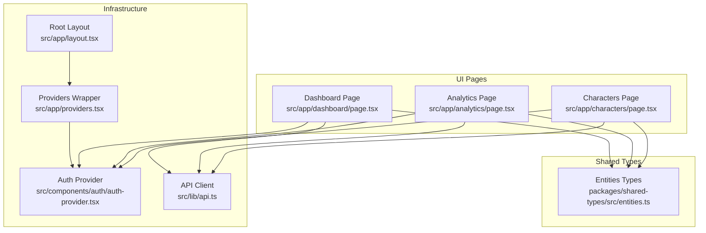
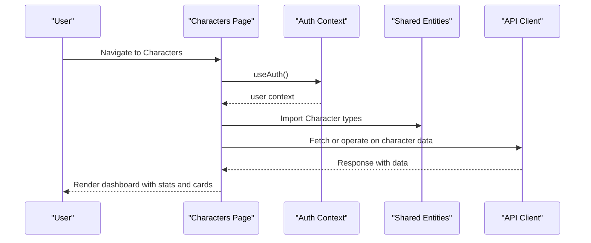
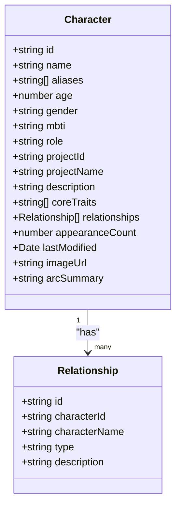
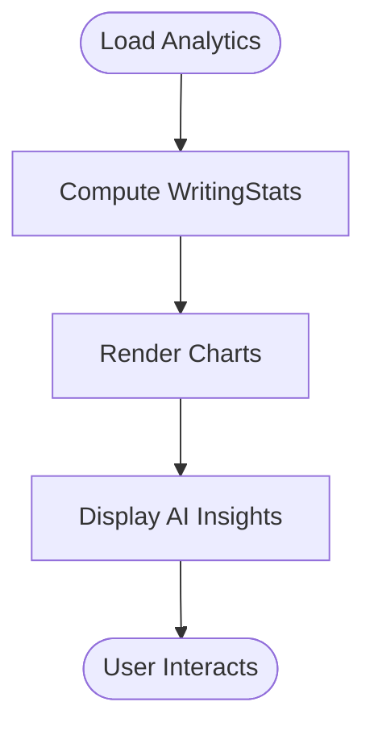
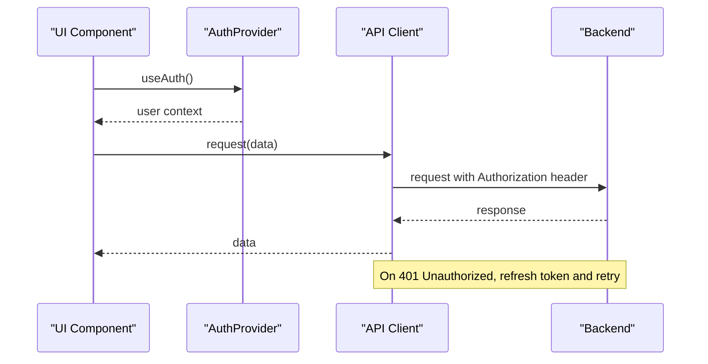
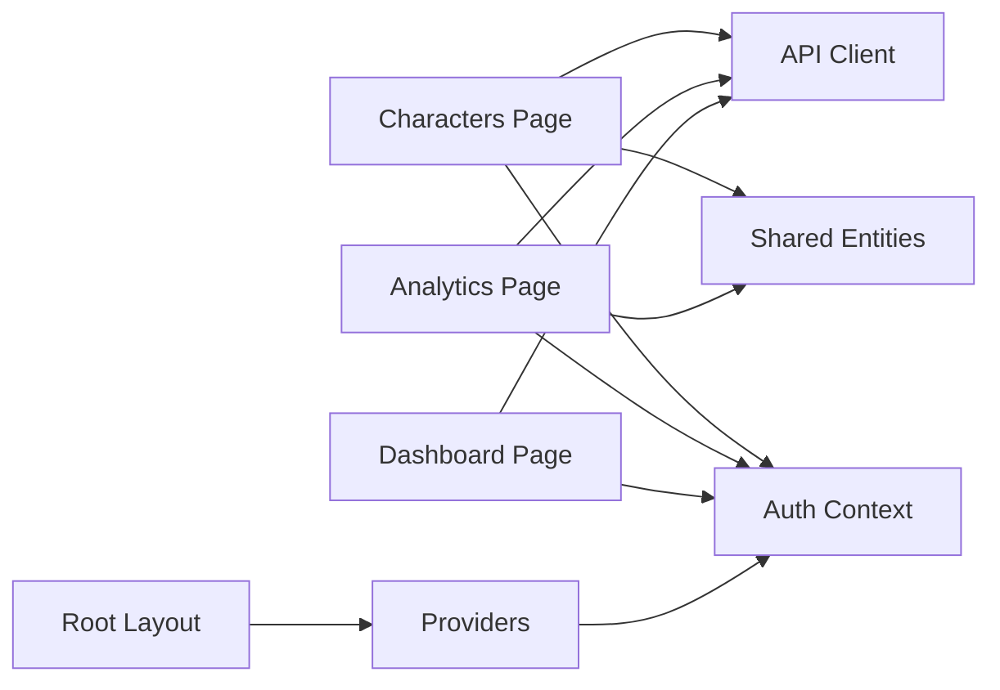

# Character Analytics & Insights

<cite>
**Referenced Files in This Document**
- [page.tsx](file://src/app/characters/page.tsx)
- [page.tsx](file://src/app/analytics/page.tsx)
- [page.tsx](file://src/app/dashboard/page.tsx)
- [entities.ts](file://packages/shared-types/src/entities.ts)
- [api.ts](file://src/lib/api.ts)
- [auth-provider.tsx](file://src/components/auth/auth-provider.tsx)
- [layout.tsx](file://src/app/layout.tsx)
- [providers.tsx](file://src/app/providers.tsx)
</cite>

## Table of Contents
1. [Introduction](#introduction)
2. [Project Structure](#project-structure)
3. [Core Components](#core-components)
4. [Architecture Overview](#architecture-overview)
5. [Detailed Component Analysis](#detailed-component-analysis)
6. [Dependency Analysis](#dependency-analysis)
7. [Performance Considerations](#performance-considerations)
8. [Troubleshooting Guide](#troubleshooting-guide)
9. [Conclusion](#conclusion)
10. [Appendices](#appendices)

## Introduction
This document explains the Character Analytics & Insights functionality implemented in the application. It covers the statistics dashboard for characters, usage analytics, AI-powered insights, quick character tools, and guidance for interpreting analytics to improve storytelling. The system currently uses mock data and demonstrates the intended structure and user flows for character management, analytics visualization, and AI assistance.

## Project Structure
The analytics and character features are implemented as Next.js pages under the app directory, integrated with shared types and API utilities. Authentication and state management are provided via a dedicated provider.

**Diagram sources**
- [page.tsx](file://src/app/characters/page.tsx#L1-L512)
- [page.tsx](file://src/app/analytics/page.tsx#L1-L470)
- [page.tsx](file://src/app/dashboard/page.tsx#L1-L260)
- [entities.ts](file://packages/shared-types/src/entities.ts#L78-L148)
- [auth-provider.tsx](file://src/components/auth/auth-provider.tsx#L1-L165)
- [api.ts](file://src/lib/api.ts#L1-L67)
- [layout.tsx](file://src/app/layout.tsx#L1-L102)
- [providers.tsx](file://src/app/providers.tsx#L1-L37)

**Section sources**
- [page.tsx](file://src/app/characters/page.tsx#L1-L512)
- [page.tsx](file://src/app/analytics/page.tsx#L1-L470)
- [page.tsx](file://src/app/dashboard/page.tsx#L1-L260)
- [entities.ts](file://packages/shared-types/src/entities.ts#L78-L148)
- [auth-provider.tsx](file://src/components/auth/auth-provider.tsx#L1-L165)
- [api.ts](file://src/lib/api.ts#L1-L67)
- [layout.tsx](file://src/app/layout.tsx#L1-L102)
- [providers.tsx](file://src/app/providers.tsx#L1-L37)

## Core Components
- Characters Dashboard: Presents character cards, filters, stats, and quick actions for AI-powered character tools.
- Analytics Dashboard: Provides writing analytics and insights, including charts and AI persona usage.
- Shared Data Model: Defines Character, Relationship, PersonalityTraits, CharacterArc, and VoiceProfile structures.
- Authentication and API Layer: Manages user context and HTTP requests with interceptors for token handling.

**Section sources**
- [page.tsx](file://src/app/characters/page.tsx#L31-L54)
- [page.tsx](file://src/app/analytics/page.tsx#L53-L91)
- [entities.ts](file://packages/shared-types/src/entities.ts#L78-L148)
- [auth-provider.tsx](file://src/components/auth/auth-provider.tsx#L9-L16)
- [api.ts](file://src/lib/api.ts#L3-L22)

## Architecture Overview
The system follows a client-side React architecture with:
- UI pages for Characters and Analytics dashboards
- Shared TypeScript entities for typed data structures
- Authentication context for user state
- API client with request/response interceptors
- Providers wrapper enabling theme switching, query caching, and auth

**Diagram sources**
- [page.tsx](file://src/app/characters/page.tsx#L70-L183)
- [auth-provider.tsx](file://src/components/auth/auth-provider.tsx#L159-L165)
- [entities.ts](file://packages/shared-types/src/entities.ts#L78-L96)
- [api.ts](file://src/lib/api.ts#L1-L67)

## Detailed Component Analysis

### Characters Dashboard
The Characters page displays:
- Total characters, protagonists, relationships, and AI suggestions stats
- Filterable grid of characters with roles, MBTI, traits, and relationship previews
- Quick actions for AI-powered character tools
- Relationship map toggle

Key data structures:
- Character interface includes role, relationships, appearanceCount, and personality traits
- Role colors and MBTI types are supported
- Stats computed from the character dataset

**Diagram sources**
- [page.tsx](file://src/app/characters/page.tsx#L31-L54)
- [entities.ts](file://packages/shared-types/src/entities.ts#L125-L132)

Practical analytics highlights:
- Protagonist count: computed by filtering characters by role
- Relationship totals: sum of relationships across all characters
- Appearance counts: used to indicate prominence across scenes
- AI suggestions: placeholder count indicating available insights

**Section sources**
- [page.tsx](file://src/app/characters/page.tsx#L345-L393)
- [page.tsx](file://src/app/characters/page.tsx#L187-L196)
- [page.tsx](file://src/app/characters/page.tsx#L483-L509)
- [entities.ts](file://packages/shared-types/src/entities.ts#L78-L96)

### Analytics Dashboard
The Analytics page presents:
- Writing statistics and trends
- Charts for daily progress, project progress, genre distribution, AI persona usage, and writing patterns
- Achievement badges and AI-powered insights

Mock data demonstrates:
- WritingStats, DailyProgress, ProjectProgress, GenreDistribution, and writingHeatmap structures
- AI persona usage radar chart

**Diagram sources**
- [page.tsx](file://src/app/analytics/page.tsx#L93-L159)
- [page.tsx](file://src/app/analytics/page.tsx#L218-L387)
- [page.tsx](file://src/app/analytics/page.tsx#L430-L467)

**Section sources**
- [page.tsx](file://src/app/analytics/page.tsx#L53-L91)
- [page.tsx](file://src/app/analytics/page.tsx#L117-L149)
- [page.tsx](file://src/app/analytics/page.tsx#L343-L361)
- [page.tsx](file://src/app/analytics/page.tsx#L363-L387)
- [page.tsx](file://src/app/analytics/page.tsx#L430-L467)

### Shared Data Model for Characters
The shared types define:
- Character with personality, secrets, relationships, arc, and voice profile
- Relationship with type, description, dynamics, history, and tension points
- CharacterArc with starting point, catalyst, journey, climax, and resolution
- VoiceProfile with vocabulary level, speech patterns, catchphrases, dialect, and formality

These structures support:
- Personality suggestions and relationship recommendations
- Character development prompts and arc analysis
- Comparative character studies across projects

**Section sources**
- [entities.ts](file://packages/shared-types/src/entities.ts#L78-L148)

### Authentication and API Layer
- AuthProvider manages user state, login/signup/logout, and token refresh
- API client adds Authorization headers and handles token refresh on 401 responses
- Providers wrapper enables theme switching and React Query caching

**Diagram sources**
- [auth-provider.tsx](file://src/components/auth/auth-provider.tsx#L67-L141)
- [api.ts](file://src/lib/api.ts#L11-L65)

**Section sources**
- [auth-provider.tsx](file://src/components/auth/auth-provider.tsx#L1-L165)
- [api.ts](file://src/lib/api.ts#L1-L67)
- [providers.tsx](file://src/app/providers.tsx#L9-L36)

## Dependency Analysis
- Characters page depends on:
  - Shared Character and Relationship types
  - Authentication context for user-aware UI
  - API client for future data fetching
- Analytics page depends on:
  - Shared types for data modeling
  - UI components and chart libraries for visualization
- Both pages rely on:
  - Providers for theme and query caching
  - Layout for global styling and metadata

**Diagram sources**
- [page.tsx](file://src/app/characters/page.tsx#L1-L30)
- [page.tsx](file://src/app/analytics/page.tsx#L1-L51)
- [page.tsx](file://src/app/dashboard/page.tsx#L1-L19)
- [entities.ts](file://packages/shared-types/src/entities.ts#L78-L148)
- [auth-provider.tsx](file://src/components/auth/auth-provider.tsx#L1-L165)
- [api.ts](file://src/lib/api.ts#L1-L67)
- [layout.tsx](file://src/app/layout.tsx#L1-L102)
- [providers.tsx](file://src/app/providers.tsx#L1-L37)

**Section sources**
- [page.tsx](file://src/app/characters/page.tsx#L1-L30)
- [page.tsx](file://src/app/analytics/page.tsx#L1-L51)
- [page.tsx](file://src/app/dashboard/page.tsx#L1-L19)
- [entities.ts](file://packages/shared-types/src/entities.ts#L78-L148)
- [auth-provider.tsx](file://src/components/auth/auth-provider.tsx#L1-L165)
- [api.ts](file://src/lib/api.ts#L1-L67)
- [layout.tsx](file://src/app/layout.tsx#L1-L102)
- [providers.tsx](file://src/app/providers.tsx#L1-L37)

## Performance Considerations
- Client-side filtering and rendering: Efficient for small datasets; consider server-side pagination for larger character sets.
- Chart rendering: Recharts components are lightweight; avoid excessive re-renders by memoizing datasets.
- Authentication and API caching: React Query provides caching; configure staleTime appropriately for analytics data.
- Image loading: Lazy-load character avatars and use responsive sizes to reduce bandwidth.

## Troubleshooting Guide
Common issues and resolutions:
- Authentication failures: Verify cookies and token refresh logic in the auth provider.
- API errors: Check request interceptors and ensure Authorization headers are present.
- UI hydration warnings: Confirm providers are wrapped around the root layout.
- Missing data: Replace mock datasets with API calls using the shared entities.

**Section sources**
- [auth-provider.tsx](file://src/components/auth/auth-provider.tsx#L27-L65)
- [api.ts](file://src/lib/api.ts#L11-L65)
- [layout.tsx](file://src/app/layout.tsx#L88-L101)

## Conclusion
The Character Analytics & Insights system provides a robust foundation for managing characters, visualizing usage analytics, and leveraging AI insights. The current implementation uses mock data to demonstrate UI flows and data structures. Future enhancements should integrate real API endpoints, implement server-side filtering and pagination, and expand AI-powered suggestions based on the shared Character and Relationship models.

## Appendices

### Practical Examples of Interpreting Analytics Data
- Protagonist-to-support ratio: Aim for balanced representation; adjust roles if antagonists dominate.
- Relationship totals: Identify isolated characters and add meaningful connections to deepen narrative stakes.
- Appearance counts: Characters with low scene counts may need plot hooks to increase prominence.
- AI suggestions: Use insights to refine personality traits, clarify motivations, and strengthen arcs.

### Using Analytics to Improve Storytelling
- Plot holes: Cross-reference character appearances with key scenes; ensure major beats align with character arcs.
- Character weaknesses: Review personality traits and secrets to identify unexplored conflicts.
- Opportunities for development: Compare MBTI profiles and core traits to suggest complementary growth paths.