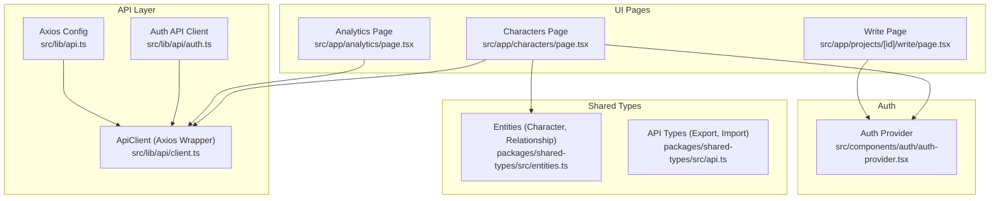
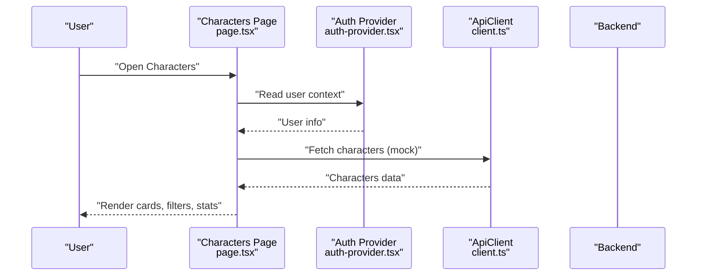
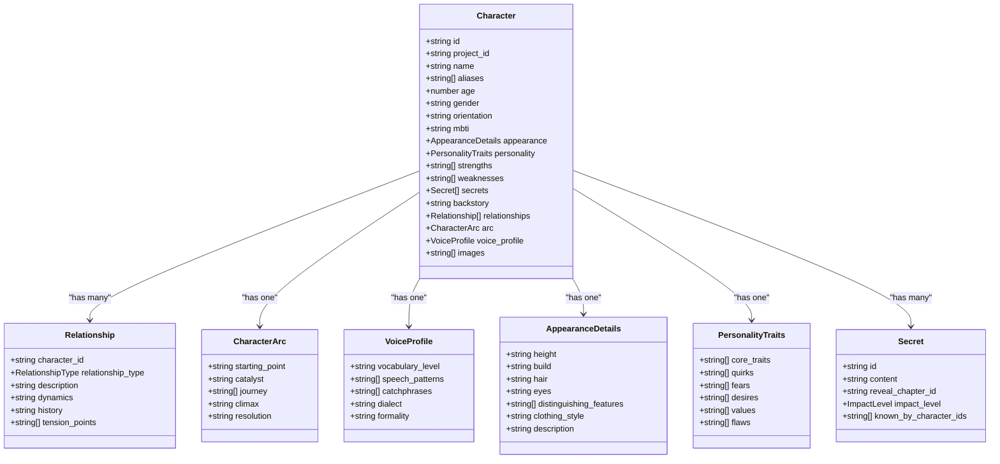
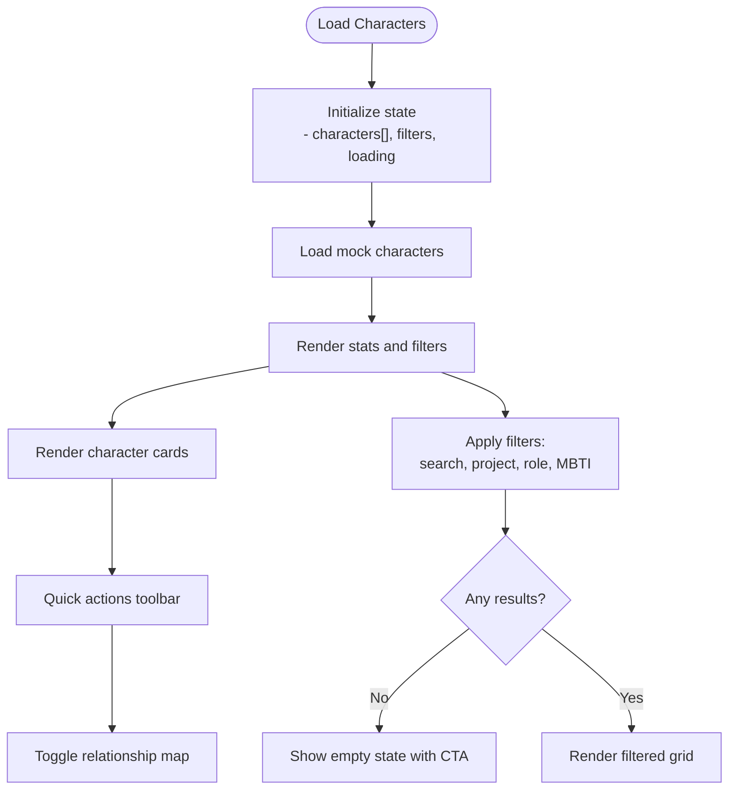
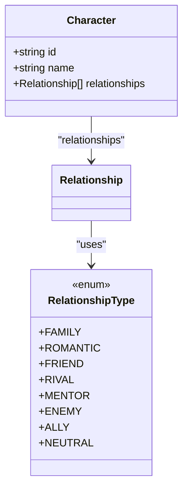
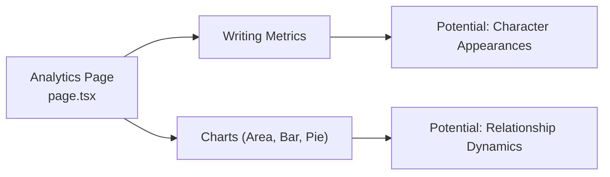
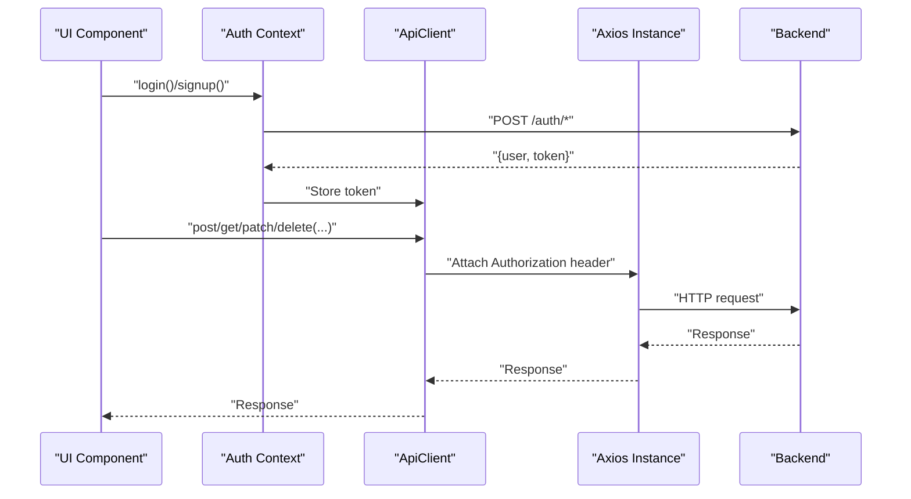
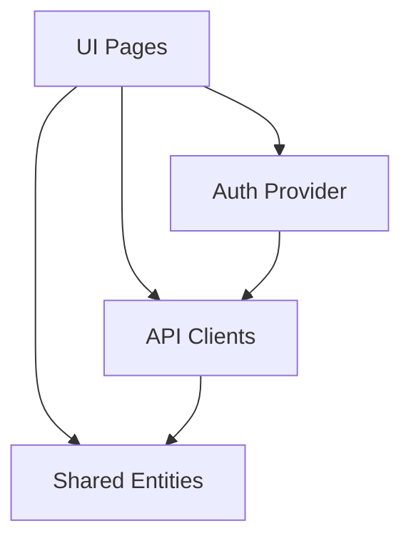
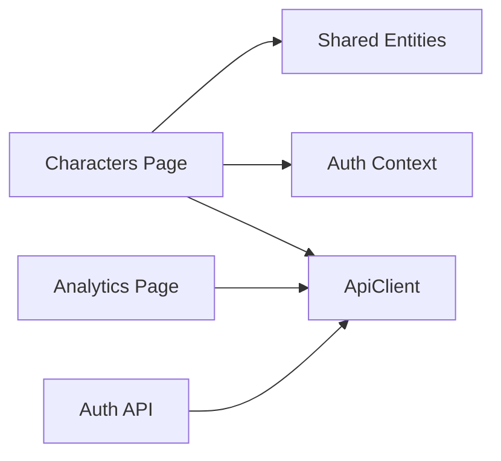

# Character Development Tools

<cite>
**Referenced Files in This Document**
- [README.md](file://README.md)
- [src/app/characters/page.tsx](file://src/app/characters/page.tsx)
- [src/app/analytics/page.tsx](file://src/app/analytics/page.tsx)
- [src/app/projects/[id]/write/page.tsx](file://src/app/projects/[id]/write/page.tsx)
- [packages/shared-types/src/entities.ts](file://packages/shared-types/src/entities.ts)
- [packages/shared-types/src/api.ts](file://packages/shared-types/src/api.ts)
- [src/lib/api.ts](file://src/lib/api.ts)
- [src/lib/api/client.ts](file://src/lib/api/client.ts)
- [src/components/auth/auth-provider.tsx](file://src/components/auth/auth-provider.tsx)
- [src/lib/api/auth.ts](file://src/lib/api/auth.ts)
</cite>

## Table of Contents
1. [Introduction](#introduction)
2. [Project Structure](#project-structure)
3. [Core Components](#core-components)
4. [Architecture Overview](#architecture-overview)
5. [Detailed Component Analysis](#detailed-component-analysis)
6. [Dependency Analysis](#dependency-analysis)
7. [Performance Considerations](#performance-considerations)
8. [Troubleshooting Guide](#troubleshooting-guide)
9. [Conclusion](#conclusion)
10. [Appendices](#appendices)

## Introduction
This document describes the character development system for the AI-powered writing platform. It focuses on character profile management, relationship mapping, analytics, search, and integration with project content. The system currently exposes a character listing and filtering interface with mock data, a relationship map toggle, and quick character tools. The underlying data model is defined in shared types, and the UI integrates with authentication and API clients. This guide is designed to be accessible to beginners while providing technical depth for experienced developers.

## Project Structure
The character development system spans UI pages, shared data models, and API integrations:
- Character listing and filtering live in the characters page
- Analytics dashboards provide writing insights and can be extended for character analytics
- The shared entities define the canonical character data model
- API clients and authentication integrate the UI with backend services

**Diagram sources**
- [src/app/characters/page.tsx](file://src/app/characters/page.tsx#L1-L512)
- [src/app/projects/[id]/write/page.tsx](file://src/app/projects/[id]/write/page.tsx#L1-L626)
- [src/app/analytics/page.tsx](file://src/app/analytics/page.tsx#L1-L470)
- [packages/shared-types/src/entities.ts](file://packages/shared-types/src/entities.ts#L78-L148)
- [packages/shared-types/src/api.ts](file://packages/shared-types/src/api.ts#L157-L242)
- [src/lib/api.ts](file://src/lib/api.ts#L1-L67)
- [src/lib/api/client.ts](file://src/lib/api/client.ts#L1-L138)
- [src/components/auth/auth-provider.tsx](file://src/components/auth/auth-provider.tsx#L1-L165)
- [src/lib/api/auth.ts](file://src/lib/api/auth.ts#L1-L101)

**Section sources**
- [README.md](file://README.md#L73-L104)
- [src/app/characters/page.tsx](file://src/app/characters/page.tsx#L1-L512)
- [packages/shared-types/src/entities.ts](file://packages/shared-types/src/entities.ts#L78-L148)
- [src/lib/api.ts](file://src/lib/api.ts#L1-L67)
- [src/lib/api/client.ts](file://src/lib/api/client.ts#L1-L138)
- [src/components/auth/auth-provider.tsx](file://src/components/auth/auth-provider.tsx#L1-L165)
- [src/lib/api/auth.ts](file://src/lib/api/auth.ts#L1-L101)

## Core Components
- Character data model: Defines the canonical structure for characters, including identity, traits, relationships, arcs, and optional media.
- Characters page: Renders a grid of characters with filtering, stats, and quick actions. Includes a relationship map toggle and “New Character” link.
- Analytics page: Provides writing analytics and can be extended for character-centric insights.
- API clients: Centralized Axios configuration and typed API client for authentication and future character endpoints.
- Authentication provider: Manages user session and integrates with API clients.

Key capabilities:
- Profile fields: name, aliases, age, gender, MBTI, role, description, core traits, images, arc summary, and more via the shared model.
- Relationship mapping: Characters expose a relationships array; the UI includes a toggle to show a relationship map.
- Search and filters: Name, description, aliases; project, role, and MBTI filters.
- Analytics: Word counts, writing streaks, and charts; can be adapted for character analytics.
- Export/import: Shared types define export/import formats and options suitable for integrating character data.

**Section sources**
- [src/app/characters/page.tsx](file://src/app/characters/page.tsx#L31-L54)
- [src/app/characters/page.tsx](file://src/app/characters/page.tsx#L187-L196)
- [packages/shared-types/src/entities.ts](file://packages/shared-types/src/entities.ts#L78-L96)
- [packages/shared-types/src/entities.ts](file://packages/shared-types/src/entities.ts#L125-L132)
- [packages/shared-types/src/api.ts](file://packages/shared-types/src/api.ts#L157-L242)
- [src/app/analytics/page.tsx](file://src/app/analytics/page.tsx#L93-L156)
- [src/lib/api.ts](file://src/lib/api.ts#L1-L67)
- [src/lib/api/client.ts](file://src/lib/api/client.ts#L1-L138)
- [src/components/auth/auth-provider.tsx](file://src/components/auth/auth-provider.tsx#L1-L165)

## Architecture Overview
The character system follows a layered architecture:
- UI layer: Next.js App Router pages render views and manage state.
- Data model layer: Shared TypeScript types define entities and API contracts.
- API layer: Axios-based clients handle authentication and HTTP requests.
- Auth layer: Context-managed authentication state and token lifecycle.

**Diagram sources**
- [src/app/characters/page.tsx](file://src/app/characters/page.tsx#L70-L183)
- [src/components/auth/auth-provider.tsx](file://src/components/auth/auth-provider.tsx#L1-L165)
- [src/lib/api/client.ts](file://src/lib/api/client.ts#L1-L138)

## Detailed Component Analysis

### Character Data Model
The canonical character model includes identity, appearance, personality, relationships, arcs, voice profiles, and images. It also defines relationship types and enums for statuses and preferences.

**Diagram sources**
- [packages/shared-types/src/entities.ts](file://packages/shared-types/src/entities.ts#L78-L148)

**Section sources**
- [packages/shared-types/src/entities.ts](file://packages/shared-types/src/entities.ts#L78-L148)

### Characters Page: UI, Filtering, and Relationship Map
The characters page renders a responsive grid of character cards, supports filtering by project, role, and MBTI, and includes a relationship map toggle. It displays stats such as total characters, protagonists, and total relationships.

**Diagram sources**
- [src/app/characters/page.tsx](file://src/app/characters/page.tsx#L70-L183)
- [src/app/characters/page.tsx](file://src/app/characters/page.tsx#L187-L196)

**Section sources**
- [src/app/characters/page.tsx](file://src/app/characters/page.tsx#L31-L54)
- [src/app/characters/page.tsx](file://src/app/characters/page.tsx#L187-L196)
- [src/app/characters/page.tsx](file://src/app/characters/page.tsx#L344-L393)
- [src/app/characters/page.tsx](file://src/app/characters/page.tsx#L395-L446)
- [src/app/characters/page.tsx](file://src/app/characters/page.tsx#L448-L512)

### Relationship Mapping System
The UI exposes a relationship map toggle. The underlying model supports rich relationship metadata (type, description, dynamics, history, tension points). While the relationship map is not implemented in the current UI, the data model and enums are ready for visualization.

**Diagram sources**
- [packages/shared-types/src/entities.ts](file://packages/shared-types/src/entities.ts#L411-L420)
- [packages/shared-types/src/entities.ts](file://packages/shared-types/src/entities.ts#L125-L132)
- [src/app/characters/page.tsx](file://src/app/characters/page.tsx#L43-L49)

**Section sources**
- [src/app/characters/page.tsx](file://src/app/characters/page.tsx#L78-L80)
- [src/app/characters/page.tsx](file://src/app/characters/page.tsx#L331-L334)
- [packages/shared-types/src/entities.ts](file://packages/shared-types/src/entities.ts#L411-L420)

### Analytics and Character Insights
The analytics page provides writing metrics and charts. These visuals and metrics can be adapted to analyze character dynamics, such as:
- Frequency of character appearances across scenes
- Relationship intensity or sentiment trends
- Character arc progression indicators
- Voice profile usage across scenes

**Diagram sources**
- [src/app/analytics/page.tsx](file://src/app/analytics/page.tsx#L93-L156)

**Section sources**
- [src/app/analytics/page.tsx](file://src/app/analytics/page.tsx#L93-L156)

### API Clients and Authentication
Authentication is handled via a context provider that manages tokens and user state. API clients wrap Axios for HTTP requests and token injection. The shared API types define export/import formats and analytics queries.

**Diagram sources**
- [src/components/auth/auth-provider.tsx](file://src/components/auth/auth-provider.tsx#L67-L141)
- [src/lib/api/auth.ts](file://src/lib/api/auth.ts#L25-L55)
- [src/lib/api/client.ts](file://src/lib/api/client.ts#L18-L81)
- [src/lib/api.ts](file://src/lib/api.ts#L11-L65)

**Section sources**
- [src/components/auth/auth-provider.tsx](file://src/components/auth/auth-provider.tsx#L1-L165)
- [src/lib/api/auth.ts](file://src/lib/api/auth.ts#L1-L101)
- [src/lib/api/client.ts](file://src/lib/api/client.ts#L1-L138)
- [src/lib/api.ts](file://src/lib/api.ts#L1-L67)

### Practical Workflows

#### Creating a Character Profile
- Navigate to the “New Character” route from the characters page.
- Use the shared Character model to populate fields such as identity, traits, relationships, and images.
- Store the profile in the backend via the API client once endpoints are implemented.

Practical steps:
- Define the character’s identity and role.
- Populate personality traits and core characteristics.
- Add aliases, appearance details, and optional images.
- Establish initial relationships with other characters.

**Section sources**
- [src/app/characters/page.tsx](file://src/app/characters/page.tsx#L335-L341)
- [packages/shared-types/src/entities.ts](file://packages/shared-types/src/entities.ts#L78-L148)

#### Editing a Character Profile
- Access the character detail view and update fields using the shared model.
- Persist changes via API client methods once integrated.

**Section sources**
- [src/app/characters/page.tsx](file://src/app/characters/page.tsx#L309-L315)
- [src/lib/api/client.ts](file://src/lib/api/client.ts#L83-L101)

#### Archiving a Character
- Archive workflows are not implemented in the current UI. The shared model does not include an explicit archive flag; consider extending the model with a status or archivedAt field if needed.

[No sources needed since this section proposes a future extension not present in the current code]

#### Establishing Relationships
- Use the Relationship model to define relationship_type, description, dynamics, and history.
- The characters page exposes a relationship map toggle for visualization.

**Section sources**
- [packages/shared-types/src/entities.ts](file://packages/shared-types/src/entities.ts#L125-L132)
- [src/app/characters/page.tsx](file://src/app/characters/page.tsx#L331-L334)

#### Analyzing Character Dynamics
- Use the analytics page as a template to build character-centric dashboards.
- Visualize metrics such as appearance frequency, relationship intensity, and arc progression.

**Section sources**
- [src/app/analytics/page.tsx](file://src/app/analytics/page.tsx#L250-L387)

#### Search and Filters
- Search across name, description, and aliases.
- Filter by project, role, and MBTI.

**Section sources**
- [src/app/characters/page.tsx](file://src/app/characters/page.tsx#L187-L196)
- [src/app/characters/page.tsx](file://src/app/characters/page.tsx#L411-L443)

#### Data Visualization Features
- The analytics page demonstrates charts for area, bar, pie, and radar visualizations.
- Extend similar patterns for character networks, trait distributions, and relationship graphs.

**Section sources**
- [src/app/analytics/page.tsx](file://src/app/analytics/page.tsx#L256-L384)

#### Character Export Options
- Export formats and options are defined in shared API types (JSON, EPUB, PDF, DOCX, Markdown, HTML, LaTeX, Scrivener, Final Draft).
- Integrate export endpoints to package character sheets, relationships, and associated project content.

**Section sources**
- [packages/shared-types/src/api.ts](file://packages/shared-types/src/api.ts#L157-L242)

### Conceptual Overview
The character development system is modular and extensible:
- UI pages consume shared types and API clients.
- Authentication ensures secure access to user-specific data.
- Analytics and export/import provide insights and portability.

[No sources needed since this diagram shows conceptual relationships, not specific code structure]

## Dependency Analysis
- UI depends on shared entities for typing and on API clients for data access.
- Authentication provider injects tokens into API clients.
- Analytics page demonstrates charting libraries integration.

**Diagram sources**
- [src/app/characters/page.tsx](file://src/app/characters/page.tsx#L29-L29)
- [src/app/analytics/page.tsx](file://src/app/analytics/page.tsx#L29-L51)
- [src/lib/api/client.ts](file://src/lib/api/client.ts#L1-L138)
- [src/components/auth/auth-provider.tsx](file://src/components/auth/auth-provider.tsx#L1-L165)
- [src/lib/api/auth.ts](file://src/lib/api/auth.ts#L1-L101)

**Section sources**
- [src/app/characters/page.tsx](file://src/app/characters/page.tsx#L1-L512)
- [src/app/analytics/page.tsx](file://src/app/analytics/page.tsx#L1-L470)
- [src/lib/api/client.ts](file://src/lib/api/client.ts#L1-L138)
- [src/components/auth/auth-provider.tsx](file://src/components/auth/auth-provider.tsx#L1-L165)
- [src/lib/api/auth.ts](file://src/lib/api/auth.ts#L1-L101)

## Performance Considerations
- Client-side filtering and rendering are efficient for small to medium datasets; consider pagination or virtualization for larger lists.
- Debounce search inputs to reduce re-renders.
- Lazy-load images and defer heavy analytics rendering until needed.
- Use caching and optimistic updates for frequent edits.

[No sources needed since this section provides general guidance]

## Troubleshooting Guide
Common issues and resolutions:
- Authentication failures: Ensure tokens are stored and refreshed; check interceptors and cookie handling.
- API errors: Inspect transformed errors and retry logic in the API client.
- Missing data: Verify that mock data is loaded and filters are not overly restrictive.

**Section sources**
- [src/lib/api.ts](file://src/lib/api.ts#L24-L65)
- [src/lib/api/client.ts](file://src/lib/api/client.ts#L37-L81)
- [src/components/auth/auth-provider.tsx](file://src/components/auth/auth-provider.tsx#L133-L141)

## Conclusion
The character development system provides a solid foundation with a rich data model, UI scaffolding for character management, and integration points for authentication, analytics, and export. The next steps involve implementing backend endpoints, connecting the UI to real data, and building the relationship map visualization.

[No sources needed since this section summarizes without analyzing specific files]

## Appendices

### Appendix A: Data Privacy and Security
- Authentication tokens are stored and refreshed via the auth provider and API clients.
- Consider Row Level Security (RLS) on the backend to restrict access to user-specific character data.
- Sanitize and validate inputs when implementing character creation/editing forms.

**Section sources**
- [src/components/auth/auth-provider.tsx](file://src/components/auth/auth-provider.tsx#L133-L141)
- [src/lib/api.ts](file://src/lib/api.ts#L11-L22)
- [src/lib/api/client.ts](file://src/lib/api/client.ts#L18-L35)

### Appendix B: Import/Export Integration
- Use shared API types to define import/export jobs and formats.
- Extend the analytics page pattern to visualize character-related metrics.

**Section sources**
- [packages/shared-types/src/api.ts](file://packages/shared-types/src/api.ts#L157-L242)
- [src/app/analytics/page.tsx](file://src/app/analytics/page.tsx#L211-L215)