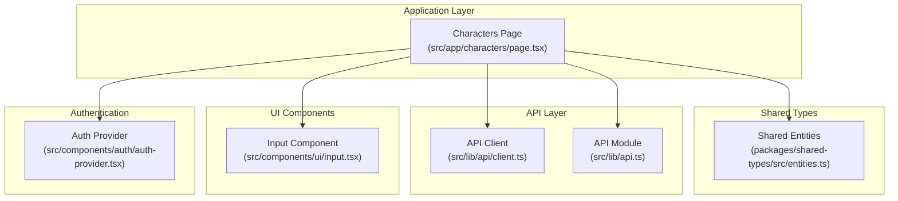
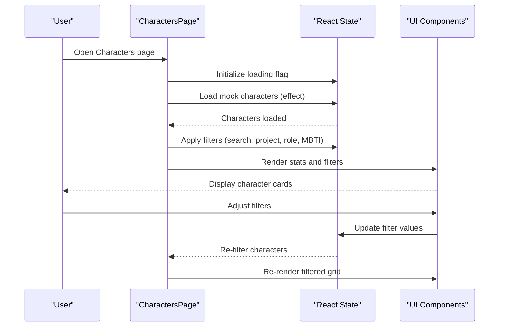
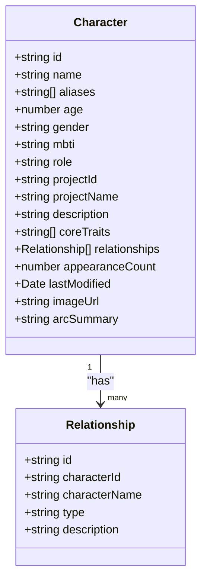
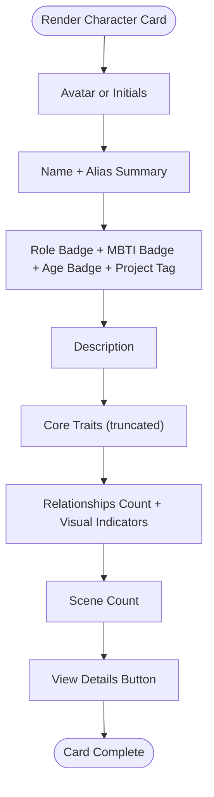
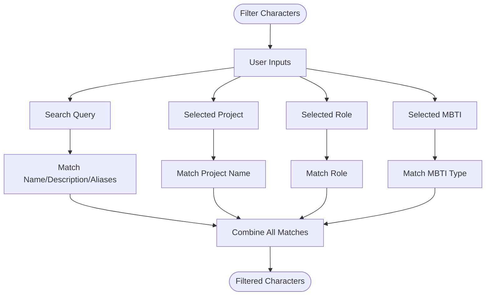
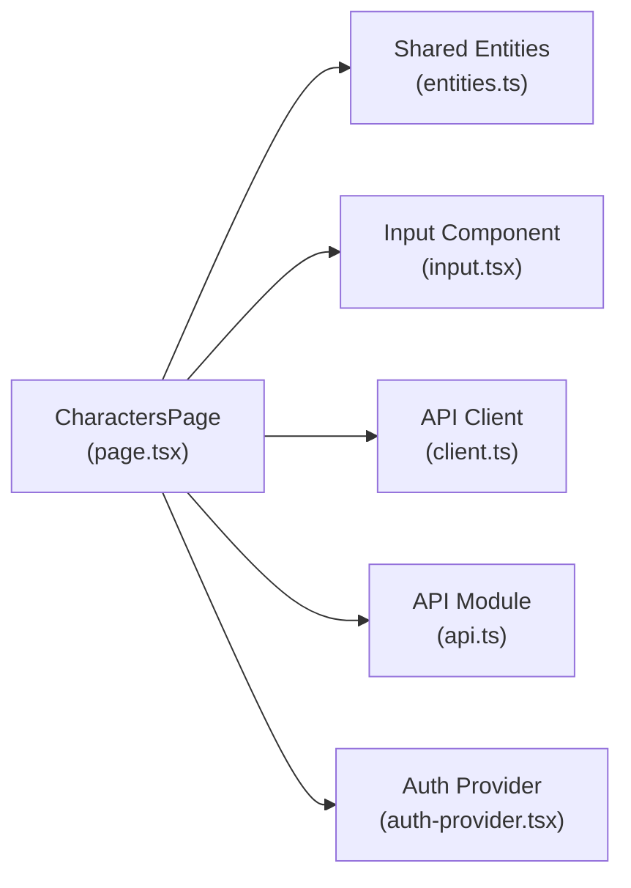

# Character Profile Management

<cite>
**Referenced Files in This Document**
- [page.tsx](file://src/app/characters/page.tsx)
- [entities.ts](file://packages/shared-types/src/entities.ts)
- [api.ts](file://src/lib/api.ts)
- [client.ts](file://src/lib/api/client.ts)
- [auth-provider.tsx](file://src/components/auth/auth-provider.tsx)
- [input.tsx](file://src/components/ui/input.tsx)
</cite>

## Table of Contents
1. [Introduction](#introduction)
2. [Project Structure](#project-structure)
3. [Core Components](#core-components)
4. [Architecture Overview](#architecture-overview)
5. [Detailed Component Analysis](#detailed-component-analysis)
6. [Dependency Analysis](#dependency-analysis)
7. [Performance Considerations](#performance-considerations)
8. [Troubleshooting Guide](#troubleshooting-guide)
9. [Conclusion](#conclusion)

## Introduction
This document describes the character profile management functionality implemented in the application. It covers the character data model, UI presentation, search and filtering capabilities, and outlines the integration points for persistence and authentication. The implementation currently uses mock data and a local UI state, with clear pathways to integrate backend APIs for production use.

## Project Structure
The character management feature is primarily implemented in a single Next.js page component with supporting shared types and API infrastructure.

**Diagram sources**
- [page.tsx](file://src/app/characters/page.tsx#L1-L512)
- [entities.ts](file://packages/shared-types/src/entities.ts#L78-L96)
- [client.ts](file://src/lib/api/client.ts#L1-L138)
- [api.ts](file://src/lib/api.ts#L1-L67)
- [input.tsx](file://src/components/ui/input.tsx#L1-L24)
- [auth-provider.tsx](file://src/components/auth/auth-provider.tsx#L1-L165)

**Section sources**
- [page.tsx](file://src/app/characters/page.tsx#L1-L512)
- [entities.ts](file://packages/shared-types/src/entities.ts#L78-L96)

## Core Components
- Character data model: Defines the shape of character records used across the UI and shared types.
- Character cards: Present character previews with role badges, personality traits, and relationship indicators.
- Filtering and search: Provides project-based, role-based, and MBTI-based filtering alongside free-text search.
- Stats and quick actions: Offers summary metrics and contextual tools for character enhancement.

Key implementation references:
- Character interface definition and mock data population
- Filtering logic for search, project, role, and MBTI
- Character card rendering with avatar, aliases, traits, relationships, and scene counts
- Stats cards and quick action buttons

**Section sources**
- [page.tsx](file://src/app/characters/page.tsx#L31-L54)
- [page.tsx](file://src/app/characters/page.tsx#L80-L183)
- [page.tsx](file://src/app/characters/page.tsx#L187-L196)
- [page.tsx](file://src/app/characters/page.tsx#L198-L318)
- [page.tsx](file://src/app/characters/page.tsx#L345-L393)
- [page.tsx](file://src/app/characters/page.tsx#L484-L509)

## Architecture Overview
The character management UI is structured as a client-side React component with:
- Local state for characters, filters, and UI flags
- Mock data initialization via an effect hook
- Filtering applied to the in-memory dataset
- UI rendering using shared components and icons
- Authentication context integration for user-aware features

**Diagram sources**
- [page.tsx](file://src/app/characters/page.tsx#L70-L183)
- [page.tsx](file://src/app/characters/page.tsx#L187-L196)
- [page.tsx](file://src/app/characters/page.tsx#L320-L512)

## Detailed Component Analysis

### Character Data Model
The character record combines required fields, optional attributes, and metadata:
- Required: id, name, role, description, projectId, projectName, lastModified
- Optional: aliases, age, gender, mbti, imageUrl, arcSummary
- Additional fields: coreTraits, relationships, appearanceCount

**Diagram sources**
- [page.tsx](file://src/app/characters/page.tsx#L31-L54)
- [page.tsx](file://src/app/characters/page.tsx#L43-L49)

**Section sources**
- [page.tsx](file://src/app/characters/page.tsx#L31-L54)

### Character Card Interface
Each character card displays:
- Avatar: Image placeholder or initials circle
- Identity: Name and alias summary
- Role badge: Color-coded role indicator
- MBTI badge: Personality type when present
- Demographic info: Age badge when present
- Project tag: Project name
- Description: Brief summary
- Core traits: Truncated list with count overflow
- Relationships: Count and visual indicators
- Scene count: Number of appearances
- Action: View Details link

**Diagram sources**
- [page.tsx](file://src/app/characters/page.tsx#L198-L318)

**Section sources**
- [page.tsx](file://src/app/characters/page.tsx#L198-L318)

### Search and Filtering
Filtering is applied to the in-memory character list:
- Search: Name, description, or aliases
- Project: Project name dropdown
- Role: Protagonist, Antagonist, Supporting, Minor
- MBTI: From a predefined list of 16 personality types

**Diagram sources**
- [page.tsx](file://src/app/characters/page.tsx#L74-L78)
- [page.tsx](file://src/app/characters/page.tsx#L187-L196)
- [page.tsx](file://src/app/characters/page.tsx#L411-L443)

**Section sources**
- [page.tsx](file://src/app/characters/page.tsx#L187-L196)
- [page.tsx](file://src/app/characters/page.tsx#L411-L443)

### Practical Examples of Creating Diverse Character Types
The mock dataset demonstrates four distinct character archetypes:
- Protagonist: Central hero with rich traits and multiple relationships
- Supporting: Important ally/enemy with focused traits
- Antagonist: Clear opposing force with compelling motivation
- Minor: Background character with concise profile

These examples illustrate how to populate the character model fields effectively for different narrative roles.

**Section sources**
- [page.tsx](file://src/app/characters/page.tsx#L82-L179)

### Character Creation Workflow
The current implementation uses mock data and a "New Character" navigation link. A production workflow would typically involve:
- Form with required fields (name, role, description) and optional attributes (aliases, age, gender, mbti)
- Validation for required fields and acceptable ranges (e.g., positive age)
- Submission to backend API via the API client
- Persistence of profile metadata (projectId, projectName, lastModified)
- Image upload handling and avatar management
- Relationship creation and appearance counting

Note: The current page does not include a dedicated creation form; navigation to "/characters/new" is present but not implemented in the provided code.

**Section sources**
- [page.tsx](file://src/app/characters/page.tsx#L335-L340)
- [page.tsx](file://src/app/characters/page.tsx#L466-L472)

### Data Persistence Patterns
The application includes two API clients:
- Axios-based client with request/response interceptors for authentication and error handling
- A generic ApiClient wrapper offering typed methods and upload support

Integration points:
- Use the API client to fetch and persist characters
- Implement upload endpoint for character images
- Maintain lastModified timestamps on updates

**Section sources**
- [api.ts](file://src/lib/api.ts#L1-L67)
- [client.ts](file://src/lib/api/client.ts#L1-L138)

### Authentication Integration
The page consumes the authentication context to access user information. This enables user-aware features and future integrations with user-scoped character collections.

**Section sources**
- [page.tsx](file://src/app/characters/page.tsx#L71)
- [auth-provider.tsx](file://src/components/auth/auth-provider.tsx#L1-L165)

## Dependency Analysis
The character page depends on:
- Shared entity types for consistent typing
- UI components for inputs and cards
- API clients for network operations
- Authentication provider for user context

**Diagram sources**
- [page.tsx](file://src/app/characters/page.tsx#L1-L29)
- [entities.ts](file://packages/shared-types/src/entities.ts#L78-L96)
- [input.tsx](file://src/components/ui/input.tsx#L1-L24)
- [client.ts](file://src/lib/api/client.ts#L1-L138)
- [api.ts](file://src/lib/api.ts#L1-L67)
- [auth-provider.tsx](file://src/components/auth/auth-provider.tsx#L1-L165)

**Section sources**
- [page.tsx](file://src/app/characters/page.tsx#L1-L29)
- [entities.ts](file://packages/shared-types/src/entities.ts#L78-L96)

## Performance Considerations
- Current filtering runs on the client against a small mock dataset; performance remains excellent.
- For larger datasets, consider server-side filtering and pagination.
- Debounce search input to reduce re-computation frequency.
- Virtualize the character grid to limit DOM nodes when lists grow.

## Troubleshooting Guide
Common issues and resolutions:
- Empty results after filtering: Verify filter values and ensure data contains matching entries.
- Authentication errors: Confirm tokens are present and refreshed; check interceptor logs.
- Image display problems: Validate image URLs and ensure fallback avatar renders when missing.
- Form validation: Implement required field checks and range validations for numeric fields.

**Section sources**
- [page.tsx](file://src/app/characters/page.tsx#L453-L474)
- [api.ts](file://src/lib/api.ts#L24-L65)
- [client.ts](file://src/lib/api/client.ts#L18-L81)

## Conclusion
The character profile management feature provides a robust foundation for displaying and organizing character data with rich UI elements and flexible filtering. The current implementation uses mock data and local state, with clear integration points for backend APIs and authentication. Extending the feature to include a full creation workflow, persistent storage, and advanced relationship mapping will complete the character lifecycle management within the platform.