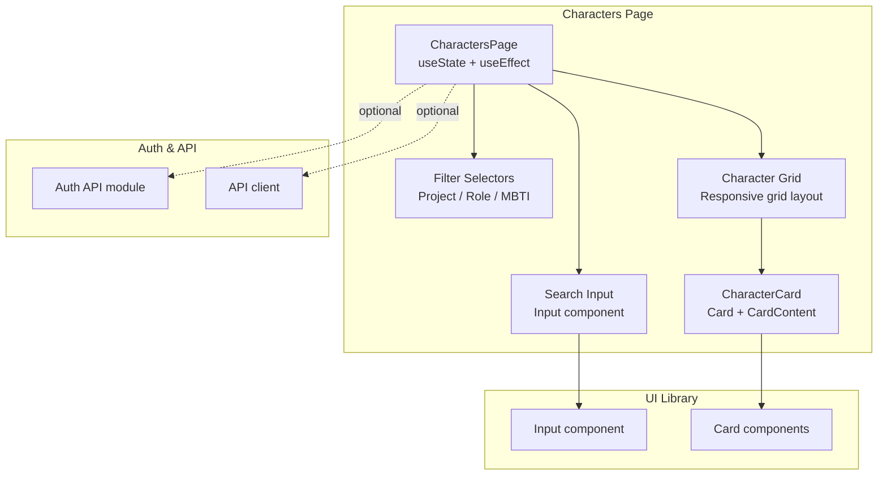
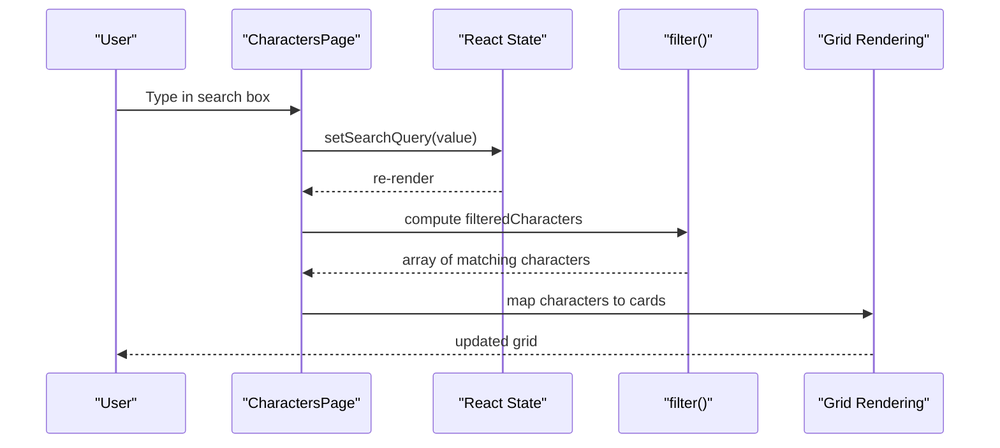
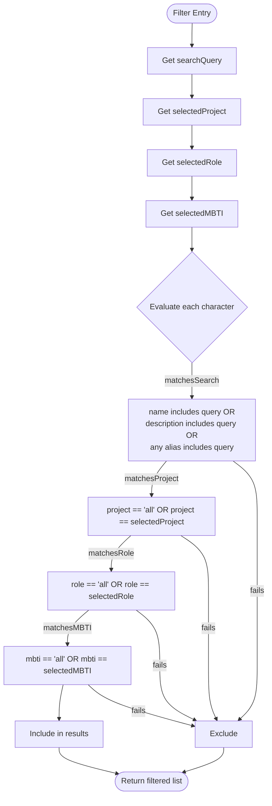
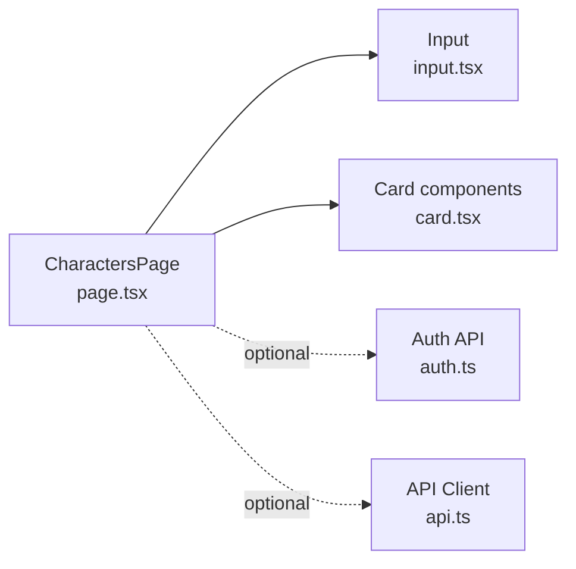

# Character Search & Filtering

<cite>
**Referenced Files in This Document**
- [page.tsx](file://src/app/characters/page.tsx)
- [input.tsx](file://src/components/ui/input.tsx)
- [card.tsx](file://src/components/ui/card.tsx)
- [api.ts](file://src/lib/api.ts)
- [auth.ts](file://src/lib/api/auth.ts)
</cite>

## Table of Contents
1. [Introduction](#introduction)
2. [Project Structure](#project-structure)
3. [Core Components](#core-components)
4. [Architecture Overview](#architecture-overview)
5. [Detailed Component Analysis](#detailed-component-analysis)
6. [Dependency Analysis](#dependency-analysis)
7. [Performance Considerations](#performance-considerations)
8. [Troubleshooting Guide](#troubleshooting-guide)
9. [Conclusion](#conclusion)
10. [Appendices](#appendices)

## Introduction
This document explains the character search and filtering capabilities implemented in the Characters page. It covers the multi-criteria filtering system (text search across names, descriptions, and aliases, project-based filtering, role-based categorization, and MBTI personality type filtering), the search algorithm and matching criteria, the filter UI components, and the character grid display. It also provides guidance on filter state management, URL parameter synchronization, search result ranking, and practical examples of complex queries. Finally, it outlines considerations for scaling to larger datasets, including lazy loading and infinite scroll.

## Project Structure
The Characters page is implemented as a single-page Next.js route component with local state and mock data. It composes UI primitives for inputs and cards, and renders a responsive grid of character cards. Authentication and API utilities are available for future integration with server-side data.

**Diagram sources**
- [page.tsx](file://src/app/characters/page.tsx#L70-L183)
- [input.tsx](file://src/components/ui/input.tsx#L1-L24)
- [card.tsx](file://src/components/ui/card.tsx#L1-L78)
- [api.ts](file://src/lib/api.ts#L1-L67)
- [auth.ts](file://src/lib/api/auth.ts#L1-L56)

**Section sources**
- [page.tsx](file://src/app/characters/page.tsx#L1-L512)

## Core Components
- CharactersPage: Hosts state for characters, search query, and filters; computes filtered results; renders stats, filters, and character grid.
- CharacterCard: Renders a single character’s metadata, traits, relationships preview, and action link.
- UI Input: Styled text input used for search with an icon inside the input field.
- UI Card: Reusable card components for stats and content areas.

Key responsibilities:
- State management: searchQuery, selectedProject, selectedRole, selectedMBTI, loading, and characters.
- Filtering: filter function evaluates four conditions combined with logical AND.
- Rendering: responsive grid layout with Tailwind classes; skeleton/loading and empty states.

**Section sources**
- [page.tsx](file://src/app/characters/page.tsx#L70-L196)
- [input.tsx](file://src/components/ui/input.tsx#L1-L24)
- [card.tsx](file://src/components/ui/card.tsx#L1-L78)

## Architecture Overview
The filtering pipeline runs on the client side using React state and array filtering. The UI is composed of reusable components, and the page uses Tailwind for responsive layouts.

**Diagram sources**
- [page.tsx](file://src/app/characters/page.tsx#L70-L196)

## Detailed Component Analysis

### Search Algorithm and Matching Criteria
The filtering logic applies four conditions combined with logical AND:
- Text search: matches name, description, or any alias (case-insensitive substring match).
- Project filter: matches either “All Projects” or the exact project name.
- Role filter: matches either “All Roles” or the exact role.
- MBTI filter: matches either “All Personalities” or the exact MBTI type.

**Diagram sources**
- [page.tsx](file://src/app/characters/page.tsx#L187-L196)

Practical examples of complex queries:
- Find all protagonists named Elena across all projects: set searchQuery to “Elena”, selectedRole to “protagonist”, selectedProject to “all”.
- Find INFJ antagonists in “The Dragon’s Legacy”: set selectedMBTI to “INFJ”, selectedRole to “antagonist”, selectedProject to “The Dragon’s Legacy”.
- Find characters with “witch” in description or aliases: set searchQuery to “witch”, leave other filters at “all”.

Ranking and ordering:
- The current implementation does not apply explicit ranking beyond the order of the original dataset. To add ranking, introduce a scoring function and sort the filtered list.

**Section sources**
- [page.tsx](file://src/app/characters/page.tsx#L187-L196)

### Filter UI Components
- Search input with icon: a relative container with an embedded Search icon and an Input component. The Input uses a left-aligned padding to accommodate the icon.
- Dropdown selectors:
  - Project selector: lists unique project names derived from the dataset.
  - Role selector: predefined roles including protagonist, antagonist, supporting, minor.
  - MBTI selector: predefined MBTI types.

Real-time updates:
- Each change triggers a re-computation of filteredCharacters and immediate UI update.

Accessibility and UX:
- Placeholder text guides users.
- Clear “All” options reset filters.

**Section sources**
- [page.tsx](file://src/app/characters/page.tsx#L395-L446)
- [input.tsx](file://src/components/ui/input.tsx#L1-L24)

### Character Grid Display
- Responsive layout: uses Tailwind grid classes to adapt from 1 to 3 columns based on viewport width.
- Lazy loading and infinite scroll considerations:
  - Current implementation renders all filtered characters immediately.
  - For large datasets, implement virtualized rendering (render only visible items) or infinite scroll (append pages of results as the user scrolls).
- Empty and loading states:
  - Loading spinner while mock data initializes.
  - Friendly empty state with optional CTA when no results match filters.

**Section sources**
- [page.tsx](file://src/app/characters/page.tsx#L448-L481)

### Filter State Management and URL Parameter Synchronization
- Current state: managed entirely in component state (no URL sync).
- Recommended approach:
  - Use URL search params to reflect filters (e.g., q, project, role, mbti).
  - On mount, parse URL params into state.
  - On state changes, update URL params via router.replace or window.history.pushState.
  - Ensure backward compatibility by falling back to defaults when params are missing.

Benefits:
- Shareable links for complex queries.
- Bookmarking and deep linking.
- Improved navigation and sharing workflows.

[No sources needed since this section provides general guidance]

### Authentication and API Integration Hooks
- Authentication: the page imports an auth hook to access user context.
- API client: a shared Axios client handles base URL, auth tokens, and response interception for token refresh.
- Auth endpoints: login, signup, logout, refresh, and profile retrieval are exposed via typed API module.

These utilities enable seamless integration with backend APIs for fetching and persisting character data in the future.

**Section sources**
- [page.tsx](file://src/app/characters/page.tsx#L29-L29)
- [api.ts](file://src/lib/api.ts#L1-L67)
- [auth.ts](file://src/lib/api/auth.ts#L1-L56)

## Dependency Analysis
The Characters page depends on:
- Local state and filtering logic.
- UI components for inputs and cards.
- Optional auth and API modules for backend integration.

**Diagram sources**
- [page.tsx](file://src/app/characters/page.tsx#L1-L512)
- [input.tsx](file://src/components/ui/input.tsx#L1-L24)
- [card.tsx](file://src/components/ui/card.tsx#L1-L78)
- [api.ts](file://src/lib/api.ts#L1-L67)
- [auth.ts](file://src/lib/api/auth.ts#L1-L56)

**Section sources**
- [page.tsx](file://src/app/characters/page.tsx#L1-L512)

## Performance Considerations
Current state:
- Filtering runs on the client with in-memory arrays.
- Rendering all matched items at once.

Recommendations for large datasets:
- Virtualization: render only visible rows/columns.
- Debouncing: debounce search input to reduce re-filtering frequency.
- Pagination/infinite scroll: fetch and append batches of results.
- Memoization: memoize computed filters and derived lists.
- Preprocessing: normalize text (lowercase) and index searchable fields for faster lookups.

[No sources needed since this section provides general guidance]

## Troubleshooting Guide
Common issues and resolutions:
- No results after applying filters:
  - Verify that the selected project or role exists in the dataset.
  - Confirm the search term is not overly restrictive; try broadening filters.
- MBTI filter not matching:
  - Ensure the MBTI value matches exactly (case-sensitive) against the predefined list.
- Slow filtering with large datasets:
  - Implement debouncing and virtualization as described above.
- URL parameter synchronization:
  - Add URL sync logic to persist filters and restore them on load.

**Section sources**
- [page.tsx](file://src/app/characters/page.tsx#L187-L196)

## Conclusion
The Characters page provides a robust, real-time multi-criteria filtering system with a clean UI and responsive grid. The current implementation is ideal for small to medium datasets. For large-scale usage, integrate backend APIs, add URL parameter synchronization, and implement virtualization or pagination to maintain responsiveness and usability.

[No sources needed since this section summarizes without analyzing specific files]

## Appendices

### Practical Examples of Complex Queries
- Find INFJ characters who are protagonists and appear in “The Dragon’s Legacy” project.
- Search for “witch” in names, descriptions, or aliases; combine with role “antagonist”.
- Narrow by project “Cyber Shadows” and MBTI “INTP” while keeping search broad.

[No sources needed since this section provides general guidance]