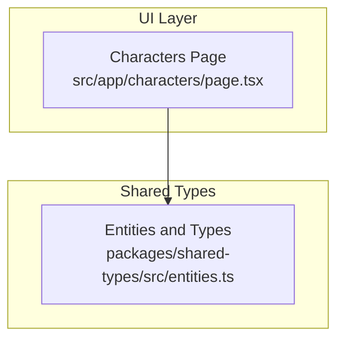
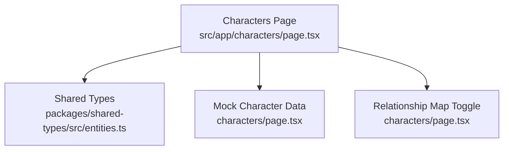
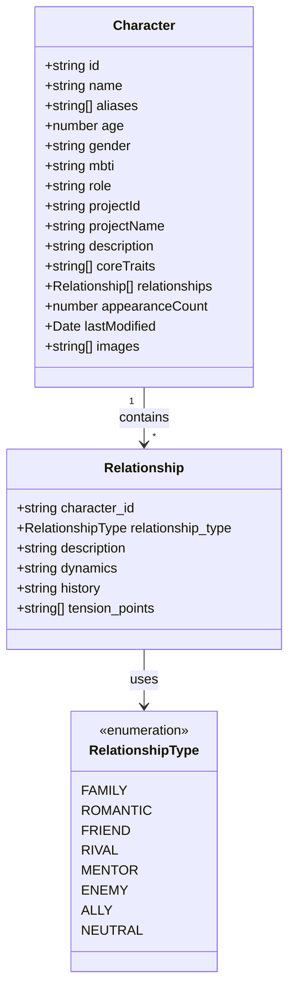
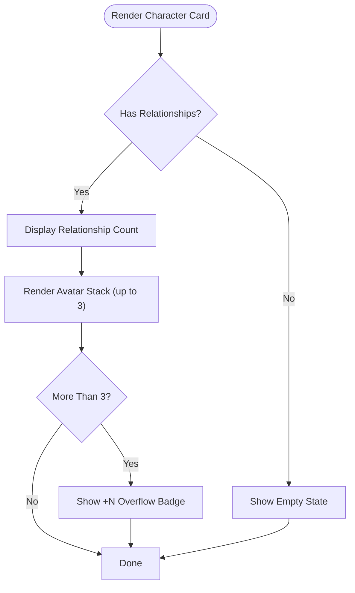
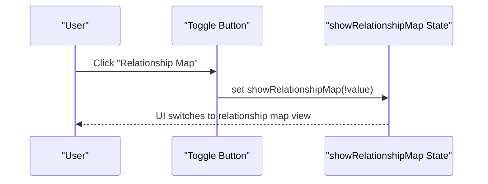
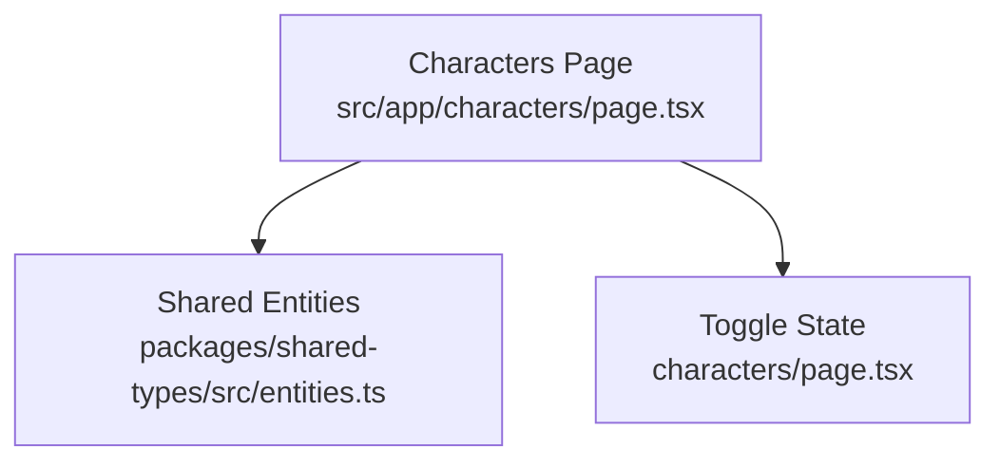

# Relationship Mapping System

<cite>
**Referenced Files in This Document**
- [README.md](file://README.md)
- [characters/page.tsx](file://src/app/characters/page.tsx)
- [entities.ts](file://packages/shared-types/src/entities.ts)
- [analytics/page.tsx](file://src/app/analytics/page.tsx)
</cite>

## Table of Contents
1. [Introduction](#introduction)
2. [Project Structure](#project-structure)
3. [Core Components](#core-components)
4. [Architecture Overview](#architecture-overview)
5. [Detailed Component Analysis](#detailed-component-analysis)
6. [Dependency Analysis](#dependency-analysis)
7. [Performance Considerations](#performance-considerations)
8. [Troubleshooting Guide](#troubleshooting-guide)
9. [Conclusion](#conclusion)

## Introduction
This document describes the character relationship mapping system implemented in the WorldBest platform. It covers the relationship data model, visualization approaches (avatar stacks, relationship counts, and interactive cards), supported relationship types, and practical guidance for building compelling character dynamics. It also documents the relationship map view toggle functionality and outlines analytics capabilities for tracking relationship frequency and strength indicators. Guidance is included for establishing connections, adding descriptive notes, managing complex networks, and performing relationship deletion, modification, and bulk operations.

## Project Structure
The relationship mapping system spans the Characters page and shared type definitions:
- The Characters page renders character cards with relationship avatars and provides a toggle to switch to a relationship map view.
- Shared types define the canonical Relationship entity and RelationshipType enumeration used across the platform.

**Diagram sources**
- [characters/page.tsx](file://src/app/characters/page.tsx#L70-L183)
- [entities.ts](file://packages/shared-types/src/entities.ts#L78-L132)

**Section sources**
- [characters/page.tsx](file://src/app/characters/page.tsx#L70-L183)
- [entities.ts](file://packages/shared-types/src/entities.ts#L78-L132)

## Core Components
- Relationship data structure: The Relationship entity includes character_id, relationship_type, description, dynamics, history, and tension_points. The Character entity embeds an array of Relationship objects.
- Relationship types: The RelationshipType enumeration defines family, romantic, friend, rival, mentor, enemy, ally, and neutral.
- UI integration: The Characters page displays relationship avatars via stacked avatars, shows relationship counts, and toggles a relationship map view.

Key implementation references:
- Relationship entity definition and fields: [Relationship interface](file://packages/shared-types/src/entities.ts#L125-L132)
- RelationshipType enumeration: [RelationshipType enum](file://packages/shared-types/src/entities.ts#L411-L420)
- Character relationships field: [Character.relationships](file://packages/shared-types/src/entities.ts#L92)
- Relationship visualization in character cards: [Avatar stack and counts](file://src/app/characters/page.tsx#L275-L300)
- Relationship map toggle: [Toggle button and state](file://src/app/characters/page.tsx#L78-L334)

**Section sources**
- [entities.ts](file://packages/shared-types/src/entities.ts#L125-L132)
- [entities.ts](file://packages/shared-types/src/entities.ts#L411-L420)
- [entities.ts](file://packages/shared-types/src/entities.ts#L92)
- [characters/page.tsx](file://src/app/characters/page.tsx#L275-L300)
- [characters/page.tsx](file://src/app/characters/page.tsx#L78-L334)

## Architecture Overview
The relationship mapping system integrates UI rendering with shared type definitions. The Characters page consumes mock data to demonstrate relationship visualization and provides a toggle to switch to a relationship map view. Shared types define the canonical relationship model used across the platform.

**Diagram sources**
- [characters/page.tsx](file://src/app/characters/page.tsx#L70-L183)
- [characters/page.tsx](file://src/app/characters/page.tsx#L78-L334)
- [entities.ts](file://packages/shared-types/src/entities.ts#L78-L132)

**Section sources**
- [characters/page.tsx](file://src/app/characters/page.tsx#L70-L183)
- [characters/page.tsx](file://src/app/characters/page.tsx#L78-L334)
- [entities.ts](file://packages/shared-types/src/entities.ts#L78-L132)

## Detailed Component Analysis

### Relationship Data Model
The Relationship entity encapsulates the core attributes of a character relationship:
- character_id: Identifies the related character.
- relationship_type: Enumerated type indicating the nature of the relationship.
- description: Optional free-text description of the relationship.
- dynamics: Optional field for describing evolving dynamics.
- history: Optional field for historical context.
- tension_points: Optional array of tension-related notes.

**Diagram sources**
- [entities.ts](file://packages/shared-types/src/entities.ts#L78-L96)
- [entities.ts](file://packages/shared-types/src/entities.ts#L125-L132)
- [entities.ts](file://packages/shared-types/src/entities.ts#L411-L420)

**Section sources**
- [entities.ts](file://packages/shared-types/src/entities.ts#L78-L96)
- [entities.ts](file://packages/shared-types/src/entities.ts#L125-L132)
- [entities.ts](file://packages/shared-types/src/entities.ts#L411-L420)

### Relationship Visualization in Character Cards
The Characters page renders relationship avatars using a stacked avatar pattern and displays the total relationship count. This provides immediate visual insight into character connectivity.

**Diagram sources**
- [characters/page.tsx](file://src/app/characters/page.tsx#L275-L300)

**Section sources**
- [characters/page.tsx](file://src/app/characters/page.tsx#L275-L300)

### Relationship Map View Toggle
The Characters page includes a toggle button that switches the view to a relationship map. This toggle controls a boolean state that can be wired to render a dedicated relationship map component.

**Diagram sources**
- [characters/page.tsx](file://src/app/characters/page.tsx#L78-L334)

**Section sources**
- [characters/page.tsx](file://src/app/characters/page.tsx#L78-L334)

### Practical Examples and Workflows
Establishing character connections:
- Add a new Relationship entry to a Character's relationships array with a valid relationship_type and description.
- Reference another Character by character_id to create bidirectional awareness.

Adding relationship descriptions:
- Populate the description field with concise narrative context.
- Use dynamics and history fields for deeper relationship evolution tracking.

Managing complex relationship networks:
- Use the filter controls (project, role, MBTI) to navigate dense relationship graphs.
- Leverage the relationship count display to quickly assess network density.

Relationship analytics and strength indicators:
- Current analytics dashboard focuses on writing metrics. Relationship-specific analytics (frequency, strength) can be integrated by extending the analytics module to consume relationship data from Characters.

**Section sources**
- [characters/page.tsx](file://src/app/characters/page.tsx#L78-L183)
- [entities.ts](file://packages/shared-types/src/entities.ts#L125-L132)
- [analytics/page.tsx](file://src/app/analytics/page.tsx#L93-L156)

### Relationship Deletion, Modification, and Bulk Operations
- Deletion: Remove a Relationship entry from a Character's relationships array by filtering out the target relationship_id.
- Modification: Update fields such as relationship_type, description, dynamics, history, and tension_points for a given relationship_id.
- Bulk operations: Apply modifications across multiple characters by iterating through Characters and updating matching relationships; use batch updates to minimize re-renders.

Note: These operations are conceptual guidance based on the current data model and UI structure. Implementation details depend on the chosen state management and persistence strategy.

## Dependency Analysis
The Characters page depends on shared type definitions for type-safe relationship modeling. The relationship map view toggle introduces a UI state dependency that can be extended to render a dedicated relationship map component.

**Diagram sources**
- [characters/page.tsx](file://src/app/characters/page.tsx#L70-L183)
- [entities.ts](file://packages/shared-types/src/entities.ts#L78-L132)

**Section sources**
- [characters/page.tsx](file://src/app/characters/page.tsx#L70-L183)
- [entities.ts](file://packages/shared-types/src/entities.ts#L78-L132)

## Performance Considerations
- Relationship visualization: Avatar stacking and overflow badges are lightweight; performance remains strong for typical character counts.
- Filtering and sorting: The current UI filters characters client-side; for large datasets, consider pagination or server-side filtering.
- Relationship map rendering: When implementing the relationship map view, prefer virtualization and incremental rendering for scalability.

## Troubleshooting Guide
Common issues and resolutions:
- Missing relationship avatars: Verify that the relationships array is populated and character_name is set for each relationship.
- Incorrect relationship counts: Ensure the relationships array length matches the displayed count.
- Toggle not switching views: Confirm the toggle handler updates the state and that the UI responds accordingly.

**Section sources**
- [characters/page.tsx](file://src/app/characters/page.tsx#L275-L300)
- [characters/page.tsx](file://src/app/characters/page.tsx#L78-L334)

## Conclusion
The relationship mapping system leverages a clear data model and intuitive UI patterns to visualize character connections. The Characters page demonstrates avatar stacks, relationship counts, and a relationship map toggle. By extending the analytics module and implementing robust CRUD operations, teams can build compelling character dynamics while maintaining clarity and manageability across complex relationship networks.