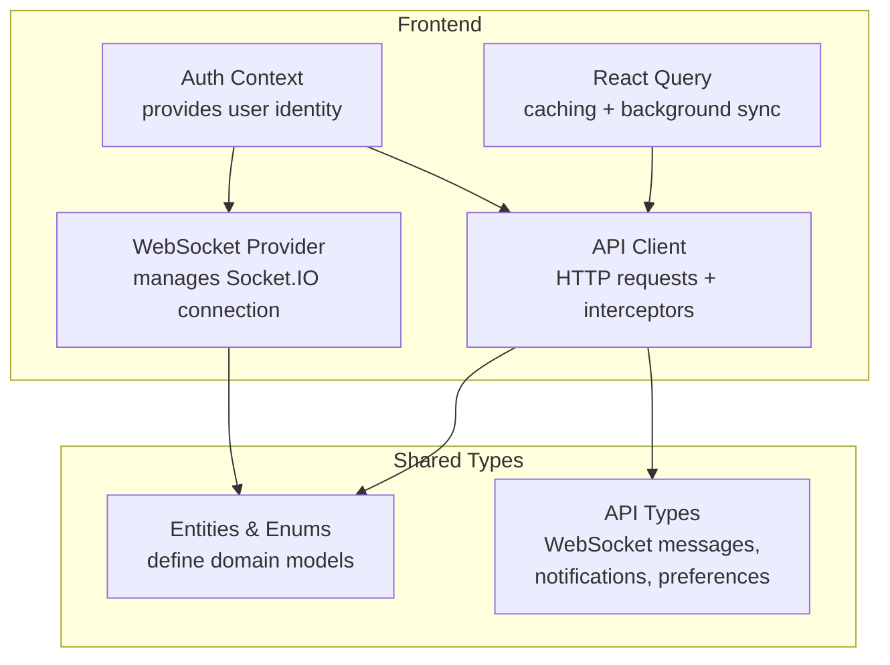
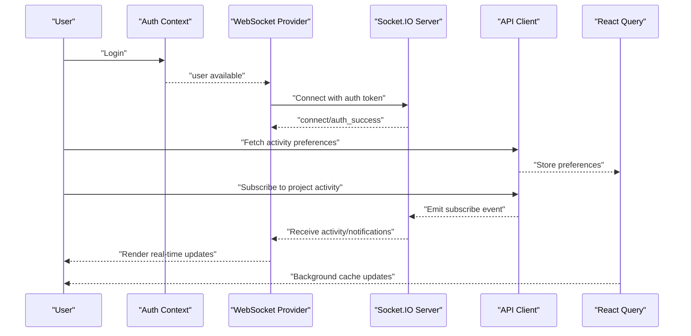
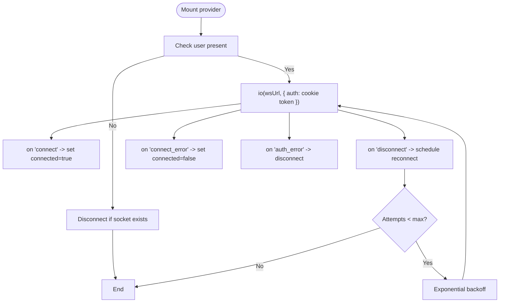
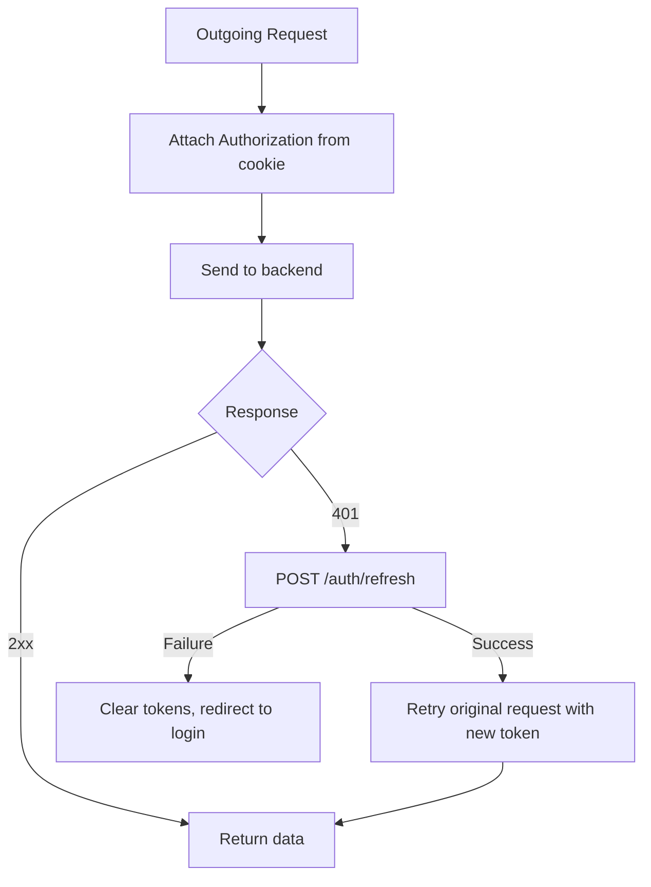
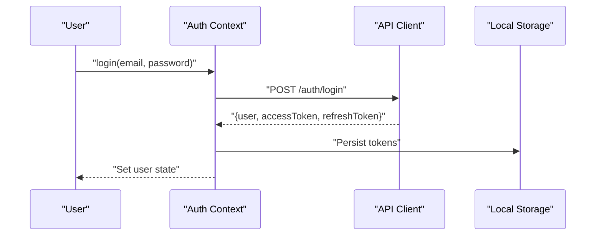
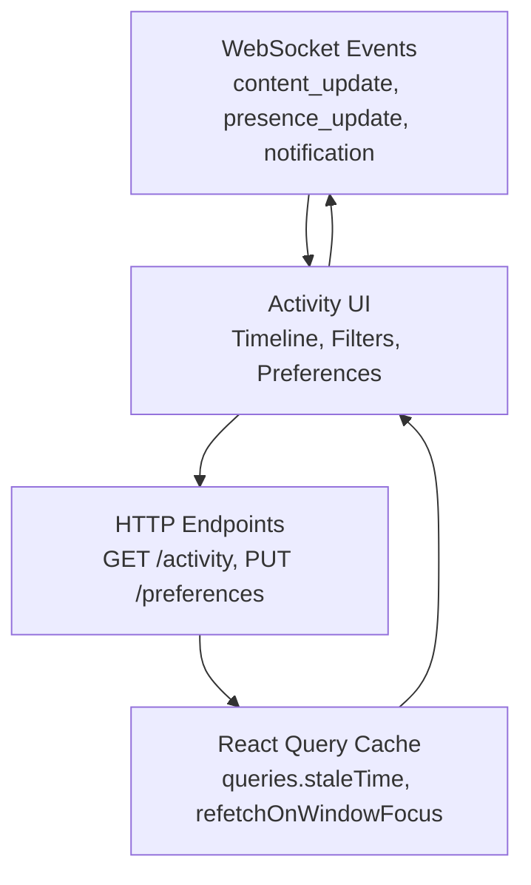
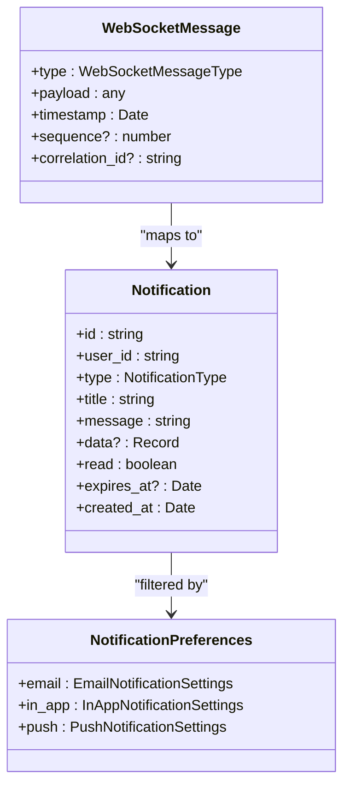
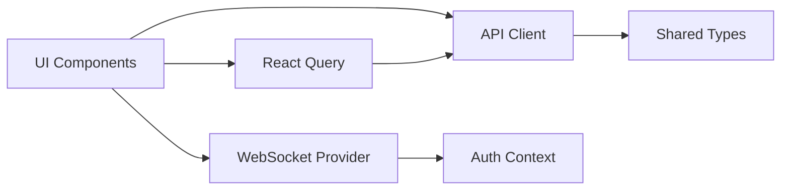

# Activity Feed

<cite>
**Referenced Files in This Document**
- [README.md](file://README.md)
- [IMPLEMENTATION_PLAN.md](file://IMPLEMENTATION_PLAN.md)
- [websocket-provider.tsx](file://src/components/websocket/websocket-provider.tsx)
- [api.ts](file://src/lib/api.ts)
- [client.ts](file://src/lib/api/client.ts)
- [auth-context.tsx](file://src/contexts/auth-context.tsx)
- [providers.tsx](file://src/app/providers.tsx)
- [entities.ts](file://packages/shared-types/src/entities.ts)
- [enums.ts](file://packages/shared-types/src/enums.ts)
- [api.ts (shared-types)](file://packages/shared-types/src/api.ts)
</cite>

## Table of Contents
1. [Introduction](#introduction)
2. [Project Structure](#project-structure)
3. [Core Components](#core-components)
4. [Architecture Overview](#architecture-overview)
5. [Detailed Component Analysis](#detailed-component-analysis)
6. [Dependency Analysis](#dependency-analysis)
7. [Performance Considerations](#performance-considerations)
8. [Troubleshooting Guide](#troubleshooting-guide)
9. [Conclusion](#conclusion)
10. [Appendices](#appendices)

## Introduction
This document describes the real-time activity feed system for collaborative workspace notifications and activity tracking. It explains the activity stream architecture, event categorization, and notification delivery mechanisms. It documents the integration with WebSocket events, real-time activity updates, and user-specific activity filtering. It also covers activity types such as edits, comments, mentions, and collaborative actions, along with practical examples of activity timeline display, notification preferences, and activity aggregation. Backend activity logging, performance optimization for high-frequency updates, and scalability considerations for large collaborative projects are addressed. User preference management, activity export capabilities, and integration with external notification systems are outlined, alongside UI patterns for activity display, real-time updates, and user engagement tracking.

## Project Structure
The activity feed system is built on top of:
- A WebSocket provider that manages real-time connections and emits/receives events
- An API client that handles authentication and HTTP requests
- Shared type definitions that define activity and notification schemas
- Authentication context that provides user identity to the WebSocket layer
- React Query for server state caching and background synchronization

**Diagram sources**
- [websocket-provider.tsx](file://src/components/websocket/websocket-provider.tsx#L1-L138)
- [api.ts](file://src/lib/api.ts#L1-L67)
- [client.ts](file://src/lib/api/client.ts#L1-L138)
- [auth-context.tsx](file://src/contexts/auth-context.tsx#L1-L154)
- [providers.tsx](file://src/app/providers.tsx#L1-L37)
- [entities.ts](file://packages/shared-types/src/entities.ts#L1-L458)
- [enums.ts](file://packages/shared-types/src/enums.ts#L1-L241)
- [api.ts (shared-types)](file://packages/shared-types/src/api.ts#L62-L409)

**Section sources**
- [README.md](file://README.md#L49-L72)
- [IMPLEMENTATION_PLAN.md](file://IMPLEMENTATION_PLAN.md#L297-L301)
- [websocket-provider.tsx](file://src/components/websocket/websocket-provider.tsx#L1-L138)
- [api.ts](file://src/lib/api.ts#L1-L67)
- [client.ts](file://src/lib/api/client.ts#L1-L138)
- [auth-context.tsx](file://src/contexts/auth-context.tsx#L1-L154)
- [providers.tsx](file://src/app/providers.tsx#L1-L37)
- [entities.ts](file://packages/shared-types/src/entities.ts#L1-L458)
- [enums.ts](file://packages/shared-types/src/enums.ts#L1-L241)
- [api.ts (shared-types)](file://packages/shared-types/src/api.ts#L62-L409)

## Core Components
- WebSocket Provider: Establishes and maintains a Socket.IO connection, authenticates via cookie, and exposes emit/on/off APIs for real-time collaboration and notifications.
- API Client: Provides typed HTTP client with request/response interceptors for authentication and error handling.
- Authentication Context: Supplies user identity to the WebSocket provider to conditionally connect/disconnect and filter events.
- Shared Types: Define activity/notification models, categories, and preferences used across the system.
- React Query: Manages server state caching and background synchronization for activity lists and preferences.

Key responsibilities:
- Real-time event emission and reception for collaboration and notifications
- User-specific filtering and subscription scoping
- Authentication and re-authentication flows
- Structured activity and notification schemas

**Section sources**
- [websocket-provider.tsx](file://src/components/websocket/websocket-provider.tsx#L17-L138)
- [api.ts](file://src/lib/api.ts#L10-L67)
- [client.ts](file://src/lib/api/client.ts#L18-L81)
- [auth-context.tsx](file://src/contexts/auth-context.tsx#L30-L154)
- [entities.ts](file://packages/shared-types/src/entities.ts#L322-L335)
- [api.ts (shared-types)](file://packages/shared-types/src/api.ts#L382-L409)

## Architecture Overview
The activity feed architecture integrates WebSocket events with HTTP-based preferences and server-side activity logs. The WebSocket provider connects using the current auth cookie and emits/receives collaboration and notification events. The API client handles authentication and retries, while React Query caches activity streams and preferences.

**Diagram sources**
- [auth-context.tsx](file://src/contexts/auth-context.tsx#L57-L125)
- [websocket-provider.tsx](file://src/components/websocket/websocket-provider.tsx#L35-L93)
- [client.ts](file://src/lib/api/client.ts#L18-L81)
- [providers.tsx](file://src/app/providers.tsx#L10-L20)

## Detailed Component Analysis

### WebSocket Provider
The WebSocket provider creates a Socket.IO connection, authenticates using the current session cookie, and exposes emit/on/off APIs. It auto-reconnects with exponential backoff and handles auth errors.

**Diagram sources**
- [websocket-provider.tsx](file://src/components/websocket/websocket-provider.tsx#L24-L93)

**Section sources**
- [websocket-provider.tsx](file://src/components/websocket/websocket-provider.tsx#L17-L138)

### API Client and Interceptors
The API client centralizes HTTP requests with:
- Request interceptor attaching Authorization header from cookie
- Response interceptor handling 401 with token refresh
- Consistent error transformation for UI consumption

**Diagram sources**
- [client.ts](file://src/lib/api/client.ts#L18-L81)

**Section sources**
- [client.ts](file://src/lib/api/client.ts#L1-L138)

### Authentication Context
The authentication context manages login, signup, logout, and token refresh. It ensures the API client and WebSocket provider receive consistent user state.

**Diagram sources**
- [auth-context.tsx](file://src/contexts/auth-context.tsx#L57-L91)

**Section sources**
- [auth-context.tsx](file://src/contexts/auth-context.tsx#L1-L154)

### Shared Types: Entities, Enums, and API Types
Shared types define:
- Domain entities (projects, chapters, scenes, text versions)
- Enumerations (roles, statuses, preferences)
- API types for WebSocket messages, notifications, and preferences

These types inform activity categorization and notification delivery.

**Section sources**
- [entities.ts](file://packages/shared-types/src/entities.ts#L322-L335)
- [enums.ts](file://packages/shared-types/src/enums.ts#L404-L420)
- [api.ts (shared-types)](file://packages/shared-types/src/api.ts#L382-L409)

### Activity Stream Architecture
The activity feed architecture combines:
- WebSocket events for real-time collaboration updates
- HTTP endpoints for preferences and historical activity
- React Query for caching and background synchronization

**Diagram sources**
- [IMPLEMENTATION_PLAN.md](file://IMPLEMENTATION_PLAN.md#L297-L301)
- [providers.tsx](file://src/app/providers.tsx#L13-L18)

**Section sources**
- [IMPLEMENTATION_PLAN.md](file://IMPLEMENTATION_PLAN.md#L297-L301)
- [providers.tsx](file://src/app/providers.tsx#L1-L37)

### Event Categorization and Notification Delivery
Events are categorized by type and delivered through:
- WebSocket message types for real-time updates
- Notification categories for in-app, email, and push channels
- Preference-driven filtering per user and project

**Diagram sources**
- [api.ts (shared-types)](file://packages/shared-types/src/api.ts#L77-L83)
- [api.ts (shared-types)](file://packages/shared-types/src/api.ts#L382-L409)
- [api.ts (shared-types)](file://packages/shared-types/src/api.ts#L339-L380)

**Section sources**
- [api.ts (shared-types)](file://packages/shared-types/src/api.ts#L77-L83)
- [api.ts (shared-types)](file://packages/shared-types/src/api.ts#L339-L409)

### Practical Examples

#### Activity Timeline Display
- Fetch recent activity via HTTP endpoint
- Render grouped items by date/time and actor
- Apply user-specific filters (project, type, read/unread)
- Use infinite scroll or cursor-based pagination

#### Notification Preferences
- Enable/disable categories (collaboration, exports, security)
- Choose delivery channels (in-app, email, push)
- Set quiet hours for push notifications

#### Activity Aggregation
- Group frequent edits by the same actor and item
- Collapse identical comments/mentions within a time window
- Highlight mentions and replies distinctly

[No sources needed since this section provides general guidance]

### Real-time Updates and User-Specific Filtering
- Subscribe to project or document-specific channels
- Filter events by user roles and permissions
- Scope presence and selection updates to collaborators only

**Section sources**
- [websocket-provider.tsx](file://src/components/websocket/websocket-provider.tsx#L35-L47)
- [entities.ts](file://packages/shared-types/src/entities.ts#L36-L41)

### Backend Activity Logging and Export
- Log structured activity entries with timestamps and actors
- Provide export endpoints for CSV/JSON with filters and date ranges
- Support batch operations for large datasets

[No sources needed since this section provides general guidance]

### Integration with External Notification Systems
- Webhook endpoints for third-party integrations
- Standardized notification payloads for Slack, email providers, etc.
- Idempotent delivery with correlation IDs

[No sources needed since this section provides general guidance]

## Dependency Analysis
The activity feed system exhibits layered dependencies:
- UI depends on WebSocket provider and API client
- WebSocket provider depends on authentication context
- API client depends on shared types for consistent schemas
- React Query depends on API client for data fetching

**Diagram sources**
- [websocket-provider.tsx](file://src/components/websocket/websocket-provider.tsx#L1-L138)
- [auth-context.tsx](file://src/contexts/auth-context.tsx#L1-L154)
- [client.ts](file://src/lib/api/client.ts#L1-L138)
- [providers.tsx](file://src/app/providers.tsx#L1-L37)

**Section sources**
- [websocket-provider.tsx](file://src/components/websocket/websocket-provider.tsx#L1-L138)
- [auth-context.tsx](file://src/contexts/auth-context.tsx#L1-L154)
- [client.ts](file://src/lib/api/client.ts#L1-L138)
- [providers.tsx](file://src/app/providers.tsx#L1-L37)

## Performance Considerations
- Debounce rapid updates (e.g., cursor movement) to reduce render churn
- Use virtualized lists for long activity timelines
- Apply aggressive caching with appropriate stale times
- Batch WebSocket updates and throttle UI re-renders
- Use background synchronization to avoid blocking the main thread

[No sources needed since this section provides general guidance]

## Troubleshooting Guide
Common issues and resolutions:
- WebSocket disconnects: Verify auth cookie validity and network connectivity; inspect exponential backoff behavior
- 401 responses: Ensure token refresh succeeds and new tokens are persisted
- Missing real-time updates: Confirm subscriptions are established after authentication
- Stale activity data: Adjust React Query staleTime and refetch policies

**Section sources**
- [websocket-provider.tsx](file://src/components/websocket/websocket-provider.tsx#L56-L93)
- [client.ts](file://src/lib/api/client.ts#L43-L67)
- [providers.tsx](file://src/app/providers.tsx#L13-L18)

## Conclusion
The activity feed system leverages a robust WebSocket provider, a resilient API client, and shared type definitions to deliver real-time collaboration updates and notifications. By structuring events around user identity, project context, and preference-driven filtering, the system supports scalable, high-frequency updates while maintaining a responsive UI. Future enhancements should focus on activity aggregation, export capabilities, and integration with external notification systems.

[No sources needed since this section summarizes without analyzing specific files]

## Appendices

### Activity Types and Examples
- Edits: TextVersion creation/update with semantic hashing
- Comments: Threaded discussions with mention support
- Mentions: Direct references to users or entities
- Collaborative actions: Presence updates, selections, and cursor movements

**Section sources**
- [entities.ts](file://packages/shared-types/src/entities.ts#L322-L335)
- [IMPLEMENTATION_PLAN.md](file://IMPLEMENTATION_PLAN.md#L291-L296)

### UI Patterns for Activity Display
- Timeline with grouping by date and actor
- Unread indicators and read/unread toggles
- Quick-action buttons (reply, mark as read, mute)
- Infinite scroll with cursor-based pagination

[No sources needed since this section provides general guidance]