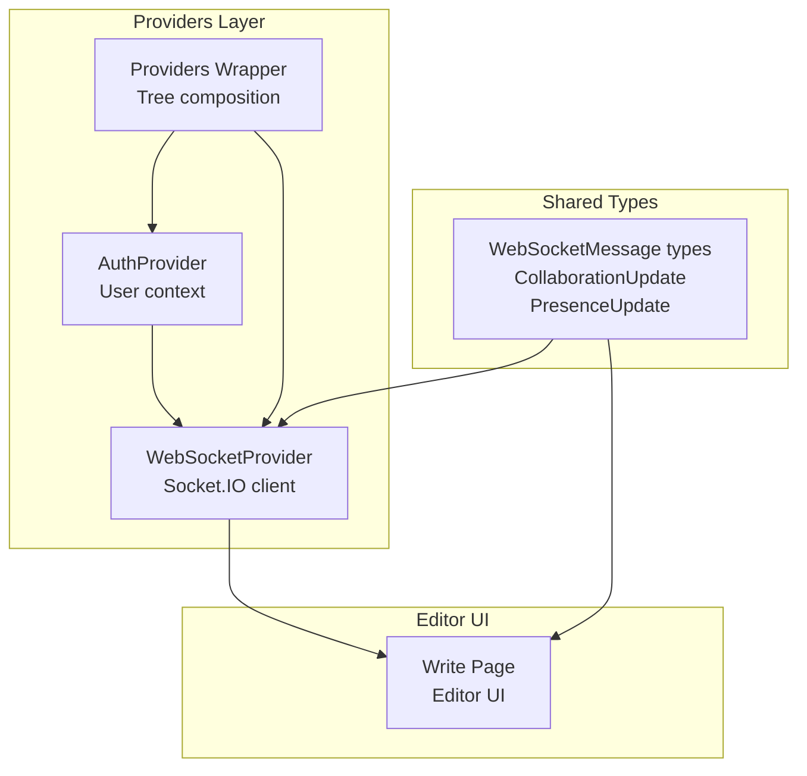
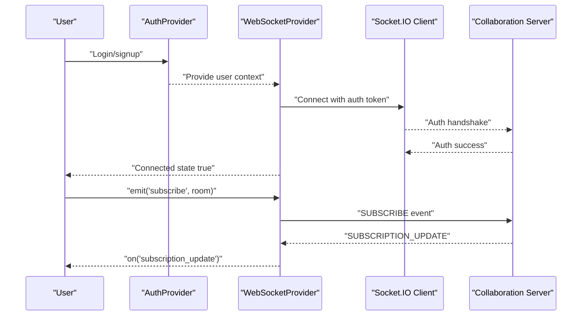
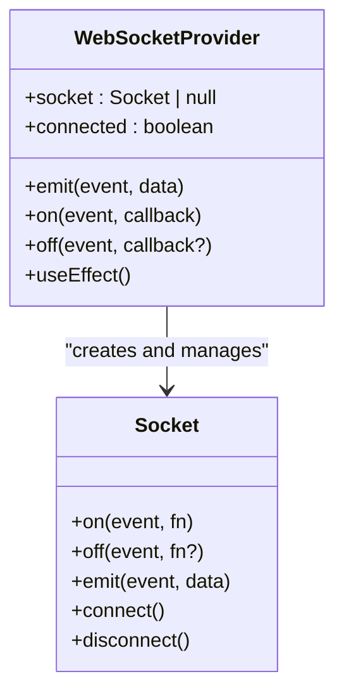
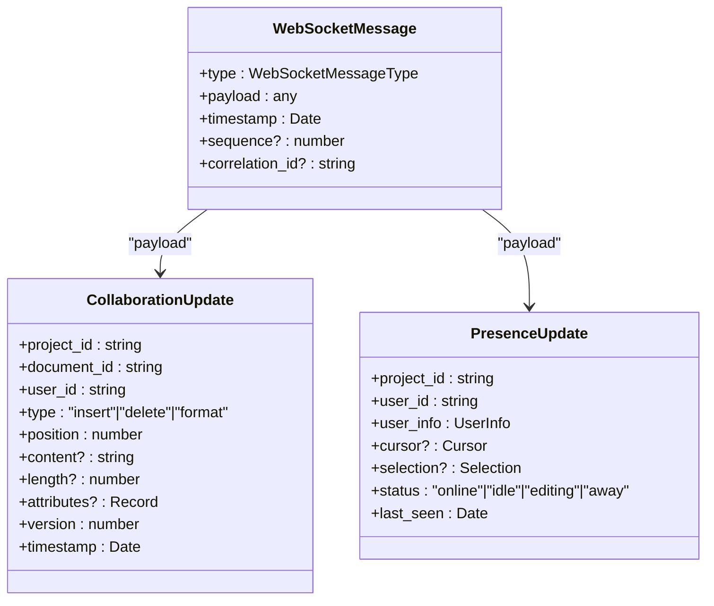
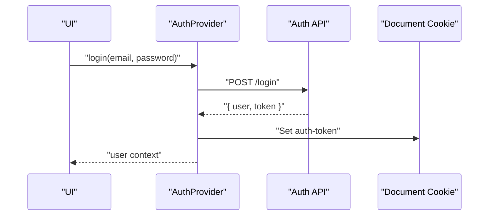
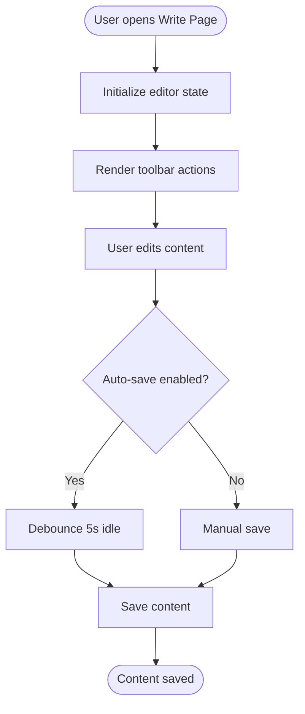
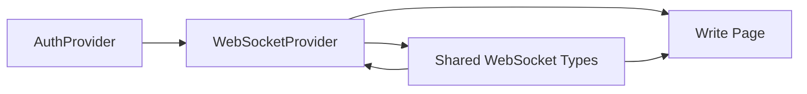

# Collaboration Features

<cite>
**Referenced Files in This Document**
- [websocket-provider.tsx](file://src/components/websocket/websocket-provider.tsx)
- [api.ts](file://packages/shared-types/src/api.ts)
- [auth-provider.tsx](file://src/components/auth/auth-provider.tsx)
- [providers.tsx](file://src/components/providers.tsx)
- [page.tsx](file://src/app/projects/[id]/write/page.tsx)
- [IMPLEMENTATION_PLAN.md](file://IMPLEMENTATION_PLAN.md)
- [enums.ts](file://packages/shared-types/src/enums.ts)
</cite>

## Table of Contents
1. [Introduction](#introduction)
2. [Project Structure](#project-structure)
3. [Core Components](#core-components)
4. [Architecture Overview](#architecture-overview)
5. [Detailed Component Analysis](#detailed-component-analysis)
6. [Dependency Analysis](#dependency-analysis)
7. [Performance Considerations](#performance-considerations)
8. [Troubleshooting Guide](#troubleshooting-guide)
9. [Conclusion](#conclusion)
10. [Appendices](#appendices)

## Introduction
This document explains the collaboration system for real-time editing and multi-user coordination. It covers the WebSocket integration using Socket.IO, presence indicators, collaborative editing workflows, real-time content synchronization, conflict resolution, user presence management, comments, activity feed, and notifications. It also provides practical examples of collaborative writing sessions, real-time editing scenarios, and user coordination, along with WebSocket provider architecture, event handling, connection management, performance optimization, offline synchronization, and scalability considerations.

## Project Structure
The collaboration system is composed of:
- A WebSocket provider that manages connections and exposes a simple emit/on/off API
- Shared types that define WebSocket message types, collaboration updates, and presence updates
- An authentication provider that supplies user context for authorization
- A write page that hosts the editor UI and demonstrates collaboration-ready patterns
- An implementation plan that outlines planned collaboration features (cursor presence, collaborative editing, comments, activity feed, presence indicators)

**Diagram sources**
- [providers.tsx](file://src/components/providers.tsx#L10-L55)
- [auth-provider.tsx](file://src/components/auth/auth-provider.tsx#L20-L157)
- [websocket-provider.tsx](file://src/components/websocket/websocket-provider.tsx#L17-L138)
- [page.tsx](file://src/app/projects/[id]/write/page.tsx#L100-L626)
- [api.ts](file://packages/shared-types/src/api.ts#L77-L155)

**Section sources**
- [providers.tsx](file://src/components/providers.tsx#L10-L55)
- [auth-provider.tsx](file://src/components/auth/auth-provider.tsx#L20-L157)
- [websocket-provider.tsx](file://src/components/websocket/websocket-provider.tsx#L17-L138)
- [page.tsx](file://src/app/projects/[id]/write/page.tsx#L100-L626)
- [api.ts](file://packages/shared-types/src/api.ts#L77-L155)

## Core Components
- WebSocket Provider
  - Manages Socket.IO connection lifecycle, authentication, reconnection, and emits events
  - Exposes emit/on/off APIs and connection state
- Shared WebSocket Types
  - Defines message types for collaboration (cursor update, selection update, content update, presence update)
  - Defines collaboration update and presence update structures
- Authentication Provider
  - Supplies user context and token for WebSocket authentication
- Write Page
  - Demonstrates editor UI and collaboration-ready patterns (selection tracking, toolbar actions)

Key responsibilities:
- Real-time messaging orchestration
- User presence and cursor visibility
- Collaborative editing coordination
- Event-driven updates and reconnection

**Section sources**
- [websocket-provider.tsx](file://src/components/websocket/websocket-provider.tsx#L7-L138)
- [api.ts](file://packages/shared-types/src/api.ts#L77-L155)
- [auth-provider.tsx](file://src/components/auth/auth-provider.tsx#L20-L157)
- [page.tsx](file://src/app/projects/[id]/write/page.tsx#L100-L626)

## Architecture Overview
The collaboration architecture integrates authentication, WebSocket transport, and editor UI. The provider stack composes AuthProvider and WebSocketProvider, enabling the editor to subscribe to collaboration rooms and receive real-time updates.

**Diagram sources**
- [providers.tsx](file://src/components/providers.tsx#L46-L49)
- [auth-provider.tsx](file://src/components/auth/auth-provider.tsx#L67-L141)
- [websocket-provider.tsx](file://src/components/websocket/websocket-provider.tsx#L35-L93)
- [api.ts](file://packages/shared-types/src/api.ts#L85-L121)

## Detailed Component Analysis

### WebSocket Provider
The WebSocketProvider encapsulates Socket.IO client creation, authentication, connection lifecycle, and reconnection logic. It exposes emit/on/off APIs and a connected flag. It reads the auth token from cookies and passes it to the server for authentication.

**Diagram sources**
- [websocket-provider.tsx](file://src/components/websocket/websocket-provider.tsx#L17-L138)

Key behaviors:
- Connection management: connect/disconnect on user changes, handle disconnect reasons, exponential backoff reconnection
- Authentication: pass auth token via cookie to server
- Event handling: expose emit/on/off wrappers
- Cleanup: disconnect on unmount

Practical usage:
- Subscribe to collaboration rooms using emit("subscribe", { roomId })
- Listen for subscription updates with on("subscription_update")
- Emit collaboration events like cursor/selection/content updates

**Section sources**
- [websocket-provider.tsx](file://src/components/websocket/websocket-provider.tsx#L24-L93)
- [websocket-provider.tsx](file://src/components/websocket/websocket-provider.tsx#L95-L123)

### Shared WebSocket Types
The shared types define the collaboration protocol and data structures:
- WebSocket message types for connection, authentication, subscriptions, collaboration, notifications, AI, and system messages
- CollaborationUpdate: insert/delete/format operations with positions and attributes
- PresenceUpdate: user info, cursor, selection, status, and last seen

**Diagram sources**
- [api.ts](file://packages/shared-types/src/api.ts#L77-L155)

**Section sources**
- [api.ts](file://packages/shared-types/src/api.ts#L77-L121)
- [api.ts](file://packages/shared-types/src/api.ts#L123-L155)

### Authentication Provider
The AuthProvider supplies user context and tokens used by the WebSocket provider for authentication. It handles login, signup, logout, and token refresh.

**Diagram sources**
- [auth-provider.tsx](file://src/components/auth/auth-provider.tsx#L67-L101)

**Section sources**
- [auth-provider.tsx](file://src/components/auth/auth-provider.tsx#L20-L157)

### Write Page (Editor UI)
The write page demonstrates an editor UI with toolbar, autosave, word count, and AI assistant panel. It is designed to integrate with collaboration features such as selection tracking and content updates.

**Diagram sources**
- [page.tsx](file://src/app/projects/[id]/write/page.tsx#L139-L166)

**Section sources**
- [page.tsx](file://src/app/projects/[id]/write/page.tsx#L100-L626)

### Planned Collaboration Features
The implementation plan outlines planned collaboration features:
- Cursor presence: show other users’ cursors, user identification, color coding
- Collaborative editing: operational transformation or CRDT, conflict resolution, sync state management
- Comments system: inline comments, comment threads, mention support
- Activity feed: real-time updates, activity filtering, notification integration
- Presence indicators: who’s online, active document viewers, typing indicators

Acceptance criteria emphasize simultaneous editing, no data loss, sub-100ms updates, and proper conflict resolution.

**Section sources**
- [IMPLEMENTATION_PLAN.md](file://IMPLEMENTATION_PLAN.md#L278-L318)

## Dependency Analysis
The collaboration system depends on:
- Authentication provider for user context and tokens
- WebSocket provider for transport and event handling
- Shared types for protocol definitions
- Editor UI for user interactions

**Diagram sources**
- [providers.tsx](file://src/components/providers.tsx#L46-L49)
- [auth-provider.tsx](file://src/components/auth/auth-provider.tsx#L20-L157)
- [websocket-provider.tsx](file://src/components/websocket/websocket-provider.tsx#L17-L138)
- [api.ts](file://packages/shared-types/src/api.ts#L77-L155)
- [page.tsx](file://src/app/projects/[id]/write/page.tsx#L100-L626)

**Section sources**
- [providers.tsx](file://src/components/providers.tsx#L10-L55)
- [auth-provider.tsx](file://src/components/auth/auth-provider.tsx#L20-L157)
- [websocket-provider.tsx](file://src/components/websocket/websocket-provider.tsx#L17-L138)
- [api.ts](file://packages/shared-types/src/api.ts#L77-L155)
- [page.tsx](file://src/app/projects/[id]/write/page.tsx#L100-L626)

## Performance Considerations
- Transport and reconnection
  - Use WebSocket with polling fallback and exponential backoff to minimize downtime
  - Limit reconnect attempts and cap backoff to avoid overload
- Message volume
  - Batch frequent updates (cursor/selection) and throttle content updates
  - Use delta encoding for content synchronization
- Client-side state
  - Maintain optimistic updates with rollback on conflicts
  - Persist local state to enable offline editing and resync
- Scalability
  - Use room-based subscriptions to reduce broadcast traffic
  - Implement server-side rate limiting and connection pooling
- Monitoring
  - Track connection quality, latency, and reconnection metrics
  - Measure time-to-interactive and first-contentful-paint for collaboration-sensitive pages

[No sources needed since this section provides general guidance]

## Troubleshooting Guide
Common issues and resolutions:
- Authentication failures
  - Verify auth token cookie presence and validity
  - Ensure server-side auth endpoint accepts the token format
- Disconnections
  - Check network connectivity and server availability
  - Confirm reconnection logic is active and backoff is not exhausted
- Event delivery
  - Validate event names match shared types (CURSOR_UPDATE, SELECTION_UPDATE, CONTENT_UPDATE, PRESENCE_UPDATE)
  - Ensure listeners are attached after connection is established
- Presence and cursor updates
  - Confirm presence updates include user info, cursor, and selection
  - Verify room subscriptions are active

**Section sources**
- [websocket-provider.tsx](file://src/components/websocket/websocket-provider.tsx#L77-L86)
- [api.ts](file://packages/shared-types/src/api.ts#L85-L121)

## Conclusion
The collaboration system integrates a robust WebSocket provider, shared protocol types, and an authentication layer to enable real-time editing and multi-user coordination. While the current implementation focuses on foundational pieces, the planned features (cursor presence, collaborative editing, comments, activity feed, presence indicators) align with industry best practices for real-time collaboration. By following the performance and troubleshooting guidance, teams can build scalable, responsive collaboration experiences.

[No sources needed since this section summarizes without analyzing specific files]

## Appendices

### Practical Examples

- Collaborative writing session
  - Users open the same document and join a room via subscription
  - Each user’s cursor and selection appear in real time
  - Content updates are synchronized with conflict resolution
  - Presence indicators show who is online and actively editing

- Real-time editing scenario
  - User A types a paragraph; the editor emits a content update
  - Server broadcasts the update to other users
  - Clients apply the update optimistically and resolve conflicts if needed

- User coordination
  - Presence updates include status (online/idle/editing/away)
  - Typing indicators can be implemented by emitting selection updates when typing begins
  - Comments threads allow inline discussions tied to selections

[No sources needed since this section provides general guidance]

### WebSocket Message Types Reference
- Connection: CONNECT, DISCONNECT, PING, PONG
- Authentication: AUTH_REQUEST, AUTH_SUCCESS, AUTH_FAILURE
- Subscriptions: SUBSCRIBE, UNSUBSCRIBE, SUBSCRIPTION_UPDATE
- Collaboration: CURSOR_UPDATE, SELECTION_UPDATE, CONTENT_UPDATE, PRESENCE_UPDATE
- Notifications: NOTIFICATION, ALERT
- AI: AI_GENERATION_START, AI_GENERATION_PROGRESS, AI_GENERATION_COMPLETE, AI_GENERATION_ERROR
- System: SYSTEM_MESSAGE, ERROR

**Section sources**
- [api.ts](file://packages/shared-types/src/api.ts#L85-L121)