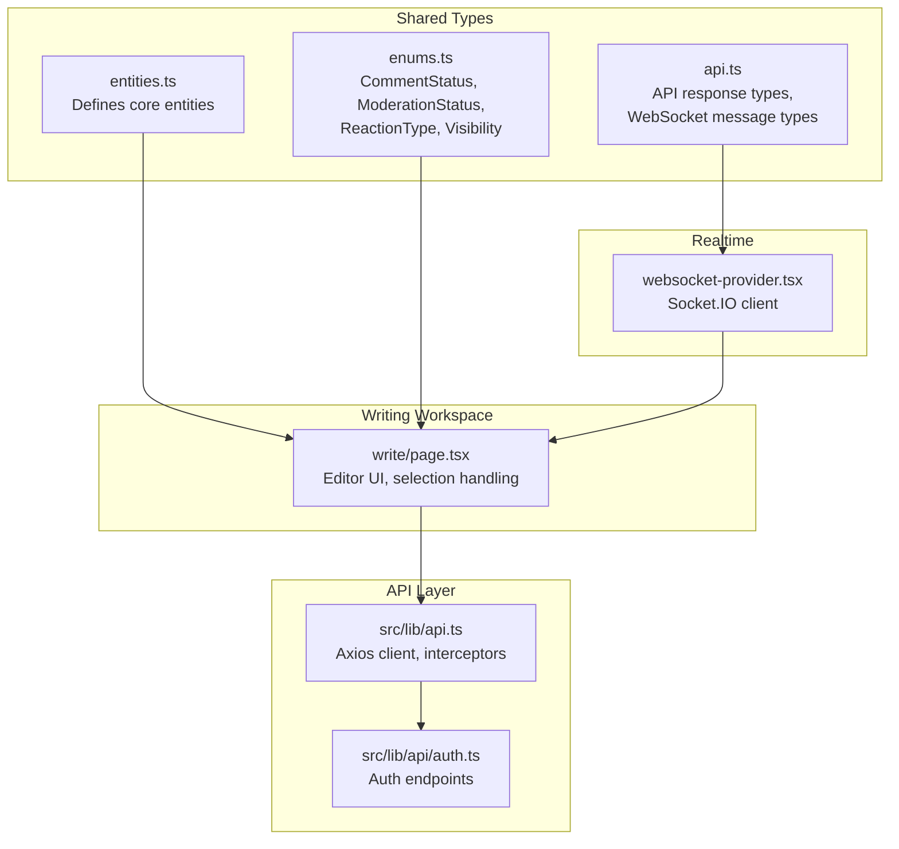
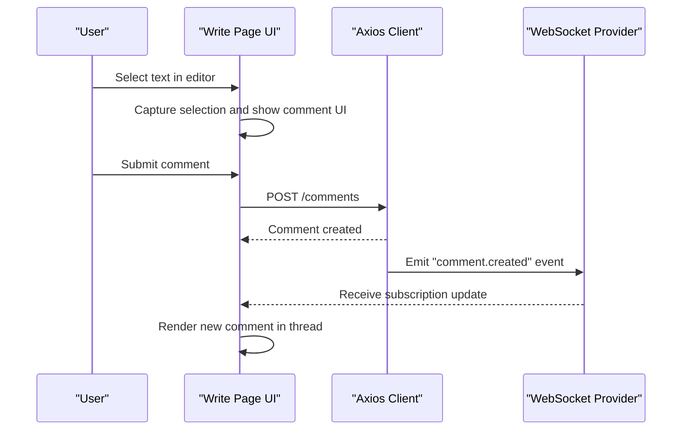
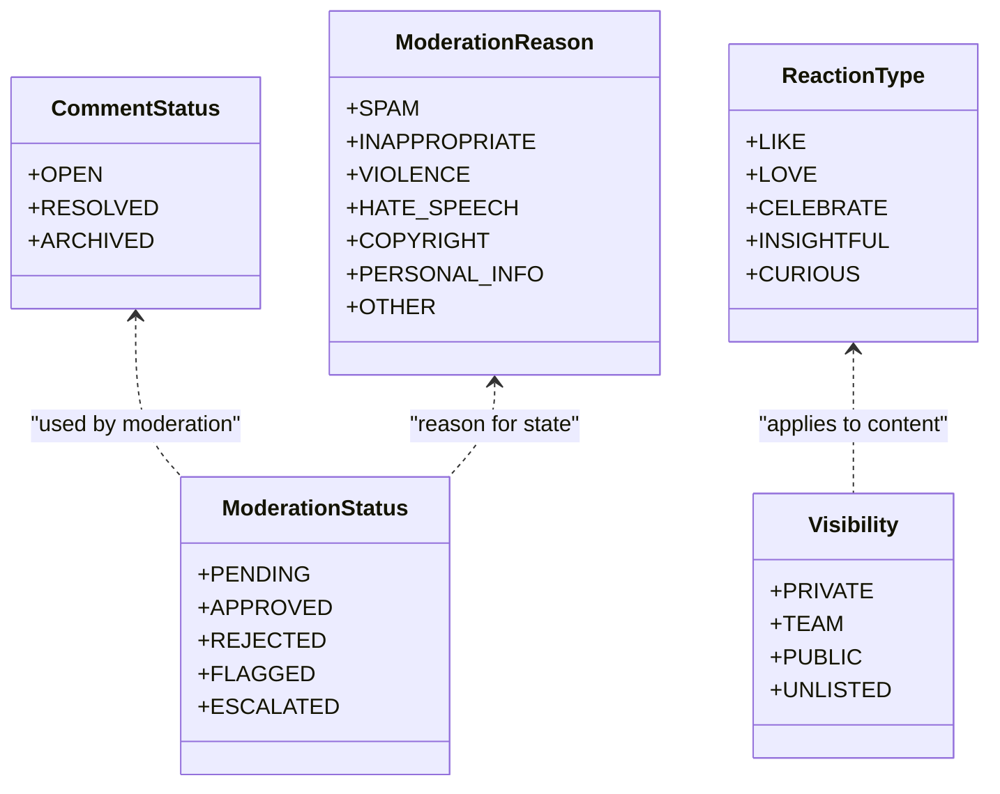
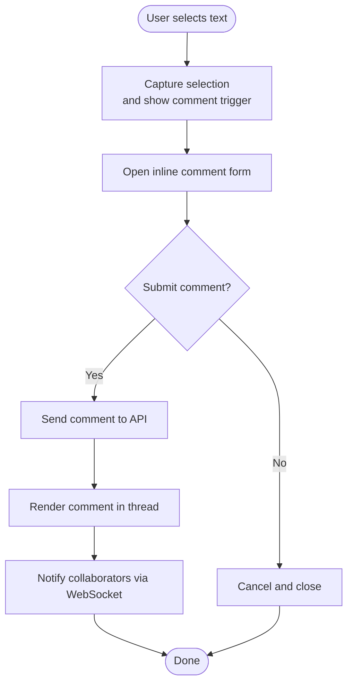
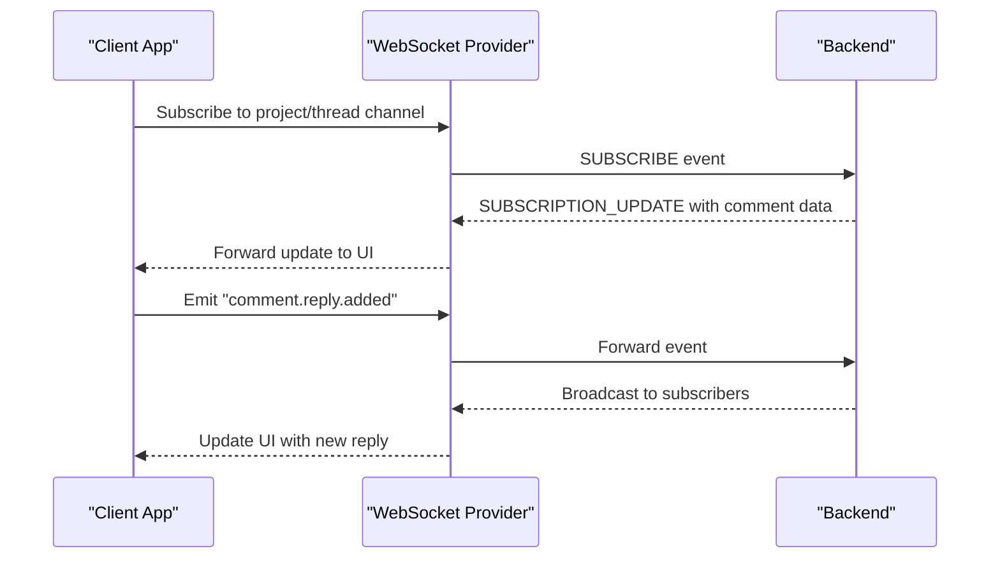
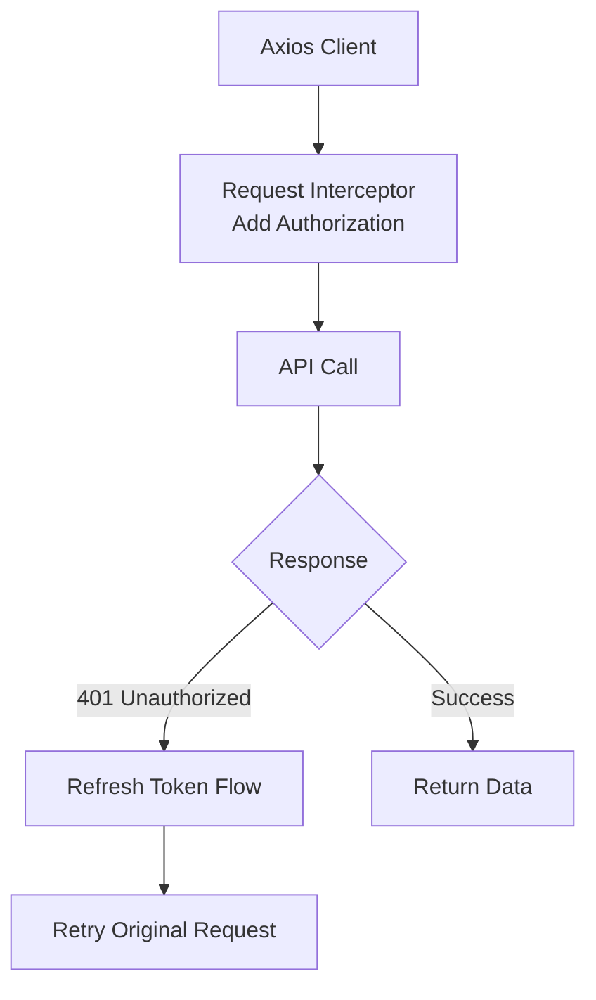
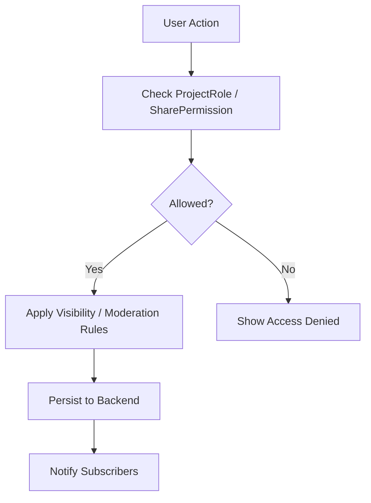
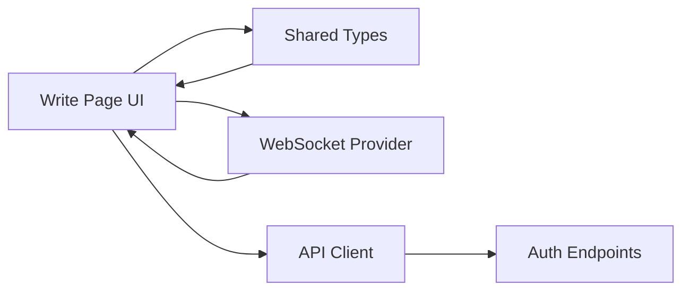

# Comments System

<cite>
**Referenced Files in This Document**
- [README.md](file://README.md)
- [entities.ts](file://packages/shared-types/src/entities.ts)
- [enums.ts](file://packages/shared-types/src/enums.ts)
- [api.ts](file://packages/shared-types/src/api.ts)
- [page.tsx](file://src/app/projects/[id]/write/page.tsx)
- [websocket-provider.tsx](file://src/components/websocket/websocket-provider.tsx)
- [api.ts](file://src/lib/api.ts)
- [auth.ts](file://src/lib/api/auth.ts)
</cite>

## Table of Contents
1. [Introduction](#introduction)
2. [Project Structure](#project-structure)
3. [Core Components](#core-components)
4. [Architecture Overview](#architecture-overview)
5. [Detailed Component Analysis](#detailed-component-analysis)
6. [Dependency Analysis](#dependency-analysis)
7. [Performance Considerations](#performance-considerations)
8. [Troubleshooting Guide](#troubleshooting-guide)
9. [Conclusion](#conclusion)

## Introduction
This document describes the collaborative comments system for threaded discussions and annotations within the writing workspace. It explains the comment data model, threading structure, reply management, integration with the writing environment, inline commenting, real-time updates, notifications, moderation capabilities, and API endpoints for comment CRUD operations. It also covers permission controls, visibility settings, performance considerations for large histories, search and filtering, integration with the activity feed, and UI patterns for displaying, editing, and deleting comments.

## Project Structure
The comments system spans shared types, the writing workspace UI, WebSocket real-time infrastructure, and API clients. The following diagram shows how these pieces fit together.

**Diagram sources**
- [entities.ts](file://packages/shared-types/src/entities.ts#L1-L458)
- [enums.ts](file://packages/shared-types/src/enums.ts#L1-L241)
- [api.ts](file://packages/shared-types/src/api.ts#L1-L409)
- [page.tsx](file://src/app/projects/[id]/write/page.tsx#L1-L626)
- [websocket-provider.tsx](file://src/components/websocket/websocket-provider.tsx#L1-L138)
- [api.ts](file://src/lib/api.ts#L1-L67)
- [auth.ts](file://src/lib/api/auth.ts#L1-L101)

**Section sources**
- [README.md](file://README.md#L1-L426)
- [entities.ts](file://packages/shared-types/src/entities.ts#L1-L458)
- [enums.ts](file://packages/shared-types/src/enums.ts#L1-L241)
- [api.ts](file://packages/shared-types/src/api.ts#L1-L409)
- [page.tsx](file://src/app/projects/[id]/write/page.tsx#L1-L626)
- [websocket-provider.tsx](file://src/components/websocket/websocket-provider.tsx#L1-L138)
- [api.ts](file://src/lib/api.ts#L1-L67)
- [auth.ts](file://src/lib/api/auth.ts#L1-L101)

## Core Components
- Comment data model and enums: Defines comment lifecycle (open/resolved/archived), moderation states and reasons, reaction types, and visibility.
- Writing workspace integration: Provides the rich text editor, selection capture, and UI affordances for inline comments.
- Real-time updates: WebSocket provider for live comment notifications and collaboration signals.
- API layer: Axios client with auth interceptors and typed API responses; authentication endpoints.

Key implementation references:
- CommentStatus, ModerationStatus, ReactionType, Visibility: [enums.ts](file://packages/shared-types/src/enums.ts#L140-L170)
- API response and WebSocket message types: [api.ts](file://packages/shared-types/src/api.ts#L1-L409)
- Editor and selection handling: [page.tsx](file://src/app/projects/[id]/write/page.tsx#L100-L180)
- WebSocket provider: [websocket-provider.tsx](file://src/components/websocket/websocket-provider.tsx#L17-L93)
- API client and interceptors: [api.ts](file://src/lib/api.ts#L1-L67)
- Auth endpoints: [auth.ts](file://src/lib/api/auth.ts#L25-L55)

**Section sources**
- [enums.ts](file://packages/shared-types/src/enums.ts#L140-L170)
- [api.ts](file://packages/shared-types/src/api.ts#L1-L409)
- [page.tsx](file://src/app/projects/[id]/write/page.tsx#L100-L180)
- [websocket-provider.tsx](file://src/components/websocket/websocket-provider.tsx#L17-L93)
- [api.ts](file://src/lib/api.ts#L1-L67)
- [auth.ts](file://src/lib/api/auth.ts#L25-L55)

## Architecture Overview
The comments system integrates with the writing workspace via contentEditable selection capture and a rich text editor. Comments are associated with text selections and stored with thread metadata. Real-time updates propagate via WebSocket subscriptions. Moderation and visibility are enforced by shared enums and backend policies.

**Diagram sources**
- [page.tsx](file://src/app/projects/[id]/write/page.tsx#L173-L180)
- [api.ts](file://src/lib/api.ts#L1-L67)
- [websocket-provider.tsx](file://src/components/websocket/websocket-provider.tsx#L95-L123)

## Detailed Component Analysis

### Comment Data Model and Threading
- CommentStatus: open, resolved, archived
- ModerationStatus: pending, approved, rejected, flagged, escalated
- ModerationReason: spam, inappropriate, violence, hate_speech, copyright, personal_info, other
- ReactionType: like, love, celebrate, insightful, curious
- Visibility: private, team, public, unlisted

Threaded discussions are represented by a hierarchical structure where each comment can have zero or more replies. The root-level comments are associated with a specific text selection or scene/project context. Replies inherit visibility and moderation settings from their parent comment.

**Diagram sources**
- [enums.ts](file://packages/shared-types/src/enums.ts#L140-L170)

**Section sources**
- [enums.ts](file://packages/shared-types/src/enums.ts#L140-L170)

### Writing Workspace Integration and Inline Commenting
The write page provides:
- A rich text editor with contentEditable
- Selection capture to detect text highlights
- Toolbar actions for formatting and saving
- Sidebar for chapter navigation and quick stats
- AI assistant panel (unrelated to comments but part of the workspace)

Inline commenting is triggered by selecting text in the editor. The selection is captured and used to anchor a comment thread. The UI pattern supports:
- Displaying comment threads near the selected text
- Expanding/collapsing threads
- Adding replies within the thread
- Resolving or archiving threads

**Diagram sources**
- [page.tsx](file://src/app/projects/[id]/write/page.tsx#L173-L180)
- [api.ts](file://src/lib/api.ts#L1-L67)
- [websocket-provider.tsx](file://src/components/websocket/websocket-provider.tsx#L95-L123)

**Section sources**
- [page.tsx](file://src/app/projects/[id]/write/page.tsx#L100-L180)

### Real-time Updates and Notifications
The WebSocket provider manages connections and emits/receives events. Events relevant to comments include:
- Subscription updates for comment threads
- Notifications for new replies and mentions
- Presence and selection updates for collaboration

**Diagram sources**
- [websocket-provider.tsx](file://src/components/websocket/websocket-provider.tsx#L17-L93)
- [api.ts](file://packages/shared-types/src/api.ts#L77-L118)

**Section sources**
- [websocket-provider.tsx](file://src/components/websocket/websocket-provider.tsx#L17-L93)
- [api.ts](file://packages/shared-types/src/api.ts#L77-L118)

### API Endpoints for Comment CRUD Operations
The API client is configured with interceptors for authentication and token refresh. While the specific comment endpoints are not present in the current codebase, the client structure supports adding endpoints for:
- Creating comments
- Fetching comments by thread or selection
- Updating comments (edit/delete)
- Deleting comments
- Managing replies and threads
- Applying reactions and moderation actions

**Diagram sources**
- [api.ts](file://src/lib/api.ts#L1-L67)

**Section sources**
- [api.ts](file://src/lib/api.ts#L1-L67)

### Permission Controls and Visibility Settings
Visibility controls are defined by the Visibility enum and applied to comments and replies. Permission enforcement relies on:
- ProjectRole and SharePermission for access control
- Row Level Security (RLS) on the backend
- Frontend checks before rendering sensitive actions

**Diagram sources**
- [enums.ts](file://packages/shared-types/src/enums.ts#L126-L138)

**Section sources**
- [enums.ts](file://packages/shared-types/src/enums.ts#L126-L138)

### Practical Examples

- Adding comments to specific text selections:
  - Select text in the editor
  - Trigger inline comment form
  - Submit comment; receive real-time update and notification

- Managing comment threads:
  - Expand thread to view replies
  - Add replies to existing comments
  - Resolve or archive threads when discussion concludes

- Resolving discussions:
  - Mark thread as resolved
  - Optionally archive after a period

These workflows rely on the selection capture and WebSocket subscription mechanisms.

**Section sources**
- [page.tsx](file://src/app/projects/[id]/write/page.tsx#L173-L180)
- [websocket-provider.tsx](file://src/components/websocket/websocket-provider.tsx#L95-L123)

### Search and Filtering
Filtering and pagination are supported by shared API types:
- FilterParams: search terms, status, date ranges, tags, metadata
- PaginationParams: page, limit, cursor, sort_by, sort_order

These can be used to query comments by:
- Status (open/resolved/archived)
- Moderation status
- Creation/update timestamps
- Tags or metadata filters

**Section sources**
- [api.ts](file://packages/shared-types/src/api.ts#L30-L47)

### Integration with Activity Feed
Notifications for comment activities (e.g., new comment, reply, mention) are integrated via WebSocket messages and NotificationType. The activity feed can surface these events alongside other project updates.

**Section sources**
- [api.ts](file://packages/shared-types/src/api.ts#L397-L409)
- [websocket-provider.tsx](file://src/components/websocket/websocket-provider.tsx#L95-L123)

## Dependency Analysis
The comments system depends on:
- Shared types for consistent data modeling
- WebSocket provider for real-time collaboration
- API client for secure, authenticated requests
- Authentication endpoints for user identity

**Diagram sources**
- [page.tsx](file://src/app/projects/[id]/write/page.tsx#L1-L626)
- [enums.ts](file://packages/shared-types/src/enums.ts#L1-L241)
- [api.ts](file://packages/shared-types/src/api.ts#L1-L409)
- [websocket-provider.tsx](file://src/components/websocket/websocket-provider.tsx#L1-L138)
- [api.ts](file://src/lib/api.ts#L1-L67)
- [auth.ts](file://src/lib/api/auth.ts#L1-L101)

**Section sources**
- [page.tsx](file://src/app/projects/[id]/write/page.tsx#L1-L626)
- [enums.ts](file://packages/shared-types/src/enums.ts#L1-L241)
- [api.ts](file://packages/shared-types/src/api.ts#L1-L409)
- [websocket-provider.tsx](file://src/components/websocket/websocket-provider.tsx#L1-L138)
- [api.ts](file://src/lib/api.ts#L1-L67)
- [auth.ts](file://src/lib/api/auth.ts#L1-L101)

## Performance Considerations
- Large comment histories:
  - Paginate and lazy-load threads
  - Use virtualized lists for long reply trees
  - Cache recent threads and replies
- Real-time updates:
  - Debounce frequent updates
  - Batch subscription updates
- Search and filtering:
  - Index comments by status, timestamps, and tags
  - Use server-side filtering to reduce payload sizes

## Troubleshooting Guide
- WebSocket connection issues:
  - Verify authentication token in cookies
  - Check reconnect attempts and transport fallback
- API authentication failures:
  - Ensure access/refresh tokens are present
  - Confirm interceptor adds Authorization header
- Selection capture problems:
  - Validate contentEditable and selection APIs
  - Handle cross-browser differences

**Section sources**
- [websocket-provider.tsx](file://src/components/websocket/websocket-provider.tsx#L24-L93)
- [api.ts](file://src/lib/api.ts#L10-L65)
- [page.tsx](file://src/app/projects/[id]/write/page.tsx#L173-L180)

## Conclusion
The comments system leverages shared types, a rich text editor, WebSocket real-time updates, and a robust API client to enable threaded discussions and annotations within the writing workspace. With visibility and moderation enums, permission controls, and scalable performance strategies, it provides a solid foundation for collaborative storytelling feedback and discussion.