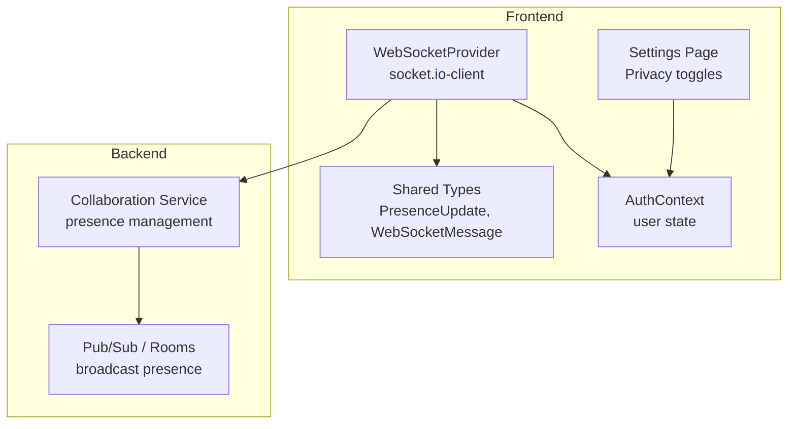
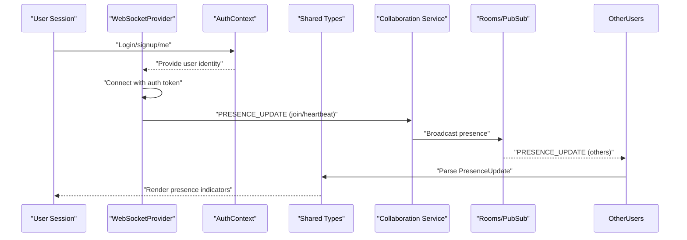
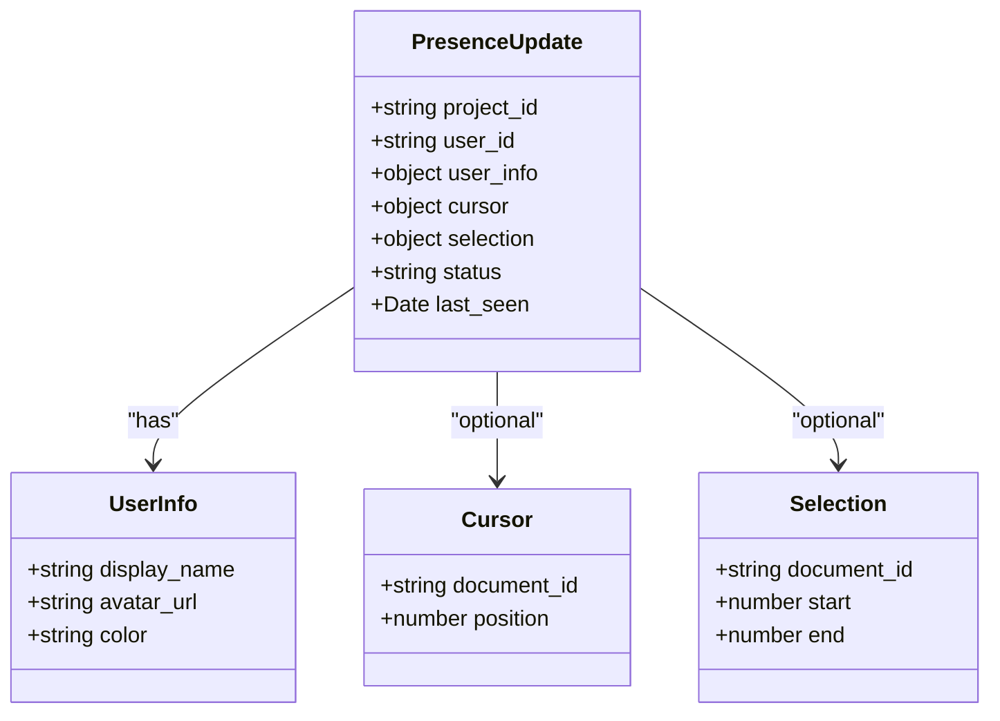
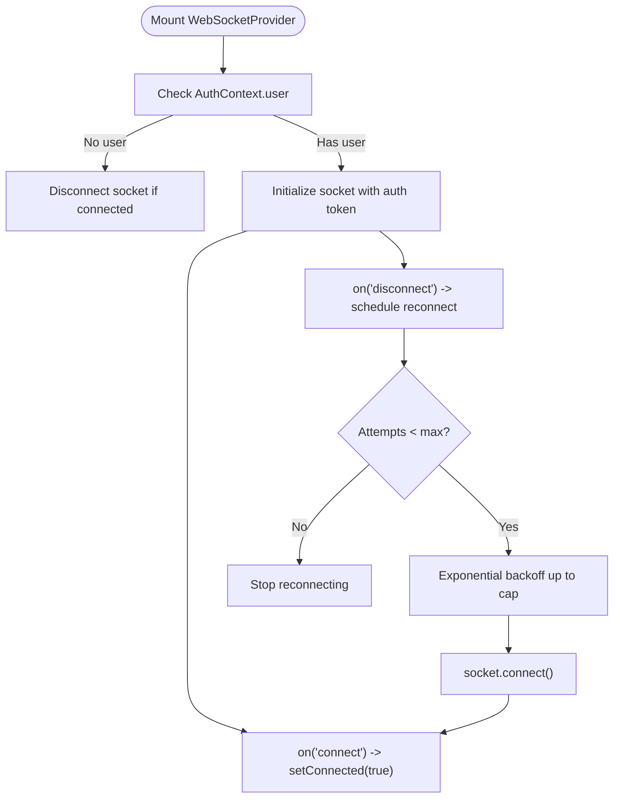
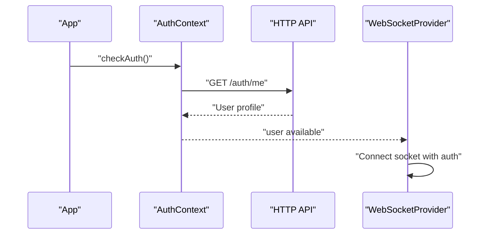
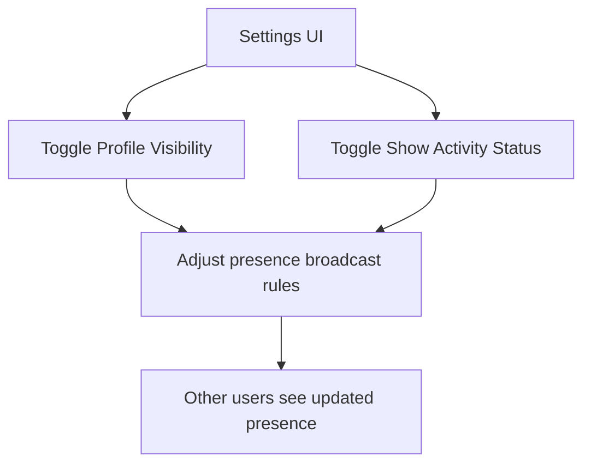
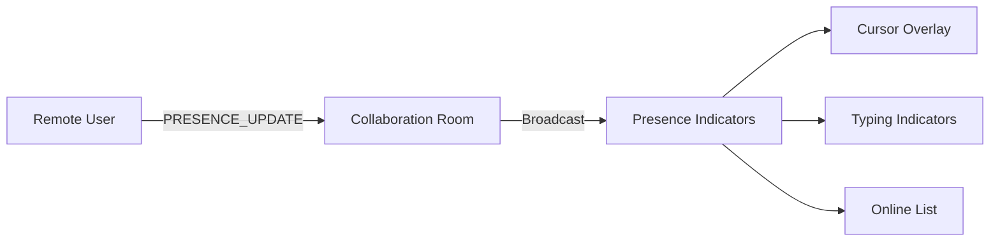
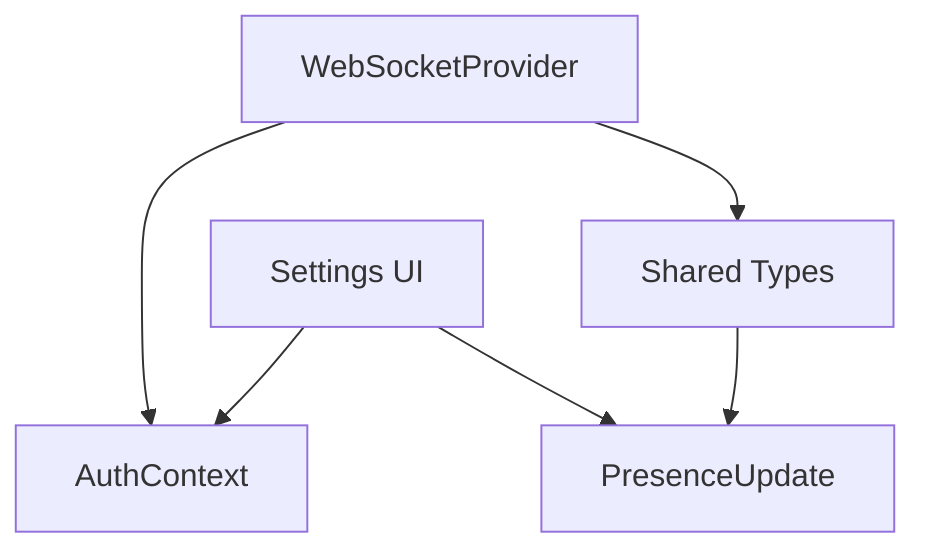

# Presence Management

<cite>
**Referenced Files in This Document**
- [websocket-provider.tsx](file://src/components/websocket/websocket-provider.tsx)
- [api.ts](file://src/lib/api.ts)
- [auth-context.tsx](file://src/contexts/auth-context.tsx)
- [api.ts (shared-types)](file://packages/shared-types/src/api.ts)
- [settings/page.tsx](file://src/app/settings/page.tsx)
- [IMPLEMENTATION_PLAN.md](file://IMPLEMENTATION_PLAN.md)
- [QUICK_START_CHECKLIST.md](file://QUICK_START_CHECKLIST.md)
</cite>

## Table of Contents
1. [Introduction](#introduction)
2. [Project Structure](#project-structure)
3. [Core Components](#core-components)
4. [Architecture Overview](#architecture-overview)
5. [Detailed Component Analysis](#detailed-component-analysis)
6. [Dependency Analysis](#dependency-analysis)
7. [Performance Considerations](#performance-considerations)
8. [Troubleshooting Guide](#troubleshooting-guide)
9. [Conclusion](#conclusion)
10. [Appendices](#appendices)

## Introduction
This document explains the user presence system for real-time user tracking and status management. It covers the presence data model, update and expiration mechanisms, integration with real-time editing (active users, cursor positions, typing indicators), and practical examples for visualization and awareness in collaborative workspaces. It also addresses backend presence management, scaling for large user bases, privacy controls, performance optimization, offline handling, and multi-tab/device synchronization.

## Project Structure
The presence system spans frontend WebSocket connectivity, authentication state, and shared type definitions. The current repository provides:
- A WebSocket provider that manages connections and reconnection logic
- An authentication context that supplies user identity
- Shared presence types and WebSocket message types
- UI settings for privacy controls related to presence visibility

**Diagram sources**
- [websocket-provider.tsx](file://src/components/websocket/websocket-provider.tsx#L17-L93)
- [auth-context.tsx](file://src/contexts/auth-context.tsx#L30-L146)
- [api.ts (shared-types)](file://packages/shared-types/src/api.ts#L136-L155)
- [settings/page.tsx](file://src/app/settings/page.tsx#L803-L825)

**Section sources**
- [websocket-provider.tsx](file://src/components/websocket/websocket-provider.tsx#L1-L138)
- [auth-context.tsx](file://src/contexts/auth-context.tsx#L1-L154)
- [api.ts (shared-types)](file://packages/shared-types/src/api.ts#L77-L155)
- [settings/page.tsx](file://src/app/settings/page.tsx#L803-L825)

## Core Components
- WebSocketProvider: Establishes and maintains a persistent WebSocket connection, handles authentication via cookies, and exposes emit/on/off APIs for real-time events.
- AuthContext: Manages user authentication state and tokens, enabling conditional connection behavior.
- PresenceUpdate type: Defines the presence payload shape for real-time updates.
- Settings UI: Provides privacy toggles for profile visibility and activity status.

Key responsibilities:
- Presence transport: WebSocket messages of type PRESENCE_UPDATE
- Presence data: user identity, display info, cursor/selection, status, last seen
- Privacy controls: user-configurable visibility of presence signals

**Section sources**
- [websocket-provider.tsx](file://src/components/websocket/websocket-provider.tsx#L17-L138)
- [auth-context.tsx](file://src/contexts/auth-context.tsx#L30-L146)
- [api.ts (shared-types)](file://packages/shared-types/src/api.ts#L136-L155)
- [settings/page.tsx](file://src/app/settings/page.tsx#L803-L825)

## Architecture Overview
The presence system integrates authentication, WebSocket transport, and collaboration services. The sequence below illustrates how presence updates propagate from a user’s active session to other collaborators.

**Diagram sources**
- [websocket-provider.tsx](file://src/components/websocket/websocket-provider.tsx#L35-L47)
- [auth-context.tsx](file://src/contexts/auth-context.tsx#L57-L91)
- [api.ts (shared-types)](file://packages/shared-types/src/api.ts#L136-L155)
- [IMPLEMENTATION_PLAN.md](file://IMPLEMENTATION_PLAN.md#L278-L307)

## Detailed Component Analysis

### Presence Data Model
The presence payload defines:
- project_id: identifies the collaborative context
- user_id: unique identifier for the user
- user_info: display_name, optional avatar_url, color
- cursor: optional document_id and position
- selection: optional document_id, start, end
- status: online | idle | editing | away
- last_seen: timestamp of the last presence update

**Diagram sources**
- [api.ts (shared-types)](file://packages/shared-types/src/api.ts#L136-L155)

**Section sources**
- [api.ts (shared-types)](file://packages/shared-types/src/api.ts#L136-L155)

### WebSocket Transport and Reconnection
The WebSocketProvider:
- Creates a socket with authentication via cookie token
- Emits connect/disconnect events and handles connect_error
- Implements exponential backoff reconnection with a capped maximum attempts
- Exposes emit/on/off for event-driven collaboration

**Diagram sources**
- [websocket-provider.tsx](file://src/components/websocket/websocket-provider.tsx#L24-L93)

**Section sources**
- [websocket-provider.tsx](file://src/components/websocket/websocket-provider.tsx#L17-L138)

### Authentication Integration
The AuthContext:
- Stores and refreshes tokens
- Loads user profile on app start
- Enables conditional WebSocket connection when user is present

**Diagram sources**
- [auth-context.tsx](file://src/contexts/auth-context.tsx#L39-L55)
- [auth-context.tsx](file://src/contexts/auth-context.tsx#L57-L91)
- [websocket-provider.tsx](file://src/components/websocket/websocket-provider.tsx#L24-L33)

**Section sources**
- [auth-context.tsx](file://src/contexts/auth-context.tsx#L30-L146)
- [websocket-provider.tsx](file://src/components/websocket/websocket-provider.tsx#L17-L93)

### Privacy Controls for Presence Visibility
The Settings page includes toggles for:
- Profile Visibility: whether the user’s profile is visible to others
- Show Activity Status: whether others can see when the user is online
These toggles influence presence broadcasting and rendering decisions in the UI.

**Diagram sources**
- [settings/page.tsx](file://src/app/settings/page.tsx#L803-L825)

**Section sources**
- [settings/page.tsx](file://src/app/settings/page.tsx#L803-L825)

### Presence Update Frequency and Expiration
- Update frequency: Defined by the collaboration layer; typical heartbeat intervals are low-latency (e.g., under 100ms) to keep presence fresh without overwhelming bandwidth.
- Expiration: Presence entries should expire after a grace period (e.g., 2–3x heartbeat interval) to remove offline users from the active list.
- Idle detection: Status transitions to idle/away when no cursor/selection updates are received for a configurable duration.

Note: These behaviors are part of the collaboration service and are planned for implementation.

**Section sources**
- [IMPLEMENTATION_PLAN.md](file://IMPLEMENTATION_PLAN.md#L278-L307)

### Integration with Real-time Editing
Presence integrates with:
- Active users panel: lists who is currently collaborating
- Cursor positions: renders remote cursors with per-user colors
- Typing indicators: shows “X is typing” based on recent activity
- Selection highlights: optional overlay of remote selections

**Diagram sources**
- [api.ts (shared-types)](file://packages/shared-types/src/api.ts#L102-L106)
- [IMPLEMENTATION_PLAN.md](file://IMPLEMENTATION_PLAN.md#L278-L307)

**Section sources**
- [api.ts (shared-types)](file://packages/shared-types/src/api.ts#L102-L106)
- [IMPLEMENTATION_PLAN.md](file://IMPLEMENTATION_PLAN.md#L278-L307)

### Practical Examples
- Presence visualization: Show avatars/colors with display names; indicate online/idle/editing/away
- User activity streams: Display recent actions (cursor movement, typing, edits) with timestamps
- Collaborative workspace awareness: Highlight documents with active participants and recent activity

Note: These UI patterns are defined in the implementation plan and will be implemented in dedicated components.

**Section sources**
- [IMPLEMENTATION_PLAN.md](file://IMPLEMENTATION_PLAN.md#L278-L307)

## Dependency Analysis
- WebSocketProvider depends on AuthContext for user identity and on shared WebSocket message types.
- PresenceUpdate relies on shared-types for consistent payload structure across client and server.
- Settings UI toggles influence presence broadcast rules in the backend.

**Diagram sources**
- [websocket-provider.tsx](file://src/components/websocket/websocket-provider.tsx#L17-L138)
- [auth-context.tsx](file://src/contexts/auth-context.tsx#L30-L146)
- [api.ts (shared-types)](file://packages/shared-types/src/api.ts#L136-L155)
- [settings/page.tsx](file://src/app/settings/page.tsx#L803-L825)

**Section sources**
- [websocket-provider.tsx](file://src/components/websocket/websocket-provider.tsx#L17-L138)
- [auth-context.tsx](file://src/contexts/auth-context.tsx#L30-L146)
- [api.ts (shared-types)](file://packages/shared-types/src/api.ts#L136-L155)
- [settings/page.tsx](file://src/app/settings/page.tsx#L803-L825)

## Performance Considerations
- Debounce presence updates: Coalesce frequent cursor/selection changes to reduce message volume while preserving responsiveness.
- Batch updates: Group multiple small presence changes into a single PRESENCE_UPDATE payload.
- Efficient serialization: Use compact payloads and avoid unnecessary fields (e.g., omit cursor/selection when unchanged).
- Connection pooling and load balancing: Scale WebSocket servers horizontally; route users to sessions to minimize cross-node coordination.
- Offline handling: Maintain local presence state and clear it after expiration to prevent stale data.
- Multi-tab/device sync: Use a single WebSocket per user and synchronize presence across tabs via shared state or storage events.

[No sources needed since this section provides general guidance]

## Troubleshooting Guide
Common issues and resolutions:
- Connection drops: The provider automatically reconnects with exponential backoff; monitor disconnect reasons and ensure auth tokens remain valid.
- Authentication failures: Verify cookie-based auth token is present and valid; handle auth_error by prompting re-authentication.
- Presence not updating: Confirm the collaboration service is emitting PRESENCE_UPDATE and that the room/topic subscriptions are active.
- Privacy controls not taking effect: Ensure settings changes propagate to the backend and that presence broadcast rules reflect user preferences.

**Section sources**
- [websocket-provider.tsx](file://src/components/websocket/websocket-provider.tsx#L56-L86)
- [auth-context.tsx](file://src/contexts/auth-context.tsx#L108-L125)

## Conclusion
The presence system is designed around a robust WebSocket transport, strong authentication integration, and a shared presence data model. Privacy controls enable users to manage visibility, while planned collaboration features will deliver real-time awareness through active users, cursor overlays, and typing indicators. Performance and scalability are addressed through batching, coalescing, and horizontal scaling strategies.

[No sources needed since this section summarizes without analyzing specific files]

## Appendices

### Implementation Roadmap References
- Presence indicators: Planned in the implementation plan and quick start checklist
- Cursor presence and collaborative editing: Also planned for development

**Section sources**
- [IMPLEMENTATION_PLAN.md](file://IMPLEMENTATION_PLAN.md#L278-L307)
- [QUICK_START_CHECKLIST.md](file://QUICK_START_CHECKLIST.md#L78-L83)