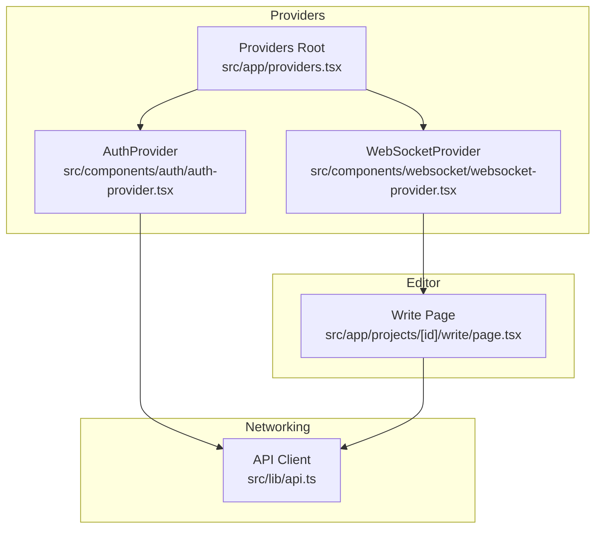
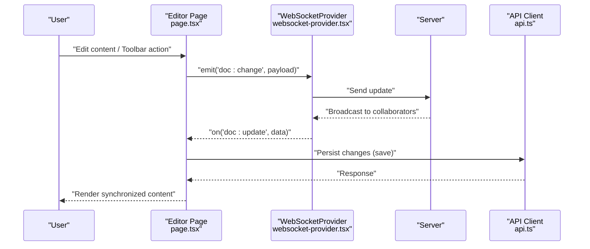
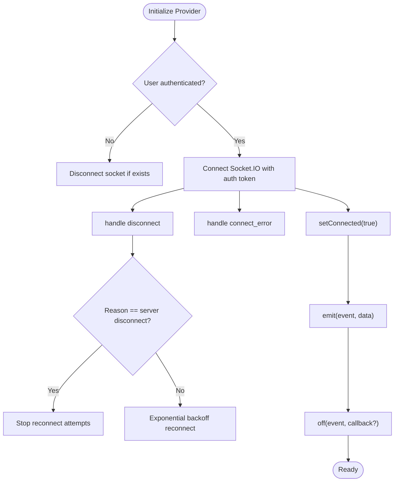
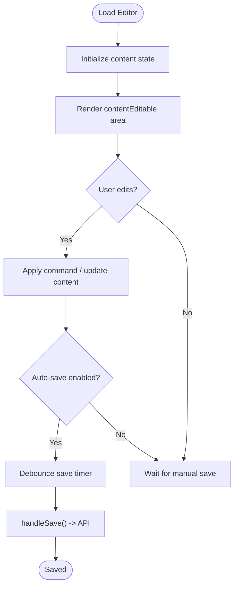
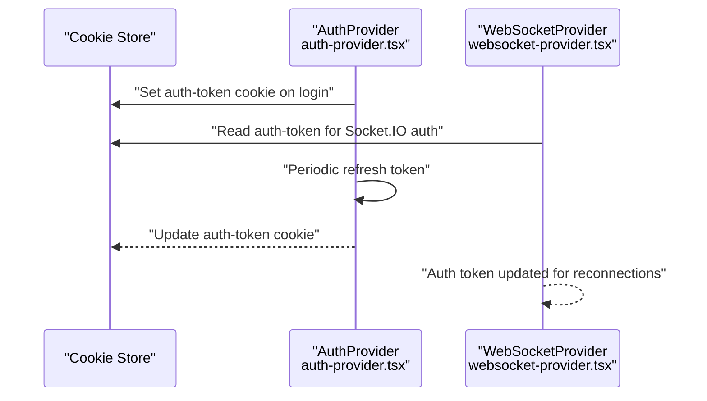
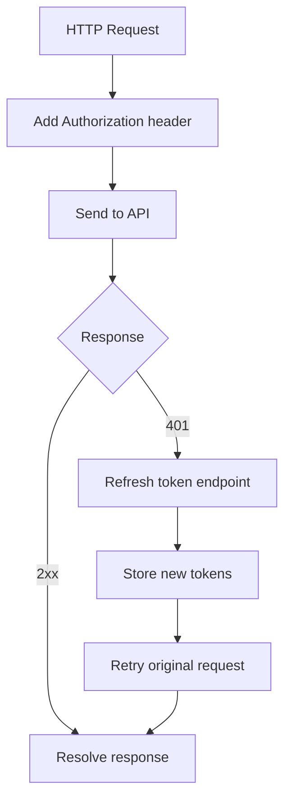
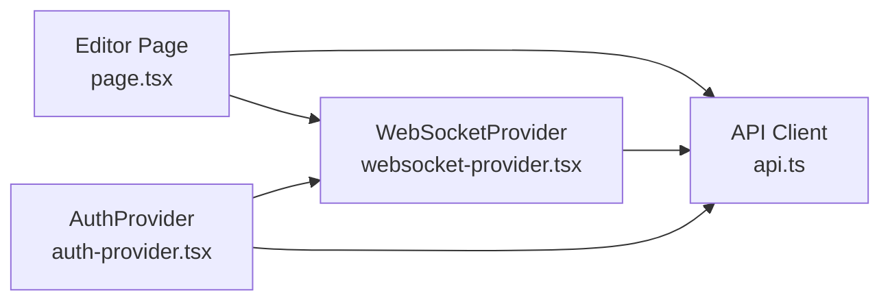
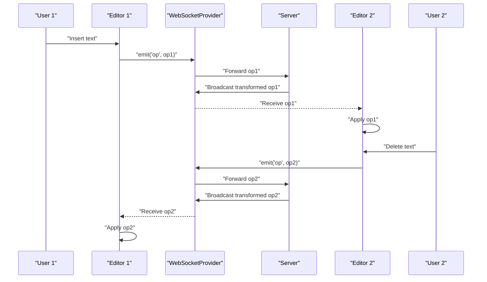

# Real-time Editing

<cite>
**Referenced Files in This Document**
- [README.md](file://README.md)
- [IMPLEMENTATION_PLAN.md](file://IMPLEMENTATION_PLAN.md)
- [src/app/providers.tsx](file://src/app/providers.tsx)
- [src/app/projects/[id]/write/page.tsx](file://src/app/projects/[id]/write/page.tsx)
- [src/components/auth/auth-provider.tsx](file://src/components/auth/auth-provider.tsx)
- [src/components/websocket/websocket-provider.tsx](file://src/components/websocket/websocket-provider.tsx)
- [src/lib/api.ts](file://src/lib/api.ts)
- [src/lib/utils.ts](file://src/lib/utils.ts)
</cite>

## Table of Contents
1. [Introduction](#introduction)
2. [Project Structure](#project-structure)
3. [Core Components](#core-components)
4. [Architecture Overview](#architecture-overview)
5. [Detailed Component Analysis](#detailed-component-analysis)
6. [Dependency Analysis](#dependency-analysis)
7. [Performance Considerations](#performance-considerations)
8. [Troubleshooting Guide](#troubleshooting-guide)
9. [Conclusion](#conclusion)
10. [Appendices](#appendices)

## Introduction
This document describes the real-time collaborative editing system for multi-user content synchronization. It explains the operational transformation and conflict resolution strategies, content merging techniques, and the integration of a rich text editor with real-time collaboration features such as cursor positioning, selection sharing, presence indicators, and user highlighting. It also covers the event-driven architecture for content updates, performance optimization for large documents, scalability considerations, and common issues such as network latency, offline synchronization, and data consistency.

The repository currently includes:
- A WebSocket provider for real-time connectivity
- A basic rich text editor page with toolbar and contentEditable area
- Authentication and API client infrastructure
- An implementation plan detailing planned collaboration features (cursor presence, collaborative editing, comments, activity feed, presence indicators)

These pieces form the foundation for building a robust real-time collaboration system.

## Project Structure
The real-time editing system spans several layers:
- Frontend providers and context for authentication and WebSocket connectivity
- Editor page with rich text editing and toolbar
- API client with request/response interceptors
- Implementation plan that outlines planned collaboration features

**Diagram sources**
- [src/app/providers.tsx](file://src/app/providers.tsx#L9-L36)
- [src/components/auth/auth-provider.tsx](file://src/components/auth/auth-provider.tsx#L20-L156)
- [src/components/websocket/websocket-provider.tsx](file://src/components/websocket/websocket-provider.tsx#L17-L129)
- [src/app/projects/[id]/write/page.tsx](file://src/app/projects/[id]/write/page.tsx#L100-L626)
- [src/lib/api.ts](file://src/lib/api.ts#L1-L67)

**Section sources**
- [README.md](file://README.md#L49-L104)
- [src/app/providers.tsx](file://src/app/providers.tsx#L9-L36)
- [src/components/websocket/websocket-provider.tsx](file://src/components/websocket/websocket-provider.tsx#L17-L129)
- [src/app/projects/[id]/write/page.tsx](file://src/app/projects/[id]/write/page.tsx#L100-L626)
- [src/lib/api.ts](file://src/lib/api.ts#L1-L67)

## Core Components
- WebSocketProvider: Establishes and manages a real-time connection, handles authentication, reconnection, and emits/observes events.
- AuthProvider: Manages user session state and token lifecycle.
- Editor Page: Provides a rich text editor with toolbar, auto-save, word count, and selection tracking.
- API Client: Centralized HTTP client with request/response interceptors for authentication and token refresh.

Key responsibilities:
- Real-time connectivity and event handling
- User authentication and session persistence
- Rich text editing surface and toolbar commands
- Network request lifecycle and token refresh

**Section sources**
- [src/components/websocket/websocket-provider.tsx](file://src/components/websocket/websocket-provider.tsx#L17-L129)
- [src/components/auth/auth-provider.tsx](file://src/components/auth/auth-provider.tsx#L20-L156)
- [src/app/projects/[id]/write/page.tsx](file://src/app/projects/[id]/write/page.tsx#L100-L626)
- [src/lib/api.ts](file://src/lib/api.ts#L1-L67)

## Architecture Overview
The real-time collaboration architecture is event-driven:
- The editor emits change events and user actions
- The WebSocketProvider forwards events to collaborators
- The API client handles persistence and token refresh
- Presence and cursor updates are broadcast and rendered locally

**Diagram sources**
- [src/app/projects/[id]/write/page.tsx](file://src/app/projects/[id]/write/page.tsx#L168-L185)
- [src/components/websocket/websocket-provider.tsx](file://src/components/websocket/websocket-provider.tsx#L95-L115)
- [src/lib/api.ts](file://src/lib/api.ts#L10-L65)

## Detailed Component Analysis

### WebSocketProvider
Responsibilities:
- Initialize Socket.IO connection with authentication
- Manage connection lifecycle, reconnection, and error handling
- Provide emit/on/off APIs for event-driven collaboration

Operational transformation and CRDT:
- The implementation plan indicates a planned CRDT module for operational transformation or CRDT-based conflict resolution.
- This component will coordinate with the editor to transform operations and merge updates.

Presence and cursor indicators:
- The implementation plan specifies cursor presence and presence indicators as separate components.
- These will consume events from the WebSocketProvider to render collaborative cursors and user presence.

**Diagram sources**
- [src/components/websocket/websocket-provider.tsx](file://src/components/websocket/websocket-provider.tsx#L24-L93)

**Section sources**
- [src/components/websocket/websocket-provider.tsx](file://src/components/websocket/websocket-provider.tsx#L17-L129)
- [IMPLEMENTATION_PLAN.md](file://IMPLEMENTATION_PLAN.md#L278-L314)

### Editor Page (Rich Text Editor)
Responsibilities:
- Provide a contentEditable surface with toolbar commands
- Track selections and word counts
- Manage auto-save and manual save flows
- Render version history and quick stats

Collaborative editing integration points:
- The implementation plan outlines collaborative editing, cursor presence, comments, activity feed, and presence indicators.
- The editor will subscribe to WebSocket events and apply remote changes while preserving local edits.

**Diagram sources**
- [src/app/projects/[id]/write/page.tsx](file://src/app/projects/[id]/write/page.tsx#L139-L166)

**Section sources**
- [src/app/projects/[id]/write/page.tsx](file://src/app/projects/[id]/write/page.tsx#L100-L626)
- [IMPLEMENTATION_PLAN.md](file://IMPLEMENTATION_PLAN.md#L278-L314)

### Authentication and Session Management
Responsibilities:
- Maintain user session state
- Persist tokens in cookies
- Periodically refresh tokens
- Redirect on logout or refresh failure

Integration with WebSocket:
- The WebSocketProvider reads the auth token from cookies and passes it to Socket.IO for authentication.

**Diagram sources**
- [src/components/auth/auth-provider.tsx](file://src/components/auth/auth-provider.tsx#L67-L141)
- [src/components/websocket/websocket-provider.tsx](file://src/components/websocket/websocket-provider.tsx#L36-L47)

**Section sources**
- [src/components/auth/auth-provider.tsx](file://src/components/auth/auth-provider.tsx#L20-L156)
- [src/components/websocket/websocket-provider.tsx](file://src/components/websocket/websocket-provider.tsx#L17-L129)

### API Client and Token Refresh
Responsibilities:
- Centralize HTTP requests with base URL and JSON headers
- Attach Authorization header using stored access token
- Intercept 401 responses to refresh tokens and retry requests

Integration with authentication:
- Uses localStorage for access/refresh tokens; AuthProvider sets cookies.
- The implementation plan indicates planned Zustand stores for state management, which can complement the API client for optimistic updates and offline support.

**Diagram sources**
- [src/lib/api.ts](file://src/lib/api.ts#L10-L65)

**Section sources**
- [src/lib/api.ts](file://src/lib/api.ts#L1-L67)
- [src/components/auth/auth-provider.tsx](file://src/components/auth/auth-provider.tsx#L133-L141)

## Dependency Analysis
The collaboration system depends on:
- WebSocketProvider for real-time events
- Editor Page for rendering and user input
- API Client for persistence and token refresh
- AuthProvider for session and token lifecycle

**Diagram sources**
- [src/app/projects/[id]/write/page.tsx](file://src/app/projects/[id]/write/page.tsx#L100-L626)
- [src/components/websocket/websocket-provider.tsx](file://src/components/websocket/websocket-provider.tsx#L17-L129)
- [src/lib/api.ts](file://src/lib/api.ts#L1-L67)
- [src/components/auth/auth-provider.tsx](file://src/components/auth/auth-provider.tsx#L20-L156)

**Section sources**
- [src/app/projects/[id]/write/page.tsx](file://src/app/projects/[id]/write/page.tsx#L100-L626)
- [src/components/websocket/websocket-provider.tsx](file://src/components/websocket/websocket-provider.tsx#L17-L129)
- [src/lib/api.ts](file://src/lib/api.ts#L1-L67)
- [src/components/auth/auth-provider.tsx](file://src/components/auth/auth-provider.tsx#L20-L156)

## Performance Considerations
- Event throttling and debouncing for frequent edits to reduce network traffic
- Delta encoding for large documents to minimize payload sizes
- Virtualization for long contentEditable surfaces
- Efficient DOM diffing and selective re-rendering
- Background persistence with optimistic updates and conflict resolution
- Scalable WebSocket clustering and message queuing on the server

[No sources needed since this section provides general guidance]

## Troubleshooting Guide
Common issues and mitigations:
- Network latency and reconnection
  - Use exponential backoff and jitter for reconnection attempts
  - Implement heartbeat and ping/pong to detect dead connections
- Offline synchronization
  - Queue local changes and replay them after reconnection
  - Use a local store (e.g., IndexedDB or in-memory cache) to persist changes
- Data consistency
  - Implement operational transformation or CRDT to resolve conflicts deterministically
  - Maintain operation logs and sequence numbers for causal ordering
- Cursor and presence updates
  - Broadcast cursor positions and selections with timestamps
  - Render remote cursors with per-user colors and avatars
- Token refresh failures
  - Redirect to login on repeated refresh failures
  - Clear stale tokens and notify the user

**Section sources**
- [src/components/websocket/websocket-provider.tsx](file://src/components/websocket/websocket-provider.tsx#L66-L86)
- [src/lib/api.ts](file://src/lib/api.ts#L24-L65)

## Conclusion
The repository establishes a solid foundation for real-time collaborative editing:
- WebSocketProvider enables event-driven collaboration
- Editor Page provides a rich text surface with toolbar and auto-save
- AuthProvider and API client manage sessions and persistence
- The implementation plan outlines concrete collaboration features (cursor presence, collaborative editing, comments, activity feed, presence indicators)

Future work should focus on implementing the planned collaboration modules, operational transformation or CRDT, and optimizing for large documents and high concurrency.

[No sources needed since this section summarizes without analyzing specific files]

## Appendices

### Practical Scenarios and Workflows

#### Simultaneous Editing Scenario
- Two users edit the same document concurrently
- Each client applies local edits and sends operations to the server
- The server transforms operations and broadcasts merged updates
- Clients reconcile received operations and render the unified document

**Diagram sources**
- [src/app/projects/[id]/write/page.tsx](file://src/app/projects/[id]/write/page.tsx#L168-L185)
- [src/components/websocket/websocket-provider.tsx](file://src/components/websocket/websocket-provider.tsx#L95-L115)
- [IMPLEMENTATION_PLAN.md](file://IMPLEMENTATION_PLAN.md#L285-L289)

#### Conflict Detection and Resolution
- Operational Transformation (OT): Transform concurrent operations to preserve semantic equivalence
- CRDT: Use convergent replicated data types for strong eventual consistency
- Version vectors or Lamport timestamps to order operations causally

[No sources needed since this section provides general guidance]

#### Offline Editing with Eventual Consistency
- Queue local operations while offline
- On reconnect, send queued operations with sequence numbers
- Server applies operations in causal order and responds with deltas
- Client reconciles deltas and replays any missed operations

[No sources needed since this section provides general guidance]

### Scalability Considerations
- Horizontal scaling of WebSocket servers with sticky sessions or message queues
- Database sharding and replication for document storage
- CDN for static assets and API caching
- Monitoring and alerting for latency, throughput, and error rates

[No sources needed since this section provides general guidance]