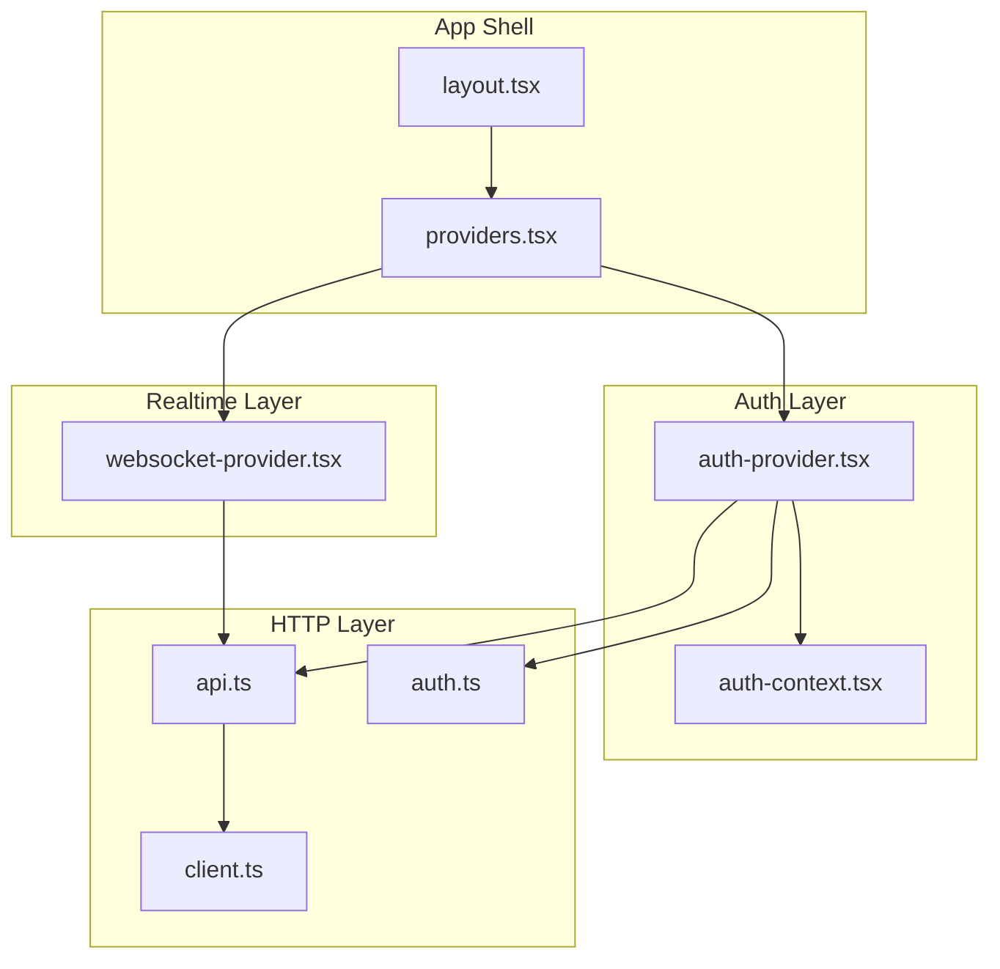
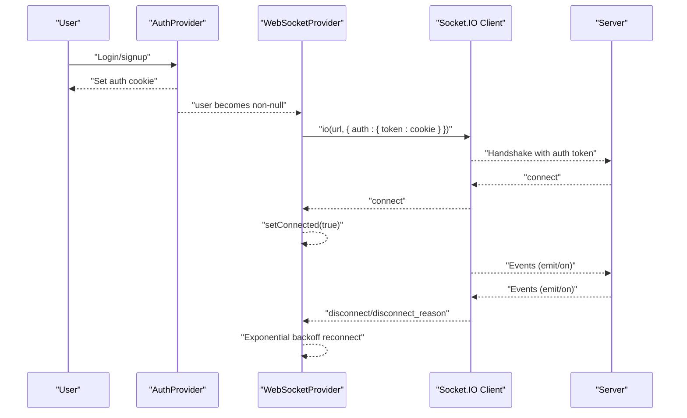
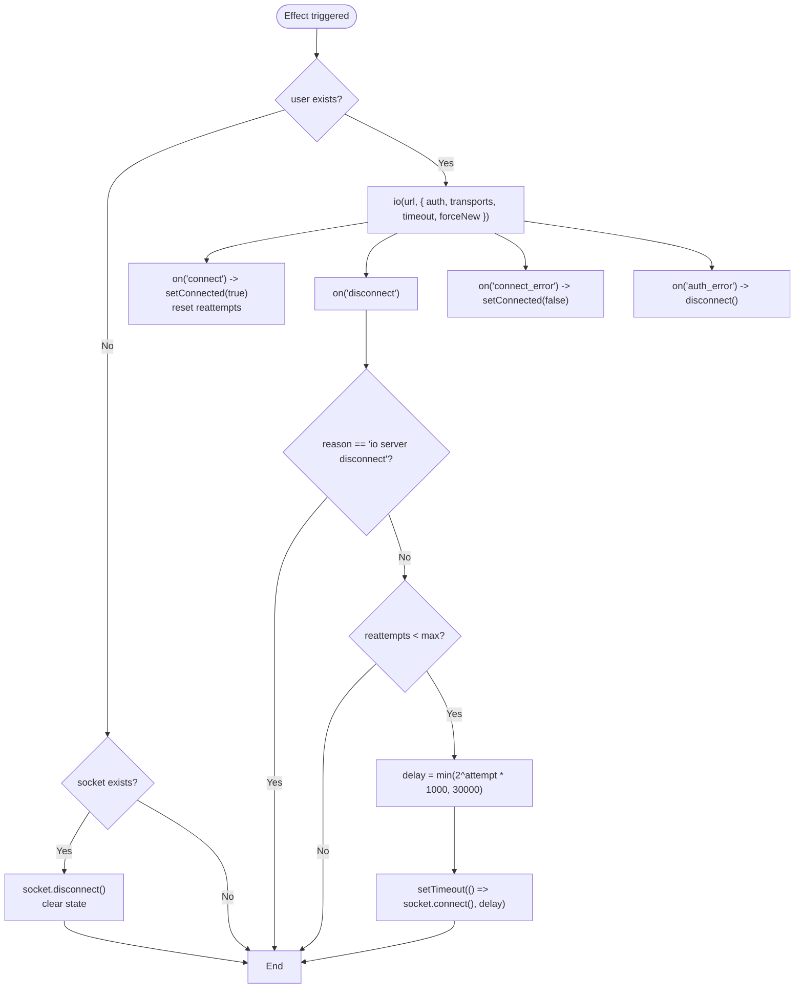
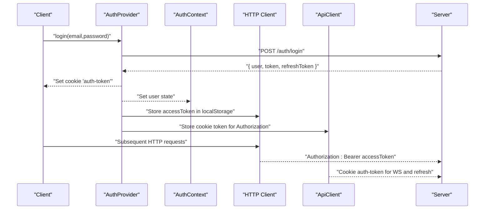
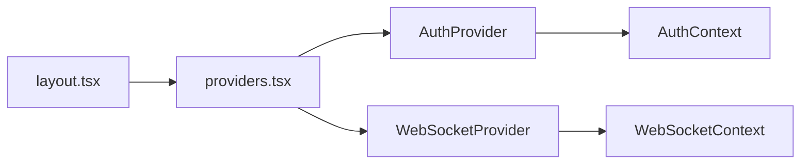
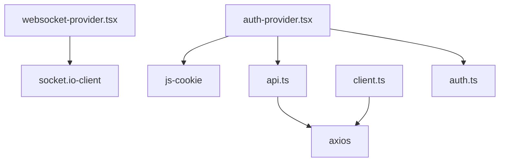

# WebSocket Integration

<cite>
**Referenced Files in This Document**
- [websocket-provider.tsx](file://src/components/websocket/websocket-provider.tsx)
- [auth-provider.tsx](file://src/components/auth/auth-provider.tsx)
- [auth-context.tsx](file://src/contexts/auth-context.tsx)
- [providers.tsx](file://src/components/providers.tsx)
- [layout.tsx](file://src/app/layout.tsx)
- [api.ts](file://src/lib/api.ts)
- [client.ts](file://src/lib/api/client.ts)
- [auth.ts](file://src/lib/api/auth.ts)
- [package.json](file://package.json)
</cite>

## Table of Contents
1. [Introduction](#introduction)
2. [Project Structure](#project-structure)
3. [Core Components](#core-components)
4. [Architecture Overview](#architecture-overview)
5. [Detailed Component Analysis](#detailed-component-analysis)
6. [Dependency Analysis](#dependency-analysis)
7. [Performance Considerations](#performance-considerations)
8. [Troubleshooting Guide](#troubleshooting-guide)
9. [Conclusion](#conclusion)

## Introduction
This document explains the WebSocket integration system that powers real-time communication in the application. It focuses on the Socket.IO client implementation, connection lifecycle management, authentication via JWT tokens carried in cookies, context-based state management, and robust error handling with exponential backoff reconnection. It also provides practical guidance for emitting events, listening to them, and safely removing listeners, along with security considerations, timeouts, and performance optimization tips.

## Project Structure
The WebSocket integration is implemented as a React Context provider that encapsulates a Socket.IO client instance. It is composed with the authentication context so that connection state follows user authentication. The provider is mounted at the top-level application layout and exposes a small, ergonomic hook for components to interact with the WebSocket.

**Diagram sources**
- [layout.tsx](file://src/app/layout.tsx#L83-L101)
- [providers.tsx](file://src/components/providers.tsx#L10-L54)
- [auth-provider.tsx](file://src/components/auth/auth-provider.tsx#L20-L156)
- [auth-context.tsx](file://src/contexts/auth-context.tsx#L30-L145)
- [websocket-provider.tsx](file://src/components/websocket/websocket-provider.tsx#L17-L130)
- [api.ts](file://src/lib/api.ts#L1-L67)
- [client.ts](file://src/lib/api/client.ts#L1-L138)
- [auth.ts](file://src/lib/api/auth.ts#L1-L101)

**Section sources**
- [layout.tsx](file://src/app/layout.tsx#L83-L101)
- [providers.tsx](file://src/components/providers.tsx#L10-L54)

## Core Components
- WebSocketProvider: Creates and manages a Socket.IO client instance, handles connection lifecycle, authentication via cookies, emits/receives events, and exposes a context for consumers.
- useWebSocket: Hook to access the WebSocket context, including connection state and event APIs.
- AuthProvider/AuthContext: Provides user state and JWT token management; drives WebSocket connection lifecycle based on authentication state.
- HTTP layer: Axios-based clients that manage JWT tokens via Authorization headers and cookie-based tokens for server-side validation.

Key capabilities:
- Socket.IO client configured with polling and WebSocket transports, explicit timeout, and forced new connection.
- Authentication via cookie-based token passed to Socket.IO auth.
- Connection state tracking and controlled reconnection with exponential backoff.
- Event-driven API with emit/on/off wrappers guarded by connection state.

**Section sources**
- [websocket-provider.tsx](file://src/components/websocket/websocket-provider.tsx#L7-L138)
- [auth-provider.tsx](file://src/components/auth/auth-provider.tsx#L9-L165)
- [auth-context.tsx](file://src/contexts/auth-context.tsx#L18-L154)
- [api.ts](file://src/lib/api.ts#L1-L67)
- [client.ts](file://src/lib/api/client.ts#L1-L138)

## Architecture Overview
The WebSocket integration is layered atop the authentication system. When a user logs in, a cookie token is set. The WebSocketProvider reads this cookie and authenticates the Socket.IO connection. On logout or token expiration, the provider disconnects the socket. During runtime, the provider listens to Socket.IO events and applies exponential backoff reconnection with a cap.

**Diagram sources**
- [auth-provider.tsx](file://src/components/auth/auth-provider.tsx#L67-L131)
- [websocket-provider.tsx](file://src/components/websocket/websocket-provider.tsx#L24-L93)

## Detailed Component Analysis

### WebSocketProvider and useWebSocket
Responsibilities:
- Manage Socket.IO client lifecycle tied to authentication state.
- Authenticate using a cookie-based token.
- Track connection state and expose emit/on/off helpers.
- Implement auto-reconnection with exponential backoff and a maximum attempt count.
- Gracefully disconnect on logout or when user becomes unauthenticated.

Implementation highlights:
- Socket creation with transports array enabling WebSocket and polling fallback, explicit timeout, and forceNew to avoid reuse.
- Auth token extraction from document.cookie and passed to Socket.IO auth.
- Event handlers:
  - connect: sets connected flag and resets reconnection attempts.
  - disconnect: evaluates reason and triggers exponential backoff up to a maximum.
  - connect_error: logs and marks disconnected.
  - auth_error: logs and disconnects immediately.
- emit/on/off wrappers guard operations by socket presence and connection state.

**Diagram sources**
- [websocket-provider.tsx](file://src/components/websocket/websocket-provider.tsx#L24-L93)

**Section sources**
- [websocket-provider.tsx](file://src/components/websocket/websocket-provider.tsx#L17-L138)

### Authentication and Token Management
Two complementary token strategies coexist:
- HTTP requests use Authorization header with an access token stored in local storage.
- WebSocket authentication uses a cookie token named auth-token.

Behavior:
- AuthProvider/AuthContext initialize and refresh tokens, and drive the app’s authentication state.
- AuthProvider sets and refreshes the auth-token cookie on login/signup and refresh.
- AuthProvider clears the cookie on logout.
- HTTP layer (api.ts and client.ts) also reads the cookie for Authorization header and refresh flows.

**Diagram sources**
- [auth-provider.tsx](file://src/components/auth/auth-provider.tsx#L67-L131)
- [auth-context.tsx](file://src/contexts/auth-context.tsx#L39-L125)
- [api.ts](file://src/lib/api.ts#L11-L64)
- [client.ts](file://src/lib/api/client.ts#L18-L81)

**Section sources**
- [auth-provider.tsx](file://src/components/auth/auth-provider.tsx#L20-L156)
- [auth-context.tsx](file://src/contexts/auth-context.tsx#L30-L145)
- [api.ts](file://src/lib/api.ts#L1-L67)
- [client.ts](file://src/lib/api/client.ts#L1-L138)
- [auth.ts](file://src/lib/api/auth.ts#L1-L101)

### Context Composition and Mounting
The WebSocketProvider is mounted alongside the AuthProvider at the top level, ensuring that WebSocket lifecycle tracks authentication state consistently across the app.

**Diagram sources**
- [layout.tsx](file://src/app/layout.tsx#L88-L99)
- [providers.tsx](file://src/components/providers.tsx#L46-L49)

**Section sources**
- [layout.tsx](file://src/app/layout.tsx#L83-L101)
- [providers.tsx](file://src/components/providers.tsx#L10-L54)

## Dependency Analysis
External libraries and integrations:
- socket.io-client: Real-time bidirectional communication with automatic transport selection and reconnection.
- js-cookie: Used by HTTP layer to manage auth-token cookie for server-side validation and refresh flows.
- axios: HTTP client with interceptors for Authorization header and token refresh.

**Diagram sources**
- [package.json](file://package.json#L58-L61)
- [websocket-provider.tsx](file://src/components/websocket/websocket-provider.tsx#L4-L5)
- [auth-provider.tsx](file://src/components/auth/auth-provider.tsx#L30-L33)
- [api.ts](file://src/lib/api.ts#L1-L8)
- [client.ts](file://src/lib/api/client.ts#L1-L16)
- [auth.ts](file://src/lib/api/auth.ts#L1-L2)

**Section sources**
- [package.json](file://package.json#L13-L62)

## Performance Considerations
- Transport selection: Enabling both WebSocket and polling ensures resilience but may increase overhead. Keep polling enabled only if needed for environments with restrictive networks.
- Timeout tuning: The Socket.IO timeout is set to balance responsiveness with network variability. Adjust based on deployment latency.
- Exponential backoff: Current implementation caps delays at 30 seconds and limits total attempts to five. Tune these values for your SLA.
- Connection reuse: forceNew is used to avoid state conflicts across sessions. If you need persistent connections, review implications carefully.
- Event listener hygiene: Always pair on/off usage with component lifecycle to prevent memory leaks and redundant handlers.

[No sources needed since this section provides general guidance]

## Troubleshooting Guide
Common issues and resolutions:
- No connection after login:
  - Verify the auth-token cookie is present and readable by the browser.
  - Confirm NEXT_PUBLIC_WS_URL is set and reachable.
  - Check that the server accepts the auth token and does not emit auth_error.
- Frequent reconnection loops:
  - Review disconnect reasons. If the server initiates disconnect, the provider will not auto-reconnect.
  - Inspect exponential backoff behavior and adjust max attempts or cap delay if appropriate.
- Authentication failures:
  - Ensure the cookie token is fresh and not expired.
  - Confirm the server validates the token and emits auth_error when invalid.
- Events not received:
  - Ensure the component registers listeners via on before expecting messages.
  - Verify the event name matches on both client and server.
  - Confirm the socket is connected before emitting or listening.

Operational checks:
- Use browser DevTools Network tab to inspect WebSocket upgrade and subsequent frames.
- Monitor console logs for connect/connect_error/disconnect/auth_error events.
- Validate cookie presence and expiration in Application/Storage panel.

**Section sources**
- [websocket-provider.tsx](file://src/components/websocket/websocket-provider.tsx#L50-L86)
- [auth-provider.tsx](file://src/components/auth/auth-provider.tsx#L67-L131)

## Practical Usage Examples

### Establishing a Connection
- Ensure the user is authenticated so the provider creates a Socket.IO client with the cookie-based auth token.
- The provider automatically connects on authentication state changes and cleans up on unauthentication.

Reference paths:
- [websocket-provider.tsx](file://src/components/websocket/websocket-provider.tsx#L24-L47)

### Handling Disconnections
- The provider listens for disconnect and applies exponential backoff until max attempts are reached.
- If the server initiates disconnect, the provider stops attempting to reconnect.

Reference paths:
- [websocket-provider.tsx](file://src/components/websocket/websocket-provider.tsx#L56-L75)

### Implementing Custom Event Listeners
- Register listeners using the on method exposed by the hook.
- Remove listeners using off with or without a specific callback.

Reference paths:
- [websocket-provider.tsx](file://src/components/websocket/websocket-provider.tsx#L101-L115)
- [websocket-provider.tsx](file://src/components/websocket/websocket-provider.tsx#L132-L138)

### Emitting Events
- Use the emit method to send events only when the socket is connected.

Reference paths:
- [websocket-provider.tsx](file://src/components/websocket/websocket-provider.tsx#L95-L99)

## Security Considerations
- Cookie scope and attributes:
  - The auth-token cookie is set with path=/, max-age for 7 days, secure, and sameSite strict. Ensure HTTPS is enforced in production.
- Token exposure:
  - Avoid logging raw tokens. The provider reads the cookie internally for Socket.IO auth.
- Authorization header vs cookie:
  - HTTP requests use Authorization header with access tokens stored in local storage. The cookie token is used for WebSocket authentication and server-side session validation.
- Server-side validation:
  - The server must validate the auth token and emit auth_error if invalid to trigger immediate disconnect.

**Section sources**
- [auth-provider.tsx](file://src/components/auth/auth-provider.tsx#L71-L72)
- [auth-provider.tsx](file://src/components/auth/auth-provider.tsx#L95-L96)
- [auth-provider.tsx](file://src/components/auth/auth-provider.tsx#L135-L136)
- [client.ts](file://src/lib/api/client.ts#L52-L55)

## Conclusion
The WebSocket integration leverages a clean React Context pattern to encapsulate Socket.IO client behavior, aligning connection state with authentication. It provides robust error handling, graceful reconnection with exponential backoff, and a simple event API. By combining cookie-based authentication with explicit timeouts and conservative transport settings, the system balances reliability and performance. Follow the troubleshooting steps and security recommendations to maintain a resilient real-time experience.