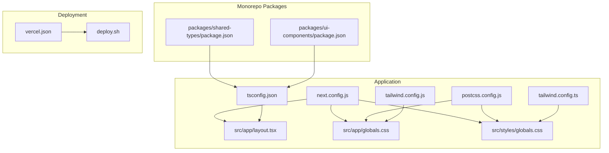
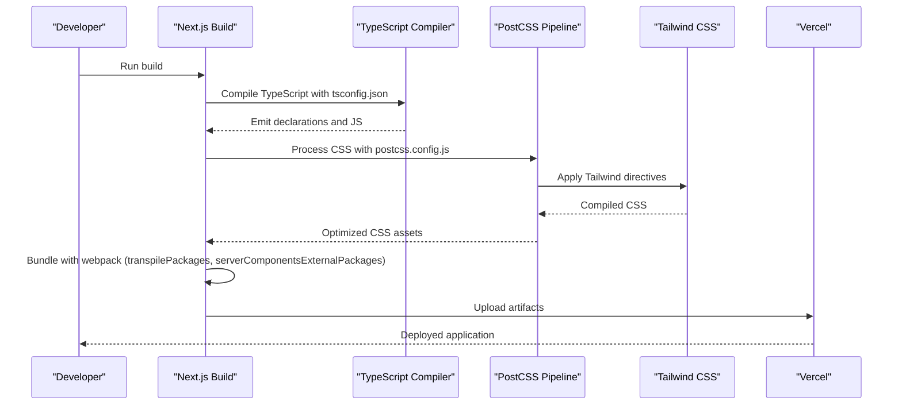
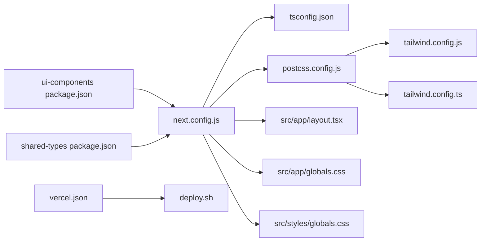

# Build Configuration

<cite>
**Referenced Files in This Document**
- [next.config.js](file://next.config.js)
- [package.json](file://package.json)
- [tsconfig.json](file://tsconfig.json)
- [postcss.config.js](file://postcss.config.js)
- [tailwind.config.js](file://tailwind.config.js)
- [tailwind.config.ts](file://tailwind.config.ts)
- [vercel.json](file://vercel.json)
- [deploy.sh](file://deploy.sh)
- [next-env.d.ts](file://next-env.d.ts)
- [src/app/layout.tsx](file://src/app/layout.tsx)
- [src/app/globals.css](file://src/app/globals.css)
- [src/styles/globals.css](file://src/styles/globals.css)
- [packages/shared-types/package.json](file://packages/shared-types/package.json)
- [packages/ui-components/package.json](file://packages/ui-components/package.json)
</cite>

## Table of Contents
1. [Introduction](#introduction)
2. [Project Structure](#project-structure)
3. [Core Components](#core-components)
4. [Architecture Overview](#architecture-overview)
5. [Detailed Component Analysis](#detailed-component-analysis)
6. [Dependency Analysis](#dependency-analysis)
7. [Performance Considerations](#performance-considerations)
8. [Troubleshooting Guide](#troubleshooting-guide)
9. [Conclusion](#conclusion)
10. [Appendices](#appendices)

## Introduction
This document explains the build configuration for the Next.js application, focusing on optimization and webpack-related settings. It covers experimental server components external packages configuration, transpilation settings for monorepo packages, image optimization, build process, asset optimization, performance tuning, TypeScript configuration, Tailwind CSS integration, and PostCSS setup. Practical examples demonstrate customization, bundle optimization, and differences between development and production. Guidance is included for troubleshooting, performance monitoring, and optimization strategies for large applications.

## Project Structure
The build configuration centers around Next.js configuration, TypeScript compiler options, Tailwind CSS setup, and PostCSS pipeline. The repository is a monorepo with shared packages that are transpiled into the app during builds. Deployment is configured for Vercel with a framework flag.

**Diagram sources**
- [next.config.js](file://next.config.js#L1-L56)
- [tsconfig.json](file://tsconfig.json#L1-L38)
- [postcss.config.js](file://postcss.config.js#L1-L7)
- [tailwind.config.js](file://tailwind.config.js#L1-L108)
- [tailwind.config.ts](file://tailwind.config.ts#L1-L133)
- [src/app/layout.tsx](file://src/app/layout.tsx#L1-L102)
- [src/app/globals.css](file://src/app/globals.css#L1-L141)
- [src/styles/globals.css](file://src/styles/globals.css#L1-L288)
- [packages/shared-types/package.json](file://packages/shared-types/package.json#L1-L17)
- [packages/ui-components/package.json](file://packages/ui-components/package.json#L1-L54)
- [vercel.json](file://vercel.json#L1-L4)
- [deploy.sh](file://deploy.sh#L1-L13)

**Section sources**
- [next.config.js](file://next.config.js#L1-L56)
- [package.json](file://package.json#L1-L80)
- [tsconfig.json](file://tsconfig.json#L1-L38)
- [postcss.config.js](file://postcss.config.js#L1-L7)
- [tailwind.config.js](file://tailwind.config.js#L1-L108)
- [tailwind.config.ts](file://tailwind.config.ts#L1-L133)
- [vercel.json](file://vercel.json#L1-L4)
- [deploy.sh](file://deploy.sh#L1-L13)

## Core Components
- Next.js configuration
  - Experimental server components external packages: controls bundling of specific packages as externals for server-side rendering.
  - Transpilation of monorepo packages: ensures shared packages are transpiled during builds.
  - Image optimization: defines allowed remote patterns for Next's image optimization.
  - Environment variables exposed to client: sets public runtime variables.
  - Redirects and rewrites: routing rules for authentication and API proxying.
- TypeScript configuration
  - Strictness and module resolution tailored for Next.js.
  - Path aliases for internal modules and monorepo packages.
  - Incremental compilation and isolated modules for fast builds.
- Tailwind CSS
  - Two Tailwind configurations exist: a JavaScript variant and a TypeScript variant.
  - PostCSS pipeline enables Tailwind directives and autoprefixing.
- Deployment
  - Vercel framework flag and environment variables for production deployment.

**Section sources**
- [next.config.js](file://next.config.js#L1-L56)
- [tsconfig.json](file://tsconfig.json#L1-L38)
- [postcss.config.js](file://postcss.config.js#L1-L7)
- [tailwind.config.js](file://tailwind.config.js#L1-L108)
- [tailwind.config.ts](file://tailwind.config.ts#L1-L133)
- [vercel.json](file://vercel.json#L1-L4)
- [deploy.sh](file://deploy.sh#L1-L13)

## Architecture Overview
The build pipeline integrates Next.js configuration, TypeScript compilation, Tailwind CSS processing via PostCSS, and deployment orchestration. Monorepo packages are transpiled and bundled with the application, while server components external packages are treated as externals for SSR.

**Diagram sources**
- [next.config.js](file://next.config.js#L1-L56)
- [tsconfig.json](file://tsconfig.json#L1-L38)
- [postcss.config.js](file://postcss.config.js#L1-L7)
- [tailwind.config.js](file://tailwind.config.js#L1-L108)
- [tailwind.config.ts](file://tailwind.config.ts#L1-L133)
- [vercel.json](file://vercel.json#L1-L4)

## Detailed Component Analysis

### Next.js Configuration
Key areas:
- Experimental server components external packages
  - Purpose: Exclude specific packages from the server bundle to reduce size and avoid bundling incompatible server-only modules.
  - Example reference: [next.config.js](file://next.config.js#L3-L5)
- Transpilation settings for monorepo packages
  - Purpose: Force Next.js to transpile selected packages so they work in the app’s runtime.
  - Example reference: [next.config.js](file://next.config.js#L6)
- Image optimization
  - Purpose: Allowlist domains and ports for remote images to leverage Next’s optimized image pipeline.
  - Example reference: [next.config.js](file://next.config.js#L7-L23)
- Environment variables
  - Purpose: Expose runtime variables to the client via NEXT_PUBLIC_*.
  - Example reference: [next.config.js](file://next.config.js#L24-L27)
- Redirects and rewrites
  - Purpose: Route logic for authenticated home redirect and API proxying.
  - Example reference: [next.config.js](file://next.config.js#L28-L51)

Practical customization examples:
- Add a new external package for server components:
  - Modify the experimental server components external packages list.
  - Reference: [next.config.js](file://next.config.js#L3-L5)
- Add a new monorepo package to transpile:
  - Extend the transpilePackages array with the new package name.
  - Reference: [next.config.js](file://next.config.js#L6)
- Expand image remote patterns:
  - Append protocol, hostname, and optional port to the images.remotePatterns array.
  - Reference: [next.config.js](file://next.config.js#L7-L23)

Development vs production differences:
- Development: Uses Next.js dev server with hot reload and incremental TypeScript checks.
- Production: Builds optimized bundles, minifies CSS/JS, and applies image optimization rules.

**Section sources**
- [next.config.js](file://next.config.js#L1-L56)

### TypeScript Configuration
Highlights:
- Strict type checking and isolated modules for fast incremental builds.
- Module resolution set to bundler for compatibility with Next.js App Router.
- Path aliases for internal modules and monorepo packages.
- Plugins include the Next.js TypeScript plugin.
- Incremental compilation enabled.

Customization tips:
- Adjust strictness or module resolution if migrating legacy code.
- Add or modify path aliases to reflect package structure changes.
- Reference: [tsconfig.json](file://tsconfig.json#L1-L38)

**Section sources**
- [tsconfig.json](file://tsconfig.json#L1-L38)
- [next-env.d.ts](file://next-env.d.ts#L1-L6)

### Tailwind CSS Integration
Two Tailwind configurations are present:
- JavaScript variant: Defines content globs, theme extensions, and plugins.
  - Reference: [tailwind.config.js](file://tailwind.config.js#L1-L108)
- TypeScript variant: Provides a strongly typed configuration with additional theme tokens and animations.
  - Reference: [tailwind.config.ts](file://tailwind.config.ts#L1-L133)

PostCSS pipeline:
- Enables Tailwind directives and autoprefixer.
- References: [postcss.config.js](file://postcss.config.js#L1-L7)

CSS entry points:
- Application global CSS: imports Tailwind layers and defines base/theme/components/utilities.
  - Reference: [src/app/globals.css](file://src/app/globals.css#L1-L141)
- Additional styles: provides Ember-specific theme tokens and prose styles.
  - Reference: [src/styles/globals.css](file://src/styles/globals.css#L1-L288)

Optimization strategies:
- Keep content globs scoped to reduce rebuild time.
- Prefer CSS variables and Tailwind utilities to minimize custom CSS.
- Use Tailwind plugins judiciously to avoid bloating the CSS output.

**Section sources**
- [tailwind.config.js](file://tailwind.config.js#L1-L108)
- [tailwind.config.ts](file://tailwind.config.ts#L1-L133)
- [postcss.config.js](file://postcss.config.js#L1-L7)
- [src/app/globals.css](file://src/app/globals.css#L1-L141)
- [src/styles/globals.css](file://src/styles/globals.css#L1-L288)

### Monorepo Package Transpilation
The application consumes two local packages:
- Shared types package: compiled with TypeScript; exposes main and types entries.
  - Reference: [packages/shared-types/package.json](file://packages/shared-types/package.json#L1-L17)
- UI components package: compiled with TypeScript; includes peer dependencies and dependencies.
  - Reference: [packages/ui-components/package.json](file://packages/ui-components/package.json#L1-L54)

Transpilation behavior:
- Next.js transpiles these packages per configuration to ensure compatibility with the app’s runtime.
- Reference: [next.config.js](file://next.config.js#L6)

Best practices:
- Keep peer dependencies aligned with the host app’s React version.
- Use file: protocol for local packages during development and ensure builds target dist or src accordingly.

**Section sources**
- [next.config.js](file://next.config.js#L6)
- [packages/shared-types/package.json](file://packages/shared-types/package.json#L1-L17)
- [packages/ui-components/package.json](file://packages/ui-components/package.json#L1-L54)

### Build Process and Asset Optimization
- Build lifecycle:
  - TypeScript compilation with tsconfig.json.
  - PostCSS processing with Tailwind directives.
  - Webpack bundling with transpilation and externalization rules.
  - Image optimization via configured remote patterns.
- Asset optimization:
  - CSS: Tailwind purges unused classes; autoprefixer adds vendor prefixes.
  - Images: Next Image supports responsive srcset and modern formats when deployed.
- Environment exposure:
  - Public variables are embedded at build time for client-side consumption.
  - Reference: [next.config.js](file://next.config.js#L24-L27)

**Section sources**
- [next.config.js](file://next.config.js#L1-L56)
- [tsconfig.json](file://tsconfig.json#L1-L38)
- [postcss.config.js](file://postcss.config.js#L1-L7)
- [tailwind.config.js](file://tailwind.config.js#L1-L108)
- [tailwind.config.ts](file://tailwind.config.ts#L1-L133)

### Deployment and Production Settings
- Vercel framework detection:
  - Framework flag indicates Next.js to Vercel.
  - Reference: [vercel.json](file://vercel.json#L1-L4)
- Environment variables for production:
  - Script demonstrates setting database and Supabase credentials for production.
  - Reference: [deploy.sh](file://deploy.sh#L1-L13)

**Section sources**
- [vercel.json](file://vercel.json#L1-L4)
- [deploy.sh](file://deploy.sh#L1-L13)

## Dependency Analysis
The build configuration exhibits tight coupling between Next.js, TypeScript, Tailwind CSS, and PostCSS. Monorepo packages are integrated via transpilation settings. The following diagram shows key dependencies:

**Diagram sources**
- [next.config.js](file://next.config.js#L1-L56)
- [tsconfig.json](file://tsconfig.json#L1-L38)
- [postcss.config.js](file://postcss.config.js#L1-L7)
- [tailwind.config.js](file://tailwind.config.js#L1-L108)
- [tailwind.config.ts](file://tailwind.config.ts#L1-L133)
- [src/app/layout.tsx](file://src/app/layout.tsx#L1-L102)
- [src/app/globals.css](file://src/app/globals.css#L1-L141)
- [src/styles/globals.css](file://src/styles/globals.css#L1-L288)
- [packages/ui-components/package.json](file://packages/ui-components/package.json#L1-L54)
- [packages/shared-types/package.json](file://packages/shared-types/package.json#L1-L17)
- [vercel.json](file://vercel.json#L1-L4)
- [deploy.sh](file://deploy.sh#L1-L13)

**Section sources**
- [next.config.js](file://next.config.js#L1-L56)
- [tsconfig.json](file://tsconfig.json#L1-L38)
- [postcss.config.js](file://postcss.config.js#L1-L7)
- [tailwind.config.js](file://tailwind.config.js#L1-L108)
- [tailwind.config.ts](file://tailwind.config.ts#L1-L133)
- [src/app/layout.tsx](file://src/app/layout.tsx#L1-L102)
- [src/app/globals.css](file://src/app/globals.css#L1-L141)
- [src/styles/globals.css](file://src/styles/globals.css#L1-L288)
- [packages/ui-components/package.json](file://packages/ui-components/package.json#L1-L54)
- [packages/shared-types/package.json](file://packages/shared-types/package.json#L1-L17)
- [vercel.json](file://vercel.json#L1-L4)
- [deploy.sh](file://deploy.sh#L1-L13)

## Performance Considerations
- Server components external packages
  - Reduces server bundle size by excluding packages from SSR builds.
  - Reference: [next.config.js](file://next.config.js#L3-L5)
- Transpile monorepo packages
  - Ensures compatibility but increases bundle size slightly; keep transpiled packages lean.
  - Reference: [next.config.js](file://next.config.js#L6)
- Image optimization
  - Restrict remote patterns to trusted hosts to prevent abuse and optimize caching.
  - Reference: [next.config.js](file://next.config.js#L7-L23)
- Tailwind and PostCSS
  - Scope content globs to reduce purge cycles.
  - Use CSS variables and utilities to minimize custom CSS.
  - Reference: [tailwind.config.js](file://tailwind.config.js#L1-L108), [tailwind.config.ts](file://tailwind.config.ts#L1-L133), [postcss.config.js](file://postcss.config.js#L1-L7)
- TypeScript
  - Enable incremental compilation and isolated modules for faster builds.
  - Reference: [tsconfig.json](file://tsconfig.json#L1-L38)
- Environment variables
  - Avoid leaking secrets; only expose NEXT_PUBLIC_* to the client.
  - Reference: [next.config.js](file://next.config.js#L24-L27)

[No sources needed since this section provides general guidance]

## Troubleshooting Guide
Common issues and resolutions:
- Server components fail to render due to external package bundling
  - Add the problematic package to serverComponentsExternalPackages.
  - Reference: [next.config.js](file://next.config.js#L3-L5)
- Monorepo package not found or incompatible
  - Ensure the package is listed in transpilePackages and compiles to a compatible target.
  - Reference: [next.config.js](file://next.config.js#L6), [packages/ui-components/package.json](file://packages/ui-components/package.json#L1-L54), [packages/shared-types/package.json](file://packages/shared-types/package.json#L1-L17)
- Remote images not optimizing
  - Verify the remote pattern matches the image URL protocol, hostname, and port.
  - Reference: [next.config.js](file://next.config.js#L7-L23)
- Tailwind classes not applied
  - Confirm content globs include the relevant directories and Tailwind directives are processed by PostCSS.
  - Reference: [tailwind.config.js](file://tailwind.config.js#L1-L108), [tailwind.config.ts](file://tailwind.config.ts#L1-L133), [postcss.config.js](file://postcss.config.js#L1-L7)
- CSS not updating after changes
  - Clear Next.js cache and rebuild; ensure Tailwind layers are imported in global CSS.
  - References: [src/app/globals.css](file://src/app/globals.css#L1-L141), [src/styles/globals.css](file://src/styles/globals.css#L1-L288)
- Environment variables not available on client
  - Prefix variables with NEXT_PUBLIC_ and confirm exposure in next.config.js.
  - Reference: [next.config.js](file://next.config.js#L24-L27)

**Section sources**
- [next.config.js](file://next.config.js#L1-L56)
- [packages/ui-components/package.json](file://packages/ui-components/package.json#L1-L54)
- [packages/shared-types/package.json](file://packages/shared-types/package.json#L1-L17)
- [tailwind.config.js](file://tailwind.config.js#L1-L108)
- [tailwind.config.ts](file://tailwind.config.ts#L1-L133)
- [postcss.config.js](file://postcss.config.js#L1-L7)
- [src/app/globals.css](file://src/app/globals.css#L1-L141)
- [src/styles/globals.css](file://src/styles/globals.css#L1-L288)

## Conclusion
The build configuration leverages Next.js capabilities to optimize server components, transpile monorepo packages, and streamline image and CSS processing. By aligning TypeScript, Tailwind, and PostCSS settings with the application’s structure and deployment targets, teams can achieve fast builds, efficient bundles, and maintainable styles. For large applications, focus on scoping content globs, minimizing transpiled packages, and carefully managing externalized server dependencies.

[No sources needed since this section summarizes without analyzing specific files]

## Appendices

### Practical Examples Index
- Customize server components external packages
  - Reference: [next.config.js](file://next.config.js#L3-L5)
- Add a monorepo package to transpile
  - Reference: [next.config.js](file://next.config.js#L6)
- Configure image remote patterns
  - Reference: [next.config.js](file://next.config.js#L7-L23)
- Expose environment variables to client
  - Reference: [next.config.js](file://next.config.js#L24-L27)
- Tailwind content globs and plugins
  - Reference: [tailwind.config.js](file://tailwind.config.js#L1-L108)
- TypeScript path aliases and module resolution
  - Reference: [tsconfig.json](file://tsconfig.json#L1-L38)

[No sources needed since this section aggregates references already cited above]