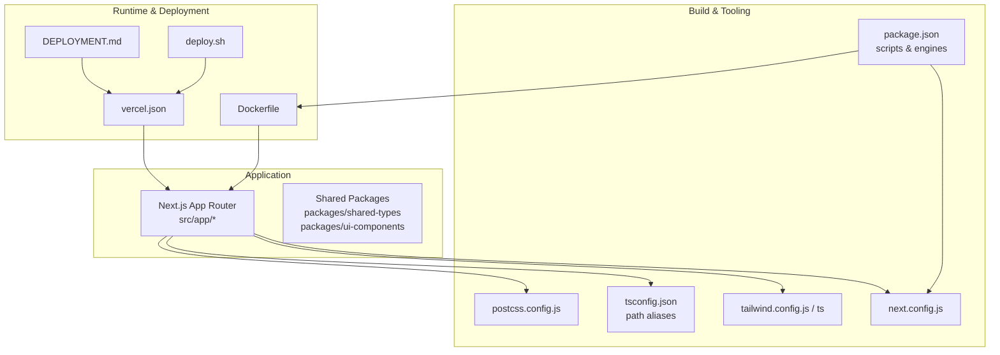
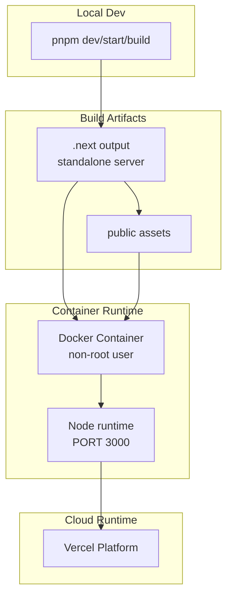
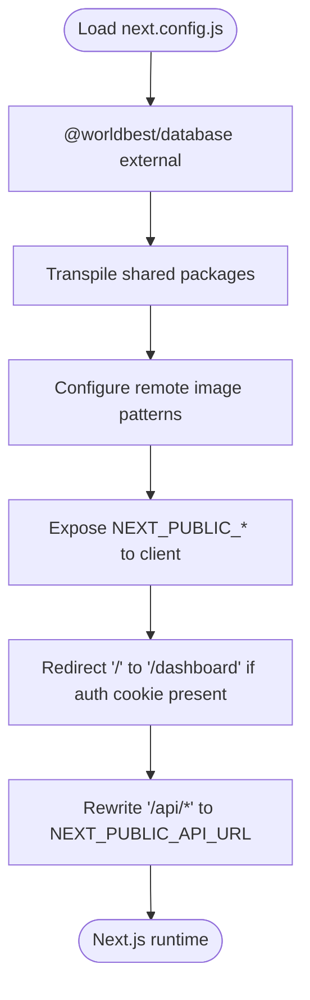
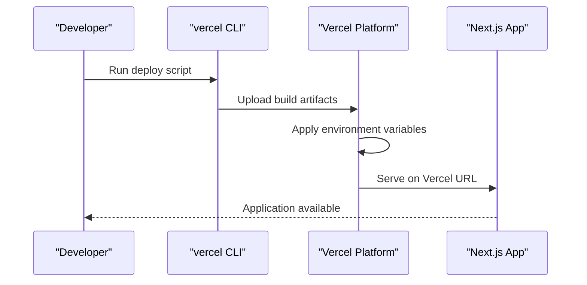
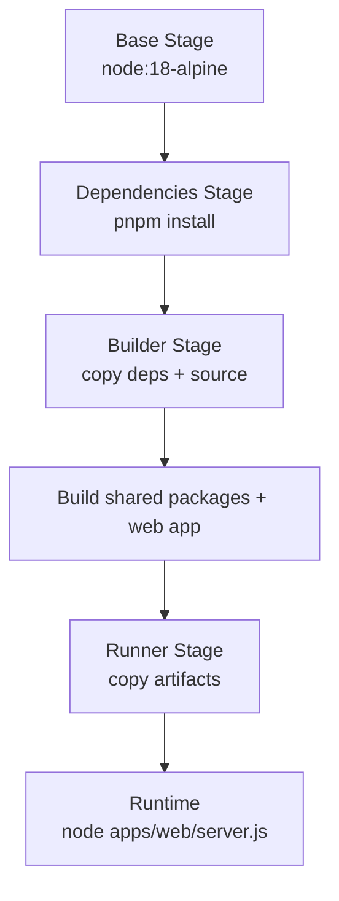
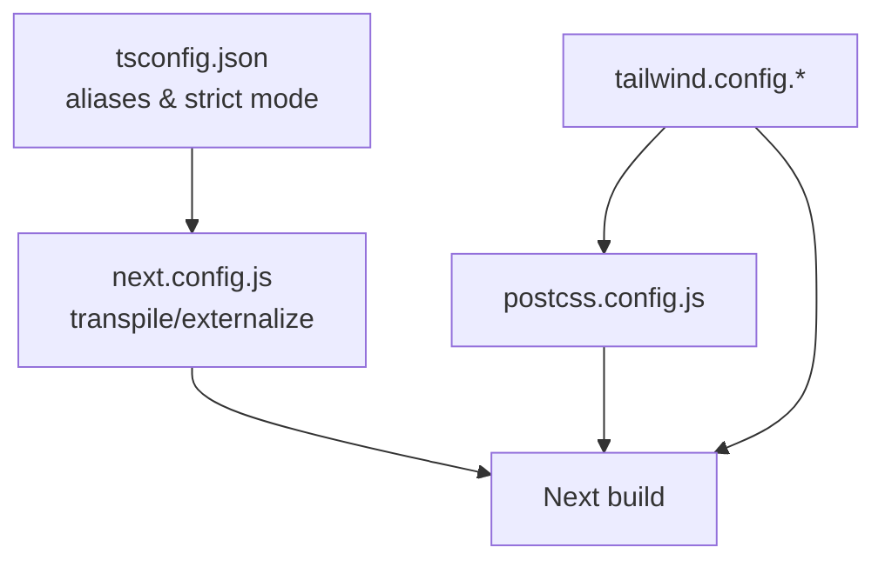
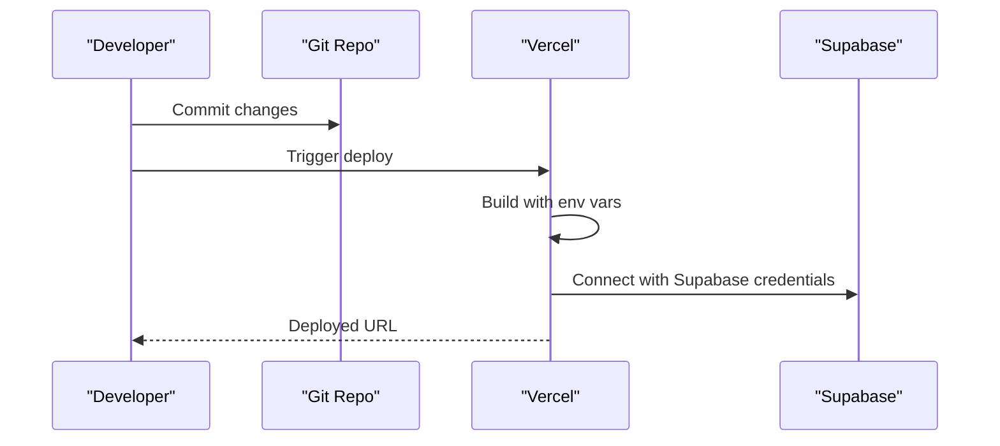
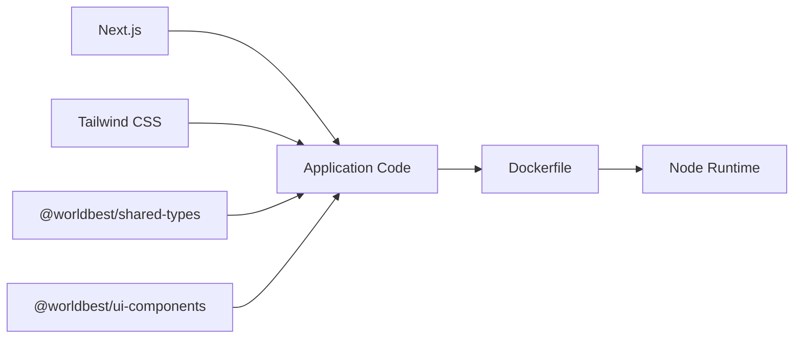

# Configuration & Environment

<cite>
**Referenced Files in This Document**
- [next.config.js](file://next.config.js)
- [vercel.json](file://vercel.json)
- [Dockerfile](file://Dockerfile)
- [package.json](file://package.json)
- [DEPLOYMENT.md](file://DEPLOYMENT.md)
- [deploy.sh](file://deploy.sh)
- [tailwind.config.js](file://tailwind.config.js)
- [tailwind.config.ts](file://tailwind.config.ts)
- [tsconfig.json](file://tsconfig.json)
- [postcss.config.js](file://postcss.config.js)
- [README.md](file://README.md)
- [IMPLEMENTATION_PLAN.md](file://IMPLEMENTATION_PLAN.md)
- [EXECUTIVE_SUMMARY.md](file://EXECUTIVE_SUMMARY.md)
</cite>

## Table of Contents
1. [Introduction](#introduction)
2. [Project Structure](#project-structure)
3. [Core Components](#core-components)
4. [Architecture Overview](#architecture-overview)
5. [Detailed Component Analysis](#detailed-component-analysis)
6. [Dependency Analysis](#dependency-analysis)
7. [Performance Considerations](#performance-considerations)
8. [Troubleshooting Guide](#troubleshooting-guide)
9. [Conclusion](#conclusion)
10. [Appendices](#appendices)

## Introduction
This document explains how to configure and manage environments for the application, focusing on Next.js configuration, Vercel deployment, and Docker containerization. It covers environment variable structure, build configuration, deployment settings, and practical workflows for development, staging, and production. It also outlines performance tuning, security considerations, monitoring, and CI/CD planning based on the repository’s current configuration and planned enhancements.

## Project Structure
The repository is a monorepo-like setup with a Next.js application and shared packages. Configuration files define build behavior, environment variables, and deployment targets.

**Diagram sources**
- [package.json](file://package.json#L1-L80)
- [tsconfig.json](file://tsconfig.json#L1-L38)
- [tailwind.config.js](file://tailwind.config.js#L1-L108)
- [tailwind.config.ts](file://tailwind.config.ts#L1-L133)
- [postcss.config.js](file://postcss.config.js#L1-L7)
- [next.config.js](file://next.config.js#L1-L56)
- [Dockerfile](file://Dockerfile#L1-L73)
- [vercel.json](file://vercel.json#L1-L4)
- [DEPLOYMENT.md](file://DEPLOYMENT.md#L1-L147)
- [deploy.sh](file://deploy.sh#L1-L13)

**Section sources**
- [package.json](file://package.json#L1-L80)
- [tsconfig.json](file://tsconfig.json#L1-L38)
- [tailwind.config.js](file://tailwind.config.js#L1-L108)
- [tailwind.config.ts](file://tailwind.config.ts#L1-L133)
- [postcss.config.js](file://postcss.config.js#L1-L7)
- [next.config.js](file://next.config.js#L1-L56)
- [Dockerfile](file://Dockerfile#L1-L73)
- [vercel.json](file://vercel.json#L1-L4)
- [DEPLOYMENT.md](file://DEPLOYMENT.md#L1-L147)
- [deploy.sh](file://deploy.sh#L1-L13)

## Core Components
- Next.js configuration defines image remote patterns, environment variables exposed to the client, redirects, and rewrites.
- Vercel configuration declares the framework and integrates with the Next.js app.
- Dockerfile builds and runs the application in a production-ready container with multi-stage builds and non-root user execution.
- Package configuration defines scripts, engines, and dependencies for development and production.
- Tailwind configuration supports both JavaScript and TypeScript variants and includes custom design tokens.
- PostCSS configuration enables Tailwind and Autoprefixer.
- Deployment documentation and script provide environment variable setup and automated deployment steps.

**Section sources**
- [next.config.js](file://next.config.js#L1-L56)
- [vercel.json](file://vercel.json#L1-L4)
- [Dockerfile](file://Dockerfile#L1-L73)
- [package.json](file://package.json#L1-L80)
- [tailwind.config.js](file://tailwind.config.js#L1-L108)
- [tailwind.config.ts](file://tailwind.config.ts#L1-L133)
- [postcss.config.js](file://postcss.config.js#L1-L7)
- [DEPLOYMENT.md](file://DEPLOYMENT.md#L1-L147)
- [deploy.sh](file://deploy.sh#L1-L13)

## Architecture Overview
The runtime architecture ties together the build, containerization, and deployment layers.

**Diagram sources**
- [Dockerfile](file://Dockerfile#L38-L73)
- [next.config.js](file://next.config.js#L43-L51)
- [vercel.json](file://vercel.json#L1-L4)

**Section sources**
- [Dockerfile](file://Dockerfile#L1-L73)
- [next.config.js](file://next.config.js#L1-L56)
- [vercel.json](file://vercel.json#L1-L4)

## Detailed Component Analysis

### Next.js Configuration
Key areas:
- External packages for server components
- Transpiled packages for monorepo sharing
- Remote image patterns for CDN and local MinIO
- Client-exposed environment variables
- Redirects and rewrites for authentication and API routing

**Diagram sources**
- [next.config.js](file://next.config.js#L1-L56)

**Section sources**
- [next.config.js](file://next.config.js#L1-L56)

### Vercel Deployment Settings
- Framework declaration for Next.js
- Environment variable management via Vercel dashboard or CLI script

**Diagram sources**
- [vercel.json](file://vercel.json#L1-L4)
- [deploy.sh](file://deploy.sh#L1-L13)
- [DEPLOYMENT.md](file://DEPLOYMENT.md#L1-L147)

**Section sources**
- [vercel.json](file://vercel.json#L1-L4)
- [deploy.sh](file://deploy.sh#L1-L13)
- [DEPLOYMENT.md](file://DEPLOYMENT.md#L1-L147)

### Docker Containerization
- Multi-stage build: base, deps, builder, runner
- Non-root user and secure permissions
- Standalone server packaging and static asset handling
- Environment variables for production runtime

**Diagram sources**
- [Dockerfile](file://Dockerfile#L1-L73)

**Section sources**
- [Dockerfile](file://Dockerfile#L1-L73)

### Environment Variable Structure
- Client-exposed variables: NEXT_PUBLIC_SUPABASE_URL, NEXT_PUBLIC_SUPABASE_ANON_KEY, NEXT_PUBLIC_API_URL, NEXT_PUBLIC_WS_URL
- Server-only variables: Supabase secrets, database URLs
- Local development: .env.local (ignored by Git)
- Vercel-managed variables for production

Practical setup examples:
- Local copy and edit of environment template
- Vercel dashboard environment variables
- CLI deployment with environment variables

**Section sources**
- [next.config.js](file://next.config.js#L24-L27)
- [DEPLOYMENT.md](file://DEPLOYMENT.md#L12-L56)
- [deploy.sh](file://deploy.sh#L4-L12)
- [README.md](file://README.md#L117-L144)

### Build Configuration and Optimization
- TypeScript configuration with path aliases and strict mode
- Tailwind CSS configuration supporting both JS and TS variants
- PostCSS pipeline enabling Tailwind and Autoprefixer
- Next.js transpilation and externalization for monorepo packages
- Image optimization with remote patterns

**Diagram sources**
- [tsconfig.json](file://tsconfig.json#L1-L38)
- [tailwind.config.js](file://tailwind.config.js#L1-L108)
- [tailwind.config.ts](file://tailwind.config.ts#L1-L133)
- [postcss.config.js](file://postcss.config.js#L1-L7)
- [next.config.js](file://next.config.js#L1-L56)

**Section sources**
- [tsconfig.json](file://tsconfig.json#L1-L38)
- [tailwind.config.js](file://tailwind.config.js#L1-L108)
- [tailwind.config.ts](file://tailwind.config.ts#L1-L133)
- [postcss.config.js](file://postcss.config.js#L1-L7)
- [next.config.js](file://next.config.js#L1-L56)

### Deployment Workflows
- Manual deployment: build and start locally
- Vercel deployment: import repo, configure environment variables, deploy
- Automated deployment: CLI with environment variables

**Diagram sources**
- [DEPLOYMENT.md](file://DEPLOYMENT.md#L3-L39)
- [deploy.sh](file://deploy.sh#L4-L12)

**Section sources**
- [README.md](file://README.md#L210-L232)
- [DEPLOYMENT.md](file://DEPLOYMENT.md#L1-L147)
- [deploy.sh](file://deploy.sh#L1-L13)

### CI/CD Pipeline and Automated Deployments
- Planned GitHub Actions workflows for linting, testing, staging/production deployments, preview deployments, and dependency updates
- Zero-downtime deployment goals and rollback capability
- Preview deployments on pull requests

**Section sources**
- [IMPLEMENTATION_PLAN.md](file://IMPLEMENTATION_PLAN.md#L665-L704)

### Environment-Specific Optimizations
- Development: localhost defaults for API and WebSocket
- Staging: placeholder until defined
- Production: Vercel-hosted with Supabase backend and environment variables managed centrally

**Section sources**
- [next.config.js](file://next.config.js#L24-L27)
- [README.md](file://README.md#L233-L238)
- [DEPLOYMENT.md](file://DEPLOYMENT.md#L1-L147)

### Security Considerations
- Sensitive variables stored in Vercel environment variables
- Client-exposed variables prefixed with NEXT_PUBLIC_
- Planned security enhancements: CSP headers, rate limiting, CSRF protection, input validation, audit logging

**Section sources**
- [DEPLOYMENT.md](file://DEPLOYMENT.md#L59-L66)
- [IMPLEMENTATION_PLAN.md](file://IMPLEMENTATION_PLAN.md#L536-L575)

### Performance Monitoring and Scaling
- Planned performance monitoring and Web Vitals tracking
- Performance targets: Lighthouse scores, time to interactive, first contentful paint, bundle size
- Monitoring stack: Sentry, Grafana/DataDog
- Scaling considerations: container runtime, Vercel autoscaling, database connection pooling

**Section sources**
- [IMPLEMENTATION_PLAN.md](file://IMPLEMENTATION_PLAN.md#L492-L575)
- [EXECUTIVE_SUMMARY.md](file://EXECUTIVE_SUMMARY.md#L184-L211)
- [DEPLOYMENT.md](file://DEPLOYMENT.md#L90-L96)

## Dependency Analysis
The application depends on Next.js, Tailwind CSS, and shared packages. The Dockerfile coordinates monorepo builds and ensures a minimal production runtime.

**Diagram sources**
- [package.json](file://package.json#L34-L35)
- [next.config.js](file://next.config.js#L4-L6)
- [Dockerfile](file://Dockerfile#L34-L41)

**Section sources**
- [package.json](file://package.json#L1-L80)
- [next.config.js](file://next.config.js#L1-L56)
- [Dockerfile](file://Dockerfile#L1-L73)

## Performance Considerations
- Bundle size optimization and tree-shaking
- Image optimization with responsive images and lazy loading
- Code splitting and dynamic imports
- Database query optimization and connection pooling
- Monitoring Web Vitals and custom metrics

**Section sources**
- [IMPLEMENTATION_PLAN.md](file://IMPLEMENTATION_PLAN.md#L492-L533)
- [EXECUTIVE_SUMMARY.md](file://EXECUTIVE_SUMMARY.md#L184-L211)

## Troubleshooting Guide
Common issues and resolutions:
- Database connection problems: verify environment variables, project status, connection string format, SSL mode
- Build failures: check Vercel logs, dependencies, TypeScript errors, and environment variables
- Authentication redirects: confirm cookie presence and rewrite rules
- Docker build/runtime errors: validate multi-stage stages, permissions, and environment variables

**Section sources**
- [DEPLOYMENT.md](file://DEPLOYMENT.md#L116-L134)
- [next.config.js](file://next.config.js#L28-L51)
- [Dockerfile](file://Dockerfile#L44-L73)

## Conclusion
The repository provides a solid foundation for environment and configuration management with Next.js, Vercel, and Docker. The planned CI/CD pipeline, performance optimizations, security hardening, and monitoring will further strengthen production readiness. Teams should focus on implementing the CI/CD workflows, establishing environment-specific configurations, and validating performance and security measures before launch.

## Appendices

### Practical Examples Index
- Local environment setup and scripts
- Vercel environment variable configuration
- Automated deployment with CLI
- Docker build and run commands

**Section sources**
- [README.md](file://README.md#L117-L155)
- [DEPLOYMENT.md](file://DEPLOYMENT.md#L12-L56)
- [deploy.sh](file://deploy.sh#L1-L13)
- [Dockerfile](file://Dockerfile#L67-L73)