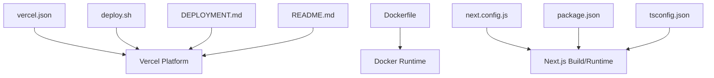
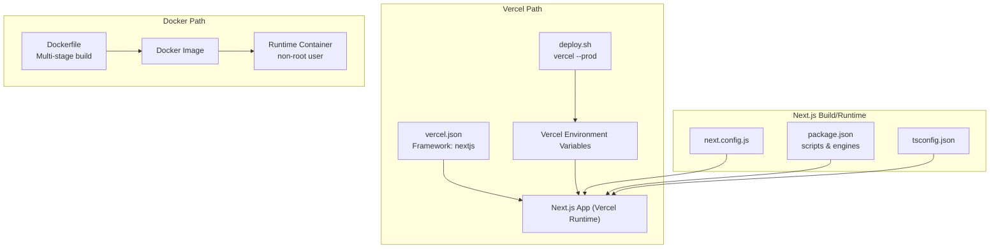
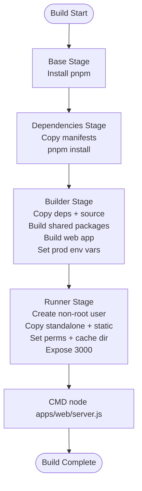
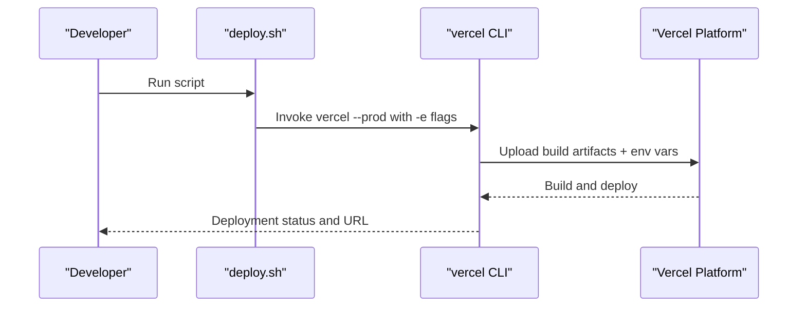
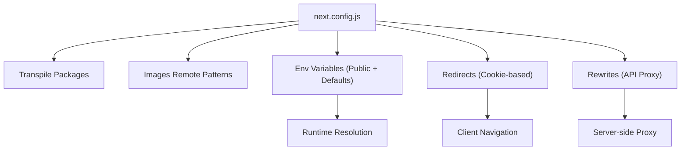
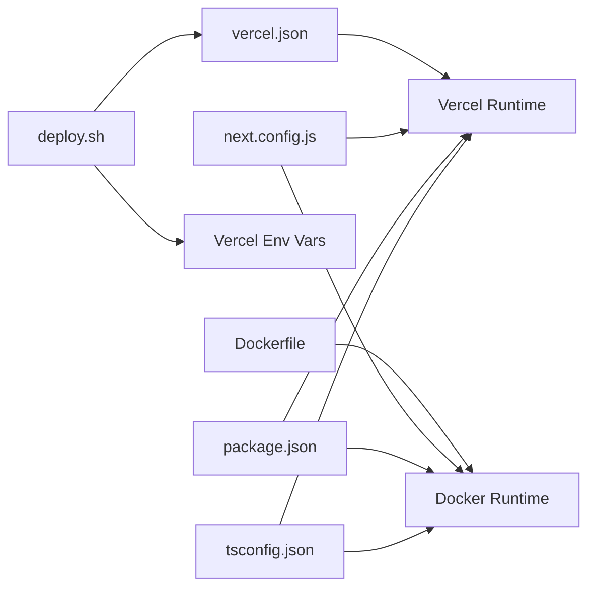

# Deployment Settings

<cite>
**Referenced Files in This Document**
- [vercel.json](file://vercel.json)
- [Dockerfile](file://Dockerfile)
- [deploy.sh](file://deploy.sh)
- [next.config.js](file://next.config.js)
- [package.json](file://package.json)
- [DEPLOYMENT.md](file://DEPLOYMENT.md)
- [README.md](file://README.md)
- [tsconfig.json](file://tsconfig.json)
</cite>

## Table of Contents
1. [Introduction](#introduction)
2. [Project Structure](#project-structure)
3. [Core Components](#core-components)
4. [Architecture Overview](#architecture-overview)
5. [Detailed Component Analysis](#detailed-component-analysis)
6. [Dependency Analysis](#dependency-analysis)
7. [Performance Considerations](#performance-considerations)
8. [Troubleshooting Guide](#troubleshooting-guide)
9. [Conclusion](#conclusion)
10. [Appendices](#appendices)

## Introduction
This document explains deployment settings for Vercel-hosted Next.js applications and containerized production deployments. It covers Vercel platform configuration, build settings, environment variables, Docker multi-stage builds, and operational practices such as automated deployment workflows, monitoring, and scaling. Practical examples and rollback guidance are included to help teams deploy reliably and operate efficiently in production.

## Project Structure
The repository is a monorepo-style workspace containing a Next.js application, shared packages, and deployment assets. The most relevant files for deployment are:
- Vercel configuration for framework detection
- Dockerfile for containerized builds and runtime
- Deployment script for automated Vercel deployments
- Next.js configuration for build-time and runtime behavior
- Package manifest for scripts and engine requirements
- Deployment guide and README for operational procedures

**Diagram sources**
- [vercel.json](file://vercel.json#L1-L4)
- [Dockerfile](file://Dockerfile#L1-L73)
- [deploy.sh](file://deploy.sh#L1-L13)
- [next.config.js](file://next.config.js#L1-L56)
- [package.json](file://package.json#L1-L80)
- [DEPLOYMENT.md](file://DEPLOYMENT.md#L1-L147)
- [README.md](file://README.md#L1-L426)
- [tsconfig.json](file://tsconfig.json#L1-L38)

**Section sources**
- [vercel.json](file://vercel.json#L1-L4)
- [Dockerfile](file://Dockerfile#L1-L73)
- [deploy.sh](file://deploy.sh#L1-L13)
- [next.config.js](file://next.config.js#L1-L56)
- [package.json](file://package.json#L1-L80)
- [DEPLOYMENT.md](file://DEPLOYMENT.md#L1-L147)
- [README.md](file://README.md#L1-L426)
- [tsconfig.json](file://tsconfig.json#L1-L38)

## Core Components
- Vercel configuration: Declares the Next.js framework to enable platform optimizations and automatic static optimization.
- Dockerfile: Multi-stage build for dependencies, build, and production runtime with non-root user and secure defaults.
- Deployment script: Automates Vercel production deployment with environment variables.
- Next.js configuration: Defines transpilation, image remote patterns, environment variables, redirects, and rewrites.
- Package manifest: Provides scripts for dev/build/start and engine requirements.
- Deployment guide and README: Operational steps, environment setup, and quick-start commands.

**Section sources**
- [vercel.json](file://vercel.json#L1-L4)
- [Dockerfile](file://Dockerfile#L1-L73)
- [deploy.sh](file://deploy.sh#L1-L13)
- [next.config.js](file://next.config.js#L1-L56)
- [package.json](file://package.json#L1-L80)
- [DEPLOYMENT.md](file://DEPLOYMENT.md#L1-L147)
- [README.md](file://README.md#L1-L426)

## Architecture Overview
The deployment architecture supports two primary paths:
- Vercel-hosted Next.js application with environment variables managed in the Vercel dashboard.
- Containerized deployment via Docker with a production-ready runtime and non-root user.

**Diagram sources**
- [vercel.json](file://vercel.json#L1-L4)
- [deploy.sh](file://deploy.sh#L1-L13)
- [Dockerfile](file://Dockerfile#L1-L73)
- [next.config.js](file://next.config.js#L1-L56)
- [package.json](file://package.json#L1-L80)
- [tsconfig.json](file://tsconfig.json#L1-L38)

## Detailed Component Analysis

### Vercel Configuration
- Purpose: Declares the Next.js framework so Vercel can apply framework-specific optimizations during build and cold starts.
- Behavior: Enables automatic static export detection and related performance features when applicable.
- Integration: Works with the deployment script and environment variables configured in the Vercel dashboard.

**Section sources**
- [vercel.json](file://vercel.json#L1-L4)
- [DEPLOYMENT.md](file://DEPLOYMENT.md#L3-L38)

### Dockerfile (Multi-Stage Build)
- Stages:
  - Base: Installs pnpm and sets up Node.js runtime.
  - Dependencies: Copies workspace package manifests and installs dependencies with lockfile guarantees.
  - Builder: Copies dependencies and source, builds shared packages first, then the web application with telemetry disabled and production environment variables.
  - Runner: Creates a non-root user, copies standalone Next.js runtime artifacts and static assets, sets permissions for prerender cache, exposes port 3000, and runs the server with HOSTNAME and PORT set.
- Security and production readiness:
  - Non-root user and chown for cache directories.
  - Minimal production runtime with telemetry disabled.
  - Standalone output aligns with Next.js production runtime expectations.

**Diagram sources**
- [Dockerfile](file://Dockerfile#L1-L73)

**Section sources**
- [Dockerfile](file://Dockerfile#L1-L73)

### Deployment Script (Automated Vercel Deployment)
- Purpose: Automates production deployment to Vercel with environment variables injected via CLI flags.
- Usage: Execute the script to trigger a production deployment with secrets supplied as arguments.
- Best practice: Prefer storing secrets in Vercel’s encrypted environment variable store and avoid committing secrets to version control.

**Diagram sources**
- [deploy.sh](file://deploy.sh#L1-L13)
- [DEPLOYMENT.md](file://DEPLOYMENT.md#L3-L38)

**Section sources**
- [deploy.sh](file://deploy.sh#L1-L13)
- [DEPLOYMENT.md](file://DEPLOYMENT.md#L3-L38)

### Next.js Configuration (Build and Runtime)
- Transpilation: Includes shared packages for SSR compatibility.
- Images: Whitelists remote origins for images.
- Environment variables: Exposes public variables to the client and defines defaults for API and WebSocket URLs.
- Routing: Redirects root to dashboard when a specific cookie is present; rewrites API requests to a configurable backend URL.
- Integration: Works with Vercel and Docker deployments; environment variables are resolved at build or runtime depending on configuration.

**Diagram sources**
- [next.config.js](file://next.config.js#L1-L56)

**Section sources**
- [next.config.js](file://next.config.js#L1-L56)

### Package Manifest (Scripts and Engines)
- Scripts: Provides dev, build, start, lint, and type-check commands aligned with Next.js conventions.
- Engines: Requires Node.js 18+.
- Integration: Used by Vercel and local environments to run builds and start servers.

**Section sources**
- [package.json](file://package.json#L1-L80)

### Deployment Guide and README (Operational Procedures)
- Vercel import and environment variable configuration steps.
- Quick copy-paste format for environment variables.
- Security notes emphasizing secret storage and public variables.
- Post-deployment tasks: testing, log monitoring, optional custom domain setup.
- Troubleshooting guidance for database and build failures.
- Manual and Docker deployment commands for local and containerized environments.

**Section sources**
- [DEPLOYMENT.md](file://DEPLOYMENT.md#L1-L147)
- [README.md](file://README.md#L210-L238)

### TypeScript Configuration (Paths and Module Resolution)
- Extends a shared tsconfig and configures module resolution paths for internal packages.
- Ensures consistent compilation across local and CI environments.

**Section sources**
- [tsconfig.json](file://tsconfig.json#L1-L38)

## Dependency Analysis
- Vercel depends on vercel.json to detect the Next.js framework.
- Docker build depends on package manifests and workspace structure to install dependencies and build shared packages.
- Deployment script depends on the Vercel CLI and environment variables stored in Vercel.
- Next.js configuration influences build outputs and runtime behavior for both Vercel and Docker deployments.

**Diagram sources**
- [vercel.json](file://vercel.json#L1-L4)
- [Dockerfile](file://Dockerfile#L1-L73)
- [deploy.sh](file://deploy.sh#L1-L13)
- [next.config.js](file://next.config.js#L1-L56)
- [package.json](file://package.json#L1-L80)
- [tsconfig.json](file://tsconfig.json#L1-L38)

**Section sources**
- [vercel.json](file://vercel.json#L1-L4)
- [Dockerfile](file://Dockerfile#L1-L73)
- [deploy.sh](file://deploy.sh#L1-L13)
- [next.config.js](file://next.config.js#L1-L56)
- [package.json](file://package.json#L1-L80)
- [tsconfig.json](file://tsconfig.json#L1-L38)

## Performance Considerations
- Build-time:
  - Use transpiled shared packages to reduce SSR overhead.
  - Keep image remote patterns minimal and specific to improve caching.
  - Disable telemetry in production builds to reduce network overhead.
- Runtime:
  - Prefer Vercel for global CDN and edge optimizations.
  - For Docker, ensure the runtime container exposes the correct port and binds to 0.0.0.0 for external access.
- Monitoring:
  - Use Vercel logs and Supabase dashboards to monitor build and runtime performance.
  - Track key metrics such as build duration, response times, and error rates.

[No sources needed since this section provides general guidance]

## Troubleshooting Guide
Common issues and resolutions:
- Database connection problems:
  - Verify environment variables are correctly set in Vercel.
  - Confirm the Supabase project is active and connection strings are valid.
  - Ensure SSL mode is enabled and pooling parameters match your setup.
- Build failures:
  - Review Vercel build logs for dependency or TypeScript errors.
  - Confirm all dependencies are declared in the package manifest.
  - Ensure environment variables are present during build.
- Runtime errors:
  - Check Vercel logs for uncaught exceptions.
  - Validate that public environment variables are prefixed correctly for client visibility.
  - For Docker, confirm the container is started with the correct port mapping and environment variables.

**Section sources**
- [DEPLOYMENT.md](file://DEPLOYMENT.md#L116-L133)

## Conclusion
The repository provides a clear, production-ready foundation for deploying Next.js applications on Vercel and in containers. By leveraging vercel.json, a robust Dockerfile, and a deployment script, teams can automate reliable deployments while maintaining strong security and operational hygiene. The included Next.js configuration and deployment guide streamline environment-specific setups, monitoring, and troubleshooting.

[No sources needed since this section summarizes without analyzing specific files]

## Appendices

### Practical Deployment Strategies
- Vercel-first strategy:
  - Import the repository into Vercel, configure environment variables in the dashboard, and deploy.
  - Use the deployment script for automated production deployments with environment variables.
- Container-first strategy:
  - Build the Docker image locally or in CI, push to a registry, and deploy to a container host.
  - Ensure environment variables are passed to the container runtime and that ports are mapped correctly.

**Section sources**
- [DEPLOYMENT.md](file://DEPLOYMENT.md#L3-L38)
- [README.md](file://README.md#L227-L231)

### Environment-Specific Configurations
- Development:
  - Local environment variables via .env.local.
  - Use pnpm scripts to run dev and build locally.
- Staging:
  - Mirror production environment variables in Vercel preview deployments.
- Production:
  - Use Vercel’s encrypted environment variables for secrets.
  - Apply the deployment script for reproducible production releases.

**Section sources**
- [DEPLOYMENT.md](file://DEPLOYMENT.md#L12-L38)
- [README.md](file://README.md#L130-L134)

### Rollback Procedures
- Vercel:
  - Use the Vercel dashboard to revert to a previous successful deployment.
  - Tag releases in version control to facilitate targeted rollbacks.
- Docker:
  - Retain previous image tags and redeploy the prior tag if necessary.
  - Store environment variable snapshots for quick restoration.

[No sources needed since this section provides general guidance]

### Monitoring Setup
- Vercel:
  - Review deployment logs and performance metrics in the Vercel dashboard.
- Backend:
  - Monitor Supabase dashboards for query performance and connection health.
- Frontend:
  - Integrate client-side performance monitoring and error tracking as part of future enhancements.

**Section sources**
- [DEPLOYMENT.md](file://DEPLOYMENT.md#L106-L108)

### Scaling Considerations
- Vercel:
  - Benefit from automatic scaling and edge delivery.
  - Use preview deployments for staging and canary releases.
- Docker:
  - Scale horizontally by running multiple container replicas behind a load balancer.
  - Use environment variables to tune concurrency and resource limits.

[No sources needed since this section provides general guidance]

### Relationship Between Local and Production Environments
- Local:
  - Use .env.local for secrets and defaults.
  - Run dev and build scripts locally to validate changes.
- Production:
  - Secrets are managed in Vercel; public variables are exposed via NEXT_PUBLIC_*.
  - Use the deployment script to replicate production builds and deployments.

**Section sources**
- [README.md](file://README.md#L130-L134)
- [DEPLOYMENT.md](file://DEPLOYMENT.md#L12-L38)