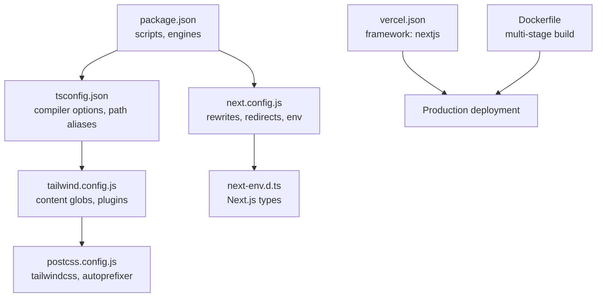
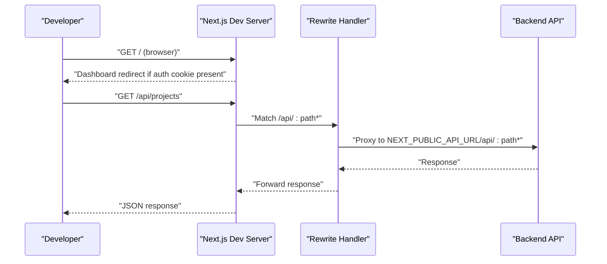
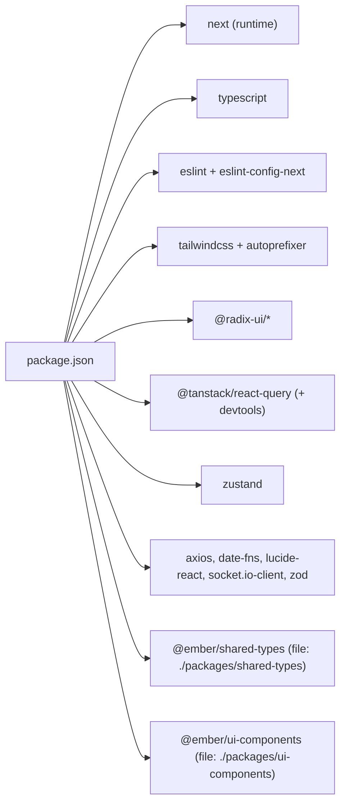

# Development Workflow

<cite>
**Referenced Files in This Document**
- [package.json](file://package.json)
- [next.config.js](file://next.config.js)
- [tsconfig.json](file://tsconfig.json)
- [tailwind.config.js](file://tailwind.config.js)
- [postcss.config.js](file://postcss.config.js)
- [next-env.d.ts](file://next-env.d.ts)
- [vercel.json](file://vercel.json)
- [Dockerfile](file://Dockerfile)
- [README.md](file://README.md)
- [DEPLOYMENT.md](file://DEPLOYMENT.md)
- [START_HERE.md](file://START_HERE.md)
</cite>

## Table of Contents
1. [Introduction](#introduction)
2. [Project Structure](#project-structure)
3. [Core Components](#core-components)
4. [Architecture Overview](#architecture-overview)
5. [Detailed Component Analysis](#detailed-component-analysis)
6. [Dependency Analysis](#dependency-analysis)
7. [Performance Considerations](#performance-considerations)
8. [Troubleshooting Guide](#troubleshooting-guide)
9. [Conclusion](#conclusion)
10. [Appendices](#appendices)

## Introduction
This document explains the development workflow for the Next.js application, focusing on environment setup, development server configuration, hot reloading, debugging tools, package scripts, TypeScript setup, linting, formatting, and production transitions. It also covers customization tips, debugging techniques, performance profiling, best practices, and team collaboration workflows tailored to this project’s configuration.

## Project Structure
The repository follows a monorepo-like structure with a Next.js application and two local packages linked via file: dependencies. The app uses Next.js App Router, TypeScript, Tailwind CSS, and integrates external services (Supabase, Vercel hosting). Key configuration files define the development server, build pipeline, and runtime behavior.

**Diagram sources**
- [package.json](file://package.json#L1-L80)
- [next.config.js](file://next.config.js#L1-L56)
- [tsconfig.json](file://tsconfig.json#L1-L38)
- [tailwind.config.js](file://tailwind.config.js#L1-L108)
- [postcss.config.js](file://postcss.config.js#L1-L7)
- [next-env.d.ts](file://next-env.d.ts#L1-L6)
- [vercel.json](file://vercel.json#L1-L4)
- [Dockerfile](file://Dockerfile#L1-L73)

**Section sources**
- [package.json](file://package.json#L1-L80)
- [next.config.js](file://next.config.js#L1-L56)
- [tsconfig.json](file://tsconfig.json#L1-L38)
- [tailwind.config.js](file://tailwind.config.js#L1-L108)
- [postcss.config.js](file://postcss.config.js#L1-L7)
- [next-env.d.ts](file://next-env.d.ts#L1-L6)
- [vercel.json](file://vercel.json#L1-L4)
- [Dockerfile](file://Dockerfile#L1-L73)

## Core Components
- Development scripts and engine requirements are defined in package.json, including dev, build, start, lint, and type-check commands.
- Next.js configuration sets up rewrites/redirects, environment variables, image remote patterns, and transpilation for local packages.
- TypeScript configuration enables strict mode, path aliases, and Next.js plugin integration.
- Tailwind CSS is configured with content globs across the app and shared packages, plus Tailwind plugins.
- PostCSS wiring ensures Tailwind and Autoprefixer run during builds.
- Next.js type declarations are included via next-env.d.ts.
- Production deployment targets are Vercel (vercel.json) and Docker multi-stage builds (Dockerfile).

Practical usage examples:
- Start the dev server: see [README.md](file://README.md#L136-L144)
- Run lint: see [package.json](file://package.json#L10-L11)
- Run type checks: see [package.json](file://package.json#L10-L11)

**Section sources**
- [package.json](file://package.json#L6-L12)
- [next.config.js](file://next.config.js#L24-L51)
- [tsconfig.json](file://tsconfig.json#L3-L34)
- [tailwind.config.js](file://tailwind.config.js#L4-L107)
- [postcss.config.js](file://postcss.config.js#L1-L7)
- [next-env.d.ts](file://next-env.d.ts#L1-L6)
- [vercel.json](file://vercel.json#L1-L4)
- [Dockerfile](file://Dockerfile#L1-L73)
- [README.md](file://README.md#L136-L155)

## Architecture Overview
The development server leverages Next.js with TypeScript and Tailwind. Requests to /api/* are rewritten to a configurable backend URL, while a redirect sends authenticated users to the dashboard. Image optimization supports remote hosts and a local MinIO instance. The app consumes local packages via transpiled paths and file: dependencies.

**Diagram sources**
- [next.config.js](file://next.config.js#L28-L51)
- [README.md](file://README.md#L233-L238)

**Section sources**
- [next.config.js](file://next.config.js#L24-L51)
- [README.md](file://README.md#L233-L238)

## Detailed Component Analysis

### Development Server and Hot Reloading
- The dev script starts Next.js in development mode with fast refresh and hot reloading.
- Environment variables for public URLs are injected at build time and used at runtime.
- Redirects and rewrites enable seamless routing to the backend and improved UX for authenticated users.

Customization tips:
- Adjust NEXT_PUBLIC_API_URL and NEXT_PUBLIC_WS_URL in environment variables to target different backends.
- Add or modify remote image patterns for asset domains.

**Section sources**
- [package.json](file://package.json#L7-L11)
- [next.config.js](file://next.config.js#L24-L51)
- [README.md](file://README.md#L136-L144)

### Debugging Tools Integration
- React Query Devtools are included as a dependency for client-side state debugging.
- Use browser devtools to inspect network requests, Redux/Zustand stores, and component trees.
- For backend debugging, proxy traffic to your local API using the rewrite configuration.

**Section sources**
- [package.json](file://package.json#L33-L33)
- [next.config.js](file://next.config.js#L43-L50)

### Package Scripts and Build Commands
- dev: starts the Next.js development server.
- build: compiles the application for production.
- start: runs the production server.
- lint: runs ESLint against the codebase.
- type-check: validates TypeScript types without emitting JS.

Recommended workflow:
- Run lint and type-check before committing.
- Use build to preview production behavior locally.

**Section sources**
- [package.json](file://package.json#L6-L12)
- [README.md](file://README.md#L146-L155)

### TypeScript Development Setup
- Strict mode is enabled with incremental compilation and isolated modules.
- Path aliases simplify imports across src and shared packages.
- Next.js plugin integration is configured for type-safe app dir support.

Best practices:
- Keep strict mode enabled for early bug detection.
- Use path aliases consistently to avoid relative path drift.
- Run type-check regularly to catch regressions.

**Section sources**
- [tsconfig.json](file://tsconfig.json#L3-L34)
- [next-env.d.ts](file://next-env.d.ts#L1-L6)

### Linting and Formatting Standards
- ESLint is configured with the Next.js recommended ruleset.
- Formatting is recommended via Prettier (as noted in contributing guidelines).
- Conventional commits are encouraged for pull request messages.

Workflow:
- Run lint before submitting changes.
- Format code with Prettier as part of pre-commit checks.

**Section sources**
- [package.json](file://package.json#L73-L75)
- [README.md](file://README.md#L302-L307)

### Tailwind CSS and Styling Pipeline
- Tailwind scans app and shared package directories for class usage.
- Plugins include forms, typography, and animations.
- PostCSS applies Tailwind and Autoprefixer during builds.

Optimization tips:
- Remove unused utilities after scoping content globs.
- Prefer component-level styling to reduce global CSS.

**Section sources**
- [tailwind.config.js](file://tailwind.config.js#L4-L107)
- [postcss.config.js](file://postcss.config.js#L1-L7)

### Local Packages Integration
- Two local packages are linked via file: dependencies and transpiled by Next.js.
- Path aliases resolve to the shared packages’ source directories.

Guidance:
- Treat shared packages as separate modules; publish or link carefully in monorepos.
- Keep type definitions synchronized between packages.

**Section sources**
- [package.json](file://package.json#L34-L35)
- [next.config.js](file://next.config.js#L6-L6)
- [tsconfig.json](file://tsconfig.json#L32-L33)

### Transition to Production
- Vercel deployment is configured with the Next.js framework setting.
- Docker multi-stage build compiles shared packages, builds the app, and runs a minimal production image.
- Environment variables are managed externally (e.g., Vercel) for sensitive data.

**Section sources**
- [vercel.json](file://vercel.json#L1-L4)
- [Dockerfile](file://Dockerfile#L1-L73)
- [DEPLOYMENT.md](file://DEPLOYMENT.md#L1-L147)

## Dependency Analysis
The project’s development stack centers on Next.js, TypeScript, Tailwind CSS, and a set of UI and state management libraries. The configuration ensures local packages are transpiled and that image optimization supports both remote and local assets.

**Diagram sources**
- [package.json](file://package.json#L13-L76)

**Section sources**
- [package.json](file://package.json#L13-L76)

## Performance Considerations
- Enable linting and type-checking in CI to prevent regressions.
- Monitor bundle size and optimize Tailwind usage.
- Use React Query Devtools to observe caching and invalidation strategies.
- Profile rendering with React DevTools Profiler and browser performance tools.

[No sources needed since this section provides general guidance]

## Troubleshooting Guide
Common issues and resolutions:
- Environment variables not applied: verify NEXT_PUBLIC_API_URL and NEXT_PUBLIC_WS_URL are set in your environment or Vercel settings.
- API proxy failures: confirm rewrites match your backend URL and that the backend is reachable.
- Image load errors: ensure remotePattern matches the intended host/port.
- Type errors: run type-check and fix strict-mode violations.
- Lint errors: address ESLint findings before merging.

**Section sources**
- [next.config.js](file://next.config.js#L24-L51)
- [DEPLOYMENT.md](file://DEPLOYMENT.md#L116-L134)
- [README.md](file://README.md#L344-L356)

## Conclusion
This development workflow leverages Next.js, TypeScript, Tailwind, and a modular package structure to streamline local development and production deployments. By following the scripts, linting/formatting standards, and environment configuration outlined here, teams can maintain a consistent, efficient development process and a smooth transition to production.

[No sources needed since this section summarizes without analyzing specific files]

## Appendices

### Practical Examples Index
- Start development server: [README.md](file://README.md#L136-L144)
- Run lint: [package.json](file://package.json#L10-L11)
- Run type-check: [package.json](file://package.json#L10-L11)
- Configure API URL: [next.config.js](file://next.config.js#L24-L27)
- Redirect authenticated users: [next.config.js](file://next.config.js#L28-L42)
- Rewrite API routes: [next.config.js](file://next.config.js#L43-L50)
- Tailwind content scanning: [tailwind.config.js](file://tailwind.config.js#L4-L9)
- PostCSS pipeline: [postcss.config.js](file://postcss.config.js#L1-L7)
- Vercel framework: [vercel.json](file://vercel.json#L1-L4)
- Docker build and run: [Dockerfile](file://Dockerfile#L34-L73)

**Section sources**
- [README.md](file://README.md#L136-L155)
- [package.json](file://package.json#L6-L12)
- [next.config.js](file://next.config.js#L24-L51)
- [tailwind.config.js](file://tailwind.config.js#L4-L107)
- [postcss.config.js](file://postcss.config.js#L1-L7)
- [vercel.json](file://vercel.json#L1-L4)
- [Dockerfile](file://Dockerfile#L1-L73)