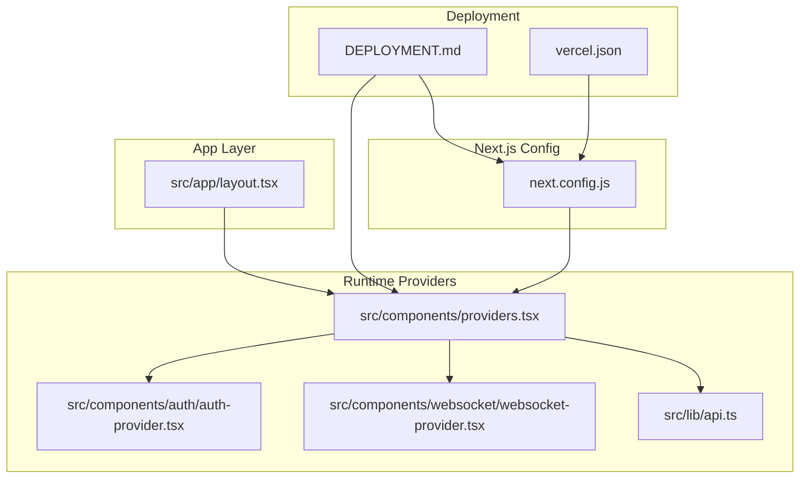
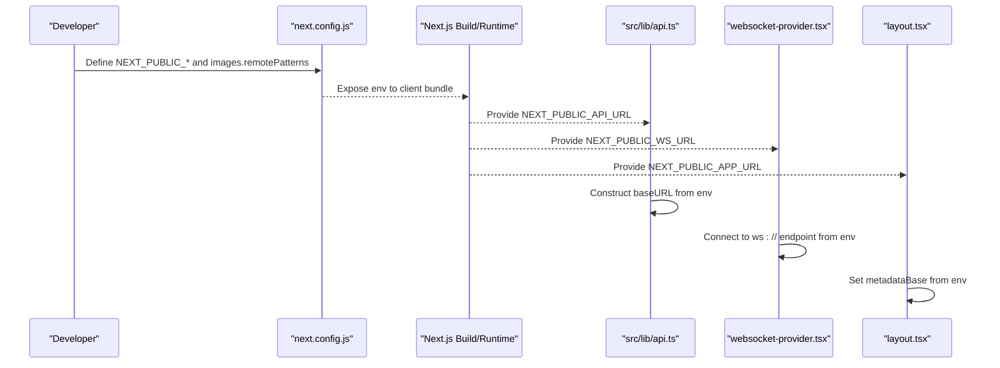
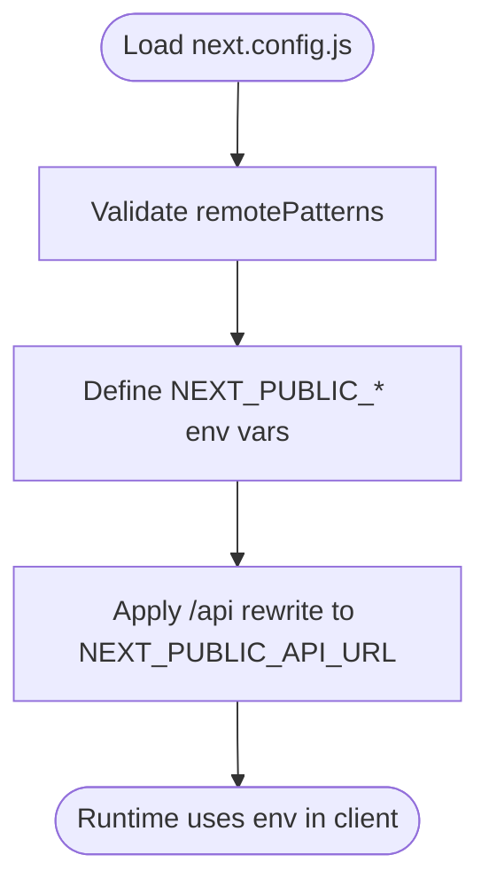
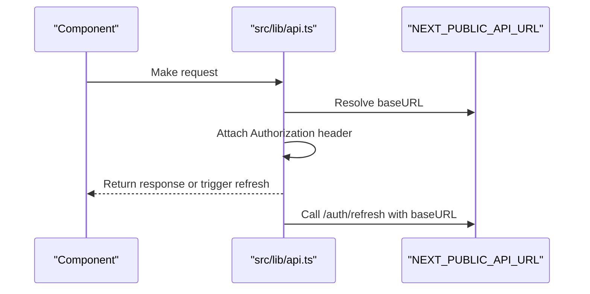
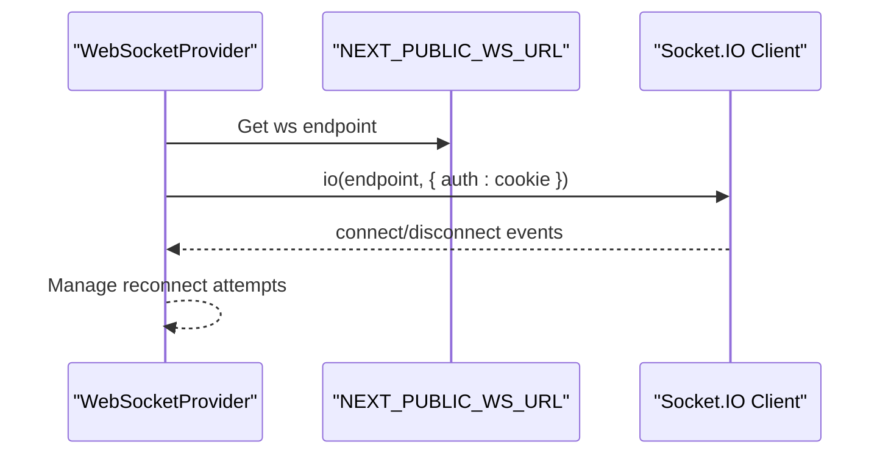
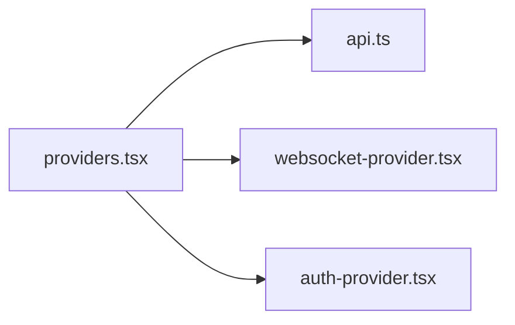
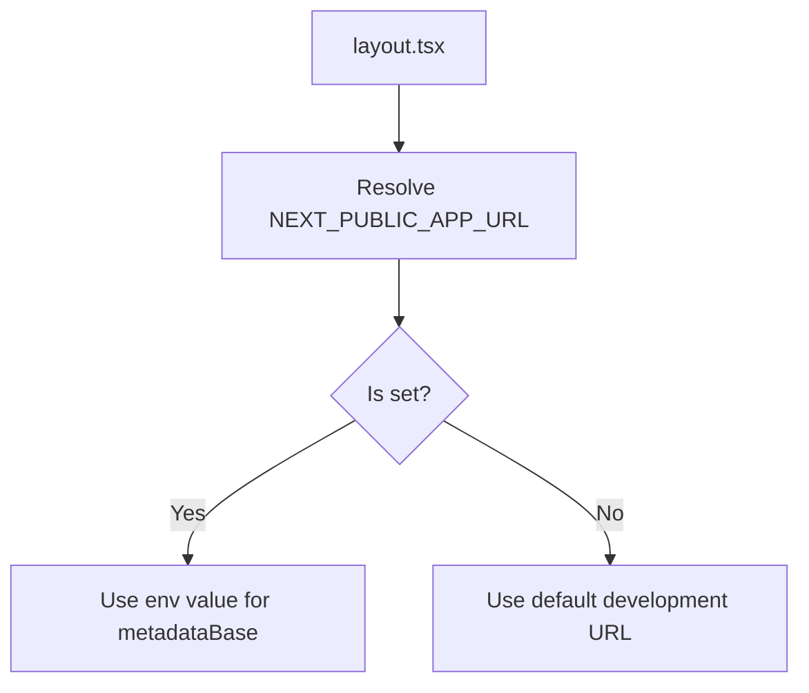
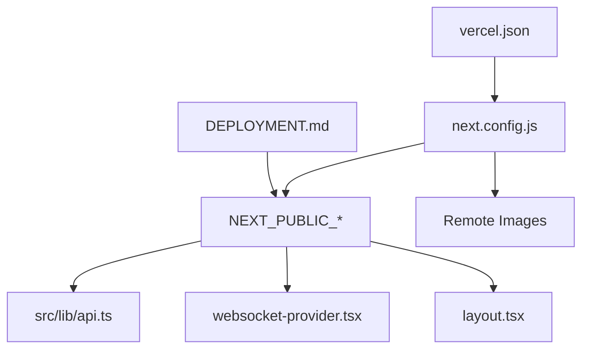
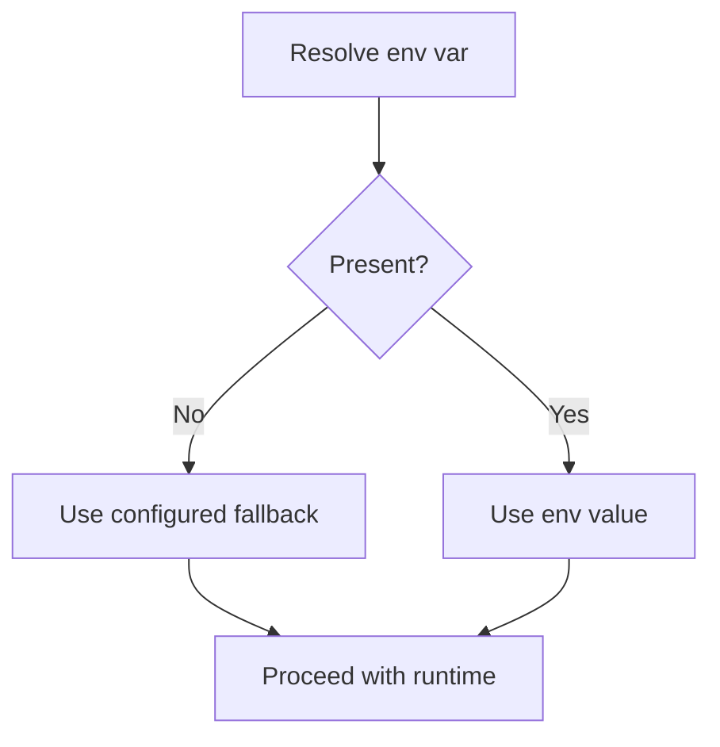

# Environment Variables

<cite>
**Referenced Files in This Document**
- [next.config.js](file://next.config.js)
- [next-env.d.ts](file://next-env.d.ts)
- [package.json](file://package.json)
- [src/lib/api.ts](file://src/lib/api.ts)
- [src/components/websocket/websocket-provider.tsx](file://src/components/websocket/websocket-provider.tsx)
- [src/components/providers.tsx](file://src/components/providers.tsx)
- [src/components/auth/auth-provider.tsx](file://src/components/auth/auth-provider.tsx)
- [src/app/layout.tsx](file://src/app/layout.tsx)
- [DEPLOYMENT.md](file://DEPLOYMENT.md)
- [vercel.json](file://vercel.json)
- [packages/shared-types/src/enums.ts](file://packages/shared-types/src/enums.ts)
</cite>

## Table of Contents
1. [Introduction](#introduction)
2. [Project Structure](#project-structure)
3. [Core Components](#core-components)
4. [Architecture Overview](#architecture-overview)
5. [Detailed Component Analysis](#detailed-component-analysis)
6. [Dependency Analysis](#dependency-analysis)
7. [Performance Considerations](#performance-considerations)
8. [Troubleshooting Guide](#troubleshooting-guide)
9. [Conclusion](#conclusion)
10. [Appendices](#appendices)

## Introduction
This document explains environment variable management for the Next.js application, focusing on how runtime variables are configured and consumed. It covers:
- The distinction between client-side and server-side environment variables
- API URL and WebSocket URL configuration
- Remote image patterns
- Environment-specific configuration for development, staging, and production
- Practical setup examples for local and deployment environments
- Security best practices, validation, fallbacks, and debugging techniques

## Project Structure
The environment variable system spans configuration files, runtime providers, and client-side consumers. The most relevant areas are:
- Next.js configuration for images, rewrites, and public variables
- Client-side providers that read environment variables
- Deployment documentation for environment variable management

**Diagram sources**
- [next.config.js](file://next.config.js#L1-L56)
- [src/components/providers.tsx](file://src/components/providers.tsx#L1-L55)
- [src/lib/api.ts](file://src/lib/api.ts#L1-L67)
- [src/components/websocket/websocket-provider.tsx](file://src/components/websocket/websocket-provider.tsx#L1-L138)
- [src/components/auth/auth-provider.tsx](file://src/components/auth/auth-provider.tsx#L1-L165)
- [src/app/layout.tsx](file://src/app/layout.tsx#L1-L102)
- [DEPLOYMENT.md](file://DEPLOYMENT.md#L1-L147)
- [vercel.json](file://vercel.json#L1-L4)

**Section sources**
- [next.config.js](file://next.config.js#L1-L56)
- [src/components/providers.tsx](file://src/components/providers.tsx#L1-L55)
- [src/lib/api.ts](file://src/lib/api.ts#L1-L67)
- [src/components/websocket/websocket-provider.tsx](file://src/components/websocket/websocket-provider.tsx#L1-L138)
- [src/components/auth/auth-provider.tsx](file://src/components/auth/auth-provider.tsx#L1-L165)
- [src/app/layout.tsx](file://src/app/layout.tsx#L1-L102)
- [DEPLOYMENT.md](file://DEPLOYMENT.md#L1-L147)
- [vercel.json](file://vercel.json#L1-L4)

## Core Components
- Next.js configuration defines:
  - Remote image patterns for approved hosts
  - Public variables exposed to the client via NEXT_PUBLIC_*
  - Rewrites that proxy /api/* to the configured backend
- Client-side providers consume these variables for:
  - API base URL
  - WebSocket URL
  - Metadata base URL

Key environment variables in use:
- NEXT_PUBLIC_API_URL: Backend API base URL for client-side requests
- NEXT_PUBLIC_WS_URL: WebSocket endpoint for real-time features
- NEXT_PUBLIC_APP_URL: Metadata base URL for Open Graph and canonical links

Fallback defaults are defined in configuration and code to support local development.

**Section sources**
- [next.config.js](file://next.config.js#L7-L27)
- [src/lib/api.ts](file://src/lib/api.ts#L3-L8)
- [src/components/websocket/websocket-provider.tsx](file://src/components/websocket/websocket-provider.tsx#L36-L47)
- [src/app/layout.tsx](file://src/app/layout.tsx#L40-L40)

## Architecture Overview
The environment variable pipeline connects configuration to runtime behavior across the client and server:

**Diagram sources**
- [next.config.js](file://next.config.js#L7-L27)
- [src/lib/api.ts](file://src/lib/api.ts#L3-L8)
- [src/components/websocket/websocket-provider.tsx](file://src/components/websocket/websocket-provider.tsx#L36-L47)
- [src/app/layout.tsx](file://src/app/layout.tsx#L40-L40)

## Detailed Component Analysis

### Next.js Configuration and Remote Images
- Remote image patterns:
  - Approved hosts for Next.js Image Optimization
  - Includes GitHub avatars, Unsplash, and localhost with a specific port for local object storage
- Public variables:
  - NEXT_PUBLIC_API_URL and NEXT_PUBLIC_WS_URL are defined with fallbacks
- Rewrites:
  - Proxies /api/* to the configured backend URL

**Diagram sources**
- [next.config.js](file://next.config.js#L7-L27)
- [next.config.js](file://next.config.js#L43-L51)

**Section sources**
- [next.config.js](file://next.config.js#L7-L27)
- [next.config.js](file://next.config.js#L43-L51)

### API Client Configuration
- The API client constructs its base URL from the environment variable with a fallback
- Uses interceptors to attach tokens and refresh on 401 responses
- Re-uses the same environment variable for token refresh endpoints

**Diagram sources**
- [src/lib/api.ts](file://src/lib/api.ts#L3-L8)
- [src/lib/api.ts](file://src/lib/api.ts#L39-L42)

**Section sources**
- [src/lib/api.ts](file://src/lib/api.ts#L3-L8)
- [src/lib/api.ts](file://src/lib/api.ts#L39-L42)

### WebSocket Provider
- Reads NEXT_PUBLIC_WS_URL to connect to the WebSocket server
- Authenticates via cookies and manages reconnection attempts
- Provides a context for emitting and listening to events

**Diagram sources**
- [src/components/websocket/websocket-provider.tsx](file://src/components/websocket/websocket-provider.tsx#L36-L47)
- [src/components/websocket/websocket-provider.tsx](file://src/components/websocket/websocket-provider.tsx#L49-L86)

**Section sources**
- [src/components/websocket/websocket-provider.tsx](file://src/components/websocket/websocket-provider.tsx#L36-L47)
- [src/components/websocket/websocket-provider.tsx](file://src/components/websocket/websocket-provider.tsx#L49-L86)

### Providers Composition
- The root Providers composes QueryClient, theme, auth, and WebSocket providers
- Ensures environment variables are available to all downstream consumers

**Diagram sources**
- [src/components/providers.tsx](file://src/components/providers.tsx#L10-L54)

**Section sources**
- [src/components/providers.tsx](file://src/components/providers.tsx#L10-L54)

### Metadata Base URL
- The application’s metadata base URL is derived from NEXT_PUBLIC_APP_URL
- Falls back to a development default when not set

**Diagram sources**
- [src/app/layout.tsx](file://src/app/layout.tsx#L40-L40)

**Section sources**
- [src/app/layout.tsx](file://src/app/layout.tsx#L40-L40)

## Dependency Analysis
- Configuration-to-runtime dependencies:
  - next.config.js exposes NEXT_PUBLIC_* to the client
  - Providers depend on these variables for API and WebSocket connections
  - API client depends on NEXT_PUBLIC_API_URL for base URL and token refresh
  - WebSocket provider depends on NEXT_PUBLIC_WS_URL for connection
  - Metadata depends on NEXT_PUBLIC_APP_URL for canonical and OG URLs
- External integrations:
  - Remote image optimization relies on configured remotePatterns
  - Deployment targets (e.g., Vercel) require environment variables to be set at build/runtime

**Diagram sources**
- [next.config.js](file://next.config.js#L7-L27)
- [src/lib/api.ts](file://src/lib/api.ts#L3-L8)
- [src/components/websocket/websocket-provider.tsx](file://src/components/websocket/websocket-provider.tsx#L36-L47)
- [src/app/layout.tsx](file://src/app/layout.tsx#L40-L40)
- [DEPLOYMENT.md](file://DEPLOYMENT.md#L1-L147)
- [vercel.json](file://vercel.json#L1-L4)

**Section sources**
- [next.config.js](file://next.config.js#L7-L27)
- [src/lib/api.ts](file://src/lib/api.ts#L3-L8)
- [src/components/websocket/websocket-provider.tsx](file://src/components/websocket/websocket-provider.tsx#L36-L47)
- [src/app/layout.tsx](file://src/app/layout.tsx#L40-L40)
- [DEPLOYMENT.md](file://DEPLOYMENT.md#L1-L147)
- [vercel.json](file://vercel.json#L1-L4)

## Performance Considerations
- Keep environment variables minimal and scoped to what is needed at runtime
- Prefer client-side variables under NEXT_PUBLIC_* to avoid server bundle bloat
- Centralize variable usage in configuration and providers to reduce duplication
- Use rewrites and remotePatterns to optimize network and image delivery

[No sources needed since this section provides general guidance]

## Troubleshooting Guide
Common issues and resolutions:
- API requests fail or redirect unexpectedly
  - Verify NEXT_PUBLIC_API_URL is set and reachable
  - Confirm rewrites are applied for /api/*
- WebSocket connection errors
  - Ensure NEXT_PUBLIC_WS_URL matches the deployed endpoint
  - Check authentication cookie presence and expiration
- Metadata or canonical URLs incorrect
  - Set NEXT_PUBLIC_APP_URL to the production origin
- Remote images blocked by Image Optimization
  - Add the host to remotePatterns in next.config.js
- Environment variables not applied in builds
  - On Vercel, set variables in project settings
  - Ensure variables are present at build time for static generation

**Section sources**
- [next.config.js](file://next.config.js#L7-L27)
- [next.config.js](file://next.config.js#L43-L51)
- [src/lib/api.ts](file://src/lib/api.ts#L3-L8)
- [src/components/websocket/websocket-provider.tsx](file://src/components/websocket/websocket-provider.tsx#L36-L47)
- [src/app/layout.tsx](file://src/app/layout.tsx#L40-L40)
- [DEPLOYMENT.md](file://DEPLOYMENT.md#L12-L56)

## Conclusion
The environment variable system in this Next.js application is intentionally minimal and explicit:
- NEXT_PUBLIC_* variables are used for client-accessible configuration
- next.config.js centralizes public variables and image policies
- Providers and clients consume these variables with sensible fallbacks
- Deployment documentation outlines how to configure variables in Vercel

Adhering to these patterns ensures predictable behavior across development, staging, and production environments while maintaining security and performance.

[No sources needed since this section summarizes without analyzing specific files]

## Appendices

### Environment Variable Reference
- NEXT_PUBLIC_API_URL
  - Purpose: Backend API base URL for client-side requests
  - Fallback: Defined in configuration and code
  - Consumers: API client, rewrites
- NEXT_PUBLIC_WS_URL
  - Purpose: WebSocket endpoint for real-time features
  - Fallback: Defined in configuration and code
  - Consumers: WebSocket provider
- NEXT_PUBLIC_APP_URL
  - Purpose: Metadata base URL for canonical and Open Graph
  - Fallback: Development default
  - Consumer: Metadata configuration

**Section sources**
- [next.config.js](file://next.config.js#L24-L27)
- [src/lib/api.ts](file://src/lib/api.ts#L3-L8)
- [src/components/websocket/websocket-provider.tsx](file://src/components/websocket/websocket-provider.tsx#L36-L47)
- [src/app/layout.tsx](file://src/app/layout.tsx#L40-L40)

### Environment-Specific Guidance
- Development
  - Use local backend and WebSocket endpoints
  - Leverage fallbacks defined in configuration and code
- Staging
  - Point NEXT_PUBLIC_API_URL and NEXT_PUBLIC_WS_URL to staging endpoints
  - Ensure remotePatterns include staging domains
- Production
  - Set NEXT_PUBLIC_APP_URL to the production origin
  - Configure environment variables in Vercel project settings

**Section sources**
- [next.config.js](file://next.config.js#L7-L27)
- [DEPLOYMENT.md](file://DEPLOYMENT.md#L12-L56)

### Security Best Practices
- Do not place secrets under NEXT_PUBLIC_*
- Store secrets in server-side configuration or platform secret stores
- Restrict remote image hosts to trusted domains
- Validate and sanitize environment variables at startup if feasible
- Use HTTPS for API and WebSocket endpoints in production

**Section sources**
- [DEPLOYMENT.md](file://DEPLOYMENT.md#L59-L66)

### Validation and Fallback Mechanisms
- Configuration-level fallbacks for NEXT_PUBLIC_API_URL and NEXT_PUBLIC_WS_URL
- Code-level fallbacks for API base URL and WebSocket endpoint
- Metadata base URL fallback to a development default

**Diagram sources**
- [next.config.js](file://next.config.js#L24-L27)
- [src/lib/api.ts](file://src/lib/api.ts#L3-L8)
- [src/components/websocket/websocket-provider.tsx](file://src/components/websocket/websocket-provider.tsx#L36-L47)
- [src/app/layout.tsx](file://src/app/layout.tsx#L40-L40)

### Practical Setup Examples
- Local development
  - Set NEXT_PUBLIC_API_URL and NEXT_PUBLIC_WS_URL to local backend endpoints
  - Ensure remotePatterns include localhost and any local object storage host
- Vercel deployment
  - Add environment variables in Vercel project settings
  - Confirm framework is set to Next.js

**Section sources**
- [DEPLOYMENT.md](file://DEPLOYMENT.md#L12-L56)
- [vercel.json](file://vercel.json#L1-L4)