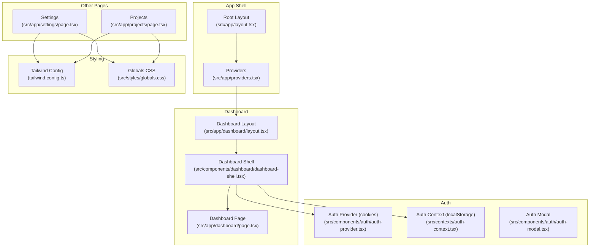
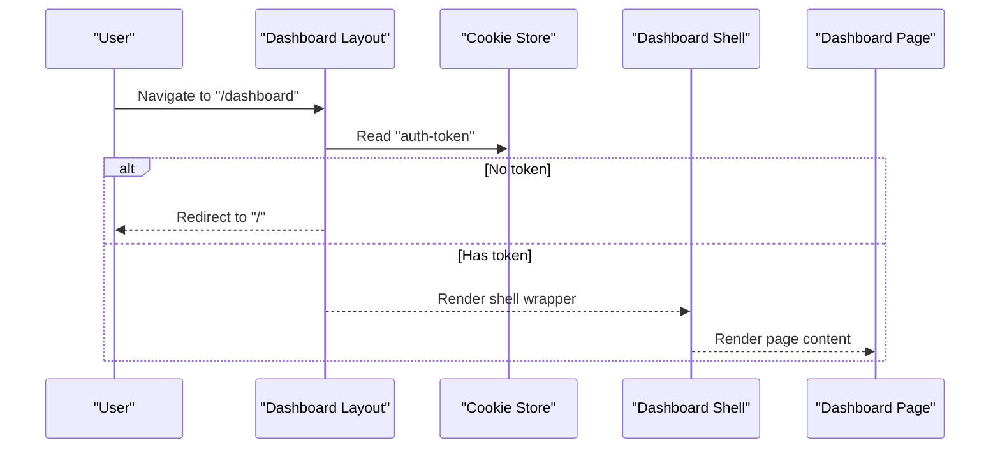
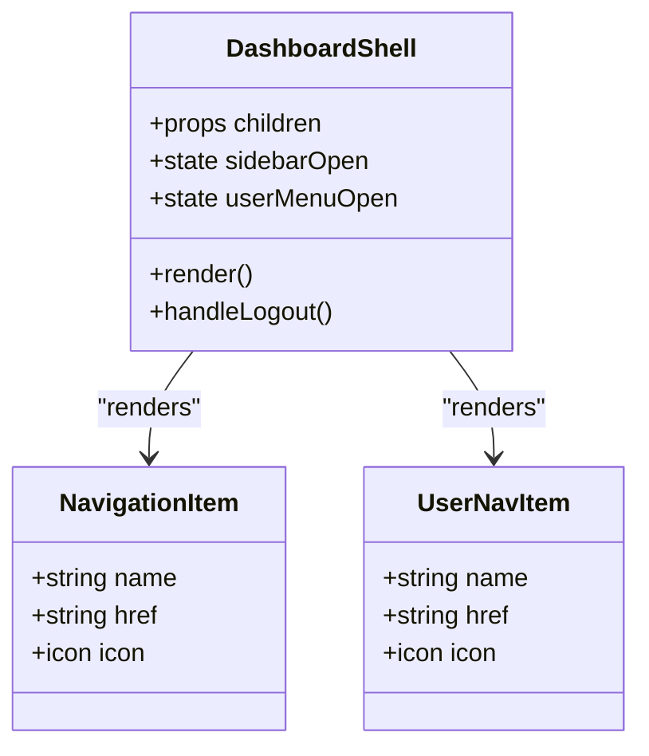
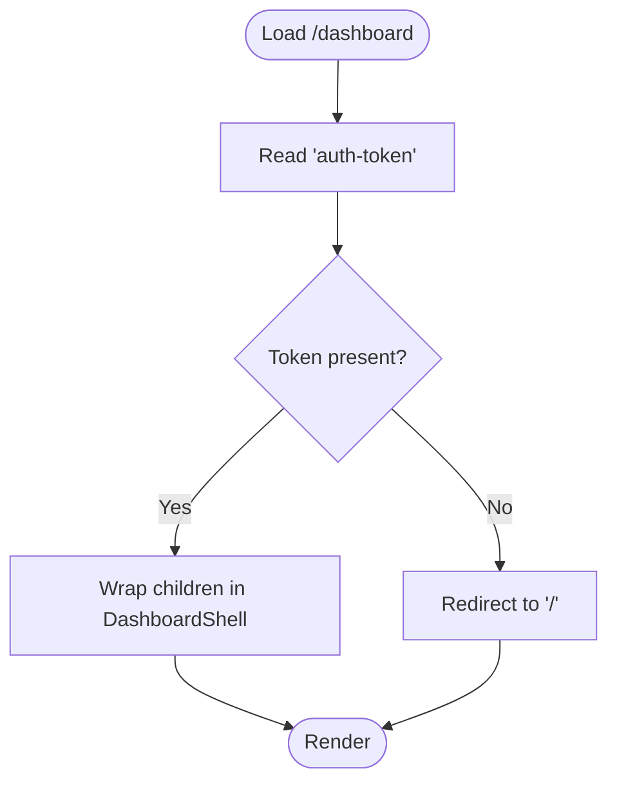
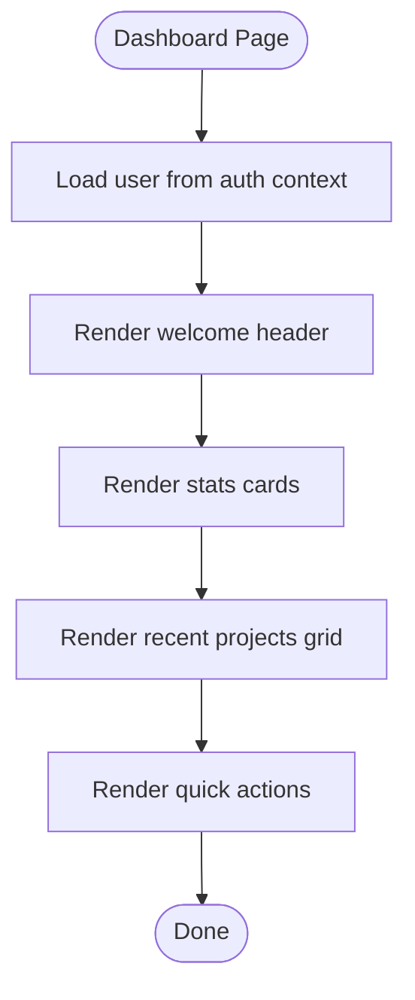
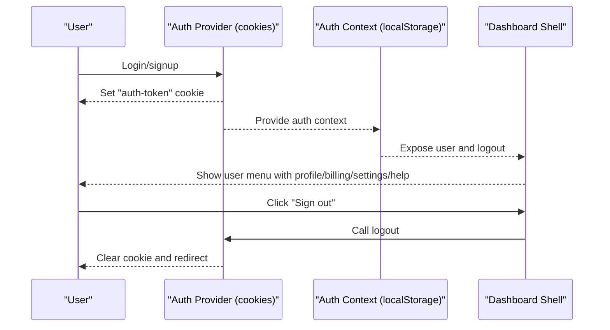
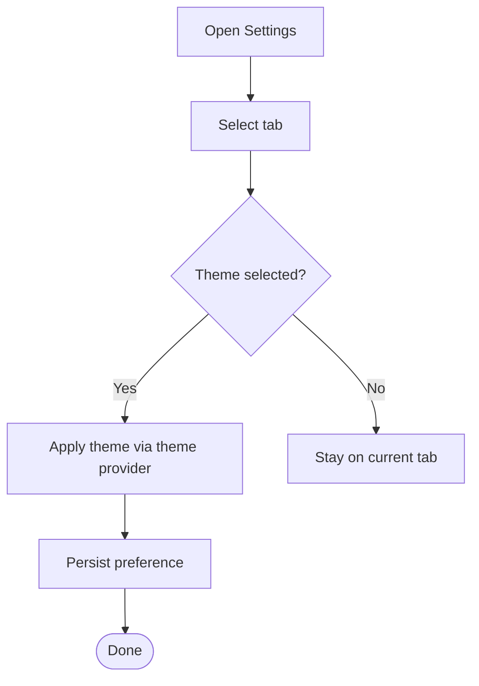
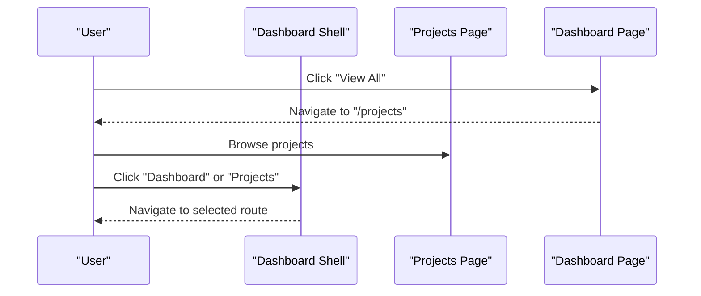
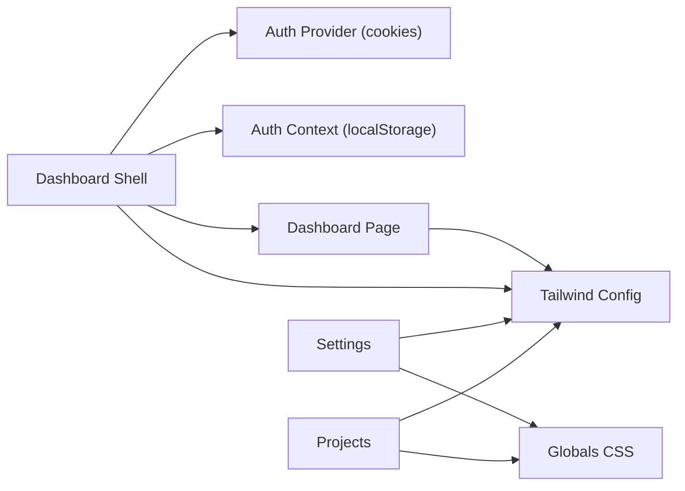

# Dashboard & Navigation

<cite>
**Referenced Files in This Document**
- [src/app/dashboard/layout.tsx](file://src/app/dashboard/layout.tsx)
- [src/app/dashboard/page.tsx](file://src/app/dashboard/page.tsx)
- [src/components/dashboard/dashboard-shell.tsx](file://src/components/dashboard/dashboard-shell.tsx)
- [src/app/layout.tsx](file://src/app/layout.tsx)
- [src/app/providers.tsx](file://src/app/providers.tsx)
- [src/contexts/auth-context.tsx](file://src/contexts/auth-context.tsx)
- [src/components/auth/auth-provider.tsx](file://src/components/auth/auth-provider.tsx)
- [src/components/auth/auth-modal.tsx](file://src/components/auth/auth-modal.tsx)
- [src/app/settings/page.tsx](file://src/app/settings/page.tsx)
- [src/app/projects/page.tsx](file://src/app/projects/page.tsx)
- [tailwind.config.ts](file://tailwind.config.ts)
- [src/styles/globals.css](file://src/styles/globals.css)
</cite>

## Table of Contents
1. [Introduction](#introduction)
2. [Project Structure](#project-structure)
3. [Core Components](#core-components)
4. [Architecture Overview](#architecture-overview)
5. [Detailed Component Analysis](#detailed-component-analysis)
6. [Dependency Analysis](#dependency-analysis)
7. [Performance Considerations](#performance-considerations)
8. [Troubleshooting Guide](#troubleshooting-guide)
9. [Conclusion](#conclusion)
10. [Appendices](#appendices)

## Introduction
This document explains the dashboard and navigation system that serves as the main application hub. It covers the dashboard layout architecture, navigation components, user interface patterns, user menu, settings integration, responsive design, mobile optimization, accessibility features, and theme integration. Practical examples demonstrate customization, navigation workflows, and UI patterns. Guidance is included for performance optimization, user experience design, and cross-platform compatibility.

## Project Structure
The dashboard and navigation system spans several Next.js app directory pages and shared components:
- Dashboard shell and layout orchestrate the global navigation and top bar.
- Dashboard page renders statistics, recent projects, and quick actions.
- Authentication providers manage user sessions and integrate with the dashboard shell’s user menu.
- Settings page integrates with the theme system and user preferences.
- Tailwind and global CSS define responsive breakpoints, theme tokens, and accessibility helpers.

**Diagram sources**
- [src/app/layout.tsx](file://src/app/layout.tsx#L83-L102)
- [src/app/providers.tsx](file://src/app/providers.tsx#L9-L37)
- [src/app/dashboard/layout.tsx](file://src/app/dashboard/layout.tsx#L5-L23)
- [src/components/dashboard/dashboard-shell.tsx](file://src/components/dashboard/dashboard-shell.tsx#L49-L224)
- [src/app/dashboard/page.tsx](file://src/app/dashboard/page.tsx#L53-L260)
- [src/components/auth/auth-provider.tsx](file://src/components/auth/auth-provider.tsx#L20-L165)
- [src/contexts/auth-context.tsx](file://src/contexts/auth-context.tsx#L30-L154)
- [src/app/settings/page.tsx](file://src/app/settings/page.tsx#L106-L846)
- [src/app/projects/page.tsx](file://src/app/projects/page.tsx#L48-L394)
- [tailwind.config.ts](file://tailwind.config.ts#L1-L133)
- [src/styles/globals.css](file://src/styles/globals.css#L1-L288)

**Section sources**
- [src/app/layout.tsx](file://src/app/layout.tsx#L83-L102)
- [src/app/providers.tsx](file://src/app/providers.tsx#L9-L37)
- [src/app/dashboard/layout.tsx](file://src/app/dashboard/layout.tsx#L5-L23)
- [src/components/dashboard/dashboard-shell.tsx](file://src/components/dashboard/dashboard-shell.tsx#L49-L224)
- [src/app/dashboard/page.tsx](file://src/app/dashboard/page.tsx#L53-L260)
- [src/components/auth/auth-provider.tsx](file://src/components/auth/auth-provider.tsx#L20-L165)
- [src/contexts/auth-context.tsx](file://src/contexts/auth-context.tsx#L30-L154)
- [src/app/settings/page.tsx](file://src/app/settings/page.tsx#L106-L846)
- [src/app/projects/page.tsx](file://src/app/projects/page.tsx#L48-L394)
- [tailwind.config.ts](file://tailwind.config.ts#L1-L133)
- [src/styles/globals.css](file://src/styles/globals.css#L1-L288)

## Core Components
- Dashboard Shell: Provides the global sidebar, top bar, user menu, and main content area. Handles mobile sidebar toggling, active navigation highlighting, and user actions.
- Dashboard Layout: Enforces authentication via cookies and wraps content with the dashboard shell.
- Dashboard Page: Renders welcome header, stats cards, recent projects grid, and quick action buttons.
- Auth Providers: Two complementary providers manage authentication state and persistence (cookie-based and localStorage-based).
- Settings Page: Integrates theme selection, notification preferences, and account settings.
- Tailwind and Globals: Define theme tokens, responsive breakpoints, and accessibility enhancements.

**Section sources**
- [src/components/dashboard/dashboard-shell.tsx](file://src/components/dashboard/dashboard-shell.tsx#L49-L224)
- [src/app/dashboard/layout.tsx](file://src/app/dashboard/layout.tsx#L5-L23)
- [src/app/dashboard/page.tsx](file://src/app/dashboard/page.tsx#L53-L260)
- [src/components/auth/auth-provider.tsx](file://src/components/auth/auth-provider.tsx#L20-L165)
- [src/contexts/auth-context.tsx](file://src/contexts/auth-context.tsx#L30-L154)
- [src/app/settings/page.tsx](file://src/app/settings/page.tsx#L106-L846)
- [tailwind.config.ts](file://tailwind.config.ts#L1-L133)
- [src/styles/globals.css](file://src/styles/globals.css#L1-L288)

## Architecture Overview
The dashboard architecture centers on a shell component that encapsulates navigation and user controls, with a dedicated dashboard page rendering domain content. Authentication is enforced at the dashboard route level and surfaced in the shell’s user menu. Theme integration is provided via a theme provider and Tailwind tokens.

**Diagram sources**
- [src/app/dashboard/layout.tsx](file://src/app/dashboard/layout.tsx#L10-L16)
- [src/components/dashboard/dashboard-shell.tsx](file://src/components/dashboard/dashboard-shell.tsx#L49-L224)
- [src/app/dashboard/page.tsx](file://src/app/dashboard/page.tsx#L53-L260)

**Section sources**
- [src/app/dashboard/layout.tsx](file://src/app/dashboard/layout.tsx#L5-L23)
- [src/components/dashboard/dashboard-shell.tsx](file://src/components/dashboard/dashboard-shell.tsx#L49-L224)
- [src/app/dashboard/page.tsx](file://src/app/dashboard/page.tsx#L53-L260)

## Detailed Component Analysis

### Dashboard Shell
The dashboard shell manages:
- Mobile sidebar with overlay and slide-in/out transitions.
- Persistent navigation with active-state highlighting.
- User menu with profile, billing, settings, help, and logout.
- Top bar with search, quick actions, and notifications.
- Main content area with padding and overflow handling.

**Diagram sources**
- [src/components/dashboard/dashboard-shell.tsx](file://src/components/dashboard/dashboard-shell.tsx#L32-L47)
- [src/components/dashboard/dashboard-shell.tsx](file://src/components/dashboard/dashboard-shell.tsx#L49-L224)

**Section sources**
- [src/components/dashboard/dashboard-shell.tsx](file://src/components/dashboard/dashboard-shell.tsx#L49-L224)

### Dashboard Layout
The dashboard layout enforces authentication by checking for a session cookie and redirecting unauthenticated users. It then renders the dashboard shell around the page content.

**Diagram sources**
- [src/app/dashboard/layout.tsx](file://src/app/dashboard/layout.tsx#L10-L16)
- [src/app/dashboard/layout.tsx](file://src/app/dashboard/layout.tsx#L18-L22)

**Section sources**
- [src/app/dashboard/layout.tsx](file://src/app/dashboard/layout.tsx#L5-L23)

### Dashboard Page
The dashboard page displays:
- Welcome header with user greeting.
- Stats cards for totals, weekly words, and AI generations.
- Recent projects grid with progress bars, status badges, and action buttons.
- Quick actions for new project, characters, AI assistant, and analytics.

**Diagram sources**
- [src/app/dashboard/page.tsx](file://src/app/dashboard/page.tsx#L53-L87)
- [src/app/dashboard/page.tsx](file://src/app/dashboard/page.tsx#L89-L142)
- [src/app/dashboard/page.tsx](file://src/app/dashboard/page.tsx#L144-L223)
- [src/app/dashboard/page.tsx](file://src/app/dashboard/page.tsx#L225-L257)

**Section sources**
- [src/app/dashboard/page.tsx](file://src/app/dashboard/page.tsx#L53-L260)

### Authentication Integration
Two complementary providers manage authentication:
- Cookie-based provider sets and refreshes a session cookie and handles logout by clearing the cookie.
- LocalStorage-based provider initializes from local storage and exposes login/signup/logout/refreshtoken.

**Diagram sources**
- [src/components/auth/auth-provider.tsx](file://src/components/auth/auth-provider.tsx#L67-L131)
- [src/contexts/auth-context.tsx](file://src/contexts/auth-context.tsx#L57-L106)
- [src/components/dashboard/dashboard-shell.tsx](file://src/components/dashboard/dashboard-shell.tsx#L157-L167)

**Section sources**
- [src/components/auth/auth-provider.tsx](file://src/components/auth/auth-provider.tsx#L20-L165)
- [src/contexts/auth-context.tsx](file://src/contexts/auth-context.tsx#L30-L154)
- [src/components/dashboard/dashboard-shell.tsx](file://src/components/dashboard/dashboard-shell.tsx#L157-L167)

### Settings Integration
The settings page integrates with the theme system and user preferences:
- Tabs for profile, account, billing, notifications, preferences, and security.
- Theme selector supports light, dark, and system.
- Notification toggles and security controls.

**Diagram sources**
- [src/app/settings/page.tsx](file://src/app/settings/page.tsx#L106-L177)
- [src/app/settings/page.tsx](file://src/app/settings/page.tsx#L634-L654)

**Section sources**
- [src/app/settings/page.tsx](file://src/app/settings/page.tsx#L106-L846)

### Navigation Workflows
Common navigation workflows:
- From dashboard to projects: click “View All” or “Open” on a project card.
- From dashboard quick actions: navigate to new project, characters, AI studio, or analytics.
- From sidebar: select a top-level navigation item to change context.
- From user menu: access profile, billing, settings, help, or sign out.

**Diagram sources**
- [src/app/dashboard/page.tsx](file://src/app/dashboard/page.tsx#L148-L150)
- [src/app/dashboard/page.tsx](file://src/app/dashboard/page.tsx#L191-L201)
- [src/components/dashboard/dashboard-shell.tsx](file://src/components/dashboard/dashboard-shell.tsx#L96-L118)

**Section sources**
- [src/app/dashboard/page.tsx](file://src/app/dashboard/page.tsx#L144-L203)
- [src/app/projects/page.tsx](file://src/app/projects/page.tsx#L266-L282)
- [src/components/dashboard/dashboard-shell.tsx](file://src/components/dashboard/dashboard-shell.tsx#L96-L118)

## Dependency Analysis
The dashboard depends on:
- Providers for theme and auth.
- Tailwind for responsive design and theme tokens.
- Global CSS for base styles, prose, and accessibility helpers.

**Diagram sources**
- [src/components/dashboard/dashboard-shell.tsx](file://src/components/dashboard/dashboard-shell.tsx#L49-L224)
- [src/app/dashboard/page.tsx](file://src/app/dashboard/page.tsx#L53-L260)
- [src/components/auth/auth-provider.tsx](file://src/components/auth/auth-provider.tsx#L20-L165)
- [src/contexts/auth-context.tsx](file://src/contexts/auth-context.tsx#L30-L154)
- [src/app/settings/page.tsx](file://src/app/settings/page.tsx#L106-L846)
- [src/app/projects/page.tsx](file://src/app/projects/page.tsx#L48-L394)
- [tailwind.config.ts](file://tailwind.config.ts#L1-L133)
- [src/styles/globals.css](file://src/styles/globals.css#L1-L288)

**Section sources**
- [src/components/dashboard/dashboard-shell.tsx](file://src/components/dashboard/dashboard-shell.tsx#L49-L224)
- [src/app/dashboard/page.tsx](file://src/app/dashboard/page.tsx#L53-L260)
- [src/components/auth/auth-provider.tsx](file://src/components/auth/auth-provider.tsx#L20-L165)
- [src/contexts/auth-context.tsx](file://src/contexts/auth-context.tsx#L30-L154)
- [src/app/settings/page.tsx](file://src/app/settings/page.tsx#L106-L846)
- [src/app/projects/page.tsx](file://src/app/projects/page.tsx#L48-L394)
- [tailwind.config.ts](file://tailwind.config.ts#L1-L133)
- [src/styles/globals.css](file://src/styles/globals.css#L1-L288)

## Performance Considerations
- Client-side routing: Next.js app router minimizes server requests for navigation.
- Hydration: Root layout suppresses hydration warnings for smoother initial load.
- Theme switching: next-themes avoids layout shifts by applying class-based themes.
- Lists and grids: Dashboard and projects pages use responsive grid layouts optimized for performance.
- Lazy loading: Consider lazy-loading heavy components or images within project cards.
- Caching: React Query provider configured with a stale time to balance freshness and performance.

[No sources needed since this section provides general guidance]

## Troubleshooting Guide
- Authentication redirects: If redirected to the home page from the dashboard, verify the session cookie exists and is valid.
- User menu not appearing: Ensure the auth provider initializes and sets the user context.
- Theme not applying: Confirm the theme provider is mounted and the theme setting is persisted.
- Accessibility issues: Use high contrast and reduced motion modes; Tailwind and globals include media queries to support these preferences.

**Section sources**
- [src/app/dashboard/layout.tsx](file://src/app/dashboard/layout.tsx#L10-L16)
- [src/components/auth/auth-provider.tsx](file://src/components/auth/auth-provider.tsx#L27-L49)
- [src/app/providers.tsx](file://src/app/providers.tsx#L22-L34)
- [src/styles/globals.css](file://src/styles/globals.css#L261-L288)

## Conclusion
The dashboard and navigation system provides a cohesive, accessible, and responsive application hub. The dashboard shell encapsulates navigation and user controls, while the dashboard page presents actionable insights and quick workflows. Authentication is enforced at the route level and integrated into the shell’s user menu. Theme integration and Tailwind tokens ensure consistent styling across platforms. With thoughtful performance and accessibility considerations, the system scales to diverse user needs.

[No sources needed since this section summarizes without analyzing specific files]

## Appendices

### Responsive Design and Mobile Optimization
- Mobile sidebar: Slide-in/out with overlay; hidden on larger screens.
- Grid layouts: Responsive grids adapt to tablet and desktop widths.
- Typography: Headings and prose are optimized for readability across devices.
- Touch targets: Buttons and interactive elements sized for mobile touch.

**Section sources**
- [src/components/dashboard/dashboard-shell.tsx](file://src/components/dashboard/dashboard-shell.tsx#L63-L77)
- [src/app/dashboard/page.tsx](file://src/app/dashboard/page.tsx#L153-L222)
- [src/styles/globals.css](file://src/styles/globals.css#L254-L259)

### Accessibility Features
- High contrast mode support via media queries.
- Reduced motion support to minimize animations.
- Semantic HTML and proper labeling for form controls.
- Focus management in modals and dropdowns.

**Section sources**
- [src/styles/globals.css](file://src/styles/globals.css#L261-L288)
- [src/components/auth/auth-modal.tsx](file://src/components/auth/auth-modal.tsx#L74-L212)

### Theme Integration
- Theme provider applies class-based themes.
- Tailwind config defines theme tokens and keyframes.
- Global CSS establishes CSS variables for light/dark modes.

**Section sources**
- [src/app/providers.tsx](file://src/app/providers.tsx#L22-L34)
- [tailwind.config.ts](file://tailwind.config.ts#L18-L129)
- [src/styles/globals.css](file://src/styles/globals.css#L5-L58)