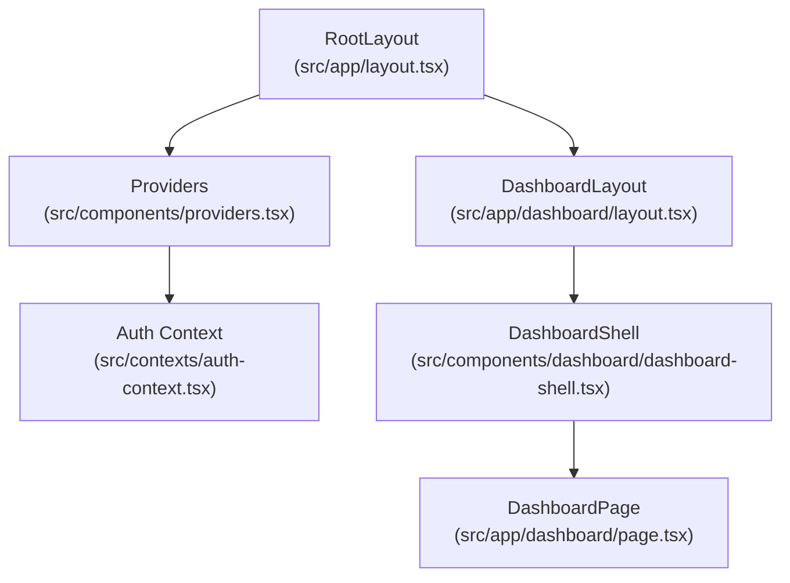
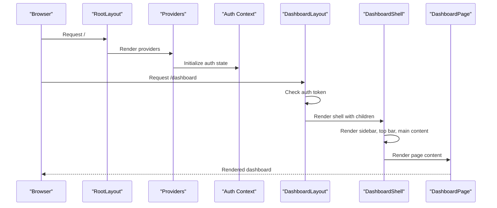
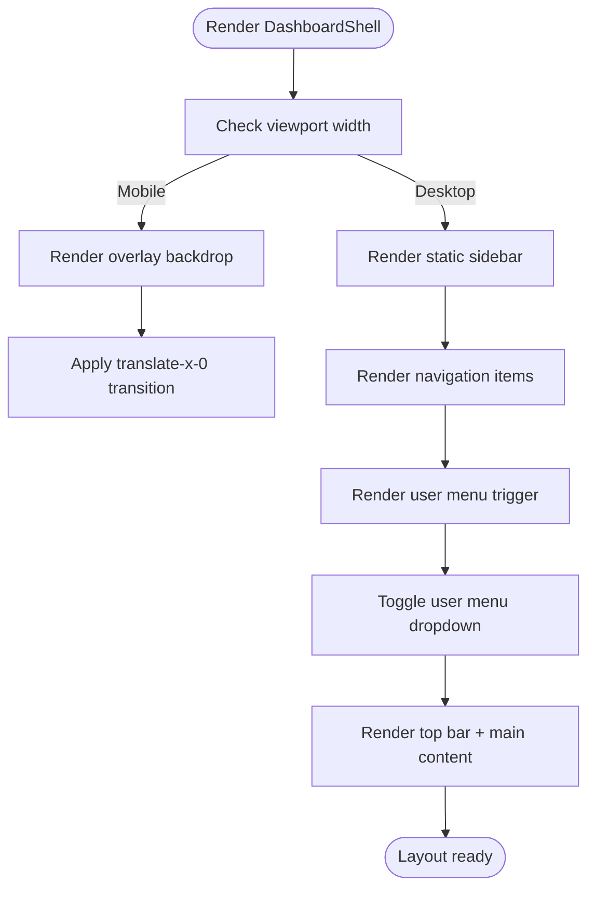
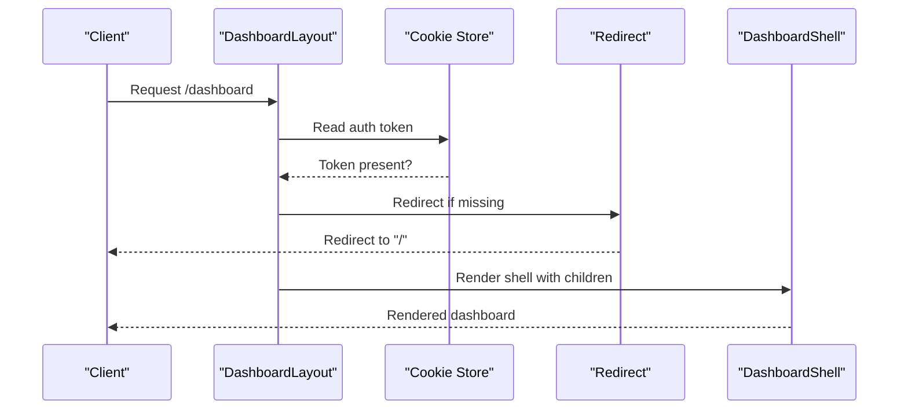
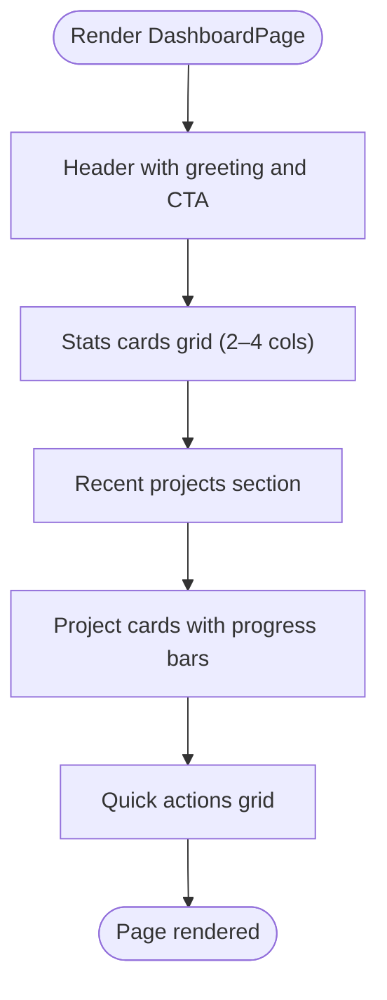
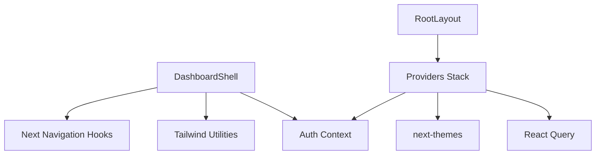

# Dashboard Layout

<cite>
**Referenced Files in This Document**
- [dashboard-shell.tsx](file://src/components/dashboard/dashboard-shell.tsx)
- [layout.tsx](file://src/app/dashboard/layout.tsx)
- [page.tsx](file://src/app/dashboard/page.tsx)
- [layout.tsx](file://src/app/layout.tsx)
- [providers.tsx](file://src/components/providers.tsx)
- [auth-context.tsx](file://src/contexts/auth-context.tsx)
- [globals.css](file://src/app/globals.css)
- [globals.css](file://src/styles/globals.css)
- [tailwind.config.ts](file://tailwind.config.ts)
</cite>

## Table of Contents
1. [Introduction](#introduction)
2. [Project Structure](#project-structure)
3. [Core Components](#core-components)
4. [Architecture Overview](#architecture-overview)
5. [Detailed Component Analysis](#detailed-component-analysis)
6. [Dependency Analysis](#dependency-analysis)
7. [Performance Considerations](#performance-considerations)
8. [Troubleshooting Guide](#troubleshooting-guide)
9. [Conclusion](#conclusion)
10. [Appendices](#appendices)

## Introduction
This document explains the dashboard layout system for the main application shell, focusing on the DashboardShell component, responsive design architecture, and layout composition patterns. It covers the sidebar navigation system, mobile overlay behavior, content area management, spacing systems, visual hierarchy, state management, animations, performance optimization, cross-device compatibility, accessibility, and mobile-first design principles. Practical examples demonstrate customization, breakpoint adjustments, and responsive patterns suitable for both beginners and experienced developers.

## Project Structure
The dashboard layout is implemented as a reusable shell component integrated into the Next.js app router. The shell encapsulates the global layout provider stack and renders the authenticated dashboard pages.

**Diagram sources**
- [layout.tsx](file://src/app/layout.tsx#L83-L101)
- [providers.tsx](file://src/components/providers.tsx#L10-L54)
- [auth-context.tsx](file://src/contexts/auth-context.tsx#L30-L146)
- [layout.tsx](file://src/app/dashboard/layout.tsx#L5-L22)
- [dashboard-shell.tsx](file://src/components/dashboard/dashboard-shell.tsx#L49-L224)
- [page.tsx](file://src/app/dashboard/page.tsx#L53-L260)

**Section sources**
- [layout.tsx](file://src/app/layout.tsx#L83-L101)
- [providers.tsx](file://src/components/providers.tsx#L10-L54)
- [auth-context.tsx](file://src/contexts/auth-context.tsx#L30-L146)
- [layout.tsx](file://src/app/dashboard/layout.tsx#L5-L22)
- [dashboard-shell.tsx](file://src/components/dashboard/dashboard-shell.tsx#L49-L224)
- [page.tsx](file://src/app/dashboard/page.tsx#L53-L260)

## Core Components
- DashboardShell: The main application shell that manages sidebar visibility, user menu, top bar actions, and content area. It uses Tailwind classes for responsive behavior and Lucide icons for navigation.
- DashboardLayout: An authenticated wrapper that enforces route protection and injects the shell around page content.
- DashboardPage: The dashboard homepage showcasing stats cards, recent projects, progress bars, and quick actions.

Key responsibilities:
- State management: Local state for sidebar and user menu toggles.
- Responsive behavior: Uses Tailwind’s lg breakpoint to switch between mobile and desktop layouts.
- Accessibility: Keyboard navigable links, focus-visible states, and semantic markup.
- Performance: Minimal re-renders, efficient transitions, and lazy navigation.

**Section sources**
- [dashboard-shell.tsx](file://src/components/dashboard/dashboard-shell.tsx#L49-L224)
- [layout.tsx](file://src/app/dashboard/layout.tsx#L5-L22)
- [page.tsx](file://src/app/dashboard/page.tsx#L53-L260)

## Architecture Overview
The layout architecture follows a layered approach:
- Root layout sets up providers and global styles.
- Dashboard layout enforces authentication and wraps content in the shell.
- Shell composes the sidebar, top bar, and main content area.
- Dashboard page renders dashboard-specific content.

**Diagram sources**
- [layout.tsx](file://src/app/layout.tsx#L83-L101)
- [providers.tsx](file://src/components/providers.tsx#L10-L54)
- [auth-context.tsx](file://src/contexts/auth-context.tsx#L30-L146)
- [layout.tsx](file://src/app/dashboard/layout.tsx#L5-L22)
- [dashboard-shell.tsx](file://src/components/dashboard/dashboard-shell.tsx#L49-L224)
- [page.tsx](file://src/app/dashboard/page.tsx#L53-L260)

## Detailed Component Analysis

### DashboardShell Component
DashboardShell is a composite layout component that:
- Manages mobile sidebar overlay and transforms for slide-in/out behavior.
- Renders a fixed sidebar with navigation items and a user menu dropdown.
- Provides a top bar with search, action buttons, and a mobile hamburger menu.
- Hosts the main content area with responsive padding.

Responsive behavior:
- Mobile-first design: Sidebar slides in from the left with a backdrop overlay.
- Desktop: Sidebar becomes static and positioned to the left; overlay is hidden.
- Breakpoint: lg (1024px) separates mobile and desktop layouts.

State management:
- Local state tracks sidebarOpen and userMenuOpen.
- Path-based active state highlights the current navigation item.

Accessibility:
- Semantic HTML and link roles.
- Focus management for interactive elements.
- Icons with accessible labels via screen readers.

Animation and transitions:
- Smooth translate transitions for sidebar movement.
- Hover effects on navigation items and cards.
- Consistent easing and duration for UX continuity.

**Diagram sources**
- [dashboard-shell.tsx](file://src/components/dashboard/dashboard-shell.tsx#L63-L224)

**Section sources**
- [dashboard-shell.tsx](file://src/components/dashboard/dashboard-shell.tsx#L49-L224)

### DashboardLayout Authentication Wrapper
DashboardLayout enforces authentication by checking for a token and redirecting unauthenticated users to the home page. It then renders the DashboardShell around the page content.

**Diagram sources**
- [layout.tsx](file://src/app/dashboard/layout.tsx#L5-L22)

**Section sources**
- [layout.tsx](file://src/app/dashboard/layout.tsx#L5-L22)

### DashboardPage Content Composition
DashboardPage demonstrates layout composition patterns:
- Grid-based statistics cards with icons and metrics.
- Project cards with progress bars, status badges, and action buttons.
- Quick action buttons for common tasks.
- Responsive grid layouts using Tailwind’s md and lg variants.

**Diagram sources**
- [page.tsx](file://src/app/dashboard/page.tsx#L69-L260)

**Section sources**
- [page.tsx](file://src/app/dashboard/page.tsx#L53-L260)

### Sidebar Navigation System
The sidebar navigation system includes:
- Fixed position on mobile with backdrop overlay.
- Static position on desktop with persistent presence.
- Active state highlighting based on current path.
- User menu dropdown with profile, billing, settings, help, and logout.

Behavior:
- Clicking a navigation item closes the mobile sidebar.
- Clicking the user menu toggle opens/closes the dropdown.
- Logout triggers context cleanup and redirects.

**Section sources**
- [dashboard-shell.tsx](file://src/components/dashboard/dashboard-shell.tsx#L32-L47)
- [dashboard-shell.tsx](file://src/components/dashboard/dashboard-shell.tsx#L96-L173)

### Mobile Overlay Behavior
Mobile overlay behavior:
- A semi-transparent backdrop appears when the sidebar is open on mobile.
- Clicking the overlay closes the sidebar.
- Overlay uses blur and opacity for visual separation.

Breakpoints:
- Mobile: sidebar translates in from the left; overlay visible.
- Desktop: sidebar remains static; overlay hidden.

**Section sources**
- [dashboard-shell.tsx](file://src/components/dashboard/dashboard-shell.tsx#L63-L71)
- [dashboard-shell.tsx](file://src/components/dashboard/dashboard-shell.tsx#L74-L77)

### Content Area Management
Content area management:
- Top bar: mobile hamburger, search input, and action buttons.
- Main content: scrollable area with responsive padding.
- Responsive padding: smaller on mobile, larger on desktop.

**Section sources**
- [dashboard-shell.tsx](file://src/components/dashboard/dashboard-shell.tsx#L177-L221)

### Layout Composition Patterns
Composition patterns demonstrated:
- Container-based layout with responsive padding and max widths.
- Grid-based content areas with Tailwind’s responsive variants.
- Card-based components with hover states and transitions.
- Iconography with consistent sizing and spacing.

**Section sources**
- [page.tsx](file://src/app/dashboard/page.tsx#L90-L142)
- [page.tsx](file://src/app/dashboard/page.tsx#L153-L222)
- [page.tsx](file://src/app/dashboard/page.tsx#L228-L256)

### Spacing Systems and Visual Hierarchy
Spacing and hierarchy:
- Consistent padding and margin scales across components.
- Typography hierarchy with headings and descriptive text.
- Color tokens mapped to Tailwind variables for consistent theming.
- Visual emphasis through shadows, borders, and background accents.

**Section sources**
- [globals.css](file://src/app/globals.css#L5-L76)
- [globals.css](file://src/styles/globals.css#L5-L67)
- [tailwind.config.ts](file://tailwind.config.ts#L18-L93)

### Responsive Breakpoints and Patterns
Breakpoints and patterns:
- lg breakpoint (1024px) controls mobile vs desktop sidebar behavior.
- Grid layouts adapt from single column to multi-column based on viewport.
- Typography and spacing adjust for smaller screens.

Practical examples:
- Navigation items wrap to two columns on medium screens.
- Stats cards expand to four columns on large screens.
- Project cards scale across columns with consistent gutters.

**Section sources**
- [dashboard-shell.tsx](file://src/components/dashboard/dashboard-shell.tsx#L74-L77)
- [page.tsx](file://src/app/dashboard/page.tsx#L90-L142)
- [page.tsx](file://src/app/dashboard/page.tsx#L153-L222)

### Layout State Management
State management:
- Local state for sidebarOpen and userMenuOpen.
- Path-based active navigation detection.
- Context-managed authentication state for user display.

Transitions:
- Smooth translate transitions for sidebar movement.
- Hover transitions for interactive elements.

**Section sources**
- [dashboard-shell.tsx](file://src/components/dashboard/dashboard-shell.tsx#L50-L51)
- [dashboard-shell.tsx](file://src/components/dashboard/dashboard-shell.tsx#L98-L99)

### Animation Transitions
Animations and transitions:
- Sidebar slide-in/slide-out with easing and duration.
- Hover states for cards and buttons.
- Keyframe-based animations defined in Tailwind config.

**Section sources**
- [dashboard-shell.tsx](file://src/components/dashboard/dashboard-shell.tsx#L74-L77)
- [tailwind.config.ts](file://tailwind.config.ts#L94-L127)

### Performance Optimization
Optimization strategies:
- Minimal re-renders by isolating state to the shell.
- Efficient transitions using transform and opacity.
- Lazy navigation to avoid unnecessary heavy components.
- Tailwind utilities for declarative styling without runtime overhead.

**Section sources**
- [dashboard-shell.tsx](file://src/components/dashboard/dashboard-shell.tsx#L49-L224)

### Cross-Device Compatibility and Accessibility
Cross-device compatibility:
- Mobile-first design with responsive breakpoints.
- Touch-friendly targets and spacing.
- Scrollbar customization for consistent appearance.

Accessibility:
- Semantic markup and link roles.
- Focus management and keyboard navigation.
- Reduced motion and high contrast support via media queries.
- Screen reader-friendly icon labeling.

**Section sources**
- [globals.css](file://src/styles/globals.css#L254-L288)
- [dashboard-shell.tsx](file://src/components/dashboard/dashboard-shell.tsx#L180-L215)

## Dependency Analysis
The layout system depends on:
- Next.js routing and navigation hooks.
- Tailwind CSS for responsive utilities and theming.
- React context for authentication state.
- Provider stack for state management and theming.

**Diagram sources**
- [dashboard-shell.tsx](file://src/components/dashboard/dashboard-shell.tsx#L3-L5)
- [layout.tsx](file://src/app/layout.tsx#L83-L101)
- [providers.tsx](file://src/components/providers.tsx#L10-L54)
- [auth-context.tsx](file://src/contexts/auth-context.tsx#L30-L146)

**Section sources**
- [dashboard-shell.tsx](file://src/components/dashboard/dashboard-shell.tsx#L3-L5)
- [layout.tsx](file://src/app/layout.tsx#L83-L101)
- [providers.tsx](file://src/components/providers.tsx#L10-L54)
- [auth-context.tsx](file://src/contexts/auth-context.tsx#L30-L146)

## Performance Considerations
- Prefer transform-based animations for GPU acceleration.
- Use responsive utilities to minimize layout thrashing.
- Keep shell state minimal to reduce re-renders.
- Defer heavy computations to server-side rendering or background threads.
- Optimize images and assets for different screen densities.

[No sources needed since this section provides general guidance]

## Troubleshooting Guide
Common issues and resolutions:
- Sidebar not closing on mobile: Verify overlay click handler and translate classes.
- Active navigation highlighting incorrect: Confirm path comparison logic and trailing slash handling.
- User menu not appearing: Check dropdown positioning and z-index stacking context.
- Authentication redirect loop: Inspect token storage and redirect logic.
- Styles not applying: Validate Tailwind configuration and CSS layer ordering.

**Section sources**
- [dashboard-shell.tsx](file://src/components/dashboard/dashboard-shell.tsx#L63-L71)
- [dashboard-shell.tsx](file://src/components/dashboard/dashboard-shell.tsx#L98-L99)
- [layout.tsx](file://src/app/dashboard/layout.tsx#L10-L16)

## Conclusion
The dashboard layout system provides a robust, mobile-first shell with responsive behavior, accessible navigation, and efficient state management. By leveraging Tailwind utilities, Next.js routing, and React context, it delivers a scalable foundation for authenticated dashboards. The provided patterns and examples enable customization across breakpoints, themes, and device capabilities while maintaining performance and accessibility standards.

[No sources needed since this section summarizes without analyzing specific files]

## Appendices

### Practical Customization Examples
- Adjust sidebar width: Modify the width utility on the sidebar container.
- Change breakpoint behavior: Update lg breakpoint classes to md or xl as needed.
- Customize active state: Extend path comparison logic for nested routes.
- Add new navigation items: Extend the navigation array with icons and routes.
- Modify top bar actions: Add or reorder buttons and inputs in the header.

**Section sources**
- [dashboard-shell.tsx](file://src/components/dashboard/dashboard-shell.tsx#L74-L77)
- [dashboard-shell.tsx](file://src/components/dashboard/dashboard-shell.tsx#L96-L119)
- [dashboard-shell.tsx](file://src/components/dashboard/dashboard-shell.tsx#L179-L215)

### Responsive Design Patterns
- Mobile-first grid: Start with single column, then expand using md and lg variants.
- Adaptive spacing: Use responsive padding utilities for content areas.
- Flexible navigation: Collapse sidebar on small screens and expand on larger ones.
- Typography scaling: Adjust font sizes and line heights for readability across devices.

**Section sources**
- [page.tsx](file://src/app/dashboard/page.tsx#L90-L142)
- [page.tsx](file://src/app/dashboard/page.tsx#L153-L222)
- [dashboard-shell.tsx](file://src/components/dashboard/dashboard-shell.tsx#L74-L77)

### Theming and Tokens
- CSS custom properties define color tokens for light and dark modes.
- Tailwind theme maps tokens to component classes.
- Custom utilities provide consistent spacing and visual treatments.

**Section sources**
- [globals.css](file://src/app/globals.css#L5-L76)
- [globals.css](file://src/styles/globals.css#L5-L67)
- [tailwind.config.ts](file://tailwind.config.ts#L18-L93)