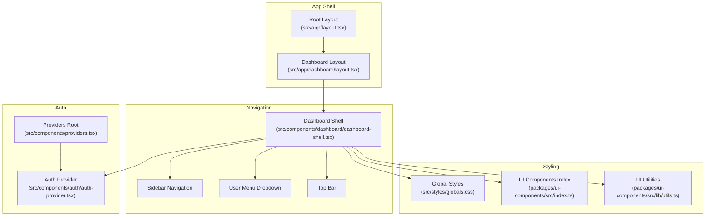
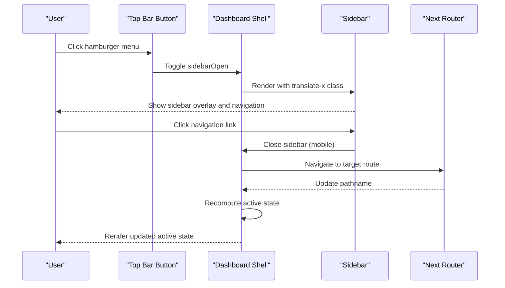
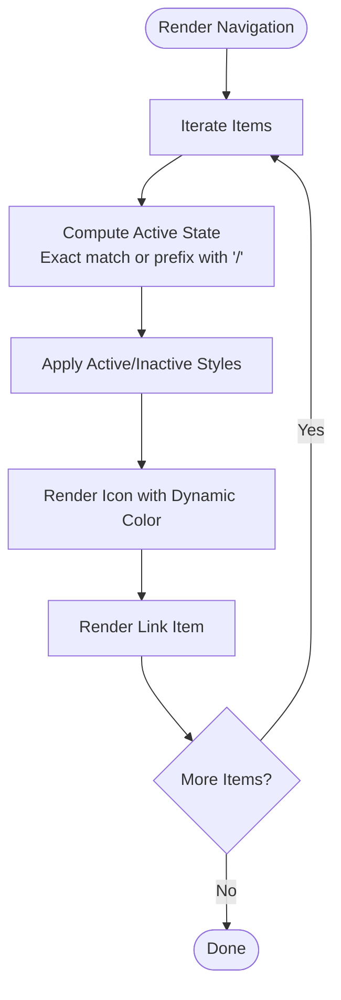
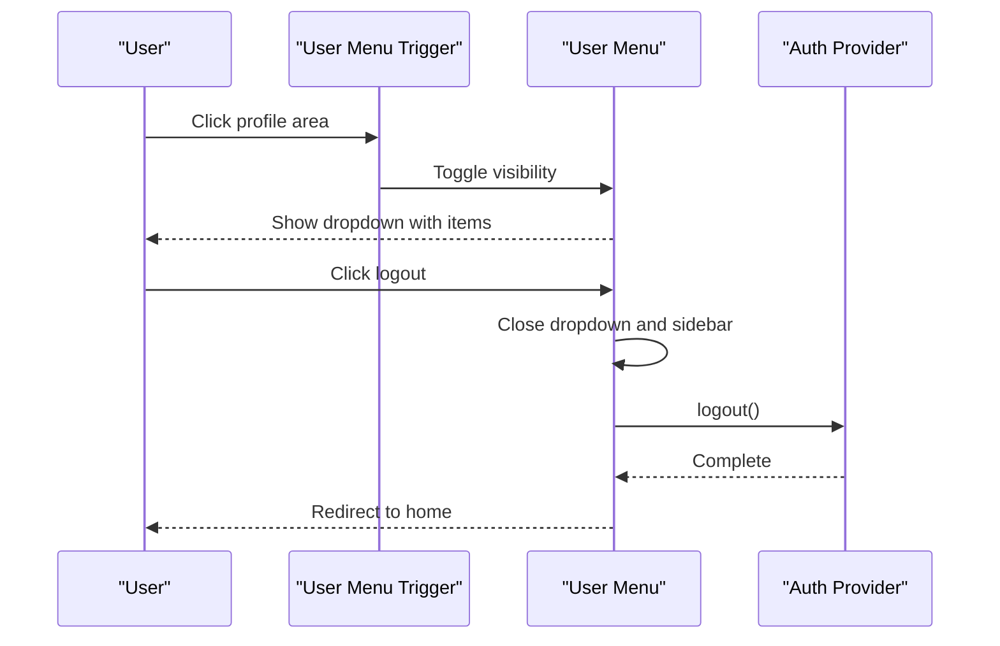
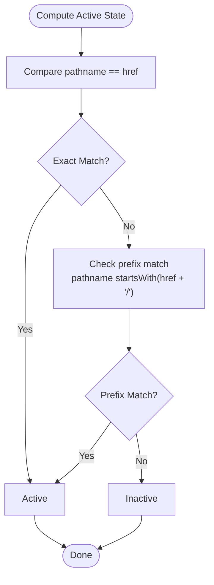
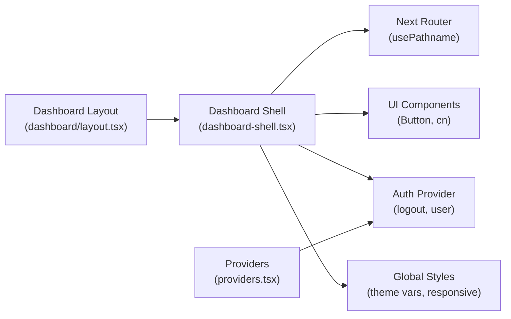

# Navigation System

<cite>
**Referenced Files in This Document**
- [dashboard-shell.tsx](file://src/components/dashboard/dashboard-shell.tsx)
- [dashboard/layout.tsx](file://src/app/dashboard/layout.tsx)
- [auth-provider.tsx](file://src/components/auth/auth-provider.tsx)
- [providers.tsx](file://src/components/providers.tsx)
- [globals.css](file://src/styles/globals.css)
- [ui-components index.ts](file://packages/ui-components/src/index.ts)
- [ui-components utils.ts](file://packages/ui-components/src/lib/utils.ts)
</cite>

## Table of Contents
1. [Introduction](#introduction)
2. [Project Structure](#project-structure)
3. [Core Components](#core-components)
4. [Architecture Overview](#architecture-overview)
5. [Detailed Component Analysis](#detailed-component-analysis)
6. [Dependency Analysis](#dependency-analysis)
7. [Performance Considerations](#performance-considerations)
8. [Troubleshooting Guide](#troubleshooting-guide)
9. [Conclusion](#conclusion)
10. [Appendices](#appendices)

## Introduction
This document explains the navigation system with a focus on the sidebar navigation and user menu components. It covers navigation configuration, active state management, route matching logic, navigation item structure, icon integration, styling patterns, user menu functionality, dropdown behavior, and logout handling. It also provides practical examples for extending the navigation, customizing styles, implementing nested navigation, managing navigation state, click handlers, and accessibility features. The content is designed to be accessible to beginners while offering sufficient technical depth for experienced developers.

## Project Structure
The navigation system is primarily implemented in a single dashboard shell component that renders the sidebar, top bar, and user menu. Authentication state is provided via a dedicated provider, and global styles define the theming and responsive behavior.

**Diagram sources**
- [dashboard-shell.tsx](file://src/components/dashboard/dashboard-shell.tsx#L1-L224)
- [dashboard/layout.tsx](file://src/app/dashboard/layout.tsx#L1-L23)
- [auth-provider.tsx](file://src/components/auth/auth-provider.tsx#L1-L165)
- [providers.tsx](file://src/components/providers.tsx#L1-L55)
- [globals.css](file://src/styles/globals.css#L1-L288)
- [ui-components index.ts](file://packages/ui-components/src/index.ts#L1-L12)
- [ui-components utils.ts](file://packages/ui-components/src/lib/utils.ts#L1-L6)

**Section sources**
- [dashboard-shell.tsx](file://src/components/dashboard/dashboard-shell.tsx#L1-L224)
- [dashboard/layout.tsx](file://src/app/dashboard/layout.tsx#L1-L23)
- [auth-provider.tsx](file://src/components/auth/auth-provider.tsx#L1-L165)
- [providers.tsx](file://src/components/providers.tsx#L1-L55)
- [globals.css](file://src/styles/globals.css#L1-L288)
- [ui-components index.ts](file://packages/ui-components/src/index.ts#L1-L12)
- [ui-components utils.ts](file://packages/ui-components/src/lib/utils.ts#L1-L6)

## Core Components
- Dashboard Shell: Renders the sidebar, top bar, and user menu; manages mobile sidebar visibility, user menu visibility, and active navigation state.
- Navigation Items: Static configuration arrays define sidebar and user navigation items with name, href, and icon.
- Active State Management: Uses pathname comparison to determine active links, including prefix-based matching for nested routes.
- Route Matching Logic: Compares current pathname against item href and supports hierarchical matching via a trailing slash pattern.
- Icon Integration: Lucide icons are rendered alongside navigation labels with dynamic color classes based on active state.
- Styling Patterns: Tailwind classes and theme variables define active/inactive states, hover effects, and responsive behavior.
- User Menu: Displays user profile info and actions; includes logout with confirmation flow and state cleanup.
- Logout Handling: Clears auth cookie, invokes backend logout, resets UI state, and navigates to home.

**Section sources**
- [dashboard-shell.tsx](file://src/components/dashboard/dashboard-shell.tsx#L32-L47)
- [dashboard-shell.tsx](file://src/components/dashboard/dashboard-shell.tsx#L96-L119)
- [dashboard-shell.tsx](file://src/components/dashboard/dashboard-shell.tsx#L140-L170)
- [dashboard-shell.tsx](file://src/components/dashboard/dashboard-shell.tsx#L111-L116)
- [globals.css](file://src/styles/globals.css#L5-L58)

## Architecture Overview
The navigation system integrates routing, state management, and UI rendering. The dashboard layout enforces authentication and wraps pages with the dashboard shell. The shell computes active states from the current pathname and applies styles accordingly. The user menu leverages the auth provider for logout and displays user information.

**Diagram sources**
- [dashboard-shell.tsx](file://src/components/dashboard/dashboard-shell.tsx#L179-L187)
- [dashboard-shell.tsx](file://src/components/dashboard/dashboard-shell.tsx#L74-L77)
- [dashboard-shell.tsx](file://src/components/dashboard/dashboard-shell.tsx#L109-L110)
- [dashboard-shell.tsx](file://src/components/dashboard/dashboard-shell.tsx#L52-L52)

**Section sources**
- [dashboard-shell.tsx](file://src/components/dashboard/dashboard-shell.tsx#L49-L71)
- [dashboard-shell.tsx](file://src/components/dashboard/dashboard-shell.tsx#L179-L187)
- [dashboard-shell.tsx](file://src/components/dashboard/dashboard-shell.tsx#L96-L119)

## Detailed Component Analysis

### Sidebar Navigation
The sidebar navigation is configured as a static array of items. Each item includes a display name, href, and an icon component. The shell iterates over this array to render links. Active state is computed per item using the current pathname.

Key behaviors:
- Active state determination: Exact match or prefix match with a trailing slash for nested routes.
- Styling: Active items receive primary background and foreground colors; inactive items receive muted foreground with hover accent.
- Icons: Icons are sized consistently and colored based on active state.
- Mobile behavior: Overlay appears behind the sidebar and closes it on outside click.

**Diagram sources**
- [dashboard-shell.tsx](file://src/components/dashboard/dashboard-shell.tsx#L32-L47)
- [dashboard-shell.tsx](file://src/components/dashboard/dashboard-shell.tsx#L96-L119)
- [dashboard-shell.tsx](file://src/components/dashboard/dashboard-shell.tsx#L98-L98)
- [dashboard-shell.tsx](file://src/components/dashboard/dashboard-shell.tsx#L103-L108)
- [dashboard-shell.tsx](file://src/components/dashboard/dashboard-shell.tsx#L111-L114)

**Section sources**
- [dashboard-shell.tsx](file://src/components/dashboard/dashboard-shell.tsx#L32-L47)
- [dashboard-shell.tsx](file://src/components/dashboard/dashboard-shell.tsx#L96-L119)
- [dashboard-shell.tsx](file://src/components/dashboard/dashboard-shell.tsx#L98-L98)
- [dashboard-shell.tsx](file://src/components/dashboard/dashboard-shell.tsx#L111-L114)

### User Menu
The user menu displays user profile information and a list of user navigation items. It includes a logout action that triggers the auth provider’s logout function and clears UI state.

Key behaviors:
- Toggling: Clicking the trigger toggles the dropdown visibility.
- User navigation: Links navigate to user-centric pages and close menus on click.
- Logout: Clears UI state, invokes logout, and navigates to home.

**Diagram sources**
- [dashboard-shell.tsx](file://src/components/dashboard/dashboard-shell.tsx#L122-L172)
- [dashboard-shell.tsx](file://src/components/dashboard/dashboard-shell.tsx#L140-L170)
- [dashboard-shell.tsx](file://src/components/dashboard/dashboard-shell.tsx#L157-L167)
- [auth-provider.tsx](file://src/components/auth/auth-provider.tsx#L115-L131)

**Section sources**
- [dashboard-shell.tsx](file://src/components/dashboard/dashboard-shell.tsx#L122-L172)
- [dashboard-shell.tsx](file://src/components/dashboard/dashboard-shell.tsx#L140-L170)
- [auth-provider.tsx](file://src/components/auth/auth-provider.tsx#L115-L131)

### Active State Management and Route Matching
Active state is determined by comparing the current pathname to each navigation item’s href. The logic supports exact matches and prefix-based matches for nested routes.

Implementation highlights:
- Exact match: pathname equals item.href.
- Prefix match: pathname starts with item.href followed by a forward slash, enabling nested routes to highlight parent items.

**Diagram sources**
- [dashboard-shell.tsx](file://src/components/dashboard/dashboard-shell.tsx#L98-L98)

**Section sources**
- [dashboard-shell.tsx](file://src/components/dashboard/dashboard-shell.tsx#L98-L98)

### Styling Patterns and Theming
The navigation uses Tailwind classes and theme variables for consistent styling. Active states switch between primary and muted color schemes, with hover states applying accent backgrounds. Global CSS defines theme tokens and responsive adjustments.

Highlights:
- Active/inactive classes: Primary background/foreground for active; muted foreground with hover accent for inactive.
- Icon coloring: Dynamic color classes based on active state.
- Responsive behavior: Sidebar transforms on larger screens; mobile overlay and close button.
- Theme variables: Primary color and related tokens defined in global CSS.

**Section sources**
- [dashboard-shell.tsx](file://src/components/dashboard/dashboard-shell.tsx#L103-L108)
- [dashboard-shell.tsx](file://src/components/dashboard/dashboard-shell.tsx#L111-L114)
- [dashboard-shell.tsx](file://src/components/dashboard/dashboard-shell.tsx#L74-L77)
- [globals.css](file://src/styles/globals.css#L5-L58)

### Accessibility and Responsive Behavior
Accessibility and responsiveness are handled through:
- Responsive breakpoints: Sidebar transforms off-canvas on small screens and becomes static on large screens.
- Overlay behavior: Mobile overlay closes the sidebar when clicked.
- Keyboard-friendly interactions: Buttons and links are focusable; dropdown visibility is toggled via clicks.
- Screen reader compatibility: Semantic HTML elements and proper focus order are maintained by default Next.js patterns.

Practical considerations:
- Ensure focus moves into the dropdown after opening and returns to the trigger after closing.
- Add aria-expanded attributes to the trigger element for the dropdown.
- Provide skip links for main content to improve keyboard navigation.

**Section sources**
- [dashboard-shell.tsx](file://src/components/dashboard/dashboard-shell.tsx#L66-L71)
- [dashboard-shell.tsx](file://src/components/dashboard/dashboard-shell.tsx#L74-L77)
- [dashboard-shell.tsx](file://src/components/dashboard/dashboard-shell.tsx#L127-L127)
- [dashboard-shell.tsx](file://src/components/dashboard/dashboard-shell.tsx#L140-L140)

## Dependency Analysis
The navigation system depends on:
- Next.js routing hooks for pathname and navigation.
- UI components for buttons and styling utilities.
- Auth provider for user state and logout.
- Global styles for theme tokens and responsive behavior.

**Diagram sources**
- [dashboard-shell.tsx](file://src/components/dashboard/dashboard-shell.tsx#L1-L30)
- [providers.tsx](file://src/components/providers.tsx#L1-L55)
- [dashboard/layout.tsx](file://src/app/dashboard/layout.tsx#L1-L23)
- [globals.css](file://src/styles/globals.css#L1-L288)

**Section sources**
- [dashboard-shell.tsx](file://src/components/dashboard/dashboard-shell.tsx#L1-L30)
- [providers.tsx](file://src/components/providers.tsx#L1-L55)
- [dashboard/layout.tsx](file://src/app/dashboard/layout.tsx#L1-L23)
- [globals.css](file://src/styles/globals.css#L1-L288)

## Performance Considerations
- Minimize re-renders: Keep navigation arrays static and avoid unnecessary recomputation.
- Efficient active state checks: Use simple string comparisons; avoid heavy computations in render loops.
- Conditional rendering: Only render the user menu dropdown when visible to reduce DOM nodes.
- CSS transitions: Keep transition durations reasonable to maintain perceived performance.

## Troubleshooting Guide
Common issues and resolutions:
- Active state not updating: Verify pathname is being read correctly and that route matching logic aligns with your URL structure.
- Icons not visible: Ensure Lucide icons are imported and rendered with appropriate sizing classes.
- User menu not closing: Confirm click handlers properly toggle visibility and close the sidebar when navigating.
- Logout not working: Check that the auth provider’s logout function clears cookies and redirects appropriately.

**Section sources**
- [dashboard-shell.tsx](file://src/components/dashboard/dashboard-shell.tsx#L98-L98)
- [dashboard-shell.tsx](file://src/components/dashboard/dashboard-shell.tsx#L111-L114)
- [dashboard-shell.tsx](file://src/components/dashboard/dashboard-shell.tsx#L140-L170)
- [auth-provider.tsx](file://src/components/auth/auth-provider.tsx#L115-L131)

## Conclusion
The navigation system combines a clean configuration-driven approach with robust active state management and responsive behavior. By leveraging Next.js routing, UI components, and global theming, it provides a scalable foundation for sidebar navigation and user menus. Extending the system involves adding items to the configuration arrays, integrating icons, and ensuring route matching aligns with your application’s URL structure.

## Appendices

### Practical Examples

- Adding a new navigation item:
  - Extend the navigation array with a new item containing name, href, and icon.
  - Ensure the href matches your route structure.
  - Verify active state highlighting works with exact or prefix matching.

- Customizing navigation styles:
  - Adjust active/inactive classes in the link rendering to change colors or spacing.
  - Modify icon sizing and margins to fit your design.
  - Use theme variables from global CSS for consistent color application.

- Implementing nested navigation:
  - Use the existing prefix-based matching to highlight parent items when on child routes.
  - Consider grouping related items under a single parent to improve discoverability.

- Managing navigation state:
  - Keep sidebarOpen and userMenuOpen state local to the shell component.
  - Close menus on navigation to improve UX on mobile devices.

- Click handlers and accessibility:
  - Ensure dropdowns close after navigation.
  - Add aria-expanded attributes to the user menu trigger.
  - Provide keyboard navigation support by focusing the dropdown on open.

**Section sources**
- [dashboard-shell.tsx](file://src/components/dashboard/dashboard-shell.tsx#L32-L47)
- [dashboard-shell.tsx](file://src/components/dashboard/dashboard-shell.tsx#L96-L119)
- [dashboard-shell.tsx](file://src/components/dashboard/dashboard-shell.tsx#L140-L170)
- [globals.css](file://src/styles/globals.css#L5-L58)