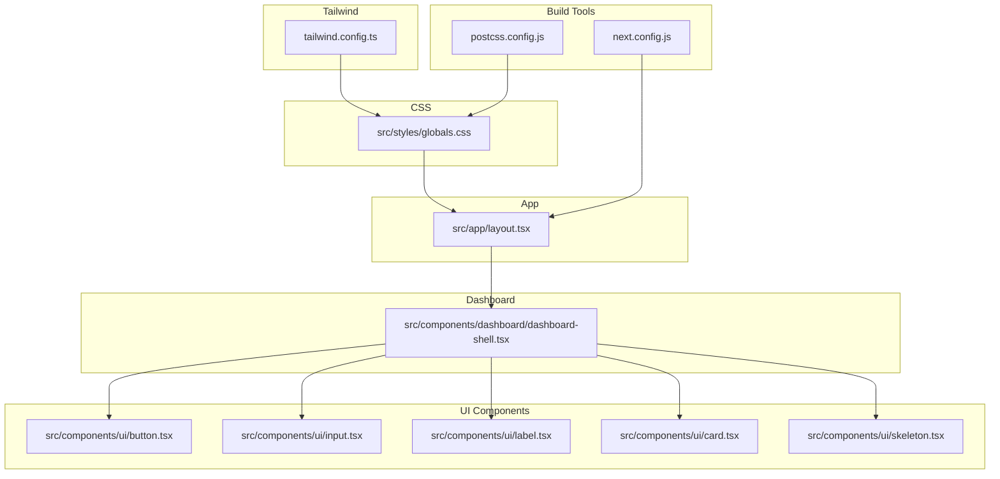
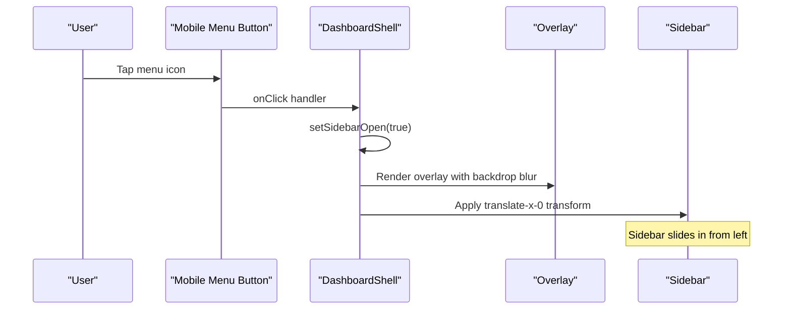
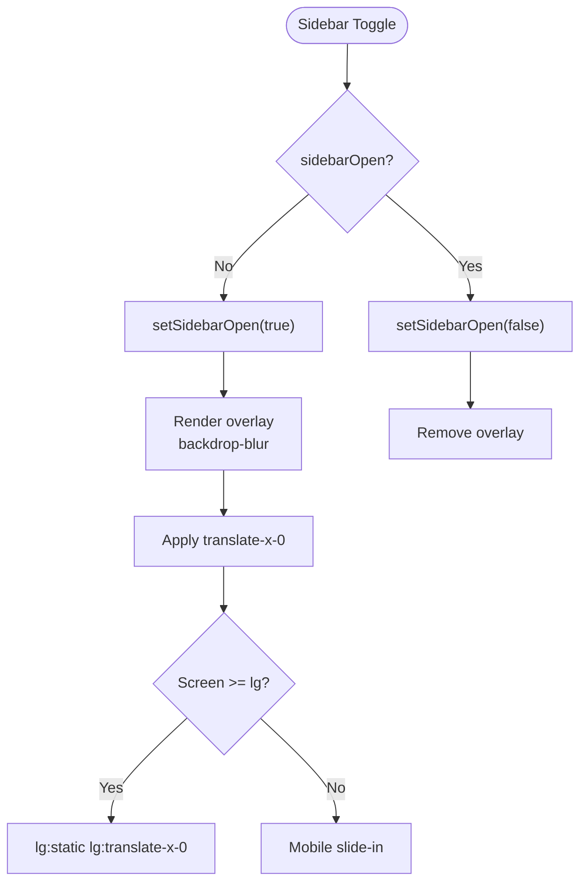
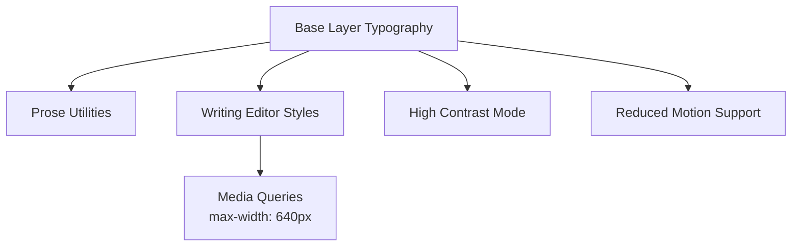
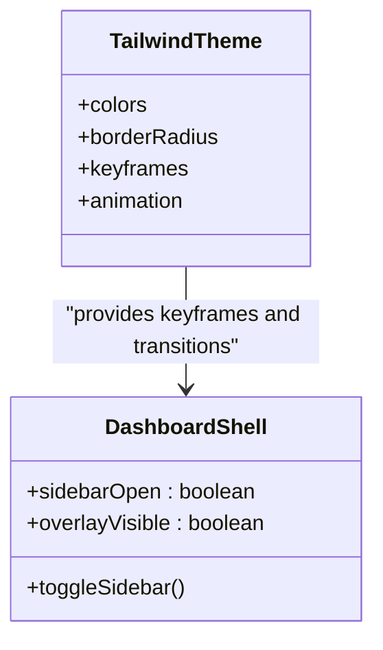
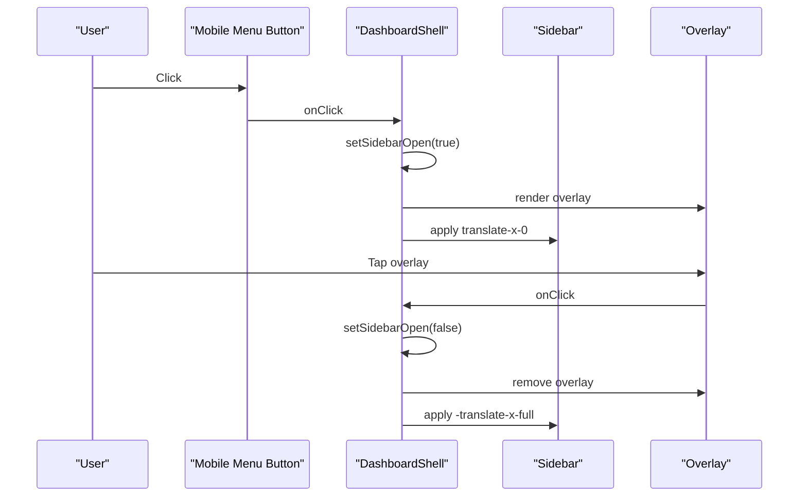
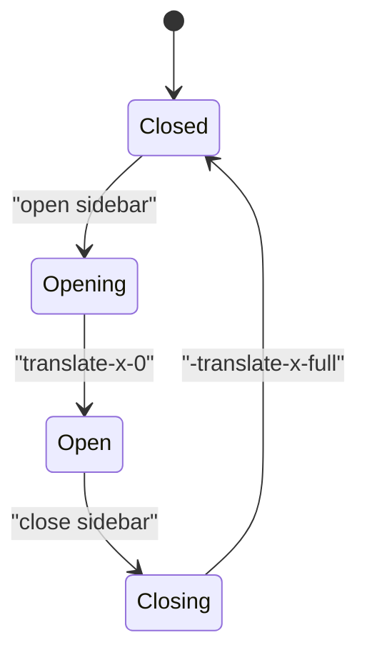
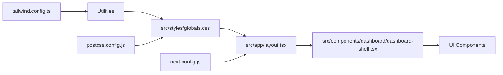

# Responsive Design Implementation

<cite>
**Referenced Files in This Document**
- [tailwind.config.ts](file://tailwind.config.ts)
- [globals.css](file://src/styles/globals.css)
- [layout.tsx](file://src/app/layout.tsx)
- [dashboard-shell.tsx](file://src/components/dashboard/dashboard-shell.tsx)
- [button.tsx](file://src/components/ui/button.tsx)
- [input.tsx](file://src/components/ui/input.tsx)
- [label.tsx](file://src/components/ui/label.tsx)
- [card.tsx](file://src/components/ui/card.tsx)
- [skeleton.tsx](file://src/components/ui/skeleton.tsx)
- [utils.ts](file://src/lib/utils.ts)
- [next.config.js](file://next.config.js)
- [postcss.config.js](file://postcss.config.js)
</cite>

## Table of Contents
1. [Introduction](#introduction)
2. [Project Structure](#project-structure)
3. [Core Components](#core-components)
4. [Architecture Overview](#architecture-overview)
5. [Detailed Component Analysis](#detailed-component-analysis)
6. [Dependency Analysis](#dependency-analysis)
7. [Performance Considerations](#performance-considerations)
8. [Troubleshooting Guide](#troubleshooting-guide)
9. [Conclusion](#conclusion)
10. [Appendices](#appendices)

## Introduction
This document explains the responsive design implementation with a mobile-first approach and adaptive layouts. It covers the breakpoint system, mobile sidebar behavior, responsive typography, transform animations, overlay effects, mobile navigation patterns, responsive state management, CSS transitions, and performance considerations. Practical examples show how to customize breakpoints, modify animations, and optimize mobile performance. Cross-device compatibility, viewport handling, and mobile-specific optimizations are addressed to ensure accessibility for beginners while providing technical depth for experienced developers.

## Project Structure
The responsive system spans Tailwind configuration, global CSS, Next.js app layout, and UI components:
- Tailwind configuration defines theme, containers, colors, border radius, keyframes, and animations.
- Global CSS applies base styles, responsive text sizing, reduced motion support, and high contrast mode.
- The app layout sets up fonts and global providers.
- Dashboard shell implements a mobile-first sidebar with overlay, transforms, and responsive breakpoints.
- UI components provide reusable, accessible building blocks with responsive variants.

**Diagram sources**
- [tailwind.config.ts](file://tailwind.config.ts#L1-L133)
- [globals.css](file://src/styles/globals.css#L1-L288)
- [layout.tsx](file://src/app/layout.tsx#L1-L102)
- [dashboard-shell.tsx](file://src/components/dashboard/dashboard-shell.tsx#L1-L224)
- [button.tsx](file://src/components/ui/button.tsx#L1-L55)
- [input.tsx](file://src/components/ui/input.tsx#L1-L24)
- [label.tsx](file://src/components/ui/label.tsx#L1-L23)
- [card.tsx](file://src/components/ui/card.tsx#L1-L78)
- [skeleton.tsx](file://src/components/ui/skeleton.tsx#L1-L17)
- [next.config.js](file://next.config.js#L1-L56)
- [postcss.config.js](file://postcss.config.js#L1-L7)

**Section sources**
- [tailwind.config.ts](file://tailwind.config.ts#L1-L133)
- [globals.css](file://src/styles/globals.css#L1-L288)
- [layout.tsx](file://src/app/layout.tsx#L1-L102)
- [dashboard-shell.tsx](file://src/components/dashboard/dashboard-shell.tsx#L1-L224)
- [button.tsx](file://src/components/ui/button.tsx#L1-L55)
- [input.tsx](file://src/components/ui/input.tsx#L1-L24)
- [label.tsx](file://src/components/ui/label.tsx#L1-L23)
- [card.tsx](file://src/components/ui/card.tsx#L1-L78)
- [skeleton.tsx](file://src/components/ui/skeleton.tsx#L1-L17)
- [next.config.js](file://next.config.js#L1-L56)
- [postcss.config.js](file://postcss.config.js#L1-L7)

## Core Components
- Tailwind configuration: Defines container widths, color palette, border radius, keyframes, and animations. Includes custom animations for slide-in/out and fade-in/out.
- Global CSS: Provides base layer styles, prose typography utilities, writing/editor styles, drag-and-drop visuals, AI status indicators, responsive text sizes, high contrast mode, and reduced motion support.
- Dashboard shell: Implements a mobile-first sidebar with overlay, transform transitions, and responsive breakpoints. Uses state to manage visibility and integrates with navigation.
- UI components: Provide consistent, accessible, and responsive primitives (button, input, label, card, skeleton) with Tailwind-based styling and variant systems.

Key responsive capabilities:
- Breakpoints: lg breakpoint drives desktop behavior; mobile-specific classes apply until lg.
- Transforms: translate-x transforms move the sidebar in and out of view with smooth transitions.
- Overlay: Backdrop blur overlay appears on mobile when the sidebar is open.
- Animations: Slide-in/out and fade animations are defined via Tailwind keyframes and applied to components.

**Section sources**
- [tailwind.config.ts](file://tailwind.config.ts#L10-L129)
- [globals.css](file://src/styles/globals.css#L60-L288)
- [dashboard-shell.tsx](file://src/components/dashboard/dashboard-shell.tsx#L49-L174)
- [button.tsx](file://src/components/ui/button.tsx#L6-L33)
- [input.tsx](file://src/components/ui/input.tsx#L7-L20)
- [label.tsx](file://src/components/ui/label.tsx#L6-L8)
- [card.tsx](file://src/components/ui/card.tsx#L4-L16)
- [skeleton.tsx](file://src/components/ui/skeleton.tsx#L3-L12)

## Architecture Overview
The responsive architecture combines Tailwind’s utility classes with component-level state and CSS transitions. The dashboard shell toggles a sidebar using a boolean state, applying transform classes and an overlay conditionally. Global CSS ensures typography and interaction states adapt across devices. Tailwind animations provide lightweight motion primitives.

**Diagram sources**
- [dashboard-shell.tsx](file://src/components/dashboard/dashboard-shell.tsx#L64-L77)
- [dashboard-shell.tsx](file://src/components/dashboard/dashboard-shell.tsx#L180-L187)

**Section sources**
- [dashboard-shell.tsx](file://src/components/dashboard/dashboard-shell.tsx#L49-L174)

## Detailed Component Analysis

### Breakpoint System and Container Behavior
- Container configuration centers content and applies padding, with a max-width at larger screens.
- Breakpoint strategy: mobile-first with lg as the desktop breakpoint. Classes like lg:transform-x-0 and lg:static control desktop layout.

Practical customization tips:
- Adjust container padding or max-width in the Tailwind theme to change spacing at wider screens.
- Add new breakpoints by extending the theme screens map and using them in components.

**Section sources**
- [tailwind.config.ts](file://tailwind.config.ts#L10-L17)
- [dashboard-shell.tsx](file://src/components/dashboard/dashboard-shell.tsx#L74-L77)

### Mobile Sidebar Behavior and Overlay Effects
- State-driven visibility: sidebarOpen toggles the sidebar’s transform position.
- Overlay: backdrop blur overlay appears below the sidebar on mobile and closes the sidebar on click.
- Desktop behavior: sidebar becomes static and visible at lg and above.

**Diagram sources**
- [dashboard-shell.tsx](file://src/components/dashboard/dashboard-shell.tsx#L50-L71)
- [dashboard-shell.tsx](file://src/components/dashboard/dashboard-shell.tsx#L74-L77)

**Section sources**
- [dashboard-shell.tsx](file://src/components/dashboard/dashboard-shell.tsx#L50-L71)
- [dashboard-shell.tsx](file://src/components/dashboard/dashboard-shell.tsx#L74-L77)

### Responsive Typography and Text Utilities
- Base layer typography: body inherits background and text colors.
- Prose utilities: prose-ember adjusts headings, paragraphs, lists, code, and pre blocks for content-heavy pages.
- Writing/editor styles: specialized fonts and line heights for writing interfaces.
- Responsive text sizing: media queries adjust writing editor font size at smaller widths.
- High contrast and reduced motion: media queries adapt contrast and motion preferences.

**Diagram sources**
- [globals.css](file://src/styles/globals.css#L60-L150)
- [globals.css](file://src/styles/globals.css#L254-L271)

**Section sources**
- [globals.css](file://src/styles/globals.css#L60-L150)
- [globals.css](file://src/styles/globals.css#L254-L271)

### Transform Animations and CSS Transitions
- Tailwind keyframes define accordion, fade, and slide animations.
- Applied via animation utilities on components and transitions on interactive elements.
- Dashboard sidebar uses transform transitions with duration and easing for smooth slide-in/out.

**Diagram sources**
- [tailwind.config.ts](file://tailwind.config.ts#L94-L127)
- [dashboard-shell.tsx](file://src/components/dashboard/dashboard-shell.tsx#L74-L77)

**Section sources**
- [tailwind.config.ts](file://tailwind.config.ts#L94-L127)
- [dashboard-shell.tsx](file://src/components/dashboard/dashboard-shell.tsx#L74-L77)

### Mobile Navigation Patterns and Conditional Rendering
- Mobile menu button triggers sidebar toggle on small screens.
- Desktop navigation remains static at lg and above.
- Conditional rendering controls overlay and sidebar visibility.

**Diagram sources**
- [dashboard-shell.tsx](file://src/components/dashboard/dashboard-shell.tsx#L64-L71)
- [dashboard-shell.tsx](file://src/components/dashboard/dashboard-shell.tsx#L180-L187)

**Section sources**
- [dashboard-shell.tsx](file://src/components/dashboard/dashboard-shell.tsx#L64-L71)
- [dashboard-shell.tsx](file://src/components/dashboard/dashboard-shell.tsx#L180-L187)

### Responsive State Management
- useState manages sidebarOpen and userMenuOpen.
- Pathname integration helps highlight active navigation items.
- Logout flow updates state and closes menus.

**Diagram sources**
- [dashboard-shell.tsx](file://src/components/dashboard/dashboard-shell.tsx#L50-L51)
- [dashboard-shell.tsx](file://src/components/dashboard/dashboard-shell.tsx#L74-L77)

**Section sources**
- [dashboard-shell.tsx](file://src/components/dashboard/dashboard-shell.tsx#L50-L51)
- [dashboard-shell.tsx](file://src/components/dashboard/dashboard-shell.tsx#L96-L118)

### Responsive Utility Classes and Conditional Rendering Logic
- Utility classes drive responsive behavior: lg:static, lg:translate-x-0, lg:hidden.
- Conditional rendering displays overlay and mobile-only elements only on small screens.
- UI components expose variants for size and style, enabling consistent responsive layouts.

**Section sources**
- [dashboard-shell.tsx](file://src/components/dashboard/dashboard-shell.tsx#L74-L77)
- [dashboard-shell.tsx](file://src/components/dashboard/dashboard-shell.tsx#L85-L92)
- [button.tsx](file://src/components/ui/button.tsx#L21-L26)
- [input.tsx](file://src/components/ui/input.tsx#L12-L13)
- [label.tsx](file://src/components/ui/label.tsx#L6-L8)
- [card.tsx](file://src/components/ui/card.tsx#L10-L11)
- [skeleton.tsx](file://src/components/ui/skeleton.tsx#L9-L9)

### Touch Interaction Patterns and Cross-Device Compatibility
- Touch-friendly targets: buttons and inputs use appropriate sizes and spacing.
- Gesture-friendly overlays: tapping the overlay dismisses the sidebar.
- Cross-device compatibility: viewport meta and Next.js image optimization configured in next.config.js.
- Font loading: Inter and Merriweather fonts configured in the app layout.

**Section sources**
- [dashboard-shell.tsx](file://src/components/dashboard/dashboard-shell.tsx#L180-L187)
- [dashboard-shell.tsx](file://src/components/dashboard/dashboard-shell.tsx#L67-L71)
- [next.config.js](file://next.config.js#L7-L23)
- [layout.tsx](file://src/app/layout.tsx#L7-L12)

## Dependency Analysis
The responsive system depends on Tailwind utilities, CSS layers, and component state. Build-time tools (PostCSS, Tailwind) process styles, while runtime state controls mobile behavior.

**Diagram sources**
- [tailwind.config.ts](file://tailwind.config.ts#L1-L133)
- [globals.css](file://src/styles/globals.css#L1-L288)
- [layout.tsx](file://src/app/layout.tsx#L1-L102)
- [dashboard-shell.tsx](file://src/components/dashboard/dashboard-shell.tsx#L1-L224)
- [postcss.config.js](file://postcss.config.js#L1-L7)
- [next.config.js](file://next.config.js#L1-L56)

**Section sources**
- [tailwind.config.ts](file://tailwind.config.ts#L1-L133)
- [globals.css](file://src/styles/globals.css#L1-L288)
- [layout.tsx](file://src/app/layout.tsx#L1-L102)
- [dashboard-shell.tsx](file://src/components/dashboard/dashboard-shell.tsx#L1-L224)
- [postcss.config.js](file://postcss.config.js#L1-L7)
- [next.config.js](file://next.config.js#L1-L56)

## Performance Considerations
- Prefer transform-based animations (translate-x) for GPU acceleration over layout-affecting properties.
- Use reduced motion support to disable animations for users who prefer minimal motion.
- Keep overlay blur subtle and scoped to minimize repaint costs.
- Optimize images and fonts; Next.js image optimization and font configuration improve load performance.
- Consolidate utility classes with cn to avoid unnecessary DOM churn.

[No sources needed since this section provides general guidance]

## Troubleshooting Guide
- Sidebar does not close on overlay tap: verify overlay click handler and state update.
- Animation feels sluggish: check transform duration/easing and ensure hardware acceleration.
- Typography looks off on small screens: confirm media query conditions and responsive text utilities.
- Accessibility issues: ensure focus states, keyboard navigation, and reduced motion compatibility.

**Section sources**
- [dashboard-shell.tsx](file://src/components/dashboard/dashboard-shell.tsx#L67-L71)
- [globals.css](file://src/styles/globals.css#L274-L288)

## Conclusion
The project implements a robust mobile-first responsive design using Tailwind utilities, CSS transitions, and component-level state. The dashboard shell demonstrates effective mobile navigation patterns with overlays and transforms, while global CSS ensures typography and accessibility preferences are respected. By leveraging the provided configuration and components, teams can customize breakpoints, animations, and performance characteristics to meet diverse product needs.

[No sources needed since this section summarizes without analyzing specific files]

## Appendices

### Practical Examples

- Customize breakpoints
  - Extend the container screens or add new breakpoint keys in the Tailwind theme.
  - Reference: [tailwind.config.ts](file://tailwind.config.ts#L14-L17)

- Modify animations
  - Update keyframes and animation durations in the Tailwind theme.
  - Reference: [tailwind.config.ts](file://tailwind.config.ts#L94-L127)

- Optimize mobile performance
  - Use transform-based transitions and avoid layout-affecting properties.
  - Reference: [dashboard-shell.tsx](file://src/components/dashboard/dashboard-shell.tsx#L74-L77)

- Responsive typography adjustments
  - Adjust writing editor styles and media queries for smaller screens.
  - Reference: [globals.css](file://src/styles/globals.css#L254-L259)

- Cross-device compatibility
  - Configure image optimization and fonts in Next.js configuration and layout.
  - References: [next.config.js](file://next.config.js#L7-L23), [layout.tsx](file://src/app/layout.tsx#L7-L12)