# Top Bar Interface

<cite>
**Referenced Files in This Document**
- [landing-page.tsx](file://src/components/landing/landing-page.tsx)
- [dashboard-shell.tsx](file://src/components/dashboard/dashboard-shell.tsx)
- [button.tsx](file://src/components/ui/button.tsx)
- [button.tsx](file://packages/ui-components/src/components/button.tsx)
- [layout.tsx](file://src/app/layout.tsx)
</cite>

## Table of Contents
1. [Introduction](#introduction)
2. [Project Structure](#project-structure)
3. [Core Components](#core-components)
4. [Architecture Overview](#architecture-overview)
5. [Detailed Component Analysis](#detailed-component-analysis)
6. [Dependency Analysis](#dependency-analysis)
7. [Performance Considerations](#performance-considerations)
8. [Troubleshooting Guide](#troubleshooting-guide)
9. [Conclusion](#conclusion)

## Introduction
This document explains the top bar interface implementation across the application, focusing on the header navigation and action buttons. It covers the responsive behavior, interactive elements, search functionality, notification system, and call-to-action buttons. It also documents the mobile hamburger menu, search input styling, and action button patterns. Practical examples show how to customize top bar elements, add new actions, and implement search functionality. State management for mobile responsiveness, button interactions, and form handling are addressed, along with accessibility features, keyboard navigation, and responsive design patterns.

## Project Structure
The top bar appears in two primary contexts:
- Landing page navigation with a mobile hamburger menu and authentication actions
- Dashboard shell with a persistent top bar containing a search input, notification bell, and a call-to-action button

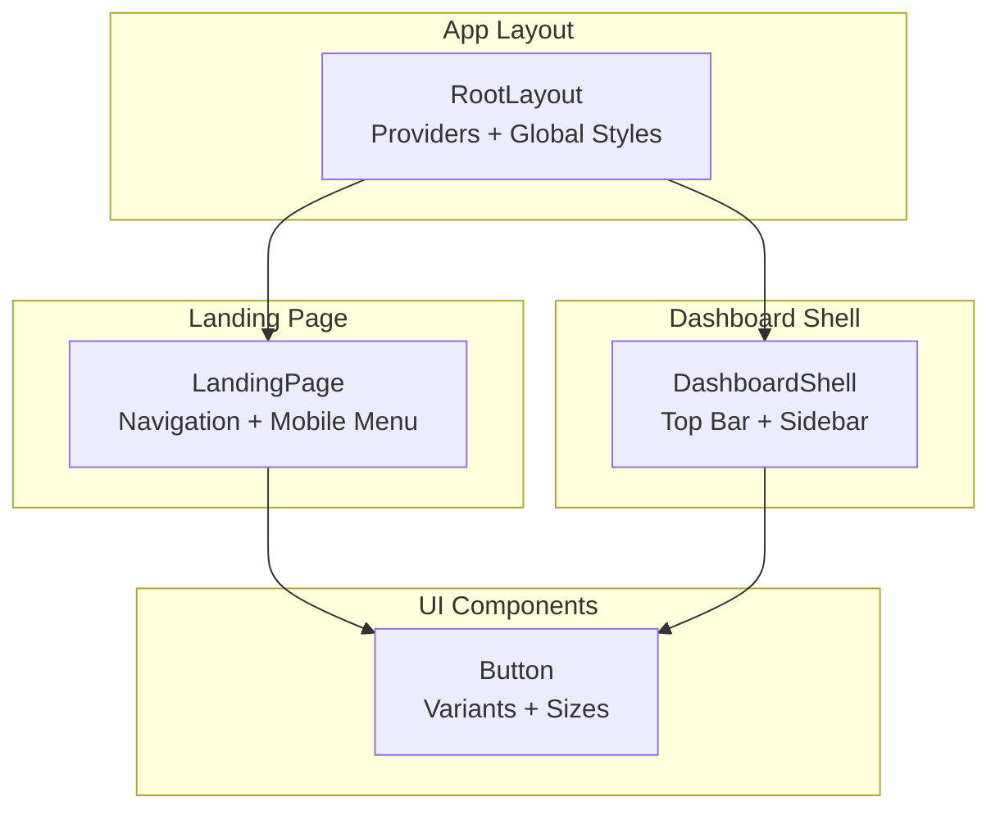

**Diagram sources**
- [landing-page.tsx](file://src/components/landing/landing-page.tsx#L134-L180)
- [dashboard-shell.tsx](file://src/components/dashboard/dashboard-shell.tsx#L179-L215)
- [button.tsx](file://src/components/ui/button.tsx#L6-L33)
- [layout.tsx](file://src/app/layout.tsx#L83-L102)

**Section sources**
- [landing-page.tsx](file://src/components/landing/landing-page.tsx#L134-L180)
- [dashboard-shell.tsx](file://src/components/dashboard/dashboard-shell.tsx#L179-L215)
- [layout.tsx](file://src/app/layout.tsx#L83-L102)

## Core Components
- Landing page navigation: desktop links, mobile hamburger menu, and authentication buttons
- Dashboard top bar: search input, notification bell, and a primary call-to-action button
- Shared Button component: consistent styling and behavior across both contexts

Key implementation highlights:
- Responsive breakpoints: mobile vs. desktop layouts
- Interactive states: open/close menus, hover/focus states
- Accessibility: keyboard navigation, ARIA roles, focus management
- Styling: Tailwind classes for spacing, colors, and responsive behavior

**Section sources**
- [landing-page.tsx](file://src/components/landing/landing-page.tsx#L134-L180)
- [dashboard-shell.tsx](file://src/components/dashboard/dashboard-shell.tsx#L179-L215)
- [button.tsx](file://src/components/ui/button.tsx#L6-L33)

## Architecture Overview
The top bar architecture centers on two complementary components:
- LandingPage navigation handles public site navigation and mobile menu toggling
- DashboardShell top bar provides authenticated user actions and search

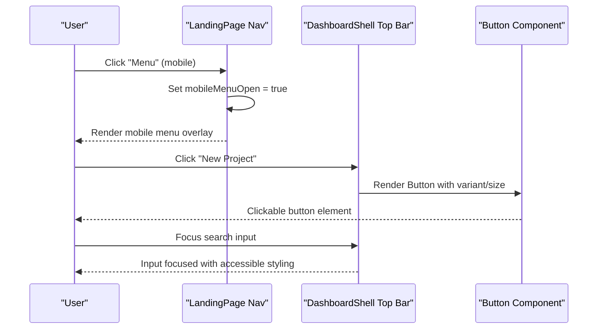

**Diagram sources**
- [landing-page.tsx](file://src/components/landing/landing-page.tsx#L172-L177)
- [dashboard-shell.tsx](file://src/components/dashboard/dashboard-shell.tsx#L203-L208)
- [button.tsx](file://src/components/ui/button.tsx#L41-L52)

## Detailed Component Analysis

### Landing Page Navigation
The landing page navigation provides:
- Brand logo and name
- Desktop navigation links (hidden on mobile)
- Authentication buttons (login/signup)
- Mobile hamburger menu toggle

Responsive behavior:
- Desktop: links and buttons visible side-by-side
- Mobile: hamburger menu replaces desktop links; clicking toggles a full-screen overlay with navigation and auth actions

Accessibility:
- Semantic HTML and focusable elements
- Overlay click closes menu
- Links update internal state to close menu after selection

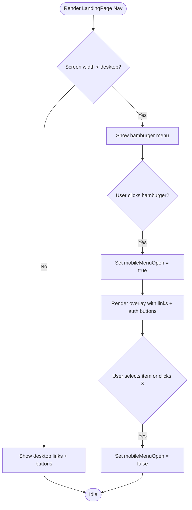

**Diagram sources**
- [landing-page.tsx](file://src/components/landing/landing-page.tsx#L134-L180)
- [landing-page.tsx](file://src/components/landing/landing-page.tsx#L182-L244)

**Section sources**
- [landing-page.tsx](file://src/components/landing/landing-page.tsx#L134-L180)
- [landing-page.tsx](file://src/components/landing/landing-page.tsx#L182-L244)

### Dashboard Shell Top Bar
The dashboard top bar includes:
- Hamburger menu for sidebar on small screens
- Search input with icon and placeholder
- Action buttons: primary call-to-action and notification bell with badge

State management:
- Sidebar open/close via local state
- Search input managed locally (placeholder indicates functionality)
- Notification bell with visual indicator

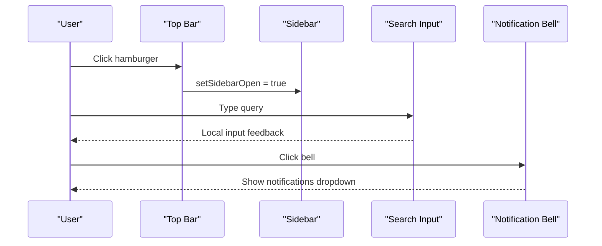

**Diagram sources**
- [dashboard-shell.tsx](file://src/components/dashboard/dashboard-shell.tsx#L179-L215)

**Section sources**
- [dashboard-shell.tsx](file://src/components/dashboard/dashboard-shell.tsx#L179-L215)

### Button Component
Both top bars rely on a shared Button component that standardizes:
- Variants: default, destructive, outline, secondary, ghost, link
- Sizes: default, sm, lg, icon
- Behavior: slot-based composition for semantic elements (e.g., Link)

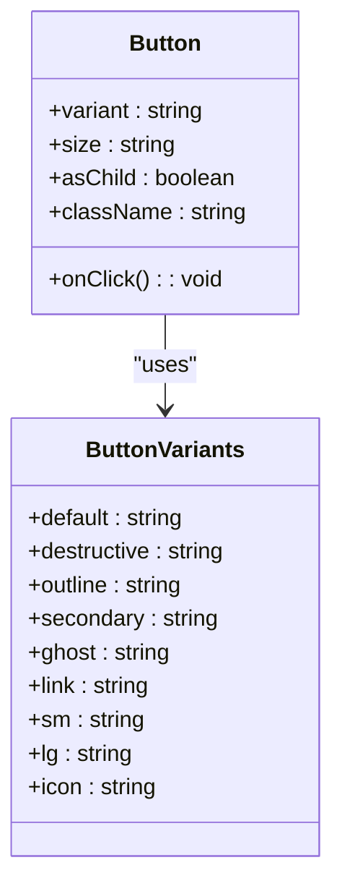

**Diagram sources**
- [button.tsx](file://src/components/ui/button.tsx#L6-L33)
- [button.tsx](file://src/components/ui/button.tsx#L41-L52)

**Section sources**
- [button.tsx](file://src/components/ui/button.tsx#L6-L33)
- [button.tsx](file://src/components/ui/button.tsx#L41-L52)

### Search Functionality
The dashboard top bar includes a styled search input:
- Icon inside input field
- Placeholder text guiding usage
- Focus ring and accent background for visibility

Practical customization examples:
- Replace placeholder text with localized strings
- Add input handlers to capture query and trigger filtering
- Integrate with a search service or route to a dedicated search page

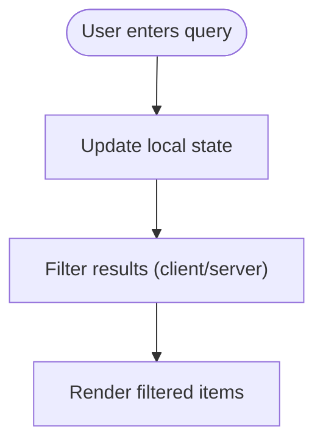

**Diagram sources**
- [dashboard-shell.tsx](file://src/components/dashboard/dashboard-shell.tsx#L190-L199)

**Section sources**
- [dashboard-shell.tsx](file://src/components/dashboard/dashboard-shell.tsx#L190-L199)

### Notification System
The dashboard top bar includes a notification bell with a visual indicator:
- Bell icon with absolute positioned dot
- Dropdown menu for notifications (not shown here but follows similar patterns)

Practical customization examples:
- Bind to a real notifications API
- Add unread count badges
- Implement dismissal actions per notification

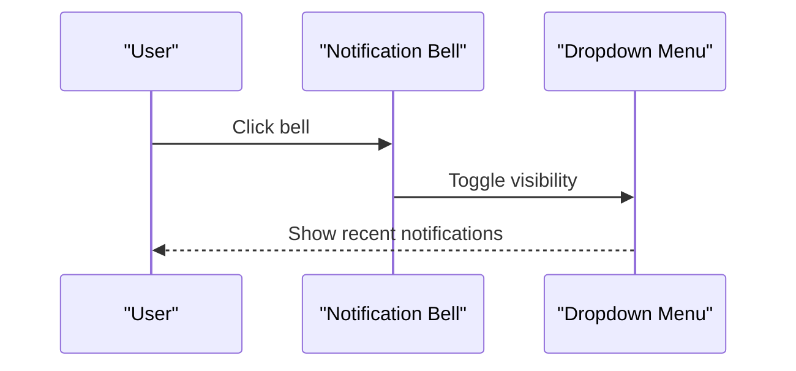

**Diagram sources**
- [dashboard-shell.tsx](file://src/components/dashboard/dashboard-shell.tsx#L210-L213)

**Section sources**
- [dashboard-shell.tsx](file://src/components/dashboard/dashboard-shell.tsx#L210-L213)

### Call-to-Action Buttons
The dashboard top bar includes a primary CTA button:
- Uses the Button component with appropriate variant/size
- Wraps a Link for navigation to a new project creation page

Practical customization examples:
- Change destination route based on user role or permissions
- Add tooltips or keyboard shortcuts
- Dynamically adjust label text based on context

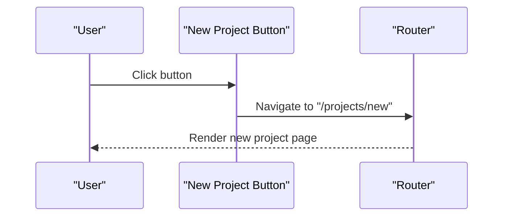

**Diagram sources**
- [dashboard-shell.tsx](file://src/components/dashboard/dashboard-shell.tsx#L203-L208)

**Section sources**
- [dashboard-shell.tsx](file://src/components/dashboard/dashboard-shell.tsx#L203-L208)

### Mobile Hamburger Menu
The landing page implements a mobile hamburger menu:
- Toggles a full-screen overlay with navigation and auth actions
- Closes when selecting an item or clicking the close button

Practical customization examples:
- Add more navigation items or nested menus
- Integrate with authentication state to show profile or logout
- Add keyboard navigation support (arrow keys, Escape)

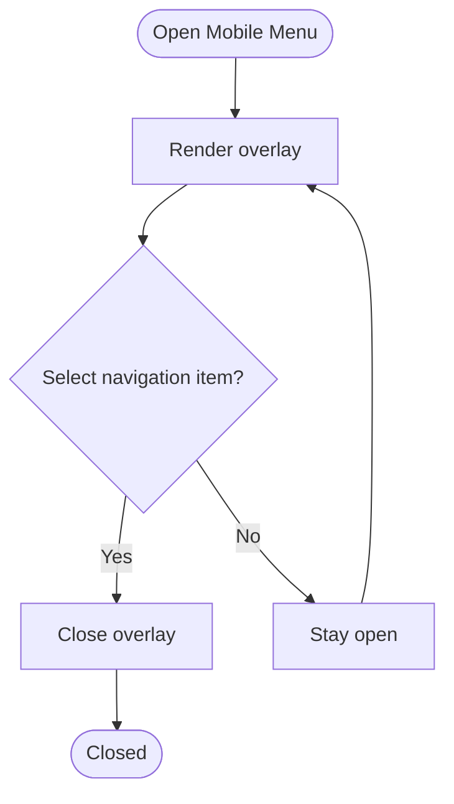

**Diagram sources**
- [landing-page.tsx](file://src/components/landing/landing-page.tsx#L172-L177)
- [landing-page.tsx](file://src/components/landing/landing-page.tsx#L182-L244)

**Section sources**
- [landing-page.tsx](file://src/components/landing/landing-page.tsx#L172-L177)
- [landing-page.tsx](file://src/components/landing/landing-page.tsx#L182-L244)

### Search Input Styling
The dashboard top bar search input is styled with:
- Left-aligned icon
- Accent background and focus ring
- Rounded corners and padding for readability

Practical customization examples:
- Adjust width constraints for different screen sizes
- Add debouncing for live search
- Integrate with autocomplete suggestions

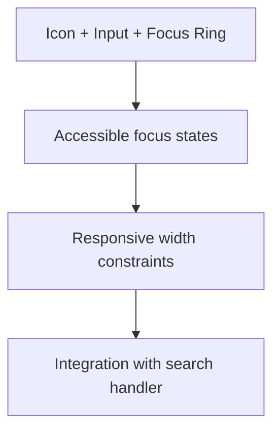

**Diagram sources**
- [dashboard-shell.tsx](file://src/components/dashboard/dashboard-shell.tsx#L190-L199)

**Section sources**
- [dashboard-shell.tsx](file://src/components/dashboard/dashboard-shell.tsx#L190-L199)

### Action Button Patterns
The Button component supports multiple patterns:
- Variant: default, ghost, outline, secondary, destructive, link
- Size: default, sm, lg, icon
- Composition: asChild enables semantic elements like Link

Practical customization examples:
- Use ghost for subtle actions
- Use icon size for compact controls
- Compose with Link for navigation without extra wrappers

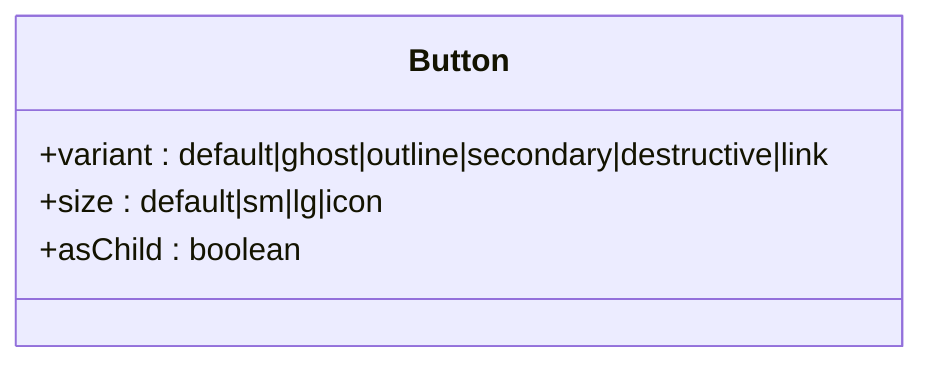

**Diagram sources**
- [button.tsx](file://src/components/ui/button.tsx#L6-L33)

**Section sources**
- [button.tsx](file://src/components/ui/button.tsx#L6-L33)

## Dependency Analysis
The top bar components depend on:
- Shared Button component for consistent styling and behavior
- Next.js routing for navigation
- Lucide icons for visual elements
- Tailwind classes for responsive design

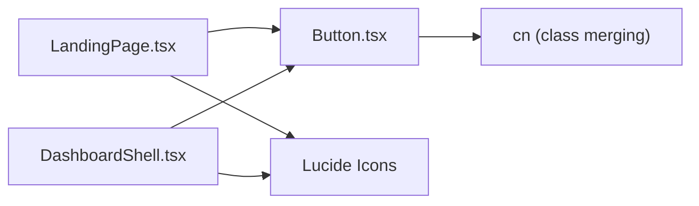

**Diagram sources**
- [landing-page.tsx](file://src/components/landing/landing-page.tsx#L5-L23)
- [dashboard-shell.tsx](file://src/components/dashboard/dashboard-shell.tsx#L6-L28)
- [button.tsx](file://src/components/ui/button.tsx#L4-L4)

**Section sources**
- [landing-page.tsx](file://src/components/landing/landing-page.tsx#L5-L23)
- [dashboard-shell.tsx](file://src/components/dashboard/dashboard-shell.tsx#L6-L28)
- [button.tsx](file://src/components/ui/button.tsx#L4-L4)

## Performance Considerations
- Keep mobile overlays lightweight; render only when needed
- Debounce search input to avoid excessive re-renders
- Use CSS transitions for smooth sidebar animations
- Lazy-load icons if bundle size becomes a concern

## Troubleshooting Guide
Common issues and resolutions:
- Mobile menu does not close: ensure overlay click handler updates state
- Button styles not applied: verify variant/size props and class merging
- Search input not focused: confirm focus ring styles and keyboard navigation
- Notification bell not interactive: check event handlers and dropdown rendering

**Section sources**
- [landing-page.tsx](file://src/components/landing/landing-page.tsx#L182-L244)
- [dashboard-shell.tsx](file://src/components/dashboard/dashboard-shell.tsx#L179-L215)
- [button.tsx](file://src/components/ui/button.tsx#L6-L33)

## Conclusion
The top bar interface combines responsive navigation, actionable elements, and accessible interactions. The landing page navigation and dashboard top bar share a consistent Button component and responsive patterns. By leveraging the provided patterns and state management, teams can extend functionality with minimal effort while maintaining a cohesive user experience.